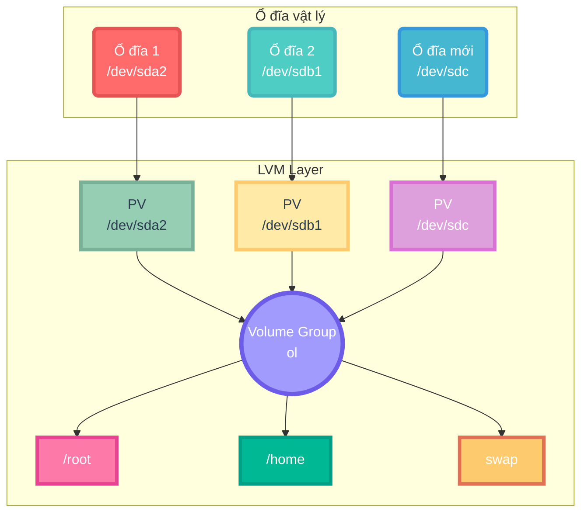
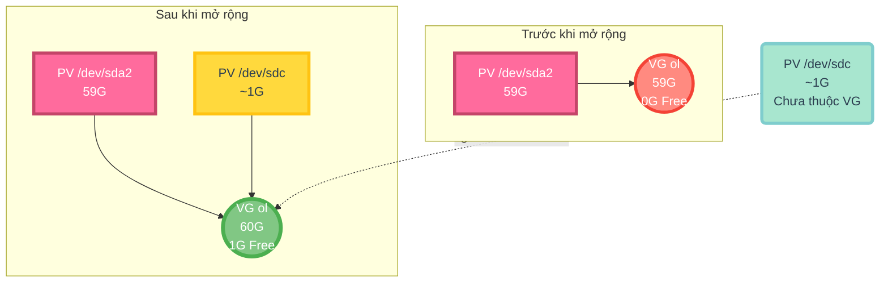
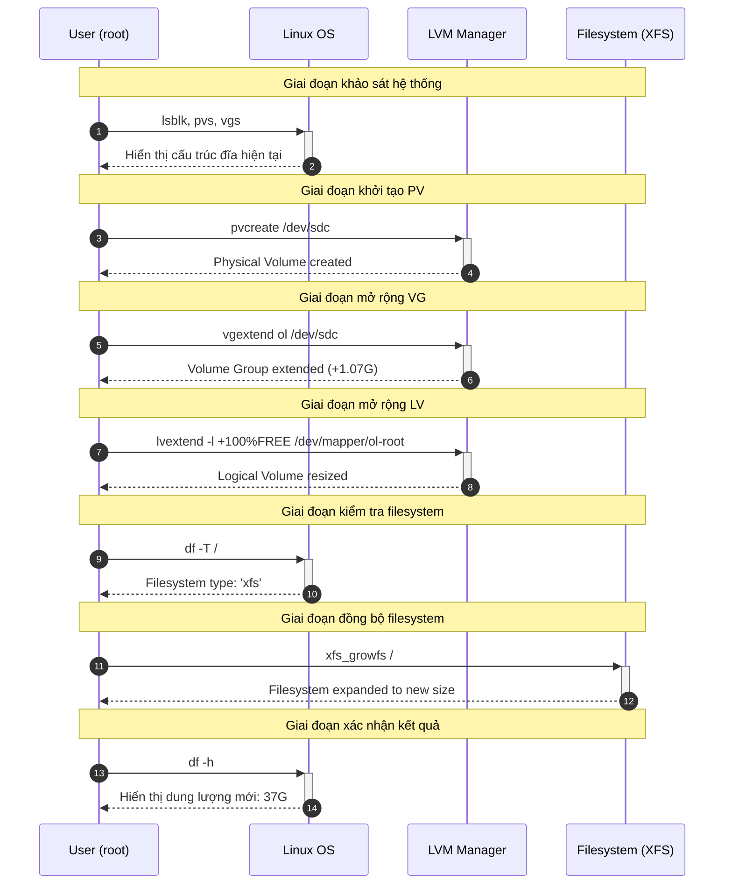

# **I. Hướng dẫn mở rộng root filesystem trên Linux sử dụng LVM**

### **Mục tiêu**

Tăng dung lượng Logical Volume `ol-root` (root `/`) bằng cách sử dụng **phần trăm dung lượng trống**, kết hợp với ổ đĩa mới `/dev/sdc`.

---

## **Thực hiện mở rộng**

### **1️⃣ Kiểm tra trạng thái ổ đĩa và phân vùng**

```bash
Last login: Fri Aug  1 08:58:41 2025 from 192.168.49.1
[root@vbox ~]# lsblk
NAME              MAJ:MIN RM  SIZE RO TYPE MOUNTPOINT
sda                 8:0    0   60G  0 disk
├─sda1              8:1    0    1G  0 part /boot
└─sda2              8:2    0   59G  0 part
  ├─ol-root       252:0    0 35.6G  0 lvm  /
  ├─ol-swap       252:1    0    6G  0 lvm  [SWAP]
  └─ol-home       252:3    0 17.4G  0 lvm  /home
sdb                 8:16   0    1G  0 disk
└─vg_data-lv_home 252:2    0  100M  0 lvm
sdc                 8:32   0  1.1G  0 disk
sr0                11:0    1 1024M  0 rom
```

✅ Xác định ổ đĩa mới `/dev/sdc` trống và VG chứa root là `ol`.

---

### **2️⃣ Khởi tạo Physical Volume (PV)**

```bash
[root@vbox ~]# pvcreate /dev/sdc
  Physical volume "/dev/sdc" successfully created.

[root@vbox ~]# pvs
  PV         VG      Fmt  Attr PSize    PFree
  /dev/sda2  ol      lvm2 a--   <59.00g      0
  /dev/sdb   vg_data lvm2 a--  1020.00m 920.00m
  /dev/sdc           lvm2 ---    <1.07g  <1.07g
```

#### **🔍 Giải thích các thông số trong `pvs`**
| Cột   | Mô tả                                                                 |
|-------|-----------------------------------------------------------------------|
| **PV**  | Tên Physical Volume (ổ đĩa vật lý đã được LVM hóa)                     |
| **VG**  | Tên Volume Group mà PV thuộc về (trống = chưa thuộc VG nào)             |
| **Fmt** | Định dạng LVM (luôn là `lvm2` trên hệ thống hiện đại)                   |
| **Attr**| Thuộc tính PV:<br>`a` = allocatable (có thể cấp phát),<br>`-` = không có tính năng đặc biệt |
| **PSize**| Tổng kích thước PV (sau khi trừ metadata LVM)                          |
| **PFree**| Dung lượng trống trên PV                                              |

✅ `/dev/sdc` đã được khởi tạo thành PV (chưa thuộc VG nào).

---

### **3️⃣ Mở rộng Volume Group (VG)**

```bash
[root@vbox ~]# vgextend ol /dev/sdc
  Volume group "ol" successfully extended

[root@vbox ~]# vgs
  VG      #PV #LV #SN Attr   VSize    VFree
  ol        2   3   0 wz--n-   60.06g  <1.07g
  vg_data   1   1   0 wz--n- 1020.00m 920.00m
```

#### **🔍 Giải thích các thông số trong `vgs`**
| Cột   | Mô tả                                                                 |
|-------|-----------------------------------------------------------------------|
| **VG**   | Tên Volume Group                                                     |
| **#PV**  | Số lượng Physical Volume trong VG                                    |
| **#LV**  | Số lượng Logical Volume trong VG                                     |
| **#SN**  | Số lượng snapshot (nếu có)                                           |
| **Attr** | Thuộc tính VG:<br>`w` = writable,<br>`z` = resizable,<br>`n` = no snapshots |
| **VSize**| Tổng kích thước VG (sau khi cộng tất cả PV)                          |
| **VFree**| Dung lượng trống trong VG                                            |

✅ VG `ol` đã tăng thêm 1 PV và có thêm **~1GB dung lượng trống**.

---

### **4️⃣ Mở rộng Logical Volume (LV) bằng % - So sánh trực quan**

#### **📌 Bảng so sánh các phương pháp mở rộng LV**
| Phương pháp | Công thức             | Ví dụ minh họa (VG=60GB, Free=1GB, LV=35.61GB) | LV sau mở rộng | VG Free sau |
|-------------|-----------------------|------------------------------------------------|----------------|-------------|
| **%FREE**   | `-l +X%FREE`          | `lvextend -l +50%FREE /dev/mapper/ol-root`     | 36.11GB (+0.5GB) | 0.5GB       |
| **%VG**     | `-l X%VG`             | `lvextend -l 80%VG /dev/mapper/ol-root`        | 48GB           | 12GB*       |
| **%LV**     | `-L +X%LV`            | `lvextend -L +20%LV /dev/mapper/ol-root`       | 42.73GB (+7.12GB) | 0GB**       |

> **\* Lưu ý:**  
> - **%VG 80%** = 80% tổng dung lượng VG (60GB × 0.8 = 48GB).  
> - **%LV 20%** chỉ thành công nếu VG có đủ dung lượng trống (trong ví dụ này cần 7.12GB nhưng chỉ có 1GB → **thất bại**).  
> - **%FREE 50%** luôn an toàn vì chỉ sử dụng dung lượng trống hiện có.

---

#### **💡 Chi tiết từng phương pháp**

##### **1️⃣ %FREE – Phần trăm dung lượng trống của VG**
```bash
lvextend -l +100%FREE /dev/mapper/ol-root
```
- **Công thức**: `+X%FREE` = Tăng thêm **X%** của dung lượng trống trong VG.
- **Ví dụ**:  
  VG `ol` còn trống **1GB** → `+100%FREE` = Tăng thêm **1GB** cho LV.
- **Ưu điểm**: Luôn đảm bảo không vượt quá dung lượng trống.

---

##### **2️⃣ %VG – Phần trăm tổng dung lượng VG**
```bash
lvextend -l 80%VG /dev/mapper/ol-root
```
- **Công thức**: `X%VG` = Đặt kích thước LV bằng **X%** tổng dung lượng VG.
- **Ví dụ**:  
  VG `ol` có tổng **60GB** → `80%VG` = LV sẽ chiếm **48GB** (dù đang ở mức bao nhiêu).
- **Cảnh báo**: Có thể thất bại nếu VG không đủ dung lượng trống.

---

##### **3️⃣ %LV – Phần trăm so với kích thước hiện tại của LV**
```bash
lvextend -L +20%LV /dev/mapper/ol-root
```
- **Công thức**: `+X%LV` = Tăng thêm **X%** kích thước LV hiện tại.
- **Ví dụ**:  
  LV `ol-root` đang là **35.61GB** → `+20%LV` = Tăng thêm **7.12GB** (35.61 × 0.2).
- **Hạn chế**: Dễ thất bại nếu VG không đủ dung lượng trống.

---

### **5️⃣ Kiểm tra loại filesystem**

```bash
[root@vbox ~]# df -T /
Filesystem          Type 1K-blocks    Used Available Use% Mounted on
/dev/mapper/ol-root xfs   37320904 8510184  28810720  23% /
```

#### **🔍 Giải thích cột trong `df -T`**
| Cột          | Mô tả                                                                 |
|--------------|-----------------------------------------------------------------------|
| **Filesystem**| Thiết bị hoặc mount point                                            |
| **Type**      | Loại filesystem (XFS, ext4, btrfs, v.v.)                              |
| **1K-blocks** | Tổng số block 1KB                                                     |
| **Used**      | Dung lượng đã dùng                                                   |
| **Available** | Dung lượng trống                                                     |
| **Use%**      | Phần trăm sử dụng                                                    |
| **Mounted on**| Điểm mount                                                           |

> **💡 Chú thích:**
>
> * Với **ext4**, mở rộng filesystem dùng:
>
>   ```bash
>   resize2fs /dev/mapper/ol-root
>   ```
>
>   (có thể chỉ định trực tiếp block device hoặc mount point).
> * Với **XFS**, bắt buộc dùng:
>
>   ```bash
>   xfs_growfs /
>   ```
>
>   (chỉ dùng **mount point**, vì XFS chỉ hỗ trợ mở rộng **online** trên filesystem đang mount).

---

### **6️⃣ Mở rộng filesystem (XFS)**

```bash
[root@vbox ~]# xfs_growfs /
meta-data=/dev/mapper/ol-root    isize=512    agcount=4, agsize=2333696 blks
         =                       sectsz=512   attr=2, projid32bit=1
         =                       crc=1        finobt=1, sparse=1, rmapbt=0
         =                       reflink=1    bigtime=0 inobtcount=0
data     =                       bsize=4096   blocks=9334784, imaxpct=25
         =                       sunit=0      swidth=0 blks
naming   =version 2              bsize=4096   ascii-ci=0, ftype=1
log      =internal log           bsize=4096   blocks=4558, version=2
         =                       sectsz=512   sunit=0 blks, lazy-count=1
realtime =none                   extsz=4096   blocks=0, rtextents=0
data blocks changed from 9334784 to 9596928
```

✅ Filesystem đã được mở rộng và nhận diện dung lượng mới.

> **💡 Chú thích:** Với **XFS**, lệnh `xfs_growfs` luôn yêu cầu **mount point** (ví dụ `/`), **không chỉ định trực tiếp block device** như `/dev/mapper/ol-root`.
> Điều này vì XFS hỗ trợ mở rộng **online** và thao tác này chỉ hợp lệ khi filesystem đang được mount.


---

### **7️⃣ Kiểm tra kết quả cuối cùng**

```bash
[root@vbox ~]# df -h
Filesystem           Size  Used Avail Use% Mounted on
/dev/mapper/ol-root   37G  8.2G   29G  23% /
/dev/mapper/ol-home   18G  158M   18G   1% /home
/dev/sda1           1014M  680M  335M  67% /boot
```

✅ Root filesystem tăng từ **36GB → 37GB**, mở rộng thành công.

---

## **Sơ đồ minh họa**

### **1️⃣ Sơ đồ Kiến trúc LVM**



---

### **2️⃣ Quy trình tạo Physical Volume**

```mermaid
stateDiagram-v2
    direction LR
    
    state "Ổ đĩa thô" as Unmanaged {
        [*] --> Raw
        Raw : /dev/sdc
        Raw : Không quản lý
        Raw : Trạng thái gốc
        state Raw {
            bgcolor: #FF7675
        }
    }
    
    state "Khởi tạo" as Creating {
        Processing --> Formatting
        Formatting --> Metadata
        Metadata : Tạo LVM metadata
        state Processing {
            bgcolor: #FDCB6E
        }
        state Formatting {
            bgcolor: #E17055
        }
        state Metadata {
            bgcolor: #00B894
        }
    }
    
    state "Physical Volume" as PV {
        Ready --> Available
        Available : Sẵn sàng thêm vào VG
        Available : Có thể cấp phát
        state Ready {
            bgcolor: #74B9FF
        }
        state Available {
            bgcolor: #00CEC9
        }
    }

    [*] --> Unmanaged
    Unmanaged --> Creating : pvcreate /dev/sdc
    Creating --> PV : Thành công
    
    note right of PV
        Trạng thái: PV đã sẵn sàng
        Dung lượng: ~1.07G
        Quản lý: Có thể quản lý bởi LVM
    end note
```

---

### **3️⃣ Mở rộng Volume Group**



### **4️⃣ Sơ đồ luồng hoàn chỉnh**

