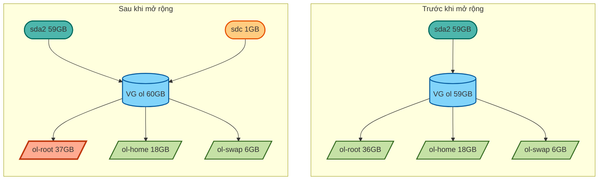
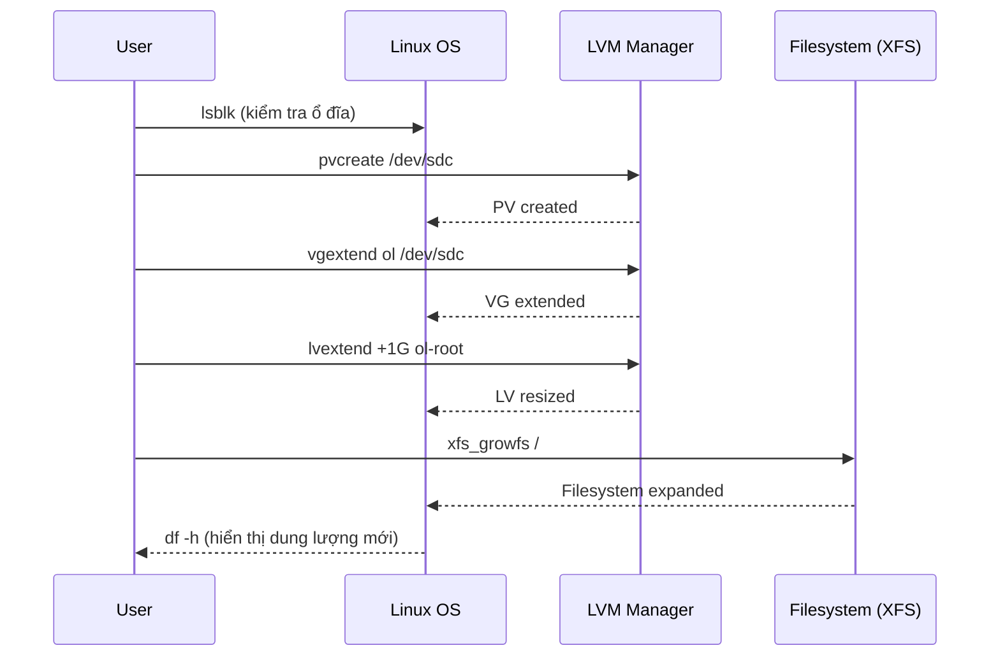
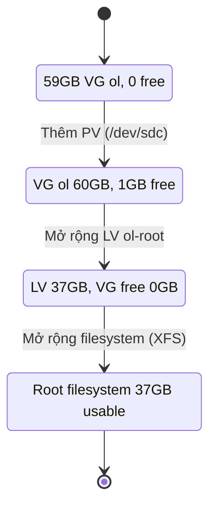
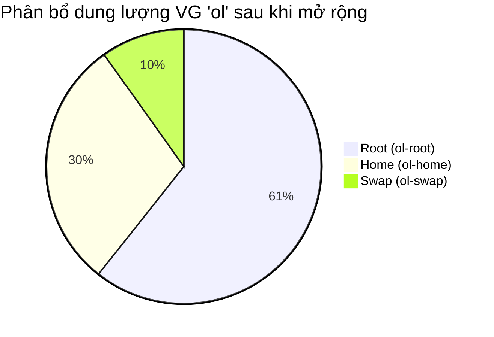

- [**I. Hướng dẫn mở rộng root filesystem trên Linux sử dụng LVM**](#i-hướng-dẫn-mở-rộng-root-filesystem-trên-linux-sử-dụng-lvm)
    - [**Mục tiêu**](#mục-tiêu)
  - [**Thực hiện mở rộng**](#thực-hiện-mở-rộng)
    - [**1️⃣ Kiểm tra trạng thái ổ đĩa và phân vùng**](#1️⃣-kiểm-tra-trạng-thái-ổ-đĩa-và-phân-vùng)
    - [**2️⃣ Khởi tạo Physical Volume (PV)**](#2️⃣-khởi-tạo-physical-volume-pv)
    - [**3️⃣ Mở rộng Volume Group (VG)**](#3️⃣-mở-rộng-volume-group-vg)
    - [**4️⃣ Mở rộng Logical Volume (LV) của root**](#4️⃣-mở-rộng-logical-volume-lv-của-root)
    - [**5️⃣ Kiểm tra loại filesystem**](#5️⃣-kiểm-tra-loại-filesystem)
    - [**6️⃣ Mở rộng filesystem**](#6️⃣-mở-rộng-filesystem)
    - [**7️⃣ Kiểm tra kết quả cuối cùng**](#7️⃣-kiểm-tra-kết-quả-cuối-cùng)
  - [**Sơ đồ minh họa**](#sơ-đồ-minh-họa)
    - [**1️⃣ Trước và sau khi mở rộng (Flowchart)**](#1️⃣-trước-và-sau-khi-mở-rộng-flowchart)
    - [**2️⃣ Luồng thực hiện mở rộng (Sequence diagram)**](#2️⃣-luồng-thực-hiện-mở-rộng-sequence-diagram)
    - [**3️⃣ Trạng thái dung lượng (State diagram)**](#3️⃣-trạng-thái-dung-lượng-state-diagram)
    - [**4️⃣ Phân bổ dung lượng sau khi mở rộng (Pie chart)**](#4️⃣-phân-bổ-dung-lượng-sau-khi-mở-rộng-pie-chart)
- [II.](#ii)


# **I. Hướng dẫn mở rộng root filesystem trên Linux sử dụng LVM**

### **Mục tiêu**

Tăng dung lượng Logical Volume `ol-root` (root `/`) thêm **1GB**, sử dụng ổ đĩa mới `/dev/sdc`.

## **Thực hiện mở rộng**

### **1️⃣ Kiểm tra trạng thái ổ đĩa và phân vùng**

```bash
Last login: Fri Aug  1 08:58:41 2025 from 192.168.49.1
[khanhnk@vbox ~]$ lsblk
NAME              MAJ:MIN RM  SIZE RO TYPE MOUNTPOINT
sda                 8:0    0   60G  0 disk
├─sda1              8:1    0    1G  0 part /boot
└─sda2              8:2    0   59G  0 part
  ├─ol-root       252:0    0 35.6G  0 lvm  /
  ├─ol-swap       252:1    0    6G  0 lvm  [SWAP]
  └─ol-home       252:3    0 17.4G  0 lvm  /home
sdb                 8:16   0    1G  0 disk
└─vg_data-lv_home 252:2    0  100M  0 lvm
sdc                 8:32   0  1.1G  0 disk
sr0                11:0    1 1024M  0 rom
```

✅ Xác định ổ đĩa mới `/dev/sdc` trống và VG chứa root là `ol`.

---

### **2️⃣ Khởi tạo Physical Volume (PV)**

```bash
[khanhnk@vbox ~]$ sudo pvcreate /dev/sdc
  Physical volume "/dev/sdc" successfully created.

[khanhnk@vbox ~]$ sudo pvs
  PV         VG      Fmt  Attr PSize    PFree
  /dev/sda2  ol      lvm2 a--   <59.00g      0
  /dev/sdb   vg_data lvm2 a--  1020.00m 920.00m
  /dev/sdc           lvm2 ---    <1.07g  <1.07g
```

✅ `/dev/sdc` đã được khởi tạo thành PV (chưa thuộc VG nào).

---

### **3️⃣ Mở rộng Volume Group (VG)**

```bash
[khanhnk@vbox ~]$ sudo vgextend ol /dev/sdc
  Volume group "ol" successfully extended

[khanhnk@vbox ~]$ sudo vgs
  VG      #PV #LV #SN Attr   VSize    VFree
  ol        2   3   0 wz--n-   60.06g  <1.07g
  vg_data   1   1   0 wz--n- 1020.00m 920.00m
```

✅ VG `ol` đã tăng thêm 1 PV và có thêm \~1GB dung lượng trống.

---

### **4️⃣ Mở rộng Logical Volume (LV) của root**

```bash
[khanhnk@vbox ~]$ sudo lvextend -L +1G /dev/mapper/ol-root
  Size of logical volume ol/root changed from <35.61 GiB (9116 extents) to <36.61 GiB (9372 extents).
  Logical volume ol/root successfully resized.
```

✅ LV `ol-root` tăng thêm 1GB.

---

### **5️⃣ Kiểm tra loại filesystem**

```bash
[khanhnk@vbox ~]$ df -T /
Filesystem          Type 1K-blocks    Used Available Use% Mounted on
/dev/mapper/ol-root xfs   37320904 8510184  28810720  23% /
```

✅ Filesystem là `XFS`.

---

### **6️⃣ Mở rộng filesystem**

```bash
[khanhnk@vbox ~]$ sudo xfs_growfs /
meta-data=/dev/mapper/ol-root    isize=512    agcount=4, agsize=2333696 blks
         =                       sectsz=512   attr=2, projid32bit=1
         =                       crc=1        finobt=1, sparse=1, rmapbt=0
         =                       reflink=1    bigtime=0 inobtcount=0
data     =                       bsize=4096   blocks=9334784, imaxpct=25
         =                       sunit=0      swidth=0 blks
naming   =version 2              bsize=4096   ascii-ci=0, ftype=1
log      =internal log           bsize=4096   blocks=4558, version=2
         =                       sectsz=512   sunit=0 blks, lazy-count=1
realtime =none                   extsz=4096   blocks=0, rtextents=0
data blocks changed from 9334784 to 9596928
```

✅ Filesystem đã được mở rộng và nhận diện dung lượng mới.

---

### **7️⃣ Kiểm tra kết quả cuối cùng**

```bash
[khanhnk@vbox ~]$ df -h
Filesystem           Size  Used Avail Use% Mounted on
/dev/mapper/ol-root   37G  8.2G   29G  23% /
/dev/mapper/ol-home   18G  158M   18G   1% /home
/dev/sda1           1014M  680M  335M  67% /boot
```

✅ Root filesystem tăng từ **36GB → 37GB**, mở rộng thành công.

## **Sơ đồ minh họa**

### **1️⃣ Trước và sau khi mở rộng (Flowchart)**



---

### **2️⃣ Luồng thực hiện mở rộng (Sequence diagram)**



---

### **3️⃣ Trạng thái dung lượng (State diagram)**



---

### **4️⃣ Phân bổ dung lượng sau khi mở rộng (Pie chart)**



# II.