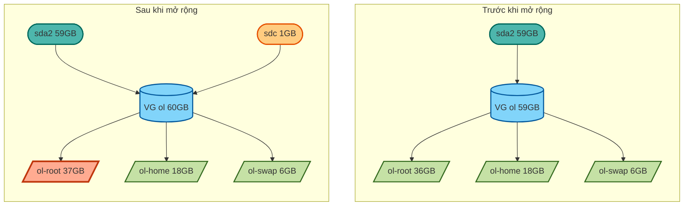
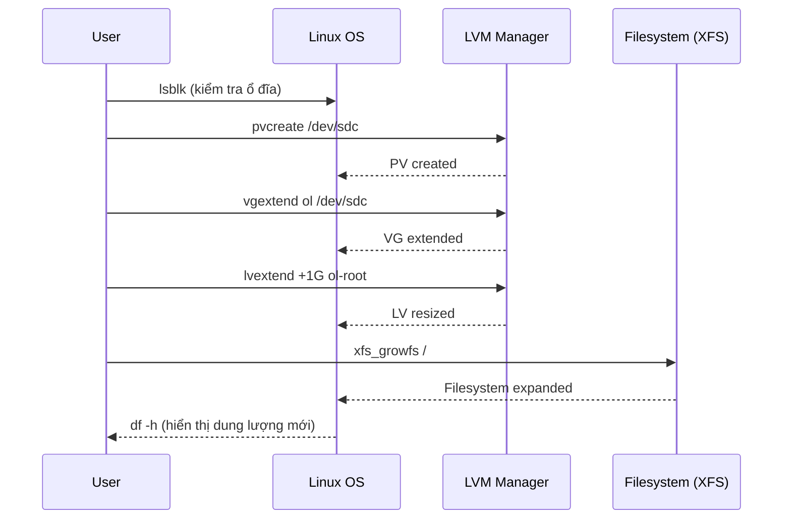
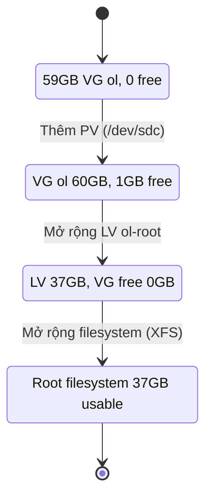

- [**I. Hướng dẫn mở rộng root filesystem trên Linux sử dụng LVM**](#i-hướng-dẫn-mở-rộng-root-filesystem-trên-linux-sử-dụng-lvm)
    - [**Mục tiêu**](#mục-tiêu)
  - [**Thực hiện mở rộng**](#thực-hiện-mở-rộng)
    - [**1️⃣ Kiểm tra trạng thái ổ đĩa và phân vùng**](#1️⃣-kiểm-tra-trạng-thái-ổ-đĩa-và-phân-vùng)
    - [**2️⃣ Khởi tạo Physical Volume (PV)**](#2️⃣-khởi-tạo-physical-volume-pv)
    - [**3️⃣ Mở rộng Volume Group (VG)**](#3️⃣-mở-rộng-volume-group-vg)
    - [**4️⃣ Mở rộng Logical Volume (LV) của root**](#4️⃣-mở-rộng-logical-volume-lv-của-root)
    - [**5️⃣ Kiểm tra loại filesystem**](#5️⃣-kiểm-tra-loại-filesystem)
    - [**6️⃣ Mở rộng filesystem**](#6️⃣-mở-rộng-filesystem)
    - [**7️⃣ Kiểm tra kết quả cuối cùng**](#7️⃣-kiểm-tra-kết-quả-cuối-cùng)
  - [**Sơ đồ minh họa**](#sơ-đồ-minh-họa)
    - [**1️⃣ Trước và sau khi mở rộng (Flowchart)**](#1️⃣-trước-và-sau-khi-mở-rộng-flowchart)
    - [**2️⃣ Luồng thực hiện mở rộng (Sequence diagram)**](#2️⃣-luồng-thực-hiện-mở-rộng-sequence-diagram)
    - [**3️⃣ Trạng thái dung lượng (State diagram)**](#3️⃣-trạng-thái-dung-lượng-state-diagram)
    - [**4️⃣ Phân bổ dung lượng sau khi mở rộng (Pie chart)**](#4️⃣-phân-bổ-dung-lượng-sau-khi-mở-rộng-pie-chart)
- [**II. Lộ Trình Thiết Lập MySQL Master-Slave Replication Cho Người Mới**](#ii-lộ-trình-thiết-lập-mysql-master-slave-replication-cho-người-mới)
    - [**1. Giới Thiệu Và Nền Tảng MySQL Master-Slave**](#1-giới-thiệu-và-nền-tảng-mysql-master-slave)
    - [**2. Chuẩn Bị Môi Trường Máy Ảo**](#2-chuẩn-bị-môi-trường-máy-ảo)
    - [**3. Cài Đặt MySQL 8 Trên Cả Hai Máy**](#3-cài-đặt-mysql-8-trên-cả-hai-máy)
    - [**4. Cấu Hình Master-Slave Replication**](#4-cấu-hình-master-slave-replication)
      - [**A. Cấu hình Master**](#a-cấu-hình-master)
      - [**B. Cấu hình Slave**](#b-cấu-hình-slave)
    - [**5. Kiểm Thử Và Xử Lý Sự Cố**](#5-kiểm-thử-và-xử-lý-sự-cố)
    - [**💡 Mẹo Thành Công**](#-mẹo-thành-công)


# **I. Hướng dẫn mở rộng root filesystem trên Linux sử dụng LVM**

### **Mục tiêu**

Tăng dung lượng Logical Volume `ol-root` (root `/`) thêm **1GB**, sử dụng ổ đĩa mới `/dev/sdc`.

## **Thực hiện mở rộng**

### **1️⃣ Kiểm tra trạng thái ổ đĩa và phân vùng**

```bash
Last login: Fri Aug  1 08:58:41 2025 from 192.168.49.1
[khanhnk@vbox ~]$ lsblk
NAME              MAJ:MIN RM  SIZE RO TYPE MOUNTPOINT
sda                 8:0    0   60G  0 disk
├─sda1              8:1    0    1G  0 part /boot
└─sda2              8:2    0   59G  0 part
  ├─ol-root       252:0    0 35.6G  0 lvm  /
  ├─ol-swap       252:1    0    6G  0 lvm  [SWAP]
  └─ol-home       252:3    0 17.4G  0 lvm  /home
sdb                 8:16   0    1G  0 disk
└─vg_data-lv_home 252:2    0  100M  0 lvm
sdc                 8:32   0  1.1G  0 disk
sr0                11:0    1 1024M  0 rom
```

✅ Xác định ổ đĩa mới `/dev/sdc` trống và VG chứa root là `ol`.

---

### **2️⃣ Khởi tạo Physical Volume (PV)**

```bash
[khanhnk@vbox ~]$ sudo pvcreate /dev/sdc
  Physical volume "/dev/sdc" successfully created.

[khanhnk@vbox ~]$ sudo pvs
  PV         VG      Fmt  Attr PSize    PFree
  /dev/sda2  ol      lvm2 a--   <59.00g      0
  /dev/sdb   vg_data lvm2 a--  1020.00m 920.00m
  /dev/sdc           lvm2 ---    <1.07g  <1.07g
```

✅ `/dev/sdc` đã được khởi tạo thành PV (chưa thuộc VG nào).

---

### **3️⃣ Mở rộng Volume Group (VG)**

```bash
[khanhnk@vbox ~]$ sudo vgextend ol /dev/sdc
  Volume group "ol" successfully extended

[khanhnk@vbox ~]$ sudo vgs
  VG      #PV #LV #SN Attr   VSize    VFree
  ol        2   3   0 wz--n-   60.06g  <1.07g
  vg_data   1   1   0 wz--n- 1020.00m 920.00m
```

✅ VG `ol` đã tăng thêm 1 PV và có thêm \~1GB dung lượng trống.

---

### **4️⃣ Mở rộng Logical Volume (LV) của root**

```bash
[khanhnk@vbox ~]$ sudo lvextend -L +1G /dev/mapper/ol-root
  Size of logical volume ol/root changed from <35.61 GiB (9116 extents) to <36.61 GiB (9372 extents).
  Logical volume ol/root successfully resized.
```

✅ LV `ol-root` tăng thêm 1GB.

---

### **5️⃣ Kiểm tra loại filesystem**

```bash
[khanhnk@vbox ~]$ df -T /
Filesystem          Type 1K-blocks    Used Available Use% Mounted on
/dev/mapper/ol-root xfs   37320904 8510184  28810720  23% /
```

✅ Filesystem là `XFS`.

---

### **6️⃣ Mở rộng filesystem**

```bash
[khanhnk@vbox ~]$ sudo xfs_growfs /
meta-data=/dev/mapper/ol-root    isize=512    agcount=4, agsize=2333696 blks
         =                       sectsz=512   attr=2, projid32bit=1
         =                       crc=1        finobt=1, sparse=1, rmapbt=0
         =                       reflink=1    bigtime=0 inobtcount=0
data     =                       bsize=4096   blocks=9334784, imaxpct=25
         =                       sunit=0      swidth=0 blks
naming   =version 2              bsize=4096   ascii-ci=0, ftype=1
log      =internal log           bsize=4096   blocks=4558, version=2
         =                       sectsz=512   sunit=0 blks, lazy-count=1
realtime =none                   extsz=4096   blocks=0, rtextents=0
data blocks changed from 9334784 to 9596928
```

✅ Filesystem đã được mở rộng và nhận diện dung lượng mới.

---

### **7️⃣ Kiểm tra kết quả cuối cùng**

```bash
[khanhnk@vbox ~]$ df -h
Filesystem           Size  Used Avail Use% Mounted on
/dev/mapper/ol-root   37G  8.2G   29G  23% /
/dev/mapper/ol-home   18G  158M   18G   1% /home
/dev/sda1           1014M  680M  335M  67% /boot
```

✅ Root filesystem tăng từ **36GB → 37GB**, mở rộng thành công.

## **Sơ đồ minh họa**

### **1️⃣ Trước và sau khi mở rộng (Flowchart)**



---

### **2️⃣ Luồng thực hiện mở rộng (Sequence diagram)**



---

### **3️⃣ Trạng thái dung lượng (State diagram)**



---

# **II. Lộ Trình Thiết Lập MySQL Master-Slave Replication Cho Người Mới**


### **1. Giới Thiệu Và Nền Tảng MySQL Master-Slave**  
🎯 **Mục tiêu**: Hiểu bản chất mô hình, nguyên lý hoạt động và trường hợp ứng dụng.  

**Nội dung học**:  
1. 🐘 **Master-Slave là gì?**  
   - **Khái niệm**: Master ghi thay đổi → Slave sao chép dữ liệu từ Master (1 chiều)  
   - **Nguyên lý**: Sử dụng Binary Log (Master) → Relay Log (Slave) → SQL Thread áp dụng thay đổi  
   - **So sánh đơn giản**:  
     - *Master*: Xử lý **INSERT/UPDATE/DELETE** (ghi dữ liệu)  
     - *Slave*: Chỉ **SELECT** (đọc dữ liệu, phục vụ scale ứng dụng)  

2. 🌟 **Lợi ích & Giới hạn**:  
   - ✅ *Lợi ích*: Tăng khả năng đọc, sao lưu an toàn, disaster recovery  
   - ❌ *Giới hạn*: Slave **không thể ghi**, độ trễ đồng bộ (latency), chỉ chống lỗi cho read workload  

3. 🔧 **Thành phần cốt lõi**:  
   - **Binary Log**: Ghi lại mọi thay đổi trên Master  
   - **I/O Thread**: Slave kết nối Master để lấy Binary Log  
   - **SQL Thread**: Áp dụng thay đổi từ Relay Log vào Slave  

📝 **Bài tập thực hành**:  
   - Vẽ sơ đồ hoạt động Master-Slave trên giấy  
   - Tìm 3 ứng dụng thực tế dùng mô hình này (ví dụ: website có traffic đọc cao)  
   - Đọc [MySQL Replication Documentation](https://dev.mysql.com/doc/refman/8.0/en/replication.html)  

📚 **Tài nguyên học tập**:  
   - Video: "MySQL Replication Explained in 5 Minutes" (YouTube)  
   - Infographic: [How MySQL Replication Works](https://www.percona.com/blog/2019/08/20/how-mysql-replication-works/)  

---

### **2. Chuẩn Bị Môi Trường Máy Ảo**  
🎯 **Mục tiêu**: Thiết lập 2 máy ảo (Master/Slave) kết nối mạng ổn định.  

**Nội dung học**:  
1. 🖥 **Chọn công cụ ảo hóa**:  
   - **Khuyến nghị**: VirtualBox (giống lộ trình Linux) hoặc VMware Workstation Player  
   - Tại sao không dùng cloud? → Tập trung vào nguyên lý, tránh phí tổn  

2. 💻 **Cấu hình máy ảo**:  
   - **Hệ điều hành**: Ubuntu 22.04 LTS (cùng distro đã học)  
   - **Thông số tối thiểu**:  
     | Máy       | RAM  | CPU | Ổ cứng |  
     |-----------|------|-----|--------|  
     | **Master**| 1GB  | 1   | 10GB   |  
     | **Slave** | 1GB  | 1   | 10GB   |  

3. 🌐 **Cấu hình mạng**:  
   - **Network Mode**: Internal Network (VirtualBox) hoặc NAT Network  
   - **IP tĩnh ví dụ**:  
     - Master: `192.168.56.10`  
     - Slave: `192.168.56.11`  
   - **Bắt buộc**:  
     - Đặt hostname: `sudo hostnamectl set-hostname mysql-master`  
     - Cấu hình `/etc/hosts` trên cả 2 máy:  
       ```bash
       192.168.56.10 mysql-master
       192.168.56.11 mysql-slave
       ```  
   - **Kiểm tra**: `ping mysql-master` từ Slave và ngược lại  

📝 **Bài tập thực hành**:  
   - Tạo 2 máy ảo Ubuntu trên VirtualBox  
   - Cấu hình IP tĩnh và hostname như hướng dẫn  
   - Đảm bảo 2 máy **ping được nhau** và **truy cập internet**  
   - Chụp ảnh màn hình kết quả kiểm tra mạng  

📚 **Tài nguyên học tập**:  
   - [Hướng dẫn cấu hình mạng VirtualBox](https://www.virtualbox.org/manual/ch06.html)  
   - Cheat sheet: `ip a`, `sudo nano /etc/netplan/00-config.yaml`  

---

### **3. Cài Đặt MySQL 8 Trên Cả Hai Máy**  
🎯 **Mục tiêu**: Cài đặt MySQL 8 và thiết lập bảo mật cơ bản.  

**Nội dung học**:  
1. 📦 **Cài đặt MySQL 8**:  
   ```bash
   # Trên cả 2 máy
   sudo apt update
   sudo apt install mysql-server -y
   sudo mysql_secure_installation  # Thiết lập mật khẩu root, loại bỏ user ẩn danh
   ```

2. 🔐 **Bảo mật cần thiết**:  
   - Mở port 3306: `sudo ufw allow 3306/tcp`  
   - Sửa file cấu hình:  
     ```bash
     sudo nano /etc/mysql/mysql.conf.d/mysqld.cnf
     ```
     - **Tắt bind-address** (cho phép kết nối từ mạng):  
       ```ini
       # Comment dòng sau:
       # bind-address = 127.0.0.1
       ```

3. 🧪 **Kiểm tra cài đặt**:  
   ```bash
   sudo systemctl status mysql    # Xác nhận service đang chạy
   mysql -u root -p -e "SHOW VARIABLES LIKE 'version';"  # Kiểm tra phiên bản
   ```

📝 **Bài tập thực hành**:  
   - Cài MySQL 8 trên cả Master và Slave  
   - Tạo database `test_db` và table `users` trên Master  
   - Đảm bảo **không thể kết nối từ Slave sang Master** (kiểm tra bằng `telnet mysql-master 3306`)  
   - Ghi chú lại lỗi gặp phải và cách khắc phục  

📚 **Tài nguyên học tập**:  
   - [MySQL 8 Installation Guide](https://dev.mysql.com/doc/mysql-installation-excerpt/8.0/en/)  
   - Video: "Fix MySQL Connection Refused Error"  

---

### **4. Cấu Hình Master-Slave Replication**  
🎯 **Mục tiêu**: Đồng bộ dữ liệu từ Master sang Slave thành công.  

**Nội dung học**:  
#### **A. Cấu hình Master**  
1. ✏️ **Sửa file config**:  
   ```ini
   # /etc/mysql/mysql.conf.d/mysqld.cnf
   server-id = 1
   log_bin = /var/log/mysql/mysql-bin.log
   binlog_do_db = test_db  # Chỉ đồng bộ database này (tùy chọn)
   ```

2. 🔑 **Tạo user replication**:  
   ```sql
   CREATE USER 'repl'@'%' IDENTIFIED BY 'SecurePass123!';
   GRANT REPLICATION SLAVE ON *.* TO 'repl'@'%';
   FLUSH PRIVILEGES;
   ```

3. 📊 **Lấy trạng thái Master**:  
   ```sql
   FLUSH TABLES WITH READ LOCK;
   SHOW MASTER STATUS;  -- Ghi lại File và Position (ví dụ: mysql-bin.000003 | 1000)
   ```

#### **B. Cấu hình Slave**  
1. ✏️ **Sửa file config**:  
   ```ini
   # /etc/mysql/mysql.conf.d/mysqld.cnf
   server-id = 2
   relay_log = /var/log/mysql/mysql-relay-bin.log
   read_only = ON
   ```

2. 🔄 **Kết nối Slave với Master**:  
   ```sql
   CHANGE MASTER TO
     MASTER_HOST='mysql-master',
     MASTER_USER='repl',
     MASTER_PASSWORD='SecurePass123!',
     MASTER_LOG_FILE='mysql-bin.000003',
     MASTER_LOG_POS=1000;
   START SLAVE;
   ```

3. 🔍 **Kiểm tra trạng thái**:  
   ```sql
   SHOW SLAVE STATUS\G
   -- Đảm bảo 2 giá trị sau = "Yes":
   Slave_IO_Running: Yes
   Slave_SQL_Running: Yes
   ```

📝 **Bài tập thực hành**:  
   - Thực hiện từng bước cấu hình trên Master/Slave  
   - Ghi lại **File** và **Position** từ `SHOW MASTER STATUS`  
   - Tạo 1 bản ghi trên Master: `INSERT INTO test_db.users VALUES (1, 'Test');`  
   - Kiểm tra bản ghi trên Slave → Báo cáo kết quả  
   - **Thử thách**: Tạm dừng replication bằng `STOP SLAVE;` và tiếp tục sau 5 phút  

📚 **Tài nguyên học tập**:  
   - [MySQL Replication Setup Guide](https://dev.mysql.com/doc/refman/8.0/en/replication-configuration.html)  
   - Tool: [MySQL Replication Checker](https://github.com/mysql/mysql-shell)  

---

### **5. Kiểm Thử Và Xử Lý Sự Cố**  
🎯 **Mục tiêu**: Xác minh hệ thống hoạt động ổn định và khắc phục lỗi cơ bản.  

**Nội dung học**:  
1. 🧪 **Test đồng bộ**:  
   - Tạo database mới trên Master → Kiểm tra trên Slave  
   - Xóa bản ghi trên Master → Xác nhận Slave tự động cập nhật  

2. ⚠️ **Lỗi thường gặp & Cách fix**:  
   | Lỗi                          | Nguyên nhân               | Giải pháp                  |  
   |------------------------------|---------------------------|----------------------------|  
   | `Slave_IO_Running: No`       | Network/firewall          | Mở port 3306, kiểm tra ping |  
   | `Error 1045`                 | Sai mật khẩu replication  | Tạo lại user trên Master   |  
   | `Duplicate entry`            | Xung đột dữ liệu          | Chạy `STOP SLAVE; SET GLOBAL sql_slave_skip_counter=1; START SLAVE;` |  

3. 📈 **Theo dõi hiệu năng**:  
   ```sql
   SHOW SLAVE STATUS\G  -- Xem Seconds_Behind_Master
   ```

📝 **Bài tập thực hành**:  
   - Gây lỗi **cố ý** (ví dụ: sửa `server-id` trùng nhau) và khắc phục  
   - Đo thời gian đồng bộ với 1.000 bản ghi chèn vào Master  
   - Viết script tự động kiểm tra trạng thái replication mỗi 5 phút  

📚 **Tài nguyên học tập**:  
   - [MySQL Replication Troubleshooting](https://dev.mysql.com/doc/refman/8.0/en/replication-problems.html)  
   - Tool: `mytop` (monitor replication real-time)  

---

### **💡 Mẹo Thành Công**  
1. **Backup trước khi cấu hình**: `mysqldump -u root -p --all-databases > backup.sql`  
2. **Dùng mật khẩu mạnh** cho user replication (tránh `password123`)  
3. **Kiểm tra log** khi gặp lỗi: `sudo tail -f /var/log/mysql/error.log`  
4. **Luôn reset replication** khi thay đổi cấu hình:  
   ```sql
   -- Trên Slave
   STOP SLAVE;
   RESET SLAVE ALL;
   ```  
