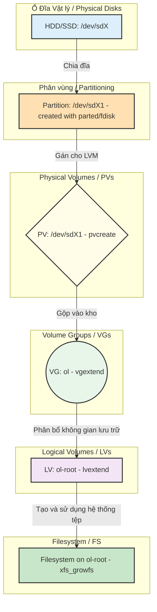
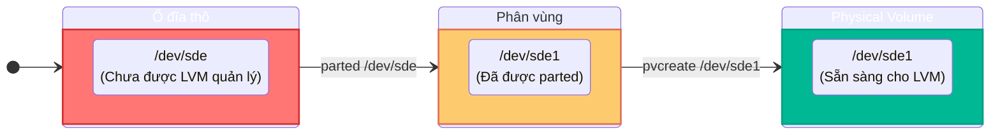
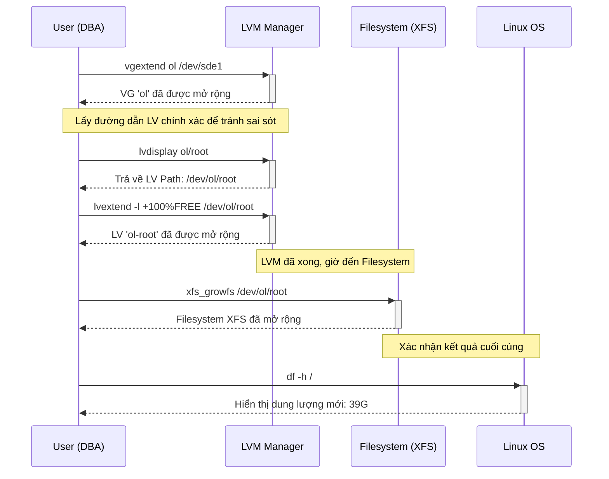

# **Hướng dẫn Hoàn Chỉnh: Mở Rộng Filesystem LVM**

## **I. Nền Tảng: Các Thành phần LVM và Mô Hình Phân Lớp**




**Quy tắc Vàng của DBA: Luôn tạo Snapshot/Backup!**
Thao tác với ổ đĩa vật lý luôn tiềm ẩn rủi ro. Trong môi trường máy ảo, **luôn tạo Snapshot** trước khi thực hiện bất kỳ thay đổi nào. Trong môi trường vật lý, hãy đảm bảo bạn có backup đầy đủ và kiểm tra khả năng phục hồi.

---

## **II. Tư Duy Từ Gốc Rễ: Quy Trình Mở Rộng Filesystem**

Quy trình này kết hợp việc thêm một ổ đĩa mới (từ gốc rễ phần cứng) với việc chẩn đoán dung lượng filesystem (từ góc nhìn người dùng/ứng dụng).

### **Giai đoạn 1: Chủ động Chuẩn bị Tài nguyên (Đi từ Gốc - Phần cứng)**

Đây là bước bạn chuẩn bị tài nguyên vật lý để mở rộng, trước khi thực sự cần đến nó.

#### **1️⃣ Khảo sát và Nhận diện Ổ đĩa Mới**

**Tư duy từ gốc rễ:** Bắt đầu từ lớp vật lý. Trước khi giải quyết vấn đề của ứng dụng, hãy xem chúng ta có những tài nguyên nào trong tay.

*   **Lệnh:** Dùng `lsblk` để có cái nhìn tổng quan và `pvs` để xác định PV nào đã tồn tại.
*   **Mục tiêu:** Tìm một ổ đĩa vật lý (ví dụ: `/dev/sde`) chưa được phân vùng hoặc chưa phải là PV.

```bash
# lsblk cho thấy /dev/sde (1G) là một ổ đĩa trống, chưa có phân vùng.
[root@mysql-master ~]# lsblk
NAME              MAJ:MIN RM  SIZE RO TYPE MOUNTPOINT
...
sde                 8:64   0    1G  0 disk
...

# pvs xác nhận /dev/sde chưa có trong danh sách PVs.
[root@mysql-master ~]# pvs
  PV         VG      Fmt  Attr PSize    PFree
  /dev/sda   vg_data lvm2 a--  1020.00m  920.00m
  /dev/sdb2  ol      lvm2 a--   <59.00g       0
  /dev/sdc   ol      lvm2 a--   496.00m  496.00m
  /dev/sdf   ol      lvm2 a--    <1.07g   68.00m
```
✅ **Phân tích:** `/dev/sde` (1G) được xác định là ổ đĩa mới, hoàn toàn trống, sẵn sàng để chuẩn bị.

#### **2️⃣ Phân vùng Ổ đĩa Mới (`parted`)**

**Tư duy từ gốc rễ của DBA:**
*   Khi có một ổ đĩa cứng vật lý mới (ví dụ `sde`), nó giống như một "miếng đất hoang" chưa có bản đồ hay quy hoạch. Trước khi LVM có thể sử dụng, bạn cần phải **phân vùng (partition)** nó. Phân vùng là cách bạn chia miếng đất đó thành các lô riêng biệt.
*   Việc phân vùng trước khi biến ổ đĩa thành PV là một thực hành tốt trong môi trường doanh nghiệp để có một bảng phân vùng rõ ràng (GPT), tối ưu hóa hiệu suất căn chỉnh (alignment), và chia sẻ ổ đĩa cho nhiều mục đích nếu cần.
*   **CỰC KỲ NGUY HIỂM:** Lệnh `mklabel gpt` sẽ **XÓA SẠCH MỌI DỮ LIỆU** trên ổ đĩa. Luôn xác nhận đúng ổ đĩa đích (`/dev/sde`) trước khi chạy.

```bash
# Tạo bảng phân vùng GPT và một phân vùng duy nhất chiếm toàn bộ ổ đĩa /dev/sde
[root@mysql-master ~]# parted -s -a optimal /dev/sde mklabel gpt mkpart primary 1m 100%
# (Không có output nếu thành công)

# Xác nhận lại bằng lsblk
[root@mysql-master ~]# lsblk
NAME              MAJ:MIN RM  SIZE RO TYPE MOUNTPOINT
...
sde                 8:64   0    1G  0 disk
└─sde1              8:65   0 1022M  0 part # <-- Phân vùng sde1 đã được tạo!
...
```

✅ **Kết quả:** `lsblk` hiển thị phân vùng `/dev/sde1` đã được tạo trên ổ đĩa `/dev/sde`, chứng tỏ lệnh `parted` đã thành công. "Miếng đất hoang" đã được "quy hoạch" và "phân lô" thành `/dev/sde1`, sẵn sàng cho bước tiếp theo.

**Giải thích chi tiết và sâu sắc từng tham số trong lệnh trên:**

*   **`parted`**
    *   **Ý nghĩa:** Tên của chương trình. `parted` là viết tắt của "partition editor". Đây là một công cụ dòng lệnh mạnh mẽ để tạo, xóa, và quản lý các phân vùng ổ đĩa. Nó hiện đại hơn công cụ `fdisk` truyền thống, đặc biệt là trong việc hỗ trợ bảng phân vùng GPT và các ổ đĩa có dung lượng lớn hơn 2TB.

*   **`-s`**
    *   **Ý nghĩa:** Viết tắt của `--script`. Tham số này chỉ thị `parted` hoạt động ở **chế độ script (không tương tác)**. Nó sẽ thực thi các lệnh con được cung cấp trên dòng lệnh mà không yêu cầu bất kỳ sự can thiệp nào từ người dùng (ví dụ: không hỏi "Yes/No").
    *   **Tư duy từ Gốc Rễ (WHY):** Trong môi trường tự động hóa hoặc khi muốn chạy nhiều lệnh con một cách nhanh chóng, chế độ script là rất cần thiết. Đây cũng là lý do tại sao lệnh ban đầu của bạn (không có `-s`) bị lỗi, vì `parted` không hiểu cách bạn cung cấp nhiều lệnh con cùng lúc.

*   **`-a optimal`**
    *   **Ý nghĩa:** Viết tắt của `--align=optimal`. Tham số này yêu cầu `parted` tự động **căn chỉnh (align)** các phân vùng theo cách tối ưu nhất cho hiệu suất của ổ đĩa. Việc căn chỉnh đúng giúp các hoạt động đọc/ghi dữ liệu hiệu quả hơn.
    *   **Tư duy từ Gốc Rễ (WHY):** Một DBA luôn quan tâm đến hiệu suất I/O. Căn chỉnh phân vùng không đúng có thể gây ra hiện tượng "misalignment" và làm giảm hiệu suất của ổ đĩa, đặc biệt là với SSD và các hệ thống lưu trữ có block size lớn. Tham số này đảm bảo hiệu suất tốt nhất cho các hoạt động database sau này.

*   **`/dev/sde`**
    *   **Ý nghĩa:** Đây là **thiết bị đích**, tức là ổ đĩa vật lý mà bạn muốn thao tác. Trong ví dụ này, đó là ổ đĩa 1GB mà chúng ta đã xác định từ `lsblk`.
    *   **Tư duy từ Gốc Rễ (WHY):** Đây là phần **NHẠY CẢM NHẤT** của lệnh. Nếu bạn gõ sai tên ổ đĩa (ví dụ: gõ nhầm thành `/dev/sdb`), toàn bộ dữ liệu trên ổ đĩa đó sẽ bị xóa. Một DBA luôn phải **KIỂM TRA VÀ XÁC NHẬN LẠI** tên ổ đĩa đích CỰC KỲ CẨN THẬN trước khi chạy lệnh này.

*   **`mklabel gpt`**
    *   **Ý nghĩa:** Đây là lệnh con đầu tiên, có nghĩa là **"Make Label"**. Nó tạo ra một bảng phân vùng (partition table) mới trên ổ đĩa.
        *   `gpt` (GUID Partition Table) là loại bảng phân vùng hiện đại, linh hoạt, hỗ trợ ổ đĩa lớn hơn 2TB, và có khả năng phục hồi tốt hơn.
    *   **Tư duy từ Gốc Rễ (WHY):** Bảng phân vùng giống như một "bản đồ quy hoạch tổng thể" cho miếng đất của bạn. Nó định nghĩa cách các "lô đất" (phân vùng) sẽ được tổ chức trên ổ đĩa. Lệnh `mklabel` sẽ san phẳng mọi thứ trên miếng đất để vẽ lại bản đồ mới từ đầu.

*   **`mkpart primary 1m 100%`**
    *   **Ý nghĩa:** Đây là lệnh con thứ hai, có nghĩa là **"Make Partition"**. Nó tạo ra một phân vùng mới trên bảng phân vùng vừa được tạo.
        *   `primary`: Chỉ định loại phân vùng là "chính". Với GPT, tất cả các phân vùng đều có thể là primary.
        *   `1m`: Điểm bắt đầu của phân vùng, tính từ đầu ổ đĩa.
        *   `100%`: Điểm kết thúc của phân vùng, kéo dài đến hết dung lượng còn lại của ổ đĩa.
    *   **Tư duy từ Gốc Rễ (WHY):** Sau khi có "bản đồ quy hoạch" (`mklabel`), bạn bắt đầu "phân lô" (`mkpart`). Việc bắt đầu từ 1MB (thay vì 0MB) là một thực hành tốt vì nó để trống không gian ban đầu cho các metadata của GPT hoặc bootloader, cũng như đảm bảo căn chỉnh đúng đắn ngay từ đầu. `100%` nghĩa là bạn muốn toàn bộ dung lượng còn lại của ổ đĩa được gán cho phân vùng này, rất phù hợp khi bạn muốn biến toàn bộ ổ đĩa thành một PV duy nhất sau này.

#### **3️⃣ Khởi tạo Physical Volume (PV) (`pvcreate`)**

**Tư duy từ gốc rễ:** "Đánh dấu" phân vùng vừa tạo để LVM có thể nhận diện và quản lý nó như một "viên gạch".

```bash
# Khởi tạo PV trên phân vùng /dev/sde1
[root@mysql-master ~]# pvcreate /dev/sde1
  Physical volume "/dev/sde1" successfully created.
```
**Sơ đồ Quy trình tạo PV:**


✅ **Kết quả:** PV `/dev/sde1` đã được tạo và sẵn sàng trong "kho tài nguyên" của LVM, nhưng **chưa được gán vào bất kỳ Volume Group nào**.

---

### **Giai đoạn 2: Xử lý Sự cố & Áp dụng Tài nguyên (Tư duy Ngược)**

Đây là lúc bạn phản ứng với một cảnh báo thực tế và áp dụng các tài nguyên đã chuẩn bị.

#### **1️⃣ Xác định Triệu chứng: Filesystem nào đang đầy? (`df -h`)**

**Tư duy từ gốc rễ:** Bắt đầu từ triệu chứng mà người dùng và ứng dụng nhìn thấy.

```bash
[root@mysql-master ~]# df -h
Filesystem           Size  Used Avail Use% Mounted on
...
/dev/mapper/ol-root   37G  8.9G   28G  85% /  # <-- Giả định Use% cao
...
```
✅ **Phân tích:** Root filesystem (`/`) có `Use%` cao, cần phải mở rộng.

### **Giai đoạn 2: Xử lý Sự cố & Áp dụng Tài nguyên (Tư duy Ngược) - **PHIÊN BẢN SỬA ĐỔI CUỐI CÙNG**

Đây là lúc bạn phản ứng với một cảnh báo thực tế và áp dụng các tài nguyên đã chuẩn bị.

#### **1️⃣ Xác định Triệu chứng: Filesystem nào đang đầy? (`df -h`)**

**Tư duy từ gốc rễ:** Bắt đầu từ triệu chứng mà người dùng và ứng dụng nhìn thấy.

```bash
[root@mysql-master ~]# df -h
Filesystem           Size  Used Avail Use% Mounted on
...
/dev/mapper/ol-root   37G  8.9G   28G  85% /  # <-- Giả định Use% cao
...
```
✅ **Phân tích:** Root filesystem (`/`) có `Use%` cao, cần phải mở rộng.

#### **2️⃣ Truy vết Cấu trúc LVM (`lvs` và `vgs`)**

**Tư duy từ gốc rễ:** Từ filesystem đầy, truy ngược về cấu trúc LVM để hiểu nó nằm ở đâu và có đủ tài nguyên để mở rộng không.

```bash
# Dùng lvs để xác định LV nào mount tại / và thuộc VG nào
[root@mysql-master ~]# lvs
  LV      VG      Attr       LSize   Pool Origin Data%  Meta%  Move Log Cpy%Sync Convert
  ...
  root    ol      -wi-ao---- <36.61g # <-- LV 'root' thuộc VG 'ol'
  ...
  
# Dùng vgs để kiểm tra dung lượng trống của VG 'ol'
[root@mysql-master ~]# vgs
  VG      #PV #LV #SN Attr   VSize    VFree
  ol        3   3   0 wz--n-   60.54g   68.00m # <-- VFree rất thấp, không đủ mở rộng nhiều!
  ...
```
✅ **Chẩn đoán:** LV `root` thuộc VG `ol`. Tuy nhiên, `VFree` của `ol` rất thấp. Chúng ta **không đủ tài nguyên** trong VG để mở rộng đáng kể.

#### **3️⃣ Chẩn đoán Nguyên nhân & Tìm Giải pháp (`pvs`)**

**Tư duy từ gốc rễ:** VG `ol` không đủ dung lượng. **Nguyên nhân gốc rễ là gì?** Kho chứa đã cạn. **Giải pháp là gì?** Phải thêm "viên gạch" (PV) mới vào kho. **Vậy, chúng ta có "viên gạch" nào sẵn sàng không?**

```bash
[root@mysql-master ~]# pvs
  PV         VG      Fmt  Attr PSize    PFree
  ...
  /dev/sde1          lvm2 ---  1022.00m 1022.00m # <-- Tìm thấy rồi! PV này chưa thuộc VG nào!
  ...
```
✅ **Chẩn đoán:** `pvs` cho thấy `/dev/sde1` là một PV có sẵn, chưa được gán vào VG nào. Đây chính là tài nguyên mà chúng ta đã chuẩn bị ở Giai đoạn 1.

#### **4️⃣ Áp dụng Giải pháp: Mở rộng VG, LV, và Filesystem**

Bây giờ chúng ta sẽ thực hiện chuỗi lệnh cuối cùng để giải quyết vấn đề, **kết hợp với thực hành tốt nhất là sử dụng `lvdisplay` để có được đường dẫn chính xác.**

**Sơ đồ Luồng Công việc Mở rộng (Cập nhật):**



**Thực thi các lệnh (Quy trình An toàn):**

```bash
# 4.1. Thêm PV /dev/sde1 vào Volume Group 'ol'
[root@mysql-master ~]# vgextend ol /dev/sde1
  Volume group "ol" successfully extended

# 4.2. [BEST PRACTICE] Xác định chính xác LV Path và kiểm tra trạng thái LV
# Tư duy từ gốc rễ: Không tin vào trí nhớ. Hãy để hệ thống tự nói cho bạn biết đường dẫn chính xác.
[root@mysql-master ~]# lvdisplay ol/root
  --- Logical volume ---
  LV Path                /dev/ol/root
  LV Name                root
  VG Name                ol
  ...
  LV Size                <36.61 GiB
  ...

# 4.3. Mở rộng LV 'ol-root' bằng toàn bộ dung lượng trống, sử dụng LV Path đã xác nhận
[root@mysql-master ~]# lvextend -l +100%free /dev/ol/root
  Size of logical volume ol/root changed from <36.61 GiB to <38.16 GiB.
  Logical volume ol/root successfully resized.

# 4.4. Mở rộng Filesystem XFS bằng LV Path chính xác
[root@mysql-master ~]# xfs_growfs /dev/ol/root
...
data blocks changed from 9596928 to 10002432

# 4.5. Kiểm tra kết quả cuối cùng
[root@mysql-master ~]# df -h /
Filesystem           Size  Used Avail Use% Mounted on
/dev/mapper/ol-root   39G  8.9G   30G  24% /
```

✅ **THÀNH CÔNG!** Root filesystem (`/`) đã được mở rộng từ 37G lên **39G**
---

## **III. Kết Luận**

*   **Chủ động chuẩn bị tài nguyên:** Phân vùng và khởi tạo các ổ đĩa mới trước khi chúng thực sự cần thiết.
*   **Bắt đầu từ triệu chứng:** Dùng `df -h` để xác định vấn đề từ góc nhìn của ứng dụng.
*   **Truy vết ngược về gốc rễ:** Dùng `lvs` -> `vgs` -> `pvs` để chẩn đoán nguyên nhân gốc rễ của việc thiếu dung lượng.
*   **Áp dụng giải pháp đã chuẩn bị:** Sử dụng các PV đã có sẵn để giải quyết vấn đề một cách nhanh chóng.
*   **Hoàn tất và xác nhận:** Mở rộng LV và Filesystem, sau đó dùng `df -h` để xác nhận vấn đề đã được giải quyết.