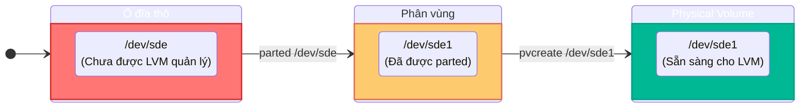
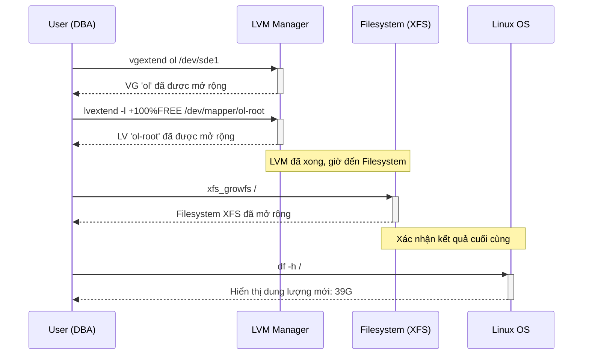

# **Hướng dẫn Mở rộng Filesystem LVM**

## **Giai đoạn 1: Chủ động Chuẩn bị Tài nguyên (Đi từ Gốc - Phần cứng)**

### **1️⃣ Khảo sát và Nhận diện Ổ đĩa Mới**

**Tư duy từ gốc rễ:** Bắt đầu từ lớp vật lý. Trước khi giải quyết vấn đề của ứng dụng, hãy xem chúng ta có những tài nguyên nào trong tay.

*   **Lệnh:** Dùng `lsblk` để có cái nhìn tổng quan và `pvs` để xác định PV nào đã tồn tại.
*   **Mục tiêu:** Tìm một ổ đĩa vật lý (ví dụ: `/dev/sde`) chưa được phân vùng hoặc chưa phải là PV.

```bash
# lsblk cho thấy /dev/sde (1G) là một ổ đĩa trống, chưa có phân vùng.
[root@mysql-master ~]# lsblk
NAME              MAJ:MIN RM  SIZE RO TYPE MOUNTPOINT
...
sde                 8:64   0    1G  0 disk
...

# pvs xác nhận /dev/sde chưa có trong danh sách PVs.
[root@mysql-master ~]# pvs
  PV         VG      Fmt  Attr PSize    PFree
  /dev/sda   vg_data lvm2 a--  1020.00m  920.00m
  /dev/sdb2  ol      lvm2 a--   <59.00g       0
  /dev/sdc   ol      lvm2 a--   496.00m  496.00m
  /dev/sdf   ol      lvm2 a--    <1.07g   68.00m
```
✅ **Phân tích:** `/dev/sde` (1G) được xác định là ổ đĩa mới, hoàn toàn trống, sẵn sàng để chuẩn bị.

### **2️⃣ Phân vùng Ổ đĩa Mới (`parted`)**

**Tư duy từ gốc rễ:** "Quy hoạch" miếng đất hoang. Tạo bảng phân vùng (GPT) và một phân vùng duy nhất để đảm bảo cấu trúc chuẩn và hiệu suất tối ưu.

**NGUY HIỂM:** Lệnh `mklabel gpt` sẽ **xóa sạch mọi dữ liệu** trên ổ đĩa. Luôn xác nhận đúng ổ đĩa đích!

```bash
# Tạo bảng phân vùng GPT và một phân vùng duy nhất chiếm toàn bộ ổ đĩa /dev/sde
[root@mysql-master ~]# sudo parted -s -a optimal /dev/sde mklabel gpt mkpart primary 1m 100%
# (Không có output nếu thành công)

# Xác nhận lại bằng lsblk
[root@mysql-master ~]# lsblk
NAME              MAJ:MIN RM  SIZE RO TYPE MOUNTPOINT
...
sde                 8:64   0    1G  0 disk
└─sde1              8:65   0 1022M  0 part # <-- Phân vùng sde1 đã được tạo!
...
```
✅ **Kết quả:** Phân vùng `/dev/sde1` đã được tạo trên ổ đĩa `/dev/sde`.

### **3️⃣ Khởi tạo Physical Volume (PV) (`pvcreate`)**

**Tư duy từ gốc rễ:** "Đánh dấu" phân vùng vừa tạo để LVM có thể nhận diện và quản lý nó như một "viên gạch".

```bash
# Khởi tạo PV trên phân vùng /dev/sde1
[root@mysql-master ~]# sudo pvcreate /dev/sde1
  Physical volume "/dev/sde1" successfully created.
```
**Sơ đồ Quy trình tạo PV:**


✅ **Kết quả:** PV `/dev/sde1` đã được tạo và sẵn sàng trong "kho tài nguyên" của LVM, nhưng **chưa được gán vào bất kỳ Volume Group nào**.

---

## **Giai đoạn 2: Xử lý Sự cố & Áp dụng Tài nguyên (Tư duy Ngược)**

Bây giờ, hãy tưởng tượng một kịch bản thực tế: bạn nhận được cảnh báo rằng một filesystem sắp đầy.

### **1️⃣ Xác định Triệu chứng: Filesystem nào đang đầy? (`df -h`)**

**Tư duy từ gốc rễ:** Bắt đầu từ triệu chứng mà người dùng và ứng dụng nhìn thấy.

```bash
[root@mysql-master ~]# df -h
Filesystem           Size  Used Avail Use% Mounted on
...
/dev/mapper/ol-root   37G  8.9G   28G  85% /  # <-- Giả định Use% cao
...
```
✅ **Phân tích:** Root filesystem (`/`) có `Use%` cao, cần phải mở rộng.

### **2️⃣ Truy vết Cấu trúc LVM (`lvs` và `vgs`)**

**Tư duy từ gốc rễ:** Từ filesystem đầy, truy ngược về cấu trúc LVM để hiểu nó nằm ở đâu và có đủ tài nguyên để mở rộng không.

```bash
# Dùng lvs để xác định LV nào mount tại / và thuộc VG nào
[root@mysql-master ~]# lvs
  LV      VG      Attr       LSize   Pool Origin Data%  Meta%  Move Log Cpy%Sync Convert
  ...
  root    ol      -wi-ao---- <36.61g # <-- LV 'root' thuộc VG 'ol'
  ...
  
# Dùng vgs để kiểm tra dung lượng trống của VG 'ol'
[root@mysql-master ~]# vgs
  VG      #PV #LV #SN Attr   VSize    VFree
  ol        3   3   0 wz--n-   60.54g   68.00m # <-- VFree rất thấp, không đủ mở rộng nhiều!
  ...
```
✅ **Phân tích:** LV `root` thuộc VG `ol`. Tuy nhiên, `VFree` của `ol` rất thấp (chỉ còn 68MB trong ví dụ này). Chúng ta **không đủ tài nguyên** trong VG để mở rộng đáng kể.

### **3️⃣ Chẩn đoán Nguyên nhân & Tìm Giải pháp (`pvs`)**

**Tư duy từ gốc rễ:** VG `ol` không đủ dung lượng. **Nguyên nhân gốc rễ là gì?** Kho chứa đã cạn. **Giải pháp là gì?** Phải thêm "viên gạch" (PV) mới vào kho. **Vậy, chúng ta có "viên gạch" nào sẵn sàng không?**

```bash
[root@mysql-master ~]# pvs
  PV         VG      Fmt  Attr PSize    PFree
  /dev/sda   vg_data lvm2 a--  1020.00m  920.00m
  /dev/sdb2  ol      lvm2 a--   <59.00g       0
  /dev/sdc   ol      lvm2 a--   496.00m  496.00m
  /dev/sde1          lvm2 ---  1022.00m 1022.00m # <-- Tìm thấy rồi! PV này chưa thuộc VG nào!
  /dev/sdf   ol      lvm2 a--    <1.07g   68.00m
```
✅ **Chẩn đoán:** `pvs` cho thấy `/dev/sde1` là một PV có sẵn, chưa được gán vào VG nào. Đây chính là tài nguyên mà chúng ta đã chuẩn bị ở Giai đoạn 1.

### **4️⃣ Áp dụng Giải pháp: Mở rộng VG, LV, và Filesystem**

Bây giờ chúng ta sẽ thực hiện chuỗi lệnh cuối cùng để giải quyết vấn đề.

**Sơ đồ Luồng Công việc Mở rộng:**



**Thực thi các lệnh:**

```bash
# 4.1. Thêm PV /dev/sde1 vào Volume Group 'ol'
[root@mysql-master ~]# sudo vgextend ol /dev/sde1
  Volume group "ol" successfully extended

# 4.2. Mở rộng LV 'ol-root' bằng toàn bộ dung lượng trống
[root@mysql-master ~]# sudo lvextend -l +100%free /dev/mapper/ol-root
  Size of logical volume ol/root changed from <36.61 GiB to <38.16 GiB.
  Logical volume ol/root successfully resized.

# 4.3. Mở rộng Filesystem XFS trên điểm mount '/'
[root@mysql-master ~]# sudo xfs_growfs /
...
data blocks changed from 9596928 to 10002432

# 4.4. Kiểm tra kết quả cuối cùng
[root@mysql-master ~]# df -h /
Filesystem           Size  Used Avail Use% Mounted on
/dev/mapper/ol-root   39G  8.9G   30G  24% /
```

✅ **THÀNH CÔNG!** Root filesystem (`/`) đã được mở rộng từ 37G lên **39G**.

---

## **III. Kết Luận**

*   **Chủ động chuẩn bị tài nguyên:** Phân vùng và khởi tạo các ổ đĩa mới trước khi chúng thực sự cần thiết.
*   **Bắt đầu từ triệu chứng:** Dùng `df -h` để xác định vấn đề từ góc nhìn của ứng dụng.
*   **Truy vết ngược về gốc rễ:** Dùng `lvs` -> `vgs` -> `pvs` để chẩn đoán nguyên nhân gốc rễ của việc thiếu dung lượng.
*   **Áp dụng giải pháp đã chuẩn bị:** Sử dụng các PV đã có sẵn để giải quyết vấn đề một cách nhanh chóng.
*   **Hoàn tất và xác nhận:** Mở rộng LV và Filesystem, sau đó dùng `df -h` để xác nhận vấn đề đã được giải quyết.
