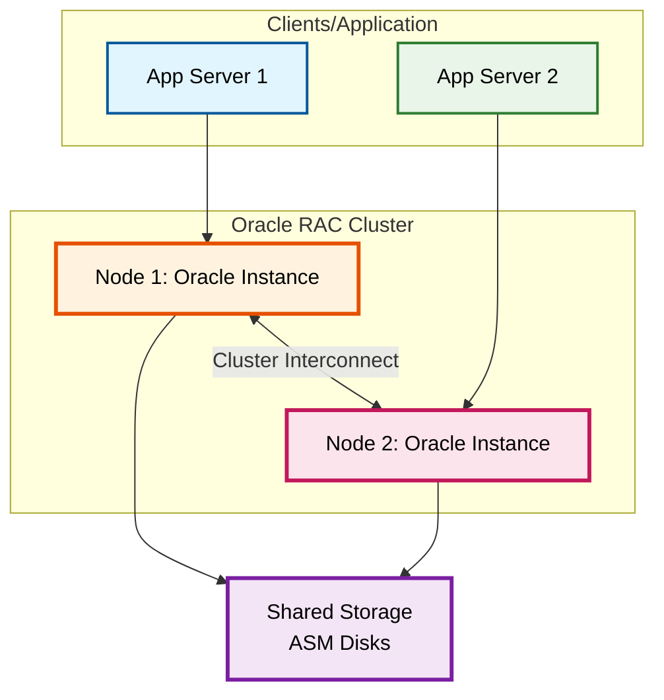
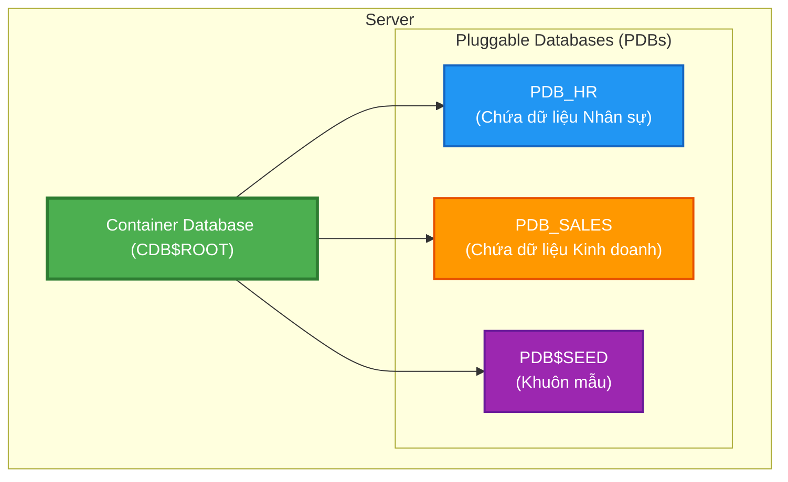
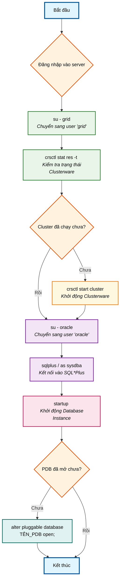
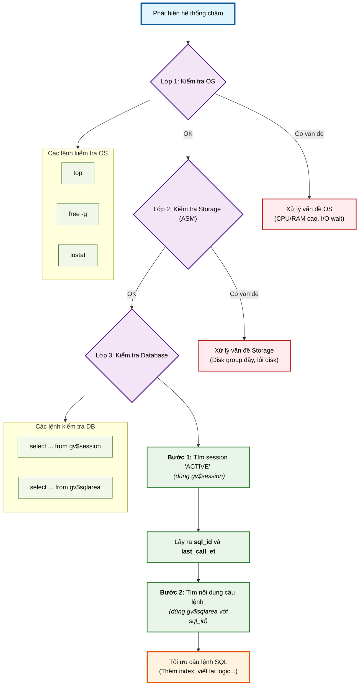
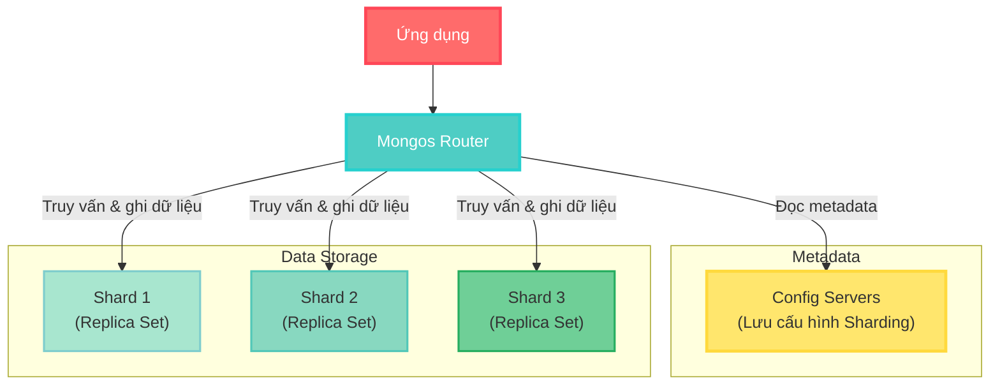
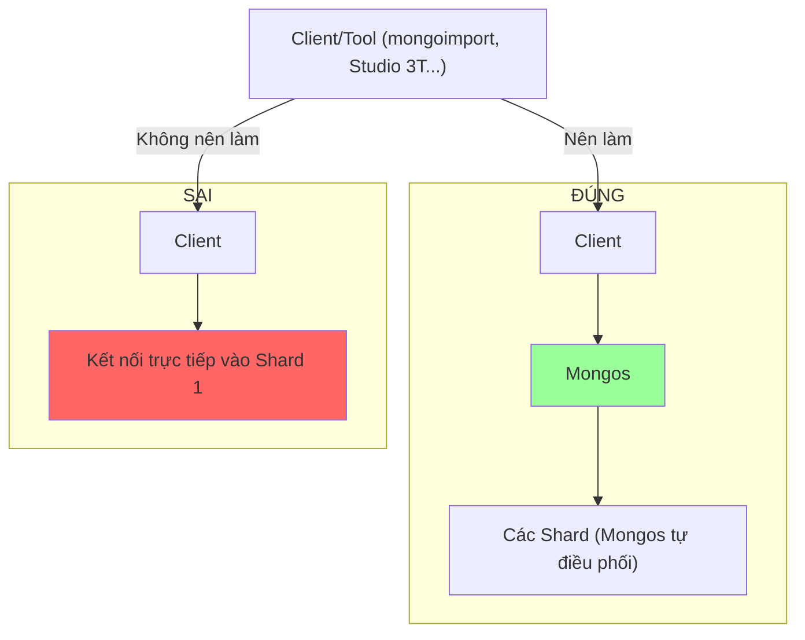

- [**Hướng dẫn Vận hành và Giám sát Oracle \& MongoDB**](#hướng-dẫn-vận-hành-và-giám-sát-oracle--mongodb)
  - [**Phần I: Oracle Database**](#phần-i-oracle-database)
    - [**1. Kiến trúc cốt lõi**](#1-kiến-trúc-cốt-lõi)
    - [**2. Vận hành Cơ bản trong Môi trường RAC**](#2-vận-hành-cơ-bản-trong-môi-trường-rac)
    - [**3. Giám sát và Chẩn đoán Hiệu năng**](#3-giám-sát-và-chẩn-đoán-hiệu-năng)
  - [**Phần II: MongoDB**](#phần-ii-mongodb)
    - [**1. Kiến trúc Sharding (Phân mảnh)**](#1-kiến-trúc-sharding-phân-mảnh)
    - [**2. Vận hành và Giám sát**](#2-vận-hành-và-giám-sát)
      - [**1. Quy trình Import dữ liệu vào Sharded Cluster**](#1-quy-trình-import-dữ-liệu-vào-sharded-cluster)
      - [**2. Giám sát với MongoDB Compass**](#2-giám-sát-với-mongodb-compass)


# **Hướng dẫn Vận hành và Giám sát Oracle & MongoDB**

## **Phần I: Oracle Database**

### **1. Kiến trúc cốt lõi**

**1. Oracle Real Application Clusters (RAC)**

RAC cho phép nhiều máy chủ (nodes) cùng truy cập vào một CSDL duy nhất, mang lại tính sẵn sàng cao và khả năng mở rộng tuyệt vời.



*   **Giải thích sơ đồ:**
    *   **Node 1 & Node 2:** Là hai máy chủ vật lý hoặc ảo, mỗi máy chạy một *instance* của Oracle.
    *   **Cluster Interconnect:** Là một mạng riêng tốc độ cao để các node trao đổi thông tin với nhau (cache fusion, heartbeat...).
    *   **Shared Storage:** Là nơi lưu trữ toàn bộ dữ liệu của CSDL, được cả hai node cùng truy cập.

**2. Kiến trúc Đa người dùng (Multitenant: CDB & PDB)**

Kiến trúc này giống như một tòa nhà chung cư: CDB là tòa nhà, còn các PDB là những căn hộ riêng biệt bên trong.



*   **Giải thích sơ đồ:**
    *   **Container Database (CDB):** Quản lý các tài nguyên chung (metadata, users chung).
    *   **Pluggable Database (PDB):** Là các CSDL độc lập chứa dữ liệu và đối tượng của từng ứng dụng. Chúng được "cắm" vào CDB.

### **2. Vận hành Cơ bản trong Môi trường RAC**

**Quy trình Khởi động (Startup) một CSDL RAC**



**Lệnh thực tế:**

1.  **Kiểm tra và khởi động Clusterware (với user `grid`):**
    ```bash
    su - grid
    crsctl stat res -t # Kiểm tra trạng thái
    # Nếu cần, khởi động: crsctl start cluster -all
    ```

2.  **Khởi động CSDL (với user `oracle`):**
    ```bash
    su - oracle
    sqlplus / as sysdba
    SQL> startup
    SQL> show pdbs; -- Kiểm tra trạng thái PDBs
    SQL> alter pluggable database all open; -- Mở tất cả PDBs
    ```

### **3. Giám sát và Chẩn đoán Hiệu năng**

**Quy trình Chẩn đoán một Vấn đề về Hiệu năng**



**Các câu lệnh SQL chẩn đoán:**

1.  **Bước 1: Tìm session đang chạy lâu và lấy `sql_id`**
    ```sql
    SELECT machine, schemaname, sql_id, last_call_et
    FROM gv$session
    WHERE status = 'ACTIVE' AND type != 'BACKGROUND'
    ORDER BY last_call_et DESC;
    ```
2.  **Bước 2: Lấy nội dung câu lệnh SQL từ `sql_id`**
    ```sql
    -- Thay ':your_sql_id' bằng sql_id bạn tìm được
    SELECT sql_fulltext
    FROM gv$sqlarea
    WHERE sql_id = ':your_sql_id';
    ```

---

## **Phần II: MongoDB**

### **1. Kiến trúc Sharding (Phân mảnh)**

Sharding là cách MongoDB phân tán dữ liệu ra nhiều máy chủ để xử lý khối lượng công việc khổng lồ.



*   **Giải thích sơ đồ:**
    *   **Ứng dụng:** Chỉ cần biết và kết nối tới **Mongos**.
    *   **Mongos (Router):** Nhận truy vấn, hỏi **Config Servers** xem dữ liệu nằm ở đâu, sau đó chuyển truy vấn đến **Shard** tương ứng.
    *   **Config Servers:** Là "bộ não" của cluster, chứa bản đồ dữ liệu.
    *   **Shards:** Là các cụm replica set lưu trữ các phần dữ liệu đã được phân mảnh.

### **2. Vận hành và Giám sát**

#### **1. Quy trình Import dữ liệu vào Sharded Cluster**



> **Lưu ý quan trọng:** Luôn luôn thực hiện các thao tác (đọc, ghi, import...) thông qua **Mongos**. Việc import trực tiếp vào một Shard sẽ làm hỏng metadata và gây mất cân bằng dữ liệu nghiêm trọng trong cluster.

#### **2. Giám sát với MongoDB Compass**

MongoDB Compass là công cụ GUI trực quan để giám sát và quản lý MongoDB.

1.  Kết nối Compass đến địa chỉ của **Mongos**.
2.  Vào tab **Performance**.
3.  Tìm mục **Slowest Operations**.
    *   Mục này liệt kê các truy vấn chạy chậm nhất.
    *   Bạn có thể xem chi tiết câu lệnh (filter, projection), thời gian chạy, số document được quét (docsExamined) so với số document trả về (nReturned).
    *   Đây là điểm khởi đầu tuyệt vời để tìm ra truy vấn cần tối ưu (ví dụ: tạo index).