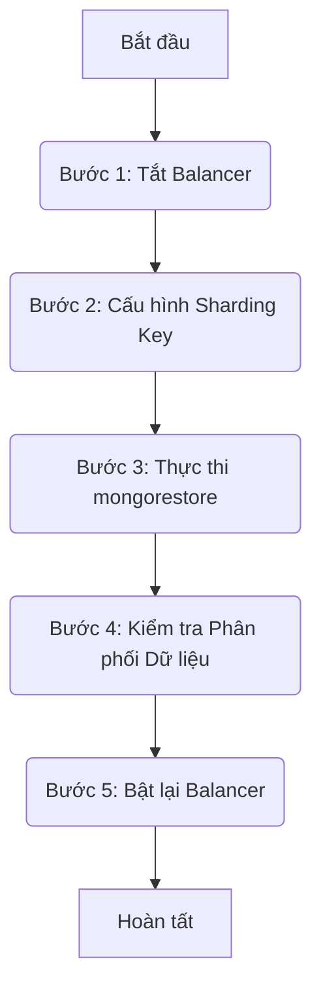
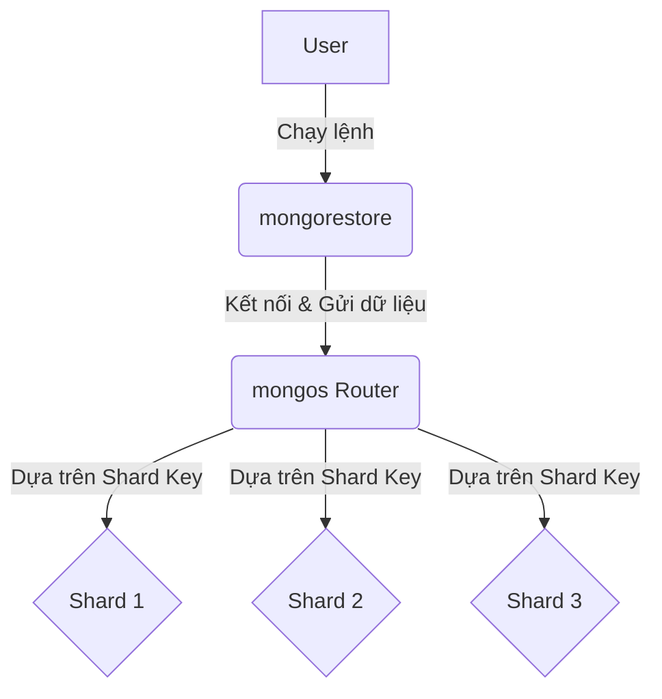
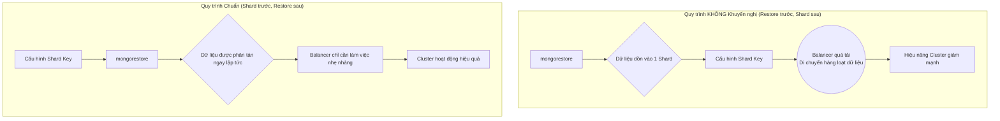

### **Hướng dẫn Kỹ thuật: Khôi phục Dữ liệu (`mongodump`) vào MongoDB Sharded Cluster**

**Mục tiêu:** Tài liệu này cung cấp một quy trình chi tiết, an toàn và hiệu quả để khôi phục một bản sao lưu luận lý (logical backup) được tạo bởi `mongodump` vào một hệ thống MongoDB Sharded Cluster đang hoạt động.

#### **Tổng quan Kiến trúc Sharded Cluster**

Trước khi bắt đầu, cần hiểu rõ các thành phần của kiến trúc đích. Dữ liệu sẽ được khôi phục thông qua `mongos` router, và sau đó được phân phối đến các Shard dựa trên cấu hình được lưu tại Config Server.

```mermaid
graph LR
    subgraph "Sharded Cluster"
        A[Client/mongorestore] --> B(mongos Router);
        B -- Reads/Writes Data --> C{Shard 1 (Replica Set)};
        B -- Reads/Writes Data --> D{Shard 2 (Replica Set)};
        B -- Reads/Writes Data --> E{Shard 3 (Replica Set)};
        B -- Reads Metadata --> F[Config Servers (Replica Set)];
        C --- F;
        D --- F;
        E --- F;
    end
```

---

### **Giai đoạn 1: Phân tích & Chuẩn bị**

Đây là giai đoạn quan trọng nhất để đảm bảo quá trình khôi phục diễn ra thành công và không gây ra các sự cố không mong muốn.

#### **1.1. Xác định Loại và Nội dung Backup**

*   **Hành động:** Kiểm tra cấu trúc thư mục của bản backup.
*   **Dấu hiệu:** Một bản backup từ `mongodump` sẽ có cấu trúc thư mục con tương ứng với tên các database. Bên trong mỗi thư mục này là các file `.bson` (dữ liệu) và `.metadata.json` (thông tin index).
*   **Công cụ:** `ll /path/to/backup/dir`

#### **1.2. Phân tích Rủi ro & Xác định Phạm vi Restore**

*   **Mục tiêu:** Xác định các database hệ thống cần được loại trừ để đảm bảo an toàn cho cluster đích.
*   **Phân tích `admin` database:**
    *   Chứa thông tin người dùng và quyền hạn.
    *   **Rủi ro:** Khôi phục `admin` sẽ ghi đè toàn bộ cấu hình bảo mật của cluster đích. Nếu không có mật khẩu của các tài khoản trong backup, sẽ dẫn đến mất quyền quản trị.
    *   **Khuyến nghị:** Luôn loại trừ `admin` trừ khi mục tiêu là nhân bản y hệt một cluster (bao gồm cả tài khoản).
*   **Phân tích `config` database:**
    *   Chứa siêu dữ liệu về cấu trúc của cluster (shards, chunks).
    *   **Rủi ro:** Khôi phục `config` từ một cluster khác gần như chắc chắn sẽ **phá hỏng hoàn toàn** cluster đích.
    *   **Khuyến nghị:** **TUYỆT ĐỐI KHÔNG** khôi phục database `config`.
*   **Hành động:** Sử dụng tùy chọn `--nsExclude` trong lệnh `mongorestore` để loại trừ `admin.*` và `config.*`.

#### **1.3. Trích xuất Cấu trúc Sharding Gốc**

*   **Mục tiêu:** Để dữ liệu được phân tán ngay khi khôi phục, cần phải tái tạo lại cấu trúc sharding của hệ thống gốc.
*   **Hành động:** Sử dụng `bsondump` để đọc file siêu dữ liệu về các collection từ bản backup.
    ```bash
    bsondump --pretty /path/to/backup/dir/config/collections.bson
    ```
*   **Phân tích kết quả:** Tìm các document JSON có `"_id"` là tên collection và đọc giá trị của trường `"key"`. Đây chính là sharding key.
    *   Ví dụ: `"key": { "ORG_ID": "hashed" }` cho biết collection được sharding theo trường `ORG_ID` với phương pháp `hashed`.

---

### **Giai đoạn 2: Quy trình Thực thi**

Quy trình chuẩn bao gồm 5 bước chính, đảm bảo dữ liệu được khôi phục và phân tán một cách chính xác.



#### **Bước 1: Chuẩn bị Môi trường (Tắt Balancer)**

*   **Mục đích:** Balancer là tiến trình chạy nền để di chuyển các chunk dữ liệu giữa các shard. Việc tắt nó trước khi có một tác vụ ghi lớn (như restore) sẽ ngăn chặn các xung đột, giảm tải không cần thiết và tăng tính ổn định của quá trình.
*   **Lưu ý:** Trong môi trường không quan trọng (non-production), bước này có thể được bỏ qua, nhưng nó được **khuyến nghị mạnh mẽ** cho môi trường production.
*   **Hành động:**
    ```javascript
    // Kết nối vào một mongos bất kỳ và chạy lệnh trong mongo shell
    sh.stopBalancer();
    // Xác nhận lại bằng: sh.getBalancerState() (kết quả phải là false)
    ```

#### **Bước 2: Tái tạo Cấu trúc Sharding**

Đây là bước quyết định để dữ liệu được phân tán ngay lập tức thay vì bị dồn vào một shard duy nhất.

```mermaid
graph LR
    subgraph "Trước khi Cấu hình"
        direction LR
        db1[Database bcqg_gris]
        col1[Collection INP_DATA]
        col2[Collection FLW_FLOW]
    end
    
    subgraph "Sau khi Cấu hình"
        direction LR
        db2[Database bcqg_gris<br/>(sharding enabled)]
        col3[INP_DATA<br/>shard key: {ORG_ID: 'hashed'}]
        col4[FLW_FLOW<br/>shard key: {SND_ORG: 'hashed'}]
    end

    db1 -- Chạy sh.enableSharding --> db2;
    col1 -- Chạy sh.shardCollection --> col3;
    col2 -- Chạy sh.shardCollection --> col4;
```
*   **Hành động:** Dựa trên kết quả từ Giai đoạn 1.3, chạy các lệnh sau trong `mongo shell`:
    ```javascript
    // 1. Bật sharding cho database
    sh.enableSharding("bcqg_gris");

    // 2. Cấu hình shard key cho từng collection
    sh.shardCollection("bcqg_gris.INP_DATA", { "ORG_ID": "hashed" });
    sh.shardCollection("bcqg_gris.FLW_FLOW", { "SND_ORG": "hashed" });
    ```

#### **Bước 3: Thực thi Khôi phục Dữ liệu**

`mongorestore` sẽ kết nối tới `mongos`. `mongos` sẽ đọc cấu hình sharding bạn vừa tạo và phân phối dữ liệu đến các shard phù hợp.


*   **Hành động:** Mở một cửa sổ terminal mới và chạy lệnh `mongorestore` hoàn chỉnh.
    ```bash
    # Thay thế các giá trị trong <>
    mongorestore --host localhost --port <Cổng_của_mongos> \
    -u <tên_user_quản_trị> \
    -p \
    --authenticationDatabase admin \
    --nsExclude="admin.*" \
    --nsExclude="config.*" \
    --dir=/path/to/backup/dir
    ```

---

### **Giai đoạn 3: Kiểm tra & Hoàn tất**

#### **Bước 4: Kiểm tra Phân phối Dữ liệu**

*   **Mục đích:** Xác minh rằng dữ liệu đã được phân tán trên các shard như mong đợi.
*   **Hành động:** Trong `mongo shell`, chạy lệnh sau cho các collection đã được sharding:
    ```javascript
    use bcqg_gris;
    printjson(db.INP_DATA.getShardDistribution());
    ```
*   **Phân tích kết quả:** Output thành công sẽ liệt kê nhiều shard (ví dụ: `shard01`, `shard02`, `shard03`) và cho thấy mỗi shard đều đang chứa dữ liệu (`data`), tài liệu (`docs`) và các chunk (`chunks`).

#### **Bước 5: Kích hoạt lại Balancer**

*   **Mục đích:** Cho phép MongoDB tiếp tục tự động cân bằng dữ liệu khi có thay đổi trong tương lai.
*   **Hành động:**
    ```javascript
    // Chạy trong mongo shell
    sh.startBalancer();
    ```

---

### **Phụ lục: So sánh Quy trình Restore**

Sơ đồ dưới đây minh họa sự khác biệt nghiêm trọng về hiệu năng giữa việc cấu hình sharding trước và sau khi restore.

