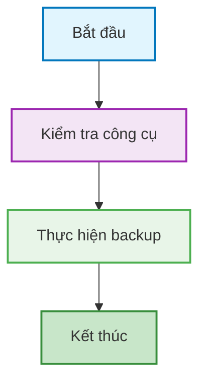
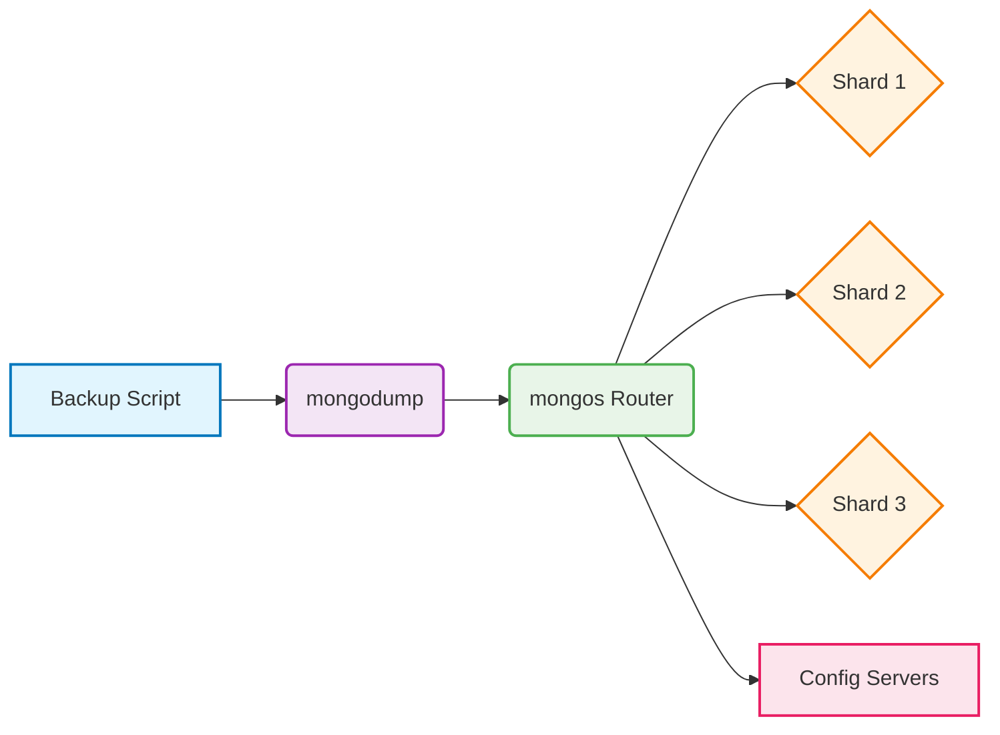

- [MongoDB Sharded Cluster Backup Script](#mongodb-sharded-cluster-backup-script)
  - [Tổng quan về Quy trình Sao lưu](#tổng-quan-về-quy-trình-sao-lưu)
  - [Phân tích chi tiết Script](#phân-tích-chi-tiết-script)
    - [1. Cấu hình ban đầu](#1-cấu-hình-ban-đầu)
    - [2. Các hàm hỗ trợ](#2-các-hàm-hỗ-trợ)
    - [3. Tạo thư mục và bắt đầu backup](#3-tạo-thư-mục-và-bắt-đầu-backup)
    - [4. Kiểm tra công cụ cần thiết](#4-kiểm-tra-công-cụ-cần-thiết)
    - [5. Thực hiện backup toàn bộ cluster](#5-thực-hiện-backup-toàn-bộ-cluster)
    - [6. Tổng kết quá trình](#6-tổng-kết-quá-trình)
  - [Kiến trúc Sharding và Quy trình Backup](#kiến-trúc-sharding-và-quy-trình-backup)
  - [Cách sử dụng Script](#cách-sử-dụng-script)
  - [Tự động hóa Sao lưu với Cron (Crontab)](#tự-động-hóa-sao-lưu-với-cron-crontab)
    - [1. Tạo script wrapper cho crontab](#1-tạo-script-wrapper-cho-crontab)
    - [2. Thiết lập quyền thực thi cho wrapper](#2-thiết-lập-quyền-thực-thi-cho-wrapper)
    - [3. Chỉnh sửa crontab](#3-chỉnh-sửa-crontab)
    - [4. Thêm lịch trình backup vào crontab](#4-thêm-lịch-trình-backup-vào-crontab)
    - [5. Các tùy chọn lịch trình khác cho crontab](#5-các-tùy-chọn-lịch-trình-khác-cho-crontab)
    - [6. Kiểm tra crontab và cron job](#6-kiểm-tra-crontab-và-cron-job)
  - [Quản lý Backup](#quản-lý-backup)
    - [1. Xóa backup cũ](#1-xóa-backup-cũ)
    - [2. Thêm script dọn dẹp vào crontab](#2-thêm-script-dọn-dẹp-vào-crontab)
  - [Script hoàn chỉnh (backup.sh)](#script-hoàn-chỉnh-backupsh)


# MongoDB Sharded Cluster Backup Script

## Tổng quan về Quy trình Sao lưu

Quy trình sao lưu MongoDB sharded cluster sử dụng mongodump trực tiếp qua mongos để thực hiện backup online mà không ảnh hưởng đến hoạt động của cluster (không dừng balancer hoặc khóa ghi). Theo tài liệu chính thức của MongoDB, để đảm bảo tính nhất quán dữ liệu, nên dừng balancer và khóa cluster trong quá trình backup để tránh chunk migrations hoặc ghi đồng thời gây không nhất quán. Tuy nhiên, theo yêu cầu cụ thể (backup online ngoài giờ hành chính), script được tối ưu hóa để chạy đơn giản mà không gián đoạn hoạt động, chấp nhận rủi ro nhỏ về tính nhất quán nếu có hoạt động ghi thấp.

> "Starting in MongoDB 7.1 (also available starting in 7.0.2, 6.0.11, and 5.0.22), you can back up data on sharded clusters using [mongodump.](https://www.mongodb.com/docs/database-tools/mongodump/#std-program-mongodump)"

> "[mongodump](https://www.mongodb.com/docs/database-tools/mongodump/#std-program-mongodump) is a utility that creates a binary export of database content. You can use the `mongodump` utility to take self-managed backups of a sharded cluster."

> "To back up a sharded cluster with `mongodump`, you must stop the balancer, stop writes, and stop any schema transformation operations on the cluster. This helps reduce the likelihood of inconsistencies in the backup."

> "Backups provide a snapshot of the current state of the database. When you restore from a backup, the restored database doesn't include any changes made after the backup was taken, which can result in data loss."

Dưới đây là sơ đồ minh họa quy trình:



## Phân tích chi tiết Script

### 1. Cấu hình ban đầu

Đoạn code đầu tiên thiết lập các biến môi trường và cấu hình cho quá trình backup. Thiết lập này dựa trên các thực hành tốt nhất để tùy chỉnh script mà không cần sửa code, phù hợp với các ví dụ trong tài liệu MongoDB về sử dụng biến môi trường cho công cụ như mongodump.

```bash
#!/bin/bash
set -euo pipefail

# ================== CẤU HÌNH ==================
MONGO_HOST="${MONGO_HOST:-localhost}"      # mongos host
MONGO_PORT="${MONGO_PORT:-27017}"          # mongos port
MONGO_USER="${MONGO_USER:-mongodba}"       # user có quyền backup
MONGO_AUTH_DB="${MONGO_AUTH_DB:-admin}"    # DB xác thực (thường admin)
MONGO_PASS="${MONGO_PASS:-}"               # LẤY TỪ ENV
: "${MONGO_PASS:?Vui lòng export MONGO_PASS trước khi chạy}"

BASE_BACKUP_PATH="${BASE_BACKUP_PATH:-/mnt/backup}"
TIMESTAMP="$(date '+%Y%m%d_%H%M%S')"
CURRENT_BACKUP_DIR="${BASE_BACKUP_PATH}/mongo_backup_${TIMESTAMP}"
LOG_FILE="${BASE_BACKUP_PATH}/mongodb_backup_${TIMESTAMP}.log"
```

**Giải thích:**
- `#!/bin/bash`: Khai báo sử dụng shell bash
- `set -euo pipefail`: Thiết lập các tùy chọn để script dừng ngay khi có lỗi
  - `-e`: Dừng khi lệnh thất bại
  - `-u`: Dừng khi sử dụng biến chưa được định nghĩa
  - `-o pipefail`: Dừng khi bất kỳ lệnh nào trong pipeline thất bại
- Các biến môi trường cho phép tùy chỉnh mà không cần sửa script
- `: "${MONGO_PASS:?...}"`: Kiểm tra bắt buộc biến MONGO_PASS phải được thiết lập
- LOG_FILE được thêm timestamp để mỗi lần backup có file log riêng (ví dụ: mongodb_backup_20250910_112233.log)

### 2. Các hàm hỗ trợ

Script định nghĩa một số hàm để thực hiện các tác vụ cụ thể. Hàm `run_mongosh_js` dựa trên cách sử dụng mongosh để thực thi JavaScript, tương tự các ví dụ trong tài liệu MongoDB về kết nối và chạy lệnh qua mongos.

```bash
log_message() {
  mkdir -p "$(dirname "$LOG_FILE")" >/dev/null 2>&1 || true
  echo "$(date '+%Y-%m-%d %H:%M:%S') - $1" | tee -a "$LOG_FILE"
}

command_exists() { command -v "$1" >/dev/null 2>&1; }

run_mongosh_js() {
  local js="$1"
  mongosh --host "$MONGO_HOST" --port "$MONGO_PORT" \
          -u "$MONGO_USER" -p "$MONGO_PASS" --authenticationDatabase "$MONGO_AUTH_DB" \
          --quiet --eval "$js"
}
```

**Giải thích:**
- `log_message()`: Ghi log với timestamp vào file log và hiển thị trên console
- `command_exists()`: Kiểm tra công cụ tồn tại
- `run_mongosh_js()`: Thực thi các lệnh JavaScript trong MongoDB shell (giữ nguyên nhưng không dùng để stop/start balancer nữa). Theo tài liệu, mongosh là công cụ khuyến nghị để chạy lệnh admin trên mongos.

### 3. Tạo thư mục và bắt đầu backup

```bash
# ================== BẮT ĐẦU ==================
mkdir -p "$BASE_BACKUP_PATH" "$CURRENT_BACKUP_DIR"

log_message "========================================================="
log_message "BẮT ĐẦU SAO LƯU SHARDED CLUSTER (mongos: ${MONGO_HOST}:${MONGO_PORT})"
log_message "ĐÍCH BACKUP: ${CURRENT_BACKUP_DIR}"
log_message "========================================================="
```

Đoạn này tạo các thư mục cần thiết và ghi log bắt đầu quá trình backup.

### 4. Kiểm tra công cụ cần thiết

```bash
# 1) Kiểm tra công cụ
command_exists mongosh  || { log_message "LỖI: thiếu mongosh";  exit 1; }
command_exists mongodump|| { log_message "LỖI: thiếu mongodump"; exit 1; }
```

Script kiểm tra sự tồn tại của `mongosh` và `mongodump` - hai công cụ cần thiết cho quá trình backup. Theo tài liệu chính thức, mongodump là công cụ chính để backup sharded cluster qua mongos.

> "This task uses [mongodump](https://www.mongodb.com/docs/database-tools/mongodump/#std-program-mongodump) to back up a sharded cluster. Ensure that you have a cluster running that contains data in sharded collections."

### 5. Thực hiện backup toàn bộ cluster

```bash
# 2) Dump toàn bộ (qua mongos, --out theo ví dụ docs, không --gzip, không khóa ghi)
log_message "Backup toàn bộ cluster..."
if mongodump \
      --host "$MONGO_HOST" --port "$MONGO_PORT" \
      --username "$MONGO_USER" --password "$MONGO_PASS" \
      --authenticationDatabase "$MONGO_AUTH_DB" \
      --out "$CURRENT_BACKUP_DIR" \
      2>&1 | tee -a "$LOG_FILE"; then
  log_message "THÀNH CÔNG: Backup toàn bộ → ${CURRENT_BACKUP_DIR}"
else
  log_message "THẤT BẠI: Backup"
  exit 1
fi
```

Thực hiện backup toàn bộ cluster thông qua mongos:
- Sử dụng `mongodump` với các tham số kết nối. Lệnh này dựa trực tiếp trên ví dụ trong tài liệu chính thức: "This task uses [mongodump](https://www.mongodb.com/docs/database-tools/mongodump/#std-program-mongodump) to back up a sharded cluster."
- Ghi kết quả vào thư mục backup đã tạo
- Không dừng balancer hoặc khóa ghi để tránh gián đoạn hoạt động, nhưng khuyến nghị chạy ngoài giờ để giảm rủi ro không nhất quán. Tài liệu cảnh báo: 

> "These steps can only produce a consistent backup if they are followed exactly and no operations are in progress when you begin."

> "The sharded cluster must remain locked during the backup process to protect the database from writes, which may cause inconsistencies in the backup."

> "To lock a sharded cluster, connect to [mongos](/docs/manual/reference/program/mongos/#std-program-mongos) and use the [db.fsyncLock()](/docs/manual/reference/method/db.fsyncLock/#mongodb-method-db.fsyncLock) method: `db.getSiblingDB("admin").fsyncLock()`"

> "To prevent chunk migrations from disrupting the backup, connect to [mongos](/docs/manual/reference/program/mongos/#std-program-mongos) and use the [sh.stopBalancer()](/docs/manual/reference/method/sh.stopBalancer/#mongodb-method-sh.stopBalancer) method to stop the balancer: `sh.stopBalancer()`"

> "If a balancing round is in progress, the operation waits for balancing to complete."

> "To verify that the balancer is stopped, use the [sh.getBalancerState()](/docs/manual/reference/method/sh.getBalancerState/#mongodb-method-sh.getBalancerState) method: `use config while( sh.isBalancerRunning().mode != "off" ) { print( "Waiting for Balancer to stop..." ); sleep( 1000 );}`"

### 6. Tổng kết quá trình

```bash
# 3) Tổng kết
log_message "========================================================="
log_message "HOÀN TẤT. Vị trí backup: ${CURRENT_BACKUP_DIR}"
log_message "Log: ${LOG_FILE}"
log_message "========================================================="

exit 0
```

Ghi log kết thúc và thoát script với mã thành công.

## Kiến trúc Sharding và Quy trình Backup

Sơ đồ dưới đây minh họa kiến trúc MongoDB sharded cluster và vị trí của mongos trong quá trình backup:



## Cách sử dụng Script

1. Export biến môi trường chứa mật khẩu:
   ```bash
   export MONGO_PASS="your_password"
   ```

2. Chạy script:
   ```bash
   ./backup.sh  # Lưu ý: Đổi tên file thành backup.sh nếu cần, vì .md không thực thi được
   ```

3. Script sẽ tạo thư mục backup với timestamp và lưu log riêng cho từng lần chạy.

## Tự động hóa Sao lưu với Cron (Crontab)

Để tự động hóa, tích hợp script vào crontab để chạy định kỳ. Dưới đây là quy trình chi tiết để viết và thêm vào crontab:

```mermaid
flowchart LR
    A[Bắt đầu] --> B[Tạo script backup]
    B --> C[Thiết lập biến môi trường]
    C --> D[Chỉnh sửa crontab]
    D --> E[Thêm lịch trình]
    E --> F[Kiểm tra cron]
    F --> G[Hoàn tất]
    
    style A fill:#e1f5fe,stroke:#0277bd,stroke-width:2px
    style B fill:#f3e5f5,stroke:#9c27b0,stroke-width:2px
    style C fill:#e8f5e8,stroke:#4caf50,stroke-width:2px
    style D fill:#fff3e0,stroke:#f57c00,stroke-width:2px
    style E fill:#fce4ec,stroke:#e91e63,stroke-width:2px
    style F fill:#f1f8e9,stroke:#689f38,stroke-width:2px
    style G fill:#c8e6c9,stroke:#388e3c,stroke-width:2px
```



### 1. Tạo script wrapper cho crontab

Tạo một script wrapper để thiết lập biến môi trường và gọi script backup (vì crontab không giữ biến môi trường):

```bash
#!/bin/bash
# File: /home/user/mongo_backup_wrapper.sh

# Export password (thay bằng mật khẩu thực tế)
export MONGO_PASS="your_actual_password"

# Đường dẫn tới script backup (thay bằng đường dẫn thực tế)
BACKUP_SCRIPT="/path/to/backup.sh"

# Chạy backup script
$BACKUP_SCRIPT >> /var/log/mongo_backup_cron.log 2>&1
```

### 2. Thiết lập quyền thực thi cho wrapper

```bash
chmod +x /home/user/mongo_backup_wrapper.sh
```

### 3. Chỉnh sửa crontab

Mở crontab để chỉnh sửa (cho user hiện tại):

```bash
crontab -e
```

### 4. Thêm lịch trình backup vào crontab

Thêm dòng sau vào file crontab để chạy hàng ngày lúc 2:00 AM (ví dụ):

```
0 2 * * * /home/user/mongo_backup_wrapper.sh >> /var/log/mongo_backup_cron.log 2>&1
```

**Giải thích định dạng crontab:**
- `0`: Phút (0 = đầu giờ)
- `2`: Giờ (2 = 2:00 AM, theo giờ server)
- `*`: Ngày trong tháng (tất cả các ngày)
- `*`: Tháng (tất cả các tháng)
- `*`: Ngày trong tuần (tất cả các ngày trong tuần)
- Lệnh: Chạy wrapper script và ghi log vào file riêng

Lưu và thoát editor (thường là vi hoặc nano) để áp dụng.

### 5. Các tùy chọn lịch trình khác cho crontab

| Mục đích | Lịch trình | Dòng Crontab (thêm vào crontab -e) |
|---------|------------|---------------|
| Mỗi ngày lúc 2:00 AM | Daily at 2:00 AM | `0 2 * * * /home/user/mongo_backup_wrapper.sh >> /var/log/mongo_backup_cron.log 2>&1` |
| Mỗi tuần vào chủ nhật lúc 3:00 AM | Weekly on Sunday at 3:00 AM | `0 3 * * 0 /home/user/mongo_backup_wrapper.sh >> /var/log/mongo_backup_cron.log 2>&1` |
| Mỗi tháng vào ngày 1 lúc 4:00 AM | Monthly on 1st at 4:00 AM | `0 4 1 * * /home/user/mongo_backup_wrapper.sh >> /var/log/mongo_backup_cron.log 2>&1` |
| Mỗi 6 giờ | Every 6 hours | `0 */6 * * * /home/user/mongo_backup_wrapper.sh >> /var/log/mongo_backup_cron.log 2>&1` |

### 6. Kiểm tra crontab và cron job

Kiểm tra danh sách crontab:

```bash
crontab -l
```

Kiểm tra log để xác nhận cron đang chạy:

```bash
tail -f /var/log/mongo_backup_cron.log
```

Lưu ý: Crontab chạy dưới quyền user, đảm bảo user có quyền truy cập MongoDB và thư mục backup. Nếu cần chạy dưới root, dùng `sudo crontab -e`.

## Quản lý Backup

### 1. Xóa backup cũ

Tạo script để xóa các backup cũ hơn 7 ngày (dọn dẹp trong vòng 7 ngày):

```bash
#!/bin/bash
# File: /home/user/cleanup_backups.sh

BACKUP_PATH="/mnt/backup"
KEEP_DAYS=7

find $BACKUP_PATH -name "mongo_backup_*" -type d -mtime +$KEEP_DAYS -exec rm -rf {} \; >> /var/log/cleanup_backups.log 2>&1
```

Thiết lập quyền thực thi:

```bash
chmod +x /home/user/cleanup_backups.sh
```

### 2. Thêm script dọn dẹp vào crontab

Thêm dòng sau vào crontab (crontab -e) để xóa hàng ngày lúc 3:00 AM:

```
0 3 * * * /home/user/cleanup_backups.sh
```

## Script hoàn chỉnh (backup.sh)

```bash
#!/bin/bash
set -euo pipefail

# ================== CẤU HÌNH ==================
MONGO_HOST="${MONGO_HOST:-localhost}"      # mongos host
MONGO_PORT="${MONGO_PORT:-27017}"          # mongos port
MONGO_USER="${MONGO_USER:-mongodba}"       # user có quyền backup
MONGO_AUTH_DB="${MONGO_AUTH_DB:-admin}"    # DB xác thực (thường admin)
MONGO_PASS="${MONGO_PASS:-}"               # LẤY TỪ ENV
: "${MONGO_PASS:?Vui lòng export MONGO_PASS trước khi chạy}"

BASE_BACKUP_PATH="${BASE_BACKUP_PATH:-/mnt/backup}"
TIMESTAMP="$(date '+%Y%m%d_%H%M%S')"
CURRENT_BACKUP_DIR="${BASE_BACKUP_PATH}/mongo_backup_${TIMESTAMP}"
LOG_FILE="${BASE_BACKUP_PATH}/mongodb_backup_${TIMESTAMP}.log"

log_message() {
  mkdir -p "$(dirname "$LOG_FILE")" >/dev/null 2>&1 || true
  echo "$(date '+%Y-%m-%d %H:%M:%S') - $1" | tee -a "$LOG_FILE"
}

command_exists() { command -v "$1" >/dev/null 2>&1; }

run_mongosh_js() {
  local js="$1"
  mongosh --host "$MONGO_HOST" --port "$MONGO_PORT" \
          -u "$MONGO_USER" -p "$MONGO_PASS" --authenticationDatabase "$MONGO_AUTH_DB" \
          --quiet --eval "$js"
}

# ================== BẮT ĐẦU ==================
mkdir -p "$BASE_BACKUP_PATH" "$CURRENT_BACKUP_DIR"

log_message "========================================================="
log_message "BẮT ĐẦU SAO LƯU SHARDED CLUSTER (mongos: ${MONGO_HOST}:${MONGO_PORT})"
log_message "ĐÍCH BACKUP: ${CURRENT_BACKUP_DIR}"
log_message "========================================================="

# 1) Kiểm tra công cụ
command_exists mongosh  || { log_message "LỖI: thiếu mongosh";  exit 1; }
command_exists mongodump|| { log_message "LỖI: thiếu mongodump"; exit 1; }

# 2) Dump toàn bộ (qua mongos, --out theo ví dụ docs, không --gzip, không khóa ghi)
log_message "Backup toàn bộ cluster..."
if mongodump \
      --host "$MONGO_HOST" --port "$MONGO_PORT" \
      --username "$MONGO_USER" --password "$MONGO_PASS" \
      --authenticationDatabase "$MONGO_AUTH_DB" \
      --out "$CURRENT_BACKUP_DIR" \
      2>&1 | tee -a "$LOG_FILE"; then
  log_message "THÀNH CÔNG: Backup toàn bộ → ${CURRENT_BACKUP_DIR}"
else
  log_message "THẤT BẠI: Backup"
  exit 1
fi

# 3) Tổng kết
log_message "========================================================="
log_message "HOÀN TẤT. Vị trí backup: ${CURRENT_BACKUP_DIR}"
log_message "Log: ${LOG_FILE}"
log_message "========================================================="

exit 0
```