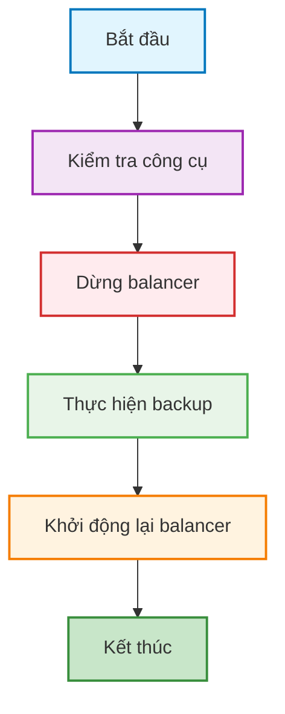
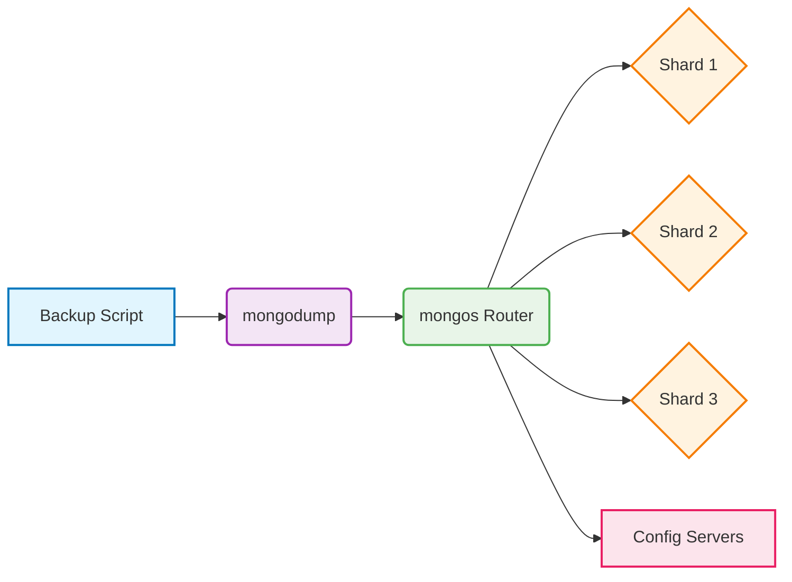

# MongoDB Sharded Cluster Backup Script

## Tổng quan về Quy trình Sao lưu

Quy trình sao lưu MongoDB sharded cluster yêu cầu dừng balancer để đảm bảo tính nhất quán của dữ liệu trong suốt quá trình backup. Dưới đây là sơ đồ minh họa quy trình:



## Phân tích chi tiết Script

### 1. Cấu hình ban đầu

Đoạn code đầu tiên thiết lập các biến môi trường và cấu hình cho quá trình backup:

```bash
#!/bin/bash
set -euo pipefail

# ================== CẤU HÌNH ==================
MONGO_HOST="${MONGO_HOST:-localhost}"      # mongos host
MONGO_PORT="${MONGO_PORT:-27017}"          # mongos port
MONGO_USER="${MONGO_USER:-mongodba}"       # user có quyền backup
MONGO_AUTH_DB="${MONGO_AUTH_DB:-admin}"    # DB xác thực (thường admin)
MONGO_PASS="${MONGO_PASS:-}"               # LẤY TỪ ENV
: "${MONGO_PASS:?Vui lòng export MONGO_PASS trước khi chạy}"

BASE_BACKUP_PATH="${BASE_BACKUP_PATH:-/mnt/backup}"
TIMESTAMP="$(date '+%Y%m%d_%H%M%S')"
CURRENT_BACKUP_DIR="${BASE_BACKUP_PATH}/mongo_backup_${TIMESTAMP}"
LOG_FILE="${BASE_BACKUP_PATH}/mongodb_backup.log"
```

**Giải thích:**
- `#!/bin/bash`: Khai báo sử dụng shell bash
- `set -euo pipefail`: Thiết lập các tùy chọn để script dừng ngay khi có lỗi
  - `-e`: Dừng khi lệnh thất bại
  - `-u`: Dừng khi sử dụng biến chưa được định nghĩa
  - `-o pipefail`: Dừng khi bất kỳ lệnh nào trong pipeline thất bại
- Các biến môi trường cho phép tùy chỉnh mà không cần sửa script
- `: "${MONGO_PASS:?...}"`: Kiểm tra bắt buộc biến MONGO_PASS phải được thiết lập

### 2. Các hàm hỗ trợ

Script định nghĩa một số hàm để thực hiện các tác vụ cụ thể:

```bash
log_message() {
  mkdir -p "$(dirname "$LOG_FILE")" >/dev/null 2>&1 || true
  echo "$(date '+%Y-%m-%d %H:%M:%S') - $1" | tee -a "$LOG_FILE"
}

run_mongosh_js() {
  local js="$1"
  mongosh --host "$MONGO_HOST" --port "$MONGO_PORT" \
          -u "$MONGO_USER" -p "$MONGO_PASS" --authenticationDatabase "$MONGO_AUTH_DB" \
          --quiet --eval "$js"
}
```

**Giải thích:**
- `log_message()`: Ghi log với timestamp vào file log và hiển thị trên console
- `run_mongosh_js()`: Thực thi các lệnh JavaScript trong MongoDB shell

### 3. Tạo thư mục và bắt đầu backup

```bash
# ================== BẮT ĐẦU ==================
mkdir -p "$BASE_BACKUP_PATH" "$CURRENT_BACKUP_DIR"

log_message "========================================================="
log_message "BẮT ĐẦU SAO LƯU SHARDED CLUSTER (mongos: ${MONGO_HOST}:${MONGO_PORT})"
log_message "ĐÍCH BACKUP: ${CURRENT_BACKUP_DIR}"
log_message "========================================================="
```

Đoạn này tạo các thư mục cần thiết và ghi log bắt đầu quá trình backup.

### 4. Kiểm tra công cụ cần thiết

```bash
# 1) Kiểm tra công cụ
command_exists mongosh  || { log_message "LỖI: thiếu mongosh";  exit 1; }
command_exists mongodump|| { log_message "LỖI: thiếu mongodump"; exit 1; }
```

Script kiểm tra sự tồn tại của `mongosh` và `mongodump` - hai công cụ cần thiết cho quá trình backup.

### 5. Dừng balancer

```bash
# 2) Dừng balancer
log_message "Dừng balancer..."
run_mongosh_js 'sh.stopBalancer();'
# Đợi balancer tắt hẳn (tối đa ~2 phút)
run_mongosh_js 'let t=0; while (sh.isBalancerRunning().mode!=="off" && t<120){ sleep(1000); t++; }'
```

Đây là bước quan trọng để đảm bảo tính nhất quán của dữ liệu:
- Gửi lệnh `sh.stopBalancer()` để dừng quá trình di chuyển chunk
- Đợi balancer thực sự dừng bằng vòng lặp kiểm tra trạng thái

### 6. Thực hiện backup toàn bộ cluster

```bash
# 3) Dump toàn bộ (qua mongos, --out theo ví dụ docs, không --gzip, không khóa ghi)
log_message "Backup toàn bộ cluster..."
if mongodump \
      --host "$MONGO_HOST" --port "$MONGO_PORT" \
      --username "$MONGO_USER" --password "$MONGO_PASS" \
      --authenticationDatabase "$MONGO_AUTH_DB" \
      --out "$CURRENT_BACKUP_DIR" \
      2>&1 | tee -a "$LOG_FILE"; then
  log_message "THÀNH CÔNG: Backup toàn bộ → ${CURRENT_BACKUP_DIR}"
else
  log_message "THẤT BẠI: Backup"
  run_mongosh_js 'try{sh.startBalancer();}catch(e){};'
  exit 1
fi
```

Thực hiện backup toàn bộ cluster thông qua mongos:
- Sử dụng `mongodump` với các tham số kết nối
- Ghi kết quả vào thư mục backup đã tạo
- Nếu backup thất bại, khởi động lại balancer trước khi thoát

### 7. Khởi động lại balancer

```bash
# 4) Khởi động lại balancer
log_message "Khởi động lại balancer..."
run_mongosh_js 'sh.startBalancer();' || log_message "CẢNH BÁO: lỗi khi startBalancer."
```

Khởi động lại balancer sau khi hoàn tất backup để tiếp tục phân phối dữ liệu bình thường.

### 8. Tổng kết quá trình

```bash
# 5) Tổng kết
log_message "========================================================="
log_message "HOÀN TẤT. Vị trí backup: ${CURRENT_BACKUP_DIR}"
log_message "Log: ${LOG_FILE}"
log_message "========================================================="

exit 0
```

Ghi log kết thúc và thoát script với mã thành công.

## Kiến trúc Sharding và Quy trình Backup

Sơ đồ dưới đây minh họa kiến trúc MongoDB sharded cluster và vị trí của mongos trong quá trình backup:



## Cách sử dụng Script

1. Export biến môi trường chứa mật khẩu:
   ```bash
   export MONGO_PASS="your_password"
   ```

2. Chạy script:
   ```bash
   ./backup.md
   ```

3. Script sẽ tạo thư mục backup với timestamp và lưu log vào file log.

## Script hoàn chỉnh

```bash
#!/bin/bash
set -euo pipefail

# ================== CẤU HÌNH ==================
MONGO_HOST="${MONGO_HOST:-localhost}"      # mongos host
MONGO_PORT="${MONGO_PORT:-27017}"          # mongos port
MONGO_USER="${MONGO_USER:-mongodba}"       # user có quyền backup
MONGO_AUTH_DB="${MONGO_AUTH_DB:-admin}"    # DB xác thực (thường admin)
MONGO_PASS="${MONGO_PASS:-}"               # LẤY TỪ ENV
: "${MONGO_PASS:?Vui lòng export MONGO_PASS trước khi chạy}"

BASE_BACKUP_PATH="${BASE_BACKUP_PATH:-/mnt/backup}"
TIMESTAMP="$(date '+%Y%m%d_%H%M%S')"
CURRENT_BACKUP_DIR="${BASE_BACKUP_PATH}/mongo_backup_${TIMESTAMP}"
LOG_FILE="${BASE_BACKUP_PATH}/mongodb_backup.log"

log_message() {
  mkdir -p "$(dirname "$LOG_FILE")" >/dev/null 2>&1 || true
  echo "$(date '+%Y-%m-%d %H:%M:%S') - $1" | tee -a "$LOG_FILE"
}

command_exists() { command -v "$1" >/dev/null 2>&1; }

run_mongosh_js() {
  local js="$1"
  mongosh --host "$MONGO_HOST" --port "$MONGO_PORT" \
          -u "$MONGO_USER" -p "$MONGO_PASS" --authenticationDatabase "$MONGO_AUTH_DB" \
          --quiet --eval "$js"
}

# ================== BẮT ĐẦU ==================
mkdir -p "$BASE_BACKUP_PATH" "$CURRENT_BACKUP_DIR"

log_message "========================================================="
log_message "BẮT ĐẦU SAO LƯU SHARDED CLUSTER (mongos: ${MONGO_HOST}:${MONGO_PORT})"
log_message "ĐÍCH BACKUP: ${CURRENT_BACKUP_DIR}"
log_message "========================================================="

# 1) Dừng balancer
log_message "Dừng balancer..."
run_mongosh_js 'sh.stopBalancer();'
# Đợi balancer tắt hẳn (tối đa ~2 phút)
run_mongosh_js 'let t=0; while (sh.isBalancerRunning().mode!=="off" && t<120){ sleep(1000); t++; }'

# 2) Dump toàn bộ (qua mongos, --out theo ví dụ docs, không --gzip, không khóa ghi)
log_message "Backup toàn bộ cluster..."
if mongodump \
      --host "$MONGO_HOST" --port "$MONGO_PORT" \
      --username "$MONGO_USER" --password "$MONGO_PASS" \
      --authenticationDatabase "$MONGO_AUTH_DB" \
      --out "$CURRENT_BACKUP_DIR" \
      2>&1 | tee -a "$LOG_FILE"; then
  log_message "THÀNH CÔNG: Backup toàn bộ → ${CURRENT_BACKUP_DIR}"
else
  log_message "THẤT BẠI: Backup"
  run_mongosh_js 'try{sh.startBalancer();}catch(e){};'
  exit 1
fi

# 3) Khởi động lại balancer
log_message "Khởi động lại balancer..."
run_mongosh_js 'sh.startBalancer();' || log_message "CẢNH BÁO: lỗi khi startBalancer."

# 4) Tổng kết
log_message "========================================================="
log_message "HOÀN TẤT. Vị trí backup: ${CURRENT_BACKUP_DIR}"
log_message "Log: ${LOG_FILE}"
log_message "========================================================="

exit 0
```