- [**Hướng Dẫn Cài Đặt MongoDB Sharded Cluster**](#hướng-dẫn-cài-đặt-mongodb-sharded-cluster)
    - [**Giai đoạn 1: Chuẩn bị Môi trường (Làm trên CẢ 3 MÁY)**](#giai-đoạn-1-chuẩn-bị-môi-trường-làm-trên-cả-3-máy)
      - [**1. Cấu hình File `/etc/hosts`**](#1-cấu-hình-file-etchosts)
      - [**2. Tắt Transparent Huge Pages (THP)**](#2-tắt-transparent-huge-pages-thp)
      - [**3. Tinh chỉnh Kernel (`sysctl`) và Giới hạn (`ulimit`)**](#3-tinh-chỉnh-kernel-sysctl-và-giới-hạn-ulimit)
      - [**4. Xử Lý SELinux (Nếu bạn dùng CentOS/RHEL)**](#4-xử-lý-selinux-nếu-bạn-dùng-centosrhel)
    - [**Giai đoạn 2: Cài đặt và Chuẩn bị Tài nguyên**](#giai-đoạn-2-cài-đặt-và-chuẩn-bị-tài-nguyên)
      - [**1. Cài đặt MongoDB**](#1-cài-đặt-mongodb)
      - [**2. Tạo KeyFile (Xác thực nội bộ)**](#2-tạo-keyfile-xác-thực-nội-bộ)
      - [**3. Tạo Thư mục Dữ liệu và Log**](#3-tạo-thư-mục-dữ-liệu-và-log)
      - [**4. Mở Firewall**](#4-mở-firewall)
    - [**Giai đoạn 3: Dựng Cụm Config Server**](#giai-đoạn-3-dựng-cụm-config-server)
      - [**1. Tạo File Cấu hình (Trên CẢ 3 MÁY)**](#1-tạo-file-cấu-hình-trên-cả-3-máy)
      - [**2. Khởi động Config Server**](#2-khởi-động-config-server)
      - [**3. Khởi tạo Replica Set và Tạo User Admin**](#3-khởi-tạo-replica-set-và-tạo-user-admin)
      - [**4. Bật Xác thực và Khởi động lại**](#4-bật-xác-thực-và-khởi-động-lại)
    - [**Giai đoạn 4: Dựng các Cụm Shard**](#giai-đoạn-4-dựng-các-cụm-shard)
      - [**1. Tạo File Cấu hình (Trên CẢ 3 MÁY)**](#1-tạo-file-cấu-hình-trên-cả-3-máy-1)
      - [**2. Khởi động và Khởi tạo Replica Set cho từng Shard**](#2-khởi-động-và-khởi-tạo-replica-set-cho-từng-shard)
    - [**Giai đoạn 5: Dựng Mongos và Hoàn thiện Cluster**](#giai-đoạn-5-dựng-mongos-và-hoàn-thiện-cluster)
      - [**1. Tạo File Cấu hình Mongos (Trên 1 máy)**](#1-tạo-file-cấu-hình-mongos-trên-1-máy)
      - [**2. Khởi động Mongos**](#2-khởi-động-mongos)
      - [**3. Thêm các Shard vào Cluster**](#3-thêm-các-shard-vào-cluster)
      - [**4. Kích hoạt Sharding và Test**](#4-kích-hoạt-sharding-và-test)
    - [**Giai đoạn 6: Debug, Kiểm tra và Lưu ý Production**](#giai-đoạn-6-debug-kiểm-tra-và-lưu-ý-production)
    - [**Giai đoạn 7: Thao tác và Truy vấn Dữ liệu (Aggregation Framework)**](#giai-đoạn-7-thao-tác-và-truy-vấn-dữ-liệu-aggregation-framework)
      - [**1. Bài toán 1: Lọc, Sắp xếp và Định hình Dữ liệu**](#1-bài-toán-1-lọc-sắp-xếp-và-định-hình-dữ-liệu)
      - [**2. Bài toán 2: Thống kê và Nhóm Dữ liệu**](#2-bài-toán-2-thống-kê-và-nhóm-dữ-liệu)
      - [**3. Bài toán 3: Join Dữ liệu giữa các Collection**](#3-bài-toán-3-join-dữ-liệu-giữa-các-collection)
    - [**Giai đoạn 8: Quản trị Bảo mật và Người dùng**](#giai-đoạn-8-quản-trị-bảo-mật-và-người-dùng)
      - [**1. Tạo User và Gán Role có sẵn**](#1-tạo-user-và-gán-role-có-sẵn)
      - [**2. Tạo Role Tùy chỉnh (Custom Role)**](#2-tạo-role-tùy-chỉnh-custom-role)
      - [**3. Cấu hình Audit Log (Ghi lại hoạt động)**](#3-cấu-hình-audit-log-ghi-lại-hoạt-động)
    - [**Giai đoạn 9: Quản trị Nâng cao và Vận hành Replica Set**](#giai-đoạn-9-quản-trị-nâng-cao-và-vận-hành-replica-set)
      - [**1. Điều chỉnh Primary (Election)**](#1-điều-chỉnh-primary-election)
      - [**2. Cấu hình Hidden Node**](#2-cấu-hình-hidden-node)
      - [**3. Điều chỉnh Kích thước Oplog**](#3-điều-chỉnh-kích-thước-oplog)
    - [**Giai đoạn 10: Sao lưu, Phục hồi và Giám sát**](#giai-đoạn-10-sao-lưu-phục-hồi-và-giám-sát)
      - [**1. Sao lưu và Phục hồi (`mongodump` / `mongorestore`)**](#1-sao-lưu-và-phục-hồi-mongodump--mongorestore)
      - [**2. Phục hồi tại một thời điểm (Point-in-Time Recovery)**](#2-phục-hồi-tại-một-thời-điểm-point-in-time-recovery)
      - [**3. Giám sát Hiệu năng**](#3-giám-sát-hiệu-năng)
    - [**Giai đoạn 11: Tối ưu Hiệu năng Truy vấn với Index**](#giai-đoạn-11-tối-ưu-hiệu-năng-truy-vấn-với-index)
      - [**1. Các loại Index cơ bản và cách tạo**](#1-các-loại-index-cơ-bản-và-cách-tạo)
      - [**2. Phân tích Kế hoạch Thực thi (Execution Plan)**](#2-phân-tích-kế-hoạch-thực-thi-execution-plan)
    - [**Giai đoạn 12: Chiến lược Sharding và Phân phối Dữ liệu**](#giai-đoạn-12-chiến-lược-sharding-và-phân-phối-dữ-liệu)
      - [**1. Lựa chọn Chiến lược Shard Key**](#1-lựa-chọn-chiến-lược-shard-key)
      - [**2. Bẫy người mới khi chọn Shard Key**](#2-bẫy-người-mới-khi-chọn-shard-key)
      - [**3. Kiểm tra Phân phối Dữ liệu**](#3-kiểm-tra-phân-phối-dữ-liệu)
    - [**Giai đoạn 13: Giám sát Nâng cao và Tự động hóa Vận hành**](#giai-đoạn-13-giám-sát-nâng-cao-và-tự-động-hóa-vận-hành)
      - [**1. Phân tích các Tác vụ đang chạy (`db.currentOp`)**](#1-phân-tích-các-tác-vụ-đang-chạy-dbcurrentop)
      - [**2. "Hạ sát" các Truy vấn Gây hại (`db.killOp`)**](#2-hạ-sát-các-truy-vấn-gây-hại-dbkillop)
      - [**3. Tự động hóa Giám sát Tình trạng Replica Set**](#3-tự-động-hóa-giám-sát-tình-trạng-replica-set)
    - [**Giai đoạn 14: Kỹ thuật Phục hồi Nâng cao - Point-in-Time Recovery (PITR)**](#giai-đoạn-14-kỹ-thuật-phục-hồi-nâng-cao---point-in-time-recovery-pitr)
      - [**Quy trình Cứu dữ liệu khi Xóa nhầm**](#quy-trình-cứu-dữ-liệu-khi-xóa-nhầm)
    - [**Giai đoạn 15: Tinh chỉnh Tầng Lưu trữ (Storage Engine Tuning)**](#giai-đoạn-15-tinh-chỉnh-tầng-lưu-trữ-storage-engine-tuning)
      - [**1. Cấu hình Kích thước WiredTiger Cache**](#1-cấu-hình-kích-thước-wiredtiger-cache)
    - [**Tổng kết và Con đường Tiếp theo**](#tổng-kết-và-con-đường-tiếp-theo)


# **Hướng Dẫn Cài Đặt MongoDB Sharded Cluster**


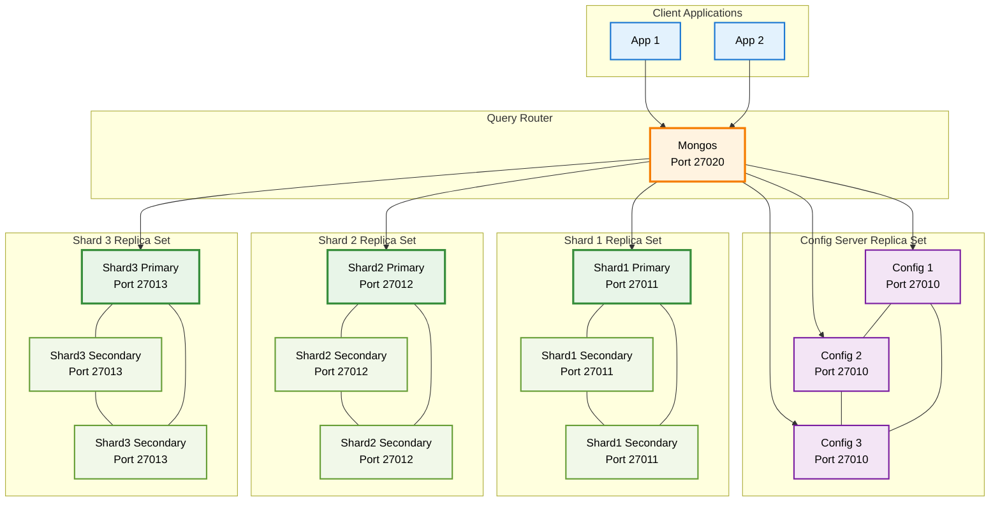

Bài hướng dẫn này sẽ giúp bạn dựng một cụm MongoDB sharding hoàn chỉnh, tập trung vào việc giải thích bản chất và chỉ ra những "bẫy" mà người mới thường gặp.

**Kiến trúc cuối cùng:**
*   **1 Cụm Config Server Replica Set (3 members)**: "Bộ não" lưu trữ metadata của cluster.
*   **3 Cụm Shard Replica Set (mỗi cụm 3 members)**: Nơi lưu trữ và phân tán dữ liệu.
*   **1 Tiến trình Mongos (Query Router)**: Cổng giao tiếp duy nhất cho ứng dụng.

---

### **Giai đoạn 1: Chuẩn bị Môi trường (Làm trên CẢ 3 MÁY)**

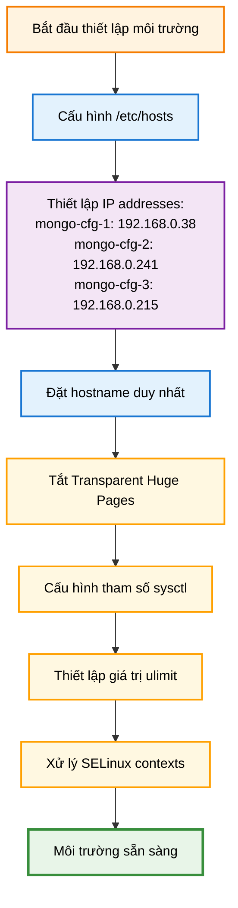

Đây là bước nền tảng quyết định sự ổn định của cả hệ thống.

#### **1. Cấu hình File `/etc/hosts`**

*   **Mục đích:** Dùng hostname (tên dễ nhớ) thay vì IP, giúp cấu hình dễ đọc và quản lý.

⚠️ **BẪY NGƯỜI MỚI - Giai đoạn 1:**
- **Hosts file không đồng nhất giữa các máy** → name resolution lộn xộn
- **Hostname trùng/đổi hostname nhưng không reboot** → nhầm lẫn replica set
- **Quên kiểm tra `/etc/hosts` trên TẤT CẢ máy** → một máy không resolve được các máy khác
*   **Thực hiện đúng:**
    1.  Mở file: `sudo vi /etc/hosts`
    2.  Thêm các dòng sau vào cuối file. **File hosts trên cả 3 máy phải giống hệt nhau.**
        ```
        # --- Mongo Cluster ---
        192.168.0.38   mongo-cfg-1
        192.168.0.241  mongo-cfg-2
        192.168.0.215  mongo-cfg-3
        ```
    3.  Đặt hostname duy nhất cho từng máy:
        ```bash
        # Trên máy 192.168.0.38
        sudo hostnamectl set-hostname mongo-cfg-1
        # Trên máy 192.168.0.241
        sudo hostnamectl set-hostname mongo-cfg-2
        # Trên máy 192.168.0.215
        sudo hostnamectl set-hostname mongo-cfg-3
        ```

#### **2. Tắt Transparent Huge Pages (THP)**

*   **Mục đích cốt lõi:** THP gây sụt giảm hiệu năng nghiêm trọng cho MongoDB. Phải tắt vĩnh viễn để đảm bảo hiệu suất ổn định và tối ưu cho cơ sở dữ liệu.

*   **THP là gì và tại sao nó tồn tại?**
    *   **Transparent Huge Pages (THP)** là một tính năng của kernel Linux, được thiết kế để tăng hiệu năng bằng cách cho phép các ứng dụng sử dụng các "trang bộ nhớ lớn" (huge pages, thường là 2MB thay vì 4KB mặc định) một cách tự động và minh bạch.
    *   Mục đích của THP là giảm số lượng các entry trong bảng chuyển đổi địa chỉ (Translation Lookaside Buffer - TLB), từ đó tăng tốc độ truy cập bộ nhớ cho các ứng dụng sử dụng lượng lớn bộ nhớ một cách tuần tự hoặc có cấu trúc rất lớn.

*   **Tại sao THP lại gây hại cho MongoDB?**
    *   **Xung đột với cách quản lý bộ nhớ của MongoDB (WiredTiger):** MongoDB, đặc biệt là với storage engine WiredTiger, có cơ chế quản lý bộ nhớ của riêng nó rất hiệu quả. WiredTiger chủ động ánh xạ (map) và giải ánh xạ (unmap) các vùng bộ nhớ nhỏ, đồng thời duy trì các cấu trúc dữ liệu của riêng mình trong RAM (ví dụ: WiredTiger cache).
    *   **Phân mảnh bộ nhớ và độ trễ cao:** Khi THP được bật, nó sẽ cố gắng gom các trang bộ nhớ 4KB nhỏ của WiredTiger thành các trang 2MB lớn. Quá trình này có thể dẫn đến các vấn đề nghiêm trọng:
        *   **Tăng độ trễ (Latency Spikes):** Việc cấp phát hoặc giải phóng các huge pages 2MB đòi hỏi nhiều tài nguyên hơn và có thể bị đình trệ. Điều này gây ra "stop-the-world" pauses (tạm dừng toàn bộ hoạt động) trong micro giây hoặc mili giây, gây ra các đỉnh độ trễ đột biến mà MongoDB rất nhạy cảm.
        *   **Hiệu quả cache kém:** Các hoạt động I/O ngẫu nhiên và nhỏ của MongoDB không được hưởng lợi từ huge pages mà thậm chí còn bị cản trở. Việc ghi đè lên các trang bộ nhớ lớn có thể làm giảm hiệu quả của cả cache nội bộ của WiredTiger và cache của hệ điều hành.
        *   **Khó khăn trong quản lý bộ nhớ:** Khi kernel cố gắng duy trì các huge pages, nó có thể gặp khó khăn trong việc tìm kiếm các khối bộ nhớ lớn liên tục, dẫn đến tăng việc sử dụng swap không cần thiết hoặc gây áp lực lên bộ nhớ.
    *   **Tóm lại:** Mặc dù THP có lợi cho một số ứng dụng khoa học hoặc tính toán hiệu năng cao, nhưng đối với các cơ sở dữ liệu như MongoDB, vốn có mô hình truy cập bộ nhớ rất đặc thù và yêu cầu độ trễ thấp, THP lại trở thành một tác nhân gây cản trở hiệu năng nghiêm trọng và khó lường.

*   **Tại sao phải tắt vĩnh viễn?**
    *   Nếu chỉ tắt THP thủ công bằng các lệnh `echo never` trong shell, nó sẽ chỉ có hiệu lực cho đến khi hệ thống khởi động lại.
    *   MongoDB cần môi trường ổn định liên tục, do đó, THP phải được tắt một cách vĩnh viễn và tự động sau mỗi lần khởi động lại hệ thống, thường là thông qua một `systemd service` hoặc cấu hình `grub`. Phương pháp `systemd service` được đề xuất trong hướng dẫn là cách hiệu quả và đáng tin cậy.

⚠️ **BẪY NGƯỜI MỚI - Giai đoạn 1:**
-   **Tắt THP thủ công, quên daemonize** → reboot xong THP bật lại, các vấn đề hiệu năng sẽ quay trở lại.
-   **Service file sai cấu hình Before/After** → không đảm bảo thứ tự khởi động. Nếu service tắt THP chạy sau `mongod`, thì `mongod` có thể đã khởi động với THP bật và bị ảnh hưởng.
-   **Không test lại sau reboot** → tưởng đã tắt nhưng thực tế vẫn bật. Luôn cần kiểm tra `cat /sys/kernel/mm/transparent_hugepage/enabled` sau khi hệ thống khởi động lại để xác nhận `[never]`.

💡 **MẸO:** Sau khi tạo service, luôn reboot và kiểm tra `cat /sys/kernel/mm/transparent_hugepage/enabled` phải có `[never]`.
*   **Thực hiện đúng:**
    1.  Tạo file service: `sudo vi /etc/systemd/system/disable-transparent-huge-pages.service`
    2.  Dán nội dung chính xác sau:
        ```ini
        [Unit]
        Description=Disable Transparent Huge Pages (THP)
        DefaultDependencies=no
        After=sysinit.target local-fs.target
        Before=mongod.service

        [Service]
        Type=oneshot
        ExecStart=/bin/sh -c 'echo never | tee /sys/kernel/mm/transparent_hugepage/enabled > /dev/null; test -e /sys/kernel/mm/transparent_hugepage/defrag && echo never | tee /sys/kernel/mm/transparent_hugepage/defrag > /dev/null'

        [Install]
        WantedBy=multi-user.target
        ```
    3.  Kích hoạt service:
        ```bash
        sudo systemctl daemon-reload
        sudo systemctl start disable-transparent-huge-pages
        sudo systemctl enable disable-transparent-huge-pages
        ```
    4.  Kiểm tra: `cat /sys/kernel/mm/transparent_hugepage/enabled` phải có `[never]`.
   
* **Minh hoạ**:

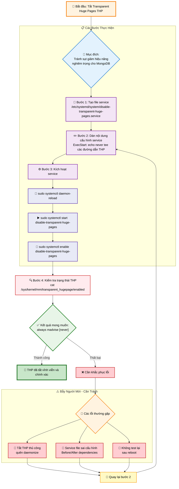

#### **3. Tinh chỉnh Kernel (`sysctl`) và Giới hạn (`ulimit`)**

*   **Mục đích cốt lõi:** Đảm bảo hệ điều hành cung cấp đủ "sức mạnh" và "không gian" cho MongoDB hoạt động mượt mà, đặc biệt khi hệ thống phải xử lý lượng dữ liệu lớn và nhiều kết nối cùng lúc. Các điều chỉnh này giúp MongoDB tránh khỏi các giới hạn ngầm của hệ điều hành, ngăn ngừa các lỗi liên quan đến tài nguyên như "quá nhiều file đang mở" hoặc "hết bộ nhớ ảo".

*   **Kernel Parameters (qua `sysctl`):** Đây là các thiết lập cấp thấp của hệ điều hành, ảnh hưởng đến cách kernel quản lý tài nguyên như bộ nhớ, mạng, và tiến trình. Việc tinh chỉnh các tham số này giúp tối ưu hóa cách MongoDB tương tác với nhân Linux, ví dụ:
    *   **Quản lý bộ nhớ:** Giảm xu hướng hệ điều hành sử dụng swap (vùng nhớ trên đĩa), giữ dữ liệu quan trọng của MongoDB trong RAM. Tăng giới hạn số lượng vùng nhớ ảo mà một tiến trình có thể ánh xạ (quan trọng cho WiredTiger Storage Engine).
    *   **Tối ưu mạng:** Cải thiện khả năng quản lý kết nối mạng, đảm bảo MongoDB có thể mở đủ số lượng cổng và duy trì kết nối hiệu quả.
    *   **Giới hạn tiến trình/file:** Tăng giới hạn tổng số file hệ thống có thể mở, cũng như số lượng PID và luồng có thể chạy, đảm bảo MongoDB có đủ không gian cho các tiến trình và luồng cần thiết.
    *   **Tối ưu NUMA:** Trên các hệ thống có kiến trúc bộ nhớ NUMA, việc điều chỉnh giúp giảm độ trễ khi truy cập bộ nhớ.

*   **Giới hạn Người dùng (qua `ulimit`):** Đây là các giới hạn áp đặt cho từng người dùng hoặc nhóm người dùng về lượng tài nguyên mà họ có thể sử dụng (ví dụ: số file tối đa có thể mở, số tiến trình tối đa có thể chạy). Với `mongod` thường chạy dưới user `mongod`, việc tăng các giới hạn này là rất quan trọng để tránh tình trạng "hết tài nguyên" khi tải cao.

⚠️ **BẪY NGƯỜI MỚI - Giai đoạn 1:**
-   **`ulimit` chỉnh trong shell:** Các lệnh `ulimit` chạy trực tiếp trong terminal chỉ có hiệu lực cho session hiện tại và sẽ mất khi bạn đóng terminal hoặc khởi động lại máy. **Phải cấu hình vĩnh viễn qua `/etc/security/limits.d/`**.
-   **Không áp dụng ngay bằng `sysctl -p`:** Sau khi sửa `sysctl.conf`, các thay đổi sẽ chỉ có hiệu lực sau khi reboot hoặc khi được áp dụng thủ công bằng `sysctl -p`.
-   **Quên thêm NUMA parameter:** Trên các máy chủ có kiến trúc NUMA, việc thiếu cấu hình tối ưu có thể dẫn đến hiệu năng kém do kernel cố gắng ưu tiên bộ nhớ cục bộ quá mức, gây ra độ trễ cao.

*   **Thực hiện đúng:**
    1.  Chỉnh sửa file `/etc/sysctl.conf` để tinh chỉnh kernel vĩnh viễn:
        ```bash
        # Thêm vào cuối file /etc/sysctl.conf
        vm.swappiness = 1
        net.ipv4.ip_local_port_range = 1024 65530
        vm.max_map_count=9999999
        fs.file-max=6815744
        kernel.pid_max=64000
        kernel.threads-max=64000
        net.ipv4.tcp_keepalive_time=120
        # NUMA optimization - giảm reclaim cục bộ
        vm.zone_reclaim_mode = 0
        ```
    2.  Áp dụng ngay: `sudo sysctl -p`
    3.  Tạo file cấu hình `ulimit` vĩnh viễn cho user `mongod` và `root`:
        ```bash
        # Tạo file /etc/security/limits.d/99-mongodb-limits.conf
        mongod   soft   nofile    64000
        mongod   hard   nofile    64000
        mongod   soft   nproc     64000
        mongod   hard   nproc     64000
        root     soft   nofile    64000
        root     hard   nofile    64000
        ```

* **Minh hoạ**:

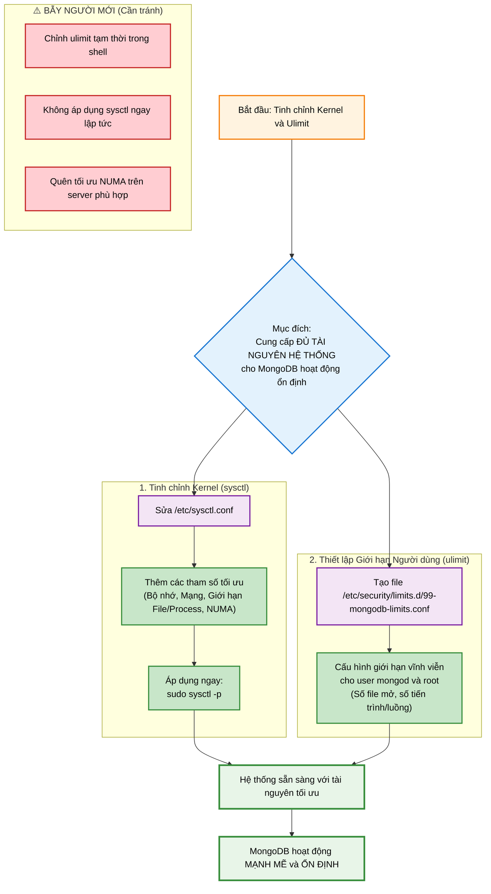

#### **4. Xử Lý SELinux (Nếu bạn dùng CentOS/RHEL)**

*   **Mục đích cốt lõi:** SELinux có thể chặn `mongod` truy cập các thư mục dữ liệu (`/data`) và file (như `mongo-keyfile`) ngay cả khi quyền file tiêu chuẩn (qua `chmod`, `chown`) đã được thiết lập đúng. Việc cấu hình SELinux chính xác là cần thiết để MongoDB hoạt động mà không bị cản trở, đồng thời duy trì mức độ bảo mật cao của hệ thống.

*   **SELinux là gì và cách hoạt động?**
    *   **Security-Enhanced Linux (SELinux)** là một cơ chế bảo mật bổ sung của nhân Linux, thực hiện **Kiểm soát Truy cập Bắt buộc (Mandatory Access Control - MAC)**. Nó khác với **Kiểm soát Truy cập Tự nguyện (Discretionary Access Control - DAC)** mà chúng ta quen thuộc qua các lệnh `chmod`, `chown`.
    *   Với DAC, chủ sở hữu file có thể quyết định ai được phép truy cập file của họ. Với MAC của SELinux, toàn bộ hệ thống (kernel) sẽ kiểm soát quyền truy cập dựa trên một bộ quy tắc được định nghĩa sẵn bởi quản trị viên hệ thống.
    *   **Context (Ngữ cảnh):** Trong SELinux, mọi file, thư mục, cổng mạng và tiến trình đều được gán một "nhãn" hay "ngữ cảnh" bảo mật. Ngữ cảnh này bao gồm nhiều phần, nhưng phần quan trọng nhất đối với chúng ta là "type" (kiểu), ví dụ `mongod_var_lib_t`.
    *   **Quy trình kiểm tra:** Khi một tiến trình (ví dụ: `mongod`) muốn truy cập một tài nguyên (ví dụ: thư mục `/data`), SELinux kernel sẽ kiểm tra:
        1.  Ngữ cảnh của tiến trình `mongod`.
        2.  Ngữ cảnh của thư mục `/data`.
        3.  Chính sách bảo mật của SELinux để xem liệu ngữ cảnh của tiến trình có được phép thực hiện hành động truy cập lên ngữ cảnh của thư mục hay không.
    *   **Vấn đề với MongoDB:** Ngay cả khi bạn đã chạy `sudo chown -R mongod:mongod /data` và `sudo chmod -R 700 /data`, đảm bảo user `mongod` có quyền đầy đủ (DAC), nếu thư mục `/data` không có ngữ cảnh SELinux (`mongod_var_lib_t`) mà chính sách `mongod` mong đợi, SELinux sẽ chặn truy cập, dẫn đến lỗi "Permission denied" (EACCES) khó hiểu.

*   **Tại sao không nên tắt SELinux?**
    *   Tắt SELinux (chuyển sang chế độ `permissive` hoặc `disabled`) sẽ loại bỏ lớp bảo mật quan trọng này. Trong môi trường production, đây là một rủi ro bảo mật lớn, vì nó làm giảm khả năng hệ thống chống lại các cuộc tấn công leo thang đặc quyền hoặc các lỗ hổng phần mềm.
    *   Việc cấu hình đúng SELinux là cách tốt nhất để đảm bảo cả bảo mật và khả năng hoạt động của ứng dụng.

⚠️ **BẪY NGƯỜI MỚI - Giai đoạn 1:**
-   **SELinux context chưa set lại sau khi đổi mount:** Nếu bạn mount một ổ đĩa mới vào `/data` hoặc di chuyển thư mục dữ liệu mà không gán lại ngữ cảnh, lỗi `EACCES` sẽ xảy ra dù `chmod` và `chown` đã đúng.
-   **Chỉ set context một lần, quên `restorecon` khi tạo thư mục/file mới:** Lệnh `semanage fcontext` chỉ định nghĩa một *quy tắc*. `restorecon` mới là lệnh áp dụng quy tắc đó cho các file/thư mục hiện có. Nếu bạn tạo file/thư mục mới sau khi chạy `semanage fcontext` nhưng quên `restorecon`, các file/thư mục mới này sẽ không có ngữ cảnh đúng.
-   **Tắt SELinux thay vì cấu hình đúng:** Giải pháp dễ nhất nhưng nguy hiểm nhất. Phải ưu tiên cấu hình đúng.

💡 **MẸO:** **Mỗi khi tạo thư mục/file quan trọng trong `/data` hoặc đổi mount point**, hãy nhớ chạy lại `sudo restorecon -Rv /data` để đảm bảo ngữ cảnh SELinux được áp dụng chính xác.

*   **Thực hiện đúng:**
    1.  **Cài đặt công cụ cần thiết:** `sudo yum install policycoreutils-python-utils -y`
        *   Gói này cung cấp các tiện ích quản lý SELinux như `semanage` và `restorecon`.
    2.  **Gán "context" cho thư mục `/data`:**
        ```bash
        sudo semanage fcontext -a -t mongod_var_lib_t "/data(/.*)?"
        sudo restorecon -Rv /data
        ```
        *   `semanage fcontext -a -t mongod_var_lib_t "/data(/.*)?"`: Dòng này định nghĩa một quy tắc: tất cả các file và thư mục nằm trong `/data` (bao gồm chính `/data` và các thư mục con) phải có ngữ cảnh kiểu `mongod_var_lib_t`. Quy tắc này được lưu vĩnh viễn.
        *   `restorecon -Rv /data`: Dòng này sẽ quét thư mục `/data` và các thư mục con, sau đó áp dụng ngữ cảnh `mongod_var_lib_t` đã định nghĩa bởi `semanage` cho tất cả chúng.
    3.  **Kiểm tra:** `ls -Z /data/mongo-keyfile` phải thấy context `mongod_var_lib_t`.
        *   Lệnh `ls -Z` hiển thị ngữ cảnh SELinux của file. Việc thấy `mongod_var_lib_t` xác nhận rằng `mongod` giờ đây có thể truy cập file này một cách hợp lệ theo chính sách SELinux.


* **Minh hoạ**

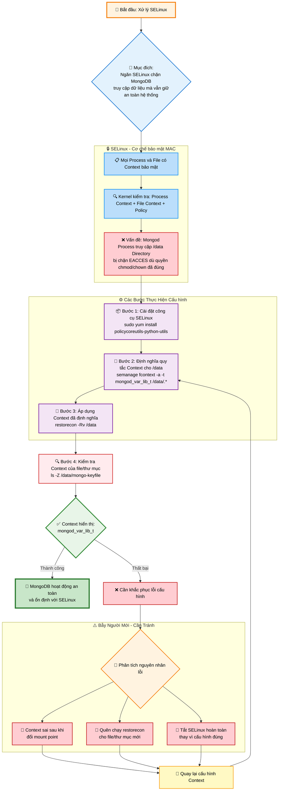


### **Giai đoạn 2: Cài đặt và Chuẩn bị Tài nguyên**

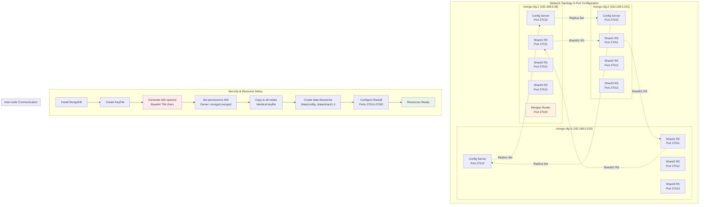

#### **1. Cài đặt MongoDB**

*   **Thực hiện đúng (nếu cài lại từ đầu):**
    ```bash
    sudo yum remove mongodb* -y
    sudo rm -rf /var/log/mongodb /var/lib/mongo /tmp/*.sock
    sudo yum install mongodb-org -y
    rpm -qa | grep mongodb-org # Xác nhận phiên bản 7.0+
    ```

#### **2. Tạo KeyFile (Xác thực nội bộ)**

*   **Mục đích:** Mật khẩu chung để các thành viên trong cluster (mongod, mongos) tin tưởng và giao tiếp với nhau.

⚠️ **BẪY NGƯỜI MỚI - Giai đoạn 2:**
- **Keyfile khác nhau giữa các máy** → nội bộ từ chối bắt tay
- **Quên `chmod 400`** → MongoDB từ chối khởi động vì keyfile không an toàn
- **Tạo thư mục bằng `root` rồi quên `chown mongod:mongod`** → "Permission denied"

💡 **MẸO:** Keyfile phù hợp cho lab. Production nên dùng chứng chỉ x.509.
*   **Thực hiện đúng (Làm trên `mongo-cfg-1`, sau đó copy đi):**
    1.  Tạo thư mục và file key:
        ```bash
        sudo mkdir -p /data
        sudo openssl rand -base64 756 | sudo tee /data/mongo-keyfile >/dev/null
        ```
    2.  **Cực kỳ quan trọng:** Đặt đúng chủ sở hữu và quyền:
        ```bash
        sudo chown mongod:mongod /data/mongo-keyfile
        sudo chmod 400 /data/mongo-keyfile
        ```
    3.  Copy keyfile sang 2 máy còn lại và **set lại quyền trên từng máy đó**:
        ```bash
        scp /data/mongo-keyfile root@mongo-cfg-2:/data/
        scp /data/mongo-keyfile root@mongo-cfg-3:/data/
        # Trên mongo-cfg-2 và mongo-cfg-3, chạy lại chown và chmod
        ```
    4.  **Lưu ý Production:** Keyfile phù hợp cho môi trường lab. Trong môi trường production, hãy sử dụng chứng chỉ x.509 để bảo mật cao hơn.

#### **3. Tạo Thư mục Dữ liệu và Log**

*   **Bẫy người mới:** Tạo thư mục bằng `root` và quên `chown`, dẫn đến lỗi "Permission denied".
*   **Thực hiện đúng (Trên CẢ 3 MÁY):**
    ```bash
    sudo mkdir -p /data/config /data/shard1 /data/shard2 /data/shard3
    sudo touch /data/config.log /data/shard1.log /data/shard2.log /data/shard3.log
    sudo chown -R mongod:mongod /data
    sudo chmod 640 /data/*.log
    ```

#### **4. Mở Firewall**

*   **Bẫy người mới:** Thêm rule `--permanent` nhưng quên `--reload`.
*   **Thực hiện đúng (Trên CẢ 3 MÁY):**
    ```bash
    sudo firewall-cmd --add-port=27010-27020/tcp --permanent
    sudo firewall-cmd --reload
    # Nếu không thấy port, kiểm tra zone: sudo firewall-cmd --get-active-zones
    ```

---

### **Giai đoạn 3: Dựng Cụm Config Server**

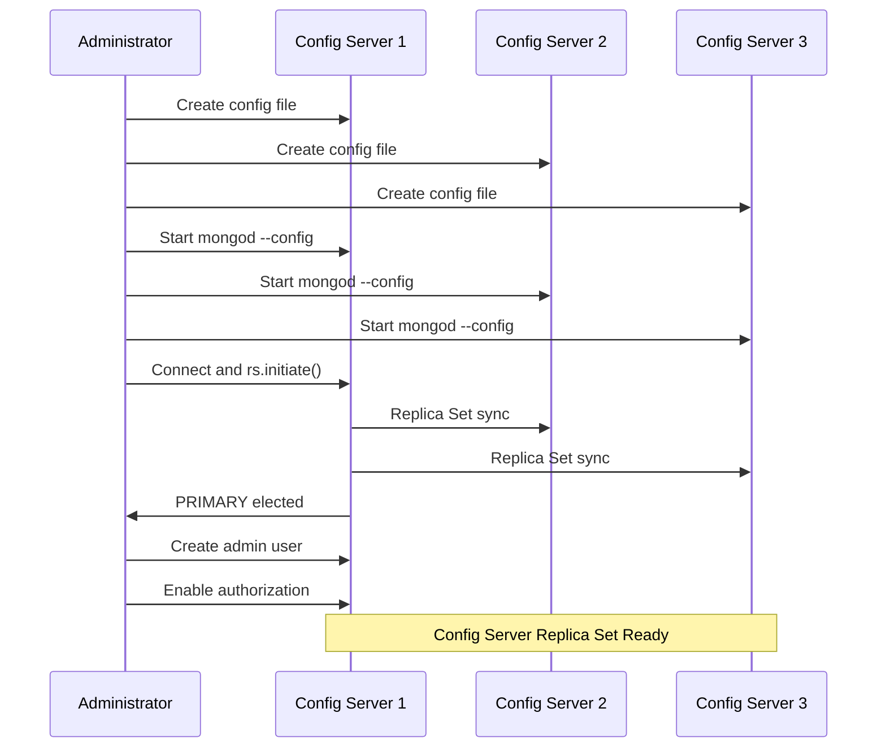

#### **1. Tạo File Cấu hình (Trên CẢ 3 MÁY)**

*   **File `/etc/mongod-config.conf`:**
    ```yaml
    systemLog:
      destination: file
      path: /data/config.log
      logAppend: true
      logRotate: reopen
    storage:
      dbPath: /data/config
    net:
      port: 27010
      bindIp: 0.0.0.0
    security:
      keyFile: /data/mongo-keyfile
      # authorization: enabled  # <-- TẠM THỜI COMMENT ĐỂ BOOTSTRAP
    replication:
       replSetName: "Rep1"
    sharding:
       clusterRole: configsvr
    ```
*   **Bẫy Người Mới:** Vội vàng bật `authorization: enabled`. Điều này sẽ chặn bạn khởi tạo replica set và tạo user admin đầu tiên (vấn đề "con gà quả trứng"). Quy trình đúng là giữ `keyFile` (xác thực nội bộ) nhưng tạm tắt `authorization` (xác thực client).

#### **2. Khởi động Config Server**
*   **Thực hiện đúng (Trên CẢ 3 MÁY):**
    ```bash
    sudo -u mongod /usr/bin/mongod --config /etc/mongod-config.conf --fork
    tail -f /data/config.log # Theo dõi log để tìm "waiting for connections"
    ```
*   **Lưu ý:** `--fork` phù hợp cho lab. Môi trường production nên tạo file unit systemd để quản lý dịch vụ chuyên nghiệp hơn.

#### **3. Khởi tạo Replica Set và Tạo User Admin**

*   **Bẫy người mới:** Tạo user trước khi `initiate`; bối rối vì prompt mặc định là `test>`.
*   **Thực hiện đúng (Chỉ làm trên 1 máy):**
    1.  Kết nối: `mongosh --port 27010`
    2.  Khởi tạo replica set:
        ```javascript
        rs.initiate({
          _id: "Rep1", configsvr: true,
          members: [
            { _id: 0, host: "mongo-cfg-1:27010" },
            { _id: 1, host: "mongo-cfg-2:27010" },
            { _id: 2, host: "mongo-cfg-3:27010" }
          ]
        })
        ```
    3.  **Đợi node lên PRIMARY** (prompt chuyển thành `Rep1 [primary]>`):
        ```javascript
        // Lệnh để chờ tự động
        while (!db.hello().isWritablePrimary) { sleep(1000); print("...waiting for PRIMARY"); }
        ```
    4.  **Khi đã có PRIMARY**, tạo ngay user admin đầu tiên:
        
⚠️ **BẪY BẢO MẬT QUAN TRỌNG:**
- **Dùng mật khẩu text trong script** → rò rỉ qua shell history
- **LUÔN dùng `passwordPrompt()` thay vì hard-code mật khẩu**

        ```javascript
        use admin
        db.createUser({
          user: "mongodba", 
          pwd: passwordPrompt(), // <-- Nhập an toàn thay vì hard-code
          roles: [{role: "root", db: "admin"}]
        })
        ```
    5.  *(Tùy chọn)*: Nếu muốn một node mạnh hơn luôn được ưu tiên làm PRIMARY, bạn có thể chỉnh `priority`. Mặc định không cần thiết.
        ```javascript
        cfg = rs.conf()
        cfg.members[0].priority = 3 // Node mongo-cfg-1 ưu tiên cao nhất
        rs.reconfig(cfg)
        ```
    6.  Thoát khỏi mongosh: `exit`

#### **4. Bật Xác thực và Khởi động lại**

*   **Thực hiện (Trên CẢ 3 MÁY):**
    1.  Sửa file `/etc/mongod-config.conf`, **bỏ comment** dòng `authorization: enabled`.
    2.  Khởi động lại tiến trình một cách an toàn:
        ```bash
        # Gửi tín hiệu SIGTERM (15) để shutdown an toàn, tránh kill -9
        sudo pkill -15 -f "mongod-config.conf"
        sudo -u mongod /usr/bin/mongod --config /etc/mongod-config.conf --fork
        ```
    3.  Kiểm tra đăng nhập bằng tài khoản admin:
        `mongosh --port 27010 -u mongodba --authenticationDatabase admin`
        (Sẽ prompt nhập password an toàn)

---

### **Giai đoạn 4: Dựng các Cụm Shard**

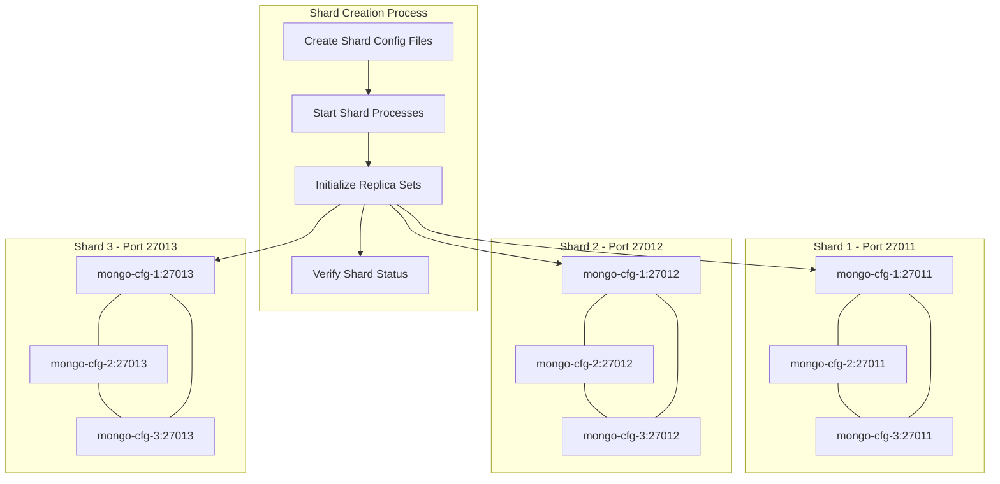

#### **1. Tạo File Cấu hình (Trên CẢ 3 MÁY)**

*   **File `/etc/mongod-shard1.conf` (Tương tự cho shard2, shard3):**
    ```yaml
    systemLog:
      destination: file
      path: /data/shard1.log # Đổi thành shard2.log, shard3.log
      logAppend: true
      logRotate: reopen
    storage:
      dbPath: /data/shard1 # Đổi thành /data/shard2, /data/shard3
    net:
      port: 27011 # Đổi thành 27012, 27013
      bindIp: 0.0.0.0
    security:
      keyFile: /data/mongo-keyfile
      authorization: enabled
    replication:
       replSetName: "shard01" # Đổi thành "shard02", "shard03"
    sharding:
       clusterRole: shardsvr
    ```
*   **Giải thích quan trọng:** Đối với shard, bạn có thể bật `authorization: enabled` ngay từ đầu vì chúng ta **KHÔNG CẦN TẠO USER LOCAL TRÊN SHARD**. Việc xác thực giữa các node đã có `keyFile` lo, còn xác thực client sẽ do `mongos` và `config server` xử lý.

#### **2. Khởi động và Khởi tạo Replica Set cho từng Shard**

*   **Thực hiện (Trên CẢ 3 MÁY):**
    ```bash
    sudo -u mongod /usr/bin/mongod --config /etc/mongod-shard1.conf --fork
    sudo -u mongod /usr/bin/mongod --config /etc/mongod-shard2.conf --fork
    sudo -u mongod /usr/bin/mongod --config /etc/mongod-shard3.conf --fork
    # Kiểm tra: ps -ef | grep mongo phải thấy 4 tiến trình trên mỗi node
    ```
⚠️ **BẪY NGƯỜI MỚI - Giai đoạn 4:**
- **Bật `authorization` trước `rs.initiate()` và kết nối *không phải* từ localhost** → `rs.initiate()` bị chặn
- **Nhầm tham số `mongosh -c`** → lệnh không chạy (đúng là `--eval`)
- **Không đặt `priority` hợp lý** → PRIMARY rơi vào máy yếu/xa

*   **Thực hiện (Chỉ trên 1 máy):** Khởi tạo RS cho từng shard.

💡 **CÁCH AN TOÀN:** Nếu đã bật `authorization` ngay từ đầu trên shard, **bắt buộc chạy từ localhost**: `mongosh --host 127.0.0.1 --port 27011 --eval 'rs.initiate(...)'` (tận dụng "localhost exception").

    ```bash
    # Shard01 - SỬA LỖI: dùng --eval thay vì -c
    mongosh --host mongo-cfg-1 --port 27011 --eval \
    'rs.initiate({_id:"shard01",members:[{_id:0,host:"mongo-cfg-1:27011"},{_id:1,host:"mongo-cfg-2:27011"},{_id:2,host:"mongo-cfg-3:27011"}]})'
    
    # Shard02
    mongosh --host mongo-cfg-1 --port 27012 --eval \
    'rs.initiate({_id:"shard02",members:[{_id:0,host:"mongo-cfg-1:27012"},{_id:1,host:"mongo-cfg-2:27012"},{_id:2,host:"mongo-cfg-3:27012"}]})'
    
    # Shard03
    mongosh --host mongo-cfg-1 --port 27013 --eval \
    'rs.initiate({_id:"shard03",members:[{_id:0,host:"mongo-cfg-1:27013"},{_id:1,host:"mongo-cfg-2:27013"},{_id:2,host:"mongo-cfg-3:27013"}]})'
    ```

---

### **Giai đoạn 5: Dựng Mongos và Hoàn thiện Cluster**

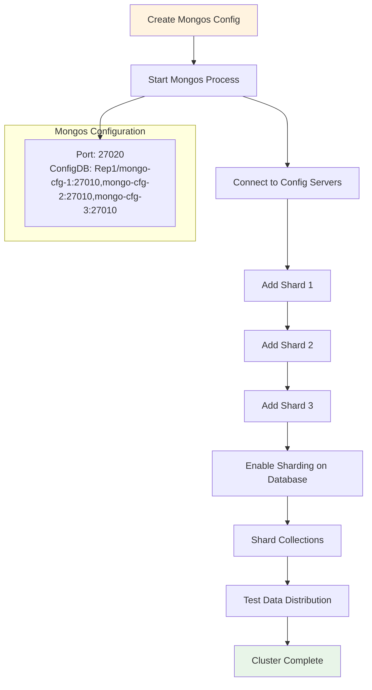

#### **1. Tạo File Cấu hình Mongos (Trên 1 máy)**

*   **File `/etc/mongos.conf`:**
    ```yaml
    systemLog:
      destination: file
      path: /data/mongos.log
      logAppend: true
    net:
      port: 27020
      bindIp: 0.0.0.0
    security:
      keyFile: /data/mongo-keyfile
    sharding:
      configDB: Rep1/mongo-cfg-1:27010,mongo-cfg-2:27010,mongo-cfg-3:27010
    processManagement:
      pidFilePath: /data/mongos.pid
    ```

#### **2. Khởi động Mongos**

```bash
sudo -u mongod /usr/bin/mongos --config /etc/mongos.conf --fork
tail -f /data/mongos.log # Theo dõi log đến khi thấy "connected to config replica set"
```

#### **3. Thêm các Shard vào Cluster**

⚠️ **BẪY NGƯỜI MỚI - Giai đoạn 5:**
- **`configDB` sai `replSetName`** hoặc **nhầm thứ tự host** → mongos không kết nối nổi
- **Chỉ chạy một `mongos`** trong production → SPOF về truy vấn (nên có nhiều `mongos`)
- **Dùng mật khẩu hard-code trong lệnh** → rò rỉ credential

*   **Thực hiện (Kết nối vào Mongos):**
    ```bash
    mongosh --port 27020 -u mongodba --authenticationDatabase admin
    # Sẽ prompt nhập password an toàn
    ```
    Bên trong mongosh:
    ```javascript
    // Dùng định dạng replica set / seed list, hiệu quả hơn
    sh.addShard("shard01/mongo-cfg-1:27011,mongo-cfg-2:27011,mongo-cfg-3:27011")
    sh.addShard("shard02/mongo-cfg-1:27012,mongo-cfg-2:27012,mongo-cfg-3:27012")
    sh.addShard("shard03/mongo-cfg-1:27013,mongo-cfg-2:27013,mongo-cfg-3:27013")
    ```

#### **4. Kích hoạt Sharding và Test**

1.  **Kiểm tra trạng thái:** `sh.status()` sẽ hiển thị các shard đã được thêm.
2.  **Bật sharding cho database:** `sh.enableSharding("testDB")`
3.  **Shard collection với `hashed` key để phân phối đều:**
    ```javascript
    use testDB
    sh.shardCollection("testDB.myCollection", { "_id": "hashed" } )
    ```
4.  **Insert dữ liệu để kiểm tra:**
    ```javascript
    for (var i = 1; i <= 100000; i++) {
      db.myCollection.insertOne({ name: "test_data_" + i });
    }
    db.myCollection.getShardDistribution() // Xem dữ liệu đã được phân phối đều chưa
    ```

---

### **Giai đoạn 6: Debug, Kiểm tra và Lưu ý Production**

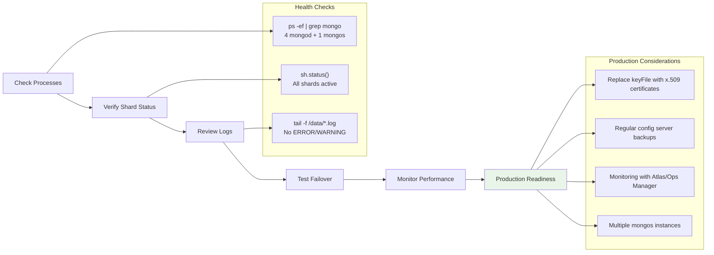

*   **Kiểm tra tổng thể:**
    *   `ps -ef | grep mongo`: Phải có 4 tiến trình `mongod` và 1 tiến trình `mongos` (trên node chạy mongos).
    *   `sh.status()`: Các shard phải ở trạng thái `active`.
*   **Xem Logs:** `tail -n 100 /data/*.log` để tìm lỗi `ERROR` hoặc `WARNING`.
*   **Test Failover:** Thử kill tiến trình PRIMARY của một shard (`sudo pkill -15 -f shard01.conf`) và dùng `rs.status()` trên port của shard đó để xem một node SECONDARY có được bầu lên làm PRIMARY hay không.
*   **Lưu ý Production:**
    *   **Bảo mật:** Thay thế `keyFile` bằng chứng chỉ **x.509** để mã hóa và xác thực mạnh hơn.
    *   **Backup:** Thường xuyên sao lưu `config server` vì nó chứa toàn bộ metadata của cluster.
    *   **Giám sát:** Sử dụng các công cụ như MongoDB Atlas, Ops Manager, hoặc Prometheus để theo dõi sức khỏe hệ thống.
    *   **Mở rộng:** Có thể thêm các instance `mongos` trên các máy khác để cân bằng tải truy vấn.
    *   **systemd Unit:** Khuyến nghị tạo unit file cho `mongod`/`mongos` thay vì dùng `--fork` trong production.

💡 **Mẫu systemd Unit cho Production:**
```ini
# /etc/systemd/system/mongod-shard01.service
[Unit]
Description=MongoDB Shard01
After=network.target disable-transparent-huge-pages.service

[Service]
User=mongod
Group=mongod
ExecStart=/usr/bin/mongod --config /etc/mongod-shard1.conf
ExecReload=/bin/kill -HUP $MAINPID
Restart=on-failure
LimitNOFILE=64000
LimitNPROC=64000

[Install]
WantedBy=multi-user.target
```
Kích hoạt: `systemctl daemon-reload && systemctl enable --now mongod-shard01`

---

### **Giai đoạn 7: Thao tác và Truy vấn Dữ liệu (Aggregation Framework)**

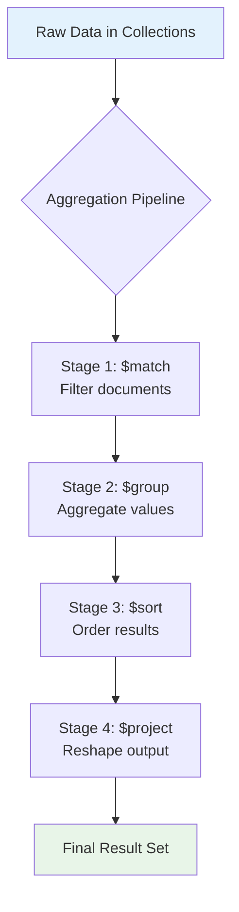

Sau khi đã có một cluster hoàn chỉnh, bước tiếp theo là khai thác sức mạnh của dữ liệu. Aggregation Framework là một công cụ cực kỳ mạnh mẽ để thực hiện các phép biến đổi và tính toán phức tạp ngay trên server.

*   **Mục đích:** Thay vì kéo hàng tấn dữ liệu thô về ứng dụng rồi mới xử lý, chúng ta sẽ đẩy logic tính toán về phía MongoDB, giúp giảm tải băng thông mạng và tận dụng tài nguyên của database.
*   **Bẫy người mới:** Thực hiện các logic nối (join), lọc, nhóm (group by) phức tạp ở tầng ứng dụng (application layer). Điều này cực kỳ thiếu hiệu quả, làm chậm ứng dụng và không tận dụng được sức mạnh của MongoDB.
*   **Thực hiện đúng:** Xây dựng một "đường ống" (pipeline) gồm nhiều "giai đoạn" (stages), mỗi giai đoạn sẽ xử lý đầu vào từ giai đoạn trước và đưa kết quả cho giai đoạn tiếp theo.

#### **1. Bài toán 1: Lọc, Sắp xếp và Định hình Dữ liệu**

*   **Chuẩn bị dữ liệu:**
    ```javascript
    use testDB // Sử dụng lại database từ Giai đoạn 4
    db.persons.insertMany([
      { "person_id": "6392529400", "firstname": "Elise", "lastname": "Smith", "dateofbirth": ISODate("1972-01-13T09:32:07Z"), "vocation": "ENGINEER", "address": { "number": 5625, "street": "Tipa Circle", "city": "Wojzinmoj" } },
      { "person_id": "1723338115", "firstname": "Olive", "lastname": "Ranieri", "dateofbirth": ISODate("1985-05-12T23:14:30Z"), "gender": "FEMALE", "vocation": "ENGINEER", "address": { "number": 9303, "street": "Mele Circle", "city": "Tobihbo" } },
      { "person_id": "8732762874", "firstname": "Toni", "lastname": "Jones", "dateofbirth": ISODate("1991-11-23T16:53:56Z"), "vocation": "POLITICIAN", "address": { "number": 1, "street": "High Street", "city": "Upper Abbeywoodington" } },
      { "person_id": "7363629563", "firstname": "Bert", "lastname": "Gooding", "dateofbirth": ISODate("1941-04-07T22:11:52Z"), "vocation": "FLORIST", "address": { "number": 13, "street": "Upper Bold Road", "city": "Redringtonville" } },
      { "person_id": "1029648329", "firstname": "Sophie", "lastname": "Celements", "dateofbirth": ISODate("1959-07-06T17:35:45Z"), "vocation": "ENGINEER", "address": { "number": 5, "street": "Innings Close", "city": "Basilbridge" } },
      { "person_id": "7363626383", "firstname": "Carl", "lastname": "Simmons", "dateofbirth": ISODate("1998-12-26T13:13:55Z"), "vocation": "ENGINEER", "address": { "number": 187, "street": "Hillside Road", "city": "Kenningford" } }
    ]);
    ```
*   **Yêu cầu:** Trả về 3 người kỹ sư (ENGINEER) trẻ nhất, chỉ hiển thị `firstname`, `lastname`, `dateofbirth`.
*   **Lời giải:**
    ```javascript
    db.persons.aggregate([
      // Giai đoạn 1: Lọc ra những người là ENGINEER
      { $match: { vocation: "ENGINEER" } },
      // Giai đoạn 2: Sắp xếp theo ngày sinh giảm dần (ngày sinh lớn hơn là người trẻ hơn)
      { $sort: { dateofbirth: -1 } },
      // Giai đoạn 3: Giới hạn kết quả chỉ lấy 3 người đầu tiên
      { $limit: 3 },
      // Giai đoạn 4: Định hình lại output, ẩn _id và các trường không cần thiết
      { $project: {
          _id: 0,
          firstname: 1,
          lastname: 1,
          dateofbirth: 1
      }}
    ])
    ```

#### **2. Bài toán 2: Thống kê và Nhóm Dữ liệu**

*   **Chuẩn bị dữ liệu:**
    ```javascript
    db.orders.insertMany([
      { "customer_id": "elise_smith@myemail.com", "orderdate": ISODate("2020-05-30T08:35:52Z"), "value": NumberDecimal("231.43")},
      { "customer_id": "elise_smith@myemail.com", "orderdate": ISODate("2020-01-13T09:32:07Z"), "value": NumberDecimal("99.99")},
      { "customer_id": "oranieri@warmmail.com", "orderdate": ISODate("2020-01-01T08:25:37Z"), "value": NumberDecimal("63.13")},
      { "customer_id": "tj@wheresmyemail.com", "orderdate": ISODate("2019-05-28T19:13:32Z"), "value": NumberDecimal("2.01")},
      { "customer_id": "tj@wheresmyemail.com", "orderdate": ISODate("2020-11-23T22:56:53Z"), "value": NumberDecimal("187.99")},
      { "customer_id": "elise_smith@myemail.com", "orderdate": ISODate("2020-12-26T08:55:46Z"), "value": NumberDecimal("48.50")}
    ]);
    ```
*   **Yêu cầu:** Thống kê dữ liệu khách hàng trong năm 2020, thể hiện: ngày mua hàng đầu tiên, tổng giá trị đơn hàng, và số lần mua.
*   **Lời giải:**
    ```javascript
    db.orders.aggregate([
      // Giai đoạn 1: Lọc các đơn hàng trong năm 2020
      { $match: {
          orderdate: {
            $gte: ISODate("2020-01-01T00:00:00Z"),
            $lt: ISODate("2021-01-01T00:00:00Z")
          }
      }},
      // Giai đoạn 2: Nhóm theo customer_id và tính toán
      { $group: {
          _id: "$customer_id",
          first_purchase_date: { $min: "$orderdate" }, // Lấy ngày mua nhỏ nhất
          total_value: { $sum: "$value" },            // Tính tổng giá trị
          purchase_count: { $sum: 1 }                 // Đếm số lượng document trong nhóm
      }}
    ])
    ```

#### **3. Bài toán 3: Join Dữ liệu giữa các Collection**

*   **Chuẩn bị dữ liệu:**
    ```javascript
    db.products.insertMany([
      { "id": "a1b2c3d4", "name": "Asus Laptop", "category": "ELECTRONICS" },
      { "id": "z9y8x7w6", "name": "The Day Of The Triffids", "category": "BOOKS" },
      { "id": "ff11gg22hh33", "name": "Morphy Richards Food Mixer", "category": "KITCHENWARE" }
    ]);
    // Giả sử collection 'orders' đã có từ bài 2
    ```
*   **Yêu cầu:** Lấy dữ liệu đơn hàng trong năm 2020, nhưng thay vì hiển thị `product_id`, hãy tra cứu và hiển thị `product_name` và `product_category`.
*   **Lời giải:**
    ```javascript
    db.orders.aggregate([
      // Giai đoạn 1: Lọc đơn hàng trong năm 2020
      { $match: {
          orderdate: { $gte: ISODate("2020-01-01T00:00:00Z"), $lt: ISODate("2021-01-01T00:00:00Z") }
      }},
      // Giai đoạn 2: Join với collection 'products'
      { $lookup: {
          from: "products",           // Collection để join
          localField: "product_id",   // Trường trong collection 'orders'
          foreignField: "id",       // Trường trong collection 'products'
          as: "product_details"     // Tên mảng chứa kết quả join
      }},
      // Giai đoạn 3: "Làm phẳng" mảng product_details và định hình lại output
      { $project: {
          _id: 0,
          customer_id: 1,
          orderdate: 1,
          value: 1,
          product_name: { $arrayElemAt: ["$product_details.name", 0] },
          product_category: { $arrayElemAt: ["$product_details.category", 0] }
      }}
    ])
    ```

---

### **Giai đoạn 8: Quản trị Bảo mật và Người dùng**

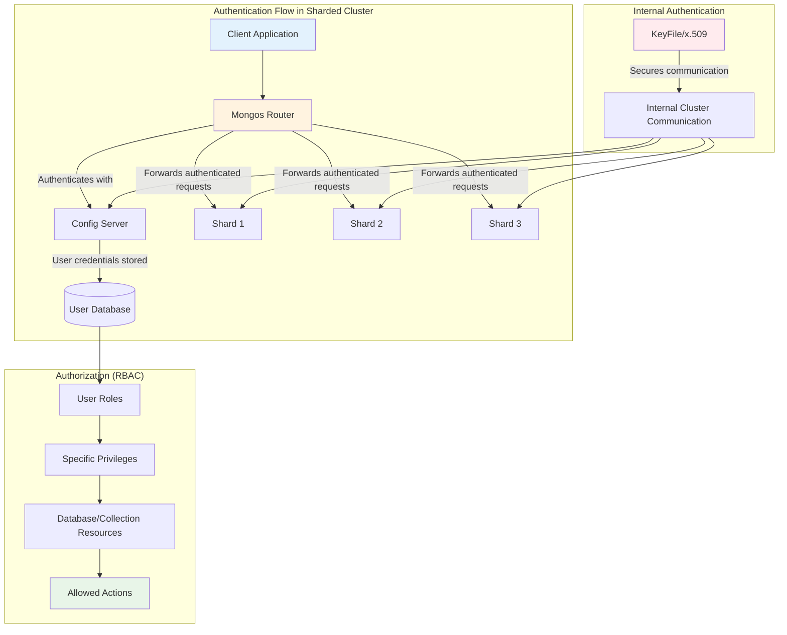

Một cluster không được bảo mật là một thảm họa. MongoDB cung cấp hệ thống Role-Based Access Control (RBAC) mạnh mẽ để đảm bảo "đúng người, đúng việc".

*   **Mục đích:** Kiểm soát chặt chẽ ai được phép làm gì trên những dữ liệu nào. Xác thực (bạn là ai?) và Ủy quyền (bạn được làm gì?).

⚠️ **BẪY NGƯỜI MỚI - Giai đoạn 8:**
- **Chạy cluster mà không bật `authorization`** → ai cũng có thể truy cập
- **Dùng user `root` cho ứng dụng** → rủi ro lớn khi bị hack
- **Bật `auditLog` trên Community** → mongod không khởi động (chỉ Enterprise/Atlas)
- **Không áp dụng Least Privilege** → user có quyền quá rộng không cần thiết

💡 **NGUYÊN TẮC:** Mỗi user/ứng dụng chỉ nên có những quyền hạn thực sự cần thiết.

#### **1. Tạo User và Gán Role có sẵn**

1.  **Kết nối với quyền admin:** (Như đã làm ở Giai đoạn 3)
    `mongosh --port 27020 -u mongodba -p 'Vnpt512478##' --authenticationDatabase admin`
2.  **Tạo user cho ứng dụng:**
    ```javascript
    use reporting // Chuyển sang DB mà user sẽ thao tác
    db.createUser({
      user: "reportUser",
      pwd: passwordPrompt(), // Sẽ hỏi để nhập mật khẩu an toàn
      roles: [
        { role: "read", db: "reporting" } // Chỉ cho phép đọc trên DB 'reporting'
      ]
    })
    
    use testDB
    db.createUser({
      user: "appUser",
      pwd: passwordPrompt(),
      roles: [
        { role: "readWrite", db: "testDB" } // Cho phép đọc và ghi trên DB 'testDB'
      ]
    })
    ```

#### **2. Tạo Role Tùy chỉnh (Custom Role)**

Đôi khi các role có sẵn (`read`, `readWrite`, `dbAdmin`...) quá rộng. Ta có thể tự tạo role chi tiết hơn.

*   **Yêu cầu:** Tạo một role `inventoryManager` chỉ được phép `find`, `update`, `insert` trên collection `inventory` và chỉ `find` trên collection `orders` trong database `products`.
*   **Thực hiện:**
    ```javascript
    use products
    db.createRole({
      role: "inventoryManager",
      privileges: [
        {
          resource: { db: "products", collection: "inventory" },
          actions: [ "find", "update", "insert" ]
        },
        {
          resource: { db: "products", collection: "orders" },
          actions: [ "find" ]
        }
      ],
      roles: [] // Có thể kế thừa từ các role khác nếu muốn
    })
    
    // Sau khi tạo role, gán nó cho user
    db.createUser({
      user: "manager01",
      pwd: passwordPrompt(),
      roles: [ { role: "inventoryManager", db: "products" } ]
    })
    ```

#### **3. Cấu hình Audit Log (Ghi lại hoạt động)**

*   **Mục đích:** Ghi lại các sự kiện quan trọng (đăng nhập, thay đổi schema, tạo user...) ra một file log riêng để phục vụ cho việc điều tra an ninh.
*   **Thực hiện đúng:**
    1.  Tạo thư mục cho audit log trên **CẢ 3 MÁY**:
        ```bash
        sudo mkdir /data/audit
        sudo chown mongod:mongod /data/audit
        ```
    2.  Thêm cấu hình `auditLog` vào **tất cả các file config** (`mongod-config.conf`, `mongod-shard1.conf`...):
        ```yaml
        security:
          authorization: enabled
          keyFile: /data/mongo-keyfile
        
        # --- Thêm đoạn này vào ---
        auditLog:
          destination: file
          format: JSON
          path: /data/audit/audit.log
        ```
    3.  Khởi động lại tất cả các tiến trình `mongod`. Giờ đây, mọi hành động quan trọng sẽ được ghi lại trong file `/data/audit/audit.log`.

---

### **Giai đoạn 9: Quản trị Nâng cao và Vận hành Replica Set**

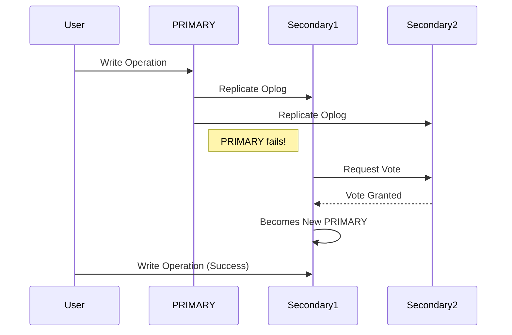

Dựng replica set chỉ là bước đầu. Vận hành nó trong thực tế đòi hỏi sự hiểu biết về cơ chế bầu cử, failover và các cấu hình đặc biệt.

#### **1. Điều chỉnh Primary (Election)**

*   **Mục đích:** Đảm bảo node máy chủ mạnh nhất, có độ trễ mạng thấp nhất sẽ được ưu tiên làm `PRIMARY` để tối ưu hiệu năng ghi.
*   **Bẫy người mới:** Để tất cả các node có priority bằng nhau, dẫn đến việc một node yếu có thể được bầu làm `PRIMARY`, ảnh hưởng đến toàn bộ replica set.
*   **Thực hiện đúng:** Kết nối vào replica set (ví dụ shard01) và điều chỉnh `priority`.
    ```bash
    # Kết nối vào một member bất kỳ của shard01
    mongosh --port 27011
    
    # Lấy cấu hình hiện tại
    cfg = rs.conf()
    
    # Giả sử mongo-cfg-1 là máy mạnh nhất
    cfg.members[0].priority = 3 // host: "mongo-cfg-1:27011"
    cfg.members[1].priority = 2 // host: "mongo-cfg-2:27011"
    cfg.members[2].priority = 1 // host: "mongo-cfg-3:27011"
    
    # Áp dụng lại cấu hình
    rs.reconfig(cfg)
    ```    Node có `priority` cao nhất sẽ được ưu tiên trong các cuộc bầu cử. Node có `priority: 0` sẽ không bao giờ trở thành `PRIMARY`.

#### **2. Cấu hình Hidden Node**

*   **Mục đích:** Tạo một member ẩn, không được ứng dụng nhìn thấy và không thể trở thành `PRIMARY`. Nó chuyên dùng cho các tác vụ như backup, phân tích dữ liệu mà không ảnh hưởng đến tải của các node chính.
*   **Thực hiện đúng:**
    ```javascript
    cfg = rs.conf()
    // Giả sử muốn ẩn node mongo-cfg-3
    cfg.members[2].priority = 0
    cfg.members[2].hidden = true
    rs.reconfig(cfg)
    ```

#### **3. Điều chỉnh Kích thước Oplog**

*   **Mục đích:** Oplog (operations log) là một collection đặc biệt lưu lại tất cả các thao tác ghi. Kích thước oplog quyết định "cửa sổ thời gian" mà một node `SECONDARY` có thể offline mà không cần phải resync toàn bộ dữ liệu.
*   **Bẫy người mới:** Để kích thước oplog mặc định. Với hệ thống ghi nhiều, oplog sẽ bị ghi đè rất nhanh, khiến node `SECONDARY` bị lỗi và phải resync, gây tốn tài nguyên.
*   **Thực hiện đúng:** (Làm trên `PRIMARY` của replica set)
    ```javascript
    // Kiểm tra kích thước hiện tại (bytes)
    use local
    db.oplog.rs.stats().maxSize
    
    // Thay đổi kích thước oplog thành 20GB (20000 MB)
    db.adminCommand({ replSetResizeOplog: 1, size: 20000 })
    ```

---

### **Giai đoạn 10: Sao lưu, Phục hồi và Giám sát**

```mermaid
flowchart LR
    subgraph "Backup Strategy"
        A[Production Database] --> B[Full Backup<br/>Daily/Weekly]
        A --> C[Incremental Oplog<br/>Every 15 mins]
        A --> D[Snapshot Backup<br/>Storage Level]
    end
    
    subgraph "Recovery Scenarios"
        E[Complete Disaster] --> F[Full Restore<br/>+ Latest Oplog]
        G[Data Corruption] --> H[Point-in-Time Recovery<br/>PITR]
        I[Accidental Deletion] --> J[Selective Restore<br/>+ Oplog Replay]
    end
    
    subgraph "Monitoring Tools"
        K[mongostat] --> L["Real-time Operations<br/>Insert/Query/Update/Delete"]
        M[mongotop] --> N["Collection-level<br/>Read/Write Times"]
        O[Database Profiler] --> P["Slow Query Analysis<br/>Performance Tuning"]
        Q[currentOp()] --> R["Active Operations<br/>Long-running Queries"]
    end
    
    subgraph "Health Checks"
        S[Process Status] --> T["4 mongod + 1 mongos<br/>per node"]
        U[Replica Set Status] --> V["PRIMARY/SECONDARY<br/>Election Health"]
        W[Shard Status] --> X["Active Shards<br/>Balanced Distribution"]
        Y[Log Analysis] --> Z["ERROR/WARNING<br/>Pattern Detection"]
    end
    
    B --> F
    C --> H
    C --> J
    D --> F
    
    style A fill:#e3f2fd
    style F fill:#e8f5e8
    style H fill:#fff3e0
    style R fill:#ffebee
```

Dữ liệu là tài sản quý giá nhất. Một chiến lược sao lưu và giám sát hiệu quả là bắt buộc.

#### **1. Sao lưu và Phục hồi (`mongodump` / `mongorestore`)**

*   **Mục đích:** Tạo bản sao lưu logic của database để phòng trường hợp xảy ra sự cố.
*   **Thực hiện đúng:**
    *   **Backup toàn bộ database `testDB` (chạy từ một máy client có cài mongo tools):**
        ```bash
        mongodump --host=mongo-cfg-1 --port=27020 \
                  -u mongodba --authenticationDatabase admin \
                  --db=testDB --out=/backup/testDB_`date +%F`
        # Sẽ prompt nhập password an toàn
        ```
    *   **Restore database `testDB`:**
        ```bash
        mongorestore --host=mongo-cfg-1 --port=27020 \
                     -u mongodba --authenticationDatabase admin \
                     --db=testDB /backup/testDB_YYYY-MM-DD
        # Sẽ prompt nhập password an toàn
        ```

#### **2. Phục hồi tại một thời điểm (Point-in-Time Recovery)**

*   **Mục đích:** Cứu dữ liệu khi có người lỡ tay `DELETE` hoặc `UPDATE` sai. Kỹ thuật này cho phép khôi phục lại trạng thái của database *ngay trước* khi sự cố xảy ra.
*   **Bẫy người mới:** Chỉ có backup hàng đêm. Nếu sai sót xảy ra lúc 9 giờ sáng, bạn sẽ mất toàn bộ dữ liệu từ đêm hôm trước.
*   **Thực hiện đúng (Quy trình):**
    1.  **Luôn có một bản backup Oplog gần nhất:**
        ```bash
        # Lệnh này nên được chạy định kỳ (ví dụ mỗi giờ)
        mongodump --host=mongo-cfg-1 --port=27011 \
                  -d local -c oplog.rs --out /backup/oplogs
        ```    2.  **Khi có sự cố (ví dụ: xóa nhầm lúc 10:30:00 AM):**
        *   Tìm `timestamp` của thời điểm ngay trước khi xóa trong bản backup oplog.
    3.  **Restore:**
        *   Khôi phục từ bản backup đầy đủ gần nhất.
        *   Dùng `mongorestore` với cờ `--oplogReplay` và `--oplogLimit` để áp dụng lại các thay đổi từ oplog cho đến thời điểm mong muốn.
        ```bash
        # Ví dụ restore tới timestamp 1729073314:3
        mongorestore --port 27017 --oplogReplay \
                     --oplogLimit=1729073314:3 \
                     /backup/mongo/local/oplog.rs.bson
        ```

#### **3. Giám sát Hiệu năng**

*   **Mục đích:** Theo dõi sức khỏe hệ thống, phát hiện các "điểm nóng" và truy vấn chậm.
*   **Công cụ dòng lệnh:**
    *   `mongostat`: Cung cấp cái nhìn tổng quan theo thời gian thực về các hoạt động (inserts, queries, updates, deletes...), lỗi, và hàng đợi.
        ```bash
        mongostat --host mongo-cfg-1 --port 27020 -u mongodba --authenticationDatabase admin
        # Sẽ prompt nhập password an toàn
        ```
    *   `mongotop`: Hiển thị thời gian đọc/ghi trên từng collection, giúp bạn biết collection nào đang hoạt động nhiều nhất.
        ```bash
        mongotop --host mongo-cfg-1 --port 27020 -u mongodba --authenticationDatabase admin
        # Sẽ prompt nhập password an toàn
        ```
*   **Database Profiler (Tìm truy vấn chậm):**
    1.  **Bật profiler:** Ghi lại các truy vấn chạy chậm hơn 100ms.
        ```javascript
        use testDB
        db.setProfilingLevel(1, { slowms: 100 })
        ```
    2.  **Xem các truy vấn chậm:**
        ```javascript
        db.system.profile.find().pretty()
        ```
    3.  **Tắt profiler:** `db.setProfilingLevel(0)`

---

### **Giai đoạn 11: Tối ưu Hiệu năng Truy vấn với Index**

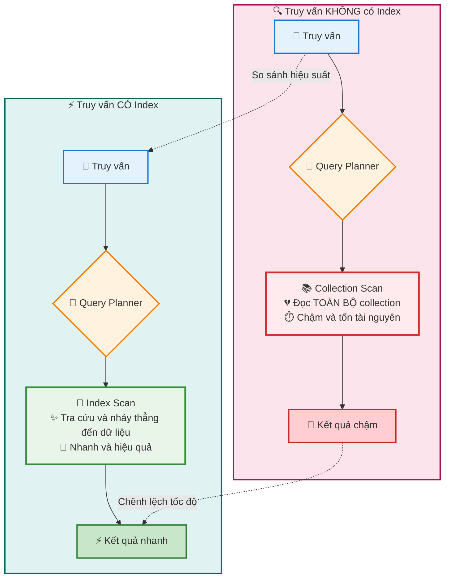

Nếu Sharding là giải pháp cho bài toán *dung lượng* (scale-out), thì Index (chỉ mục) là giải pháp cho bài toán *tốc độ* truy vấn. Một truy vấn không có index sẽ phải quét toàn bộ collection (Full Collection Scan), cực kỳ chậm và tốn tài nguyên.

*   **Mục đích:** Tạo ra các cấu trúc dữ liệu đặc biệt (thường là B-Tree) giúp MongoDB nhanh chóng định vị các document cần thiết mà không cần phải đọc qua từng document một. Tương tự như mục lục của một cuốn sách.
*   **Bẫy người mới:**
    *   Bỏ qua việc tạo index, dẫn đến hiệu năng thảm họa khi dữ liệu lớn dần.
    *   Tạo index một cách bừa bãi trên mọi trường. Mỗi index đều tốn RAM và làm chậm các thao tác ghi (insert, update, delete).
*   **Thực hiện đúng:** Phân tích các truy vấn thường xuyên của ứng dụng và chỉ tạo index để phục vụ cho các truy vấn đó.

#### **1. Các loại Index cơ bản và cách tạo**

*   **Kết nối vào Mongos để thực hiện:**
    ```bash
    mongosh --port 27020 -u mongodba --authenticationDatabase admin
    # Sẽ prompt nhập password an toàn
    use testDB
    ```

*   **Single Field Index (Chỉ mục trên một trường):**
    ```javascript
    // Tạo index trên trường 'vocation' của collection 'persons'
    // 1: sắp xếp tăng dần, -1: sắp xếp giảm dần
    db.persons.createIndex({ "vocation": 1 })
    ```
    *Phục vụ cho các truy vấn như:* `db.persons.find({ vocation: "ENGINEER" })`

*   **Compound Index (Chỉ mục phức hợp trên nhiều trường):**
    ```javascript
    // Tạo index trên 'vocation' và 'lastname'
    db.persons.createIndex({ "vocation": 1, "lastname": 1 })
    ```
    *Quan trọng:* Thứ tự các trường trong index rất quan trọng. Index này sẽ phục vụ tốt cho:
    1.  `db.persons.find({ vocation: "ENGINEER" })`
    2.  `db.persons.find({ vocation: "ENGINEER", lastname: "Smith" })`
    *Nhưng sẽ **không** phục vụ tốt cho:* `db.persons.find({ lastname: "Smith" })`

*   **Text Index (Chỉ mục văn bản):** Dùng cho tìm kiếm toàn văn bản (full-text search).
    ```javascript
    // Chuẩn bị dữ liệu
    db.articles.insertOne({ title: "MongoDB Performance Tuning", content: "Indexing is a key concept for tuning databases." })
    db.articles.insertOne({ title: "Sharding Guide", content: "A guide to horizontal scaling with MongoDB." })
    
    // Tạo text index trên trường 'content'
    db.articles.createIndex({ "content": "text" })
    
    // Tìm kiếm
    db.articles.find({ $text: { $search: "tuning scaling" } }) // Sẽ tìm các document chứa 'tuning' hoặc 'scaling'
    ```

#### **2. Phân tích Kế hoạch Thực thi (Execution Plan)**

Làm sao để biết một truy vấn có đang sử dụng index hay không? Hãy dùng lệnh `explain()`.

*   **Thực hiện:**
    ```javascript
    db.persons.find({ vocation: "ENGINEER", lastname: "Smith" }).explain("executionStats")
    ```*   **Phân tích kết quả:**
    Bạn cần tìm đến mục `executionStats.winningPlan`.
    *   **TỐT (`IXSCAN`):** Nếu `stage` là `IXSCAN` (Index Scan), nghĩa là truy vấn của bạn đã sử dụng index.
        ```json
        "winningPlan": {
          "stage": "FETCH",
          "inputStage": {
            "stage": "IXSCAN", // <-- Tuyệt vời!
            "indexName": "vocation_1_lastname_1",
            // ...
          }
        }
        ```
    *   **TỆ (`COLLSCAN`):** Nếu `stage` là `COLLSCAN` (Collection Scan), nghĩa là MongoDB đã phải đọc toàn bộ collection. Bạn cần phải xem lại và tạo index phù hợp.
        ```json
        "winningPlan": {
          "stage": "COLLSCAN", // <-- Cảnh báo hiệu năng!
          "filter": {
             // ...
          }
        }
        ```

---

### **Giai đoạn 12: Chiến lược Sharding và Phân phối Dữ liệu**

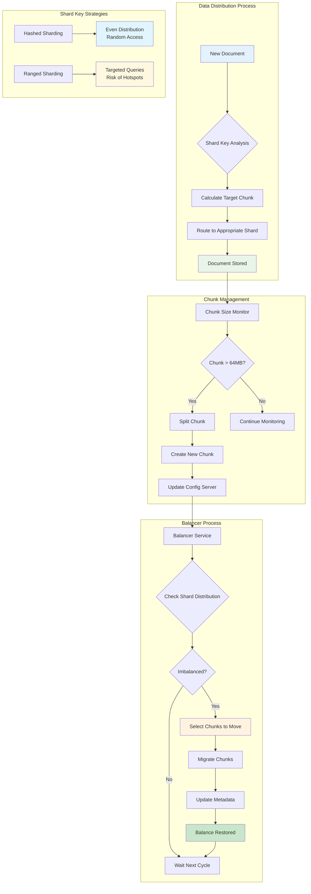

Chúng ta đã dựng cluster sharding, nhưng việc phân chia dữ liệu diễn ra như thế nào? "Bộ não" của quá trình này nằm ở **Shard Key** và tiến trình **Balancer**.

*   **Mục đích:** Chọn một "khóa phân mảnh" (Shard Key) tốt để dữ liệu được phân phối đều trên các Shard, tránh tình trạng "shard nóng, shard lạnh" (hotspot), và tối ưu hóa cả việc ghi và đọc.
*   **Các khái niệm cốt lõi:**
    *   **Shard Key:** Một hoặc nhiều trường trong document được dùng để quyết định document đó sẽ thuộc về "vùng" dữ liệu nào. **Một khi đã chọn, Shard Key không thể thay đổi.**
    *   **Chunk:** Một dải liên tiếp các giá trị của Shard Key. MongoDB sẽ tự động chia dữ liệu thành các chunk (mặc định 64MB).
    *   **Balancer:** Một tiến trình chạy ngầm, theo dõi sự phân bố của các chunk trên các shard. Nếu một shard có quá nhiều chunk so với các shard khác, Balancer sẽ tự động di chuyển (migrate) chunk để cân bằng lại.

#### **1. Lựa chọn Chiến lược Shard Key**

Đây là quyết định quan trọng nhất khi thiết kế một hệ thống sharding.

*   **Hashed Sharding (Phân mảnh Băm):**
    *   **Cách hoạt động:** MongoDB tính toán một giá trị băm (hash) của Shard Key và dùng giá trị này để phân chia dữ liệu.
    *   **Ví dụ:** `sh.shardCollection("testDB.myCollection", { "_id": "hashed" } )` (Như đã làm ở Giai đoạn 4)
    *   **Ưu điểm:** Đảm bảo dữ liệu ghi được phân phối **cực kỳ đều** trên tất cả các shard. Rất tốt cho các workload ghi nặng (heavy write).
    *   **Nhược điểm:** Các truy vấn theo dải (range query) sẽ không hiệu quả, vì các document có giá trị `_id` gần nhau lại nằm trên các shard khác nhau. `mongos` sẽ phải hỏi tất cả các shard.

*   **Ranged Sharding (Phân mảnh theo Dải):**
    *   **Cách hoạt động:** MongoDB chia dữ liệu dựa trên giá trị thực của Shard Key. Các document có giá trị key gần nhau sẽ nằm chung một chunk và trên cùng một shard.
    *   **Ví dụ:** `sh.shardCollection("events.logs", { "timestamp": 1 } )`
    *   **Ưu điểm:** Rất hiệu quả cho các truy vấn theo dải. Ví dụ: "lấy tất cả log trong 1 giờ qua" sẽ chỉ cần hỏi một hoặc hai shard.
    *   **Nhược điểm:** **Rủi ro tạo ra Hotspot.** Nếu Shard Key là một trường tăng đơn điệu (như `timestamp` hoặc `_id` mặc định), tất cả các lượt ghi mới sẽ luôn đi vào chunk cuối cùng trên một shard duy nhất, gây quá tải cho shard đó.

#### **2. Bẫy người mới khi chọn Shard Key**

⚠️ **BẪY NGƯỜI MỚI - Giai đoạn 12:**
- **Chọn `_id` mặc định với Ranged Sharding** → hot shard (đây là lỗi kinh điển)
- **Chọn key cardinality thấp** (ví dụ: `country` khi 90% là Việt Nam) → jumbo chunk
- **Khẳng định chunk size cứng 64MB** → khác theo version
- **Quên rằng Shard Key là bất biến** → không thể thay đổi sau khi sharding

💡 **MẸO:** Kiểm tra `maxChunkSizeBytes` hoặc tài liệu version đang chạy thay vì giả định.

*   **Chọn `_id` mặc định với Ranged Sharding:** Đây là lỗi kinh điển. `_id` của MongoDB có chứa timestamp và luôn tăng. Kết quả là tạo ra một "hot shard" hứng chịu toàn bộ lưu lượng ghi.
*   **Chọn một key có số lượng giá trị thấp (Low Cardinality):** Ví dụ, sharding collection người dùng theo trường `country` trong khi 90% người dùng đến từ "Việt Nam". Điều này sẽ tạo ra một chunk khổng lồ không thể chia tách (jumbo chunk) và không thể cân bằng.
*   **Quên rằng Shard Key là bất biến:** Không thể thay đổi Shard Key của một collection sau khi đã sharding. Nếu chọn sai, cách duy nhất để sửa là tạo một collection mới, sharding lại với key đúng, và di chuyển toàn bộ dữ liệu sang.

#### **3. Kiểm tra Phân phối Dữ liệu**

*   **Kết nối vào `mongos` và chạy các lệnh sau:**
    ```javascript
    use testDB
    
    // Xem thống kê phân phối của collection
    db.myCollection.getShardDistribution()
    
    // Xem trạng thái tổng quan của cluster, bao gồm các chunk và balancer
    sh.status()
    ```
    Hãy chú ý đến số lượng chunk trên mỗi shard trong kết quả của `sh.status()`. Nếu chúng chênh lệch quá nhiều, có thể Shard Key của bạn chưa tối ưu.

---

### **Giai đoạn 13: Giám sát Nâng cao và Tự động hóa Vận hành**

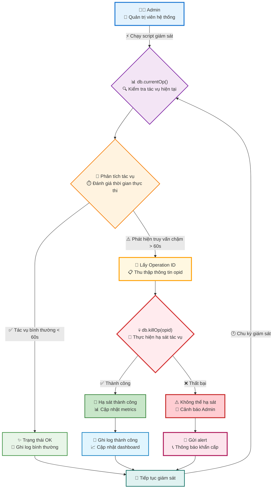

`mongostat` và `mongotop` cho ta cái nhìn tổng quan, nhưng khi một sự cố hiệu năng xảy ra, ta cần các công cụ "phẫu thuật" để xem chính xác *việc gì* đang diễn ra bên trong và can thiệp nếu cần.

*   **Mục đích:** Chủ động kiểm tra các tác vụ đang chạy trong thời gian thực, xác định các truy vấn "treo" hoặc quá chậm đang chiếm giữ tài nguyên, và có khả năng "hạ sát" (kill) chúng một cách an toàn để giải cứu hệ thống.
*   **Bẫy người mới:** Chỉ phản ứng khi hệ thống đã "đứng hình". Không biết cách xem các session đang hoạt động hoặc cho rằng cách duy nhất để xử lý truy vấn treo là khởi động lại `mongod`, gây gián đoạn dịch vụ không cần thiết.
*   **Thực hiện đúng:** Sử dụng `db.currentOp()` thường xuyên và có kịch bản (script) sẵn sàng để xử lý các tình huống khẩn cấp.

#### **1. Phân tích các Tác vụ đang chạy (`db.currentOp`)**

Lệnh này giống như `show processlist` trong MySQL hay `top` trên Linux, nó cho bạn thấy mọi thứ đang được thực thi bởi server ngay tại thời điểm đó.

*   **Yêu cầu:** Tìm tất cả các truy vấn từ user ứng dụng đang chạy quá 10 giây.
*   **Thực hiện (kết nối vào `mongos`):**
    ```javascript
    // Script: get_sql_running.js
    var c=1;
    db.currentOp({
      "active": true,
      "secs_running": { "$gt": 10 },
      // "op": "query", // Có thể lọc cụ thể hơn theo loại tác vụ
      // "ns": "testDB.myCollection" // Lọc theo collection
    }).inprog.forEach(function(op) {
      print("--- Slow Op " + c + " ---");
      print("opid: " + op.opid);
      print("active_secs: " + op.secs_running);
      print("namespace: " + op.ns);
      print("operation: " + op.op);
      printjson(op.command);
      c++;
    })
    ```
    Bạn có thể lưu script trên vào file `get_sql_running.js` và chạy bằng `mongosh --port 27020 -u ... -f get_sql_running.js`.

#### **2. "Hạ sát" các Truy vấn Gây hại (`db.killOp`)**

Khi bạn đã xác định được `opid` (Operation ID) của một truy vấn gây hại, bạn có thể chấm dứt nó.

*   **CẢNH BÁO:** Đây là một hành động mạnh. Cần cân nhắc kỹ lưỡng, đặc biệt là khi kill các thao tác ghi. Việc kill một thao tác ghi có thể để lại dữ liệu ở trạng thái không nhất quán tạm thời trước khi được rollback. Luôn ưu tiên tối ưu truy vấn và index hơn là phải đi kill chúng.

*   **Thực hiện đúng (Script an toàn):** Tài liệu của bạn cung cấp một script rất hay, nó gói logic này vào một hàm an toàn.
    ```javascript
    // Script: killLongRunningOps.js
    function killLongRunningOps(maxSecsRunning) {
      print("Searching for ops running longer than " + maxSecsRunning + " seconds...");
      let opsToKill = db.currentOp({
        "active": true,
        "secs_running": { "$gt": maxSecsRunning },
        "op": { "$in": ["query", "getmore"] } // Chỉ tập trung vào các truy vấn đọc
      }).inprog;
    
      for (let op of opsToKill) {
        // Cực kỳ quan trọng: Không kill các tác vụ hệ thống
        if (!op.ns.startsWith("local") && !op.ns.startsWith("config")) {
          print(`Killing opId: ${op.opid} on ${op.ns}, running for ${op.secs_running}s`);
          db.killOp(op.opid);
        }
      }
    };
    
    // Ví dụ: Kill tất cả truy vấn đọc chạy quá 60 giây
    killLongRunningOps(60);
    ```

#### **3. Tự động hóa Giám sát Tình trạng Replica Set**

*   **Mục đích:** Viết các script nhỏ để kiểm tra các chỉ số sức khỏe quan trọng như "replication lag" (độ trễ sao chép) và tình trạng của các node secondary. Các script này có thể được tích hợp vào các hệ thống giám sát như Zabbix, Nagios, hoặc một cron job đơn giản.
*   **Script kiểm tra Replication Lag:**
    ```javascript
    // Script: check_replica_lag.js
    // Chạy script này trên từng PRIMARY của mỗi shard
    // Ví dụ: mongosh --port 27011 -f check_replica_lag.js
    printjson(rs.printSecondaryReplicationInfo());
    ```
    *Kết quả sẽ cho bạn biết mỗi node secondary đang "chậm chân" hơn primary bao nhiêu giây. Nếu con số này tăng đột biến, đó là dấu hiệu của sự cố mạng hoặc quá tải trên secondary.*
*   **Script đếm số lượng node Secondary:**
    ```javascript
    // Script: check_secondary_count.js
    // Chạy trên một member bất kỳ của replica set
    var secondaryCount = 0;
    var status = rs.status();
    for (var i = 0; i < status.members.length; i++) {
      if (status.members[i].stateStr === "SECONDARY") {
        secondaryCount++;
      }
    }
    print("Number of active secondaries: " + secondaryCount);
    ```
    *Nếu số lượng secondary ít hơn mong đợi, hệ thống của bạn đã mất đi một phần khả năng chịu lỗi (failover).*

---

### **Giai đoạn 14: Kỹ thuật Phục hồi Nâng cao - Point-in-Time Recovery (PITR)**

⚠️ **CẢNH BÁO SHARDED CLUSTER:**
- **`mongorestore --oplogReplay` chỉ áp dụng cho MỘT replica set**
- **Với sharded cluster, cần đồng bộ TỪNG SHARD hoặc dùng giải pháp chuyên dụng**
- **ĐỪNG dump oplog từ `mongos` rồi kỳ vọng replay cho cả cụm**

💡 **PITR SHARDED CLUSTER đúng cách:**
- Full backup đồng bộ + oplog từng shard
- Kiểm soát timestamp phối hợp
- Hoặc dùng MongoDB Atlas/Ops Manager backup

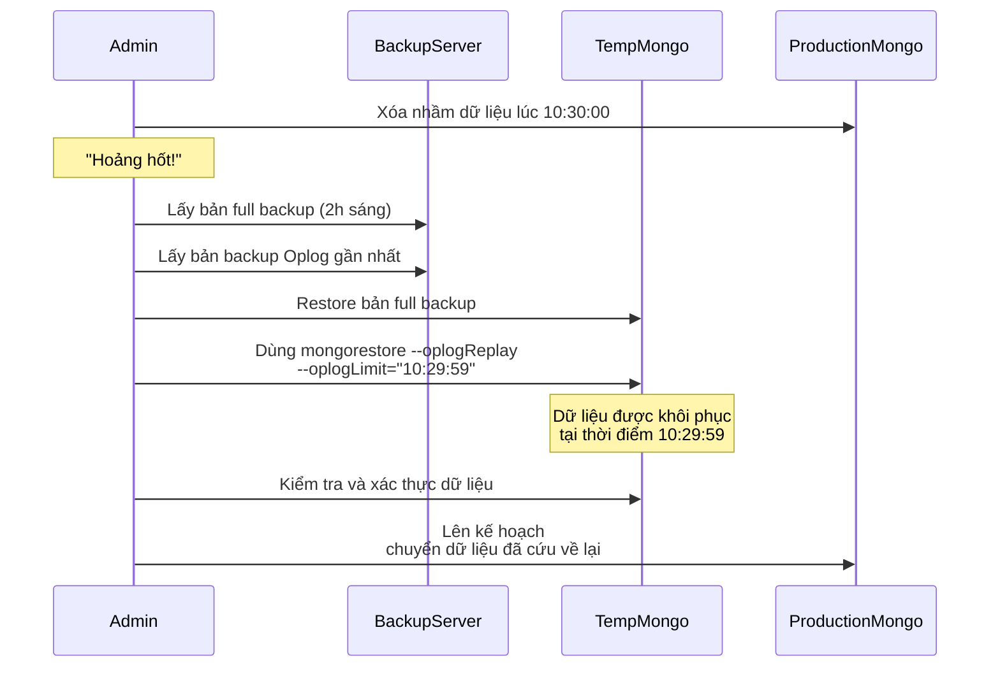

Đây là kỹ năng "cứu hoả" tối thượng. Khi một lập trình viên lỡ tay `DROP collection` hoặc chạy một lệnh `UPDATE` sai làm hỏng toàn bộ dữ liệu, việc restore từ bản backup đêm qua có thể làm mất hàng giờ dữ liệu quý giá. PITR cho phép bạn quay ngược thời gian về đúng *giây* trước khi thảm hoạ xảy ra.

*   **Mục đích:** Khôi phục database về một thời điểm cụ thể trong quá khứ, giảm thiểu tối đa việc mất dữ liệu (Recovery Point Objective ~ 0).
*   **Bẫy người mới:** Không có chiến lược backup oplog. Chỉ khi sự cố xảy ra mới nhận ra rằng mình không có nguyên liệu để thực hiện PITR.
*   **Thực hiện đúng:** Xây dựng một quy trình chặt chẽ bao gồm: sao lưu đầy đủ định kỳ và sao lưu oplog liên tục (hoặc rất thường xuyên).

#### **Quy trình Cứu dữ liệu khi Xóa nhầm**

**Kịch bản:** Vào lúc **10:45:15 sáng**, một collection quan trọng đã bị xóa nhầm. Bản full backup gần nhất là lúc **2:00 sáng**. Bạn có một cronjob chạy `mongodump` để backup oplog mỗi 15 phút.

1.  **HÀNH ĐỘNG ĐẦU TIÊN: BÌNH TĨNH VÀ CÔ LẬP.**
    *   Ngăn chặn ngay lập tức mọi kết nối từ ứng dụng tới database để tránh các sai sót phát sinh thêm.

2.  **CHUẨN BỊ MÔI TRƯỜNG PHỤC HỒI:**
    *   Dựng một instance MongoDB tạm thời trên một server khác. **Tuyệt đối không restore đè lên server production đang gặp sự cố.**

3.  **PHỤC HỒI TỪ BẢN FULL BACKUP:**
    *   Trên server tạm, chạy lệnh restore từ bản backup lúc 2:00 sáng.
        ```bash
        mongorestore --host=localhost --port=27017 /path/to/full_backup_0200AM
        ```

4.  **TÌM TIMESTAMP CỦA "TỘI ÁC":**
    *   Chúng ta cần tìm timestamp chính xác tương ứng với thời điểm ngay trước 10:45:15.
    *   Lấy file backup oplog gần nhất (ví dụ bản lúc 11:00, chứa các log từ 10:45 đến 11:00).
    *   Dùng `bsondump` để chuyển file BSON của oplog sang định dạng JSON có thể đọc được.
        ```bash
        bsondump /backup/mongo/local/oplog.rs.bson > oplog.json
        ```
    *   Mở file `oplog.json` và tìm kiếm. Mỗi entry sẽ có một trường `"ts"` (timestamp) dạng `Timestamp(1678852000, 1)`. Con số đầu tiên là Unix timestamp. Bạn cần tìm entry ngay trước thời điểm xảy ra sự cố. Giả sử bạn tìm được timestamp giới hạn là `1729073314:3`.

5.  **ÁP DỤNG OPLOG (Bước Ma thuật):**
    *   Bây giờ, trên server tạm, bạn sẽ "chiếu lại" các thay đổi từ oplog, bắt đầu từ thời điểm của bản full backup và dừng lại *ngay trước* khi lệnh xóa được thực thi.
        ```bash
        # Tạo user restore đặc biệt nếu cần (như trong tài liệu)
        # ...
        
        # Chạy lệnh restore oplog
        mongorestore --port 27017 \
                     --oplogReplay --oplogLimit=1729073314:3 \
                     /backup/mongo/local/oplog.rs.bson
        ```
        *   `--oplogReplay`: Yêu cầu `mongorestore` áp dụng các entry trong file oplog.
        *   `--oplogLimit`: Đây chính là chiếc "cỗ máy thời gian". Nó sẽ dừng lại ở timestamp được chỉ định.

6.  **XÁC THỰC VÀ HOÀN TẤT:**
    *   Kết nối vào server tạm, kiểm tra kỹ lưỡng xem collection đã quay trở lại và dữ liệu đã đúng trạng thái tại thời điểm 10:45:14 hay chưa.
    *   Khi đã chắc chắn 100%, bạn có thể lên kế hoạch để di chuyển dữ liệu đã được cứu này về lại môi trường production.

Quy trình này phức tạp nhưng là cứu cánh trong những tình huống nguy cấp nhất. Việc thực hành nó trong môi trường test là bắt buộc để bạn luôn sẵn sàng khi cần.

Bạn đã đi đến phần cuối cùng của những kiến thức cốt lõi có trong tài liệu thực hành rồi đấy. Chúng ta đã tích hợp gần như toàn bộ các bài thực hành từ Day 1 đến Day 5, từ cài đặt, truy vấn, bảo mật, vận hành replica set, sharding, cho đến các kịch bản giám sát và phục hồi.

Chủ đề cuối cùng được đề cập trong tài liệu của bạn là một phần tinh chỉnh hiệu năng cực kỳ quan trọng, liên quan trực tiếp đến cách MongoDB sử dụng bộ nhớ (RAM). Hãy hoàn thiện nó với giai đoạn cuối cùng này.

---

### **Giai đoạn 15: Tinh chỉnh Tầng Lưu trữ (Storage Engine Tuning)**

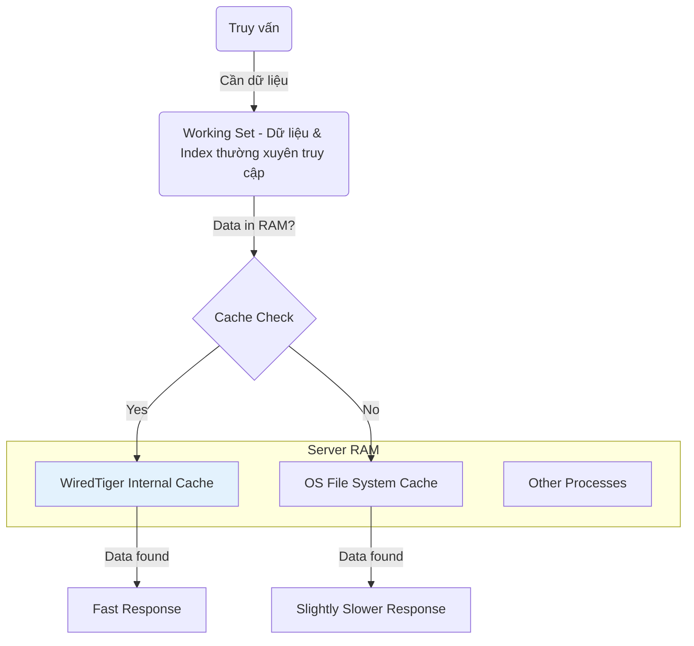

MongoDB, cụ thể là storage engine WiredTiger, sử dụng hai cơ chế cache chính để tăng tốc độ: cache nội bộ của chính nó (WiredTiger internal cache) và cache của hệ điều hành (OS filesystem cache). Việc cân bằng dung lượng RAM cho hai cơ chế này là chìa khóa để đạt hiệu năng tối đa.

*   **Mục đích:** Phân bổ bộ nhớ RAM một cách hợp lý để đảm bảo "working set" (dữ liệu và index được truy cập thường xuyên nhất) có thể nằm vừa trong RAM, giảm thiểu việc phải đọc từ ổ đĩa (disk I/O) - vốn là tác nhân gây chậm hiệu năng nhất.
*   **Bẫy người mới:**
    *   Để mặc định mà không hiểu nó hoạt động ra sao. Mặc định của MongoDB là `(RAM - 1GB) / 2`, thường là một khởi đầu tốt nhưng không phải lúc nào cũng tối ưu.
    *   Phân bổ quá nhiều RAM cho WiredTiger cache. Điều này sẽ "bóp nghẹt" OS cache, làm cho các thao tác đọc dữ liệu không nằm trong working set trở nên rất chậm.
*   **Thực hiện đúng:** Hiểu rõ workload của bạn. Nếu hệ thống của bạn có chỉ số cache hit ratio thấp (phải đọc từ disk nhiều), việc tinh chỉnh này là cần thiết.

#### **1. Cấu hình Kích thước WiredTiger Cache**

WiredTiger cache chủ yếu được dùng để giữ các dữ liệu *chưa được nén* (uncompressed data). Trong khi đó, OS filesystem cache lại giữ các file dữ liệu *đã được nén* (compressed data blocks) của MongoDB.

*   **Quy tắc chung:**
    *   **RAM > Working Set:** Nếu bạn có thừa RAM để chứa toàn bộ working set, hãy tăng WiredTiger cache lên.
    *   **RAM < Working Set:** Nếu RAM của bạn eo hẹp hơn, hãy giữ WiredTiger cache ở mức nhỏ hơn để nhường phần lớn RAM cho OS cache quản lý.

*   **Cách cấu hình:**
    1.  Mở file cấu hình của một tiến trình `mongod` (ví dụ: `/etc/mongod-shard1.conf`).
    2.  Thêm hoặc chỉnh sửa tham số `cacheSizeGB` trong mục `storage`.
        ```yaml
        storage:
          dbPath: /data/shard1
          journal:
            enabled: true # Luôn bật journal trong production
          engine: wiredTiger # Mặc định, nhưng ghi rõ ràng là một thói quen tốt
          wiredTiger:
            engineConfig:
              # --- Dòng quan trọng là đây ---
              cacheSizeGB: 8 # Ví dụ: Cấp phát 8GB RAM cho WiredTiger cache
        ```
    3.  **Ví dụ thực tế:** Trên một máy chủ có 64GB RAM.
        *   **Mặc định:** MongoDB sẽ lấy `(64 - 1) / 2 = 31.5 GB` cho WiredTiger cache.
        *   **Tùy chỉnh:** Nếu bạn biết working set của mình khoảng 40GB và đã được nén tốt, bạn có thể giảm `cacheSizeGB` xuống còn 16GB, để lại `64 - 16 = 48GB` cho OS cache, đủ sức chứa toàn bộ working set đã nén.
    4.  Khởi động lại tiến trình `mongod` để áp dụng thay đổi.

---

### **Tổng kết và Con đường Tiếp theo**

Chúc mừng bạn! Bằng cách kết hợp tài liệu hướng dẫn gốc và các bài thực hành chi tiết, bạn đã đi qua một hành trình hoàn chỉnh:

1.  **Chuẩn bị Môi trường:** Từ A-Z để có một nền tảng Linux vững chắc.
2.  **Dựng Cluster Sharding:** Hiểu rõ và xây dựng từng thành phần: Config Server, Shard, Mongos.
3.  **Thao tác Dữ liệu:** Nắm vững Aggregation Framework để xử lý dữ liệu phức tạp.
4.  **Bảo mật:** Quản lý người dùng, phân quyền chi tiết với RBAC và ghi log audit.
5.  **Vận hành Replica Set:** Tinh chỉnh bầu cử, cấu hình node ẩn và quản lý Oplog.
6.  **Tối ưu Hiệu năng:** Sử dụng Index, phân tích `explain()`, và tinh chỉnh Storage Engine.
7.  **Giám sát & Phục hồi:** Chủ động theo dõi hệ thống và nắm trong tay các kỹ thuật cứu dữ liệu tối thượng như Point-in-Time Recovery.

Bạn không chỉ biết "làm theo", mà còn hiểu được "tại sao" và biết cách tránh những "cái bẫy" phổ biến. Đây là một nền tảng cực kỳ vững chắc.

---

Hệ sinh thái MongoDB rất rộng lớn. Với những kiến thức này, bạn đã sẵn sàng để khám phá các chủ đề nâng cao hơn:

*   **Schema Design Patterns:** Cách thiết kế cấu trúc document (schema) hiệu quả cho các loại ứng dụng khác nhau (ví dụ: áp dụng ánh xạ, ánh xạ mở rộng, tập con, cây...).
*   **Change Streams:** Theo dõi sự thay đổi dữ liệu trong collection theo thời gian thực để xây dựng các hệ thống phản ứng (reactive systems).
*   **Multi-Document Transactions:** Cách đảm bảo tính toàn vẹn ACID khi phải thực hiện các thao tác ghi trên nhiều document hoặc nhiều collection.
*   **MongoDB Atlas:** Trải nghiệm phiên bản cloud của MongoDB, nơi rất nhiều tác vụ vận hành (backup, scaling, monitoring) đã được tự động hóa, giúp bạn tập trung hơn vào việc phát triển ứng dụng.
*   **Bảo mật Chuyên sâu:** Triển khai xác thực qua chứng chỉ x.509, tích hợp với LDAP/Kerberos.

Chúc mừng bạn một lần nữa vì đã hoàn thành một chặng đường rất dài và chuyên sâu. Chúc bạn thành công trên con đường làm chủ MongoDB