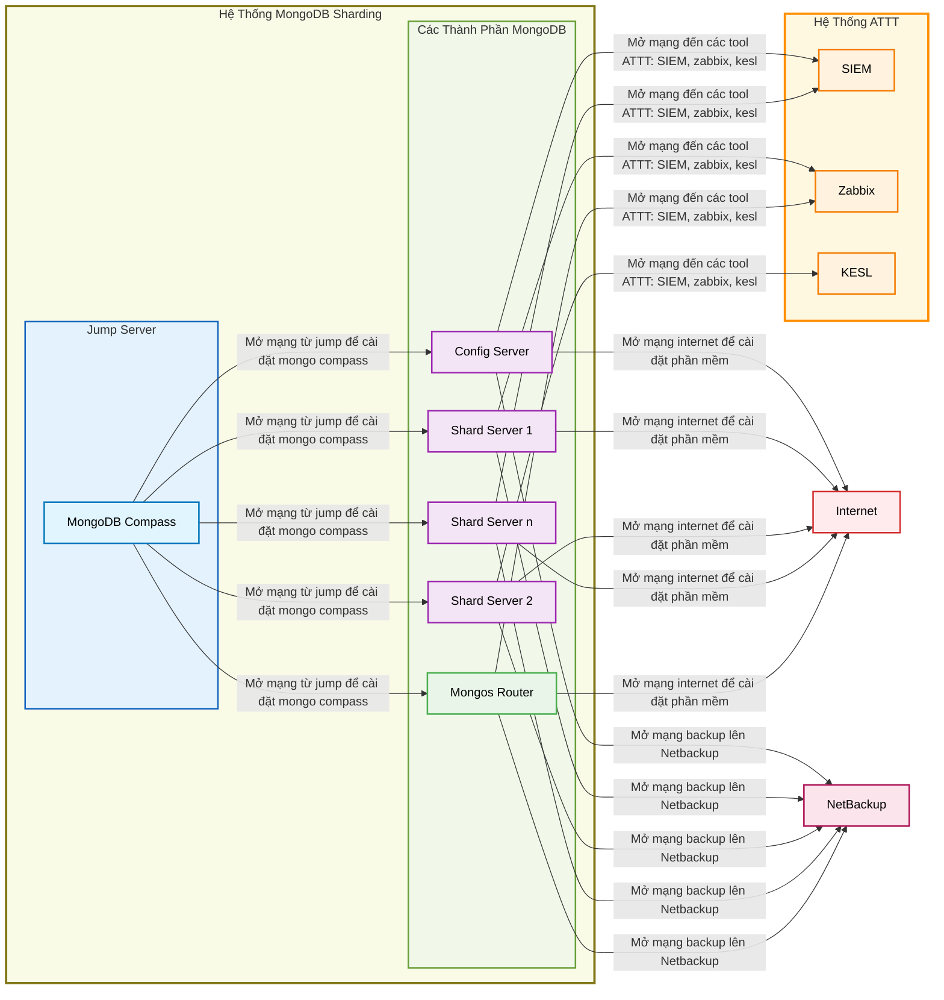

# Quy Trình Yêu Cầu Mở Mạng Cho MongoDB Sharding

## Mục tiêu

Thiết lập quy trình yêu cầu mở mạng cho hệ thống MongoDB Sharding, đảm bảo kết nối an toàn và hiệu quả giữa các thành phần trong hệ thống và với các hệ thống bên ngoài.

## Các Yêu Cầu Mở Mạng

### 1. Mở mạng từ jump server để cài đặt MongoDB Compass

MongoDB Compass là công cụ quản lý và giám sát MongoDB trực quan, cần được cài đặt từ jump server để kết nối đến các thành phần trong hệ thống MongoDB Sharding.

### 2. Mở mạng Internet để cài đặt phần mềm

Các máy chủ trong hệ thống MongoDB Sharding cần truy cập Internet để:
- Cập nhật hệ điều hành và bảo mật
- Tải về các gói phần mềm cần thiết
- Truy cập các repository chính thức của MongoDB

### 3. Mở mạng đến các công cụ ATTT (An toàn thông tin)

Kết nối đến các công cụ ATTT để đảm bảo giám sát và bảo mật hệ thống:
- **SIEM (Security Information and Event Management)**: Thu thập và phân tích log bảo mật
- **Zabbix**: Giám sát hiệu năng và hoạt động của hệ thống
- **KESL (Kaspersky Endpoint Security for Linux)**: Bảo vệ điểm cuối khỏi các mối đe dọa

### 4. Mở mạng backup lên NetBackup

Thiết lập kết nối đến hệ thống NetBackup để thực hiện backup và phục hồi dữ liệu MongoDB:
- Backup dữ liệu định kỳ
- Phục hồi dữ liệu khi cần thiết
- Quản lý chính sách backup tập trung

## Sơ đồ quy trình mở mạng

## Chi Tiết Các Bước Thực Hiện

### Bước 1: Mở mạng từ jump server để cài đặt MongoDB Compass

1. Xác định IP của jump server
2. Xác định danh sách các thành phần MongoDB cần kết nối
3. Gửi yêu cầu mở port cần thiết cho kết nối từ jump server đến các thành phần MongoDB
4. Kiểm tra kết nối sau khi mở mạng
5. Cài đặt MongoDB Compass trên jump server
6. Kiểm tra kết nối từ MongoDB Compass đến các thành phần trong hệ thống

### Bước 2: Mở mạng Internet để cài đặt phần mềm

1. Xác định danh sách các máy chủ MongoDB cần truy cập Internet
2. Gửi yêu cầu mở kết nối Internet cho các máy chủ
3. Xác định các repository cần thiết cho MongoDB và hệ điều hành
4. Kiểm tra kết nối Internet từ các máy chủ
5. Thực hiện cập nhật hệ thống và cài đặt phần mềm cần thiết

### Bước 3: Mở mạng đến các công cụ ATTT

1. Xác định IP và port của các hệ thống ATTT (SIEM, Zabbix, KESL)
2. Gửi yêu cầu mở kết nối từ các máy chủ MongoDB đến các hệ thống ATTT
3. Cấu hình agent trên các máy chủ MongoDB để kết nối với các hệ thống ATTT
4. Kiểm tra kết nối và thu thập log/báo cáo từ các hệ thống ATTT
5. Xác nhận hoạt động giám sát và bảo mật đang hoạt động đúng

### Bước 4: Mở mạng backup lên NetBackup

1. Xác định IP và port của hệ thống NetBackup
2. Gửi yêu cầu mở kết nối từ các máy chủ MongoDB đến hệ thống NetBackup
3. Cài đặt và cấu hình NetBackup client trên các máy chủ MongoDB
4. Thiết lập chính sách backup cho các thành phần MongoDB
5. Kiểm tra kết nối và thực hiện backup thử nghiệm
6. Xác nhận backup thành công và có thể phục hồi khi cần

## Lưu ý Quan Trọng

- Tất cả các yêu cầu mở mạng cần được phê duyệt bởi bộ phận quản lý an ninh
- Cần thực hiện kiểm tra bảo mật sau khi mở mạng
- Ghi chép đầy đủ các kết nối đã mở để quản lý và bảo trì
- Định kỳ rà soát và đóng các kết nối không cần thiết