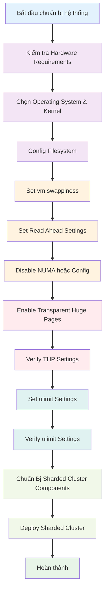

### Checklist Tinh Chỉnh Hệ Thống Trước Khi Cài Đặt MongoDB Sharded Cluster (Enterprise 8.0)

Trước khi triển khai MongoDB Sharded Cluster, cần thực hiện các bước tinh chỉnh hệ thống để đảm bảo hiệu suất và độ ổn định. Sơ đồ dưới đây minh họa quy trình chuẩn bị:

**Giải thích các bước:**

1. **Kiểm tra Hardware Requirements**: Đảm bảo mỗi instance mongod/mongos có đủ tài nguyên CPU, RAM và storage
2. **Chọn Operating System & Kernel**: Sử dụng hệ điều hành và kernel được khuyến nghị cho MongoDB
3. **Config Filesystem**: Cấu hình filesystem phù hợp (XFS/EXT4) và các tùy chỉnh liên quan
4. **Set vm.swappiness**: Điều chỉnh virtual memory để tránh swapping ảnh hưởng đến hiệu suất
5. **Set Read Ahead Settings**: Cấu hình readahead cho storage engine WiredTiger
6. **Disable NUMA hoặc Config**: Tối ưu hóa NUMA để tránh độ trễ bộ nhớ
7. **Enable Transparent Huge Pages**: Bật THP (theo khuyến nghị MongoDB 8.0+)
8. **Verify THP Settings**: Kiểm tra cài đặt THP đã được áp dụng đúng
9. **Set ulimit Settings**: Cấu hình giới hạn tài nguyên cho user MongoDB
10. **Verify ulimit Settings**: Kiểm tra các giới hạn đã được áp dụng đúng
11. **Chuẩn Bị Sharded Cluster Components**: Chuẩn bị các thành phần config server và shard
12. **Deploy Sharded Cluster**: Triển khai cluster sau khi hoàn tất tinh chỉnh hệ thống

Sau khi hoàn tất các bước trên, bạn có thể tiến hành cài đặt MongoDB Sharded Cluster theo hướng dẫn chi tiết.

| Bước | Mô tả | Link | Trích đoạn ngắn gọn |
|------|--------|------|---------------------|
| 1. Kiểm tra Hardware Requirements | Đảm bảo mỗi mongod/mongos có ít nhất 2 real cores hoặc 1 multi-core CPU; ưu tiên CPU hỗ trợ AES-NI nếu dùng encryption; dùng SSD nếu có thể, hoặc SATA drives; tăng RAM để cải thiện I/O. | [https://www.mongodb.com/docs/v8.0/administration/production-notes/#std-label-prod-notes-hardware](https://www.mongodb.com/docs/v8.0/administration/production-notes/#std-label-prod-notes-hardware) | "At a minimum, ensure that each mongod or mongos instance has access to two real cores or one multi-core physical CPU. When using encryption, CPUs equipped with AES-NI instruction-set extensions show significant performance advantages. Use SSD if available and economical. Commodity (SATA) spinning drives are often a good option." |
| 2. Chọn Operating System & Kernel | Sử dụng Linux kernel 2.6.36+; các OS khuyến nghị: Amazon Linux, Debian, RHEL, SLES, Ubuntu LTS; chạy version mới nhất ổn định. | [https://www.mongodb.com/docs/v8.0/administration/production-notes/#std-label-prod-notes-operating-systems](https://www.mongodb.com/docs/v8.0/administration/production-notes/#std-label-prod-notes-operating-systems) | "While MongoDB supports a variety of platforms, the following operating systems are recommended for production use on x86_64 architecture: Amazon Linux, Debian, RHEL, SLES, Ubuntu LTS. When running MongoDB in production on Linux, you should use Linux kernel version 2.6.36 or later." |
| 3. Config Filesystem (XFS/EXT4, RAID, atime, NFS) | Sử dụng XFS (ưu tiên cho WiredTiger) hoặc EXT4; tắt atime cho volume chứa DB; dùng RAID-10 cho disks; nếu NFS, thêm options bg, hard, nolock, noatime, nointr vào /etc/fstab; tách data/journal/logs ra devices khác nhau nếu cần. | [https://www.mongodb.com/docs/v8.0/administration/production-notes/#std-label-prod-notes-filesystems](https://www.mongodb.com/docs/v8.0/administration/production-notes/#std-label-prod-notes-filesystems) | "Use Linux kernel version 2.6.36 or later, with either the XFS or EXT4 filesystem. If possible, use XFS as it generally performs better with MongoDB. Turn off atime for the storage volume containing the database files. For optimal performance in terms of the storage layer, use disks backed by RAID-10. If you decide to use NFS, add the following NFS options to your /etc/fstab file: bg, hard, nolock, noatime, nointr." |
| 4. Set vm.swappiness (Virtual Memory) | Set vm.swappiness = 1 hoặc 0 để tránh swapping; chỉnh trong /etc/sysctl.conf và apply bằng sysctl -p. | [https://www.mongodb.com/docs/v8.0/administration/production-notes/#std-label-prod-notes-virtual-memory-systems](https://www.mongodb.com/docs/v8.0/administration/production-notes/#std-label-prod-notes-virtual-memory-systems) | "MongoDB performs best where swapping can be avoided or kept to a minimum. As such you should set vm.swappiness to either 1 or 0 depending on your application needs and cluster configuration. Edit the /etc/sysctl.conf file and add the following line: vm.swappiness = 1, Run the following command to apply the setting: sudo sysctl -p." |
| 5. Set Read Ahead Settings | Set readahead giữa 8-32 cho WiredTiger, bất kể loại storage (HDD/SSD). | [https://www.mongodb.com/docs/v8.0/administration/production-notes/#std-label-prod-notes-readahead](https://www.mongodb.com/docs/v8.0/administration/production-notes/#std-label-prod-notes-readahead) | "For the WiredTiger storage engine: Set the readahead setting between 8 and 32 regardless of storage media type (spinning disk, SSD, etc.)." |
| 6. Disable NUMA (hoặc Config) | Tắt NUMA trong BIOS nếu có thể; nếu không, tắt zone reclaim bằng echo 0 > /proc/sys/vm/zone_reclaim_mode hoặc sysctl; start mongod/mongos bằng numactl --interleave=all. | [https://www.mongodb.com/docs/v8.0/administration/production-notes/#std-label-prod-notes-numa](https://www.mongodb.com/docs/v8.0/administration/production-notes/#std-label-prod-notes-numa) | "Disable NUMA in your BIOS. If that is not possible, see MongoDB on NUMA Hardware. On Linux, you must disable zone reclaim and also ensure that your mongod and mongos instances are started by numactl, which is generally configured through your platform's init system. Disable zone reclaim with one of the following commands: echo 0 | sudo tee /proc/sys/vm/zone_reclaim_mode, sudo sysctl -w vm.zone_reclaim_mode=0." |
| 7. Enable Transparent Huge Pages (THP) | Tạo service file /etc/systemd/system/enable-transparent-huge-pages.service với ExecStart set echo always/defer+madvise/0/1 cho enabled/defrag/max_ptes_none/overcommit; daemon-reload, start, enable. Hoặc dùng init.d script cho System V. | [https://www.mongodb.com/docs/v8.0/administration/tcmalloc-performance/](https://www.mongodb.com/docs/v8.0/administration/tcmalloc-performance/) | "If you are running MongoDB 8.0, enable Transparent Hugepages. For systems using systemd: Create /etc/systemd/system/enable-transparent-huge-pages.service ... ExecStart=/bin/sh -c 'echo always | tee /sys/kernel/mm/transparent_hugepage/enabled ...'. Then sudo systemctl daemon-reload; sudo systemctl start enable-transparent-huge-pages; sudo systemctl enable enable-transparent-huge-pages." |
| 8. Verify THP Settings | Chạy cat /sys/kernel/mm/transparent_hugepage/enabled && defrag && khugepaged/max_ptes_none && /proc/sys/vm/overcommit_memory; expected: always, defer+madvise, 0, 1. | [https://www.mongodb.com/docs/v8.0/administration/tcmalloc-performance/](https://www.mongodb.com/docs/v8.0/administration/tcmalloc-performance/) | "Verify: cat /sys/kernel/mm/transparent_hugepage/enabled && ... (expected: always defer+madvise 0 1)." |
| 9. Set ulimit Settings | Recommended: -f/-t/-v/-l/-m: unlimited, -n: 64000, -u: 64000; chỉnh trong /etc/systemd/system/mongod.service [Service] LimitNOFILE=64000 LimitNPROC=64000; hoặc ulimit tạm thời; cho RHEL tạo /etc/security/limits.d/99-mongodb-nproc.conf. | [https://www.mongodb.com/docs/v8.0/reference/ulimit/](https://www.mongodb.com/docs/v8.0/reference/ulimit/) | "Recommended: -f (file size): unlimited, -n (open files): 64000, -u (processes/threads): 64000. Edit /etc/systemd/system/mongod.service [Service] LimitNOFILE=64000 LimitNPROC=64000, then systemctl restart mongod.service." |
| 10. Verify ulimit Settings | Chạy ulimit -a hoặc cat /proc/<pid>/limits cho process đang chạy. | [https://www.mongodb.com/docs/v8.0/reference/ulimit/](https://www.mongodb.com/docs/v8.0/reference/ulimit/) | "Verify: ulimit -a hoặc cat /proc/<pid>/limits." |
| 11. Chuẩn Bị Sharded Cluster Components | Deploy config servers và shards như replica sets trên ≥3 data centers cho HA; thêm multiple mongos với load balancer. | [https://www.mongodb.com/docs/v8.0/core/sharded-cluster-components/](https://www.mongodb.com/docs/v8.0/core/sharded-cluster-components/) | "For production deployments, deploy config server and shard replica sets on at least three data centers to ensure high availability. For shard-level high availability, either add mongos instances on the same hardware where mongod instances are running, or embed mongos routers on the same hardware where the application is hosted." |
| 12. Deploy Sharded Cluster (Sau Tuning) | Cài đặt và deploy config servers, shards, mongos; kiểm tra logs cho warnings về ulimit/THP. | [https://www.mongodb.com/docs/v8.0/tutorial/deploy-sharded-cluster/](https://www.mongodb.com/docs/v8.0/tutorial/deploy-sharded-cluster/) | "Deploy config servers as replica set, shards, then mongos routers. Assumes system tunings completed." |

--------------------------------------------------

**THAM KHAO THEM**

| Bước | Mô tả                                                                             | Link                                                                                                                                                                                                 | Trích đoạn ngắn gọn                                                                                                          |
| ---- | --------------------------------------------------------------------------------- | ---------------------------------------------------------------------------------------------------------------------------------------------------------------------------------------------------- | ---------------------------------------------------------------------------------------------------------------------------- |
| 1    | Đọc “Production Notes” để nắm các lưu ý vận hành trước khi làm                    | [https://www.mongodb.com/docs/manual/administration/production-notes/](https://www.mongodb.com/docs/manual/administration/production-notes/)                                                         | “This page details system configurations that affect MongoDB…”. ([MongoDB][1])                                               |
| 2    | Chọn filesystem & dbPath đúng (ưu tiên XFS, tránh NFS; đảm bảo quyền ghi/đọc)     | [https://www.mongodb.com/docs/manual/administration/production-notes/](https://www.mongodb.com/docs/manual/administration/production-notes/)                                                         | “The files in the dbPath… mongod must possess read and write permissions…”. ([MongoDB][1])                                   |
| 3    | Tinh chỉnh **readahead** cho thiết bị lưu trữ (thường 8–32)                       | [https://www.mongodb.com/docs/manual/administration/production-checklist-operations/](https://www.mongodb.com/docs/manual/administration/production-checklist-operations/)                           | “Set readahead to 8–32 for the devices that store the database.” ([MongoDB][2])                                              |
| 4    | Chọn **I/O scheduler** phù hợp (deadline/noop hoặc tương đương)                   | [https://www.mongodb.com/docs/manual/administration/production-checklist-operations/](https://www.mongodb.com/docs/manual/administration/production-checklist-operations/)                           | “Use a scheduler suitable for database workloads (for example, deadline).” ([MongoDB][2])                                    |
| 5    | Bật **TCMalloc tối ưu** và **THP** theo khuyến nghị 8.0                           | [https://www.mongodb.com/docs/manual/administration/production-checklist-operations/](https://www.mongodb.com/docs/manual/administration/production-checklist-operations/)                           | “Enable THP for best performance when using upgraded TCMalloc in 8.0.” ([MongoDB][2])                                        |
| 6    | Kiểm tra thay đổi **TCMalloc** trong 8.0 & thông số `tcmallocReleaseRate`         | [https://www.mongodb.com/docs/manual/release-notes/8.0-compatibility/](https://www.mongodb.com/docs/manual/release-notes/8.0-compatibility/)                                                         | “Starting in MongoDB 8.0… upgraded TCMalloc… To use the new TCMalloc… see TCMalloc Performance Optimization.” ([MongoDB][3]) |
| 7    | Cấu hình **NUMA** (interleave all) & **tắt zone\_reclaim\_mode**                  | [https://www.mongodb.com/docs/manual/administration/production-notes/](https://www.mongodb.com/docs/manual/administration/production-notes/)                                                         | “Use numactl to interleave memory on NUMA; disable zone\_reclaim\_mode.” ([MongoDB][4])                                      |
| 8    | Đặt **TCP keepalive \~120s** để tránh treo kết nối lâu                            | [https://www.mongodb.com/docs/manual/administration/production-checklist-operations/](https://www.mongodb.com/docs/manual/administration/production-checklist-operations/)                           | “Set TCP keepalive to 120 seconds on Linux.” ([MongoDB][2])                                                                  |
| 9    | Thiết lập **ulimit** phù hợp (files, processes/threads, v.v.)                     | [https://www.mongodb.com/docs/manual/reference/ulimit/](https://www.mongodb.com/docs/manual/reference/ulimit/)                                                                                       | “These ‘ulimits’ prevent single users from using too many system resources.” ([MongoDB][5])                                  |
| 10   | Kiểm tra/điều chỉnh thêm các **kernel params** (file handles, pid, threads, mmap) | [https://www.mongodb.com/docs/manual/administration/production-checklist-operations/](https://www.mongodb.com/docs/manual/administration/production-checklist-operations/)                           | “Configure sufficient file handles… kernel pid limit… maximum threads… vm.max\_map\_count.” ([MongoDB][2])                   |
| 11   | Cài **MongoDB Enterprise 8.0** trên Linux (ví dụ Ubuntu LTS)                      | [https://www.mongodb.com/docs/manual/tutorial/install-mongodb-enterprise-on-ubuntu/](https://www.mongodb.com/docs/manual/tutorial/install-mongodb-enterprise-on-ubuntu/)                             | “Use this tutorial to install MongoDB 8.0 Enterprise Edition on Ubuntu LTS.” ([MongoDB][6])                                  |
| 12   | Chạy MongoDB bằng **user hệ điều hành riêng**                                     | [https://www.mongodb.com/docs/v8.0/administration/security-checklist/](https://www.mongodb.com/docs/v8.0/administration/security-checklist/)                                                         | “Run MongoDB processes with a dedicated operating system user account.” ([MongoDB][7])                                       |
| 13   | **Bật RBAC**: Enable Access Control & cơ chế xác thực                             | [https://www.mongodb.com/docs/v8.0/administration/security-checklist/](https://www.mongodb.com/docs/v8.0/administration/security-checklist/)                                                         | “Enable access control and specify an authentication mechanism.” ([MongoDB][7])                                              |
| 14   | Tạo **user admin** trước rồi tạo các user/role tối thiểu cần thiết                | [https://www.mongodb.com/docs/v8.0/administration/security-checklist/](https://www.mongodb.com/docs/v8.0/administration/security-checklist/)                                                         | “Create a user administrator first… follow the principle of least privilege.” ([MongoDB][7])                                 |
| 15   | **Bật TLS/SSL** cho `mongod`/`mongos` và ứng dụng                                 | [https://www.mongodb.com/docs/v8.0/administration/security-checklist/](https://www.mongodb.com/docs/v8.0/administration/security-checklist/)                                                         | “Configure MongoDB to use TLS/SSL for all incoming and outgoing connections.” ([MongoDB][7])                                 |
| 16   | (Tùy chọn nâng cao) Dùng **x.509** cho client & nội bộ                            | [https://www.mongodb.com/docs/manual/core/security-x.509/](https://www.mongodb.com/docs/manual/core/security-x.509/)                                                                                 | “MongoDB supports X.509 certificate authentication… requires a secure TLS/SSL connection.” ([MongoDB][8])                    |
| 17   | Chọn cơ chế **nội bộ giữa các node**: keyfile hoặc x.509                          | [https://www.mongodb.com/docs/v8.0/core/security-internal-authentication/](https://www.mongodb.com/docs/v8.0/core/security-internal-authentication/)                                                 | “Members… authenticate to each other using keyfiles or x.509 certificates.” ([MongoDB][9])                                   |
| 18   | (Nếu **keyfile**) Triển khai sharded cluster với **keyfile access control**       | [https://www.mongodb.com/docs/manual/tutorial/deploy-sharded-cluster-with-keyfile-access-control/](https://www.mongodb.com/docs/manual/tutorial/deploy-sharded-cluster-with-keyfile-access-control/) | “Deploy a sharded cluster with internal authentication using a keyfile.” ([MongoDB][10])                                     |
| 19   | (Nếu **x.509**) Cấu hình **x.509 membership authentication**                      | [https://www.mongodb.com/docs/v8.0/tutorial/configure-x509-member-authentication/](https://www.mongodb.com/docs/v8.0/tutorial/configure-x509-member-authentication/)                                 | “Sharded cluster members… can use X.509 certificates to verify their membership.” ([MongoDB][11])                            |
| 20   | **Giới hạn phơi bày mạng**: dùng bindIp/allowlist đúng                            | [https://www.mongodb.com/docs/manual/core/security-mongodb-configuration/](https://www.mongodb.com/docs/manual/core/security-mongodb-configuration/)                                                 | “Make sure that your mongod and mongos instances are only accessible on trusted networks.” ([MongoDB][12])                   |
| 21   | **Firewall** (iptables/netsh): chỉ mở cho host/port cần thiết                     | [https://www.mongodb.com/docs/v8.0/core/security-hardening/](https://www.mongodb.com/docs/v8.0/core/security-hardening/)                                                                             | “Limit incoming traffic on a specific port to specific systems.” ([MongoDB][13])                                             |
| 22   | Mở **đúng cổng mặc định** (tuỳ vai trò) hoặc cổng bạn cấu hình                    | [https://www.mongodb.com/docs/manual/reference/default-mongodb-port/](https://www.mongodb.com/docs/manual/reference/default-mongodb-port/)                                                           | “27017 is the default for mongod and mongos… 27018 for --shardsvr… 27019 for --configsvr.” ([MongoDB][14])                   |
| 23   | Dùng **DNS hostnames** thay vì IP trong cấu hình cluster                          | [https://www.mongodb.com/docs/manual/tutorial/deploy-shard-cluster/](https://www.mongodb.com/docs/manual/tutorial/deploy-shard-cluster/)                                                             | “Use DNS hostnames instead of IP addresses to avoid configuration updates.” ([MongoDB][15])                                  |
| 24   | Triển khai **sharded cluster (replica set shards)** theo hướng dẫn chuẩn          | [https://www.mongodb.com/docs/manual/tutorial/deploy-sharded-cluster-replica-set-shards/](https://www.mongodb.com/docs/manual/tutorial/deploy-sharded-cluster-replica-set-shards/)                   | “Deploy a sharded cluster with replica set shards.” ([MongoDB][15])                                                          |
| 25   | (Tùy chọn) Dùng **config shard** nếu muốn tận dụng cụm hiện có                    | [https://www.mongodb.com/docs/manual/tutorial/shard-cluster-config-servers-as-shards/](https://www.mongodb.com/docs/manual/tutorial/shard-cluster-config-servers-as-shards/)                         | “Use a replica set as both a config server replica set and as a shard.” ([MongoDB][16])                                      |
| 26   | Bật **Auditing** (Enterprise) nếu cần theo dõi hoạt động hệ thống                 | [https://www.mongodb.com/docs/v8.0/administration/security-checklist/](https://www.mongodb.com/docs/v8.0/administration/security-checklist/)                                                         | “MongoDB Enterprise includes a system auditing facility that can record system events.” ([MongoDB][7])                       |
| 27   | Vô hiệu hoá **server-side JavaScript** nếu không dùng                             | [https://www.mongodb.com/docs/v8.0/administration/security-checklist/](https://www.mongodb.com/docs/v8.0/administration/security-checklist/)                                                         | “If you do not use these operations, disable server-side scripting with --noscripting.” ([MongoDB][7])                       |
| 28   | Hạn chế **quét AV/EDR** vào thư mục dữ liệu & log                                 | [https://www.mongodb.com/docs/v8.0/administration/security-checklist/](https://www.mongodb.com/docs/v8.0/administration/security-checklist/)                                                         | “Configure your scanner to exclude the database storage path and the database log path.” ([MongoDB][7])                      |

### Gợi ý thực thi nhanh (tổng hợp từ các link trên)

* Làm theo thứ tự: **(Hệ điều hành & phần cứng) ➜ (Cài đặt) ➜ (Bảo mật & mạng) ➜ (Triển khai sharding)**.
* Khi xong phần bảo mật, **hãy triển khai theo đúng guide sharding** ở bước 24/25, đảm bảo mọi `mongod/mongos` đều dùng **TLS**, **RBAC**, và **nội bộ keyfile/x.509** như bạn chọn.

Nếu bạn muốn, tôi có thể chuyển checklist này thành **bản .CSV hoặc Google Sheet** để bạn check-off dần khi làm.

[1]: https://www.mongodb.com/docs/manual/administration/production-notes/?_=1752689139149&utm_source=chatgpt.com "Production Notes for Self-Managed Deployments - MongoDB"
[2]: https://www.mongodb.com/docs/manual/administration/production-checklist-operations/?utm_source=chatgpt.com "Operations Checklist for Self-Managed Deployments - MongoDB"
[3]: https://www.mongodb.com/docs/manual/release-notes/8.0-compatibility/ "Compatibility Changes in MongoDB 8.0 - Database Manual - MongoDB Docs"
[4]: https://www.mongodb.com/docs/manual/administration/production-notes/?utm_source=chatgpt.com "Production Notes for Self-Managed Deployments - MongoDB"
[5]: https://www.mongodb.com/docs/manual/reference/ulimit/?utm_source=chatgpt.com "UNIX ulimit Settings for Self-Managed Deployments - MongoDB"
[6]: https://www.mongodb.com/docs/manual/tutorial/install-mongodb-enterprise-on-ubuntu/?utm_source=chatgpt.com "Install MongoDB Enterprise Edition on Ubuntu"
[7]: https://www.mongodb.com/docs/v8.0/administration/security-checklist/ "Security Checklist for Self-Managed Deployments - Database Manual - MongoDB Docs"
[8]: https://www.mongodb.com/docs/manual/core/security-x.509/ "x.509 - Database Manual - MongoDB Docs"
[9]: https://www.mongodb.com/docs/v8.0/core/security-internal-authentication/?utm_source=chatgpt.com "Self-Managed Internal/Membership Authentication - MongoDB"
[10]: https://www.mongodb.com/docs/v8.0/tutorial/deploy-sharded-cluster-with-keyfile-access-control/?utm_source=chatgpt.com "Deploy Self-Managed Sharded Cluster with Keyfile ... - MongoDB"
[11]: https://www.mongodb.com/docs/v8.0/tutorial/configure-x509-member-authentication/?utm_source=chatgpt.com "Use X.509 Certificate for Membership Authentication with Self ... - MongoDB"
[12]: https://www.mongodb.com/docs/manual/core/security-mongodb-configuration/?utm_source=chatgpt.com "IP Binding in Self-Managed Deployments - MongoDB Docs"
[13]: https://www.mongodb.com/docs/v8.0/core/security-hardening/?utm_source=chatgpt.com "Network and Configuration Hardening for Self-Managed ... - MongoDB"
[14]: https://www.mongodb.com/docs/manual/reference/default-mongodb-port/?utm_source=chatgpt.com "Default MongoDB Port - Database Manual - MongoDB Docs"
[15]: https://www.mongodb.com/docs/manual/tutorial/deploy-shard-cluster/?utm_source=chatgpt.com "Deploy a Self-Managed Sharded Cluster - MongoDB Docs"
[16]: https://www.mongodb.com/docs/v8.0/tutorial/deploy-shard-cluster/?utm_source=chatgpt.com "Deploy a Self-Managed Sharded Cluster - MongoDB Docs"
