# 1) Vào SQL/RMAN (trên bcqg1)

```bash
# trên host bcqg-db01
export ORACLE_SID=bcqg1
export ORACLE_HOME=/u01/app/oracle/product/19c/db_1
$ORACLE_HOME/bin/sqlplus / as sysdba
```

Bạn cũng nên mở RMAN để liệt kê nhanh:

```bash
$ORACLE_HOME/bin/rman target /
```

> Lưu ý: chạy các truy vấn dưới đây **ở CDB\$ROOT** và dùng view **GV\$** để nhìn đủ các instance (RAC). Tài khoản cần có quyền `SYSDBA` hoặc `SELECT_CATALOG_ROLE`.

## Lý thuyết cơ bản cho người mới bắt đầu

### Tổng quan về RMAN (Recovery Manager)
RMAN (Recovery Manager) là công cụ backup và phục hồi chính thức của Oracle Database. Nó cung cấp các tính năng mạnh mẽ để bảo vệ dữ liệu như:
- Backup toàn bộ database hoặc chỉ các phần đã thay đổi
- Compress và encrypt backup
- Tự động hóa backup theo lịch trình
- Quản lý backup lifecycle (retention policy)
- Point-in-time recovery

### Kiến trúc RMAN cơ bản
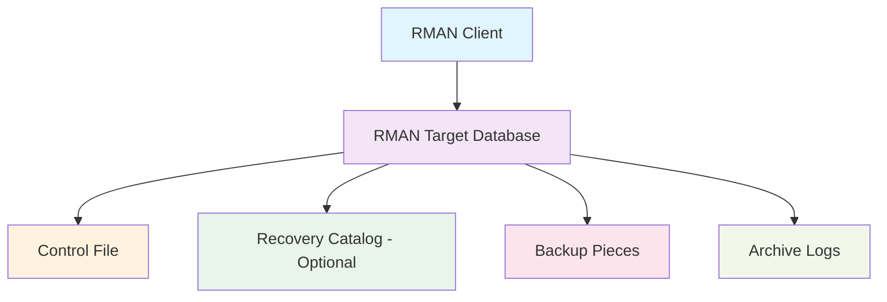

### Cách RMAN tương tác với các thành phần Oracle
Khi thực hiện backup, RMAN tương tác với nhiều thành phần của Oracle:
1. **Control File**: Lưu trữ metadata về backup
2. **Archive Logs**: Chứa các transaction đã committed
3. **Data Files**: File dữ liệu chính của database
4. **Recovery Catalog**: Lưu trữ thông tin backup trung tâm (tùy chọn)

### Các loại backup trong RMAN
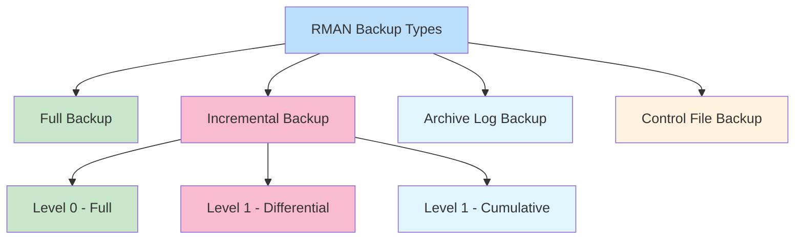

### Backup Strategies Comparison
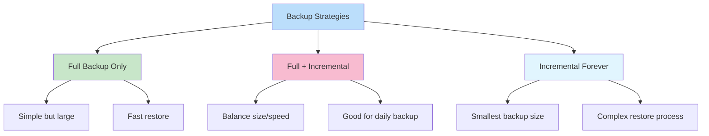

### Cơ chế hoạt động của RMAN
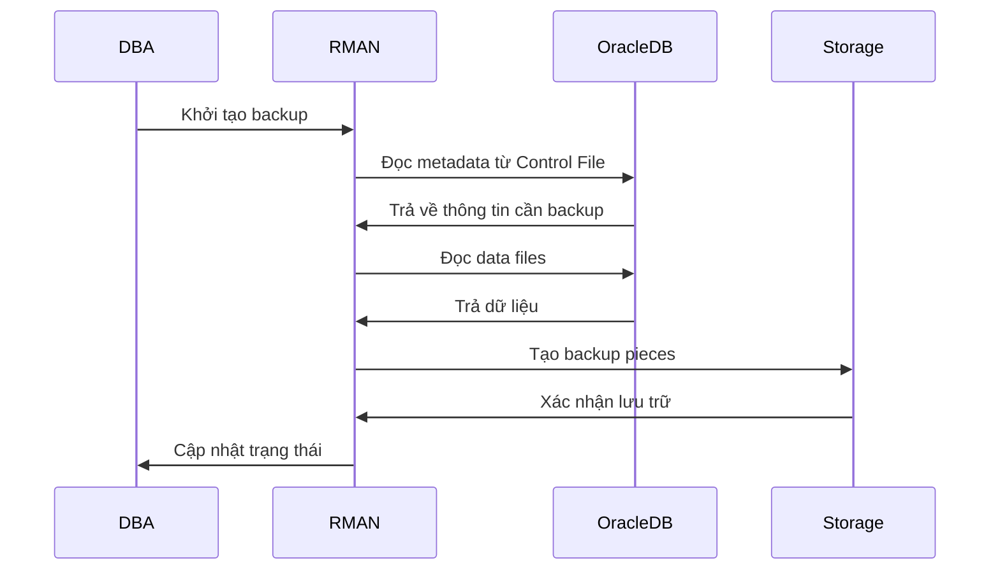

### Quy trình backup cơ bản
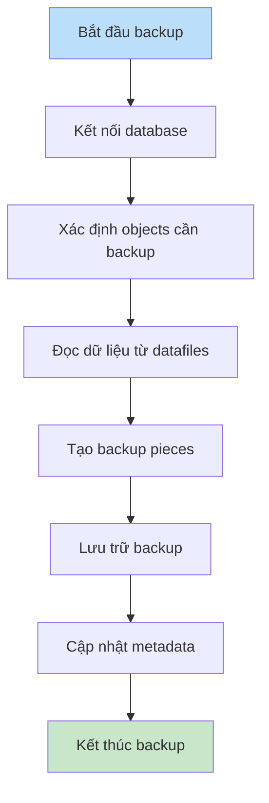

---

# 2) Truy vấn SQL xác nhận trạng thái backup

## 2.1. Trạng thái job RMAN 2 ngày gần nhất

```sql
-- Job RMAN (database/archivelog/controlfile) – tổng quan
SELECT inst_id,
       start_time, end_time,
       input_type, status, output_device_type,
       mbytes_processed, elapsed_seconds
FROM   gv$rman_backup_job_details
WHERE  start_time >= SYSDATE - 2
ORDER  BY start_time DESC;
```

* `STATUS` mong muốn: `COMPLETED`.
* `FAILED` hoặc `COMPLETED WITH WARNINGS` = cần xử lý.

### Lý thuyết: Hiểu về trạng thái backup jobs
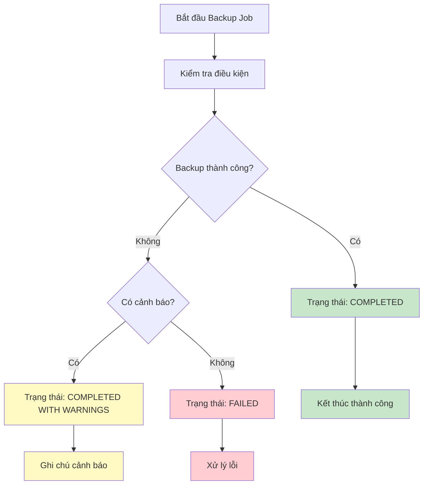

Các trạng thái backup job có thể gặp:
- `COMPLETED`: Backup hoàn tất thành công
- `COMPLETED WITH WARNINGS`: Backup thành công nhưng có cảnh báo
- `FAILED`: Backup thất bại hoàn toàn
- `RUNNING`: Backup đang chạy

### Quy trình kiểm tra backup job
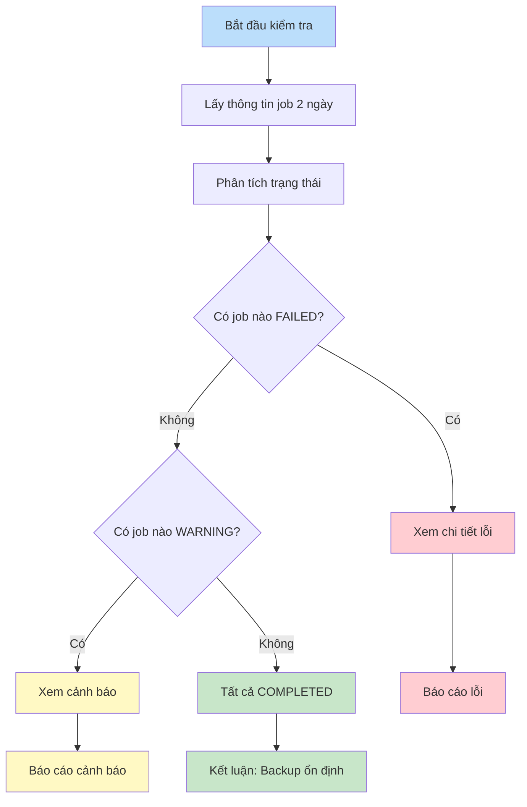

### Chi tiết về các trạng thái backup
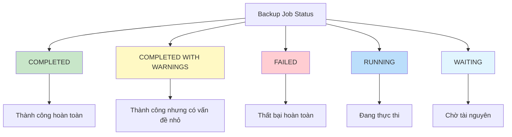

## 2.2. Nhật ký chi tiết thao tác RMAN

```sql
-- Log mức thao tác (BACKUP ARCHIVELOG, CONTROL FILE…)
SELECT inst_id,
       TO_CHAR(start_time,'YYYY-MM-DD HH24:MI:SS') AS start_time,
       TO_CHAR(end_time,'YYYY-MM-DD HH24:MI:SS')   AS end_time,
       operation, status, object_type, output_device_type
FROM   gv$rman_status
WHERE  start_time >= SYSDATE - 2
ORDER  BY recid DESC;
```

Tìm xem có dòng `BACKUP ARCHIVELOG` bị `FAILED/RUNNING WITH ERRORS` hay không.

### Lý thuyết: Quy trình backup chi tiết
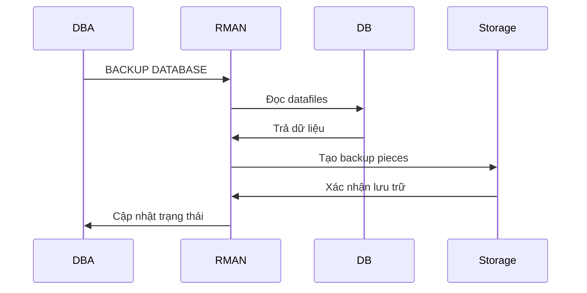

### Phân tích chi tiết backup operations
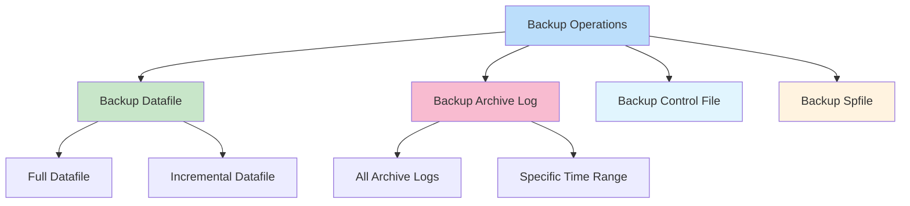

### Các bước trong quá trình backup
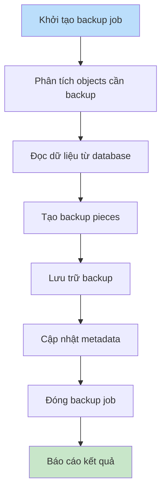

## 2.3. Các backup piece/set vừa tạo (tình trạng vật lý)

```sql
-- Piece phải ở trạng thái 'A' (Available)
SELECT p.inst_id, p.handle,
       p.start_time, p.completion_time,
       p.bytes/1024/1024 AS mb,
       p.status
FROM   gv$backup_piece p
WHERE  p.completion_time >= SYSDATE - 2
ORDER  BY p.completion_time DESC;
```

`STATUS`: `A`=Available, `D`=Deleted, `X`=Expired.

```sql
-- Backup set có kèm controlfile, incremental level...
SELECT bs.inst_id,
       bs.set_stamp, bs.set_count,
       bs.incremental_level, bs.controlfile_included,
       bs.completion_time
FROM   gv$backup_set bs
WHERE  bs.completion_time >= SYSDATE - 2
ORDER  BY bs.completion_time DESC;
```

### Lý thuyết: Backup Piece và Backup Set
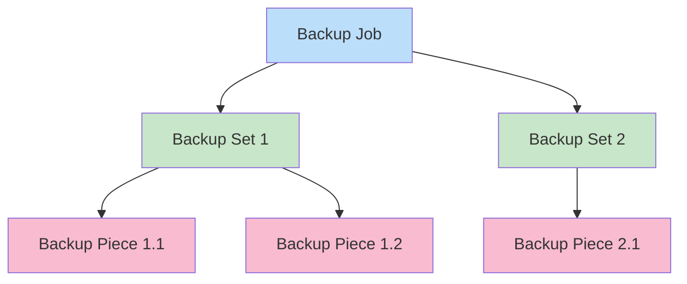

Backup Piece và Backup Set là hai khái niệm quan trọng:
- **Backup Set**: Là đơn vị logic chứa các backup data
- **Backup Piece**: Là file vật lý thực tế được tạo ra từ backup set

### Trạng thái của Backup Pieces
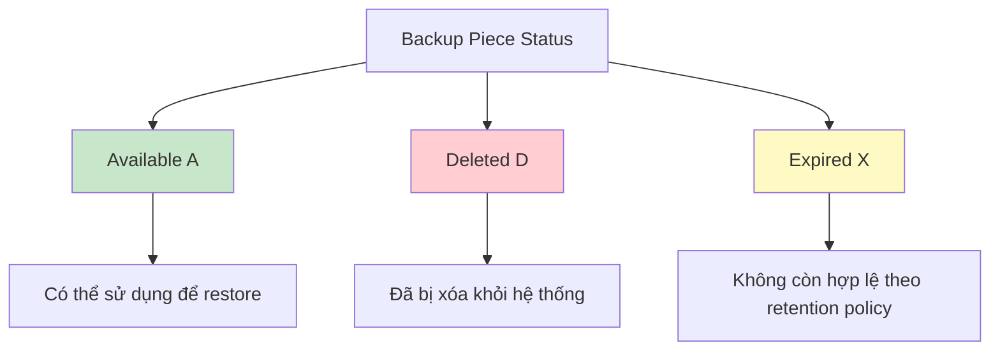

### Quy trình quản lý backup pieces
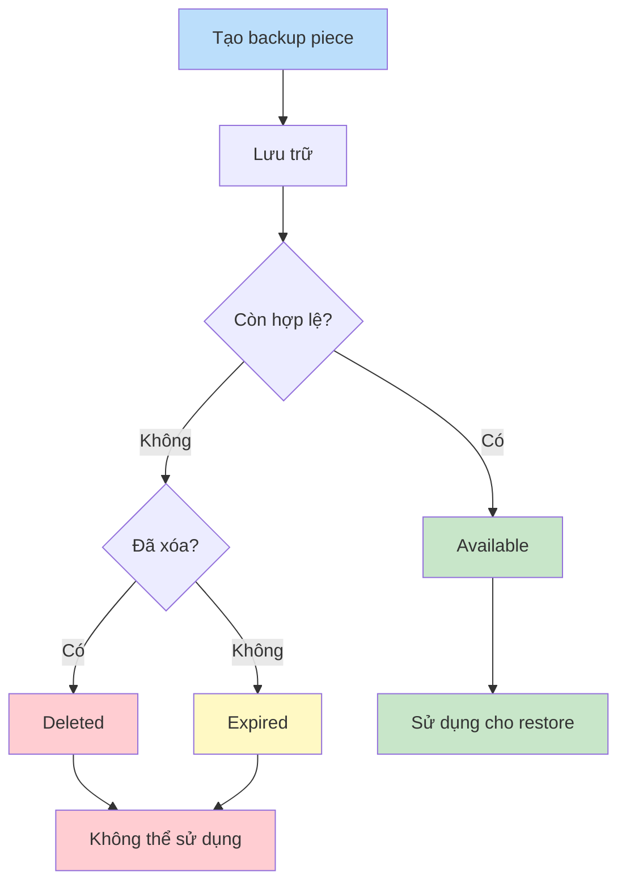

## 2.4. Bao phủ ARCHIVELOG (điểm thường gây fail)

```sql
-- Những archived log CHƯA hề được backup (backup_count = 0)
SELECT inst_id, thread#, sequence#, first_time, next_time, dest_id
FROM   gv$archived_log
WHERE  first_time >= SYSDATE - 2
AND    backup_count = 0
ORDER  BY thread#, sequence#;

-- Thống kê lần backup ARCHIVELOG gần nhất
SELECT MAX(completion_time) AS last_archivelog_backup
FROM   v$backup_redolog;
```

### Lý thuyết: Archive Logs và tầm quan trọng trong backup


Archive Logs chứa các transaction đã committed và là thành phần thiết yếu cho point-in-time recovery.

### Quy trình Archive Log trong RMAN
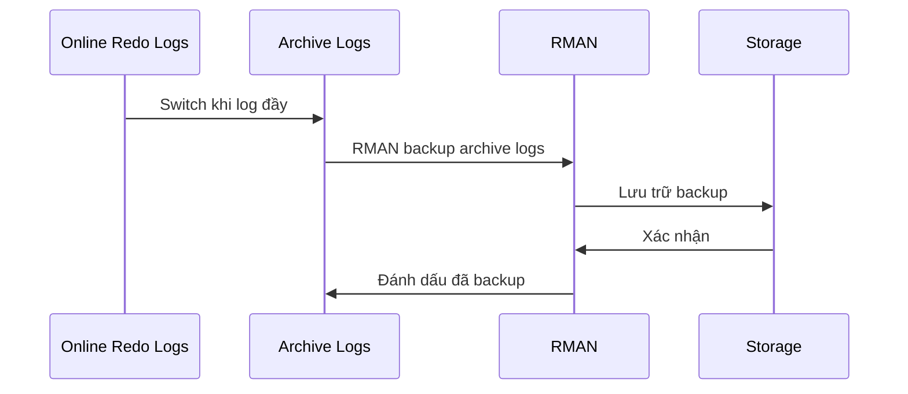

### Vòng đời của Archive Logs
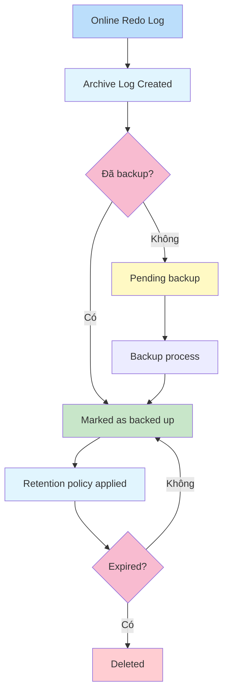

## 2.5. Kiểm tra nơi lưu ARCHIVELOG (shared hay local)

```sql
-- Xem cấu hình đích archive
SELECT dest_id, status, target, destination, binding, valid_now
FROM   v$archive_dest
WHERE  status = 'VALID';
```

Nếu là RAC, tốt nhất archive nên ở **ASM/FRA dùng chung** (ví dụ `+FRA/...`) hoặc một shared disk, để node chạy backup nhìn thấy đủ file.

> Nếu bạn dùng **Recovery Catalog**, có thể chạy tương tự trên các view `RC_`:

```sql
-- Khi có catalog
SELECT start_time, end_time, input_type, status
FROM   rc_rman_backup_job_details
WHERE  start_time >= SYSDATE - 2
ORDER  BY start_time DESC;
```

### Lý thuyết: RAC và Archive Logs trong môi trường chia sẻ
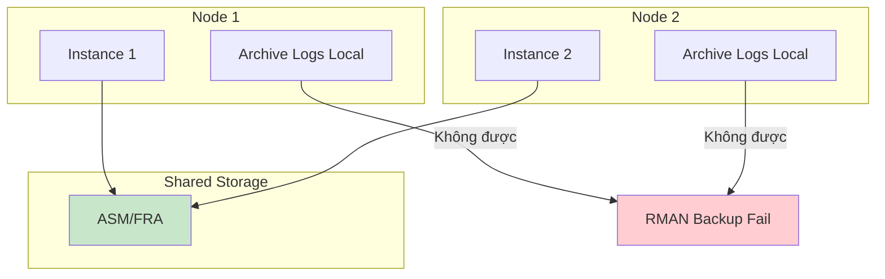

### Archive Log Storage Options
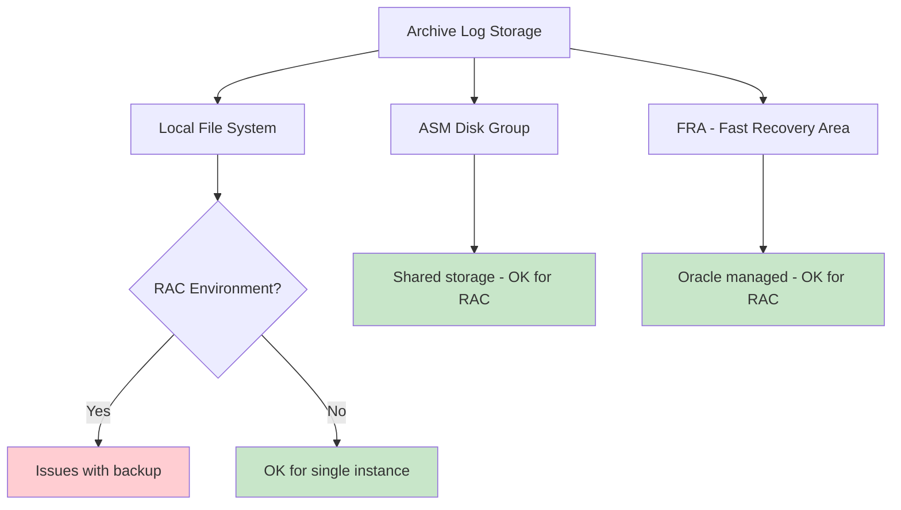

### So sánh các phương pháp lưu trữ Archive Logs
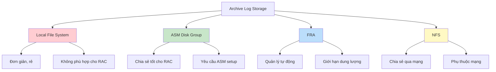

---

# 3) Kiểm tra nhanh bằng RMAN (không cần nhớ SQL)

Trong phiên `rman target /`:

```rman
LIST BACKUP SUMMARY COMPLETED BETWEEN "2025-09-16 19:30:00" AND "2025-09-16 21:00:00";
LIST BACKUP OF ARCHIVELOG FROM TIME "SYSDATE-1";
LIST BACKUP OF CONTROLFILE;
-- Nếu nghi ngờ dữ liệu catalog/controlfile lệch:
CROSSCHECK BACKUP;
REPORT OBSOLETE;
```

### Lý thuyết: Các lệnh RMAN cơ bản cho kiểm tra
```mermaid
graph TD
    A[RMAN Commands] --> B[List Commands]
    A --> C[Crosscheck Commands]
    A --> D[Report Commands]
    
    B --> E[LIST BACKUP]
    B --> F[LIST ARCHIVELOG]
    
    C --> G[CROSSCHECK BACKUP]
    C --> H[CROSSCHECK COPY]
    
    D --> I[REPORT OBSOLETE]
    D --> J[REPORT NEED BACKUP]
    
    style A fill:#bbdefb
    style B fill:#c8e6c9
    style C fill:#f8bbd0
    style D fill:#fff3e0
```

### Quy trình kiểm tra backup với RMAN
```mermaid
flowchart TD
    A[Mở RMAN session] --> B[List backup gần đây]
    B --> C[List archive log backup]
    C --> D[List control file backup]
    D --> E{Có backup cũ không hợp lệ?}
    E -->|Có| F[CROSSCHECK backup]
    E -->|Không| G[Kiểm tra hoàn tất]
    F --> H[REPORT OBSOLETE]
    H --> I[Xác định backup cần xóa]
    I --> G
    
    style A fill:#bbdefb
    style G fill:#c8e6c9
    style I fill:#fff9c4
```

### Các lệnh LIST trong RMAN
```mermaid
graph TD
    A[LIST Commands] --> B[LIST BACKUP]
    A --> C[LIST COPY]
    A --> D[LIST ARCHIVELOG]
    A --> E[LIST INCARNATION]
    
    B --> F[Thông tin backup sets]
    C --> G[Thông tin image copies]
    D --> H[Thông tin archive logs]
    E --> I[Thông tin database incarnations]
    
    style A fill:#bbdefb
    style B fill:#c8e6c9
    style C fill:#f8bbd0
    style D fill:#e1f5fe
    style E fill:#fff3e0
```

---

# 4) Vì sao NetBackup báo status 6 & cách xử lý nhanh

**Triệu chứng trong log:**

* `dbclient ... status: 6` và `the backup failed to back up the requested files`.
* Kịch bản backup có đoạn **`BACKUP ARCHIVELOG ALL DELETE INPUT`** sau database backup.

**Lý do thường gặp (đặc biệt khi RAC/ASM):**

1. **ARCHIVELOG không ở shared disk** hoặc node backup không thấy được file → RMAN báo "expected archived log not found…", NetBackup nhận lỗi status 6.
2. File archive vừa bị di chuyển/xóa bởi tác vụ khác → thiếu file lúc RMAN gom `ALL`.
3. Quyền hệ thống không đủ để **xóa** file khi `DELETE INPUT` (nếu backup thành công nhưng xóa lỗi thường ra "COMPLETED WITH WARNINGS", tuy nhiên một số trường hợp kịch bản vẫn fail toàn job).
4. Lựa chọn `FILESPERSET 10` trên storage dedupe làm luồng gom file "thô" lớn; Veritas khuyến nghị **`FILESPERSET 1`** để tối ưu dedupe & đôi khi tránh timeout gom file.

### Lý thuyết: Quy trình backup với NetBackup
```mermaid
sequenceDiagram
    participant DBA
    participant Oracle
    participant RMAN
    participant SBT
    participant NetBackup
    
    DBA->>Oracle: BACKUP DATABASE
    Oracle->>RMAN: Khởi tạo backup job
    RMAN->>SBT: Mở SBT channel
    SBT->>NetBackup: Gửi backup data
    NetBackup->>SBT: Trả kết quả
    SBT->>RMAN: Cập nhật trạng thái
    RMAN->>Oracle: Hoàn tất backup
    Oracle->>DBA: Ghi log kết quả
```

### Phân tích nguyên nhân NetBackup status 6
```mermaid
graph TD
    A[NetBackup Status 6] --> B[Archive Log Issues]
    A --> C[Permission Issues]
    A --> D[Dedup Configuration]
    A --> E[Network Issues]
    
    B --> F[Archive not shared]
    B --> G[Archive deleted]
    B --> H[Archive inaccessible]
    
    C --> I[Insufficient OS permissions]
    C --> J[RMAN agent permissions]
    
    D --> K[FILESPERSET too high]
    D --> L[Dedup timeout]
    
    style A fill:#ffcdd2
    style B fill:#fff9c4
    style C fill:#fff9c4
    style D fill:#fff9c4
    style E fill:#fff9c4
```

**Cách khoanh vùng/sửa nhanh:**

* Tạm **bỏ `DELETE INPUT`** để xác minh bước backup có pass:

  ```rman
  BACKUP AS COMPRESSED BACKUPSET ARCHIVELOG ALL;  -- bỏ DELETE INPUT
  ```
* Hoặc chỉ backup **NOT BACKED UP** và **SKIP INACCESSIBLE**:

  ```rman
  BACKUP AS COMPRESSED BACKUPSET ARCHIVELOG
    NOT BACKED UP 1 TIMES
    SKIP INACCESSIBLE
    DELETE INPUT;  -- thêm lại sau khi xác minh
  ```
* Với dedupe STU: đặt **`FILESPERSET 1`**:

  ```rman
  CONFIGURE DEVICE TYPE SBT PARALLELISM 4;
  BACKUP INCREMENTAL LEVEL 0
    FILESPERSET 1
    AS COMPRESSED BACKUPSET DATABASE;
  ```
* Đảm bảo ARCHIVELOG nằm ở **ASM/FRA shared** (ví dụ `+FRA`) hoặc chạy job luôn trên node tạo ra archive đó.
* Kiểm tra quyền user OS của RMAN/NetBackup agent với thư mục archive.

### Quy trình xử lý NetBackup status 6
```mermaid
flowchart TD
    A[Phát hiện status 6] --> B[Kiểm tra log chi tiết]
    B --> C[Xác định nguyên nhân]
    C --> D{Vấn đề Archive Log?}
    D -->|Có| E[Kiểm tra vị trí archive]
    E --> F{Archive ở shared storage?}
    F -->|Không| G[Chuyển archive sang shared]
    F -->|Có| H{Có permission?}
    H -->|Không| I[Cấp permission]
    H -->|Có| J[Kiểm tra khác]
    
    D -->|Không| K{Vấn đề permission?}
    K -->|Có| I
    K -->|Không| L{Vấn đề dedup?}
    L -->|Có| M[Điều chỉnh FILESPERSET]
    L -->|Không| N[Liên hệ support]
    
    style A fill:#ffcdd2
    style G fill:#fff9c4
    style I fill:#fff9c4
    style M fill:#fff9c4
    style N fill:#bbdefb
```

### Các bước khắc phục NetBackup status 6
```mermaid
flowchart TD
    A[Phát hiện lỗi] --> B[Phân tích log]
    B --> C[Xác định nguyên nhân chính]
    C --> D{Lỗi Archive Log?}
    D -->|Có| E[Kiểm tra vị trí lưu trữ]
    E --> F[Đảm bảo shared storage]
    F --> G[Cập nhật cấu hình]
    D -->|Không| H{Lỗi permission?}
    H -->|Có| I[Kiểm tra quyền hệ thống]
    I --> J[Cấp quyền cần thiết]
    H -->|Không| K{Lỗi cấu hình?}
    K -->|Có| L[Điều chỉnh FILESPERSET]
    L --> M[Cập nhật cấu hình RMAN]
    K -->|Không| N[Liên hệ support]
    
    style A fill:#ffcdd2
    style G fill:#c8e6c9
    style J fill:#c8e6c9
    style M fill:#c8e6c9
    style N fill:#bbdefb
```

---

# 5) Lý thuyết ngắn gọn cho người mới

* **RMAN job "thành công"** khi:

  1. `GV$RMAN_BACKUP_JOB_DETAILS.STATUS = 'COMPLETED'`.
  2. Các **backup piece** tương ứng ở `GV$BACKUP_PIECE.STATUS = 'A'`.
  3. Với ARCHIVELOG: `GV$ARCHIVED_LOG.BACKUP_COUNT > 0` cho các sequence mới sinh.
* **NetBackup status 6** chỉ là "vỏ" báo RMAN trả lỗi — muốn biết "lỗi gì" phải xem **RMAN status/alert log** (thư mục `bphdb/dbclient` của NetBackup và alert log Oracle).
* `DELETE INPUT` sẽ **xóa file archive local** sau khi backup **thành công**. Trong RAC, **archivelog phải ở chỗ mọi node truy cập được**.

### Lý thuyết: Quy trình xác minh backup thành công
```mermaid
flowchart TD
    A[Bắt đầu kiểm tra backup] --> B[Kiểm tra trạng thái job]
    B --> C{Status = COMPLETED?}
    C -->|Có| D[Kiểm tra backup pieces]
    C -->|Không| E[Xử lý lỗi]
    D --> F{Pieces = AVAILABLE?}
    F -->|Có| G[Kiểm tra archive logs]
    F -->|Không| H[Xử lý lỗi pieces]
    G --> I{Archive backed up?}
    I -->|Có| J[Backup thành công]
    I -->|Không| K[Xử lý archive logs]
    
    style J fill:#c8e6c9
    style E fill:#ffcdd2
    style H fill:#ffcdd2
    style K fill:#ffcdd2
```

### Backup Verification Checklist
```mermaid
graph TD
    A[Backup Verification] --> B[Job Status]
    A --> C[Backup Pieces]
    A --> D[Archive Logs]
    A --> E[Control Files]
    
    B --> F[COMPLETED]
    C --> G[AVAILABLE]
    D --> H[BACKUP_COUNT > 0]
    E --> I[Backed up recently]
    
    style F fill:#c8e6c9
    style G fill:#c8e6c9
    style H fill:#c8e6c9
    style I fill:#c8e6c9
```

### Các bước kiểm tra backup cơ bản
```mermaid
flowchart TD
    A[Bắt đầu kiểm tra] --> B[Kiểm tra job status]
    B --> C[Kiểm tra backup pieces]
    C --> D[Kiểm tra archive logs]
    D --> E{Có vấn đề?}
    E -->|Có| F[Xử lý ngay]
    E -->|Không| G[Báo cáo OK]
    
    style A fill:#bbdefb
    style F fill:#ffcdd2
    style G fill:#c8e6c9
```

---

# 6) Sơ đồ mermaid – luồng backup Oracle → NetBackup (dedupe)

```mermaid
sequenceDiagram
    autonumber
    participant DBA as DBA/RMAN
    participant ORA as Oracle DB (bcqg1)
    participant SBT as Channel SBT_TAPE (libobk.so64)
    participant NBU as NetBackup Client (bphdb/bpbrm)
    participant MED as Media Server (bptm)
    participant STG as Storage Server (PureDisk/WORM02-POOL)

    DBA->>ORA: RUN { BACKUP DATABASE; BACKUP ARCHIVELOG ... }
    ORA->>SBT: Gọi channel TYPE 'SBT_TAPE'
    SBT->>NBU: Gọi libobk.so64 (NetBackup for Oracle)
    NBU->>MED: Khởi tạo job, cấp tài nguyên STU (WORM02-STU)
    MED->>STG: Ghi backup piece vào Dedup Pool (PureDiskVolume)
    STG-->>MED: Trả kết quả ghi (dedupe/compress)
    MED-->>NBU: Hoàn tất ghi / mã hóa in-transit
    NBU-->>SBT: Trả mã trạng thái
    SBT-->>ORA: RMAN nhận trạng thái (COMPLETED/FAILED)
    ORA-->>DBA: Cập nhật view V$RMAN_* và V$BACKUP_*
```

### Backup Process Flow
```mermaid
flowchart TD
    A[Start Backup] --> B[Initialize RMAN]
    B --> C[Connect to Target]
    C --> D[Allocate Channels]
    D --> E[Backup Database]
    E --> F[Backup Archive Logs]
    F --> G[Backup Control File]
    G --> H[Release Channels]
    H --> I[Update Catalog]
    I --> J[End Backup]
    
    style A fill:#bbdefb
    style J fill:#c8e6c9
```

### Quy trình backup với SBT Tape
```mermaid
sequenceDiagram
    participant RMAN
    participant SBT
    participant MediaServer
    participant Storage
    
    RMAN->>SBT: Allocate channel
    SBT->>MediaServer: Request resources
    MediaServer->>Storage: Prepare storage
    RMAN->>SBT: Send backup data
    SBT->>MediaServer: Transfer data
    MediaServer->>Storage: Write data
    Storage->>MediaServer: Confirm write
    MediaServer->>SBT: Return status
    SBT->>RMAN: Update status
```

---

## Mẹo kiểm tra "nhanh – gọn – chuẩn"

* **1 lệnh xác nhận gần nhất**:

```sql
SELECT status, input_type, start_time, end_time
FROM   v$rman_backup_job_details
WHERE  start_time = (SELECT MAX(start_time) FROM v$rman_backup_job_details);
```

* **Danh sách ARCHIVELOG chưa được backup** (dễ gây fail):

```sql
SELECT thread#, sequence#, first_time
FROM   gv$archived_log
WHERE  backup_count = 0
ORDER  BY thread#, sequence#;
```

### Quick Verification Process
```mermaid
flowchart TD
    A[Bắt đầu kiểm tra] --> B[Check job status]
    B --> C[Check backup pieces]
    C --> D[Check archive logs]
    D --> E{Có vấn đề?}
    E -->|Có| F[Xử lý ngay]
    E -->|Không| G[Báo cáo OK]
    
    style A fill:#bbdefb
    style F fill:#ffcdd2
    style G fill:#c8e6c9
```

### Các bước kiểm tra nhanh backup
```mermaid
flowchart TD
    A[Mở SQL/RMAN] --> B[Chạy query job status]
    B --> C[Chạy query backup pieces]
    C --> D[Chạy query archive logs]
    D --> E{Có lỗi?}
    E -->|Có| F[Xem chi tiết log]
    E -->|Không| G[Báo cáo thành công]
    F --> H[Xử lý lỗi]
    H --> I[Cập nhật kết quả]
    G --> I
    
    style A fill:#bbdefb
    style G fill:#c8e6c9
    style F fill:#fff9c4
    style H fill:#ffcdd2
    style I fill:#bbdefb
```

---

# 7) Hướng dẫn chi tiết cho người mới bắt đầu

## Bắt đầu với RMAN
### Chuẩn bị trước khi backup
```mermaid
graph TD
    A[Chuẩn bị backup] --> B[Kiểm tra môi trường]
    A --> C[Kiểm tra cấu hình]
    A --> D[Kiểm tra quyền]
    
    B --> E[ORACLE_HOME]
    B --> F[ORACLE_SID]
    B --> G[Environment variables]
    
    C --> H[Retention policy]
    C --> I[Backup destination]
    C --> J[Compression settings]
    
    D --> K[SYSDBA privileges]
    D --> L[OS permissions]
    
    style A fill:#bbdefb
    style B fill:#c8e6c9
    style C fill:#f8bbd0
    style D fill:#e1f5fe
```

### Các bước backup cơ bản
```mermaid
flowchart TD
    A[Bắt đầu backup] --> B[Mở RMAN session]
    B --> C[Kiểm tra cấu hình]
    C --> D{Cấu hình OK?}
    D -->|Không| E[Sửa cấu hình]
    D -->|Có| F[Chọn loại backup]
    E --> C
    F --> G[Thực hiện backup]
    G --> H[Xác minh backup]
    H --> I[Kết thúc]
    
    style A fill:#bbdefb
    style I fill:#c8e6c9
    style E fill:#fff9c4
```

## Hiểu về các view trong RMAN
### Các view quan trọng để kiểm tra backup
```mermaid
graph TD
    A[RMAN Views] --> B[V$RMAN_BACKUP_JOB_DETAILS]
    A --> C[V$BACKUP_PIECE]
    A --> D[V$BACKUP_SET]
    A --> E[V$ARCHIVED_LOG]
    A --> F[V$BACKUP_REDOLOG]
    
    B --> G[Thông tin job backup]
    C --> H[Thông tin backup piece]
    D --> I[Thông tin backup set]
    E --> J[Thông tin archive log]
    F --> K[Thông tin backup redo]
    
    style A fill:#bbdefb
    style B fill:#c8e6c9
    style C fill:#f8bbd0
    style D fill:#e1f5fe
    style E fill:#fff3e0
    style F fill:#fce4ec
```

### Mối quan hệ giữa các view
```mermaid
graph TD
    A[V$RMAN_BACKUP_JOB_DETAILS] --> B[V$BACKUP_SET]
    B --> C[V$BACKUP_PIECE]
    A --> D[V$ARCHIVED_LOG]
    D --> E[V$BACKUP_REDOLOG]
    
    style A fill:#bbdefb
    style B fill:#c8e6c9
    style C fill:#f8bbd0
    style D fill:#e1f5fe
    style E fill:#fff3e0
```

### Sơ đồ quan hệ giữa các thành phần backup
```mermaid
graph TD
    A[Backup Job] --> B[Backup Sets]
    A --> C[Archive Logs]
    B --> D[Backup Pieces]
    C --> E[Backup Redo Logs]
    
    style A fill:#bbdefb
    style B fill:#c8e6c9
    style C fill:#f8bbd0
    style D fill:#e1f5fe
    style E fill:#fff3e0
```

## Các lỗi thường gặp và cách khắc phục
### Lỗi backup phổ biến
```mermaid
graph TD
    A[Backup Errors] --> B[Job FAILED]
    A --> C[Job WARNING]
    A --> D[Archive Log Issues]
    A --> E[Permission Issues]
    
    B --> F[Configuration error]
    B --> G[Storage full]
    B --> H[Network issues]
    
    C --> I[Non-critical issues]
    C --> J[Cleanup warnings]
    
    D --> K[Archive not shared]
    D --> L[Archive deleted]
    
    E --> M[OS permissions]
    E --> N[RMAN permissions]
    
    style A fill:#bbdefb
    style B fill:#ffcdd2
    style C fill:#fff9c4
    style D fill:#fff9c4
    style E fill:#fff9c4
```

### Quy trình xử lý lỗi backup
```mermaid
flowchart TD
    A[Phát hiện lỗi backup] --> B[Xác định loại lỗi]
    B --> C{Lỗi nghiêm trọng?}
    C -->|Có| D[Dừng backup]
    C -->|Không| E[Tiếp tục backup]
    D --> F[Ghi log chi tiết]
    F --> G[Thông báo cho DBA]
    G --> H[Phân tích nguyên nhân]
    H --> I[Áp dụng khắc phục]
    I --> J[Thử lại backup]
    E --> K[Theo dõi cảnh báo]
    K --> L[Backup hoàn tất]
    
    style A fill:#ffcdd2
    style D fill:#ffcdd2
    style E fill:#c8e6c9
    style L fill:#c8e6c9
    style J fill:#bbdefb
```

### Các bước xử lý lỗi backup
```mermaid
flowchart TD
    A[Phát hiện lỗi] --> B[Ghi nhận lỗi]
    B --> C[Phân loại lỗi]
    C --> D[Tra cứu tài liệu]
    D --> E[Thực hiện khắc phục]
    E --> F[Kiểm tra lại]
    F --> G{Vẫn lỗi?}
    G -->|Có| H[Lặp lại bước E]
    G -->|Không| I[Báo cáo thành công]
    I --> J[Cập nhật tài liệu]
    
    style A fill:#ffcdd2
    style E fill:#bbdefb
    style F fill:#e1f5fe
    style I fill:#c8e6c9
    style J fill:#c8e6c9
```

---

# 8) Tóm tắt quy trình kiểm tra backup hoàn chỉnh

## Tổng quan quy trình kiểm tra
```mermaid
flowchart TD
    A[Bắt đầu kiểm tra backup] --> B[Kết nối SQL/RMAN]
    B --> C[Kiểm tra job status]
    C --> D[Kiểm tra backup pieces]
    D --> E[Kiểm tra archive logs]
    E --> F[Kiểm tra bằng RMAN commands]
    F --> G{Có vấn đề?}
    G -->|Có| H[Xử lý ngay]
    G -->|Không| I[Báo cáo OK]
    H --> J[Phân tích nguyên nhân]
    J --> K[Áp dụng giải pháp]
    K --> L[Cập nhật báo cáo]
    I --> L
    
    style A fill:#bbdefb
    style I fill:#c8e6c9
    style H fill:#fff9c4
    style L fill:#bbdefb
```

## Checklist kiểm tra backup hàng ngày
```mermaid
graph TD
    A[Daily Backup Checklist] --> B[1. Kiểm tra job status]
    A --> C[2. Kiểm tra backup pieces]
    A --> D[3. Kiểm tra archive logs]
    A --> E[4. Kiểm tra storage]
    A --> F[5. Kiểm tra alert log]
    A --> G[6. Kiểm tra retention policy]
    A --> H[7. Ghi log kết quả]
    
    B --> I[Query GV$RMAN_BACKUP_JOB_DETAILS]
    C --> J[Query GV$BACKUP_PIECE]
    D --> K[Query GV$ARCHIVED_LOG]
    E --> L[Kiểm tra dung lượng]
    F --> M[Xem alert log]
    G --> N[REPORT OBSOLETE]
    H --> O[Cập nhật documentation]
    
    style A fill:#bbdefb
    style I fill:#c8e6c9
    style J fill:#c8e6c9
    style K fill:#c8e6c9
    style L fill:#c8e6c9
    style M fill:#c8e6c9
    style N fill:#c8e6c9
    style O fill:#c8e6c9
```

## Quy trình xử lý sự cố backup
```mermaid
flowchart TD
    A[Phát hiện sự cố backup] --> B[Ghi nhận sự cố]
    B --> C[Phân loại sự cố]
    C --> D{Lỗi nghiêm trọng?}
    D -->|Có| E[Thông báo ngay]
    D -->|Không| F[Theo dõi]
    E --> G[Phân tích nguyên nhân]
    F --> H[Theo dõi định kỳ]
    G --> I[Xác định root cause]
    I --> J[Lên kế hoạch khắc phục]
    J --> K[Thực hiện khắc phục]
    K --> L[Xác minh khắc phục]
    L --> M[Cập nhật documentation]
    H --> N{Vẫn có vấn đề?}
    N -->|Có| G
    N -->|Không| O[Kết thúc]
    
    style A fill:#ffcdd2
    style E fill:#ffcdd2
    style G fill:#fff9c4
    style K fill:#bbdefb
    style L fill:#c8e6c9
    style O fill:#c8e6c9
```

## Best Practices cho kiểm tra backup
1. **Luôn kiểm tra trạng thái job đầu tiên** - Đây là chỉ số tổng quan nhất
2. **Kiểm tra backup pieces** - Đảm bảo file vật lý tồn tại và hợp lệ
3. **Kiểm tra archive logs** - Đảm bảo không có log nào chưa được backup
4. **Sử dụng RMAN commands** - LIST, CROSSCHECK, REPORT để kiểm tra chi tiết
5. **Theo dõi alert log** - Tìm các cảnh báo hoặc lỗi không hiển thị trong view
6. **Kiểm tra storage** - Đảm bảo đủ dung lượng cho backup
7. **Xác minh retention policy** - Đảm bảo backup cũ được xóa đúng lịch
8. **Ghi log kết quả** - Tạo documentation cho các lần kiểm tra

### Quy trình kiểm tra backup hàng ngày
```mermaid
flowchart TD
    A[Bắt đầu kiểm tra] --> B[Kết nối hệ thống]
    B --> C[Kiểm tra trạng thái job]
    C --> D[Kiểm tra backup pieces]
    D --> E[Kiểm tra archive logs]
    E --> F[Kiểm tra bằng RMAN]
    F --> G{Có vấn đề?}
    G -->|Có| H[Xử lý ngay lập tức]
    G -->|Không| I[Ghi log kết quả]
    H --> J[Thông báo cho team]
    J --> K[Theo dõi xử lý]
    K --> L[Cập nhật kết quả]
    I --> M[Kết thúc]
    L --> M
    
    style A fill:#bbdefb
    style H fill:#ffcdd2
    style I fill:#c8e6c9
    style M fill:#c8e6c9
```

---

Nếu bạn muốn, mình có thể soạn nhanh **một script SQL/RMAN hoàn chỉnh** cho môi trường bcqg\* (đã tối ưu FILESPERSET cho dedupe, thêm `SKIP INACCESSIBLE`) để bạn dán chạy và đối chiếu.
---

## 2.3. Kiến thức nền tảng cho người mới bắt đầu

### ARCHIVELOG vs NOARCHIVELOG (vì sao quan trọng?)
- ARCHIVELOG: Cho phép backup khi DB đang chạy và phục hồi tới thời điểm. Phù hợp hệ thống production.
- NOARCHIVELOG: Chỉ backup khi DB shutdown hoặc offline tablespace; không phục hồi tới thời điểm. Chỉ phù hợp môi trường test/dev.

`mermaid
graph TD
    A[Chế độ DB] --> B[ARCHIVELOG]
    A --> C[NOARCHIVELOG]
    B --> D[Backup online]
    B --> E[Point-in-time recovery]
    C --> F[Backup khi offline]
    C --> G[Không PITR]
    style B fill:#c8e6c9
    style C fill:#ffcdd2
`

### FRA - Fast Recovery Area (nên bật)
- Lưu trữ tự động: archive logs, backups, flashback logs, controlfile autobackup.
- Giới hạn bởi DB_RECOVERY_FILE_DEST_SIZE; cần giám sát tránh đầy.

`mermaid
graph LR
    FRA[(FRA)] --> A[Archive Logs]
    FRA --> B[Backup Pieces]
    FRA --> C[Flashback Logs]
    FRA --> D[Controlfile Autobackup]
    style FRA fill:#e3f2fd
`

### Chính sách giữ lại (Retention Policy)
- Recovery Window: ví dụ 7 ngày -> đảm bảo có thể phục hồi tới mọi thời điểm trong 7 ngày qua.
- Redundancy: giữ N bản backup đầy đủ mới nhất.

`mermaid
flowchart TD
    A[Đặt retention] --> B{Window hay Redundancy?}
    B -->|Window| C[RECOVERY WINDOW OF n DAYS]
    B -->|Redundancy| D[REDUNDANCY n]
    C --> E[RMAN tự đánh dấu obsolete]
    D --> E
    E --> F[DELETE OBSOLETE]
`

### Incremental Level 0/1 và Block Change Tracking (BCT)
- Level 0: nền tảng (giống full cho incremental).
- Level 1: chỉ phần thay đổi từ Level 0 gần nhất.
- BCT: tăng tốc incremental bằng file theo dõi block thay đổi (DB_CREATE_FILE_DEST/DB_RECOVERY_FILE_DEST).

`mermaid
sequenceDiagram
    participant DB as Oracle DB
    participant BCT as Block Change Tracking
    participant RM as RMAN
    DB->>BCT: Ghi lại block thay đổi
    RM->>BCT: Hỏi danh sách block thay đổi
    BCT-->>RM: Trả về map block
    RM->>DB: Đọc các block cần
`

### Đích backup: Disk vs SBT (Tape)
- Disk: nhanh, dễ kiểm tra/khôi phục; phù hợp hàng ngày.
- SBT/Tape: lưu lâu dài, offsite; thường dùng cho weekly/monthly.

`mermaid
graph LR
    RMAN-->|Disk Channel| D[(Disk)]
    RMAN-->|SBT Channel| T[(Tape/Cloud Gateway)]
    D --> R[Phục hồi nhanh]
    T --> A[Lưu trữ dài hạn]
`

---

## 3) Quy trình restore/recover ở mức cao

`mermaid
flowchart TD
    A[Sự cố] --> B[Xác định phạm vi]
    B --> C{Mất gì?}
    C -->|Datafile| D[RESTORE DATAFILE]
    C -->|Controlfile| E[RESTORE CONTROLFILE]
    C -->|Spfile| F[RESTORE SPFILE]
    D --> G[RECOVER DATAFILE]
    E --> H[MOUNT DB]
    H --> I[CATALOG/STARTUP NOMOUNT]
    G --> J[OPEN RESETLOGS]
    I --> D
`

Ví dụ lệnh căn bản:
`
man
RUN {
  ALLOCATE CHANNEL c1 DEVICE TYPE DISK;
  RESTORE DATABASE;
  RECOVER DATABASE;
  ALTER DATABASE OPEN RESETLOGS;
}
`

Kiểm tra tính toàn vẹn backup (khuyến nghị chạy định kỳ):
`
man
VALIDATE BACKUPSET ALL;
VALIDATE DATABASE;
`

---

## 4) Lịch backup tham khảo cho người mới

`mermaid
gantt
    dateFormat  YYYY-MM-DD
    title Lịch backup tham khảo
    section Hàng tuần
    Full Level 0 : done, des1, 2025-01-05, 1d
    section Hàng ngày
    Incremental L1 : active, des2, 2025-01-06, 6d
    Archive Logs : des3, 2025-01-05, 7d
`

- Chủ nhật: Level 0 (nền tảng)
- Thứ 2-7: Level 1 + backup archivelog mỗi 1-2 giờ (tùy RPO)

---

## 5) Theo dõi và KPI cơ bản

`mermaid
graph TD
    A[KPI Backup] --> B[Tỉ lệ thành công]
    A --> C[Thời gian chạy]
    A --> D[Kích thước backup]
    A --> E[Thời gian phục hồi thử]
    A --> F[Mức sử dụng FRA]
    style A fill:#e3f2fd
`

SQL nhanh kiểm tra FRA và archive log:
`sql
SELECT name, space_limit/1024/1024 AS mb_limit,
       space_used/1024/1024  AS mb_used,
       (space_used/space_limit)*100 AS pct
FROM   v;

SELECT COUNT(*) AS arch_not_backed
FROM   v
WHERE  deleted = 'NO' AND BACKED_UP = 'NO';
`

---

## 6) Cheat sheet RMAN cho người mới

`
man
-- Cấu hình cơ bản
CONFIGURE RETENTION POLICY TO RECOVERY WINDOW OF 7 DAYS;
CONFIGURE CONTROLFILE AUTOBACKUP ON;
CONFIGURE DEVICE TYPE DISK PARALLELISM 2;

-- Backup đầy đủ + archivelog
BACKUP AS COMPRESSED BACKUPSET DATABASE PLUS ARCHIVELOG;

-- Incremental và BCT (nếu đã bật BCT)
BACKUP INCREMENTAL LEVEL 0 DATABASE;
BACKUP INCREMENTAL LEVEL 1 DATABASE;

-- Kiểm tra/validate
VALIDATE BACKUPSET ALL;
LIST FAILURE;

-- Xoá theo chính sách
DELETE NOPROMPT OBSOLETE;
`

`mermaid
flowchart LR
    A[Start] --> B[Cấu hình]
    B --> C[Thực hiện backup]
    C --> D[Giám sát/KPI]
    D --> E[Validate định kỳ]
    E --> F[Xoá obsolete]
    F --> C
    style B fill:#e8f5e9
    style C fill:#e3f2fd
    style E fill:#fff8e1
`

---

## 7) Lưu ý môi trường RAC/Multitenant (CDB/PDB)
- RAC: xem GV$ thay vì V$; lưu ý channel song song theo instance.
- Multitenant: khi kiểm tra trạng thái, cần phân biệt CDB vs từng PDB.

`mermaid
graph TD
    A[CDB] --> B[PDB1]
    A --> C[PDB2]
    A --> D[PDBn]
    style A fill:#ede7f6
    style B fill:#e8f5e9
    style C fill:#e8f5e9
    style D fill:#e8f5e9
`

Truy vấn gợi ý:
`sql
-- Trong CDB để bao quát toàn hệ thống
SELECT con_id, start_time, end_time, input_type, status
FROM   v
WHERE  start_time >= SYSDATE - 2
ORDER  BY start_time DESC;
`

---

## 8) Sơ đồ xử lý sự cố backup cho người mới

`mermaid
flowchart TD
    A[Backup FAIL/WARNING] --> B[Đọc v]
    B --> C{Lỗi tài nguyên? FRA đầy?}
    C -->|Có| D[Tăng FRA/Xoá obsolete]
    C -->|Không| E{Lỗi kênh SBT?}
    E -->|Có| F[Kiểm tra media manager]
    E -->|Không| G[Xem alert log/trace]
    D --> H[Chạy lại job]
    F --> H
    G --> H
    H --> I[Theo dõi kết quả]
`

Mẹo: luôn chạy thử restore/validate định kỳ để tự tin RTO/RPO.

