# Phụ Lục: Bổ Sung Cho Người Mới (Theo Từng Bước)

Mục này tổng hợp lý thuyết, sơ đồ Mermaid và gợi ý thao tác dành cho người mới bắt đầu, bám theo từng bước trong `DB/test_backup.md`.

Lưu ý khi xem sơ đồ Mermaid:
- flowchart/graph: theo luồng quyết định; sequence: theo thứ tự trao đổi giữa thành phần.
- Màu xanh lá = OK, vàng = cảnh báo, đỏ = lỗi/cần xử lý.

## Bước 1) Kết nối SQLPlus/RMAN

Mục tiêu: nắm vững biến môi trường Oracle (ORACLE_HOME/ORACLE_SID), quyền SYSDBA, và khác biệt V$ vs GV$ khi RAC.

Khái niệm nhanh:
- V$ = view cho một instance; GV$ = Global View gom thông tin tất cả instance (RAC).
- CDB/PDB: khi chạy câu lệnh kiểm tra, hãy đảm bảo ở CDB$ROOT để có cấu hình toàn cục.

Sơ đồ kết nối cơ bản:
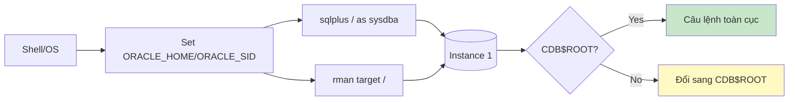

V$ vs GV$ trong RAC:
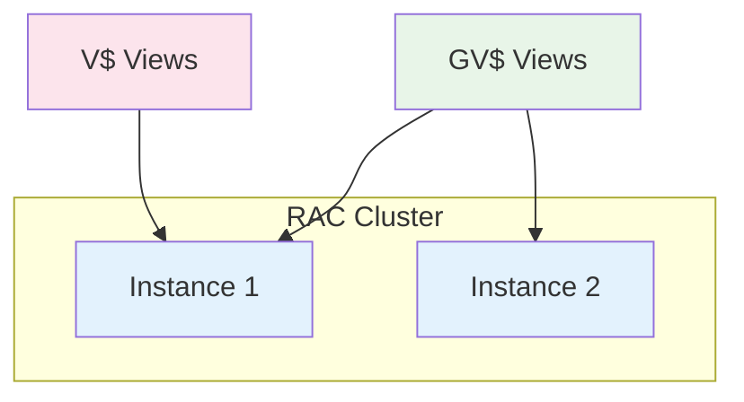

Gợi ý: luôn xác định ORACLE_SID trước khi vào sqlplus/rman; trong RAC, dùng GV$ để nhìn theo inst_id.

## Bước 2) Xác nhận trạng thái backup (SQL)

Mục tiêu: đánh giá nhanh job backup (loại, thời điểm, kết quả) và tìm mối liên hệ giữa job, set, piece.

Cột quan trọng trong GV$RMAN_BACKUP_JOB_DETAILS:
- input_type: DATABASE | ARCHIVELOG | CONTROLFILE | SPFILE
- status: COMPLETED | COMPLETED WITH WARNINGS | FAILED | RUNNING
- mbytes_processed/elapsed_seconds: gợi ý dung lượng / hiệu năng

Sơ đồ quyết định đánh giá job:
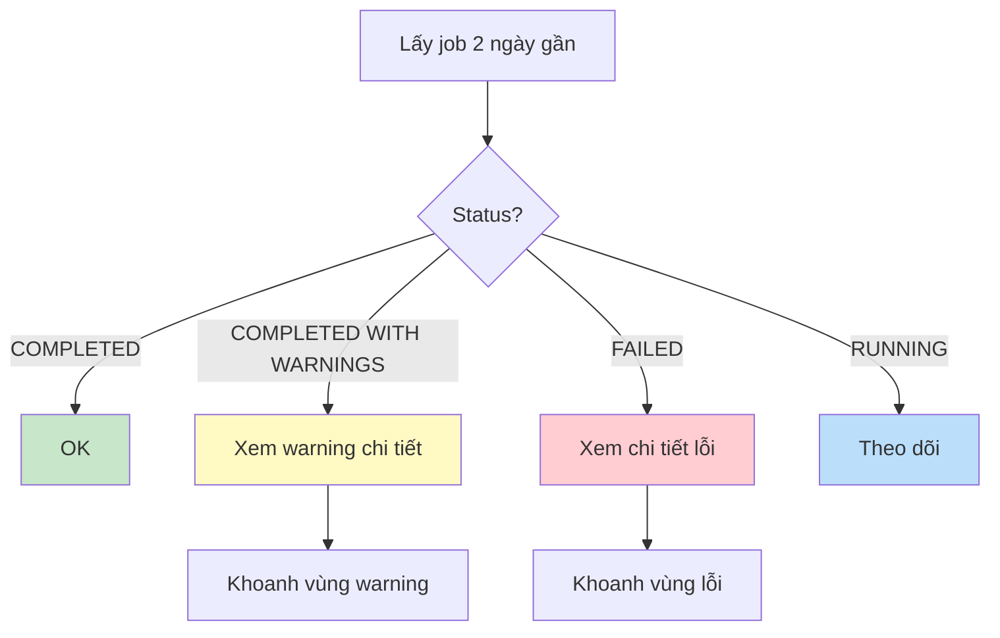

Đường đi của một archived log:
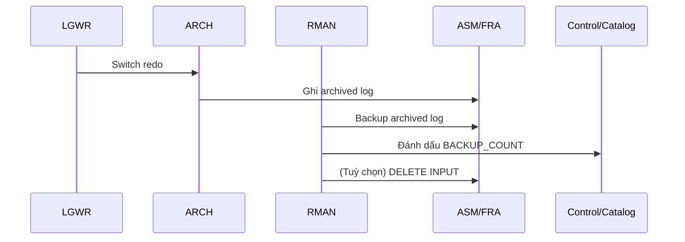

## Bước 3) Kiểm tra nhanh bằng RMAN

Mục tiêu: dùng LIST/CROSSCHECK/REPORT để kiểm tra thời gian gần, tình hình nhận dạng backup.

Tóm tắt chức năng:
- LIST: liệt kê nhanh cái đang có
- CROSSCHECK: đối soát metadata và thực tế
- REPORT: đánh giá obsolete/need backup

Sơ đồ thao tác:
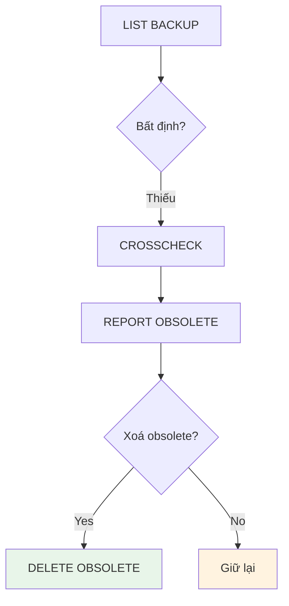

DISK vs SBT_TAPE (NetBackup):
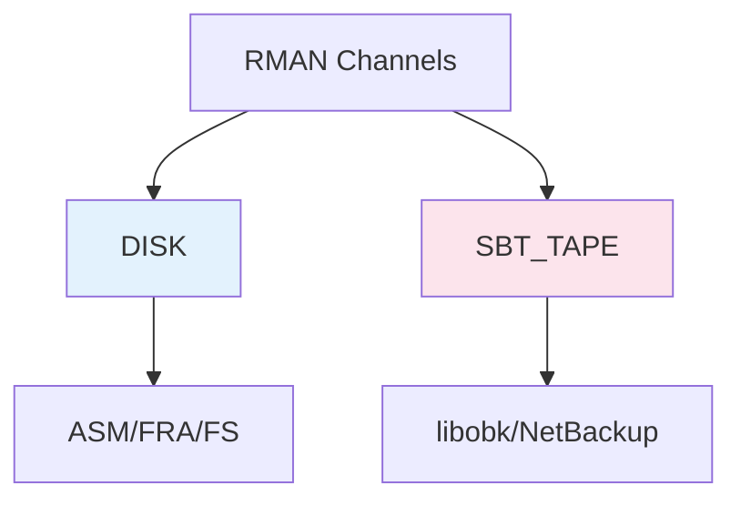

## Bước 4) NetBackup Status 6 & xử lý

Mục tiêu: hiểu vì sao lỗi, định vị nhanh và xử lý an toàn.

Điểm kiểm tra log theo lớp:
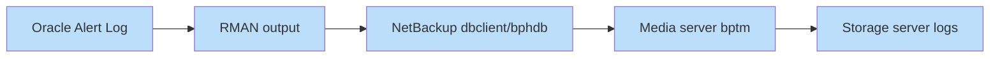

Khoanh vùng nguyên nhân nhanh:
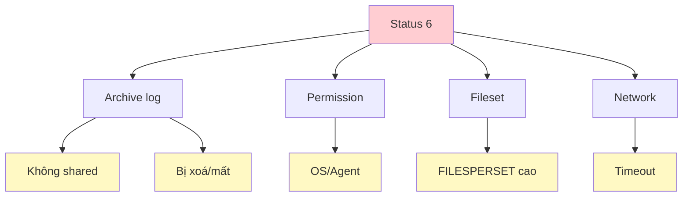

## Bước 5) Lý thuyết cốt lõi

Thuật ngữ nhanh cho người mới:
- Backup Set: đơn vị logic, gồm nhiều Piece
- Backup Piece: file vật lý được lưu trữ
- Image Copy: bản sao 1:1 datafile
- Channel: luồng I/O; TYPE DISK hoặc SBT_TAPE
- FRA: vùng Oracle quản lý backup/archivelog
- Retention Policy: RECOVERY WINDOW hoặc REDUNDANCY

Minh hoạ Retention Policy:
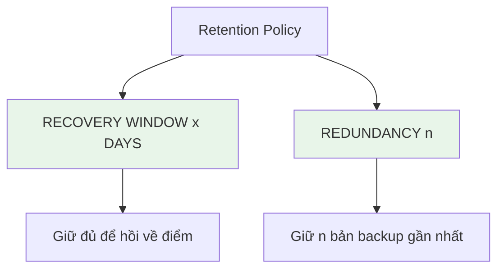

Backup Set vs Image Copy:
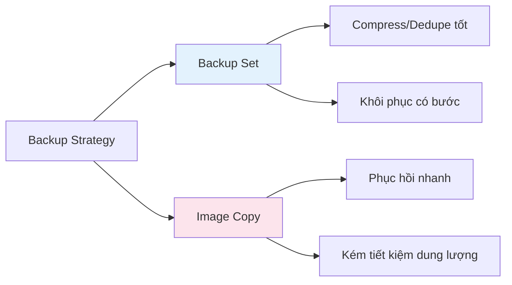

## Bước 6) Luồng backup Oracle với NetBackup

Xử lý nhanh trong chuỗi backup:
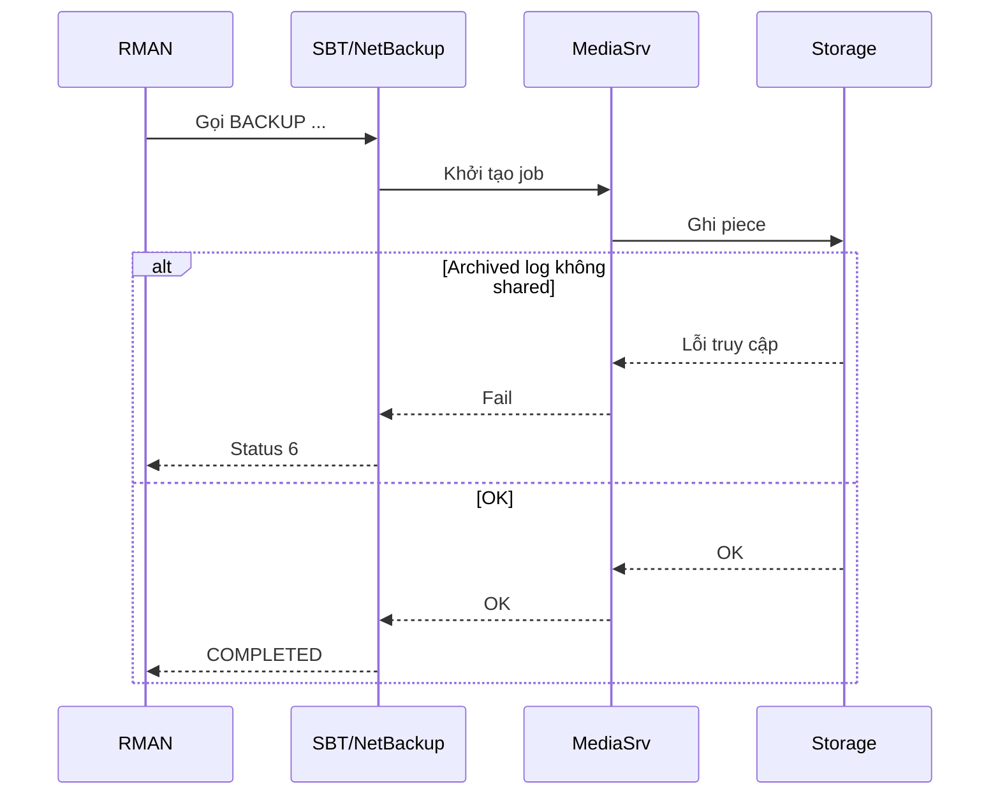

## Bước 7) Hướng dẫn thao tác chi tiết

Checklist thao tác nhanh:
- Xác định ORACLE_SID/ORACLE_HOME và quyền SYSDBA
- Kết nối sqlplus/rman
- Chạy các truy vấn job/piece/archivelog
- Dùng LIST/CROSSCHECK/REPORT
- Ghi nhận và báo cáo

Luồng thao tác gợi ý:
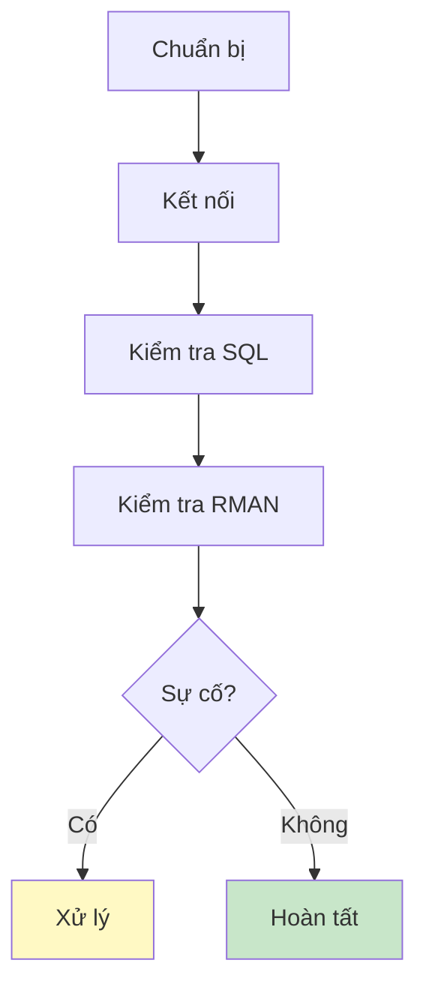

## Bước 8) Tóm tắt quy trình

Quyết định một-trang cho người mới:
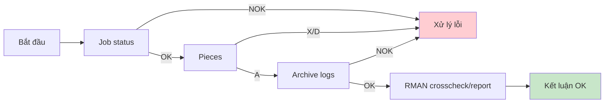

---

FAQ người mới:
- Nên dùng DELETE INPUT khi nào? => Khi đã xác minh backup archivelog OK, tránh rủi ro lỗi truy cập.
- RECOVERY WINDOW hay REDUNDANCY? => Tuỳ RPO; WINDOW tối ưu cho phục hồi theo mốc thời gian.
- DISK hay SBT? => DISK đơn giản/nhanh, SBT dùng khi tích hợp bên thứ 3 (NetBackup,...).

Mẫu lệnh RMAN tham khảo:
```rman
LIST BACKUP SUMMARY;
LIST BACKUP OF DATABASE;
LIST BACKUP OF ARCHIVELOG FROM TIME "SYSDATE-1";
CROSSCHECK BACKUP;
REPORT OBSOLETE;
```

