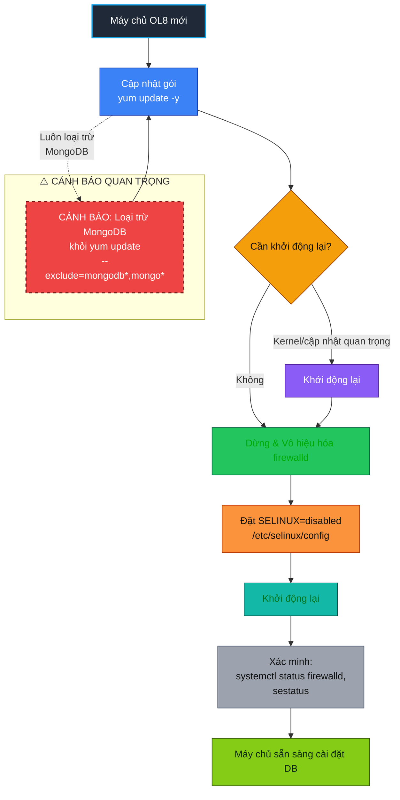
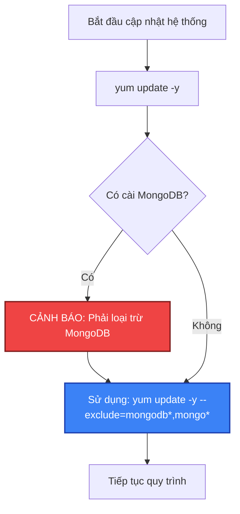
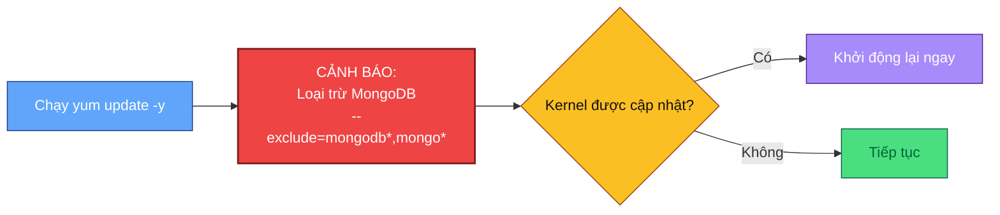
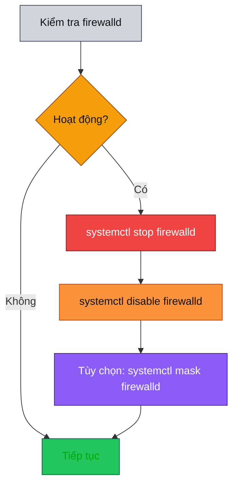
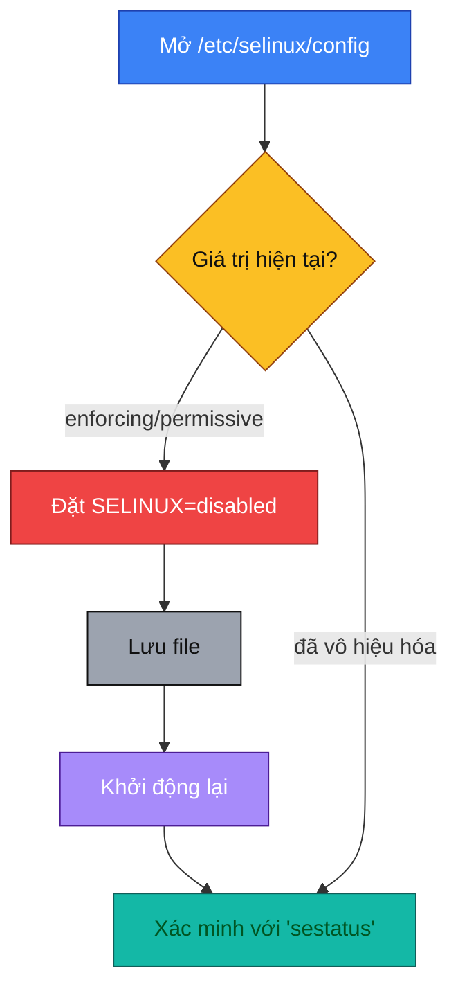
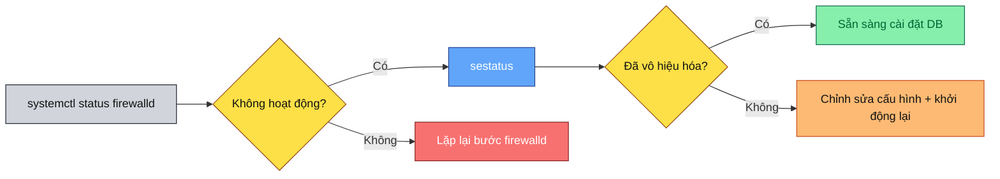

# Danh sách kiểm tra trước khi cài đặt DB (hệ họ RHEL/OL8) 🐧💾

> Các bản phân phối mục tiêu: Oracle Linux 8 / RHEL 8 clones. Các lệnh sử dụng `yum`, được hỗ trợ bởi DNF trên OL8—vì vậy `yum update -y` vẫn hợp lệ và quen thuộc. ([Tài liệu Oracle][1], [phoenixNAP | Global IT Services][2])

---

## 0) Quy trình tổng thể 🗺️



---

## 1) Cập nhật hệ thống (`yum update -y`) 🔄💡

**Lý do:** Trên OL8, `yum` là giao diện dựa trên DNF. Chạy cập nhật đầy đủ đảm bảo bạn có kernel, glibc, OpenSSL và trình điều khiển thiết bị hiện tại trước khi cài đặt cơ sở dữ liệu—giảm thiểu bất ngờ sau khi cài đặt và tránh các vấn đề không tương thích ABI. Nếu kernel mới được kéo về, hãy khởi động lại một lần trước khi tiếp tục. ([Tài liệu Oracle][1], [phoenixNAP | Global IT Services][2])

Trong một số trường hợp, bạn có thể muốn loại trừ một số gói khỏi việc cập nhật để duy trì tính ổn định của hệ thống hoặc tránh các vấn đề tương thích với phần mềm cơ sở dữ liệu của bạn. Đối với các cài đặt MongoDB, bạn nên loại trừ các gói MongoDB khỏi việc cập nhật hệ thống để duy trì tính nhất quán về phiên bản. Bạn có thể sử dụng tùy chọn `--exclude` với yum để ngăn chặn các gói cụ thể khỏi việc cập nhật.

⚠️ **CẢNH BÁO QUAN TRỌNG**: Việc loại trừ các gói MongoDB khỏi lệnh `yum update` là **BẮT BUỘC** và **CỰC KỲ QUAN TRỌNG**. Nếu không thực hiện đúng bước này, có thể gây ra **hậu quả nghiêm trọng** đến hệ thống MongoDB đang chạy, bao gồm nhưng không giới hạn ở: mất dữ liệu, hỏng cấu hình, không tương thích phiên bản, và thậm chí làm cho toàn bộ cụm MongoDB không hoạt động. Hãy chắc chắn rằng bạn luôn sử dụng tùy chọn `--exclude=mongodb*,mongo*` khi chạy lệnh `yum update` trên hệ thống đã cài đặt MongoDB.

**Sơ đồ minh họa cảnh báo quan trọng:**



**Lệnh:**

```bash
sudo yum update -y   # 📦 Cập nhật tất cả các gói
# Nếu kernel hoặc thư viện quan trọng được cập nhật, khởi động lại một lần:
sudo reboot          # 🔁 Khởi động lại nếu cần

# Để loại trừ các gói MongoDB khỏi cập nhật:
sudo yum update -y --exclude=mongodb*,mongo*   # 🚫 Loại trừ các gói MongoDB
```

**Mini-flow:**



---

## 2) Dừng và vô hiệu hóa tường lửa của hệ điều hành (`firewalld`) 🔥🚫

**Lý thuyết:** `firewalld` là dịch vụ tường lửa cấp cao chạy trên nftables. Nó tổ chức các quy tắc thành **zones** và **services** và được bật theo mặc định trên RHEL/OL8. Nhiều nhóm DB tạm thời vô hiệu hóa nó trong quá trình khởi tạo ban đầu, sau đó bật lại với các ngoại lệ dịch vụ/cổng phù hợp. Nếu bạn phải giữ nó tắt trong quá trình cài đặt, *ít nhất* hãy ghi lại các biện pháp kiểm soát bù đắp (VPC/nhóm bảo mật bị hạn chế, cách ly máy chủ). ([Tài liệu Red Hat][3])

**Các lệnh (ít xâm lấn nhất):**

```bash
sudo systemctl stop firewalld     # ⏹️ Dừng dịch vụ
sudo systemctl disable firewalld  # 📴 Vô hiệu hóa khi khởi động
# Tùy chọn chặn cứng để không gì có thể tự khởi động nó:
sudo systemctl mask firewalld     # 🔒 Ngăn chặn khởi động vô tình
```

*(Masking ngăn các đơn vị khác khởi động nó vô tình; bỏ mask sau này để khôi phục.)* ([Sách điện tử LFCS][4], [oracle-hub][5])

**Mini-flow:**



> ⚠️ **Ghi chú bảo mật:** Ưu tiên mở chỉ các cổng của DB trong zone đúng thay vì tắt hoàn toàn tường lửa, đặc biệt trên các máy chủ đa người dùng hoặc có thể truy cập từ Internet. ([Tài liệu Red Hat][3])

---

## 3) Vô hiệu hóa SELinux (chỉ trong thời gian cài đặt) 🛡️⚙️

**Lý thuyết:** SELinux là hệ thống kiểm soát truy cập bắt buộc (MAC) giới hạn các tiến trình thông qua nhãn và chính sách. Các chế độ là **enforcing**, **permissive**, và **disabled**. Đối với các bản build lệch khỏi "đường dẫn/cổng tiêu chuẩn," SELinux có thể chặn các thao tác cho đến khi điều chỉnh chính sách. Các nhà cung cấp đôi khi yêu cầu bạn vô hiệu hóa nó trong quá trình cài đặt; giải pháp an toàn hơn là **permissive** (ghi log từ chối, không chặn). Red Hat thường khuyến nghị permissive thay vì vô hiệu hóa hoàn toàn; nếu bạn *có* vô hiệu hóa, cần khởi động lại. ([Tài liệu Red Hat][6])

**Các lệnh (như bạn đã yêu cầu):**

```bash
# Chỉnh sửa file cấu hình ✏️
sudo vi /etc/selinux/config
# Thay đổi dòng này:
#   SELINUX=enforcing
# thành:
#   SELINUX=disabled   # ❌ Vô hiệu hóa

# Áp dụng bằng cách khởi động lại:
sudo reboot           # 🔁 Áp dụng các thay đổi
```

**Các lựa chọn thay thế (an toàn hơn trong quá trình khắc phục sự cố):**

```bash
# Tạm thời (cho đến khi khởi động lại): chế độ permissive 🟡
sudo setenforce 0

# Xác minh chế độ hiện tại 🔍
getenforce
sestatus
```

*(Sử dụng `sestatus` / `getenforce` để xác nhận chế độ và cài đặt thời gian khởi động.)* ([Tài liệu Red Hat][6], [LinuxConfig][7])

**Mini-flow:**



> ⚠️ **Ghi chú bảo mật:** Vô hiệu hóa SELinux loại bỏ một lớp cách ly quan trọng (ví dụ, khối lượng công việc container phụ thuộc vào nó để tách biệt tiến trình). Nếu bạn đang chạy container cùng với DB, **không** nên để SELinux bị vô hiệu hóa. Lên kế hoạch bật lại và tạo các ngoại lệ chính sách sau khi DB ổn định. ([Cổng thông tin khách hàng Red Hat][8])

---

## 4) Xác minh sau khi khởi động lại ✅🔍

**Tại sao:** Xác minh ngăn chặn các trạng thái "nửa áp dụng" (ví dụ, cấu hình SELinux đã thay đổi nhưng chưa khởi động lại).

**Các lệnh:**

```bash
# Tường lửa nên không hoạt động 🔥
systemctl status firewalld

# SELinux nên báo cáo là đã vô hiệu hóa 🛡️
sestatus
```

**Mini-flow:**



---

## 5) Khôi phục nhanh & các lựa chọn thay thế an toàn (sau khi cài đặt) ⏪🔐

* **Bật lại tường lửa** 🔥 và chỉ mở các cổng DB cần thiết (ví dụ, 1521 cho Oracle, 5432 cho PostgreSQL) sử dụng các dịch vụ/quy tắc `firewall-cmd`. ([Tài liệu Red Hat][3])
* **Bật lại SELinux** 🛡️ sang `enforcing` (hoặc ít nhất là `permissive`) và tạo các quyền cần thiết thông qua `audit2allow` thay vì để nó tắt. ([Tài liệu Red Hat][6], [Information Security Stack Exchange][9])

```bash
# Tường lửa
sudo systemctl unmask firewalld        # 🔓 Bỏ mask
sudo systemctl enable --now firewalld
# ví dụ: mở dịch vụ PostgreSQL vĩnh viễn
sudo firewall-cmd --add-service=postgresql --permanent  # 📡 Mở cổng
sudo firewall-cmd --reload

# SELinux (cấu hình + khởi động lại về enforcing)
sudo sed -i 's/^SELINUX=.*/SELINUX=enforcing/' /etc/selinux/config  # 🛡️ Khôi phục
sudo reboot
```

---

## Khối copy-paste 📋✨

```
# 1) Cập nhật OS
sudo yum update -y --exclude=mongodb*,mongo*  # Loại trừ các gói MongoDB

# 2) Tắt tường lửa
sudo systemctl stop firewalld
sudo systemctl disable firewalld
# tùy chọn nhưng được khuyến nghị để tránh khởi động vô tình:
sudo systemctl mask firewalld

# 3) Vô hiệu hóa SELinux (vĩnh viễn)
sudo vi /etc/selinux/config   # đặt: SELINUX=disabled
sudo reboot

# 4) Xác minh sau khi khởi động lại
systemctl status firewalld
sestatus
```

---

### Nguồn 📚

* OL8 sử dụng YUM dựa trên DNF; `yum update -y` hợp lệ trên OL8. ([Tài liệu Oracle][1], [phoenixNAP | Global IT Services][2])
* `firewalld` là gì (zones/services) và tại sao nên ưu tiên các ngoại lệ quy tắc thay vì tắt hoàn toàn. ([Tài liệu Red Hat][3])
* Các lệnh vô hiệu hóa/mask và ví dụ quản lý dịch vụ. ([Sách điện tử LFCS][4], [oracle-hub][5])
* Các chế độ SELinux và thay đổi vĩnh viễn thông qua `/etc/selinux/config`; ưu tiên permissive thay vì vô hiệu hóa. ([Tài liệu Red Hat][6])
* Kiểm tra trạng thái SELinux (`sestatus`, `getenforce`). ([LinuxConfig][7])
* Tại sao để SELinux bị vô hiệu hóa là rủi ro (đặc biệt với container). ([Cổng thông tin khách hàng Red Hat][8])
* Các hàm ý bảo mật của việc vô hiệu hóa SELinux. ([Information Security Stack Exchange][9])

---

[1]: https://docs.oracle.com/en/operating-systems/oracle-linux/8/relnotes8.0/ol8.0-ComparingYumVersion3WithDNF.html?utm_source=chatgpt.com "So sánh Yum Phiên bản 3 Với DNF - Trung tâm Trợ giúp Oracle"
[2]: https://phoenixnap.com/kb/dnf-vs-yum?utm_source=chatgpt.com "DNF vs. YUM: Tìm hiểu sự khác biệt {So sánh Song song}"
[3]: https://docs.redhat.com/en/documentation/red_hat_enterprise_linux/8/html/configuring_and_managing_networking/using-and-configuring-firewalld_configuring-and-managing-networking?utm_source=chatgpt.com "Sử dụng và cấu hình firewalld - Red Hat"
[4]: https://www.tecmint.com/manage-firewalld-and-ufw-on-linux/?utm_source=chatgpt.com "Cách Quản lý Firewalld và UFW cho Bảo mật Linux - Tecmint"
[5]: https://community.oracle.com/customerconnect/discussion/719456/how-to-disable-firewalld-service-permanently?utm_source=chatgpt.com "Cách Vô hiệu hóa Dịch vụ Firewalld Vĩnh viễn - Cộng đồng Oracle"
[6]: https://docs.redhat.com/en/documentation/red_hat_enterprise_linux/8/html/using_selinux/changing-selinux-states-and-modes_using-selinux?utm_source=chatgpt.com "Thay đổi trạng thái và chế độ SELinux - Red Hat"
[7]: https://linuxconfig.org/how-to-check-selinux-operational-mode?utm_source=chatgpt.com "Kiểm tra Chế độ Hoạt động SELinux trên Hệ thống Linux - LinuxConfig.org"
[8]: https://access.redhat.com/articles/6144032?utm_source=chatgpt.com "Tại sao việc vô hiệu hóa SELinux khi chạy container là ý tưởng tồi"
[9]: https://security.stackexchange.com/questions/104090/what-are-the-security-implications-of-disabling-selinux?utm_source=chatgpt.com "Các hàm ý bảo mật của việc vô hiệu hóa SELinux?"