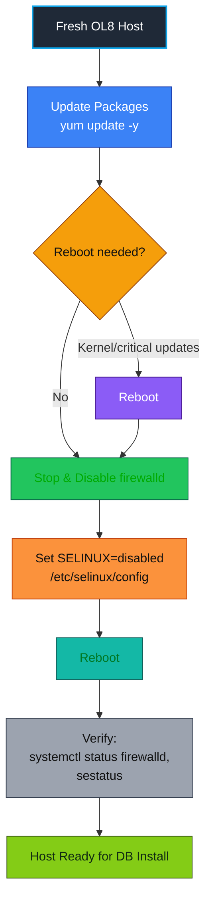
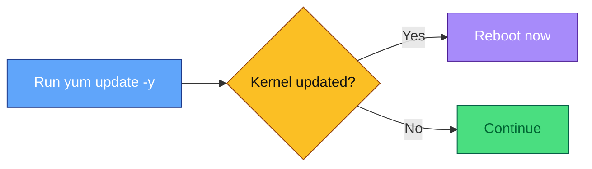
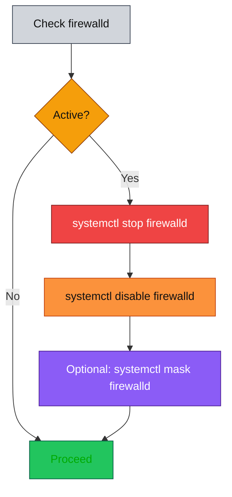
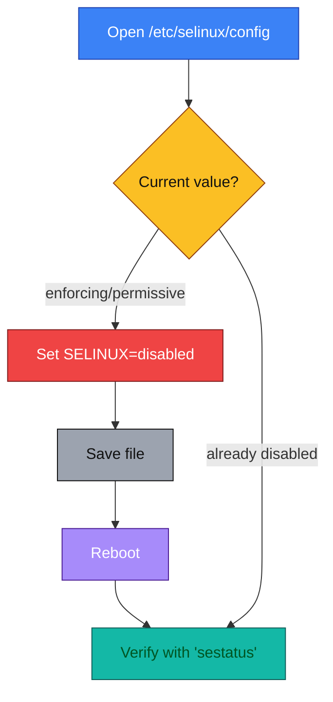
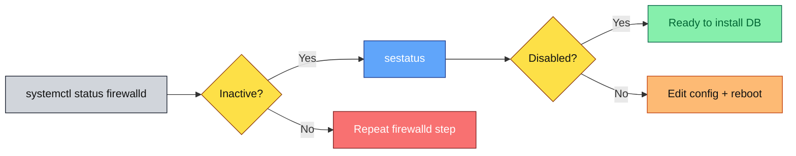

# Pre-DB Install Checklist (RHEL/OL8 family) 🐧💾

> Target distros: Oracle Linux 8 / RHEL 8 clones. Commands use `yum`, which is DNF-backed on OL8—so `yum update -y` remains valid and familiar. ([Oracle Documentation][1], [phoenixNAP | Global IT Services][2])

---

## 0) Big picture workflow 🗺️



---

## 1) Update the system (`yum update -y`) 🔄💡

**What/why:** On OL8, `yum` is a DNF-based interface. Running a full update ensures you have current kernel, glibc, OpenSSL, and device drivers before layering a database—reducing post-install surprises and avoiding ABI mismatches. If a new kernel is pulled in, reboot once before proceeding. ([Oracle Documentation][1], [phoenixNAP | Global IT Services][2])

**Command:**

```bash
sudo yum update -y   # 📦 Update all packages
# If the kernel or critical libs were updated, reboot once:
sudo reboot          # 🔁 Reboot if needed
```

**Mini-flow:**



---

## 2) Stop and disable the OS firewall (`firewalld`) 🔥🚫

**Theory:** `firewalld` is the high-level firewall service atop nftables. It organizes rules into **zones** and **services** and is enabled by default on RHEL/OL8. Many DB teams temporarily disable it during initial bring-up, then re-enable with the proper service/port exceptions. If you must keep it off during install, *at least* document compensating controls (restricted VPC/security groups, host isolation). ([Red Hat Documentation][3])

**Commands (minimally invasive):**

```bash
sudo systemctl stop firewalld     # ⏹️ Stop service
sudo systemctl disable firewalld  # 📴 Disable at boot
# Optional hard block so nothing can auto-start it:
sudo systemctl mask firewalld     # 🔒 Prevent accidental start
```

*(Masking prevents other units from starting it accidentally; unmask later to restore.)* ([LFCS Certification eBook][4], [oracle-hub][5])

**Mini-flow:**



> ⚠️ **Security note:** Prefer opening only the DB’s ports in the correct zone over turning the firewall off entirely, especially on multi-tenant or Internet-reachable hosts. ([Red Hat Documentation][3])

---

## 3) Disable SELinux (install-time only) 🛡️⚙️

**Theory:** SELinux is a mandatory access control (MAC) system that confines processes via labels and policy. Modes are **enforcing**, **permissive**, and **disabled**. For builds that deviate from “standard paths/ports,” SELinux can block operations until policy is adjusted. Vendors sometimes ask you to disable it during installation; a safer middle ground is **permissive** (logs denials, doesn’t block). Red Hat generally recommends permissive over fully disabled; if you *do* disable, reboot is required. ([Red Hat Documentation][6])

**Commands (what you requested):**

```bash
# Edit the config file ✏️
sudo vi /etc/selinux/config
# Change this line:
#   SELINUX=enforcing
# to:
#   SELINUX=disabled   # ❌ Disabled

# Apply by rebooting:
sudo reboot           # 🔁 Apply changes
```

**Alternatives (safer during troubleshooting):**

```bash
# Temporary (until reboot): permissive mode 🟡
sudo setenforce 0

# Verify current mode 🔍
getenforce
sestatus
```

*(Use `sestatus` / `getenforce` to confirm mode and boot-time setting.)* ([Red Hat Documentation][6], [LinuxConfig][7])

**Mini-flow:**



> ⚠️ **Security note:** Disabling SELinux removes an important isolation layer (for example, container workloads depend on it for process separation). If you’re running containers alongside your DB, do **not** leave SELinux disabled. Plan to re-enable and craft policy exceptions once the DB is stable. ([Red Hat Customer Portal][8])

---

## 4) Post-reboot verification ✅🔍

**Why:** Verifying prevents “half-applied” states (e.g., SELinux config changed but not rebooted).

**Commands:**

```bash
# Firewall should be inactive 🔥
systemctl status firewalld

# SELinux should report disabled 🛡️
sestatus
```

**Mini-flow:**



---

## 5) Quick rollback & secure alternatives (after install) ⏪🔐

* **Re-enable firewall** 🔥 and open only required DB ports (e.g., 1521 for Oracle, 5432 for PostgreSQL) using `firewall-cmd` services/rules. ([Red Hat Documentation][3])
* **Re-enable SELinux** 🛡️ to `enforcing` (or at least `permissive`) and generate needed allowances via `audit2allow` rather than leaving it off. ([Red Hat Documentation][6], [Information Security Stack Exchange][9])

```bash
# Firewall
sudo systemctl unmask firewalld        # 🔓 Unmask
sudo systemctl enable --now firewalld
# example: open PostgreSQL service permanently
sudo firewall-cmd --add-service=postgresql --permanent  # 📡 Open port
sudo firewall-cmd --reload

# SELinux (config + reboot back to enforcing)
sudo sed -i 's/^SELINUX=.*/SELINUX=enforcing/' /etc/selinux/config  # 🛡️ Restore
sudo reboot
```

---

## Copy-paste block 📋✨

```bash
# 1) Update OS
sudo yum update -y

# 2) Turn off firewall
sudo systemctl stop firewalld
sudo systemctl disable firewalld
# optional but recommended to avoid accidental starts:
sudo systemctl mask firewalld

# 3) Disable SELinux (permanent)
sudo vi /etc/selinux/config   # set: SELINUX=disabled
sudo reboot

# 4) Verify after reboot
systemctl status firewalld
sestatus
```

---

### Sources 📚

* OL8 uses DNF-based YUM; `yum update -y` is valid on OL8. ([Oracle Documentation][1], [phoenixNAP | Global IT Services][2])
* What `firewalld` is (zones/services) and why to prefer rule exceptions over blanket disable. ([Red Hat Documentation][3])
* Disable/mask commands and service management examples. ([LFCS Certification eBook][4], [oracle-hub][5])
* SELinux modes and permanent changes via `/etc/selinux/config`; prefer permissive over disabled. ([Red Hat Documentation][6])
* Checking SELinux status (`sestatus`, `getenforce`). ([LinuxConfig][7])
* Why leaving SELinux disabled is risky (especially with containers). ([Red Hat Customer Portal][8])
* Security implications of disabling SELinux. ([Information Security Stack Exchange][9])

---

[1]: https://docs.oracle.com/en/operating-systems/oracle-linux/8/relnotes8.0/ol8.0-ComparingYumVersion3WithDNF.html?utm_source=chatgpt.com "Comparing Yum Version 3 With DNF - Oracle Help Center"
[2]: https://phoenixnap.com/kb/dnf-vs-yum?utm_source=chatgpt.com "DNF vs. YUM: Learn the Differences {Side-by-Side Comparison}"
[3]: https://docs.redhat.com/en/documentation/red_hat_enterprise_linux/8/html/configuring_and_managing_networking/using-and-configuring-firewalld_configuring-and-managing-networking?utm_source=chatgpt.com "Using and configuring firewalld - Red Hat"
[4]: https://www.tecmint.com/manage-firewalld-and-ufw-on-linux/?utm_source=chatgpt.com "How to Manage Firewalld and UFW for Linux Security - Tecmint"
[5]: https://community.oracle.com/customerconnect/discussion/719456/how-to-disable-firewalld-service-permanently?utm_source=chatgpt.com "How to Disable Firewalld Service Permanently - Oracle Community"
[6]: https://docs.redhat.com/en/documentation/red_hat_enterprise_linux/8/html/using_selinux/changing-selinux-states-and-modes_using-selinux?utm_source=chatgpt.com "Changing SELinux states and modes - Red Hat"
[7]: https://linuxconfig.org/how-to-check-selinux-operational-mode?utm_source=chatgpt.com "Check SELinux Status on Linux Systems - LinuxConfig.org"
[8]: https://access.redhat.com/articles/6144032?utm_source=chatgpt.com "Why disabling SELinux when running containers is a bad idea"
[9]: https://security.stackexchange.com/questions/104090/what-are-the-security-implications-of-disabling-selinux?utm_source=chatgpt.com "What are the security implications of disabling SELinux?"
