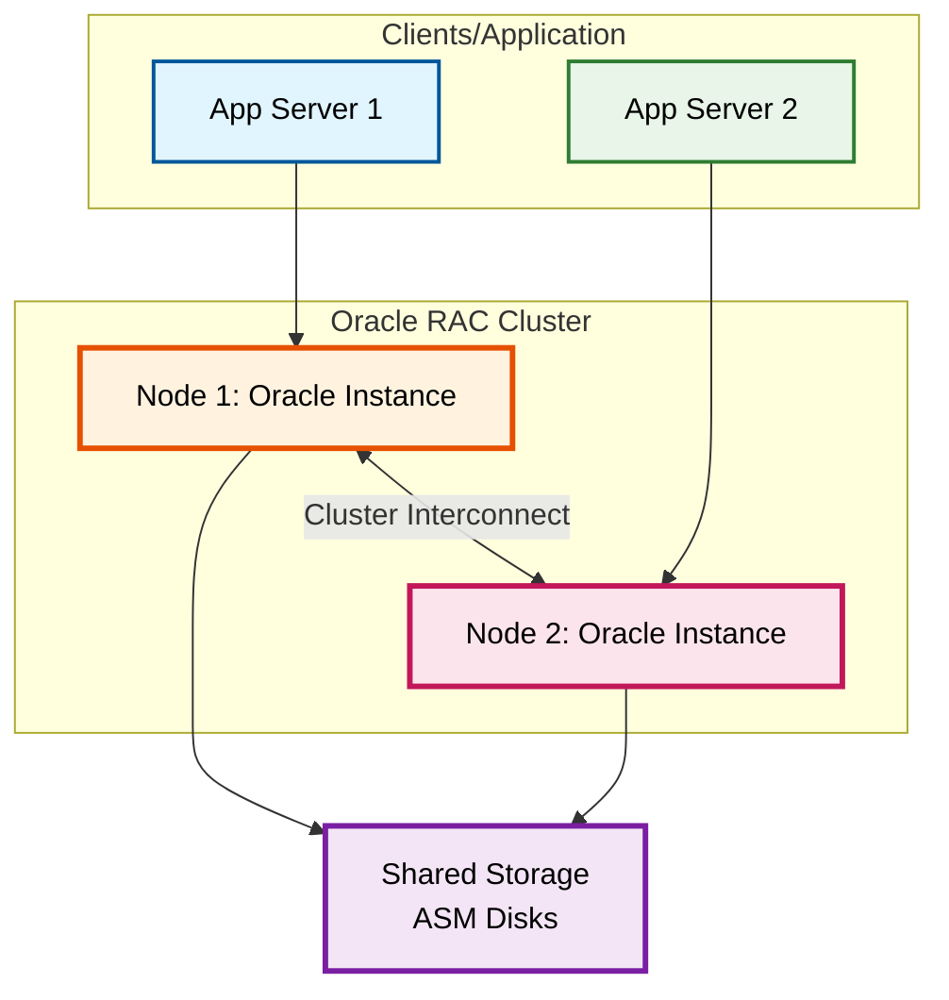
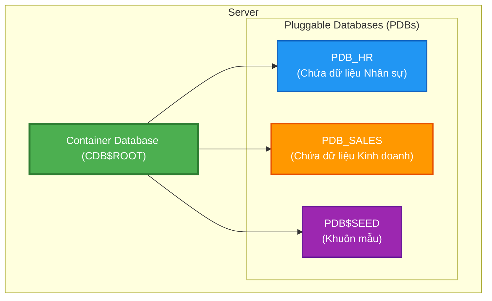
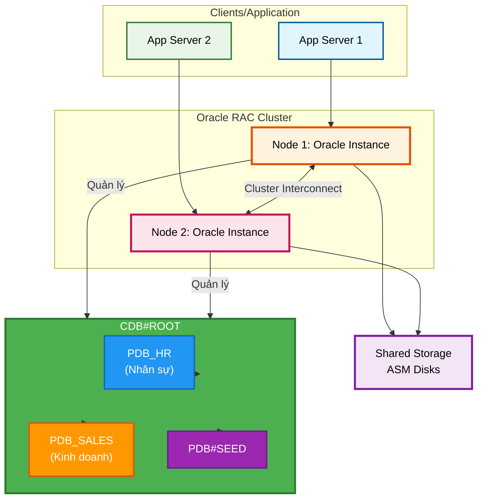
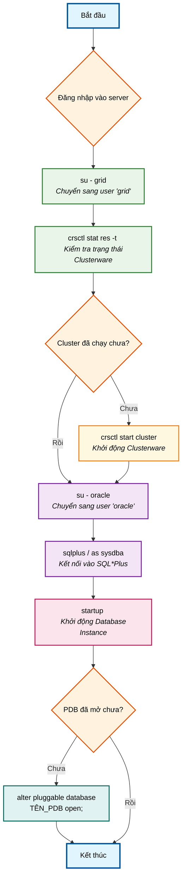
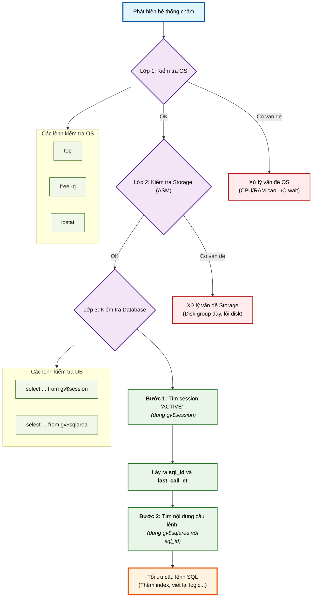
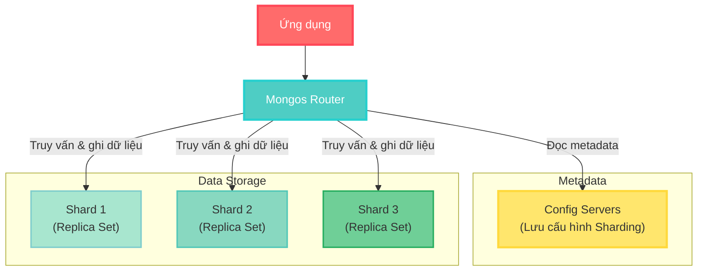
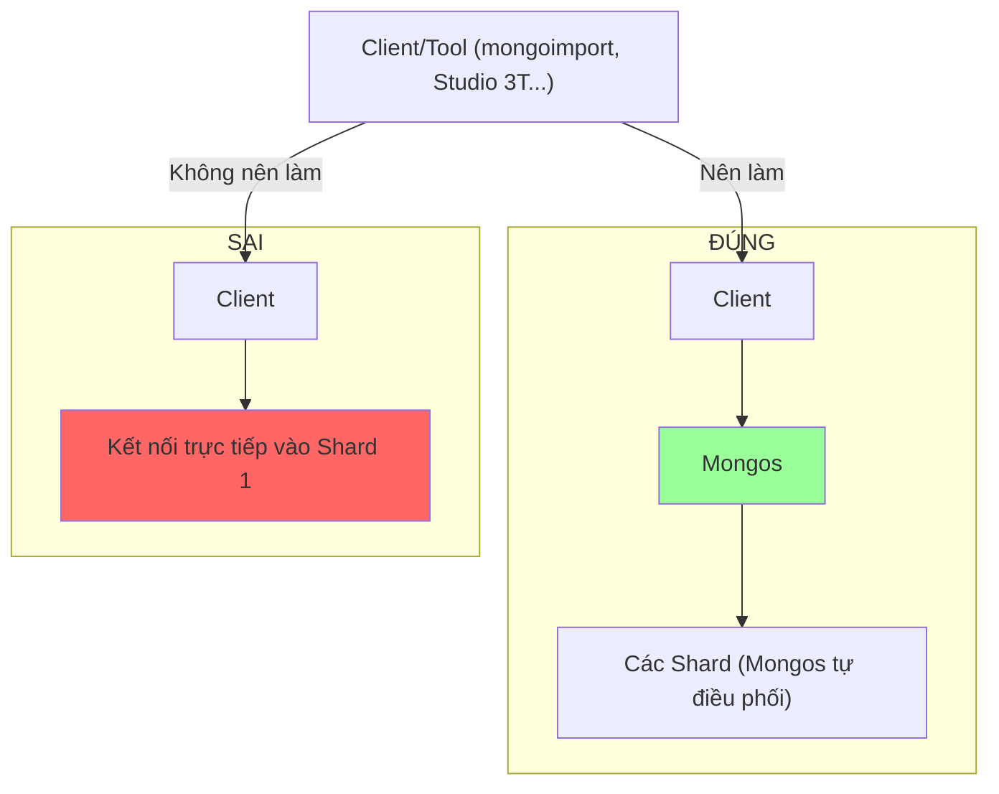

- [Hướng Dẫn Vận Hành Và Giám Sát Oracle \& MongoDB](#hướng-dẫn-vận-hành-và-giám-sát-oracle--mongodb)
  - [Phần I: Oracle Database](#phần-i-oracle-database)
    - [1. Kiến Trúc Cốt Lõi](#1-kiến-trúc-cốt-lõi)
    - [2. Vận Hành Cơ Bản Trong Môi Trường RAC](#2-vận-hành-cơ-bản-trong-môi-trường-rac)
      - [2.1 Sự Khác Biệt Giữa Tài Khoản `oracle` và `grid`](#21-sự-khác-biệt-giữa-tài-khoản-oracle-và-grid)
      - [2.2 Các Câu Lệnh Vận Hành Chính và Tình Huống Sử Dụng](#22-các-câu-lệnh-vận-hành-chính-và-tình-huống-sử-dụng)
      - [2.3 Quy Trình Xử Lý Sự Cố Tiêu Chuẩn](#23-quy-trình-xử-lý-sự-cố-tiêu-chuẩn)
      - [2.4 Quy Trình Khởi Động (Startup) Một Cơ Sở Dữ Liệu RAC](#24-quy-trình-khởi-động-startup-một-cơ-sở-dữ-liệu-rac)
    - [3. Giám Sát Và Chẩn Đoán Hiệu Năng](#3-giám-sát-và-chẩn-đoán-hiệu-năng)
  - [Phần II: MongoDB](#phần-ii-mongodb)
    - [1. Kiến Trúc Sharding (Phân Mảnh)](#1-kiến-trúc-sharding-phân-mảnh)
    - [2. Vận Hành Và Giám Sát](#2-vận-hành-và-giám-sát)
      - [1. Quy Trình Import Dữ Liệu Vào Sharded Cluster](#1-quy-trình-import-dữ-liệu-vào-sharded-cluster)
      - [2. Giám Sát Với MongoDB Compass](#2-giám-sát-với-mongodb-compass)
  - [Phần III: Tổng kết](#phần-iii-tổng-kết)
    - [Checklist Hàng Ngày](#checklist-hàng-ngày)
    - [Công Cụ Hỗ Trợ](#công-cụ-hỗ-trợ)


# Hướng Dẫn Vận Hành Và Giám Sát Oracle & MongoDB

## Phần I: Oracle Database

### 1. Kiến Trúc Cốt Lõi

**1.1 Oracle Real Application Clusters (RAC)**

Oracle RAC cho phép nhiều máy chủ (nodes) cùng truy cập vào một cơ sở dữ liệu duy nhất, mang lại tính sẵn sàng cao và khả năng mở rộng. Điều này đặc biệt hữu ích khi hệ thống cần hoạt động liên tục 24/7, giảm thiểu thời gian ngừng hoạt động (downtime) khi một node gặp sự cố, tăng khả năng xử lý song song và dễ dàng mở rộng quy mô.



**Giải thích sơ đồ:**
- **Node 1 & Node 2:** Mỗi node là một máy chủ vật lý hoặc ảo chạy một instance Oracle, xử lý các yêu cầu từ ứng dụng.
- **Cluster Interconnect:** Mạng riêng tốc độ cao để các node trao đổi thông tin (cache fusion, heartbeat). Nếu kết nối này chậm hoặc không ổn định, hiệu năng RAC có thể kém hơn so với một instance đơn lẻ.
- **Shared Storage:** Nơi lưu trữ dữ liệu chung, thường sử dụng Automatic Storage Management (ASM) để quản lý hiệu quả.

**Lưu ý quan trọng:** Đảm bảo Cluster Interconnect có độ trễ thấp để tránh ảnh hưởng đến hiệu suất tổng thể.

**1.2 Kiến Trúc Multitenant (CDB & PDB)**

Kiến trúc này cho phép quản lý nhiều cơ sở dữ liệu độc lập trong một container chung, tiết kiệm tài nguyên hệ thống (CPU, RAM, storage), hỗ trợ triển khai nhanh chóng và tách biệt dữ liệu giữa các ứng dụng.



**Giải thích sơ đồ:**
- **Container Database (CDB):** Quản lý tài nguyên chung (metadata, users chung).
- **Pluggable Database (PDB):** Các cơ sở dữ liệu độc lập chứa dữ liệu ứng dụng, có thể "cắm" vào hoặc rút ra khỏi CDB một cách dễ dàng.
- **PDB_SEED:** Bản mẫu để tạo PDB mới nhanh chóng.

**Ví dụ thực tế:** Để tạo một PDB mới, sử dụng lệnh:
```sql
CREATE PLUGGABLE DATABASE PDB_NEW FROM PDB_SEED;
ALTER PLUGGABLE DATABASE PDB_NEW OPEN;
```
Quá trình này chỉ mất vài phút, thay vì cài đặt cơ sở dữ liệu mới từ đầu.

**1.3 Kết Hợp RAC Với Multitenant**

Khi kết hợp Oracle RAC với kiến trúc Multitenant, chúng ta có được một hệ thống vừa có tính sẵn sàng cao, vừa tối ưu hóa tài nguyên hệ thống. Đây là giải pháp lý tưởng cho các doanh nghiệp cần quản lý nhiều ứng dụng khác nhau trên cùng một nền tảng cơ sở dữ liệu.



**Giải thích sơ đồ:**
- **CDB (Container Database)** chạy trên toàn bộ cụm RAC, mỗi node trong RAC đều có thể truy cập vào CDB.
- **PDB (Pluggable Database)** được chia sẻ giữa các node RAC. Một PDB có thể được mở trên tất cả các node hoặc chỉ trên một số node cụ thể, tùy theo cấu hình.
- **Phân bố tải (Load Balancing)**: Traffic đến các PDB được phân phối qua các node RAC, giúp cân bằng tải và tăng hiệu suất xử lý.
- **Tính sẵn sàng cao**: Nếu một node RAC gặp sự cố, các PDB sẽ tự động được phục hồi trên các node còn lại mà không làm gián đoạn dịch vụ.

**Lợi ích chính khi kết hợp RAC và Multitenant**

| Lợi ích | Mô tả |
|---------|-------|
| **Tối ưu tài nguyên** | Nhiều PDB chia sẻ tài nguyên của cụm RAC, giảm chi phí phần cứng và quản lý |
| **Khả năng mở rộng linh hoạt** | Dễ dàng mở rộng bằng cách thêm node RAC hoặc thêm PDB mới |
| **Phục hồi nhanh chóng** | Khi một node gặp sự cố, các PDB sẽ tự động được phục hồi trên các node còn lại |
| **Quản lý tập trung** | Quản lý nhiều PDB từ một điểm duy nhất trong khi vẫn đảm bảo tính độc lập |
| **Giảm thời gian bảo trì** | Có thể bảo trì từng node mà không ảnh hưởng đến toàn bộ hệ thống |

### 2. Vận Hành Cơ Bản Trong Môi Trường RAC

#### 2.1 Sự Khác Biệt Giữa Tài Khoản `oracle` và `grid`

Trong môi trường Oracle RAC, có hai tài khoản hệ thống quan trọng mà bất kỳ DBA nào cũng cần hiểu rõ:

**🔑 Tài khoản `grid`**
- **Vai trò**: Sở hữu và quản lý **Oracle Grid Infrastructure** (phần hạ tầng cụm)
- **Quyền hạn**:
  - Quản lý Clusterware (CRS - Cluster Ready Services)
  - Quản lý Automatic Storage Management (ASM)
  - Quản lý Oracle Net Listener
  - Kiểm soát các resource của cluster (database, service, listener)
- **Không có quyền** truy cập vào dữ liệu trong database
- **Mục đích chính**: Đảm bảo hạ tầng cụm hoạt động ổn định, sẵn sàng cao

**🗄️ Tài khoản `oracle`**
- **Vai trò**: Sở hữu và quản lý **Oracle Database software**
- **Quyền hạn**:
  - Quản lý các instance database
  - Thực thi các lệnh SQL/PLSQL
  - Quản lý PDBs trong kiến trúc Multitenant
  - Thực hiện backup/restore (qua RMAN)
  - Quản lý schema, user, quyền hạn trong database
- **Không có quyền** quản lý các resource của cluster
- **Mục đích chính**: Đảm bảo database hoạt động và dữ liệu được quản lý đúng cách

#### 2.2 Các Câu Lệnh Vận Hành Chính và Tình Huống Sử Dụng

**✅ Câu lệnh 1: Kiểm tra trạng thái PDBs**

```
su - oracle
sqlplus / as sysdba
show pdbs  -- kiểm tra trạng thái các Pluggable Database (PDBs)
```

- **Tại sao dùng `oracle`?** Vì đây là thao tác trực tiếp trên database, yêu cầu quyền quản trị database
- **Mục đích**: Kiểm tra trạng thái open/read-write của các PDB
- **Tình huống sử dụng thực tế**:
  - Ứng dụng báo lỗi "ORA-01033: ORACLE initialization or shutdown in progress"
  - Kiểm tra routine hàng ngày để đảm bảo tất cả PDBs đang hoạt động
  - Sau khi khởi động lại hệ thống, xác minh xem các PDBs đã tự động mở chưa
- **Phân tích kết quả**:
  - Nếu PDB ở trạng thái `MOUNT`: Cần mở PDB (sử dụng Câu lệnh 4)
  - Nếu PDB ở trạng thái `READ ONLY`: Ứng dụng không thể ghi dữ liệu
  - Nếu PDB không hiển thị: Có thể chưa được cắm vào CDB

**✅ Câu lệnh 2: Kiểm tra trạng thái cluster**

```
su - grid
crsctl stat res -t   -- kiểm tra trạng thái các resource trong cluster
lsnrctl status       -- kiểm tra listener có đang hoạt động hay không
```

- **Tại sao dùng `grid`?** Vì đây là thao tác quản lý hạ tầng cụm, không liên quan trực tiếp đến dữ liệu
- **Mục đích**: Dùng khi câu lệnh 1 cho thấy PDB chưa ở trạng thái open
- **Tình huống sử dụng thực tế**:
  - Khi không thể kết nối đến database dù đã thử nhiều cách
  - Khi nghi ngờ một node trong RAC đã bị down
  - Khi thực hiện bảo trì cluster
- **Phân tích kết quả**:
  - Nếu resource database ở trạng thái `OFFLINE`: Cần khởi động database (Câu lệnh 3)
  - Nếu listener ở trạng thái `BLOCKED` hoặc không hiển thị: Cần khởi động lại listener
  - Nếu có resource ở trạng thái `UNKNOWN`: Có vấn đề nghiêm trọng với cluster

**✅ Câu lệnh 3: Khởi động database**

```
su - oracle
sqlplus / as sysdba
startup
```

- **Tại sao dùng `oracle`?** Vì đây là thao tác khởi động instance database
- **Mục đích**: Dùng để khởi động database
- **Tình huống sử dụng thực tế**:
  - Sau khi bảo trì phần cứng/mạng, cần khởi động lại database
  - Khi xác nhận từ câu lệnh 2 rằng cluster hoạt động nhưng database resource ở trạng thái OFFLINE
  - Khi database bị shutdown do lỗi hoặc bảo trì
- **Lưu ý quan trọng**:
  - **Chỉ nên sử dụng sau khi kiểm tra bằng câu lệnh 1 và 2**, đảm bảo cluster hoạt động bình thường
  - **Không bao giờ** chạy lệnh này nếu câu lệnh 2 cho thấy cluster không ổn định
  - Nếu khởi động không thành công, cần kiểm tra file alert.log để xác định nguyên nhân

**✅ Câu lệnh 4: Mở PDB**

```
alter pluggable database <tên_pdb> open;
```

- **Tại sao dùng `oracle`?** Vì đây là thao tác quản trị database
- **Mục đích**: Dùng khi câu lệnh `show pdbs` cho thấy một PDB đang ở **mode: MOUNT**
- **Tình huống sử dụng thực tế**:
  - Sau khi khởi động CDB, các PDB không tự động mở (tùy cấu hình)
  - Khi PDB bị shutdown để bảo trì và cần mở lại
  - Khi PDB chuyển sang trạng thái MOUNT do lỗi
- **Lưu ý quan trọng**:
  - Có thể mở tất cả PDB cùng lúc với lệnh: `alter pluggable database all open;`
  - Nếu PDB không mở được, cần kiểm tra với: `SELECT name, cause, message FROM v$pdbs_alert;`

#### 2.3 Quy Trình Xử Lý Sự Cố Tiêu Chuẩn

Khi gặp vấn đề kết nối database, hãy tuân theo quy trình sau:

1. **Bước 1**: Sử dụng câu lệnh 1 để kiểm tra trạng thái PDBs
   - Nếu PDBs OPEN → Vấn đề ở ứng dụng hoặc network
   - Nếu PDBs không OPEN → Chuyển sang bước 2

2. **Bước 2**: Sử dụng câu lệnh 2 để kiểm tra trạng thái cluster
   - Nếu cluster hoạt động bình thường → Chuyển sang bước 3
   - Nếu cluster có vấn đề → Cần khắc phục sự cố cluster trước

3. **Bước 3**: Nếu database chưa được khởi động (OFFLINE) → Sử dụng câu lệnh 3

4. **Bước 4**: Sau khi database đã chạy → Sử dụng câu lệnh 4 để mở PDB

**Ví Dụ Thực Tế**

**Tình huống**: Ứng dụng không kết nối được đến PDB_SALES

**Quy trình xử lý**:
1. Chạy câu lệnh 1:
   ```
   su - oracle
   sqlplus / as sysdba
   show pdbs
   ```
   → Kết quả: PDB_SALES ở trạng thái MOUNT

2. Chạy câu lệnh 2:
   ```
   su - grid
   crsctl stat res -t
   ```
   → Kết quả: Tất cả resource ONLINE

3. Vì cluster hoạt động bình thường nhưng PDB_SALES chưa mở:
   ```
   su - oracle
   sqlplus / as sysdba
   alter pluggable database PDB_SALES open;
   ```

4. Kiểm tra lại bằng câu lệnh 1 để xác nhận PDB_SALES đã ở trạng thái OPEN

#### 2.4 Quy Trình Khởi Động (Startup) Một Cơ Sở Dữ Liệu RAC



**Lệnh thực tế:**

| Bước | Lệnh | Mô tả |
|------|------|-------|
| Kiểm tra trạng thái cluster | `crsctl stat res -t` | Xem tất cả resource có đang ONLINE không |
| Khởi động cluster | `crsctl start cluster -all` | Chỉ dùng khi cluster chưa chạy |
| Đăng nhập vào DB | `sqlplus / as sysdba` | Kết nối với quyền cao nhất |
| Xem trạng thái PDB | `show pdbs` | Kiểm tra PDB nào chưa mở |
| Mở tất cả PDB | `alter pluggable database all open` | Bắt buộc sau khi khởi động CDB |

**Xử Lý Lỗi Thường Gặp:**
- **Không khởi động được Clusterware:** Sử dụng `crsctl check cluster -all`. Nếu lỗi CRS-4535, chạy `crsctl start cluster -all`.
- **PDB không mở được:** Kiểm tra với `SELECT name, open_mode, total_size/1024/1024 "Size (MB)" FROM v$pdbs;`. Mở lực lượng nếu cần: `ALTER PLUGGABLE DATABASE PDB_HR OPEN FORCE;`.
- **Diskgroup ASM đầy:** Kiểm tra `SELECT name, total_mb, free_mb, (free_mb/total_mb)*100 "FREE%" FROM v$asm_diskgroup;`. Thêm đĩa: `ALTER DISKGROUP DATA ADD DISK '/dev/sdx1';`.

### 3. Giám Sát Và Chẩn Đoán Hiệu Năng

**Quy Trình Chẩn Đoán Một Vấn Đề Về Hiệu Năng**

Luôn kiểm tra theo thứ tự: OS → Storage → Database để tiết kiệm thời gian.



**Công Cụ Kiểm Tra Nhanh:**

| Lớp | Công cụ | Chỉ số cần quan tâm | Mức nguy hiểm |
|-----|---------|---------------------|---------------|
| OS | `top` | %CPU, %MEM, load average | >80% liên tục |
| OS | `free -g` | available memory | <10% total |
| Storage | `iostat 2 5` | %util, await | %util >90% |
| ASM | `v$asm_diskgroup` | free_mb/total_mb | <10% free |
| DB | `gv$session` | last_call_et, status | >300s |

**Các Câu Lệnh SQL Chẩn Đoán:**

1. **Tìm session đang chạy lâu và lấy `sql_id`:**
   ```sql
   SELECT sid, serial#, username, machine,
          sql_id, last_call_et/60 "Phút"
   FROM gv$session
   WHERE status = 'ACTIVE'
     AND type != 'BACKGROUND'
     AND last_call_et > 300
   ORDER BY last_call_et DESC;
   ```

2. **Lấy nội dung câu lệnh SQL từ `sql_id`:**
   ```sql
   SELECT sql_fulltext
   FROM gv$sqlarea
   WHERE sql_id = ':your_sql_id';
   ```

## Phần II: MongoDB

### 1. Kiến Trúc Sharding (Phân Mảnh)

Sharding phân tán dữ liệu ra nhiều máy chủ để xử lý khối lượng lớn, cải thiện tốc độ và độ sẵn sàng.



**Giải thích sơ đồ:**
- **Ứng dụng:** Kết nối qua Mongos.
- **Mongos (Router):** Định tuyến truy vấn dựa trên metadata từ Config Servers.
- **Config Servers:** Lưu bản đồ dữ liệu (ít nhất 3 server cho production).
- **Shards:** Các replica set lưu trữ dữ liệu phân mảnh.

**Replica Set Trong Shard:** Mỗi shard là một replica set với primary (xử lý write) và secondary (sao chép dữ liệu, hỗ trợ read). Cơ chế failover tự động khi primary thất bại.

### 2. Vận Hành Và Giám Sát

#### 1. Quy Trình Import Dữ Liệu Vào Sharded Cluster



**Lưu ý quan trọng:** Luôn import qua Mongos để tránh mất cân bằng dữ liệu. Ví dụ lệnh đúng:
```bash
mongoimport --host mongos-host:27017 --db mydb --collection users --file data.json --numInsertionWorkers 8
```

#### 2. Giám Sát Với MongoDB Compass

Kết nối Compass đến Mongos, vào tab Performance để xem Slowest Operations.

**Chỉ Số Cần Quan Tâm:**

| Chỉ số | Ý nghĩa | Mức cảnh báo |
|--------|---------|--------------|
| Execution Time | Thời gian chạy truy vấn | >500ms |
| Docs Examined | Số document quét | Cao hơn nReturned nhiều lần |
| nReturned | Số document trả về | - |
| Index Used | Có dùng index không | Nên luôn là YES |
| Shard Targeting | Số shard được truy vấn | Càng ít càng tốt |

**Cách tối ưu:** Tạo index (`db.users.createIndex({email: 1})`) và sử dụng projection.

## Phần III: Tổng kết

### Checklist Hàng Ngày

**Oracle:**
- Kiểm tra trạng thái RAC: `crsctl stat res -t`
- Xem free space ASM: `SELECT name, free_mb FROM v$asm_diskgroup`
- Tìm session chạy lâu: `SELECT * FROM gv$session WHERE last_call_et > 300`
- Kiểm tra backup: `RMAN> LIST BACKUP SUMMARY;`

**MongoDB:**
- Trạng thái cluster: `sh.status()`
- Truy vấn chậm: `db.currentOp({"secs_running": {$gt: 5}})`
- Giám sát storage: `db.getSiblingDB('admin').runCommand({getShardMap: 1})`
- Replica set: `rs.status()`

### Công Cụ Hỗ Trợ

| Công cụ | Oracle | MongoDB | Mô tả |
|---------|--------|---------|-------|
| GUI | Toad | MongoDB Compass | Dễ dùng cho người mới |
| Giám sát | OEM | MongoDB Atlas | Theo dõi hiệu năng |
| Thực hành | Oracle Live SQL | MongoDB University | Học miễn phí |
| Backup | RMAN | mongodump | Backup tiêu chuẩn |