### **Mục tiêu đơn giản**

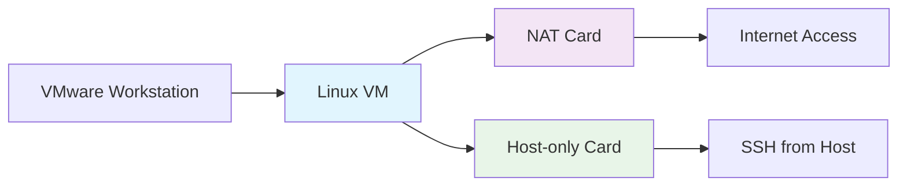

Hướng dẫn này giúp bạn dễ dàng tạo một máy ảo Linux (như Ubuntu hoặc CentOS) trên **VMware Workstation**. Máy ảo sẽ có hai "cổng mạng" (card mạng):

- **NAT:** Để máy ảo truy cập Internet, ví dụ tải phần mềm hoặc cập nhật hệ thống.
- **Host-only:** Để bạn kết nối từ máy thật (host) vào máy ảo qua SSH, như dùng lệnh `ssh` để điều khiển từ xa. Mạng này riêng biệt, an toàn cho thử nghiệm và không có kết nối Internet.

**Lưu ý quan trọng:**
- Hướng dẫn này dành cho máy thật Windows. Nếu dùng Mac/Linux, lệnh kiểm tra mạng khác (dùng `ifconfig` thay `ipconfig`).
- **Luôn tắt hoàn toàn máy ảo** trước khi thay đổi cấu hình network. Backup snapshot VM nếu cần thiết.
- Nếu gặp lỗi, tham khảo phần "Lỗi thường gặp" ở cuối mỗi bước – tổng hợp từ kinh nghiệm thực tế.

Dưới đây là sơ đồ tổng quan quy trình:

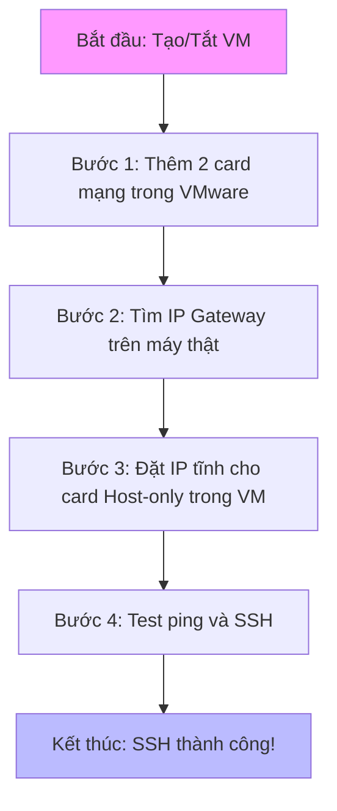

-----

### **Bước 1: Thêm và cấu hình hai card mạng trong VMware**

Bước này như "lắp hai cổng USB" cho máy ảo: Một để, một để kết nối riêng với máy thật.

- **Tắt máy ảo hoàn toàn** (Power Off, không phải Suspend/Pause). Nếu VM không phản hồi, force quit từ Task Manager trên Windows.
- Mở **Settings** của máy ảo (chọn VM > Settings).
- Vào phần **Hardware** > **Network Adapter**. Nếu chưa có hai cái, nhấn **Add** > **Network Adapter** để thêm (thêm lần nữa cho cái thứ hai).
  - **Card 1 (cho Internet):** Chọn **NAT**. Đánh dấu **Connected** và **Connect at power on**. Card này thường gọi là VMnet8 (như một "cầu nối" đến Internet qua máy thật).
  - **Card 2 (cho SSH):** Chọn **Host-only**. Cũng đánh dấu **Connected** và **Connect at power on**. Card này là VMnet1 (mạng riêng giữa máy thật và VM).
- Khởi động VM để kiểm tra: Trong VM, mở Terminal, gõ `ip a` – bạn sẽ thấy hai "interface" (cổng mạng): Một có IP (từ NAT), một chưa có (Host-only).

**Sơ đồ minh họa cấu hình card mạng**

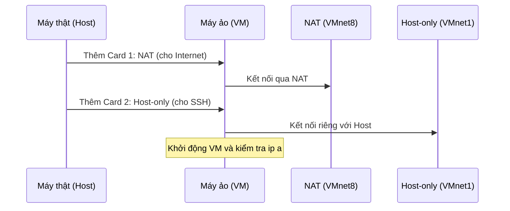

**Khắc phục sự cố:**
- **Không thấy card trong VM:** Kiểm tra VM Settings > Options > Advanced > Boot Options, đảm bảo "Enable VT-x/AMD-V" và "Enable IOMMU" được bật.
- **Mất kết nối sau update VMware:** Restart Windows và khởi động lại VMware services qua services.msc (VMware DHCP Service, VMware NAT Service).
- **Best practice:** Đặt NAT làm adapter đầu tiên để interface name nhất quán (thường ens160 cho NAT, ens224 cho Host-only).

-----

### **Bước 2: Tìm thông số mạng trên máy thật (host)**

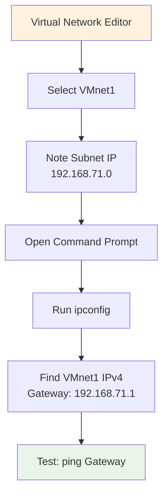

Bây giờ, tìm "địa chỉ nhà" cho mạng Host-only, như tìm số nhà để gửi thư. Cần biết dải IP (như khu phố) và Gateway (như cổng chính của khu).

- Mở **Virtual Network Editor** trong VMware: Vào **Edit** > **Virtual Network Editor** (chạy với quyền admin trên Windows).
- Chọn **VMnet1** (Host-only). Ghi lại:
  - **Subnet IP:** Ví dụ 192.168.71.0 (dải IP chung, như "khu 71").
  - **Subnet Mask:** Thường 255.255.255.0 (quy tắc chia khu).
  - Đảm bảo "Connect a host virtual adapter" được tick (nếu không, máy thật không kết nối được).
- **Tìm Gateway (IP của máy thật trên mạng Host-only):** Không nên đoán từ Editor. Mở **Command Prompt** với quyền admin, gõ `ipconfig /all`.
  - Tìm phần **VMware Network Adapter VMnet1** > **IPv4 Address** (ví dụ: 192.168.71.1). Đây là Gateway!
- Test nhanh: Từ cmd, gõ `ping 192.168.71.1` – nếu thành công, adapter OK.

**Sơ đồ minh họa tìm thông số**

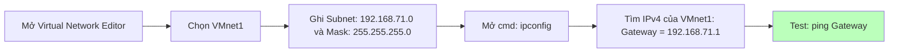

**Khắc phục sự cố:**
- **Không thấy VMnet1 trong ipconfig:** Restart VMware services hoặc recreate VMnet1 trong Virtual Network Editor với quyền admin.
- **Conflict với mạng thật:** Đổi subnet thành dải không trùng (ví dụ 192.168.100.0/24) trong Editor.
- **VPN interference:** Tắt tạm thời VPN clients vì có thể gây xung đột routing table.

-----

### **Bước 3: Đặt IP tĩnh cho card Host-only trong máy ảo**

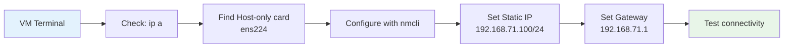

IP tĩnh nghĩa là "địa chỉ cố định" cho card SSH, không thay đổi như DHCP (tự động). Card NAT tự động OK, chỉ cần lo Host-only.

- Trong VM, mở Terminal, gõ `ip a` để tìm tên card Host-only (thường ens224, chưa có IP).
- **Phương pháp khuyến nghị (NetworkManager/nmcli):** Cấu hình qua command line, không cần sửa file trực tiếp.
  - Gõ `nmcli con show` để xem tên connection (ví dụ: "Wired connection 2").
  - Đặt IP (thay ens224 bằng tên thật, IP như 192.168.71.100 – chọn số 2-254, tránh .1):
    ```bash
    sudo nmcli con mod "Wired connection 2" ipv4.method manual ipv4.addresses 192.168.71.100/24 ipv4.gateway 192.168.71.1
    sudo nmcli con mod "Wired connection 2" ipv4.dns "8.8.8.8"
    sudo nmcli con up "Wired connection 2"
    sudo nmcli con mod "Wired connection 2" connection.autoconnect yes  # Tự connect sau reboot
    ```
  - Kiểm tra: `ip a` (thấy IP mới), `ping 8.8.8.8` (test Internet qua NAT).

- **Cách thay thế (sửa file, nếu nmcli không dùng được):** Tạo file `/etc/sysconfig/network-scripts/ifcfg-ens224` với nội dung đơn giản:
  ```
  TYPE=Ethernet
  BOOTPROTO=static
  DEVICE=ens224
  ONBOOT=yes
  IPADDR=192.168.71.100
  NETMASK=255.255.255.0
  GATEWAY=192.168.71.1
  DNS1=8.8.8.8
  ```
  Sau đó: `sudo systemctl restart NetworkManager` hoặc reboot.

**Sơ đồ minh họa đặt IP**

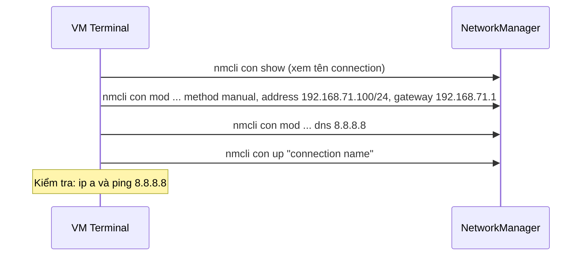

**Khắc phục sự cố:**
- **IP không được assign:** Reboot VM hoặc `sudo nmcli device reapply ens224`. Disable DHCP cho VMnet1 trong Editor nếu có conflict.
- **Mất kết nối Internet:** Đảm bảo NAT adapter vẫn dùng DHCP, không đặt static IP.
- **SELinux blocking (CentOS/RHEL):** Tạm thời: `sudo setenforce 0` hoặc configure proper contexts.

-----

### **Bước 4: Test ping và SSH, sửa lỗi nếu cần**

Bây giờ kiểm tra kết nối: Ping như "gõ cửa", SSH như "vào nhà".

- **Test ping:** Từ máy thật (cmd), gõ `ping 192.168.71.100` (IP của VM). Nếu OK, tiếp tục.
- **Test SSH:** Gõ `ssh root@192.168.71.100` (hoặc user@IP, port 22 mặc định). Nếu dùng PuTTY, nhập IP và connect.

**Sơ đồ kiểm tra SSH**

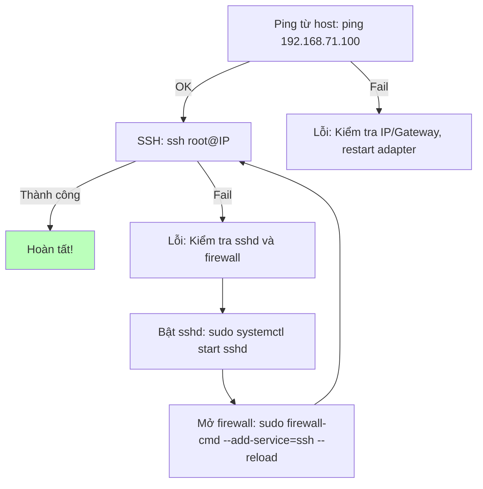

**Khắc phục sự cố phổ biến:**
- Ping OK nhưng SSH fail:
  - **SSHD chưa chạy:** Trong VM, `sudo systemctl status sshd`. Nếu không active: `sudo systemctl enable --now sshd`. Trên Ubuntu: `sudo apt install openssh-server`.
  - **Firewall chặn:** `sudo firewall-cmd --state`. Nếu running: `sudo firewall-cmd --permanent --add-service=ssh && sudo firewall-cmd --reload`. Trên Ubuntu (UFW): `sudo ufw allow ssh`.
  - Tạm tắt firewall test: `sudo systemctl stop firewalld`.
- Không ping được: Kiểm tra IP trùng (dùng `arp -a` trên host) hoặc MTU: Trong VM, `ip link set dev ens224 mtu 1500`.
- Mẹo cộng đồng (từ X/Twitter): Dùng key SSH thay password cho an toàn (tạo key trên host: `ssh-keygen`, copy sang VM). Nếu nhiều VM, đặt IP khác nhau để tránh conflict.

--------------------------------------------------

### **Hướng Dẫn Cài Đặt MongoDB Sharded Cluster**

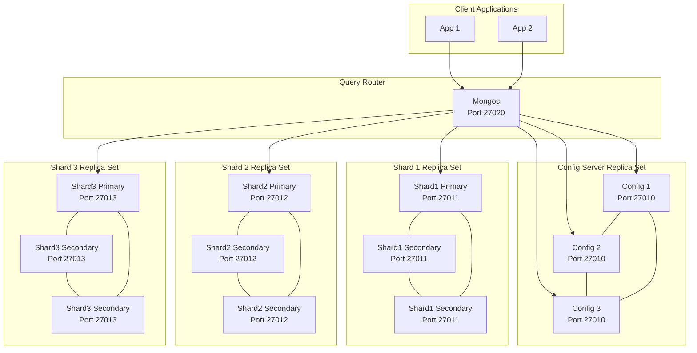

Bài hướng dẫn này sẽ giúp bạn dựng một cụm MongoDB sharding hoàn chỉnh, tập trung vào việc giải thích bản chất và chỉ ra những "bẫy" mà người mới thường gặp.

**Kiến trúc cuối cùng:**
*   **1 Cụm Config Server Replica Set (3 members)**: "Bộ não" lưu trữ metadata của cluster.
*   **3 Cụm Shard Replica Set (mỗi cụm 3 members)**: Nơi lưu trữ và phân tán dữ liệu.
*   **1 Tiến trình Mongos (Query Router)**: Cổng giao tiếp duy nhất cho ứng dụng.

---

### **Giai đoạn 1: Chuẩn bị Môi trường (Làm trên CẢ 3 MÁY)**

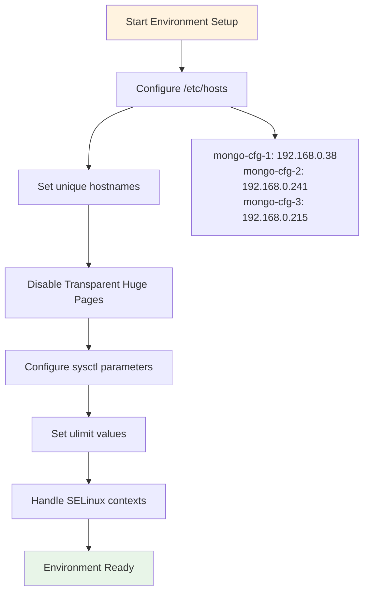

Đây là bước nền tảng quyết định sự ổn định của cả hệ thống.

#### **1. Cấu hình File `/etc/hosts`**

*   **Mục đích:** Dùng hostname (tên dễ nhớ) thay vì IP, giúp cấu hình dễ đọc và quản lý.
*   **Bẫy người mới:** Mỗi máy có file `/etc/hosts` khác nhau hoặc các máy có hostname trùng nhau.
*   **Thực hiện đúng:**
    1.  Mở file: `sudo vi /etc/hosts`
    2.  Thêm các dòng sau vào cuối file. **File hosts trên cả 3 máy phải giống hệt nhau.**
        ```
        # --- Mongo Cluster ---
        192.168.0.38   mongo-cfg-1
        192.168.0.241  mongo-cfg-2
        192.168.0.215  mongo-cfg-3
        ```
    3.  Đặt hostname duy nhất cho từng máy:
        ```bash
        # Trên máy 192.168.0.38
        sudo hostnamectl set-hostname mongo-cfg-1
        # Trên máy 192.168.0.241
        sudo hostnamectl set-hostname mongo-cfg-2
        # Trên máy 192.168.0.215
        sudo hostnamectl set-hostname mongo-cfg-3
        ```

#### **2. Tắt Transparent Huge Pages (THP)**

*   **Mục đích:** THP gây sụt giảm hiệu năng nghiêm trọng cho MongoDB. Phải tắt vĩnh viễn.
*   **Bẫy người mới:** Tắt thủ công và THP tự bật lại khi reboot; sai cấu hình file service.
*   **Thực hiện đúng:**
    1.  Tạo file service: `sudo vi /etc/systemd/system/disable-transparent-huge-pages.service`
    2.  Dán nội dung chính xác sau:
        ```ini
        [Unit]
        Description=Disable Transparent Huge Pages (THP)
        DefaultDependencies=no
        After=sysinit.target local-fs.target
        Before=mongod.service

        [Service]
        Type=oneshot
        ExecStart=/bin/sh -c 'echo never | tee /sys/kernel/mm/transparent_hugepage/enabled > /dev/null; test -e /sys/kernel/mm/transparent_hugepage/defrag && echo never | tee /sys/kernel/mm/transparent_hugepage/defrag > /dev/null'

        [Install]
        WantedBy=multi-user.target
        ```
    3.  Kích hoạt service:
        ```bash
        sudo systemctl daemon-reload
        sudo systemctl start disable-transparent-huge-pages
        sudo systemctl enable disable-transparent-huge-pages
        ```
    4.  Kiểm tra: `cat /sys/kernel/mm/transparent_hugepage/enabled` phải có `[never]`.

#### **3. Tinh chỉnh Kernel (`sysctl`) và Giới hạn (`ulimit`)**

*   **Mục đích:** Cung cấp đủ tài nguyên hệ thống (file, memory, process) cho MongoDB chạy ổn định dưới tải cao.
*   **Bẫy người mới:** Chỉ chạy lệnh `ulimit` tạm thời, bị mất hiệu lực khi reboot.
*   **Thực hiện đúng:**
    1.  Chỉnh sửa file `/etc/sysctl.conf` để tinh chỉnh kernel vĩnh viễn:
        ```bash
        # Thêm vào cuối file /etc/sysctl.conf
        vm.swappiness = 1
        net.ipv4.ip_local_port_range = 1024 65530
        vm.max_map_count=9999999
        fs.file-max=6815744
        kernel.pid_max=64000
        kernel.threads-max=64000
        net.ipv4.tcp_keepalive_time=120
        ```
    2.  Áp dụng ngay: `sudo sysctl -p`
    3.  Tạo file cấu hình `ulimit` vĩnh viễn cho user `mongod` và `root`:
        ```bash
        # Tạo file /etc/security/limits.d/99-mongodb-limits.conf
        mongod   soft   nofile    64000
        mongod   hard   nofile    64000
        mongod   soft   nproc     64000
        mongod   hard   nproc     64000
        root     soft   nofile    64000
        root     hard   nofile    64000
        ```

#### **4. Xử Lý SELinux (Nếu bạn dùng CentOS/RHEL)**

*   **Mục đích:** SELinux có thể chặn `mongod` truy cập thư mục `/data` ngay cả khi quyền file đã đúng.
*   **Bẫy người mới:** Bỏ qua bước này, dẫn đến lỗi "Permission denied" (EACCES) khó hiểu.
*   **Thực hiện đúng:**
    1.  Cài đặt công cụ cần thiết: `sudo yum install policycoreutils-python-utils -y`
    2.  Gán "context" cho thư mục `/data` để `mongod` được phép truy cập:
        ```bash
        sudo semanage fcontext -a -t mongod_var_lib_t "/data(/.*)?"
        sudo restorecon -Rv /data
        ```
    3.  Kiểm tra: `ls -Z /data/mongo-keyfile` phải thấy context `mongod_var_lib_t`.

---

### **Giai đoạn 2: Cài đặt và Chuẩn bị Tài nguyên**

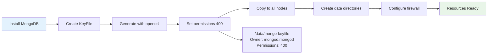

#### **1. Cài đặt MongoDB**

*   **Thực hiện đúng (nếu cài lại từ đầu):**
    ```bash
    sudo yum remove mongodb* -y
    sudo rm -rf /var/log/mongodb /var/lib/mongo /tmp/*.sock
    sudo yum install mongodb-org -y
    rpm -qa | grep mongodb-org # Xác nhận phiên bản 7.0+
    ```

#### **2. Tạo KeyFile (Xác thực nội bộ)**

*   **Mục đích:** Mật khẩu chung để các thành viên trong cluster (mongod, mongos) tin tưởng và giao tiếp với nhau.
*   **Bẫy người mới:** Mỗi máy có keyfile khác nhau; sai quyền sở hữu và permission.
*   **Thực hiện đúng (Làm trên `mongo-cfg-1`, sau đó copy đi):**
    1.  Tạo thư mục và file key:
        ```bash
        sudo mkdir -p /data
        sudo openssl rand -base64 756 | sudo tee /data/mongo-keyfile >/dev/null
        ```
    2.  **Cực kỳ quan trọng:** Đặt đúng chủ sở hữu và quyền:
        ```bash
        sudo chown mongod:mongod /data/mongo-keyfile
        sudo chmod 400 /data/mongo-keyfile
        ```
    3.  Copy keyfile sang 2 máy còn lại và **set lại quyền trên từng máy đó**:
        ```bash
        scp /data/mongo-keyfile root@mongo-cfg-2:/data/
        scp /data/mongo-keyfile root@mongo-cfg-3:/data/
        # Trên mongo-cfg-2 và mongo-cfg-3, chạy lại chown và chmod
        ```
    4.  **Lưu ý Production:** Keyfile phù hợp cho môi trường lab. Trong môi trường production, hãy sử dụng chứng chỉ x.509 để bảo mật cao hơn.

#### **3. Tạo Thư mục Dữ liệu và Log**

*   **Bẫy người mới:** Tạo thư mục bằng `root` và quên `chown`, dẫn đến lỗi "Permission denied".
*   **Thực hiện đúng (Trên CẢ 3 MÁY):**
    ```bash
    sudo mkdir -p /data/config /data/shard1 /data/shard2 /data/shard3
    sudo touch /data/config.log /data/shard1.log /data/shard2.log /data/shard3.log
    sudo chown -R mongod:mongod /data
    sudo chmod 640 /data/*.log
    ```

#### **4. Mở Firewall**

*   **Bẫy người mới:** Thêm rule `--permanent` nhưng quên `--reload`.
*   **Thực hiện đúng (Trên CẢ 3 MÁY):**
    ```bash
    sudo firewall-cmd --add-port=27010-27020/tcp --permanent
    sudo firewall-cmd --reload
    # Nếu không thấy port, kiểm tra zone: sudo firewall-cmd --get-active-zones
    ```

---

### **Giai đoạn 3: Dựng Cụm Config Server**

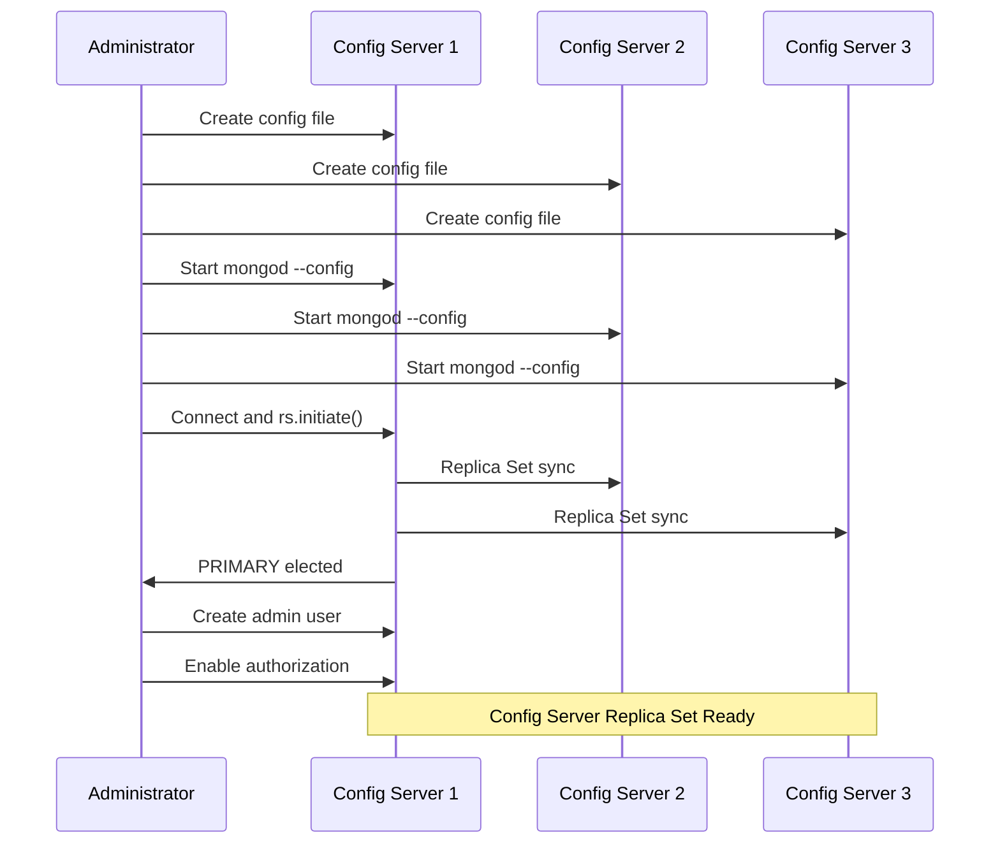

#### **1. Tạo File Cấu hình (Trên CẢ 3 MÁY)**

*   **File `/etc/mongod-config.conf`:**
    ```yaml
    systemLog:
      destination: file
      path: /data/config.log
      logAppend: true
      logRotate: reopen
    storage:
      dbPath: /data/config
    net:
      port: 27010
      bindIp: 0.0.0.0
    security:
      keyFile: /data/mongo-keyfile
      # authorization: enabled  # <-- TẠM THỜI COMMENT ĐỂ BOOTSTRAP
    replication:
       replSetName: "Rep1"
    sharding:
       clusterRole: configsvr
    ```
*   **Bẫy Người Mới:** Vội vàng bật `authorization: enabled`. Điều này sẽ chặn bạn khởi tạo replica set và tạo user admin đầu tiên (vấn đề "con gà quả trứng"). Quy trình đúng là giữ `keyFile` (xác thực nội bộ) nhưng tạm tắt `authorization` (xác thực client).

#### **2. Khởi động Config Server**
*   **Thực hiện đúng (Trên CẢ 3 MÁY):**
    ```bash
    sudo -u mongod /usr/bin/mongod --config /etc/mongod-config.conf --fork
    tail -f /data/config.log # Theo dõi log để tìm "waiting for connections"
    ```
*   **Lưu ý:** `--fork` phù hợp cho lab. Môi trường production nên tạo file unit systemd để quản lý dịch vụ chuyên nghiệp hơn.

#### **3. Khởi tạo Replica Set và Tạo User Admin**

*   **Bẫy người mới:** Tạo user trước khi `initiate`; bối rối vì prompt mặc định là `test>`.
*   **Thực hiện đúng (Chỉ làm trên 1 máy):**
    1.  Kết nối: `mongosh --port 27010`
    2.  Khởi tạo replica set:
        ```javascript
        rs.initiate({
          _id: "Rep1", configsvr: true,
          members: [
            { _id: 0, host: "mongo-cfg-1:27010" },
            { _id: 1, host: "mongo-cfg-2:27010" },
            { _id: 2, host: "mongo-cfg-3:27010" }
          ]
        })
        ```
    3.  **Đợi node lên PRIMARY** (prompt chuyển thành `Rep1 [primary]>`):
        ```javascript
        // Lệnh để chờ tự động
        while (!db.hello().isWritablePrimary) { sleep(1000); print("...waiting for PRIMARY"); }
        ```
    4.  **Khi đã có PRIMARY**, tạo ngay user admin đầu tiên:
        ```javascript
        use admin
        db.createUser({ user: "mongodba", pwd: "<Nhập password>##", roles:[{role: "root", db: "admin"}]})
        ```
    5.  *(Tùy chọn)*: Nếu muốn một node mạnh hơn luôn được ưu tiên làm PRIMARY, bạn có thể chỉnh `priority`. Mặc định không cần thiết.
        ```javascript
        cfg = rs.conf()
        cfg.members[0].priority = 3 // Node mongo-cfg-1 ưu tiên cao nhất
        rs.reconfig(cfg)
        ```
    6.  Thoát khỏi mongosh: `exit`

#### **4. Bật Xác thực và Khởi động lại**

*   **Thực hiện (Trên CẢ 3 MÁY):**
    1.  Sửa file `/etc/mongod-config.conf`, **bỏ comment** dòng `authorization: enabled`.
    2.  Khởi động lại tiến trình một cách an toàn:
        ```bash
        # Gửi tín hiệu SIGTERM (15) để shutdown an toàn, tránh kill -9
        sudo pkill -15 -f "mongod-config.conf"
        sudo -u mongod /usr/bin/mongod --config /etc/mongod-config.conf --fork
        ```
    3.  Kiểm tra đăng nhập bằng tài khoản admin:
        `mongosh --port 27010 -u mongodba -p '<Nhập password>##' --authenticationDatabase admin`

---

### **Giai đoạn 4: Dựng các Cụm Shard**

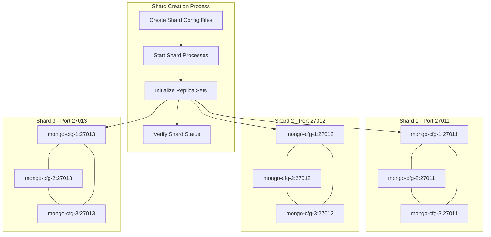

#### **1. Tạo File Cấu hình (Trên CẢ 3 MÁY)**

*   **File `/etc/mongod-shard1.conf` (Tương tự cho shard2, shard3):**
    ```yaml
    systemLog:
      destination: file
      path: /data/shard1.log # Đổi thành shard2.log, shard3.log
      logAppend: true
      logRotate: reopen
    storage:
      dbPath: /data/shard1 # Đổi thành /data/shard2, /data/shard3
    net:
      port: 27011 # Đổi thành 27012, 27013
      bindIp: 0.0.0.0
    security:
      keyFile: /data/mongo-keyfile
      authorization: enabled
    replication:
       replSetName: "shard01" # Đổi thành "shard02", "shard03"
    sharding:
       clusterRole: shardsvr
    ```
*   **Giải thích quan trọng:** Đối với shard, bạn có thể bật `authorization: enabled` ngay từ đầu vì chúng ta **KHÔNG CẦN TẠO USER LOCAL TRÊN SHARD**. Việc xác thực giữa các node đã có `keyFile` lo, còn xác thực client sẽ do `mongos` và `config server` xử lý.

#### **2. Khởi động và Khởi tạo Replica Set cho từng Shard**

*   **Thực hiện (Trên CẢ 3 MÁY):**
    ```bash
    sudo -u mongod /usr/bin/mongod --config /etc/mongod-shard1.conf --fork
    sudo -u mongod /usr/bin/mongod --config /etc/mongod-shard2.conf --fork
    sudo -u mongod /usr/bin/mongod --config /etc/mongod-shard3.conf --fork
    # Kiểm tra: ps -ef | grep mongo phải thấy 4 tiến trình trên mỗi node
    ```
*   **Thực hiện (Chỉ trên 1 máy):** Khởi tạo RS cho từng shard (nhớ đổi port).
    ```bash
    # Initiate cho shard01
    mongosh --port 27011 -c 'rs.initiate({_id: "shard01", members: [{_id: 0, host: "mongo-cfg-1:27011"},{_id: 1, host: "mongo-cfg-2:27011"},{_id: 2, host: "mongo-cfg-3:27011"}]})'
    # Tương tự cho shard02 (port 27012) và shard03 (port 27013)
    ```

---

### **Giai đoạn 5: Dựng Mongos và Hoàn thiện Cluster**

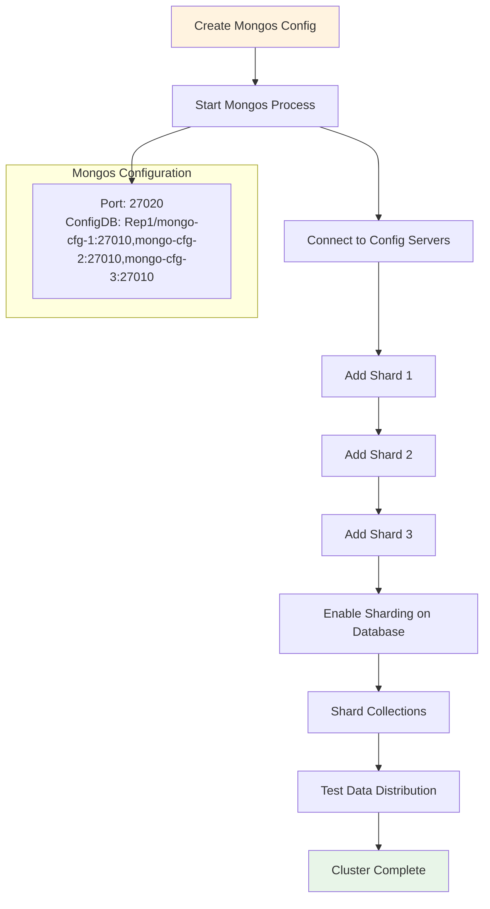

#### **1. Tạo File Cấu hình Mongos (Trên 1 máy)**

*   **File `/etc/mongos.conf`:**
    ```yaml
    systemLog:
      destination: file
      path: /data/mongos.log
      logAppend: true
    net:
      port: 27020
      bindIp: 0.0.0.0
    security:
      keyFile: /data/mongo-keyfile
    sharding:
      configDB: Rep1/mongo-cfg-1:27010,mongo-cfg-2:27010,mongo-cfg-3:27010
    processManagement:
      pidFilePath: /data/mongos.pid
    ```

#### **2. Khởi động Mongos**

```bash
sudo -u mongod /usr/bin/mongos --config /etc/mongos.conf --fork
tail -f /data/mongos.log # Theo dõi log đến khi thấy "connected to config replica set"
```

#### **3. Thêm các Shard vào Cluster**

*   **Thực hiện (Kết nối vào Mongos):**
    ```bash
    mongosh --port 27020 -u mongodba -p '<Nhập password>##' --authenticationDatabase admin
    ```
    Bên trong mongosh:
    ```javascript
    // Dùng định dạng replica set / seed list, hiệu quả hơn
    sh.addShard("shard01/mongo-cfg-1:27011,mongo-cfg-2:27011,mongo-cfg-3:27011")
    sh.addShard("shard02/mongo-cfg-1:27012,mongo-cfg-2:27012,mongo-cfg-3:27012")
    sh.addShard("shard03/mongo-cfg-1:27013,mongo-cfg-2:27013,mongo-cfg-3:27013")
    ```

#### **4. Kích hoạt Sharding và Test**

1.  **Kiểm tra trạng thái:** `sh.status()` sẽ hiển thị các shard đã được thêm.
2.  **Bật sharding cho database:** `sh.enableSharding("testDB")`
3.  **Shard collection với `hashed` key để phân phối đều:**
    ```javascript
    use testDB
    sh.shardCollection("testDB.myCollection", { "_id": "hashed" } )
    ```
4.  **Insert dữ liệu để kiểm tra:**
    ```javascript
    for (var i = 1; i <= 100000; i++) {
      db.myCollection.insertOne({ name: "test_data_" + i });
    }
    db.myCollection.getShardDistribution() // Xem dữ liệu đã được phân phối đều chưa
    ```

---

### **Giai đoạn 6: Debug, Kiểm tra và Lưu ý Production**

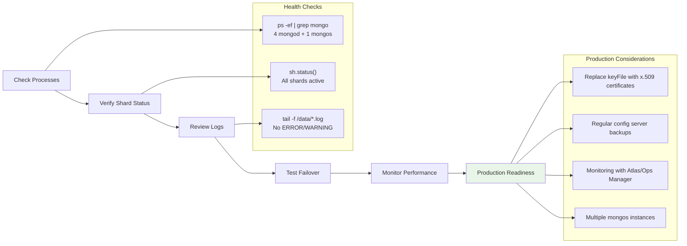

*   **Kiểm tra tổng thể:**
    *   `ps -ef | grep mongo`: Phải có 4 tiến trình `mongod` và 1 tiến trình `mongos` (trên node chạy mongos).
    *   `sh.status()`: Các shard phải ở trạng thái `active`.
*   **Xem Logs:** `tail -n 100 /data/*.log` để tìm lỗi `ERROR` hoặc `WARNING`.
*   **Test Failover:** Thử kill tiến trình PRIMARY của một shard (`sudo pkill -15 -f shard01.conf`) và dùng `rs.status()` trên port của shard đó để xem một node SECONDARY có được bầu lên làm PRIMARY hay không.
*   **Lưu ý Production:**
    *   **Bảo mật:** Thay thế `keyFile` bằng chứng chỉ **x.509** để mã hóa và xác thực mạnh hơn.
    *   **Backup:** Thường xuyên sao lưu `config server` vì nó chứa toàn bộ metadata của cluster.
    *   **Giám sát:** Sử dụng các công cụ như MongoDB Atlas, Ops Manager, hoặc Prometheus để theo dõi sức khỏe hệ thống.
    *   **Mở rộng:** Có thể thêm các instance `mongos` trên các máy khác để cân bằng tải truy vấn.