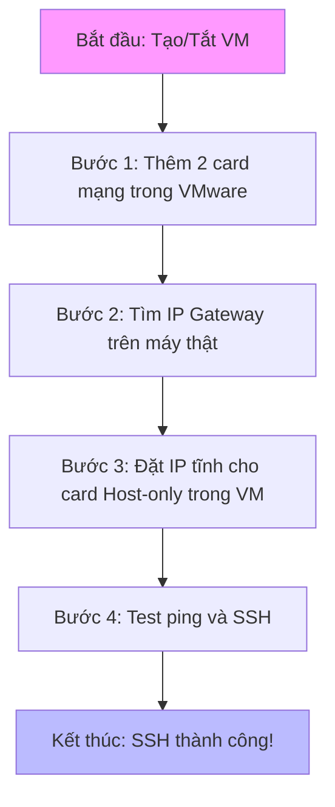
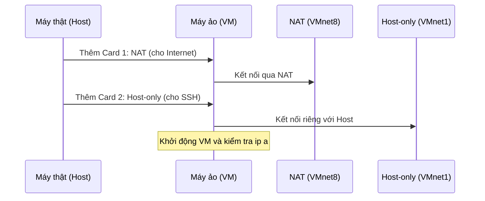
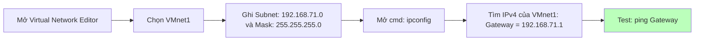
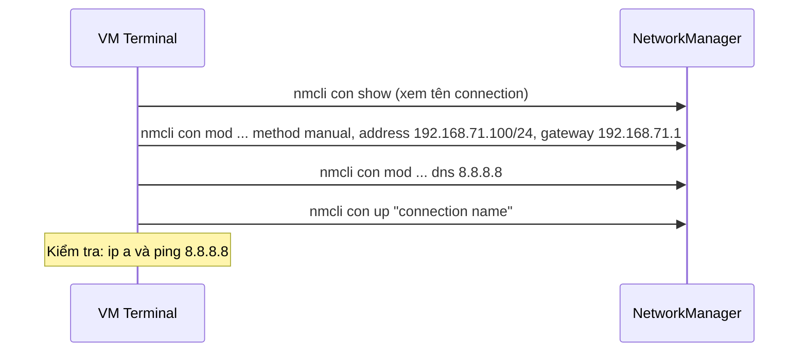
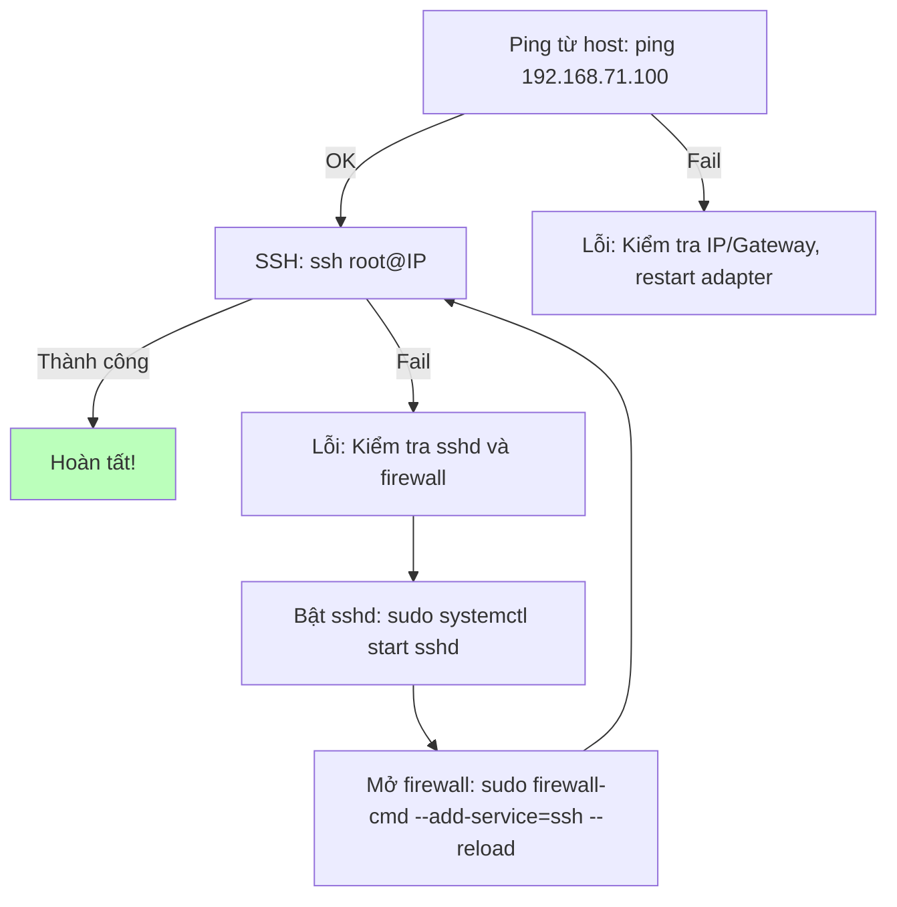

### **Mục tiêu đơn giản**

Hướng dẫn này giúp bạn dễ dàng tạo một máy ảo Linux (như Ubuntu hoặc CentOS) trên **VMware Workstation**. Máy ảo sẽ có hai "cổng mạng" (card mạng):

- **NAT:** Để máy ảo (truy cập Internet), ví dụ tải phần mềm hoặc cập nhật.
- **Host-only:** Để bạn kết nối từ máy thật (host) vào máy ảo qua SSH, như dùng lệnh `ssh` để điều khiển từ xa. Mạng này riêng biệt, an toàn cho thử nghiệm.

**Lưu ý cơ bản:**
- Giả sử máy thật của bạn là Windows. Nếu dùng Mac/Linux, lệnh kiểm tra mạng hơi khác (dùng `ifconfig` thay `ipconfig`).
- Luôn tắt máy ảo trước khi thay đổi. Backup file VM nếu sợ hỏng.
- Nếu gặp lỗi, đọc phần "Lỗi thường gặp" ở cuối mỗi bước – dựa trên chia sẻ từ cộng đồng như Reddit, Stack Overflow.

Dưới đây là sơ đồ tổng quan quy trình:



-----

### **Bước 1: Thêm và cấu hình hai card mạng trong VMware**

Bước này như "lắp hai cổng USB" cho máy ảo: Một để, một để kết nối riêng với máy thật.

- **Tắt máy ảo hoàn toàn** (không chỉ pause, mà power off). Nếu VM kẹt, tắt từ Task Manager trên Windows.
- Mở **Settings** của máy ảo (chọn VM > Settings).
- Vào phần **Hardware** > **Network Adapter**. Nếu chưa có hai cái, nhấn **Add** > **Network Adapter** để thêm (thêm lần nữa cho cái thứ hai).
  - **Card 1 (cho Internet):** Chọn **NAT**. Đánh dấu **Connected** và **Connect at power on**. Card này thường gọi là VMnet8 (như một "cầu nối" đến Internet qua máy thật).
  - **Card 2 (cho SSH):** Chọn **Host-only**. Cũng đánh dấu **Connected** và **Connect at power on**. Card này là VMnet1 (mạng riêng giữa máy thật và VM).
- Khởi động VM để kiểm tra: Trong VM, mở Terminal, gõ `ip a` – bạn sẽ thấy hai "interface" (cổng mạng): Một có IP (từ NAT), một chưa có (Host-only).

**Sơ đồ minh họa cấu hình card mạng**



**Lỗi thường gặp**
- Không thấy card trong VM: Kiểm tra Settings > Options > Advanced > Boot Options, đảm bảo network enable.
- Sau cập nhật VMware, mất kết nối: Restart máy thật và VMware services (tìm trong services.msc trên Windows).
- Mẹo cộng đồng (từ Reddit): Đặt NAT làm card đầu tiên để tránh nhầm tên (ens160 cho NAT, ens224 cho Host-only).

-----

### **Bước 2: Tìm thông số mạng trên máy thật (host)**

Bây giờ, tìm "địa chỉ nhà" cho mạng Host-only, như tìm số nhà để gửi thư. Cần biết dải IP (như khu phố) và Gateway (như cổng chính của khu).

- Mở **Virtual Network Editor** trong VMware: Vào **Edit** > **Virtual Network Editor** (chạy với quyền admin trên Windows).
- Chọn **VMnet1** (Host-only). Ghi lại:
  - **Subnet IP:** Ví dụ 192.168.71.0 (dải IP chung, như "khu 71").
  - **Subnet Mask:** Thường 255.255.255.0 (quy tắc chia khu).
  - Đảm bảo "Connect a host virtual adapter" được tick (nếu không, máy thật không kết nối được).
- **Tìm Gateway (IP của máy thật trên mạng này):** Đừng đoán từ Editor. Mở **Command Prompt** (cmd), gõ `ipconfig`.
  - Tìm phần **VMware Network Adapter VMnet1** > **IPv4 Address** (ví dụ: 192.168.71.1). Đây là Gateway!
- Test nhanh: Từ cmd, gõ `ping 192.168.71.1` – nếu thành công, adapter OK.

**Sơ đồ minh họa tìm thông số**



**Lỗi thường gặp**
- Không thấy VMnet1 trong ipconfig: Restart VMware services hoặc tạo lại VMnet1 trong Editor.
- Conflict IP với mạng WiFi thật: Đổi Subnet thành dải khác (ví dụ 192.168.100.0) trong Editor.
- Mẹo cộng đồng (từ Stack Overflow): Nếu dùng VPN, tắt nó vì gây xung đột.

-----

### **Bước 3: Đặt IP tĩnh cho card Host-only trong máy ảo**

IP tĩnh nghĩa là "địa chỉ cố định" cho card SSH, không thay đổi như DHCP (tự động). Card NAT tự động OK, chỉ cần lo Host-only.

- Trong VM, mở Terminal, gõ `ip a` để tìm tên card Host-only (thường ens224, chưa có IP).
- **Cách dễ nhất (khuyên dùng: nmcli):** Không sửa file, dùng lệnh trực tiếp.
  - Gõ `nmcli con show` để xem tên connection (ví dụ: "Wired connection 2").
  - Đặt IP (thay ens224 bằng tên thật, IP như 192.168.71.100 – chọn số 2-254, tránh .1):
    ```bash
    sudo nmcli con mod "Wired connection 2" ipv4.method manual ipv4.addresses 192.168.71.100/24 ipv4.gateway 192.168.71.1
    sudo nmcli con mod "Wired connection 2" ipv4.dns "8.8.8.8"
    sudo nmcli con up "Wired connection 2"
    sudo nmcli con mod "Wired connection 2" connection.autoconnect yes  # Tự connect sau reboot
    ```
  - Kiểm tra: `ip a` (thấy IP mới), `ping 8.8.8.8` (test Internet qua NAT).

- **Cách thay thế (sửa file, nếu nmcli không dùng được):** Tạo file `/etc/sysconfig/network-scripts/ifcfg-ens224` với nội dung đơn giản:
  ```
  TYPE=Ethernet
  BOOTPROTO=static
  DEVICE=ens224
  ONBOOT=yes
  IPADDR=192.168.71.100
  NETMASK=255.255.255.0
  GATEWAY=192.168.71.1
  DNS1=8.8.8.8
  ```
  Sau đó: `sudo systemctl restart NetworkManager` hoặc reboot.

**Sơ đồ minh họa đặt IP**



**Lỗi thường gặp**
- IP không nhận: Reboot VM hoặc `sudo nmcli device reapply ens224`. Tắt DHCP cho VMnet1 trong Editor nếu conflict.
- Mất Internet (NAT): Đảm bảo card NAT vẫn DHCP, không static.
- Mẹo cộng đồng (từ Reddit): Nếu SELinux chặn (trên CentOS), tạm tắt: `sudo setenforce 0`.

-----

### **Bước 4: Test ping và SSH, sửa lỗi nếu cần**

Bây giờ kiểm tra kết nối: Ping như "gõ cửa", SSH như "vào nhà".

- **Test ping:** Từ máy thật (cmd), gõ `ping 192.168.71.100` (IP của VM). Nếu OK, tiếp tục.
- **Test SSH:** Gõ `ssh root@192.168.71.100` (hoặc user@IP, port 22 mặc định). Nếu dùng PuTTY, nhập IP và connect.

**Sơ đồ kiểm tra SSH**



**Lỗi thường gặp (chiếm 80% trường hợp):**
- Ping OK nhưng SSH fail:
  - **SSHD chưa chạy:** Trong VM, `sudo systemctl status sshd`. Nếu không active: `sudo systemctl enable --now sshd`. Trên Ubuntu: `sudo apt install openssh-server`.
  - **Firewall chặn:** `sudo firewall-cmd --state`. Nếu running: `sudo firewall-cmd --permanent --add-service=ssh && sudo firewall-cmd --reload`. Trên Ubuntu (UFW): `sudo ufw allow ssh`.
  - Tạm tắt firewall test: `sudo systemctl stop firewalld`.
- Không ping được: Kiểm tra IP trùng (dùng `arp -a` trên host) hoặc MTU: Trong VM, `ip link set dev ens224 mtu 1500`.
- Mẹo cộng đồng (từ X/Twitter): Dùng key SSH thay password cho an toàn (tạo key trên host: `ssh-keygen`, copy sang VM). Nếu nhiều VM, đặt IP khác nhau để tránh conflict.
