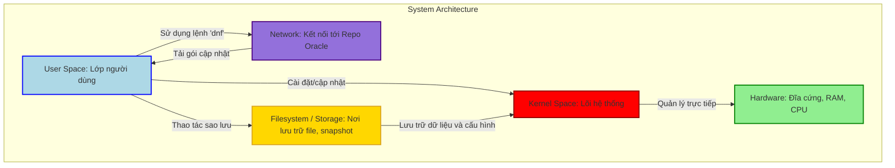
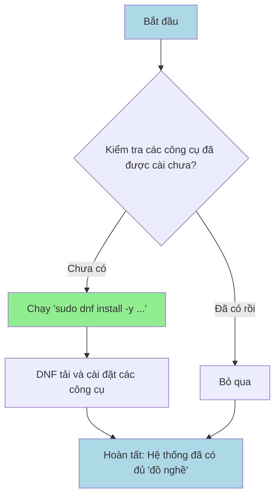
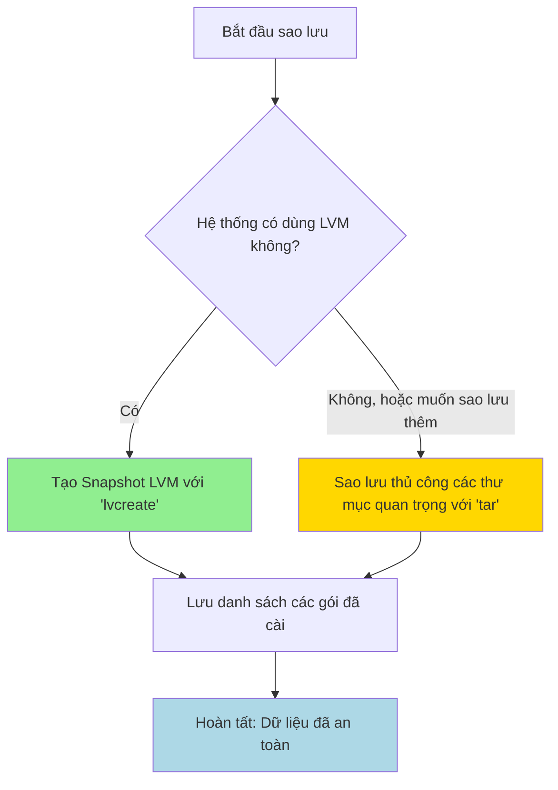
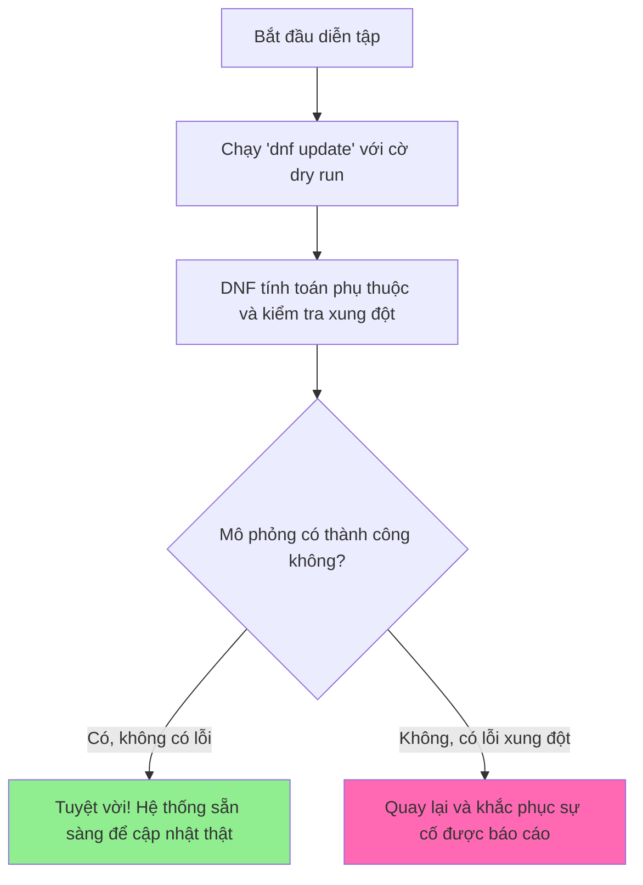

### **Hướng Dẫn Siêu Chi Tiết Và Dễ Hiểu Về Quy Trình Cập Nhật Hệ Thống An Toàn Trên Oracle Linux 8**
*(Dành Riêng Cho Người Mới Bắt Đầu, Với Giải Thích Sâu Sắc Về Bản Chất)*

Chào bạn! Chúng ta sẽ cùng nhau đi qua từng bước một cách chậm rãi, cẩn thận để cập nhật hệ thống Oracle Linux 8 của bạn một cách an toàn nhất. Hãy tưởng tượng rằng hệ điều hành của bạn là một cỗ máy phức tạp, và việc cập nhật giống như bảo dưỡng định kỳ. Nếu làm sai, máy có thể hỏng. Hướng dẫn này chính là cuốn sổ tay kỹ thuật chi tiết để bạn thực hiện việc bảo dưỡng đó một cách chính xác.

**Oracle Linux 8 là gì?** Nó là một phiên bản (distro) của hệ điều hành Linux do Oracle phát hành, được xây dựng dựa trên mã nguồn của Red Hat Enterprise Linux (RHEL) 8. Vì tính ổn định và sự hỗ trợ mạnh mẽ từ Oracle, nó thường được sử dụng cho các máy chủ quan trọng. Một trong những điểm đặc biệt của nó là "Unbreakable Enterprise Kernel" (UEK), một phiên bản kernel được Oracle tùy chỉnh để tối ưu hiệu suất.

**Bản chất của việc cập nhật là gì?** Hệ thống Linux quản lý phần mềm dưới dạng các "gói" (packages). Công cụ `DNF` (Dandified YUM) hoạt động như một người quản lý kho hàng thông minh. Nó kết nối với các "kho lưu trữ" (repositories hay repo) trực tuyến của Oracle, tải về các gói phần mềm mới nhất, kiểm tra sự tương thích và các "phụ thuộc" (dependencies) – ví dụ, gói A cần gói B để hoạt động – rồi tiến hành cài đặt. Một quy trình cập nhật an toàn là quy trình giảm thiểu mọi rủi ro: không làm mất dữ liệu, không gây gián đoạn dịch vụ và quan trọng nhất là không làm hỏng hệ thống (ví dụ: không thể khởi động lại được).

---

#### **Sơ Đồ Mermaid Tổng Quan Về Cấu Trúc Hệ Thống Oracle Linux 8 (Để Bạn Hình Dung Bức Tranh Lớn)**

Trước khi bắt đầu, hãy nhìn vào sơ đồ này. Nó mô tả cách các thành phần trong Oracle Linux tương tác với nhau. Việc hiểu sơ đồ này sẽ giúp bạn hình dung được tại sao chúng ta lại thực hiện các bước theo trình tự như vậy.

*   **Màu xanh dương (User Space):** Là lớp mà bạn, người dùng, tương tác trực tiếp qua các dòng lệnh như `dnf`.
*   **Màu tím (Network):** Đại diện cho kết nối Internet đến các kho lưu trữ của Oracle để tải các gói cập nhật.
*   **Màu vàng (Filesystem/Storage):** Là nơi lưu trữ tất cả các file của bạn, từ file cấu hình hệ thống đến dữ liệu cá nhân. Đây là nơi chúng ta thực hiện sao lưu.
*   **Màu đỏ (Kernel Space):** Đây là "bộ não" của hệ điều hành, là lõi quản lý trực tiếp phần cứng (CPU, RAM, đĩa cứng). Cập nhật kernel là một thao tác nhạy cảm, có rủi ro cao nếu thực hiện không đúng cách.
*   **Màu xanh lá (Hardware):** Là các thiết bị vật lý của máy tính.



**Giải thích sơ đồ:** Khi bạn gõ một lệnh cập nhật (ở User Space), `dnf` sẽ kết nối mạng (Network) để tìm và tải gói mới. Trước đó, bạn nên sao lưu dữ liệu trên hệ thống file (Filesystem). Quá trình cập nhật sẽ thay đổi các tệp trên Filesystem và có thể cập nhật cả Kernel. Một khi Kernel được cập nhật, hệ thống cần phải khởi động lại để "bộ não" mới được nạp và hoạt động.

Bây giờ, hãy đi vào từng bước cụ thể.

---

### **Bước 0: Chuẩn Bị "Đồ Nghề" - Cài Đặt Các Plugins Và Công Cụ Cần Thiết**

**Giải thích sâu về bản chất:** Hãy tưởng tượng `dnf` là một người thợ sửa xe. Mặc định, anh ta chỉ có những công cụ cơ bản. Để thực hiện một cuộc "đại tu" an toàn, anh ta cần thêm các công cụ chuyên dụng. Các plugins chính là những công cụ đó.
*   `dnf-plugins-core`: Cung cấp các lệnh hữu ích như `needs-restarting` để kiểm tra xem hệ thống có cần khởi động lại sau khi cập nhật hay không. Về bản chất, plugin này "móc" (hook) vào DNF để quét các thư viện đang chạy trong bộ nhớ và so sánh với phiên bản trên đĩa.
*   `python3-dnf-plugin-versionlock`: Cho phép bạn "khóa" một gói phần mềm ở phiên bản hiện tại, ngăn nó tự động cập nhật. Điều này cực kỳ quan trọng khi bạn có một ứng dụng chỉ tương thích với một phiên bản cụ thể của một thư viện. Về bản chất, nó tạo ra một danh sách "cấm cập nhật".
*   `lvm2`: Cần thiết để quản lý LVM (Logical Volume Manager), một công nghệ cho phép tạo các "ảnh chụp nhanh" (snapshots) của hệ thống file, giúp việc sao lưu và phục hồi trở nên dễ dàng hơn rất nhiều.
*   `rsync` và `tar`: Là các công cụ sao lưu file mạnh mẽ.

**Lệnh cụ thể:**
Mở terminal và chạy lệnh sau. Lệnh này sẽ cài đặt tất cả các công cụ cần thiết.

```bash
sudo dnf install -y dnf-plugins-core python3-dnf-plugin-versionlock lvm2 rsync tar
```

*   `sudo`: Thực hiện lệnh với quyền quản trị viên (root), vì cài đặt phần mềm là một thay đổi ở cấp hệ thống.
*   `dnf install`: Lệnh để cài đặt gói phần mềm.
*   `-y`: Tự động trả lời "yes" cho tất cả các câu hỏi xác nhận, giúp lệnh chạy một mạch mà không cần bạn can thiệp.

**Mô tả output để bạn hình dung:**
Terminal sẽ hiển thị tiến trình: tìm kho lưu trữ nhanh nhất, liệt kê các gói sẽ được cài đặt cùng với các phụ thuộc của chúng, tải chúng về, và cuối cùng là cài đặt. Nếu mọi thứ thành công, bạn sẽ thấy dòng chữ "Complete!". Nếu các gói đã được cài đặt từ trước, nó sẽ báo "Package ... is already installed. Nothing to do."

**Tại sao dùng lệnh này mà không dùng lệnh khác?**
Chúng ta dùng `dnf install` vì nó tự động xử lý các phụ thuộc, một công việc rất phức tạp nếu làm thủ công bằng `rpm -i`. Chúng ta không dùng `yum` vì trên Oracle Linux 8, `yum` thực chất chỉ là một tên gọi khác (alias) của `dnf`, và sử dụng `dnf` là cách làm chuẩn cho tương lai.

**Sai lầm thường gặp:**
*   **Quên `sudo`:** Lệnh sẽ báo lỗi "permission denied" (từ chối quyền truy cập) vì người dùng thông thường không có quyền cài đặt phần mềm hệ thống.
*   **Nghĩ rằng các plugin này không cần thiết:** Bỏ qua bước này sẽ khiến bạn không thể thực hiện các bước an toàn sau này, ví dụ như không thể khóa phiên bản kernel hoặc không thể tạo snapshot LVM.

**Sơ đồ Mermaid cho Bước 0:**



---

### **Bước 1: Sao Lưu Hệ Thống - "Tấm Khiên" Quan Trọng Nhất**

**Giải thích sâu về bản chất:** Đây là bước quan trọng tuyệt đối, không bao giờ được bỏ qua. Cập nhật hệ thống luôn tiềm ẩn rủi ro nhỏ rằng có gì đó sẽ đi sai hướng. Một bản sao lưu tốt giống như một nút "hoàn tác" khổng lồ cho toàn bộ hệ thống của bạn. Có hai phương pháp chính:
1.  **Snapshot (Ảnh chụp nhanh):** Nếu bạn dùng LVM, bạn có thể tạo một "snapshot". Hãy tưởng tượng nó như việc bạn đóng băng hệ thống tại một thời điểm. Mọi thay đổi sau đó sẽ được ghi vào một nơi riêng. Nếu có lỗi, bạn chỉ cần xóa các thay đổi và quay lại trạng thái "đóng băng" ban đầu. Về bản chất, snapshot LVM sử dụng cơ chế "copy-on-write": nó không nhân đôi toàn bộ dữ liệu ngay lập tức, mà chỉ sao chép một khối dữ liệu khi khối đó bị thay đổi lần đầu tiên. Điều này giúp tạo snapshot rất nhanh và tiết kiệm dung lượng.
2.  **Sao lưu thủ công (tar/rsync):** Nếu không có LVM, bạn sẽ sao lưu các thư mục quan trọng. Đặc biệt là `/etc` (chứa tất cả file cấu hình hệ thống) và `/home` (chứa dữ liệu người dùng). `tar` sẽ đóng gói và nén các thư mục này lại thành một file duy nhất.

**Các lệnh cụ thể và giải thích:**

**1. Nếu bạn dùng LVM (nên ưu tiên):**

*   **Kiểm tra xem bạn có đang dùng LVM không:**
    ```bash
    lsblk
    ```
    Nếu bạn thấy `lvm` trong cột `TYPE` của một phân vùng nào đó, thì bạn đang dùng LVM.

*   **Tạo một snapshot:** (Thay `/dev/ol/root` bằng đường dẫn đến logical volume của bạn)
    ```bash
    # Ví dụ tạo snapshot 5GB tên là root_snap_20250829
    sudo lvcreate -s -L 5G -n root_snap_20250829 /dev/ol/root
    ```
    *   `-s`: Chỉ định rằng đây là một snapshot.
    *   `-L 5G`: Cấp phát 5GB dung lượng cho snapshot để lưu các thay đổi.
    *   `-n root_snap_20250829`: Đặt tên cho snapshot (nên có ngày tháng).

**2. Nếu không dùng LVM, hoặc muốn sao lưu thêm:**

*   **Tạo một thư mục để chứa các file sao lưu:**
    ```bash
    mkdir ~/backup_20250829
    ```

*   **Sao lưu thư mục `/etc`:**
    ```bash
    sudo tar -czvf ~/backup_20250829/etc_backup.tar.gz /etc
    ```
    *   `-c`: Tạo một file archive mới.
    *   `-z`: Nén bằng gzip.
    *   `-v`: Hiển thị chi tiết (verbose) các file đang được xử lý.
    *   `-f`: Chỉ định tên file đầu ra.

*   **Lưu danh sách các gói đã cài đặt:** Đây là thông tin cực kỳ hữu ích để khôi phục lại hệ thống.
    ```bash
    rpm -qa | sort > ~/backup_20250829/installed_packages.txt
    ```

**Mô tả output để bạn hình dung:**
*   Lệnh `lvcreate` sẽ báo "Logical volume "root_snap_20250829" created."
*   Lệnh `tar` sẽ liệt kê một danh sách dài các file trong thư mục `/etc` khi nó đang đóng gói chúng.

**Tại sao dùng lệnh này mà không dùng lệnh khác?**
*   Snapshot LVM nhanh và hiệu quả hơn nhiều so với việc sao chép toàn bộ file, đặc biệt với các hệ thống lớn.
*   `tar` được ưa chuộng hơn `cp` (copy) vì nó bảo toàn quyền sở hữu và quyền truy cập của file, đồng thời có thể nén dữ liệu để tiết kiệm dung lượng.
*   `rsync` rất tốt cho việc sao lưu ra một nơi khác (offsite backup) vì nó chỉ sao chép những phần đã thay đổi (incremental backup), giúp tiết kiệm băng thông.

**Sai lầm thường gặp:**
*   **Sao lưu mà không có `sudo`:** Bạn sẽ không thể đọc được các file hệ thống quan trọng trong `/etc`, dẫn đến một bản sao lưu không đầy đủ và vô dụng.
*   **Cấp phát quá ít dung lượng cho snapshot:** Nếu có quá nhiều thay đổi trong quá trình cập nhật, dung lượng snapshot có thể bị đầy, làm cho snapshot trở nên vô hiệu.
*   **Không kiểm tra lại file sao lưu:** Sau khi tạo file `tar`, hãy thử dùng lệnh `tar -tvf <tên_file>` để xem nội dung bên trong, đảm bảo nó không bị lỗi.

**Sơ đồ Mermaid cho Bước 1:**



---

### **Bước 2: Khám Phá - Kiểm Tra Các Bản Cập Nhật Có Sẵn**

**Giải thích sâu về bản chất:** Trước khi lao vào cập nhật, chúng ta cần phải biết mình sắp đối mặt với những gì. Bước này giống như việc một bác sĩ xem bệnh án trước khi phẫu thuật. Chúng ta sẽ kiểm tra:
*   **Có những gói nào cần cập nhật?**
*   **Chúng đến từ kho lưu trữ (repo) nào?**
*   **Các kho đó có đáng tin cậy không?** Điều này được xác minh bằng chữ ký số GPG. Về bản chất, mỗi gói phần mềm từ Oracle đều được "ký" bằng một khóa bí mật. Hệ thống của bạn có khóa công khai tương ứng để kiểm tra xem chữ ký đó có hợp lệ không. Nếu không, gói đó có thể đã bị ai đó thay đổi trên đường truyền, rất nguy hiểm.

**Lệnh cụ thể:**

*   **Liệt kê các bản cập nhật có sẵn:**
    ```bash
    sudo dnf check-update
    ```

*   **Kiểm tra danh sách các kho lưu trữ (repo) đang được kích hoạt:**
    ```bash
    sudo dnf repolist
    ```
    Để xem thông tin chi tiết hơn, bao gồm cả việc GPG check có được bật hay không:
    ```bash
    grep -E '^\\[|name=|enabled=|gpgcheck=' /etc/yum.repos.d/*.repo
    ```
    Bạn cần đảm bảo `enabled=1` và `gpgcheck=1` cho các repo chính thức của Oracle.

*   **Kiểm tra "sức khỏe" hệ thống gói:**
    ```bash
    # Tìm các phụ thuộc không được đáp ứng
    sudo dnf repoquery --unsatisfied
    # Tìm các gói bị trùng lặp phiên bản
    sudo dnf repoquery --duplicates
    ```
    Nếu lệnh `repoquery` có kết quả, bạn cần phải xử lý chúng trước khi tiếp tục. Ví dụ, để xóa các gói trùng lặp: `sudo dnf remove --duplicates`.

**Mô tả output để bạn hình dung:**
*   `dnf check-update` sẽ hiển thị một danh sách các gói, ví dụ:
    ```
    kernel.x86_64        5.4.17-2136.320.7.el8uek   ol8_UEKR6
    openssl-libs.x86_64  1:1.1.1k-12.el8_9          ol8_baseos_latest
    ```
    Mỗi dòng gồm: Tên gói, phiên bản mới, và kho lưu trữ chứa nó.
*   `dnf repoquery --unsatisfied` nếu không có vấn đề gì sẽ không hiện ra kết quả nào. Đây là một dấu hiệu tốt.

**Tại sao dùng lệnh này mà không dùng lệnh khác?**
`dnf check-update` chỉ tải về siêu dữ liệu (metadata – thông tin về các gói), rất nhẹ và nhanh. Nó không tải toàn bộ các gói về, giúp bạn tiết kiệm thời gian và băng thông ở bước kiểm tra.

**Sai lầm thường gặp:**
*   **Bỏ qua việc kiểm tra GPG:** Nếu `gpgcheck=0`, bạn đang đặt hệ thống vào tình trạng rủi ro, vì có thể cài đặt phải các gói không được xác thực.
*   **Phớt lờ các cảnh báo từ `repoquery`:** Cố gắng cập nhật khi hệ thống đang có các gói bị lỗi phụ thuộc hoặc trùng lặp thường sẽ dẫn đến thất bại giữa chừng.

**Sơ đồ Mermaid cho Bước 2:**

```mermaid
flowchart TD
    A[Bắt đầu kiểm tra] --> B[Chạy 'dnf check-update' để xem danh sách cập nhật]
    B --> C[Kiểm tra Repositories và GPG Keys]
    C --> D{Hệ thống có gói bị lỗi (trùng lặp/thiếu phụ thuộc)?}
    D -->|Có| E[Xử lý lỗi, ví dụ: 'dnf remove --duplicates']
    D -->|Không| F[Hệ thống sẵn sàng để mô phỏng]
    E --> F

    style B fill:#ADD8E6
    style E fill:#FF69B4
    style F fill:#90EE90```

---
*Các bước tiếp theo sẽ được trình bày với cấu trúc tương tự để đảm bảo tính nhất quán và dễ hiểu.*

### **Bước 3: Diễn Tập - Chạy "Dry Run" Để Mô Phỏng Quá Trình Cập Nhật**

**Giải thích sâu về bản chất:** "Dry run" (chạy thử) là một trong những tính năng an toàn và mạnh mẽ nhất của DNF. Khi bạn thực hiện một dry run, DNF sẽ làm tất cả mọi việc của một quá trình cập nhật thật sự—tính toán phụ thuộc, kiểm tra xung đột, xác định các gói cần tải—NHƯNG nó sẽ dừng lại ngay trước khi thực sự thay đổi bất cứ file nào trên hệ thống của bạn. Đây là bước "nhìn trước tương lai" để đảm bảo mọi thứ sẽ diễn ra suôn sẻ.

**Lệnh cụ thể:**

```bash
sudo dnf update --assumeno
```hoặc một cách khác mạnh mẽ hơn là:
```bash
sudo dnf update -y --setopt=tsflags=test
```

*   `--assumeno`: Tự động trả lời "no" cho câu hỏi xác nhận cuối cùng, do đó nó sẽ hiển thị toàn bộ kế hoạch và sau đó hủy bỏ.
*   `--setopt=tsflags=test`: Cờ này báo cho DNF thực hiện một "transaction test". Nó sẽ tải các gói về bộ nhớ đệm nhưng không cài đặt, đây là cách mô phỏng chính xác nhất.

**Mô tả output để bạn hình dung:**
Terminal sẽ hiển thị một bảng tóm tắt rất chi tiết, bao gồm:
*   Các gói sẽ được cài đặt (Installing).
*   Các gói sẽ được nâng cấp (Upgrading).
*   Tổng dung lượng cần tải về.
Cuối cùng, thay vì thực hiện, nó sẽ báo "Transaction test succeeded." hoặc "Exiting on user command." mà không thay đổi gì hệ thống của bạn. Nếu có xung đột, nó sẽ báo lỗi ngay tại đây.

**Tại sao dùng lệnh này mà không dùng lệnh khác?**
Việc chạy dry run an toàn hơn nhiều so với việc chạy thẳng lệnh `dnf update` và hy vọng mọi thứ ổn. Nó cho bạn cơ hội để phát hiện và sửa lỗi trước khi chúng gây ra vấn đề thực sự.

**Sai lầm thường gặp:**
*   **Bỏ qua bước này:** Nhiều người, đặc biệt là khi đã quen, thường bỏ qua dry run để tiết kiệm thời gian. Đây là một thói quen xấu có thể dẫn đến hậu quả nghiêm trọng khi một bản cập nhật phức tạp gây ra xung đột không lường trước.
*   **Không đọc kỹ output:** Dry run có thể đưa ra các cảnh báo quan trọng. Nếu bạn chỉ nhìn dòng cuối cùng mà không đọc phần tóm tắt, bạn có thể bỏ lỡ thông tin về một gói sắp bị gỡ bỏ hoặc một xung đột tiềm tàng.

**Sơ đồ Mermaid cho Bước 3:**


---
### **Bước 4: Thực Hiện - Chạy Cập Nhật Thật Sự**

**Giải thích sâu về bản chất:** Sau khi đã chuẩn bị kỹ lưỡng, sao lưu cẩn thận và diễn tập thành công, giờ là lúc thực hiện cập nhật. Có một mẹo nhỏ để tăng thêm độ an toàn: thay vì cập nhật qua một phiên SSH (kết nối từ xa), bạn nên thực hiện nó trực tiếp trên console của máy (TTY). Lý do là nếu kết nối mạng bị gián đoạn giữa chừng trong một phiên SSH, quá trình cập nhật có thể bị treo, để lại hệ thống trong một trạng thái không ổn định. Console vật lý không phụ thuộc vào mạng.

**Lệnh cụ thể:**

1.  **(Khuyến nghị) Chuyển sang console vật lý:**
    Nhấn tổ hợp phím `Ctrl + Alt + F3` (hoặc F2, F4, F5, F6) để chuyển sang một màn hình terminal dạng văn bản. Đăng nhập bằng tài khoản của bạn.

2.  **Chạy lệnh cập nhật:**
    ```bash
    sudo dnf update -y
    ```
    Bây giờ, DNF sẽ thực hiện chính xác những gì nó đã lên kế hoạch trong bước dry run: tải các gói, xác minh chữ ký GPG, và cài đặt chúng.

3.  **(Tùy chọn) Chỉ cập nhật các bản vá bảo mật:**
    Nếu bạn chỉ muốn áp dụng các bản vá lỗi bảo mật quan trọng nhất mà không thay đổi tính năng, hãy dùng lệnh:
    ```bash
    sudo dnf update --security -y
    ```
    Đây là một cách tiếp cận thận trọng và được khuyến nghị cho các máy chủ sản xuất.

**Mô tả output để bạn hình dung:**
Bạn sẽ thấy một loạt các dòng chữ cho biết tiến trình tải xuống và cài đặt của từng gói, kèm theo thanh tiến trình. Cuối cùng, khi mọi thứ hoàn tất, bạn sẽ thấy dòng chữ "Complete!".

**Tại sao dùng lệnh này mà không dùng lệnh khác?**
Sử dụng console vật lý là tiêu chuẩn vàng cho các thao tác hệ thống quan trọng. `dnf update --security` là lựa chọn tốt hơn so với `dnf update` đầy đủ trên các hệ thống yêu cầu sự ổn định tối đa, vì nó giảm thiểu số lượng thay đổi.

**Sai lầm thường gặp:**
*   **Cập nhật qua kết nối Wi-Fi không ổn định:** Rủi ro mất kết nối là rất cao.
*   **Mất kiên nhẫn và tắt tiến trình giữa chừng (Ctrl+C):** Đây là điều tồi tệ nhất bạn có thể làm. Nó có thể làm hỏng cơ sở dữ liệu RPM và để lại hệ thống với các gói được cài đặt một nửa, rất khó để sửa chữa.

**Sơ đồ Mermaid cho Bước 4:**

```mermaid
flowchart TD
    A[Bắt đầu cập nhật] --> B[Chuyển sang Console vật lý (TTY)]
    B --> C[Chạy lệnh 'sudo dnf update -y']
    C --> D[DNF tải và cài đặt các gói]
    D --> E[Hoàn tất cập nhật]

    style B fill:#FFD700
    style E fill:#90EE90
```
---
### **Bước 5: Dọn Dẹp và Kiểm Tra Sau Cùng**

**Giải thích sâu về bản chất:** Sau khi "cuộc phẫu thuật" kết thúc, chúng ta cần kiểm tra lại "bệnh nhân" và dọn dẹp phòng mổ. Việc này bao gồm kiểm tra xem có cần khởi động lại không và loại bỏ các gói không cần thiết nữa.

**Lệnh cụ thể:**

1.  **Kiểm tra xem có cần khởi động lại không:**
    ```bash
    sudo dnf needs-restarting -r
    ```
    Về bản chất, lệnh này kiểm tra xem kernel hoặc các thư viện hệ thống cốt lõi (như glibc, systemd) có vừa được cập nhật hay không. Nếu có, những thay đổi này chỉ có hiệu lực sau khi bạn khởi động lại.

2.  **Khởi động lại (nếu cần):**
    ```bash
    sudo reboot
    ```

3.  **Sau khi khởi động lại, xác minh phiên bản kernel mới:**
    ```bash
    uname -r
    ```
    Lệnh này sẽ hiển thị phiên bản kernel đang chạy. Hãy so sánh nó với phiên bản kernel đã được cập nhật để chắc chắn rằng bạn đã khởi động vào kernel mới.

4.  **Dọn dẹp các gói cũ không cần thiết:**
    ```bash
    sudo dnf autoremove -y
    ```
    Lệnh này sẽ tìm và gỡ bỏ các gói được cài đặt dưới dạng phụ thuộc nhưng không còn được bất kỳ gói nào khác sử dụng nữa (ví dụ: các kernel cũ, trừ 2-3 phiên bản gần nhất được giữ lại để dự phòng).

**Mô tả output để bạn hình dung:**
*   `needs-restarting -r` sẽ báo "Reboot is required to fully apply updates." nếu cần khởi động lại.
*   `uname -r` sẽ in ra một chuỗi như `5.4.17-2136.320.7.el8uek.x86_64`.
*   `dnf autoremove` sẽ liệt kê các gói nó sắp gỡ bỏ và sau đó báo "Complete!".

**Tại sao dùng lệnh này mà không dùng lệnh khác?**
`dnf needs-restarting` là cách tự động và chính xác để biết có cần reboot hay không, thay vì phải đoán mò. `dnf autoremove` an toàn hơn việc xóa các gói cũ bằng tay, vì nó đảm bảo không xóa nhầm một gói vẫn còn đang được sử dụng.

**Sai lầm thường gặp:**
*   **Không khởi động lại khi được yêu cầu:** Hệ thống của bạn sẽ tiếp tục chạy trên kernel cũ và các thư viện cũ trong bộ nhớ, trong khi các ứng dụng mới có thể mong đợi các phiên bản mới trên đĩa. Điều này có thể gây ra các lỗi lạ và các lỗ hổng bảo mật chưa được vá.
*   **Xóa kernel cũ bằng tay:** Việc này có thể nguy hiểm. DNF được cấu hình để luôn giữ lại một vài phiên bản kernel cũ. Nếu kernel mới có vấn đề, bạn vẫn có thể chọn khởi động vào một kernel cũ từ menu boot (GRUB).

**Sơ đồ Mermaid cho Bước 5:**

```mermaid
flowchart TD
    A[Cập nhật đã xong] --> B{Cần khởi động lại không?}
    B -->|Có| C[Chạy 'sudo reboot']
    C --> D[Sau khi boot, xác minh kernel mới]
    B -->|Không| D
    D --> E[Chạy 'dnf autoremove' để dọn dẹp]
    E --> F[Hoàn tất! Hệ thống đã được cập nhật và sạch sẽ]

    style C fill:#FF69B4
    style F fill:#90EE90```
---
### **Bước 6: Kế Hoạch B - Phục Hồi Nếu Có Sự Cố**

**Giải thích sâu về bản chất:** Mặc dù chúng ta đã rất cẩn thận, nhưng đôi khi vẫn có sự cố xảy ra (ví dụ: một bản cập nhật gây ra lỗi tương thích với phần mềm của bạn). Đây là lúc bản sao lưu ở Bước 1 phát huy tác dụng.

**Phương án phục hồi:**

1.  **Sử dụng Snapshot LVM (nếu có):**
    Đây là cách nhanh nhất. Bạn chỉ cần khởi động lại máy bằng một đĩa cứu hộ (live CD/USB), sau đó dùng lệnh `lvconvert` để hợp nhất snapshot trở lại volume gốc, thực chất là loại bỏ tất cả các thay đổi kể từ lúc tạo snapshot.
    ```bash
    # Lệnh ví dụ, cần chạy từ môi trường cứu hộ
    sudo lvconvert --merge /dev/ol/root_snap_20250829
    ```    Sau đó khởi động lại, và hệ thống của bạn sẽ quay trở lại y như lúc trước khi cập nhật.

2.  **Sử dụng lịch sử DNF:**
    DNF ghi lại mọi giao dịch. Bạn có thể xem lịch sử và hoàn tác một giao dịch cụ thể.
    ```bash
    # Xem các giao dịch gần đây
    sudo dnf history
    # Hoàn tác giao dịch có ID là 25 (ví dụ)
    sudo dnf history undo 25 -y
    ```
    **Lưu ý:** Phương pháp này không phải lúc nào cũng hoàn hảo, đặc biệt với các cập nhật lớn liên quan đến kernel.

3.  **Phục hồi từ bản sao lưu `tar`:**
    Đây là phương án cuối cùng, tốn nhiều công sức nhất. Bạn sẽ cần phải cài lại hệ thống hoặc khởi động từ môi trường cứu hộ và giải nén các file sao lưu (`etc_backup.tar.gz`) để ghi đè lên các file cấu hình bị lỗi.

**Lời khuyên:** Luôn ưu tiên sử dụng snapshot LVM nếu có thể. Đó là mạng lưới an toàn đáng tin cậy và hiệu quả nhất.

