- [💻 **Hướng dẫn thiết Lập MySQL Master-Slave Replication**](#-hướng-dẫn-thiết-lập-mysql-master-slave-replication)
  - [📚 **Phần I: Giới Thiệu Và Nền Tảng MySQL Master-Slave**](#-phần-i-giới-thiệu-và-nền-tảng-mysql-master-slave)
  - [📖 **1. Master-Slave là gì?**](#-1-master-slave-là-gì)
  - [🧠 **2. Nguyên lý hoạt động - Ba thành phần cốt lõi**](#-2-nguyên-lý-hoạt-động---ba-thành-phần-cốt-lõi)
  - [✅/❌ **3. Lợi ích \& Giới hạn**](#-3-lợi-ích--giới-hạn)
  - [🛠️ **Phần II: Chuẩn Bị Môi Trường Máy Ảo**](#️-phần-ii-chuẩn-bị-môi-trường-máy-ảo)
  - [🖥️ **1. Cấu hình Máy ảo và Card mạng**](#️-1-cấu-hình-máy-ảo-và-card-mạng)
  - [📝 **2. Cấu hình Hệ điều hành (IP Tĩnh \& Hostname)**](#-2-cấu-hình-hệ-điều-hành-ip-tĩnh--hostname)
  - [🔒 **3. Cấu hình Phân giải tên miền và Tường lửa**](#-3-cấu-hình-phân-giải-tên-miền-và-tường-lửa)
  - [📡 **4. Kiểm tra kết nối mạng**](#-4-kiểm-tra-kết-nối-mạng)
  - [📚 **Phần III: Cài Đặt và Cấu Hình MySQL 8**](#-phần-iii-cài-đặt-và-cấu-hình-mysql-8)
  - [📌 **Tổng quan**](#-tổng-quan)
  - [🛠️ **1. Cài đặt MySQL Server**](#️-1-cài-đặt-mysql-server)
  - [🔒 **2. Cấu hình Bảo mật Ban đầu (`mysql_secure_installation`)**](#-2-cấu-hình-bảo-mật-ban-đầu-mysql_secure_installation)
  - [🌐 **3. Cấu hình cho phép MySQL kết nối mạng**](#-3-cấu-hình-cho-phép-mysql-kết-nối-mạng)
  - [✅ **4. Kiểm tra Cài đặt**](#-4-kiểm-tra-cài-đặt)
  - [📚 **Phần IV: Cấu Hình Master-Slave Replication**](#-phần-iv-cấu-hình-master-slave-replication)
  - [📌 **Tổng quan quy trình**](#-tổng-quan-quy-trình)
  - [🛠️ **A. Cấu Hình Trên Máy `mysql-master`**](#️-a-cấu-hình-trên-máy-mysql-master)
  - [**Bước 1: Chỉnh sửa file cấu hình MySQL (`/etc/my.cnf`)**](#bước-1-chỉnh-sửa-file-cấu-hình-mysql-etcmycnf)
  - [**Bước 2: Khởi động lại MySQL**](#bước-2-khởi-động-lại-mysql)
  - [**Bước 3: Tạo User dành cho Replication**](#bước-3-tạo-user-dành-cho-replication)
  - [**Bước 4: Lấy Trạng Thái của Master (Tọa độ đồng bộ)**](#bước-4-lấy-trạng-thái-của-master-tọa-độ-đồng-bộ)
  - [🛠️ **B. Cấu Hình Trên Máy `mysql-slave`**](#️-b-cấu-hình-trên-máy-mysql-slave)
  - [**Bước 1: Chỉnh sửa file cấu hình MySQL (`/etc/my.cnf`)**](#bước-1-chỉnh-sửa-file-cấu-hình-mysql-etcmycnf-1)
  - [**Bước 2: Khởi động lại MySQL**](#bước-2-khởi-động-lại-mysql-1)
  - [**Bước 3: Kết nối Slave với Master và Khởi động Replication**](#bước-3-kết-nối-slave-với-master-và-khởi-động-replication)
  - [**Bước 4: Kiểm tra Trạng thái Replication**](#bước-4-kiểm-tra-trạng-thái-replication)
- [📌 **Phụ Lục A: Các Phương Pháp Cài Đặt MySQL trên Oracle Linux 8 và Xử Lý Sự Cố**](#-phụ-lục-a-các-phương-pháp-cài-đặt-mysql-trên-oracle-linux-8-và-xử-lý-sự-cố)
  - [💡 **Bối cảnh**](#-bối-cảnh)
  - [🛠️ **Phương pháp 1: Sử dụng MySQL Yum Repository**](#️-phương-pháp-1-sử-dụng-mysql-yum-repository)
  - [**Các bước thực hiện:**](#các-bước-thực-hiện)
  - [❌ **Sự cố thường gặp: Lỗi `modular filtering`**](#-sự-cố-thường-gặp-lỗi-modular-filtering)
  - [**WHY (Tại sao lỗi này xảy ra?):**](#why-tại-sao-lỗi-này-xảy-ra)
  - [✅ **Các bước khắc phục**](#-các-bước-khắc-phục)
  - [🔧 **Phương pháp 2: Cài đặt trực tiếp từ các gói RPM (Giải pháp cuối cùng của chúng ta)**](#-phương-pháp-2-cài-đặt-trực-tiếp-từ-các-gói-rpm-giải-pháp-cuối-cùng-của-chúng-ta)
  - [**WHY (Tại sao phương pháp này hoạt động?):**](#why-tại-sao-phương-pháp-này-hoạt-động)
  - [**Các bước thực hiện (Như chúng ta đã làm):**](#các-bước-thực-hiện-như-chúng-ta-đã-làm)
  - [📌 **Kết luận và Khuyến nghị**](#-kết-luận-và-khuyến-nghị)
- [🧪 **Phần V: Kiểm Thử Và Xử Lý Sự Cố**](#-phần-v-kiểm-thử-và-xử-lý-sự-cố)
  - [🔍 **1. Kiểm tra (Test) quá trình đồng bộ dữ liệu**](#-1-kiểm-tra-test-quá-trình-đồng-bộ-dữ-liệu)
  - [**Hiện trạng:**](#hiện-trạng)
  - [**Bước 1: Đồng bộ dữ liệu ban đầu**](#bước-1-đồng-bộ-dữ-liệu-ban-đầu)
  - [**Bước 2: Tạo thay đổi mới trên Master**](#bước-2-tạo-thay-đổi-mới-trên-master)
  - [**Bước 3: Kiểm tra kết quả trên Slave**](#bước-3-kiểm-tra-kết-quả-trên-slave)
  - [🛠️ **2. Các lỗi thường gặp và cách khắc phục**](#️-2-các-lỗi-thường-gặp-và-cách-khắc-phục)
  - [**a. Giám sát độ trễ (Replication Lag)**](#a-giám-sát-độ-trễ-replication-lag)
  - [**b. Lỗi: `Slave_IO_Running: No` hoặc `Slave_SQL_Running: No`**](#b-lỗi-slave_io_running-no-hoặc-slave_sql_running-no)
  - [**c. Cách khắc phục lỗi `Duplicate entry` (Thực hành)**](#c-cách-khắc-phục-lỗi-duplicate-entry-thực-hành)
    - [**Bước 1: Cố tình gây lỗi**](#bước-1-cố-tình-gây-lỗi)
    - [**Bước 2: Kiểm tra lỗi trên Slave**](#bước-2-kiểm-tra-lỗi-trên-slave)
    - [**Bước 3: Khắc phục lỗi**](#bước-3-khắc-phục-lỗi)
- [🛡️ **3. Các Mẹo Thành Công và Kinh Nghiệm Thực Tế**](#️-3-các-mẹo-thành-công-và-kinh-nghiệm-thực-tế)
  - [🔒 **a. Luôn sao lưu (Backup) trước khi cấu hình**](#-a-luôn-sao-lưu-backup-trước-khi-cấu-hình)
  - [🔐 **b. Dùng mật khẩu mạnh cho User Replication**](#-b-dùng-mật-khẩu-mạnh-cho-user-replication)
  - [🕵️ **c. Luôn kiểm tra Log Lỗi khi gặp sự cố**](#️-c-luôn-kiểm-tra-log-lỗi-khi-gặp-sự-cố)
  - [🔄 **d. Quy trình `RESET SLAVE` khi cần cấu hình lại**](#-d-quy-trình-reset-slave-khi-cần-cấu-hình-lại)

# 💻 **Hướng dẫn thiết Lập MySQL Master-Slave Replication**

## 📚 **Phần I: Giới Thiệu Và Nền Tảng MySQL Master-Slave**

🎯 **Mục tiêu:** Nắm vững bản chất, nguyên lý hoạt động, lợi ích, giới hạn và các thành phần cốt lõi của mô hình Master-Slave. Xây dựng một nền tảng lý thuyết vững chắc trước khi bắt tay vào thực hành.

## 📖 **1. Master-Slave là gì?**

Trong các hệ quản trị cơ sở dữ liệu như **MySQL**, **Master-Slave Replication** là một kỹ thuật nhân bản dữ liệu một chiều, trong đó:

* **Master Server:** Máy chủ chính, chịu trách nhiệm xử lý và ghi nhận mọi thao tác ghi dữ liệu (`INSERT`, `UPDATE`, `DELETE`).
* **Slave Server:** Một hoặc nhiều máy chủ phụ, sao chép dữ liệu từ Master và chủ yếu phục vụ các truy vấn đọc (`SELECT`).

Cơ chế này giúp **phân tách tải công việc** giữa ghi và đọc dữ liệu, đồng thời cung cấp khả năng **sao lưu và phục hồi** trong trường hợp máy chủ chính gặp sự cố.

*   **Master Server (Máy chủ chính):** Là nơi duy nhất tiếp nhận các lệnh làm thay đổi dữ liệu như `INSERT` (thêm mới), `UPDATE` (cập nhật), `DELETE` (xóa). Nó ghi lại tất cả những thay đổi này.
*   **Slave Server (Máy chủ phụ):** Là một bản sao của Master. Nó kết nối tới Master, sao chép các thay đổi và áp dụng vào cơ sở dữ liệu của chính nó. Quá trình này diễn ra **một chiều** (Master → Slave).

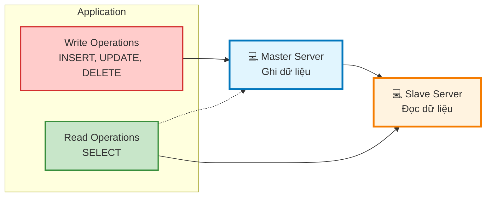

## 🧠 **2. Nguyên lý hoạt động - Ba thành phần cốt lõi**

Vậy làm thế nào để Slave xác định những thay đổi trên Master để tiến hành sao chép?

Trong MySQL, quá trình **Master-Slave Replication** được thực hiện thông qua ba thành phần chính:

1. **Binary Log (BinLog) – Trên Master:**
   * Ghi lại tất cả sự kiện làm thay đổi dữ liệu (`INSERT`, `UPDATE`, `DELETE`, `CREATE TABLE`...).
   * Các sự kiện được ghi tuần tự vào các file BinLog và đóng vai trò là nguồn dữ liệu để sao chép.

2. **I/O Thread – Trên Slave:**
   * Kết nối đến Master để lấy các bản ghi mới từ Binary Log.
   * Ghi các sự kiện này vào một file tạm trên Slave gọi là **Relay Log**.

3. **SQL Thread – Trên Slave:**
   * Đọc các sự kiện từ Relay Log.
   * Thực thi lại các lệnh này trên cơ sở dữ liệu của Slave, đảm bảo dữ liệu được đồng bộ với Master.

```mermaid
flowchart LR
    %% Master side
    subgraph Master_Server["Master Server"]
        DB[(Database)]
        BinLog[(Binary Log)]
        DB -->|Ghi sự kiện thay đổi| BinLog
    end
    %% Slave side
    subgraph Slave_Server["Slave Server"]
        RelayLog[(Relay Log)]
        IOThread[I/O Thread]
        SQLThread[SQL Thread]
        SlaveDB[(Database)]
        IOThread -->|Ghi sự kiện| RelayLog
        SQLThread -->|Thực thi sự kiện| SlaveDB
        RelayLog -->|Đọc sự kiện| SQLThread
    end
    %% Replication flow
    BinLog -->|Sao chép sự kiện| IOThread
    %% Styles
    style Master_Server fill:#cde4da,stroke:#16a085,stroke-width:2px
    style Slave_Server fill:#f9d5c5,stroke:#e17055,stroke-width:2px
    style BinLog fill:#45b7d1,stroke:#2980b9,stroke-width:2px,color:#fff
    style RelayLog fill:#ffeaa7,stroke:#f39c12,stroke-width:2px
    style IOThread fill:#a29bfe,stroke:#6c5ce7,stroke-width:2px,color:#fff
    style SQLThread fill:#81ecec,stroke:#00cec9,stroke-width:2px
    style DB fill:#55efc4,stroke:#00b894,stroke-width:2px
    style SlaveDB fill:#fab1a0,stroke:#e17055,stroke-width:2px
```

## ✅/❌ **3. Lợi ích & Giới hạn**

Tại sao chúng ta lại cần mô hình phức tạp này?

✅ **Lợi ích:**
*   **Tăng khả năng đọc (Read Scalability):** Đây là lợi ích lớn nhất. Thay vì tất cả các lệnh đọc (`SELECT`) đều dồn về Master, bạn có thể phân tán chúng ra nhiều Slave. Điều này giúp giảm tải đáng kể cho Master, đặc biệt với các ứng dụng có lượng đọc cao như website tin tức, mạng xã hội, diễn đàn.
*   **Sao lưu an toàn (Backup):** Bạn có thể thực hiện sao lưu trên Slave mà không làm ảnh hưởng đến hiệu năng của Master. Master vẫn có thể tiếp tục xử lý các giao dịch ghi một cách bình thường.
*   **Phân tích dữ liệu (Analytics):** Các truy vấn phân tích, báo cáo thường rất nặng và tốn tài nguyên. Chạy chúng trên Slave sẽ không làm chậm ứng dụng chính đang hoạt động trên Master.
*   **Dự phòng nóng (Warm Standby / Disaster Recovery):** Nếu Master gặp sự cố (hỏng hóc phần cứng), bạn có thể nhanh chóng "thăng cấp" (promote) một Slave lên làm Master mới, giúp giảm thiểu thời gian chết của hệ thống.

❌ **Giới hạn:**
*   **Không tăng khả năng ghi (Write Scalability):** Mọi lệnh ghi vẫn phải đi qua một Master duy nhất. Mô hình này không giải quyết được bài toán thắt cổ chai khi lượng ghi quá lớn.
*   **Độ trễ đồng bộ (Replication Lag):** Dữ liệu trên Slave có thể bị trễ hơn so với Master một vài giây (hoặc hơn, tùy thuộc vào tải và mạng). Điều này có nghĩa là nếu bạn vừa ghi một bản ghi vào Master và ngay lập tức đọc nó từ Slave, có thể bạn sẽ không thấy nó.
*   **Điểm lỗi duy nhất cho việc ghi (Single Point of Failure for Writes):** Nếu Master chết, hệ thống sẽ không thể ghi dữ liệu mới cho đến khi một Slave được thăng cấp hoặc Master được khôi phục.
*   **Phức tạp trong quản lý:** Việc thiết lập và giám sát replication đòi hỏi kiến thức và công sức, đặc biệt khi có lỗi xảy ra.

## 🛠️ **Phần II: Chuẩn Bị Môi Trường Máy Ảo**

🎯 **Mục tiêu:** Thiết lập hai máy ảo (Master/Slave) trên VirtualBox, cấu hình mạng tĩnh để chúng có thể "nhìn thấy" và giao tiếp ổn định với nhau. Đây là bước xây dựng nền móng hạ tầng.

## 🖥️ **1. Cấu hình Máy ảo và Card mạng**

**Bước 1: Tạo và cấu hình thông số máy ảo**

Chúng ta sẽ sử dụng 2 máy ảo Oracle Linux 8. Bạn có thể cài mới hoặc clone từ một máy ảo có sẵn.

*   Máy 1: Đặt tên `mysql-master`
*   Máy 2: Đặt tên `mysql-slave`

Cấu hình tối thiểu cho mỗi máy:
| Thông số | Giá trị |
| :--- | :--- |
| RAM | 1GB (1024MB) |
| CPU | 1 Core |
| Ổ cứng | 10GB |

**Bước 2: Cấu hình Card mạng trong VirtualBox**

Để các máy ảo vừa có thể ra Internet (để cài đặt), vừa có thể giao tiếp với nhau và với máy thật trong một mạng riêng, chúng ta sẽ dùng 2 card mạng cho mỗi máy.

Mở **Settings** của máy `mysql-master` (và lặp lại tương tự cho `mysql-slave`):

*   **Adapter 1 (Để ra Internet):**
    *   `Enable Network Adapter`: Tích chọn.
    *   `Attached to`: Chọn `NAT`.

*   **Adapter 2 (Để giao tiếp nội bộ):**
    *   `Enable Network Adapter`: Tích chọn.
    *   `Attached to`: Chọn `Host-only Adapter`.
    *   `Name`: Chọn tên Host-only Adapter của bạn (thường là `VirtualBox Host-Only Ethernet Adapter` hoặc `vboxnet0`).

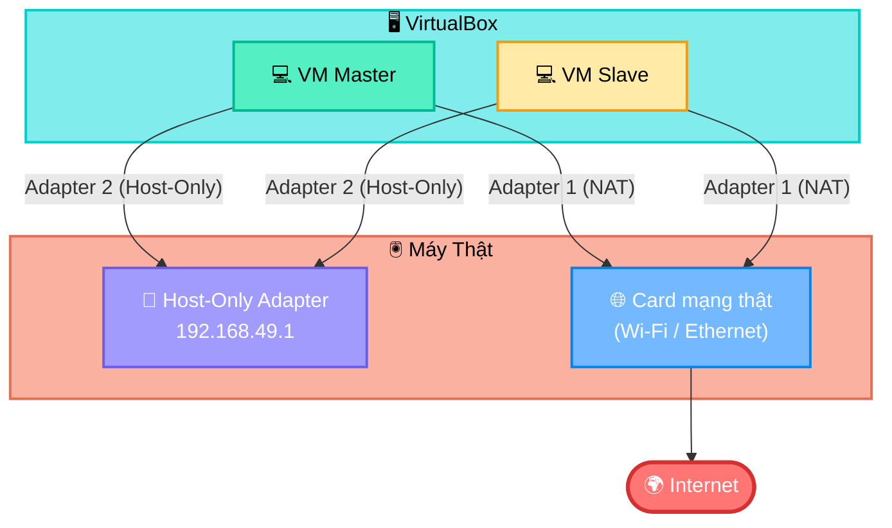

*   **Quan trọng:** Trước khi tiếp tục, hãy vào `File -> Host Network Manager...` trong VirtualBox, chọn Host-Only Adapter của bạn và ở tab `DHCP Server`, **bỏ tích** ô `Enable Server`. Điều này giúp chúng ta toàn quyền kiểm soát IP tĩnh và tránh xung đột.

## 📝 **2. Cấu hình Hệ điều hành (IP Tĩnh & Hostname)**

Bây giờ, hãy khởi động cả 2 máy ảo lên và đăng nhập với tài khoản `root`.

**Thực hiện trên máy `mysql-master`:**

**Bước 1: Xác định tên card mạng Host-Only**

```bash
ip a
```

Bạn sẽ thấy danh sách các card mạng. `enp0s3` thường là Adapter 1 (NAT), và `enp0s8` thường là Adapter 2 (Host-Only). Chúng ta sẽ cấu hình cho `enp0s8`.

**Bước 2: Cấu hình IP tĩnh**

Mở file cấu hình của card mạng `enp0s8`:

```bash
nano /etc/sysconfig/network-scripts/ifcfg-enp0s8
```

Chỉnh sửa và thêm các dòng sau:

```ini
# Đổi dòng này từ dhcp sang static
BOOTPROTO=static
# Thêm các dòng sau vào cuối file
IPADDR=192.168.49.10
NETMASK=255.255.255.0
# Đảm bảo dòng này là yes
ONBOOT=yes
```

Lưu và thoát (`Ctrl+X`, `Y`, `Enter`).

**Bước 3: Đặt hostname**

```bash
hostnamectl set-hostname mysql-master
```

**Thực hiện trên máy `mysql-slave`:**

Làm y hệt như Master, nhưng với IP và hostname khác.

**Bước 1: Mở file cấu hình**

```bash
nano /etc/sysconfig/network-scripts/ifcfg-enp0s8
```

**Bước 2: Cấu hình IP tĩnh**

```ini
BOOTPROTO=static
IPADDR=192.168.49.11  # <-- IP của Slave
NETMASK=255.255.255.0
ONBOOT=yes
```

Lưu và thoát.

**Bước 3: Đặt hostname**

```bash
hostnamectl set-hostname mysql-slave
```

## 🔒 **3. Cấu hình Phân giải tên miền và Tường lửa**

**Thực hiện trên CẢ HAI máy `mysql-master` và `mysql-slave`:**

**Bước 1: Khởi động lại mạng để áp dụng IP**

```bash
systemctl restart NetworkManager
```

Kiểm tra lại bằng `ip a` để chắc chắn `enp0s8` đã có IP mới.

**Bước 2: Cấu hình file `/etc/hosts`**

Để các máy có thể gọi nhau bằng tên, hãy thêm các dòng sau vào file `/etc/hosts`.

```bash
nano /etc/hosts
```

Thêm vào cuối file:

```
192.168.49.10    mysql-master
192.168.49.11    mysql-slave
```

Lưu và thoát.

**Bước 3: Mở cổng MySQL trên tường lửa**

MySQL giao tiếp qua cổng `3306`. Chúng ta cần mở cổng này trên tường lửa `firewalld` của Oracle Linux.

```bash
# Thêm quy tắc mở cổng 3306 vĩnh viễn
firewall-cmd --add-port=3306/tcp --permanent
# Tải lại tường lửa để áp dụng ngay
firewall-cmd --reload
```

## 📡 **4. Kiểm tra kết nối mạng**

Đây là bước cuối cùng và quan trọng nhất của phần này.

*   Từ `mysql-master`, gõ: `ping mysql-slave`
*   Từ `mysql-slave`, gõ: `ping mysql-master`

Nếu cả hai lệnh đều trả về kết quả (có response time), nghĩa là bạn đã xây dựng thành công nền móng mạng cho hệ thống replication!

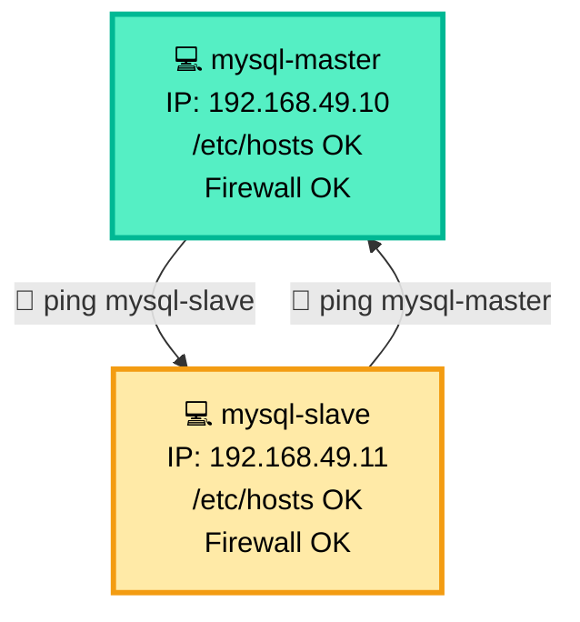

---

## 📚 **Phần III: Cài Đặt và Cấu Hình MySQL 8**

🎯 **Mục tiêu:** Cài đặt MySQL Server 8 trên cả hai máy, thực hiện các bước bảo mật thiết yếu và cấu hình để chúng sẵn sàng cho việc giao tiếp replication.

## 📌 **Tổng quan**

Ở phần này, chúng ta sẽ thực hiện một loạt các hành động giống hệt nhau trên cả hai máy `mysql-master` và `mysql-slave`. Mục tiêu là tạo ra hai máy chủ MySQL độc lập nhưng có cấu hình nền tảng tương đồng, sẵn sàng để kết nối với nhau ở phần sau.

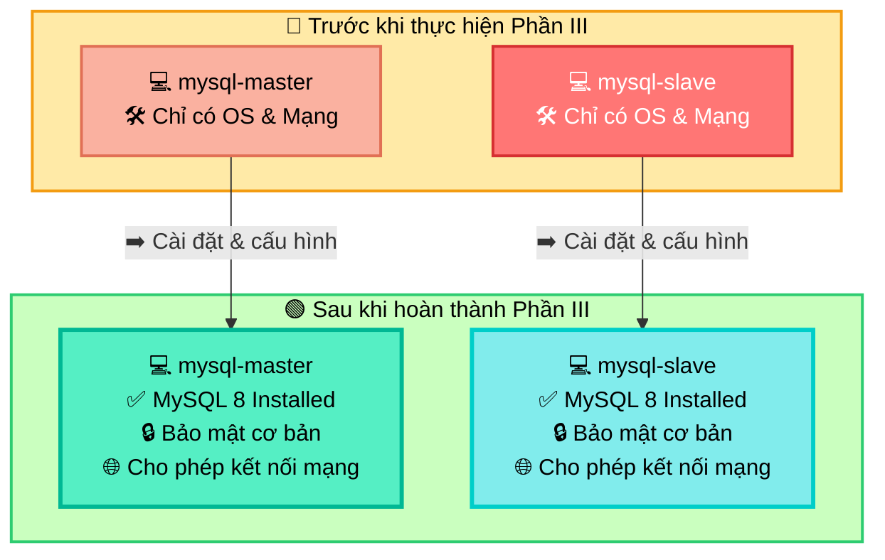

**Lưu ý:** Bạn hãy thực hiện các lệnh sau trên **cả hai máy** `mysql-master` và `mysql-slave`. Bạn có thể mở hai cửa sổ MobaXterm song song để thao tác cho tiện.

---

## 🛠️ **1. Cài đặt MySQL Server**

**Bước 1: Cài đặt Module `@mysql`**

Oracle Linux 8 sử dụng `dnf` và các "module stream" để quản lý các phiên bản phần mềm. Cách chuẩn nhất để cài MySQL 8 là cài đặt module `@mysql`.

```bash
dnf install @mysql -y
```

*   `dnf install`: Lệnh cài đặt phần mềm của trình quản lý gói `dnf`.
*   `@mysql`: Tên của module. Việc cài đặt theo module sẽ tự động kéo theo tất cả các gói phụ thuộc cần thiết (như `mysql-community-server`, `mysql-community-client`, `mysql-community-common`, v.v.) để có một môi trường MySQL hoàn chỉnh.
*   `-y`: Tự động trả lời "Yes" cho các câu hỏi xác nhận, giúp quá trình cài đặt không bị gián đoạn.

**Bước 2: Khởi động và Kích hoạt Dịch vụ MySQL**

Sau khi cài đặt xong, gói phần mềm đã nằm trên ổ cứng nhưng dịch vụ (process) MySQL vẫn chưa chạy. Chúng ta cần khởi động nó và thiết lập để nó tự chạy mỗi khi máy chủ boot.

```bash
# Khởi động dịch vụ MySQL ngay lập tức
systemctl start mysqld
# Kích hoạt để dịch vụ tự khởi động cùng hệ thống
systemctl enable mysqld
```

*   `systemctl start mysqld`: Lệnh này yêu cầu `systemd` (trình quản lý hệ thống và dịch vụ của Linux) khởi chạy tiến trình `mysqld` (MySQL Daemon).
*   `systemctl enable mysqld`: Lệnh này tạo ra các liên kết tượng trưng (symbolic links) trong các thư mục hệ thống, để `systemd` biết rằng cần phải khởi động `mysqld` mỗi khi máy chủ được bật lên.

**Bước 3: Kiểm tra trạng thái dịch vụ**

Làm sao để biết dịch vụ đã chạy thành công?

```bash
systemctl status mysqld
```

Bạn sẽ thấy một dòng `Active: active (running)` màu xanh lá. Điều này xác nhận máy chủ MySQL của bạn đang hoạt động. Nhấn `q` để thoát khỏi màn hình trạng thái.

---

## 🔒 **2. Cấu hình Bảo mật Ban đầu (`mysql_secure_installation`)**

Đây là bước **quan trọng nhất** sau khi cài đặt. MySQL mặc định có nhiều cấu hình không an toàn. Script này sẽ giúp chúng ta "dọn dẹp" và "khóa cửa" cẩn thận.

```bash
mysql_secure_installation
```

Script sẽ hỏi bạn một loạt câu hỏi. Hãy cùng đi qua từng câu:

1.  **Hỏi về VALIDATE PASSWORD COMPONENT:**
    > `Would you like to setup VALIDATE PASSWORD component?`
    *   **Giải thích:** Đây là một plugin cực kỳ hữu ích, giúp kiểm tra và bắt buộc người dùng đặt mật khẩu mạnh (phải đủ dài, có chữ hoa, chữ thường, số, ký tự đặc biệt). Việc này giúp ngăn chặn các cuộc tấn công dò mật khẩu đơn giản.
    *   **Hành động:** Gõ `Y` (Yes) và nhấn Enter.

2.  **Chọn mức độ phức tạp của mật khẩu:**
    > `There are three levels of password validation policy: LOW, MEDIUM and STRONG. Please select 0 = LOW, 1 = MEDIUM or 2 = STRONG.`
    *   **Giải thích:** Các mức độ kiểm tra mật khẩu. Mức `MEDIUM` (1) là một lựa chọn cân bằng tốt, yêu cầu mật khẩu có ít nhất 8 ký tự, bao gồm cả số, chữ thường, chữ hoa và ký tự đặc biệt.
    *   **Hành động:** Gõ `1` và nhấn Enter.

3.  **Đặt mật khẩu cho user `root`:**
    > `Please set the password for root here.`
    *   **Giải thích:** Đây là tài khoản quản trị cao nhất của MySQL, có toàn quyền trên tất cả các database. Mật khẩu này phải được bảo vệ cẩn thận.
    *   **Hành động:** Nhập một mật khẩu mạnh (ví dụ: `AdminPass_123!`) và nhấn Enter. Sau đó nhập lại mật khẩu đó một lần nữa để xác nhận. *Lưu ý: Mật khẩu sẽ không hiển thị khi bạn gõ. Hãy ghi nhớ mật khẩu này!*

4.  **Xóa người dùng ẩn danh (anonymous users):**
    > `Remove anonymous users?`
    *   **Giải thích:** MySQL mặc định có thể tạo ra các người dùng không có tên, cho phép bất kỳ ai kết nối vào cơ sở dữ liệu mà không cần xác thực. Đây là một lỗ hổng bảo mật nghiêm trọng.
    *   **Hành động:** Gõ `Y` và nhấn Enter.

5.  **Không cho phép `root` đăng nhập từ xa:**
    > `Disallow root login remotely?`
    *   **Giải thích:** Cho phép tài khoản `root` (quyền lực nhất) kết nối từ các máy khác qua mạng là một rủi ro bảo mật lớn. Một khi mật khẩu root bị lộ, kẻ tấn công có thể kiểm soát toàn bộ máy chủ CSDL từ xa. Thực hành tốt nhất là chỉ cho phép `root` đăng nhập từ `localhost` và tạo các tài khoản riêng với quyền hạn chế cho các kết nối mạng.
    *   **Hành động:** Gõ `Y` và nhấn Enter.

6.  **Xóa cơ sở dữ liệu `test`:**
    > `Remove test database and access to it?`
    *   **Giải thích:** Database `test` được tạo ra mặc định và bất kỳ ai cũng có thể truy cập. Nó không cần thiết cho môi trường production và nên được gỡ bỏ.
    *   **Hành động:** Gõ `Y` và nhấn Enter.

7.  **Tải lại bảng quyền (privilege tables):**
    > `Reload privilege tables now?`
    *   **Giải thích:** Tất cả các thay đổi về người dùng, mật khẩu, quyền hạn đều được lưu trong các bảng hệ thống của MySQL. Lệnh này sẽ nạp lại toàn bộ các bảng đó vào bộ nhớ để các thay đổi có hiệu lực ngay lập tức.
    *   **Hành động:** Gõ `Y` và nhấn Enter.

Khi bạn thấy thông báo `All done!`, bạn đã hoàn tất việc gia cố bảo mật cho máy chủ MySQL.

---

## 🌐 **3. Cấu hình cho phép MySQL kết nối mạng**

Mặc định, MySQL chỉ lắng nghe các kết nối từ chính nó (`localhost`). Để Master và Slave có thể giao tiếp với nhau qua mạng Host-Only, chúng ta cần gỡ bỏ giới hạn này.

```mermaid
graph TD
    %% Default state
    subgraph DefaultState["🔴 Trạng thái Mặc định"]
        MySQL_Default["🖥️ MySQL Server<br>(Default Config)"]
        Localhost(("💻 localhost<br>127.0.0.1"))
        Network(("🌐 Card mạng<br>192.168.49.x"))
        MySQL_Default -- "🟢 chỉ lắng nghe" --> Localhost
        Network -- "❌ Bị từ chối" --x MySQL_Default
    end
    %% Desired state
    subgraph DesiredState["🟢 Trạng thái Mong muốn"]
        MySQL_Desired["🖥️ MySQL Server<br>(Updated Config)"]
        All_IPs(("🌍 Tất cả IP<br>0.0.0.0"))
        Network_Desired(("🌐 Card mạng<br>192.168.49.x"))
        MySQL_Desired -- "🟢 lắng nghe trên" --> All_IPs
        Network_Desired -- "✅ Được chấp nhận" --> MySQL_Desired
    end
    %% Styles
    style DefaultState fill:#ffeaa7,stroke:#f39c12,stroke-width:2px,color:#000
    style DesiredState fill:#caffbf,stroke:#2ecc71,stroke-width:2px,color:#000
    style MySQL_Default fill:#ff7675,stroke:#d63031,stroke-width:3px,color:#fff
    style Localhost fill:#a29bfe,stroke:#6c5ce7,stroke-width:2px,color:#fff
    style Network fill:#fab1a0,stroke:#e17055,stroke-width:2px,color:#000
    style MySQL_Desired fill:#55efc4,stroke:#00b894,stroke-width:3px,color:#000
    style All_IPs fill:#81ecec,stroke:#00cec9,stroke-width:2px,color:#000
    style Network_Desired fill:#74b9ff,stroke:#0984e3,stroke-width:2px,color:#fff
```

**Bước 1: Mở file cấu hình MySQL**

Trên Oracle Linux, file cấu hình chính là `/etc/my.cnf`.

```bash
nano /etc/my.cnf
```

**Bước 2: Tìm và vô hiệu hóa `bind-address`**

Di chuyển con trỏ trong file và tìm đến phần `[mysqld]`. Bạn có thể thấy hoặc không thấy dòng `bind-address`.

*   **Nếu bạn thấy dòng `bind-address = 127.0.0.1`:** Hãy thêm một dấu thăng (`#`) vào đầu dòng để vô hiệu hóa nó.
    ```ini
    #bind-address = 127.0.0.1
    ```
*   **Nếu bạn không thấy dòng `bind-address`:** Bạn không cần làm gì cả. Mặc định trên một số phiên bản, việc không có dòng này cũng tương đương với việc lắng nghe trên tất cả các IP. Để chắc chắn, bạn có thể tự thêm dòng `bind-address = 0.0.0.0` vào dưới `[mysqld]`. Nhưng trong trường hợp này, chỉ cần đảm bảo không có dòng `bind-address = 127.0.0.1` là đủ.

**Bước 3: Khởi động lại dịch vụ MySQL**

Để MySQL đọc lại file cấu hình mới, hãy khởi động lại nó.

```bash
systemctl restart mysqld
```

---

## ✅ **4. Kiểm tra Cài đặt**

Đăng nhập vào MySQL để xác nhận mọi thứ hoạt động.

```bash
mysql -u root -p
```

Hệ thống sẽ yêu cầu mật khẩu. Bạn hãy nhập mật khẩu `root` đã đặt ở bước bảo mật.

Nếu bạn thấy prompt `mysql>`, chúc mừng bạn đã vào được bên trong! Hãy chạy lệnh sau để kiểm tra phiên bản:

```sql
SHOW VARIABLES LIKE 'version';
```

Bạn sẽ thấy phiên bản MySQL 8.x. Gõ `exit` để thoát.

**Bạn đã hoàn thành xuất sắc Phần III.**

Cả hai máy chủ `mysql-master` và `mysql-slave` của bạn giờ đây đã được cài đặt MySQL 8, bảo mật cẩn thận và sẵn sàng nhận kết nối từ mạng nội bộ.

Chúng ta đã hoàn thành tất cả các bước chuẩn bị. Nền móng đã vững, nhà đã xây xong. Ở phần tiếp theo, chúng ta sẽ thực hiện công việc chính: **kết nối hai ngôi nhà này lại với nhau để tạo thành một hệ thống Master-Slave Replication.**

---

## 📚 **Phần IV: Cấu Hình Master-Slave Replication**

🎯 **Mục tiêu:** Thiết lập và kích hoạt quá trình đồng bộ dữ liệu một chiều từ `mysql-master` sang `mysql-slave`. Đây là phần quan trọng và thú vị nhất của toàn bộ lộ trình.

## 📌 **Tổng quan quy trình**

Quá trình này bao gồm hai giai đoạn chính:
1.  **Trên Master:** Bật "chế độ phát sóng" (kích hoạt Binary Log) và tạo một tài khoản đặc biệt cho Slave kết nối vào.
2.  **Trên Slave:** Bật "chế độ nhận sóng", sau đó dùng tài khoản đã tạo để kết nối và bắt đầu sao chép từ một điểm cụ thể trên "cuốn băng ghi hình" (Binary Log) của Master.

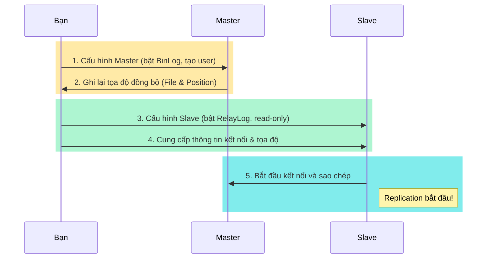

---
## 🛠️ **A. Cấu Hình Trên Máy `mysql-master`**

Bạn hãy chuyển sang cửa sổ MobaXterm đang kết nối tới `mysql-master`.

## **Bước 1: Chỉnh sửa file cấu hình MySQL (`/etc/my.cnf`)**

Chúng ta cần thêm vài dòng cấu hình để "bảo" Master: "Hãy bật Binary Log và tự nhận mình là máy chủ số 1 nhé".

Mở file cấu hình:
```bash
nano /etc/my.cnf
```
Tìm đến phần `[mysqld]` và thêm các dòng sau vào cuối phần đó:

```ini
# --- REPLICATION CONFIG ---
# ID duy nhất của server trong cụm replication. Master là 1.
server-id = 1

# Bật và chỉ định tên cho file Binary Log.
# MySQL sẽ tự động thêm hậu tố số (ví dụ: .000001)
log_bin = /var/log/mysql/mysql-bin.log

# (Tùy chọn) Chỉ đồng bộ những thay đổi xảy ra trên database 'test_db'.
# Điều này hữu ích để tránh đồng bộ các thay đổi không cần thiết.
# Chúng ta sẽ tạo database này sau.
binlog_do_db = test_db
```

*   `server-id = 1`: Đây là mã định danh duy nhất cho mỗi server trong một cụm replication. Mỗi máy chủ (Master, Slave) phải có một `server-id` khác nhau. Chúng ta quy ước Master là `1`.
*   `log_bin = ...`: Đây là chỉ thị quan trọng nhất, yêu cầu MySQL kích hoạt tính năng Binary Logging. Mọi thay đổi dữ liệu từ bây giờ sẽ được ghi vào các file có tên `mysql-bin.log.xxxxx` trong thư mục `/var/log/mysql/`.
*   `binlog_do_db = test_db`: Lệnh này lọc các sự kiện ghi vào BinLog. Chỉ những sự kiện xảy ra trên database `test_db` mới được ghi lại. Điều này giúp BinLog gọn nhẹ hơn và chỉ tập trung vào dữ liệu cần đồng bộ. Nếu bạn muốn đồng bộ tất cả các database, hãy comment hoặc xóa dòng này.

Sau khi thêm xong, lưu và thoát (`Ctrl+X`, `Y`, `Enter`).

## **Bước 2: Khởi động lại MySQL**

Để các thay đổi trên có hiệu lực, hãy khởi động lại dịch vụ MySQL:
```bash
systemctl restart mysqld
```

## **Bước 3: Tạo User dành cho Replication**

Slave không thể dùng tài khoản `root` của Master để kết nối (vì chúng ta đã chặn kết nối từ xa). Chúng ta cần tạo một tài khoản riêng cho Slave với quyền hạn đặc biệt là `REPLICATION SLAVE`.

Đăng nhập vào MySQL trên Master:
```bash
mysql -u root -p
```
(Nhập mật khẩu root của Master)

Bây giờ, tại prompt `mysql>`, hãy chạy các lệnh SQL sau:

```sql
-- Tạo một user tên là 'repl' có thể kết nối từ bất kỳ IP nào ('%')
-- với mật khẩu là 'SecurePass123!'.
-- Hãy thay bằng một mật khẩu mạnh hơn trong thực tế!
CREATE USER 'repl'@'%' IDENTIFIED BY 'SecurePass123!';

-- Cấp cho user 'repl' quyền đặc biệt để sao chép dữ liệu.
-- Đây là quyền duy nhất mà user này cần.
GRANT REPLICATION SLAVE ON *.* TO 'repl'@'%';

-- Áp dụng các thay đổi về quyền ngay lập tức.
FLUSH PRIVILEGES;
```
*   `'repl'@'%'`: `'repl'` là tên người dùng, `'%'` có nghĩa là người dùng này có thể kết nối từ bất kỳ địa chỉ IP nào. Để bảo mật hơn, bạn có thể thay `%` bằng IP của Slave: `'repl'@'192.168.49.11'`.
*   `GRANT REPLICATION SLAVE`: Đây là một đặc quyền (privilege) rất mạnh mẽ, cho phép user đọc Binary Log của Master.

## **Bước 4: Lấy Trạng Thái của Master (Tọa độ đồng bộ)**

Đây là bước cực kỳ quan trọng. Chúng ta cần "đánh dấu" chính xác vị trí trong Binary Log mà Slave sẽ bắt đầu sao chép.

Vẫn trong prompt `mysql>` của Master, chạy lệnh sau:
```sql
FLUSH TABLES WITH READ LOCK;
```
*   **Giải thích:** Lệnh này sẽ đóng tất cả các bảng đang mở và khóa tất cả các bảng trên tất cả các database bằng một khóa đọc (READ LOCK). Điều này đảm bảo rằng không có bất kỳ thay đổi nào được ghi vào các bảng trong khi chúng ta đang lấy tọa độ, giúp tọa độ chúng ta lấy được là chính xác và nhất quán. **Terminal này bây giờ sẽ bị "treo", đừng đóng nó!**

Bây giờ, hãy mở một cửa sổ MobaXterm **thứ hai** và SSH vào `mysql-master`. Trong cửa sổ mới này, đăng nhập vào MySQL:
```bash
mysql -u root -p
```
Và chạy lệnh:
```sql
SHOW MASTER STATUS;
```
Bạn sẽ thấy một kết quả tương tự như sau:
```
+------------------+----------+--------------+------------------+-------------------+
| File             | Position | Binlog_Do_DB | Binlog_Ignore_DB | Executed_Gtid_Set |
+------------------+----------+--------------+------------------+-------------------+
| mysql-bin.000001 |      157 | test_db      |                  |                   |
+------------------+----------+--------------+------------------+-------------------+
```
Hãy **GHI LẠI CẨN THẬN** hai giá trị:
*   **`File`**: `mysql-bin.000001`
*   **`Position`**: `157`

Đây chính là "tọa độ" mà Slave sẽ cần để biết phải bắt đầu đọc từ đâu trong BinLog của Master.

Sau khi đã ghi lại, quay trở lại cửa sổ terminal **đầu tiên** (cái đang bị treo) và gõ lệnh sau để mở khóa các bảng:
```sql
UNLOCK TABLES;
```
Bây giờ bạn có thể gõ `exit` để thoát khỏi cả hai cửa sổ MySQL.

**Hoàn thành cấu hình Master!**

---
## 🛠️ **B. Cấu Hình Trên Máy `mysql-slave`**

Bây giờ, bạn hãy chuyển sang cửa sổ MobaXterm đang kết nối tới `mysql-slave`.

## **Bước 1: Chỉnh sửa file cấu hình MySQL (`/etc/my.cnf`)**

Tương tự như Master, chúng ta cần cấu hình `server-id` và một vài tùy chọn khác cho Slave.

Mở file cấu hình:
```bash
nano /etc/my.cnf
```
Tìm đến phần `[mysqld]` và thêm các dòng sau vào cuối phần đó:

```ini
# --- REPLICATION CONFIG ---
# ID của Slave, phải khác với Master. Chúng ta dùng số 2.
server-id = 2

# (Tùy chọn nhưng khuyến nghị) Bật Relay Log để lưu trữ các sự kiện từ Master.
relay_log = /var/log/mysql/mysql-relay-bin.log

# (Quan trọng) Bật chế độ chỉ đọc cho Slave.
# Điều này ngăn chặn việc ghi dữ liệu trực tiếp vào Slave,
# đảm bảo dữ liệu chỉ đến từ Master, tránh xung đột.
read_only = ON
```
*   `server-id = 2`: ID duy nhất của Slave.
*   `relay_log`: Chỉ định file mà I/O Thread sẽ dùng để ghi các sự kiện lấy từ BinLog của Master.
*   `read_only = ON`: Một biện pháp bảo vệ quan trọng. Nó ngăn tất cả người dùng (ngoại trừ user có SUPER privilege) thực hiện các lệnh ghi, đảm bảo Slave chỉ nhận dữ liệu từ Master.

Lưu và thoát (`Ctrl+X`, `Y`, `Enter`).

## **Bước 2: Khởi động lại MySQL**
```bash
systemctl restart mysqld
```

## **Bước 3: Kết nối Slave với Master và Khởi động Replication**

Đây là khoảnh khắc quyết định! Chúng ta sẽ "bảo" Slave: "Hãy kết nối tới `mysql-master` bằng tài khoản `repl`, và bắt đầu đọc từ tọa độ mà chúng ta đã ghi lại".

Đăng nhập vào MySQL trên Slave:
```bash
mysql -u root -p
```
(Nhập mật khẩu root của Slave)

Tại prompt `mysql>`, chạy một lệnh `CHANGE MASTER TO` duy nhất, nhưng hãy **thay thế** `MASTER_LOG_FILE` và `MASTER_LOG_POS` bằng các giá trị bạn đã ghi lại từ Master.

```sql
-- DỪNG REPLICATION (nếu nó đang chạy từ lần cấu hình trước)
STOP SLAVE;

-- Lệnh quan trọng nhất
CHANGE MASTER TO
  MASTER_HOST='mysql-master',
  MASTER_USER='repl',
  MASTER_PASSWORD='SecurePass123!',
  MASTER_LOG_FILE='mysql-bin.000001',  -- <-- THAY BẰNG GIÁ TRỊ CỦA BẠN
  MASTER_LOG_POS=157;                   -- <-- THAY BẰNG GIÁ TRỊ CỦA BẠN

-- KHỞI ĐỘNG REPLICATION
START SLAVE;
```

## **Bước 4: Kiểm tra Trạng thái Replication**

Làm sao để biết quá trình đã thành công? Vẫn trong prompt `mysql>` của Slave, chạy lệnh sau:
```sql
SHOW SLAVE STATUS\G
```
*   `\G`: Thay vì hiển thị kết quả dưới dạng bảng khó đọc, `\G` sẽ hiển thị mỗi trường trên một dòng, rất dễ quan sát.

Bạn cần tìm và đảm bảo hai dòng sau đây có giá trị là **`Yes`**:
```
        Slave_IO_Running: Yes
       Slave_SQL_Running: Yes
```
*   `Slave_IO_Running: Yes`: Cho biết I/O Thread đã kết nối thành công tới Master và đang sao chép BinLog.
*   `Slave_SQL_Running: Yes`: Cho biết SQL Thread đang hoạt động, đọc Relay Log và áp dụng các thay đổi.

Nếu cả hai đều là `Yes`, **CHÚC MỪNG BẠN!** Bạn đã thiết lập thành công MySQL Master-Slave Replication.

Gõ `exit` để thoát.

**Chúng ta đã hoàn thành Phần IV.** 

Hệ thống của bạn về mặt kỹ thuật đã được kết nối và đang đồng bộ. Ở phần cuối cùng, chúng ta sẽ kiểm tra xem dữ liệu có thực sự được đồng bộ hay không và học cách xử lý một vài sự cố phổ biến.

---


# 📌 **Phụ Lục A: Các Phương Pháp Cài Đặt MySQL trên Oracle Linux 8 và Xử Lý Sự Cố**

🎯 **Mục tiêu:** Hiểu rõ hai phương pháp cài đặt MySQL phổ biến trên Oracle Linux 8, phân tích nguyên nhân gây ra lỗi `modular filtering` và biết cách lựa chọn phương pháp phù hợp.

---

## 💡 **Bối cảnh**

Trên các hệ điều hành dựa trên Red Hat như Oracle Linux 8, CentOS 8, RHEL 8, có một tính năng gọi là **"Module Streams"**. Nó cho phép hệ điều hành cung cấp nhiều phiên bản của cùng một phần mềm (ví dụ: MySQL 8.0, PostgreSQL 10, PostgreSQL 13...). Tuy nhiên, tính năng này đôi khi gây xung đột khi bạn cố gắng cài đặt phần mềm từ một kho lưu trữ bên thứ ba (như kho của MySQL).

---

## 🛠️ **Phương pháp 1: Sử dụng MySQL Yum Repository**

Đây là phương pháp được khuyến nghị chính thức từ MySQL và thường là cách dễ dàng nhất nếu nó hoạt động.

## **Các bước thực hiện:**

1.  **Tải gói Repository:**
    ```bash
    wget https://repo.mysql.com//mysql80-community-release-el8-1.noarch.rpm  
    ```
    *   **WHY:** Gói `.rpm` này không chứa MySQL Server. Nó chỉ chứa các file cấu hình để "dạy" cho trình quản lý gói `dnf` của bạn biết kho lưu trữ của MySQL nằm ở đâu trên Internet.

2.  **Cài đặt gói Repository:**
    ```bash
    rpm -ivh mysql80-community-release-el8-1.noarch.rpm
    ```
    *   **WHY:** Lệnh này cài đặt các file cấu hình repository vào hệ thống, thường là trong thư mục `/etc/yum.repos.d/`.

3.  **Cài đặt MySQL Server:**
    ```bash
    dnf install mysql-community-server -y
    ```
    *   **WHY:** Đây là lúc `dnf` sử dụng thông tin repository mới để tìm và cài đặt gói `mysql-community-server`.

---

## ❌ **Sự cố thường gặp: Lỗi `modular filtering`**

> `All matches were filtered out by modular filtering for argument: mysql-community-server`
> `Error: Unable to find a match: mysql-community-server`

## **WHY (Tại sao lỗi này xảy ra?):**

Lỗi này xảy ra vì một sự xung đột. Hệ điều hành Oracle Linux 8 của bạn đã có sẵn một "module" tên là `mysql` (thường là phiên bản 8.0). Khi bạn thêm repository của MySQL Community vào, `dnf` bối rối vì nó thấy hai "nguồn" cùng cung cấp phần mềm tên là `mysql`. Cơ chế "modular filtering" được kích hoạt để ngăn chặn các xung đột tiềm tàng, và nó đã "lọc" (loại bỏ) gói `mysql-community-server` từ kho bạn mới thêm vào.

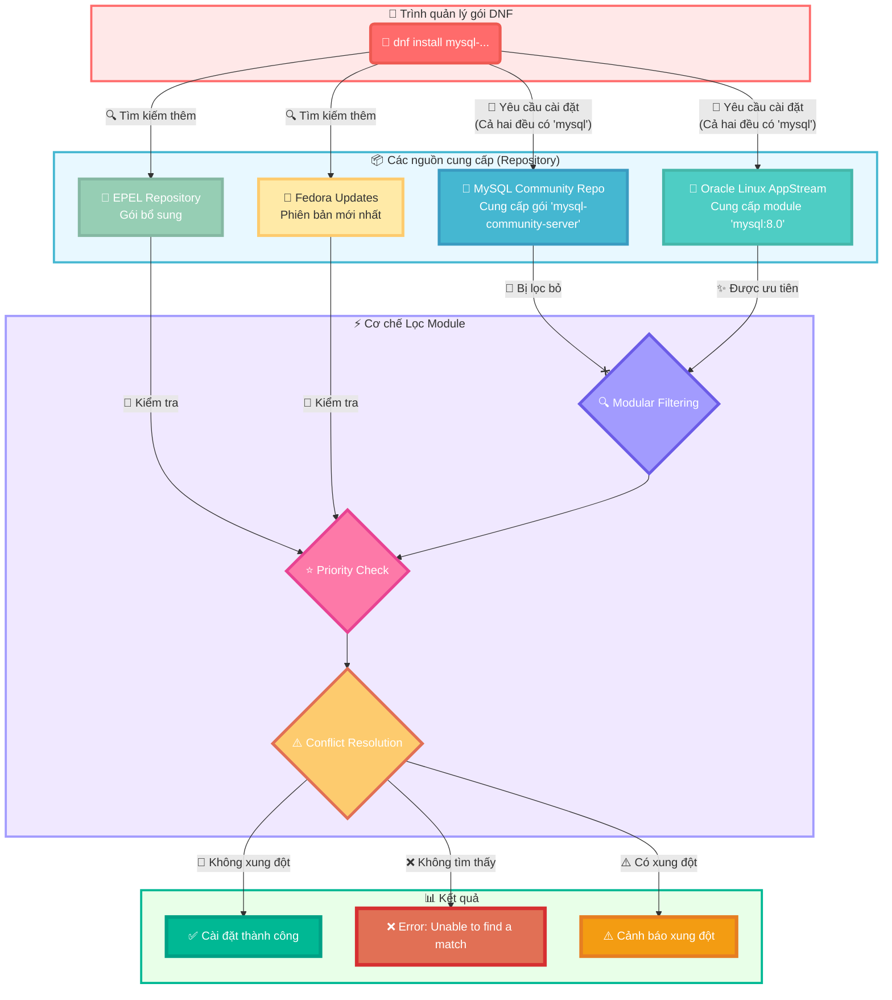

---

## ✅ **Các bước khắc phục**

File của bạn đã ghi lại các bước khắc phục rất logic:

1.  **`dnf module reset mysql`**: Vô hiệu hóa module `mysql` của hệ điều hành.
2.  **`dnf module enable mysql:8.0`**: Cố gắng kích hoạt lại một cách rõ ràng.
3.  **`dnf clean all` & `dnf makecache`**: Xóa cache cũ và xây dựng lại metadata mới.

Tuy nhiên, như bạn đã thấy, đôi khi các bước này vẫn không giải quyết được triệt để vấn đề xung đột. Khi đó, chúng ta cần một phương pháp quyết đoán hơn.

---

## 🔧 **Phương pháp 2: Cài đặt trực tiếp từ các gói RPM (Giải pháp cuối cùng của chúng ta)**

Đây là phương pháp "cấp thấp" hơn nhưng đáng tin cậy vì nó bỏ qua hoàn toàn cơ chế repository và module của `dnf`. Bạn làm việc trực tiếp với các file cài đặt.

## **WHY (Tại sao phương pháp này hoạt động?):**

Khi bạn dùng `dnf install <tên_file.rpm>`, bạn đang ra lệnh cho `dnf` cài đặt chính xác file đó, không cần tìm kiếm trong repository. `dnf` vẫn sẽ tự động xử lý các gói phụ thuộc từ các repository hệ thống, nhưng nó sẽ không bị bối rối bởi lỗi `modular filtering` nữa.

## **Các bước thực hiện (Như chúng ta đã làm):**

1.  **Tự tìm và tải các gói RPM cần thiết:** Bạn đã làm rất tốt việc lên trang của Oracle/MySQL để tìm đúng các file `.rpm` cho phiên bản 8.0.39.
2.  **Tải đủ các gói phụ thuộc:** Chúng ta đã học được rằng cần phải có đủ bộ: `common`, `libs`, `client-plugins`, `client`, và `server`.
3.  **Cài đặt theo đúng thứ tự:**
    ```bash
    # (Sau khi đã wget tất cả các file)
    dnf install mysql-community-common-*.rpm -y
    dnf install mysql-community-libs-*.rpm -y
    dnf install mysql-community-client-plugins-*.rpm -y
    dnf install mysql-community-client-*.rpm -y
    dnf install mysql-community-server-*.rpm -y
    ```

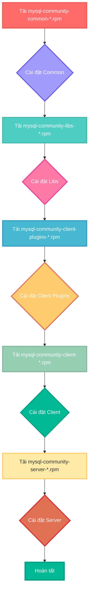

---

## 📌 **Kết luận và Khuyến nghị**

*   **Phương pháp 1 (Repository):** Luôn là lựa chọn đầu tiên vì sự tiện lợi và khả năng cập nhật dễ dàng (`dnf update`). Tuy nhiên, hãy chuẩn bị tinh thần xử lý lỗi `modular filtering`.
*   **Phương pháp 2 (RPM trực tiếp):** Là giải pháp cứu cánh đáng tin cậy khi phương pháp 1 thất bại. Nó cho bạn toàn quyền kiểm soát phiên bản nhưng đòi hỏi bạn phải tự quản lý các gói phụ thuộc.

Việc bạn đã trải qua và ghi lại cả hai quá trình này đã mang lại cho bạn một kinh nghiệm vô giá.


✅ **Chúng ta đã hoàn thành Phần IV (Cấu hình Master-Slave) và Phụ Lục A.** Bước tiếp theo là **Phần V**.

---

# 🧪 **Phần V: Kiểm Thử Và Xử Lý Sự Cố**

🎯 **Mục tiêu:** Xác minh hệ thống replication hoạt động ổn định bằng cách kiểm tra việc đồng bộ dữ liệu, đồng thời học cách nhận biết và khắc phục một số lỗi cơ bản thường gặp.

---

## 🔍 **1. Kiểm tra (Test) quá trình đồng bộ dữ liệu**

Đây là khoảnh khắc "sự thật". Chúng ta sẽ tạo ra một thay đổi trên Master và xem liệu nó có tự động xuất hiện trên Slave hay không.

## **Hiện trạng:**
*   Trên Master: Bảng `test_db.users` có 2 bản ghi (Alice, Bob).
*   Trên Slave: Bảng `test_db.users` chưa có bản ghi nào (vì chúng ta tạo chúng trước khi bật replication).

## **Bước 1: Đồng bộ dữ liệu ban đầu**
Lúc chúng ta cấu hình, Slave đã kết nối với Master. Quá trình đồng bộ các thay đổi *kể từ lúc kết nối* đã bắt đầu. Tuy nhiên, các dữ liệu đã có sẵn trên Master *trước khi* bật replication sẽ không được tự động sao chép.

*   *(Lưu ý: Trong thực tế, để đồng bộ toàn bộ dữ liệu có sẵn, người ta thường dùng `mysqldump` để sao lưu Master rồi phục hồi trên Slave trước khi chạy `START SLAVE`. Nhưng trong bài học này, chúng ta sẽ tập trung vào việc đồng bộ các thay đổi mới.)*

## **Bước 2: Tạo thay đổi mới trên Master**
Hãy đăng nhập vào MySQL trên máy **Master**:
```bash
mysql -u root -p
```
(Nhập mật khẩu root của Master)

Thêm một người dùng mới vào bảng `users`:
```sql
USE test_db;
INSERT INTO users (name) VALUES ('Charlie');
SELECT * FROM users;
```
Bạn sẽ thấy kết quả trên Master bây giờ có 3 người: Alice, Bob, và Charlie.

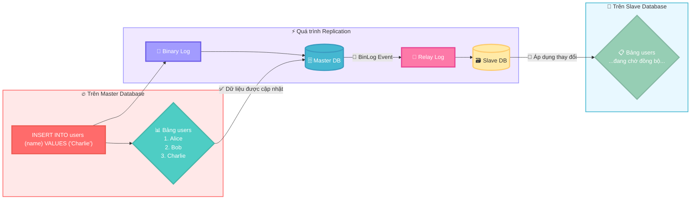

## **Bước 3: Kiểm tra kết quả trên Slave**
Bây giờ, hãy chuyển sang máy **Slave**. Đăng nhập vào MySQL:
```bash
mysql -u root -p
```
(Nhập mật khẩu root của Slave)

Kiểm tra nội dung bảng `users`:
```sql
USE test_db;
SELECT * FROM users;
```
*   **Kết quả kỳ vọng:** Bạn sẽ thấy bản ghi `Charlie` xuất hiện trên Slave! Nếu bạn thấy cả Alice và Bob, điều đó có nghĩa là khi bạn lấy `SHOW MASTER STATUS`, file binlog đã bao gồm cả sự kiện tạo 2 bản ghi đó. Nếu chỉ thấy Charlie, điều đó cũng hoàn toàn bình thường.
*   **Hành động:** Bạn hãy thực hiện các bước này và cho tôi xem kết quả của lệnh `SELECT * FROM users;` trên **Slave** nhé.

---

## 🛠️ **2. Các lỗi thường gặp và cách khắc phục**

## **a. Giám sát độ trễ (Replication Lag)**
Trên máy **Slave**, chạy lại lệnh kiểm tra trạng thái:
```sql
SHOW SLAVE STATUS\G
```
Tìm dòng `Seconds_Behind_Master`.
*   **`Seconds_Behind_Master: 0`**: Hoàn hảo! Slave đang đồng bộ ngay lập tức.
*   **`Seconds_Behind_Master: > 0`**: Có độ trễ. Nếu số này lớn và không giảm, đó là dấu hiệu của Replication Lag. Nguyên nhân có thể do mạng chậm, Slave quá tải, hoặc có một truy vấn lớn đang chạy trên Master.

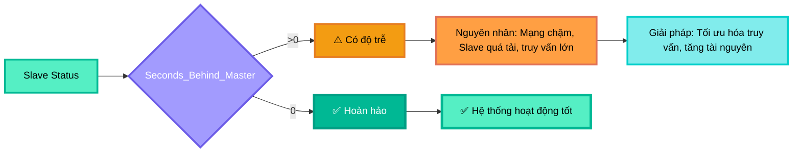

## **b. Lỗi: `Slave_IO_Running: No` hoặc `Slave_SQL_Running: No`**
Đây là lỗi phổ biến nhất. Nếu một trong hai giá trị này là `No`, replication đã bị dừng.

*   **Nguyên nhân `Slave_IO_Running: No`:**
    *   **Mạng/Firewall:** Kết nối từ Slave đến Master bị mất (mạng đứt, Master tắt, port 3306 bị chặn lại).
    *   **Sai thông tin đăng nhập:** User `repl` hoặc mật khẩu bị sai (lỗi này thường hiển thị rõ trong `Last_IO_Error`).
    *   **Binlog của Master bị xóa:** Master đã xóa file binlog mà Slave đang cần đọc.
*   **Nguyên nhân `Slave_SQL_Running: No`:**
    *   **Xung đột dữ liệu (Duplicate entry):** Lỗi phổ biến nhất. Ví dụ: ai đó đã lỡ tay `INSERT` một bản ghi có `PRIMARY KEY` trùng lặp trực tiếp trên Slave. Khi SQL Thread cố gắng thực thi lại lệnh `INSERT` từ Master, nó sẽ báo lỗi `Duplicate entry`.
    *   **Lỗi cú pháp hoặc logic:** Một truy vấn chạy thành công trên Master nhưng lại lỗi trên Slave (hiếm gặp, thường do phiên bản MySQL khác nhau hoặc cấu hình `sql_mode` khác nhau).

## **c. Cách khắc phục lỗi `Duplicate entry` (Thực hành)**
Đây là một bài tập rất thực tế.

### **Bước 1: Cố tình gây lỗi**
Trên máy **Slave**, đăng nhập vào MySQL và tạm thời tắt chế độ `read_only` để có thể ghi dữ liệu:
```sql
SET GLOBAL read_only = OFF;
INSERT INTO test_db.users (id, name) VALUES (4, 'Eve_on_Slave');
SET GLOBAL read_only = ON; -- Bật lại ngay lập tức
```
Bây giờ, quay lại máy **Master** và chèn một bản ghi cũng có `id = 4`:
```sql
INSERT INTO test_db.users (id, name) VALUES (4, 'David_on_Master');
```

### **Bước 2: Kiểm tra lỗi trên Slave**
Chạy `SHOW SLAVE STATUS\G` trên **Slave**. Bạn sẽ thấy:
*   `Slave_SQL_Running: No`
*   `Last_SQL_Error:` sẽ có thông báo `Duplicate entry '4' for key 'users.PRIMARY'`.

### **Bước 3: Khắc phục lỗi**
Chúng ta có 2 lựa chọn:
1.  **Chấp nhận dữ liệu trên Slave là đúng:** Bỏ qua giao dịch từ Master.
2.  **Chấp nhận dữ liệu trên Master là đúng:** Xóa dữ liệu trên Slave và thực thi lại.

Chúng ta sẽ làm theo cách 1 (bỏ qua giao dịch từ Master):
```sql
-- Trên Slave
STOP SLAVE;
SET GLOBAL sql_slave_skip_counter = 1; -- Bảo SQL Thread bỏ qua 1 sự kiện tiếp theo
START SLAVE;
```
Sau đó, chạy lại `SHOW SLAVE STATUS\G`, bạn sẽ thấy cả hai `Running` đều là `Yes`.

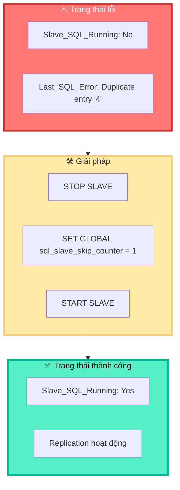
---

# 🛡️ **3. Các Mẹo Thành Công và Kinh Nghiệm Thực Tế**

Thiết lập replication thành công chỉ là bước khởi đầu. Để duy trì một hệ thống ổn định và dễ quản lý, đây là những kinh nghiệm "xương máu" mà bạn nên ghi nhớ.

---

## 🔒 **a. Luôn sao lưu (Backup) trước khi cấu hình**

*   **WHY:** Bất kỳ thao tác nào thay đổi cấu hình hệ thống đều có rủi ro. Việc chỉnh sửa file `my.cnf` hoặc thay đổi quyền người dùng có thể gây ra lỗi không mong muốn. Một bản sao lưu đầy đủ sẽ là "phao cứu sinh" cho phép bạn phục hồi lại trạng thái ban đầu một cách nhanh chóng.
*   **HOW:** Trước khi bắt đầu Phần IV (Cấu hình Replication), hãy chạy lệnh sau trên **Master** để tạo một bản sao lưu toàn bộ cơ sở dữ liệu:
    ```bash
    mysqldump -u root -p --all-databases --master-data=2 > /root/full_backup_before_replication.sql
    ```
    *   `mysqldump`: Công cụ sao lưu logic của MySQL.
    *   `--all-databases`: Sao lưu tất cả các database.
    *   `--master-data=2`: Một tùy chọn cực kỳ quan trọng! Nó sẽ tự động thêm vào file backup dòng `CHANGE MASTER TO ...` với đúng `File` và `Position` tại thời điểm sao lưu. Điều này giúp việc phục hồi và thiết lập Slave sau này trở nên cực kỳ dễ dàng và chính xác.
    *   `> /root/full_backup_...`: Chuyển hướng output ra một file SQL.


---

## 🔐 **b. Dùng mật khẩu mạnh cho User Replication**

*   **WHY:** User `repl` có quyền `REPLICATION SLAVE`, cho phép nó đọc toàn bộ Binary Log. Binary Log chứa **mọi thay đổi dữ liệu** trên Master, bao gồm cả những dữ liệu nhạy cảm. Nếu mật khẩu của user `repl` yếu và bị lộ, kẻ tấn công có thể kết nối vào Master, đọc toàn bộ dòng chảy dữ liệu của bạn.
*   **HOW:** Thay vì `'SecurePass123!'`, hãy sử dụng một mật khẩu được tạo ngẫu nhiên, dài và phức tạp.
    ```sql
    -- Ví dụ về mật khẩu mạnh hơn
    CREATE USER 'repl'@'%' IDENTIFIED BY 'aJk7$!pQ9*zXvR2m'; 
    ```

---

## 🕵️ **c. Luôn kiểm tra Log Lỗi khi gặp sự cố**

*   **WHY:** Khi `systemctl status mysqld` chỉ báo lỗi chung chung, file log lỗi của MySQL là nơi chứa thông tin chi tiết nhất về nguyên nhân sự cố. Nó sẽ cho bạn biết chính xác tại sao MySQL không thể khởi động, ví dụ: sai cú pháp trong `my.cnf`, không tìm thấy file, vấn đề về quyền...
*   **HOW:** Log lỗi mặc định trên Oracle Linux 8 nằm ở `/var/log/mysqld.log`. Sử dụng lệnh `tail` để xem những dòng cuối cùng của file log:
    ```bash
    tail -f /var/log/mysqld.log
    ```
    *   `tail`: Lệnh xem phần cuối của file.
    *   `-f` (follow): Tùy chọn này giữ cho lệnh `tail` chạy và hiển thị các dòng mới được thêm vào file log theo thời gian thực. Rất hữu ích để theo dõi lỗi khi bạn đang cố gắng khởi động lại dịch vụ.

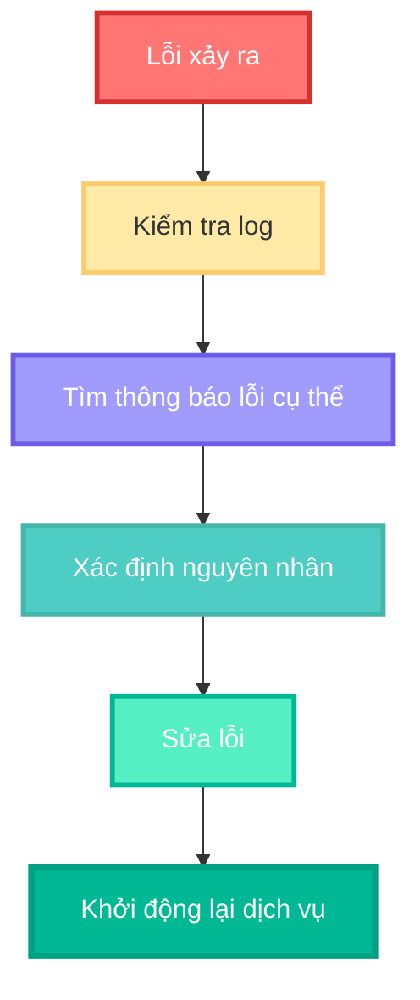

---

## 🔄 **d. Quy trình `RESET SLAVE` khi cần cấu hình lại**

*   **WHY:** Khi bạn cấu hình sai (ví dụ: sai `MASTER_HOST`, sai `File`/`Position`) hoặc muốn thiết lập lại replication từ đầu, các thông tin cũ vẫn được lưu trên Slave. Việc chạy `CHANGE MASTER TO` mới có thể không ghi đè hết các thiết lập cũ, gây ra hành vi không mong muốn.
*   **HOW:** Trước khi chạy một lệnh `CHANGE MASTER TO` mới để cấu hình lại, hãy thực hiện quy trình "dọn dẹp" trên **Slave**:
    ```sql
    -- Trên Slave
    STOP SLAVE;
    RESET SLAVE ALL; -- Lệnh này sẽ xóa toàn bộ thông tin kết nối Master cũ và xóa tất cả Relay Log.
    ```
    *   `RESET SLAVE ALL`: Đưa Slave về trạng thái "trinh nguyên", sẵn sàng để được cấu hình kết nối tới một Master mới (hoặc chính Master cũ với thông tin mới). Sau lệnh này, bạn mới chạy `CHANGE MASTER TO ...` và `START SLAVE;`.

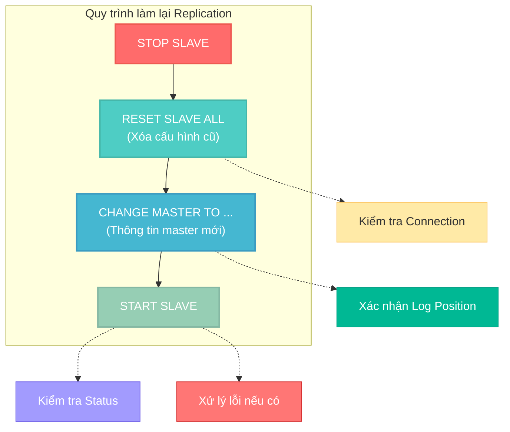
