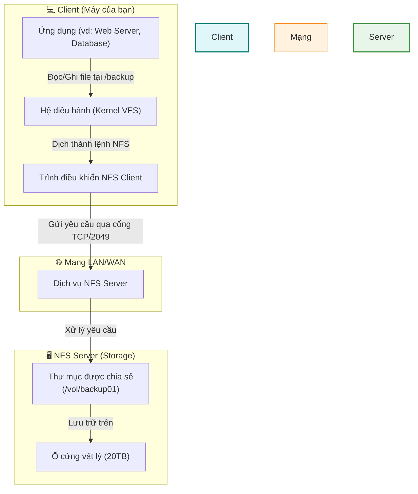
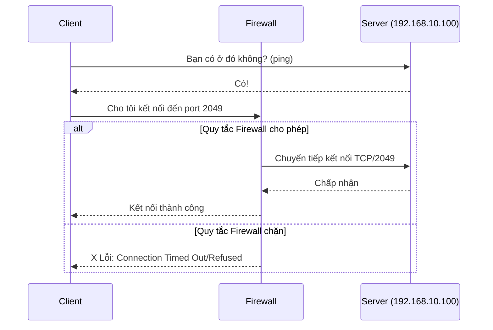
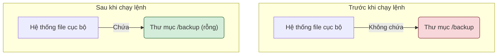
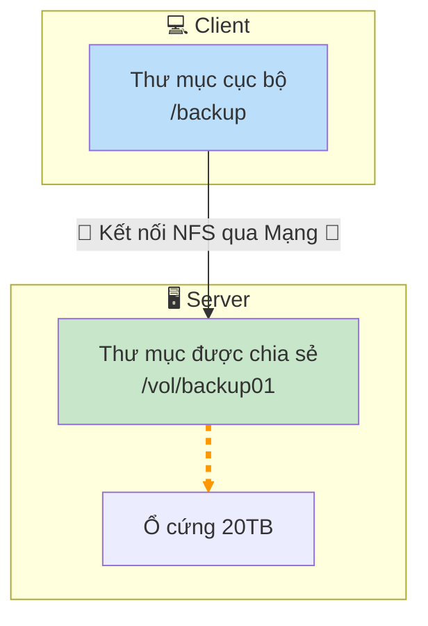
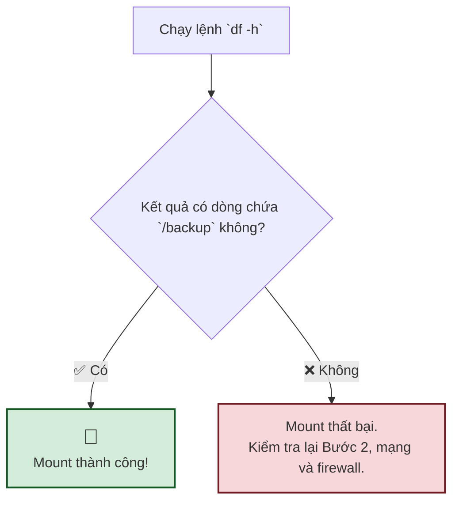
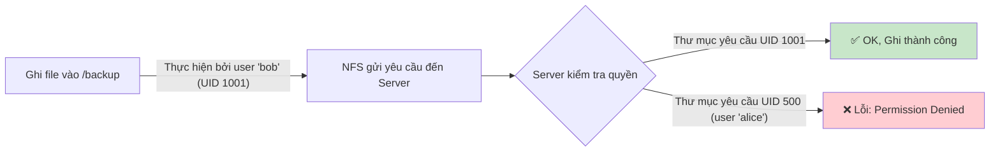
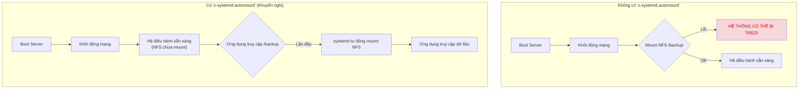
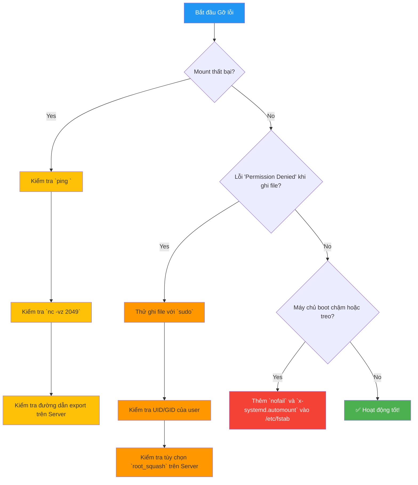

# Hướng dẫn Mount NFS 

## Phần 1: Lý Thuyết Nền Tảng - NFS Hoạt Động Như Thế Nào?

**NFS (Network File System)** là một giao thức cho phép máy tính của bạn (gọi là **Client**) truy cập vào các tập tin qua mạng từ một máy chủ lưu trữ (gọi là **Server**) một cách liền mạch, như thể các tập tin đó đang nằm trên ổ cứng cục bộ của bạn.

*   **Client**: Máy chủ của bạn, nơi cần sử dụng dung lượng lưu trữ.
*   **Server**: Máy chủ lưu trữ (Storage) chứa dữ liệu và chia sẻ (export) một thư mục qua mạng.
*   **Export**: Thư mục trên Server được chia sẻ cho các Client.

**Phiên bản NFSv4.1**, được sử dụng trong hướng dẫn này, là một tiêu chuẩn hiện đại với nhiều ưu điểm:
*   **Chỉ dùng một cổng**: Hoạt động ổn định qua cổng **TCP/2049**, dễ dàng quản lý firewall.
*   **Stateful**: Server và Client duy trì một "phiên làm việc", giúp phục hồi kết nối tốt hơn khi có sự cố mạng.
*   **Bảo mật tích hợp**: Nền tảng cho các cơ chế xác thực mạnh mẽ như Kerberos.



---

## Phần 2: Chuẩn Bị Trước Khi Bắt Đầu

Trước khi thực hành, hãy đảm bảo bạn có đủ các yếu tố sau:

1.  **Quyền truy cập**: Bạn đang thao tác trên máy **Client** và có quyền `sudo`.
2.  **Thông tin kết nối**:
    *   IP hoặc hostname của NFS Server: ví dụ `192.168.10.100`.
    *   Đường dẫn export trên Server: ví dụ `/vol/backup01`.
3.  **Cài đặt gói cần thiết**:
    *   Trên **Debian/Ubuntu**: `sudo apt-get update && sudo apt-get install -y nfs-common`
    *   Trên **RHEL/CentOS/Rocky/Alma**: `sudo yum install -y nfs-utils`
4.  **Kiểm tra kết nối mạng**: Đảm bảo firewall cho phép Client kết nối đến Server qua cổng **TCP 2049**.


Bạn có thể kiểm tra nhanh bằng lệnh: `nc -vz 192.168.10.100 2049`. Nếu kết quả là `succeeded!`, bạn đã sẵn sàng.

---

## Phần 3: Hướng Dẫn Thực Hành Từng Bước

### Bước 1: Tạo "Cổng Kết Nối" (Mount Point)

Đây là một thư mục rỗng trên máy Client. Sau khi mount, thư mục này sẽ là cửa ngõ để bạn thấy toàn bộ dữ liệu từ Server.

**Lệnh:**
```bash
sudo mkdir -p /backup
```

**Mô hình trước và sau khi tạo:**


**Giải thích**: Lệnh `mkdir -p` tạo ra thư mục `/backup` một cách an toàn, không báo lỗi nếu nó đã tồn tại.

### Bước 2: Gắn Kết Nối Thủ Công (Để Kiểm Tra)

Bây giờ, chúng ta sẽ "nối" thư mục `/backup` của Client vào thư mục `/vol/backup01` của Server.

**Lệnh:**
```bash
sudo mount -t nfs -o vers=4.1,hard,_netdev 192.168.10.100:/vol/backup01 /backup
```

**Giải thích chi tiết các tùy chọn `-o` (options):**
*   `vers=4.1`: Yêu cầu sử dụng NFS phiên bản 4.1. Rõ ràng và tránh các phiên bản cũ kém an toàn hơn.
*   `hard`: Tùy chọn "cứng rắn". Nếu kết nối mạng bị gián đoạn, ứng dụng sẽ "đứng im" chờ đến khi kết nối được khôi phục. Điều này **bảo vệ toàn vẹn dữ liệu** hơn so với tùy chọn `soft` (có thể báo lỗi và làm hỏng file đang ghi).
*   `_netdev`: Chỉ thị cho hệ thống rằng đây là một ổ đĩa mạng. Hệ thống sẽ đợi cho đến khi mạng sẵn sàng hoàn toàn rồi mới thực hiện mount. Cực kỳ quan trọng để tránh lỗi khi khởi động.
*   `intr`: Tùy chọn này cho phép ngắt các tiến trình đang bị treo do `hard mount`. **Lưu ý**: Trên các phiên bản kernel Linux hiện đại, tùy chọn này thường bị **lờ đi (ignored)** vì cơ chế xử lý tín hiệu đã tốt hơn. Giữ lại cũng không gây hại.

**Sơ đồ kết nối sau khi mount thành công:**

👉 Từ giờ phút này, mọi thao tác trong `/backup` đều thực sự diễn ra trên ổ cứng 20TB của Server.

### Bước 3: Xác Minh Kết Nối

Làm sao để biết lệnh `mount` đã thành công?

**Lệnh kiểm tra:**
```bash
df -h | grep /backup
```
Hoặc một lệnh khác chi tiết hơn:
```bash
mount | grep nfs
```

**Kết quả mong đợi từ `df -h`:**
```
192.168.10.100:/vol/backup01   20T   15G   20T   1% /backup
```
Dòng này xác nhận rằng một hệ thống file từ IP `192.168.10.100` với dung lượng `20T` (20 Terabytes) đã được gắn vào `/backup`.



### Bước 4: Kiểm Tra Hoạt Động Đọc/Ghi (I/O Test)

Chỉ xác minh thôi chưa đủ, bạn cần đảm bảo mình có thể đọc và ghi dữ liệu.

**Lệnh:**
```bash
# Ghi một file test
echo "NFS connection is working!" | sudo tee /backup/test-io.txt

# Đọc lại nội dung file đó
sudo cat /backup/test-io.txt
```
Nếu bạn thấy dòng chữ `NFS connection is working!` hiển thị ra, nghĩa là mọi thứ đã thông suốt.

**Xử lý lỗi "Permission denied":**
Lỗi này thường xảy ra do cơ chế phân quyền trên NFS Server.
*   **root_squash**: Một cài đặt mặc định trên Server sẽ "hạ quyền" user `root` của Client thành một user thường (thường là `nobody`). Nếu bạn ghi file bằng `sudo` (quyền root), bạn có thể bị từ chối.
*   **UID/GID Mapping**: Quyền ghi/đọc phụ thuộc vào User ID (UID) và Group ID (GID) của bạn trên Client có khớp với quyền sở hữu file/thư mục trên Server hay không.



### Bước 5: Thiết Lập Tự Động Mount Khi Khởi Động

Lệnh `mount` ở trên chỉ có tác dụng tạm thời. Nếu bạn reboot máy Client, kết nối sẽ mất. Để nó tự động kết nối lại mỗi khi khởi động, chúng ta cần chỉnh sửa file `/etc/fstab`.

**1. Mở file `/etc/fstab`:**
```bash
sudo nano /etc/fstab
```

**2. Thêm dòng cấu hình:**
Dán dòng sau vào cuối file. Đây là cấu hình **bền vững và được khuyến nghị** cho môi trường sản phẩm.

```
# <device>                       <mount_point> <type> <options>                                                                               <dump> <pass>
192.168.10.100:/vol/backup01     /backup       nfs    vers=4.1,hard,_netdev,nofail,x-systemd.automount,timeo=600,retrans=2,rsize=1048576,wsize=1048576   0      0
```

**Giải thích các tùy chọn nâng cao này:**
*   `nofail`: **Rất quan trọng!** Nếu vì lý do nào đó NFS Server không sẵn sàng khi Client khởi động, hệ thống sẽ **không bị treo** mà vẫn boot vào bình thường.
*   `x-systemd.automount`: **Tối ưu hóa tốc độ khởi động!** Hệ thống sẽ không mount NFS ngay lúc boot. Thay vào đó, nó sẽ tự động mount **chỉ khi có một ứng dụng nào đó truy cập vào thư mục `/backup` lần đầu tiên**.
*   `timeo=600`: Tăng thời gian chờ (timeout) lên 60 giây (đơn vị là 0.1s). Hữu ích cho mạng không ổn định.
*   `retrans=2`: Số lần thử lại một yêu cầu RPC nếu không nhận được phản hồi.
*   `rsize=1048576, wsize=1048576`: Đặt kích thước khối đọc/ghi là 1MB. Thường giúp tăng tốc độ truyền dữ liệu trên các mạng nhanh.

**Sơ đồ so sánh quá trình khởi động:**



**3. Kiểm tra cú pháp:**
Sau khi lưu file `fstab`, chạy lệnh sau để hệ thống đọc lại và mount những gì cần thiết mà không cần reboot:
```bash
sudo mount -a
```
Nếu lệnh chạy êm ru không báo lỗi, bạn đã cấu hình thành công!

---

## Phần 4: Tổng Kết và Xử Lý Sự Cố

### Checklist Nhanh

1.  [ ] **Cài đặt**: `nfs-common` / `nfs-utils`.
2.  [ ] **Tạo điểm mount**: `sudo mkdir -p /backup`.
3.  [ ] **Mount thủ công**: `sudo mount -t nfs ...`.
4.  [ ] **Kiểm tra**: `df -h` và `echo ... > /backup/test.txt`.
5.  [ ] **Tự động hóa**: Thêm dòng cấu hình bền vững vào `/etc/fstab`.
6.  [ ] **Xác thực**: `sudo mount -a`.

### Sơ Đồ Gỡ Lỗi Nhanh


