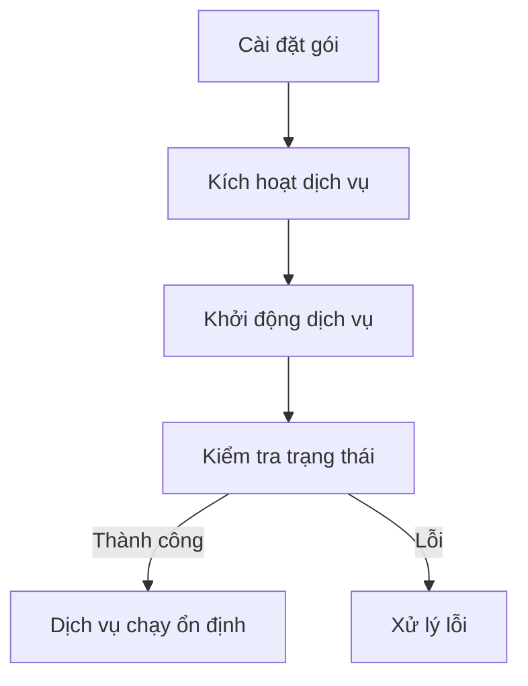
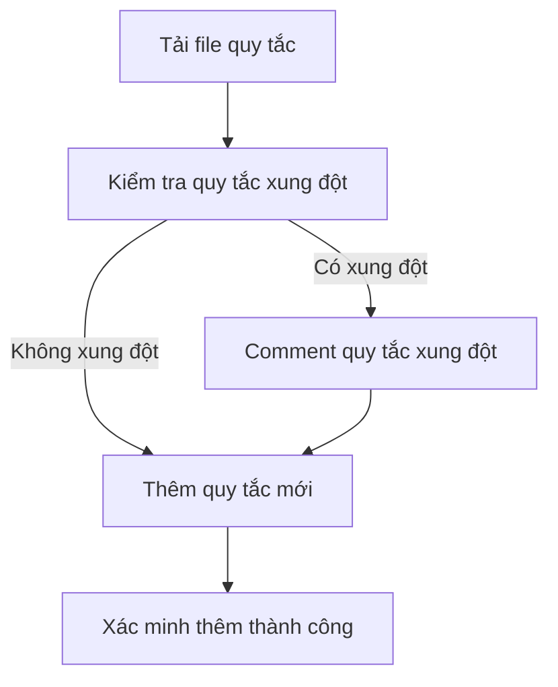
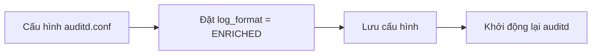
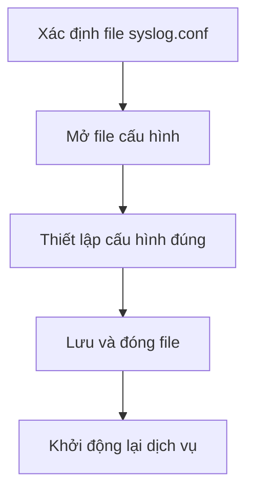
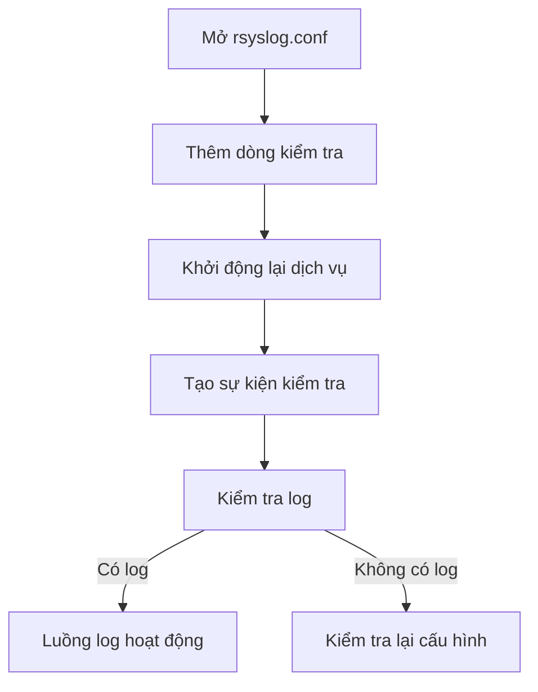
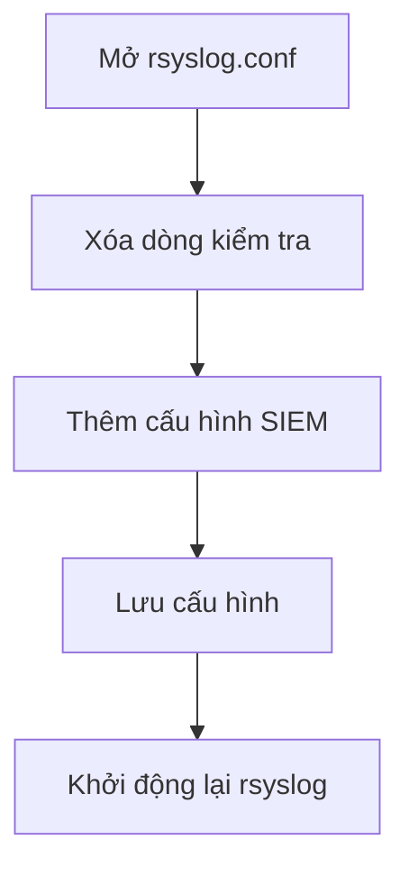
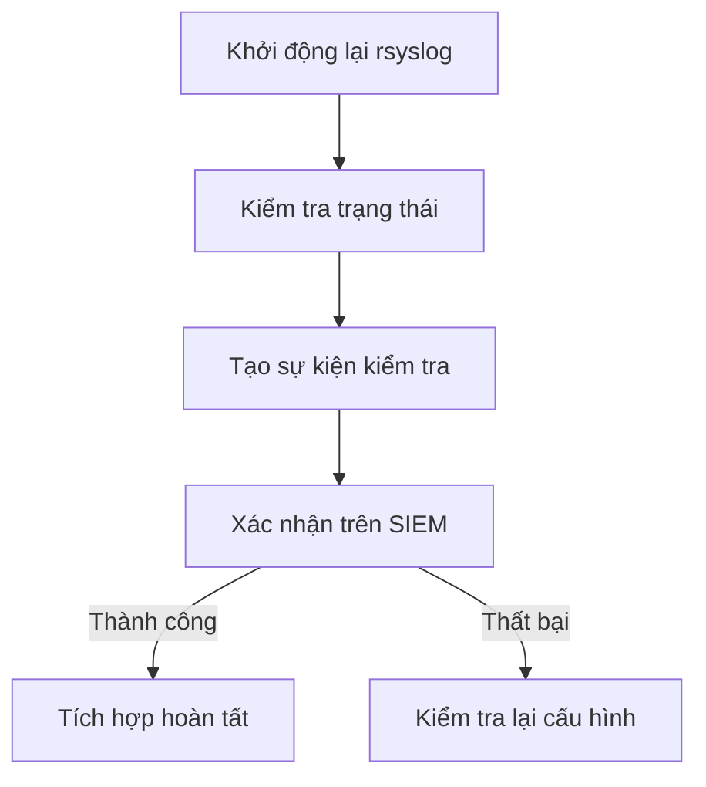

### **Hướng dẫn Toàn diện và Sửa lỗi: Tích hợp Log Auditd trên Oracle Linux 8 vào SIEM**

---

### **Phần 1: Chuẩn bị - Thông tin và Mở mạng**

**1.1. Địa chỉ IP của EC SIEM**
Xác định chính xác địa chỉ IP của máy chủ SIEM Event Collector (EC) mà bạn sẽ gửi log đến. Ví dụ: `10.169.20.230`.

**1.2. Yêu cầu Mở mạng**
Đảm bảo máy chủ OL8 của bạn được phép kết nối đến địa chỉ IP của EC SIEM qua tường lửa.
*   **Port**: `514`
*   **Giao thức**: `TCP` (khuyến nghị vì độ tin cậy).


---

### **Phần 2: Cài đặt và Cấu hình Dịch vụ Auditd**

**Bước 2.1: Cài đặt và Kích hoạt Dịch vụ**

1.  **Cài đặt các gói cần thiết:** OL8 sử dụng `yum` hoặc `dnf`.
    ```bash
    yum install audit audispd-plugins -y
    ```
2.  **Kích hoạt và khởi động dịch vụ:**
    ```bash
    chkconfig auditd on
    service auditd start
    ```
    *   **Kiến thức:** Lệnh `chkconfig on` đảm bảo dịch vụ sẽ tự động khởi động cùng hệ thống. Lệnh `service start` khởi động dịch vụ ngay lập tức.

3.  **Kiểm tra trạng thái dịch vụ (Bước kiểm tra đầu tiên):**
    ```bash
    service auditd status
    ```
    *   **Tại sao cần kiểm tra?** Lệnh này là công cụ gỡ rối quan trọng nhất của bạn. Nó cho bạn biết dịch vụ có đang chạy (`active (running)`) hay không và hiển thị các lỗi gần đây nhất. Hãy tập thói quen sử dụng nó sau mỗi lần khởi động lại dịch vụ.



**Bước 2.2: Cấu hình Quy tắc Audit (`audit.rules`)**

1.  **Tải file quy tắc:** Tải file `audit_rules.rules` từ link Google Drive đã cung cấp.

2.  **Kiểm tra quy tắc xung đột:** Hướng dẫn gốc yêu cầu tìm và comment lại một quy tắc `execve` mặc định. Chúng ta sẽ dùng `grep` để kiểm tra.
    ```bash
    grep -E '^\s*(-a exit,always -F arch=b64 -S execve)' /etc/audit/rules.d/audit.rules
    ```
    *   **Tại sao cần kiểm tra?** Một số hệ thống có sẵn các quy tắc mặc định. Việc thêm một bộ quy tắc mới có thể gây trùng lặp, dẫn đến lỗi `Rule exists` khi khởi động `auditd`.
    *   **Hành động:** Nếu lệnh trên có output, hãy mở file (`vi /etc/audit/rules.d/audit.rules`) và thêm dấu `#` vào đầu dòng chứa quy tắc đó.

3.  **Thêm bộ quy tắc mới:** Bổ sung nội dung của file đã tải vào **cuối** file `/etc/audit/rules.d/audit.rules`.
    ```bash
    # Ví dụ:
    cat /path/to/downloaded/audit_rules.rules >> /etc/audit/rules.d/audit.rules
    ```
    **Lỗi cần tránh:** Tuyệt đối không dùng `>` vì nó sẽ xóa sạch file cấu hình gốc. Luôn dùng `>>`.



**Bước 2.3: Cấu hình Định dạng Log (`auditd.conf`)**
Chúng ta sẽ sử dụng `ENRICHED` để log dễ đọc hơn cho cả người và máy (SIEM).

1.  **Chỉnh sửa file:** `vi /etc/audit/auditd.conf`
2.  **Đảm bảo cấu hình:** `log_format = ENRICHED`
    *   **Kiến thức:** `RAW` (mặc định) chỉ hiển thị ID số (`uid=1000`). `ENRICHED` sẽ dịch các ID này sang tên tương ứng (`UID="vnpt"`), giúp việc phân tích log trên SIEM trở nên dễ dàng hơn rất nhiều.



---

### **Phần 3: Cấu hình Audispd Dispatcher (Bước quan trọng đã được sửa lỗi)**

Đây là bước kết nối giữa `auditd` và `rsyslog`. **Tài liệu gốc đã cung cấp thông tin không chính xác** cho OL8, chúng ta sẽ thực hiện theo cấu hình đã được kiểm chứng.

1.  **Xác định vị trí file cấu hình plugin:**
    ```bash
    find /etc -type f -name "syslog.conf"
    ```
    Trên OL8, kết quả thường là `/etc/audit/plugins.d/syslog.conf`.

2.  **Chỉnh sửa file `/etc/audit/plugins.d/syslog.conf`:**
    ```bash
    vi /etc/audit/plugins.d/syslog.conf
    ```
3.  **Đảm bảo nội dung file chính xác như sau:**
    ```
    active = yes
    direction = out
    path = /sbin/audisp-syslog
    type = always
    args = LOG_LOCAL6
    format = string
    ```
    **Hiểu lầm quan trọng cần tránh:**
    *   Tài liệu gốc hướng dẫn `path = builtin_syslog`. Plugin này giao tiếp qua Unix domain socket.
    *   Trên OL8, `rsyslog` mặc định **tắt** khả năng nghe trên socket này (`SysSock.Use="off"`), khiến `builtin_syslog` không thể gửi log. Đây là nguyên nhân gốc rễ gây ra lỗi "log không đến được rsyslog" mà chúng ta đã gặp.
    *   **Giải pháp:** Cấu hình `path = /sbin/audisp-syslog` sử dụng một chương trình thực thi riêng biệt, có khả năng giao tiếp thành công với `rsyslog` ngay cả khi `SysSock.Use="off"`.



---

### **Phần 4: Cấu hình Rsyslog và Kiểm tra Nội bộ (Bước không thể bỏ qua)**

Đây là bước "tự kiểm tra" để đảm bảo mọi thứ hoạt động hoàn hảo trước khi gửi log đi.

**Bước 4.1: Phương pháp Kiểm tra Nội bộ**

1.  **Mở file `/etc/rsyslog.conf`:** `vi /etc/rsyslog.conf`

2.  **Thêm dòng kiểm tra tạm thời:** Thêm dòng sau vào phần `#### RULES ####`.
    ```
    # Dòng để kiểm tra nội bộ log auditd (xóa sau khi hoàn tất)
    local6.*                                            /var/log/auditd_local6_test.log
    ```
    *   **Tại sao cần làm vậy?** Dòng này hoạt động như một "hộp thư tạm thời". Nó yêu cầu `rsyslog` ghi tất cả log `local6` (mà `audispd` đang gửi) vào một file cục bộ để chúng ta có thể xem và xác nhận luồng log nội bộ đã thông suốt.

3.  **Khởi động lại các dịch vụ và tạo sự kiện:**
    ```bash
    service auditd restart
    service rsyslog restart
    ls /root
    ```

4.  **Kiểm tra file log:**
    ```bash
    tail -f /var/log/auditd_local6_test.log
    ```
    **Kết quả mong đợi:** Bạn sẽ thấy các dòng log audit có tiền tố `audispd:` và định dạng `ENRICHED`. Nếu thành công, bạn có thể tự tin chuyển sang bước tiếp theo.



---

### **Phần 5: Cấu hình Cuối cùng và Gửi log tới SIEM**

**Bước 5.1: Hoàn thiện Cấu hình Rsyslog**

1.  **Chỉnh sửa file `/etc/rsyslog.conf`:** `vi /etc/rsyslog.conf`

2.  **Dọn dẹp cấu hình:**
    *   **Xóa hoặc comment** dòng kiểm tra tạm thời: `# local6.* /var/log/auditd_local6_test.log`
    *   **Lỗi cần tránh:** Nếu quên không xóa dòng này, log sẽ vừa được gửi đến SIEM, vừa được ghi vào file cục bộ, gây lãng phí dung lượng đĩa.

3.  **Thêm cấu hình gửi log tới SIEM vào cuối file:**
    ```
    $LocalHostName <IP của máy chủ đang cài đặt>
    local6.*            @@<IP address của EC SIEM>
    authpriv.*          @@<IP address của EC SIEM>
    ```
    *   **Ví dụ thực tế:**
        ```
        $LocalHostName 10.163.23.72
        local6.*            @@10.169.20.230
        authpriv.*          @@10.169.20.230
        ```
    *   **Lỗi cần tránh:** Phải thay thế `<...>` bằng IP thực tế. Nếu để nguyên, `rsyslog` sẽ báo lỗi cú pháp khi khởi động.
    *   **Giải thích:** `@@` chỉ định gửi log qua **TCP** (đáng tin cậy).



**Bước 5.2: Khởi động lại Dịch vụ và Kiểm tra Tổng thể**

1.  **Khởi động lại `rsyslog`:**
    ```bash
    service rsyslog restart
    ```
2.  **Kiểm tra trạng thái dịch vụ và log của nó để đảm bảo không còn lỗi:**
    ```bash
    service rsyslog status
    tail -n 20 /var/log/messages # Kiểm tra log chi tiết để đảm bảo không còn lỗi
    ```

3.  **Tạo sự kiện kiểm tra cuối cùng:**
    ```bash
    ls /root
    touch /tmp/final_siem_test
    rm /tmp/final_siem_test
    ```

4.  **Xác nhận trên SIEM:** Đăng nhập vào giao diện SIEM và tìm kiếm log từ địa chỉ IP của máy chủ của bạn (`10.163.23.72`). Nếu log xuất hiện, bạn đã tích hợp thành công.

