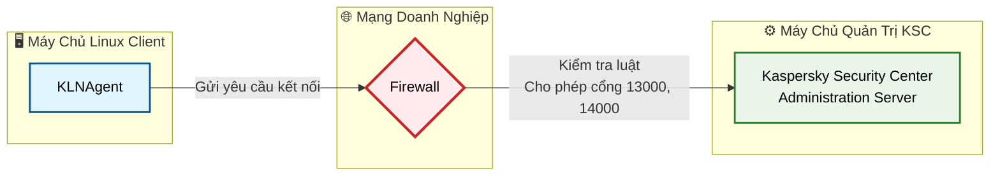
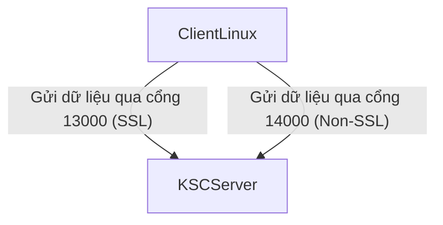
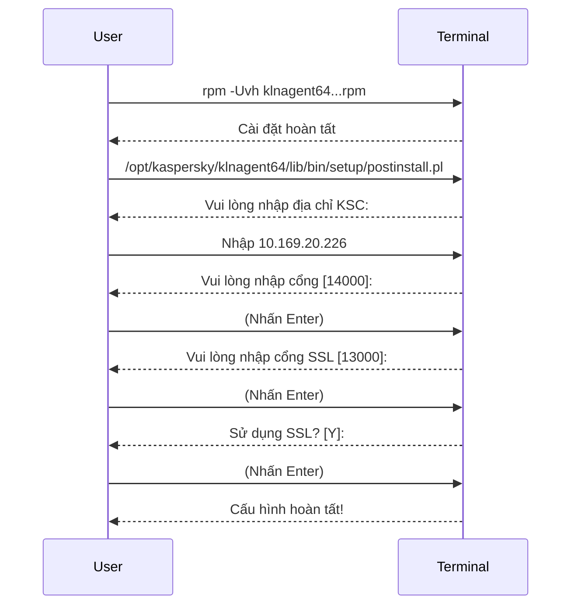
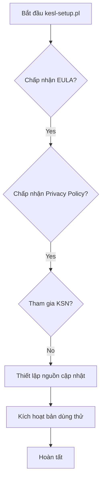
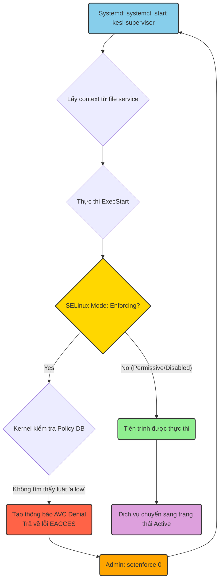
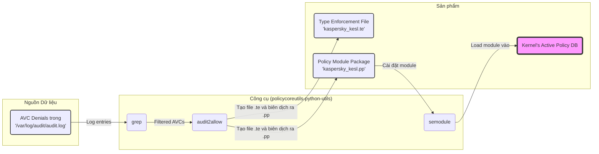
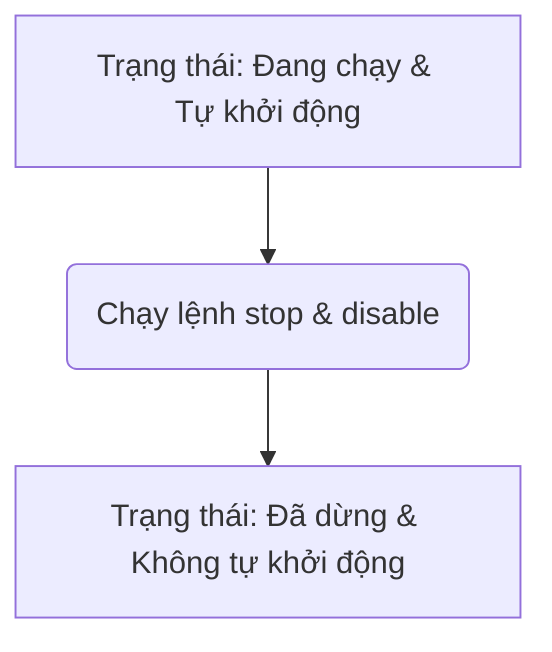
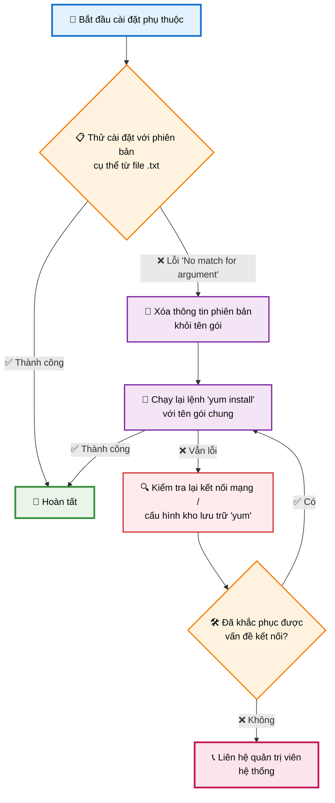
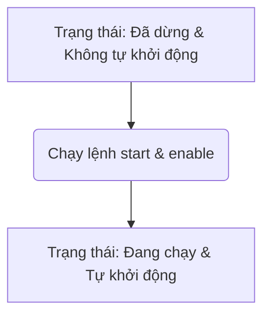
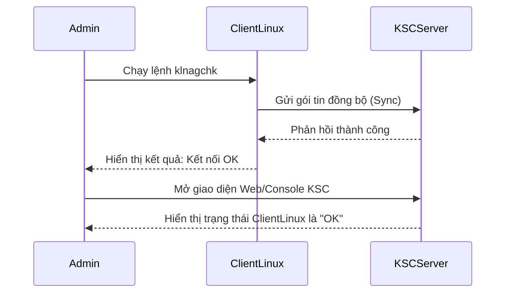

### **Hướng Dẫn Toàn Diện Cài Đặt Kaspersky Endpoint Security for Linux (KESL) và Network Agent trên Máy Chủ Linux Mới**

#### **Giới thiệu**

Hướng dẫn này sẽ chỉ cho bạn cách cài đặt và cấu hình hai thành phần quan trọng của Kaspersky trên một máy chủ Linux hoàn toàn mới:

1.  **Kaspersky Endpoint Security for Linux (KESL):** Đây là chương trình chống virus chính, cung cấp khả-năng bảo vệ máy chủ của bạn khỏi phần mềm độc hại, mã độc tống tiền và các mối đe dọa khác.
2.  **Kaspersky Network Agent (KLNAgent):** Đây là "cầu nối" giao tiếp giữa máy chủ Linux của bạn và máy chủ quản trị trung tâm **Kaspersky Security Center (KSC)**. Nhờ có Network Agent, quản trị viên có thể quản lý, đặt chính sách, cập nhật và theo dõi máy chủ của bạn từ xa.

#### **Yêu cầu chuẩn bị**

*   Quyền truy cập `root` vào máy chủ Linux.
*   Các file cài đặt: `kesl-11.2.0-4528.x86_64.rpm` và `klnagent64-11.0.0-38.x86_64.rpm`.
*   Kết nối mạng từ máy chủ Linux đến máy chủ quản trị KSC.

---

### **Bước 1: Chuẩn bị Mạng - Mở Cổng Tường Lửa**

**Mục tiêu:** Đảm bảo máy chủ Linux (Client) có thể "nói chuyện" được với máy chủ quản trị Kaspersky Security Center (KSC).

**Lý thuyết:** Giao tiếp giữa KLNAgent và KSC diễn ra qua các cổng mạng cụ thể. Nếu tường lửa (firewall) chặn các cổng này, KLNAgent sẽ không thể kết nối, đồng bộ, nhận chính sách hay gửi trạng thái về KSC.

**Hành động:**
Bạn cần cấu hình tường lửa (trên máy chủ Linux hoặc trên thiết bị mạng) để cho phép kết nối **đi ra (OUTGOING)** từ máy chủ Linux của bạn đến địa chỉ IP máy chủ KSC mới là `10.169.20.226 ` qua các cổng sau:

*   **Cổng `13000`:** Dùng cho kết nối được mã hóa SSL (an toàn). Đây là cổng ưu tiên.
*   **Cổng `14000`:** Dùng cho kết nối không mã hóa.

*   **Luồng giao tiếp giữa Client và KSC:**





---

### **Bước 2: Cài Đặt và Cấu Hình Kaspersky Network Agent (KLNAgent)**

**Mục tiêu:** Cài đặt "cầu nối" KLNAgent lên máy chủ Linux.

**Lý thuyết:** Network Agent là thành phần bắt buộc phải có để KSC có thể quản lý máy chủ này. Việc cài đặt bao gồm hai phần: cài đặt gói `.rpm` và chạy script cấu hình `postinstall.pl` để khai báo địa chỉ KSC ban đầu.

**Hành động:**

1.  **Cài đặt gói RPM:**
    Mở Terminal và chạy lệnh sau (đảm bảo bạn đang ở trong thư mục chứa file `.rpm`):
    ```bash
    rpm -Uvh klnagent64-11.0.0-38.x86_64.rpm
    ```
    *   **Ghi chú:** Nếu bạn nhận được thông báo "package ... is already installed", điều đó là bình thường và bạn có thể bỏ qua để tiếp tục với bước tiếp theo.

2.  **Chạy script cấu hình:**
    ```bash
    /opt/kaspersky/klnagent64/lib/bin/setup/postinstall.pl
    ```
3.  **Trả lời các câu hỏi cấu hình:**
    *   `Please enter Administration Server DNS-name or static IP-address`: Nhập 10.169.20.226 mà Network Agent sẽ cố gắng kết nối **ban đầu**
    *   `Please enter Administration Server port number [14000]:`: Nhấn `Enter` (chấp nhận mặc định).
    *   `Please enter Administration Server ssl port number [13000]:`: Nhấn `Enter` (chấp nhận mặc định).
    *   `Please enter 'Y' to confirm that you want to use SSL encryption... [Y]:`: Nhấn `Enter` (chấp nhận mặc định).
    *   `Please choose connection gateway mode: [1]:`: Nhấn `Enter` hoặc gõ `1` rồi nhấn `Enter`.

*   **Quy trình cài đặt KLNAgent:**



---

### **Bước 3: Cập Nhật Địa Chỉ IP Máy Chủ KSC và Kiểm Tra**

**Mục tiêu:** Chuyển hướng KLNAgent đến địa chỉ IP mới của máy chủ KSC và xác nhận kết nối.

**Lý thuyết:** Sau khi cài đặt KLNAgent với địa chỉ IP cũ, chúng ta sử dụng công cụ `klmover` để "di chuyển" (move) kết nối của agent sang địa chỉ IP mới. Lệnh `klnagchk` là công cụ chẩn đoán để kiểm tra trạng thái kết nối của agent.

**Hành động:**

1.  **Chuyển hướng đến IP mới:**
    ```bash
    /opt/kaspersky/klnagent64/bin/klmover -address 10.169.20.226 
    ```
2.  **Kiểm tra trạng thái kết nối:**
    ```bash
    /opt/kaspersky/klnagent64/bin/klnagchk
    ```
    *   Trong kết quả hiển thị, hãy tìm dòng `Server address` và đảm bảo nó hiển thị đúng địa chỉ IP mới: `10.169.20.226 `.


---

### **Bước 4: Cài Đặt và Cấu Hình Kaspersky Endpoint Security (KESL)**

**Mục tiêu:** Cài đặt chương trình chống virus chính và thực hiện cấu hình ban đầu.

**Lý thuyết:** Tương tự như KLNAgent, việc cài đặt KESL bao gồm cài đặt gói `.rpm` và chạy script cấu hình `kesl-setup.pl`. Trong quá trình này, bạn sẽ được hỏi về các thỏa thuận pháp lý và các cài đặt cơ bản.

**Hành động:**

1.  **Cài đặt gói RPM:**
    ```bash
    rpm -Uvh kesl-11.2.0-4528.x86_64.rpm
    ```
2.  **Chạy script cấu hình:**
    ```bash
    /opt/kaspersky/kesl/bin/kesl-setup.pl
    ```
3.  **Trả lời các câu hỏi cấu hình:**
    *   `[en_US.UTF-8]:`: Nhấn `Enter` (chấp nhận ngôn ngữ mặc định).
    *   `Press ENTER to display the EULA...`: Nhấn `Enter`, đọc qua (nhấn `Space` để cuộn).
    *   `I confirm that I have fully read... EULA [y/n]:`: Gõ `y` và nhấn `Enter`.
    *   `I am aware and agree that my data will be handled... Privacy Policy [y/n]:`: Gõ `y` và nhấn `Enter`.
    *   `I confirm that I have fully read... Kaspersky Security Network Statement [y/n]:`: Gõ `n` và nhấn `Enter`.
        *   **Giải thích về KSN:** Kaspersky Security Network (KSN) là một dịch vụ đám mây giúp phát hiện các mối đe dọa mới nhanh hơn. Tuy nhiên, nhiều tổ chức chọn **'n' (không tham gia)** vì lý do chính sách bảo mật, không cho phép dữ liệu (dù đã được ẩn danh) gửi ra ngoài mạng nội bộ.
    *   `Specify user to grant the 'admin' role to (leave empty to skip):`: Nhấn `Enter`.
    *   `Specify the update source... [KLServers]:`: Nhập `10.169.20.226 ` và nhấn `Enter`.
    *   `...enter 'no' [n]:`: Gõ `n` và nhấn `Enter`.
    *   `Do you want to download the latest databases now? [y]:`: Gõ `y` và nhấn `Enter`.
    *   `Do you want to set other update settings? [y]`: Gõ `n` và nhấn `Enter`.
    *   `Do you want to enable scheduled updates? [y]:`: Gõ `n` và nhấn `Enter`.
    *   `Enter an empty string to add the built-in trial key:`: Nhấn `Enter`.

*   **Luồng cấu hình KESL:**



### **Bước 4 (Tiếp theo): Xử lý Lỗi Khởi Động Dịch Vụ do Xung đột Chính sách SELinux (Bước Bổ Sung Kỹ thuật)**

**Tình huống:** Sau khi script `kesl-setup.pl` hoàn tất, Systemd không thể khởi động `kesl-supervisor.service`. Kiểm tra trạng thái dịch vụ cho thấy lỗi `code=exited, status=203/EXEC`, và nhật ký hệ thống (`journalctl`) xác nhận tiến trình trả về mã lỗi `13 (EACCES - Permission Denied)`.

**Lý thuyết:** Lỗi `EACCES` trong bối cảnh này, khi các quyền DAC (`rwx`) đã được xác nhận là đúng, thường chỉ ra rằng một cơ chế **Kiểm soát Truy cập Bắt buộc (Mandatory Access Control - MAC)** đang thực thi chính sách từ chối. Trên các hệ điều hành dựa trên RHEL như CentOS, Oracle Linux, triển khai MAC mặc định là **SELinux (Security-Enhanced Linux)**.

Khi một dịch vụ mới (như `kesl-supervisor`) được cài đặt, nếu không có chính sách (policy) nào được định nghĩa sẵn để cấp cho nó các quyền cần thiết, SELinux sẽ hoạt động theo nguyên tắc "từ chối theo mặc định" (default deny) và ngăn chặn các hành động không được cho phép rõ ràng, ví dụ như thực thi một file từ một context không xác định hoặc chuyển đổi sang một domain không được cấp phép.

---

### **4A. Chẩn Đoán và Xác Nhận Nguyên Nhân do SELinux**

Mục tiêu của bước này là cô lập và xác nhận rằng chính sách SELinux đang ở chế độ `Enforcing` là nguyên nhân trực tiếp gây ra lỗi khởi động dịch vụ.

#### **Sơ đồ Chẩn đoán**



#### **Các bước thực hiện:**

1.  **Xác định chế độ hoạt động của SELinux:**
    ```bash
    getenforce
    ```
    *   Kết quả `Enforcing` xác nhận rằng chính sách đang được áp dụng một cách nghiêm ngặt.

2.  **Chuyển SELinux sang chế độ `Permissive` để chẩn đoán:**
    Thao tác này sẽ vô hiệu hóa việc thực thi chính sách (enforcement) nhưng vẫn duy trì việc ghi lại các vi phạm (logging AVC denials).
    ```bash
    setenforce 0
    ```
3.  **Cố gắng khởi động lại dịch vụ:**
    ```bash
    systemctl start kesl-supervisor.service
    systemctl status kesl-supervisor.service
    ```
    *   Kết quả `Active: active (running)` chứng tỏ rằng khi không có sự can thiệp của SELinux enforcement, dịch vụ hoạt động bình thường. Điều này xác nhận SELinux là nguyên nhân gốc rễ.

---

### **4B. Xây Dựng và Cài Đặt Module Chính Sách SELinux Tùy Chỉnh**

Mục tiêu của bước này là tạo ra một module chính sách tùy chỉnh (custom policy module) để cấp các quyền cần thiết cho dịch vụ `kesl-supervisor` hoạt động trong môi trường SELinux `Enforcing`.

#### **Sơ đồ Quy trình Xây dựng Module SELinux**



#### **Các bước thực hiện:**

1.  **Khôi phục trạng thái `Enforcing` của SELinux:**
    Đảm bảo hệ thống quay lại trạng thái bảo mật mặc định trước khi áp dụng chính sách mới.
    ```bash
    setenforce 1
    ```
2.  **Cài đặt các công cụ cần thiết:**
    Gói `policycoreutils-python-utils` cung cấp tiện ích `audit2allow`, công cụ thiết yếu để phân tích các thông báo từ chối của auditd và tạo ra các luật SELinux.
    ```bash
    yum install -y policycoreutils-python-utils
    ```
3.  **Tự động tạo và cài đặt module chính sách:**
    *   **Bước 1: Phân tích nhật ký audit và tạo module chính sách**
        Lệnh này sẽ trích xuất tất cả các thông báo từ chối (AVC denials) liên quan đến `kesl-supervisor` từ `audit.log`, sau đó `audit2allow` sẽ phân tích và tạo ra một file Type Enforcement (`.te`) và một Policy Package (`.pp`) có tên là `kaspersky_kesl`.
        ```bash
        grep kesl-supervisor /var/log/audit/audit.log | audit2allow -M kaspersky_kesl
        ```
    *   **Bước 2: Cài đặt và kích hoạt module chính sách**
        Lệnh `semodule -i` sẽ cài đặt package chính sách (`.pp`) vào kho lưu trữ module của hệ thống và sau đó tải nó vào chính sách đang hoạt động trong kernel.
        ```bash
        semodule -i kaspersky_kesl.pp
        ```
4.  **Xác thực lại hoạt động của dịch vụ:**
    Bây giờ, với SELinux ở chế độ `Enforcing` và đã có chính sách tùy chỉnh, dịch vụ phải khởi động thành công.
    ```bash
    systemctl start kesl-supervisor.service
    systemctl status kesl-supervisor.service
    ```
    *   Kết quả `Active: active (running)` xác nhận rằng module chính sách đã được áp dụng thành công và giải quyết triệt để vấn đề tương thích.


---

### **Bước 5: Tạm Dừng và Vô Hiệu Hóa Dịch Vụ**

**Mục tiêu:** Tạm thời dừng các dịch vụ Kaspersky để đảm bảo việc cài đặt các gói phụ thuộc không bị xung đột.

**Lý thuyết:** Trước khi cài đặt các thư viện hệ thống (như các module Perl), việc dừng các ứng dụng đang chạy sử dụng chúng là một thói quen tốt để tránh các lỗi không mong muốn. Chúng ta cũng vô hiệu hóa chúng để chúng không tự khởi động lại nếu máy chủ cần reboot giữa chừng.

**Hành động:** (Chọn bộ lệnh phù hợp với hệ điều hành của bạn)

*   **Đối với hệ điều hành hiện đại (CentOS/RHEL 7+, Ubuntu 15+):**
    ```bash
    systemctl stop kesl-supervisor
    systemctl stop klnagent64
    systemctl disable kesl-supervisor
    systemctl disable klnagent64
    ```
*   **Đối với hệ điều hành cũ hơn (CentOS/RHEL 6):**
    ```bash
    service kesl-supervisor stop
    service klnagent64 stop
    chkconfig kesl-supervisor off
    chkconfig klnagent64 off
    ```

*   **Trạng thái dịch vụ:**



---

### **Bước 6: Cài Đặt Các Gói Phụ Thuộc của Perl**

**Mục tiêu:** Cài đặt tất cả các thư viện Perl cần thiết để KESL và KLNAgent hoạt động đầy đủ chức năng.

**Lý thuyết:** Các script của Kaspersky được viết bằng Perl và yêu cầu nhiều module cụ thể. 

**Hành động:**

Chạy một lệnh duy nhất để cài đặt tất cả các gói Perl cần thiết (đã bỏ đi phần phiên bản cụ thể):

```bash
yum install -y perl-podlators perl-Encode perl-Storable perl-Socket 'perl-Scalar-List-Utils' perl-threads-shared perl perl-HTTP-Tiny perl-Pod-Perldoc perl-Text-ParseWords perl-Pod-Usage perl-macros perl-Exporter perl-Time-Local perl-Carp perl-PathTools perl-Pod-Simple perl-File-Path perl-threads perl-Getopt-Long perl-parent perl-Pod-Escapes perl-libs perl-constant perl-Time-HiRes perl-File-Temp perl-Filter
```
*   **Ghi chú:** `perl-Scalar-List-Utils` được đặt trong dấu nháy đơn vì tên của nó chứa các ký tự đặc biệt có thể bị shell hiểu nhầm.

*   **Logic xử lý lỗi cài đặt gói:**



---

### **Bước 7: Khởi Động và Kích Hoạt Lại Dịch Vụ**

**Mục tiêu:** Khởi động lại các dịch vụ Kaspersky và thiết lập chúng tự động chạy khi hệ thống khởi động.

**Lý thuyết:** Sau khi đã cài đặt xong tất cả các thành phần và phụ thuộc, chúng ta cần khởi động lại các dịch vụ để chúng hoạt động bình thường. Lệnh `enable` đảm bảo rằng ngay cả khi bạn khởi động lại máy chủ, Kaspersky sẽ luôn được bật để bảo vệ.

**Hành động:** (Chọn bộ lệnh phù hợp với hệ điều hành của bạn)

*   **Đối với hệ điều hành hiện đại (CentOS/RHEL 7+, Ubuntu 15+):**
    ```bash
    systemctl start kesl-supervisor
    systemctl start klnagent64
    systemctl enable kesl-supervisor
    systemctl enable klnagent64
    ```
*   **Đối với hệ điều hành cũ hơn (CentOS/RHEL 6):**
    ```bash
    service kesl-supervisor start
    service klnagent64 start
    chkconfig kesl-supervisor on
    chkconfig klnagent64 on
    ```

*   **Kích hoạt lại dịch vụ:**



---

### **Bước 8: Kiểm Tra Cuối Cùng và Các Bước Tiếp Theo**

**Mục tiêu:** Xác nhận lần cuối rằng mọi thứ hoạt động chính xác.

**Lý thuyết:** Sau khi hoàn tất, bạn nên kiểm tra lại kết nối của KLNAgent và xác nhận sự hiện diện của máy chủ trên giao diện KSC.

**Hành động:**

1.  **Chạy lại `klnagchk` trên máy chủ Linux:**
    ```bash
    /opt/kaspersky/klnagent64/bin/klnagchk
    ```
    *   Đảm bảo rằng nó báo cáo kết nối thành công đến `10.169.20.226 `.

2.  **Đăng nhập vào Kaspersky Security Center (KSC):**
    *   Tìm máy chủ Linux của bạn trong danh sách các thiết bị được quản lý.
    *   Kiểm tra trạng thái của nó. Ban đầu có thể là màu vàng hoặc xám, sau vài phút đồng bộ, nó nên chuyển sang màu xanh lá cây, cho thấy trạng thái "OK".

*   **Quy trình xác thực cuối cùng:**


