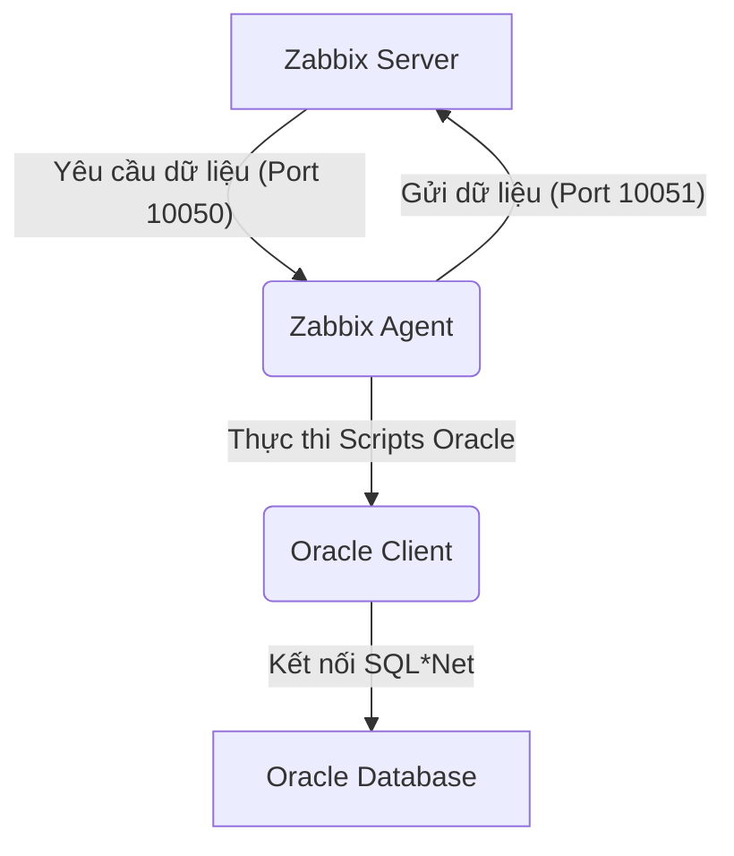
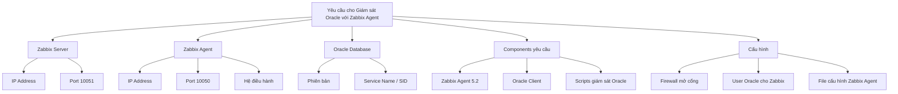
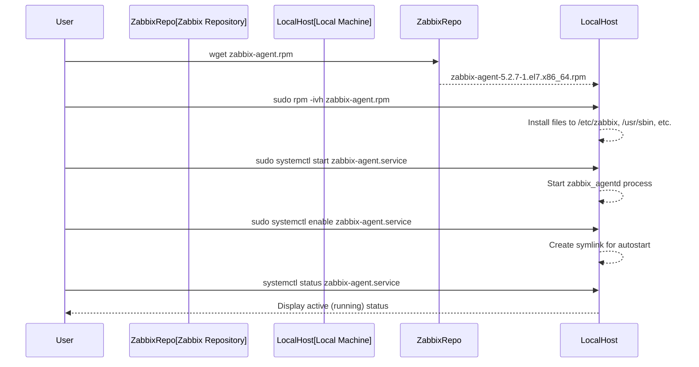
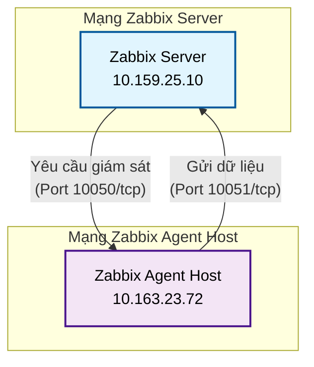
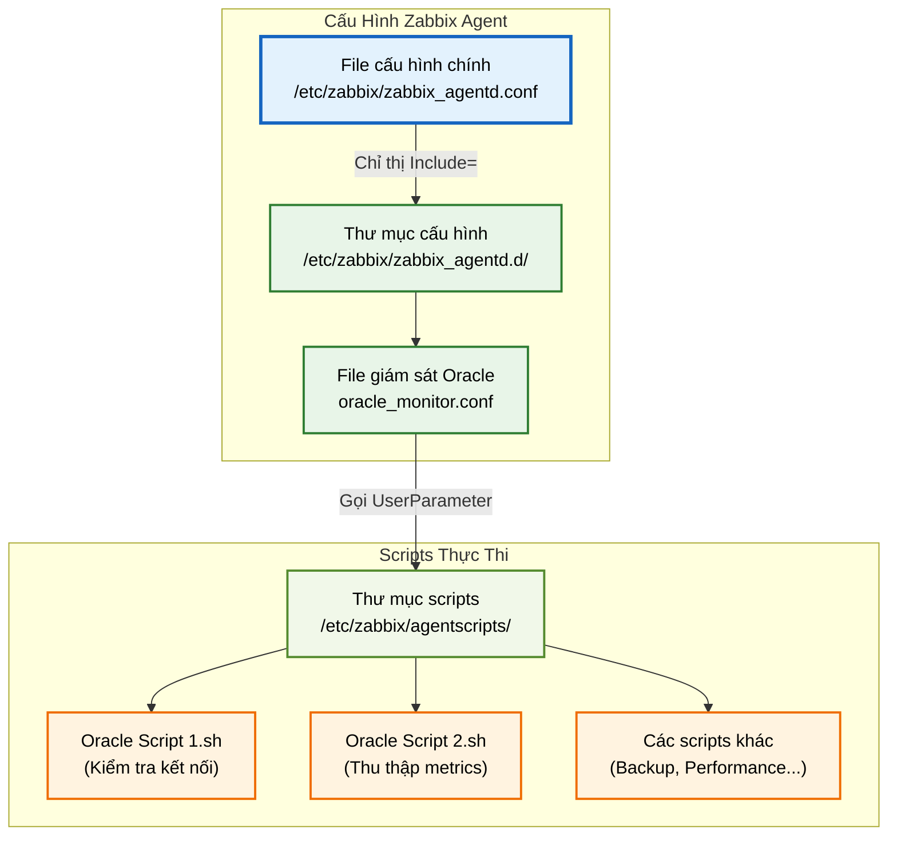
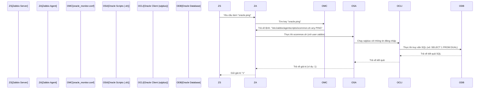
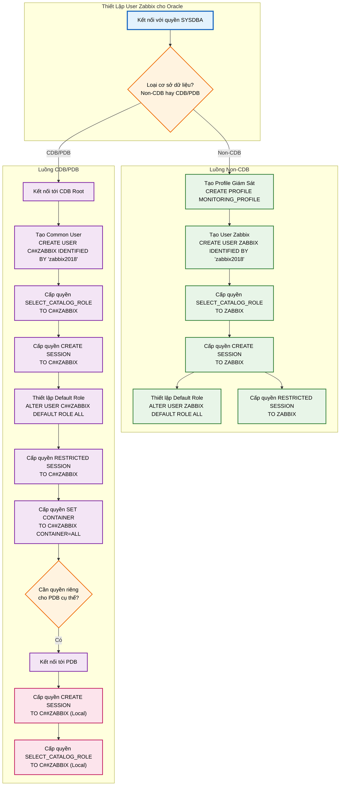
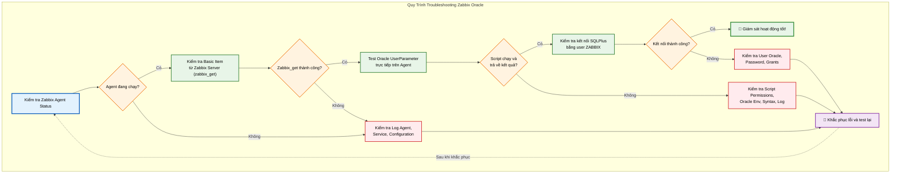
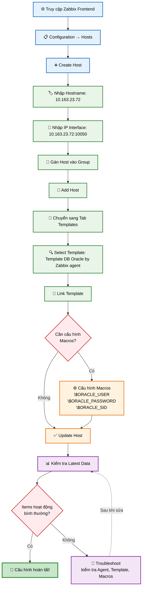

# Hướng Dẫn Hoàn Chỉnh: Cài Đặt và Cấu Hình Zabbix Agent để Giám Sát Oracle Database
## Mục lục
1.  **Tổng quan hệ thống giám sát Oracle bằng Zabbix**
2.  **Giai đoạn 1: Chuẩn bị ban đầu**
    *   Yêu cầu hệ thống và thông tin
    *   Sơ đồ Luồng Dữ liệu & Yêu cầu
3.  **Giai đoạn 2: Cài đặt Zabbix Agent (phiên bản 5.2)**
    *   Tải và cài đặt gói Zabbix Agent
    *   Khởi động và kiểm tra dịch vụ
    *   Sơ đồ Trình tự cài đặt Agent
4.  **Giai đoạn 3: Cấu hình Mạng & Firewall**
    *   Xác định địa chỉ IP
    *   Mở cổng trên Firewall
    *   Kiểm tra kết nối mạng
    *   Sơ đồ Luồng Mạng
5.  **Giai đoạn 4: Cấu hình Zabbix Agent cho Oracle Monitoring**
    *   Xem lại cấu hình Zabbix Agent chính
    *   Tạo thư mục Scripts và File cấu hình Oracle
    *   Thêm UserParameters (Oracle 19c hoặc 11g)
    *   Cung cấp các Script giám sát Oracle (RẤT QUAN TRỌNG)
    *   Cài đặt và cấu hình Oracle Client cho Zabbix Agent
    *   Khởi động lại Zabbix Agent
    *   Sơ đồ Cấu trúc File Cấu hình Agent
    *   Sơ đồ Luồng Thực thi UserParameter
6.  **Giai đoạn 5: Cấu hình Oracle Database (Tạo User Giám Sát)**
    *   Kết nối vào Oracle Database
    *   Tạo User giám sát cho Non-CDB (Oracle 11g)
    *   Tạo User giám sát cho CDB/PDB (Oracle 12c trở lên)
    *   Sơ đồ Luồng Tạo User Oracle
7.  **Giai đoạn 6: Kiểm tra và Xác thực**
    *   Kiểm tra trạng thái Zabbix Agent
    *   Kiểm tra một item cơ bản từ Zabbix Server
    *   Kiểm tra các UserParameter Oracle trực tiếp trên máy Agent
    *   Kiểm tra kết nối của user ZABBIX đến Oracle
    *   Kiểm tra nhật ký Zabbix Agent
    *   Sơ đồ Luồng Kiểm tra & Xác thực
8.  **Giai đoạn 7: Cấu hình trên Zabbix Server (Frontend)**
    *   Thêm Host mới
    *   Liên kết Template
    *   Cấu hình Macros
    *   Sơ đồ Luồng Cấu hình Zabbix Frontend
9.  **Lưu ý quan trọng**

---

## 1. Tổng quan hệ thống giám sát Oracle bằng Zabbix

Để giám sát Oracle Database bằng Zabbix, chúng ta sử dụng Zabbix Agent cài đặt trên máy chủ chứa Oracle Database. Agent này sẽ chạy các script tùy chỉnh để thu thập dữ liệu từ Oracle và gửi về Zabbix Server.



## 2. Giai đoạn 1: Chuẩn bị ban đầu

Trước khi bắt đầu, hãy đảm bảo bạn có đầy đủ thông tin và các thành phần cần thiết.

### Yêu cầu hệ thống và thông tin

*   **Zabbix Server IP:**
    *   Môi trường NTL: `10.159.25.10`
    *   Môi trường TT: `10.159.136.10`
    *(Chọn một IP phù hợp với môi trường của bạn)*
*   **Zabbix Agent Hostname/IP (máy của bạn):** `10.163.23.72` *(Đây là IP mà Agent sẽ tự nhận diện với Server)*
*   **Ports:** `10050` (Zabbix Server -> Agent) và `10051` (Agent -> Zabbix Server) cần mở 2 chiều.
*   **Hệ điều hành:** CentOS/RHEL 7 x86_64.
*   **Oracle Database:** Phiên bản (11g Non-CDB hay 12c/19c CDB/PDB) để chọn cấu hình `UserParameter` phù hợp.
*   **Oracle Instant Client hoặc Oracle Client đầy đủ:** Cần được cài đặt trên máy chủ Zabbix Agent.
*   **Các script giám sát Oracle:** Đây là các file shell script `.sh` (ví dụ: `ocommon.sh`, `ocdb.sh`, `otbs.discovery.sh`, v.v.). **Các script này không có sẵn trong gói Zabbix Agent và PHẢI được cung cấp riêng.**

### Sơ đồ Luồng Dữ liệu & Yêu cầu



## 3. Giai đoạn 2: Cài đặt Zabbix Agent (phiên bản 5.2)

Các bước này mô tả cách cài đặt Zabbix Agent trên máy chủ Linux (dựa trên RHEL 7).

### Tải và cài đặt gói Zabbix Agent

1.  **Tải gói RPM:**
    ```bash
    wget https://repo.zabbix.com/zabbix/5.2/rhel/7/x86_64/zabbix-agent-5.2.7-1.el7.x86_64.rpm
    ```
2.  **Cài đặt gói Zabbix Agent:**
    ```bash
    sudo rpm -ivh zabbix-agent-5.2.7-1.el7.x86_64.rpm
    ```

### Khởi động và kiểm tra dịch vụ

1.  **Khởi động dịch vụ Zabbix Agent:**
    ```bash
    sudo systemctl start zabbix-agent.service
    ```
2.  **Kích hoạt dịch vụ để tự động khởi động cùng hệ thống:**
    ```bash
    sudo systemctl enable zabbix-agent.service
    ```
3.  **Kiểm tra trạng thái của Zabbix Agent:**
    ```bash
    systemctl status zabbix-agent.service
    ```
    Bạn sẽ thấy trạng thái là `active (running)`, ví dụ:
    ```
    ● zabbix-agent.service - Zabbix Agent
       Loaded: loaded (/usr/lib/systemd/system/zabbix-agent.service; enabled; vendor preset: disabled)
       Active: active (running) since Sun 2025-09-07 16:58:42 +07; 3h 14min ago
      Process: 1068 ExecStart=/usr/sbin/zabbix_agentd -c $CONFFILE (code=exited, status=0/SUCCESS)
     Main PID: 1100 (zabbix_agentd)
        Tasks: 6 (limit: 48708)
       Memory: 5.2M
       CGroup: /system.slice/zabbix-agent.service
               ├─1100 /usr/sbin/zabbix_agentd -c /etc/zabbix/zabbix_agentd.conf
               ├─1103 /usr/sbin/zabbix_agentd: collector [idle 1 sec]
               ├─1104 /usr/sbin/zabbix_agentd: listener #1 [waiting for connection]
               ├─1105 /usr/sbin/zabbix_agentd: listener #2 [waiting for connection]
               ├─1106 /usr/sbin/zabbix_agentd: listener #3 [waiting for connection]
               └─1107 /usr/sbin/zabbix_agentd: active checks #1 [idle 1 sec]
    ```

### Sơ đồ Trình tự cài đặt Agent



## 4. Giai đoạn 3: Cấu hình Mạng & Firewall

Đảm bảo Zabbix Server và Agent có thể giao tiếp qua mạng và tường lửa.

### Xác định địa chỉ IP

*   **Zabbix Server IP:** `10.159.25.10` (hoặc `10.159.136.10`).
*   **Zabbix Agent IP (máy bạn):** `10.163.23.72`.

### Mở cổng trên Firewall của máy Zabbix Agent

Sử dụng `firewalld` để mở port `10050` (Agent listen) và `10051` (cho active checks).

```bash
sudo firewall-cmd --permanent --add-port=10050/tcp
sudo firewall-cmd --permanent --add-port=10051/tcp
sudo firewall-cmd --reload
sudo firewall-cmd --list-all # Kiểm tra lại
```

### Kiểm tra kết nối mạng (Tùy chọn)

*   **Từ máy Zabbix Agent đến Zabbix Server:**
    ```bash
    ping 10.159.25.10
    telnet 10.159.25.10 10051
    ```
*   **Từ Zabbix Server đến máy Zabbix Agent:** (Nhờ người quản trị Zabbix Server kiểm tra)
    ```bash
    ping 10.163.23.72
    telnet 10.163.23.72 10050
    ```

### Sơ đồ Luồng Mạng



## 5. Giai đoạn 4: Cấu hình Zabbix Agent cho Oracle Monitoring

Đây là phần trung tâm để Agent có thể thu thập dữ liệu từ Oracle.

### Xem lại cấu hình Zabbix Agent chính

Kiểm tra các thông số quan trọng trong `/etc/zabbix/zabbix_agentd.conf`:

```bash
grep -E "Server=|Hostname=|Include=|LogFile=" /etc/zabbix/zabbix_agentd.conf
```
Kết quả mong muốn:
```
Server=10.159.25.10
Hostname=10.163.23.72
LogFile=/var/log/zabbix/zabbix_agentd.log
Include=/etc/zabbix/zabbix_agentd.d/*.conf
```
`Include=/etc/zabbix/zabbix_agentd.d/*.conf` cho biết Agent sẽ tải các file `.conf` trong thư mục `/etc/zabbix/zabbix_agentd.d/`.

### Tạo thư mục Scripts và File cấu hình Oracle

1.  **Tạo thư mục cho các script giám sát Oracle:**
    ```bash
    sudo mkdir -p /etc/zabbix/agentscripts
    ```
2.  **Tạo file cấu hình Oracle mới:**
    ```bash
    sudo vi /etc/zabbix/zabbix_agentd.d/oracle_monitor.conf
    ```

### Thêm UserParameters (Oracle 19c hoặc 11g)

Dán toàn bộ khối cấu hình `UserParameter` thích hợp từ file `zabbix.txt` vào `oracle_monitor.conf`.

*   **Nếu giám sát Oracle 19c (hoặc CDB/PDB):** Dán khối `zabbix_19c`.
*   **Nếu giám sát Oracle 11g (hoặc Non-CDB):** Dán khối `zabbix_11g`.

**Ví dụ (nếu chọn 19c):**
```ini
# --- Cấu hình giám sát Oracle 19c/CDB/PDB ---
####CDB
UserParameter=oracle.cdb.discovery[*],/etc/zabbix/agentscripts/ocdb.discovery.sh $1
UserParameter=oracle.cdb[*],/etc/zabbix/agentscripts/ocdb.sh $1 $2
UserParameter=oracle.recoveryfiledest.discovery[*],/etc/zabbix/agentscripts/orecoveryfiledest.discovery.sh
UserParameter=oracle.recoveryfiledest[*],/etc/zabbix/agentscripts/orecoveryfiledest.sh $1 $2
UserParameter=oracle.diskgroup.discovery[*],/etc/zabbix/agentscripts/odiskgroup.discovery.sh
UserParameter=oracle.diskgroup[*],/etc/zabbix/agentscripts/odiskgroup.sh $1 $2
UserParameter=oracle.instance.discovery[*],/etc/zabbix/agentscripts/oinstance.discovery.sh
UserParameter=oracle.instance[*],/etc/zabbix/agentscripts/oinstance.sh $1 $2
UserParameter=oracle.rmanbackup.discovery[*],/etc/zabbix/agentscripts/ormanbackup.discovery.sh
UserParameter=oracle.rmanbackup[*],/etc/zabbix/agentscripts/ormanbackup.sh $1 $2
###PDB
UserParameter=oracle.pdb.common[*],/etc/zabbix/agentscripts/opdb.common.sh $1 $2 $3
UserParameter=oracle.pdb.tbs.discovery[*],/etc/zabbix/agentscripts/opdb.tbs.discovery.sh $1
UserParameter=oracle.pdb.tbs[*],/etc/zabbix/agentscripts/opdb.tbs.sh $1 $2 $3
UserParameter=oracle.pdb.invalidindex.discovery[*],/etc/zabbix/agentscripts/opdb.invalidindex.discovery.sh $1
UserParameter=oracle.pdb.invalidindex[*],/etc/zabbix/agentscripts/opdb.invalidindex.sh $1 $2 $3

UserParameter=oracle.check_audit[*],ls $1 -1 | wc -l
UserParameter=system.load_avg,cat /proc/loadavg |awk {'print $1'}|cut -d "." -f1

###RAM
UserParameter=freem.mem_total, free -b | grep Mem | sed '''s/\s\+/,/g''' | cut -d , -f2
UserParameter=freem.mem_used, free -b | grep Mem | sed '''s/\s\+/,/g''' | cut -d , -f3
UserParameter=freem.mem_buffers, free -b | grep Mem | sed '''s/\s\+/,/g''' | cut -d , -f6
UserParameter=freem.mem_cached, free -b | grep Mem | sed '''s/\s\+/,/g''' | cut -d , -f7

UserParameter=check.ntp,/opt/utilities/check_ntp.sh

UnsafeUserParameters=1
```
Lưu file (`:wq` trong `vi`).
Cấp quyền sở hữu và truy cập cho file cấu hình mới:
```bash
sudo chown zabbix:zabbix /etc/zabbix/zabbix_agentd.d/oracle_monitor.conf
sudo chmod 644 /etc/zabbix/zabbix_agentd.d/oracle_monitor.conf
```

### Cung cấp các Script giám sát Oracle (RẤT QUAN TRỌNG)

**Đây là các file shell script mà các `UserParameter` gọi tới. Chúng PHẢI được đặt trong thư mục `/etc/zabbix/agentscripts/`.** Bạn cần nhận các file này từ người quản trị hoặc phát triển hệ thống giám sát.

1.  **Đặt các script vào thư mục:**
    *Ví dụ: `ocommon.sh`, `ocdb.discovery.sh`, `otbs.sh`, v.v. vào `/etc/zabbix/agentscripts/`.*
2.  **Cấp quyền thực thi cho các script:**
    ```bash
    sudo chmod +x /etc/zabbix/agentscripts/*.sh
    ```

### Cài đặt và cấu hình Oracle Client cho Zabbix Agent

Zabbix Agent chạy dưới user `zabbix`. User này cần có khả năng gọi `sqlplus`.

1.  **Cài đặt Oracle Instant Client (hoặc Oracle Client đầy đủ):**
    Hãy đảm bảo Oracle Instant Client đã được cài đặt trên máy chủ Zabbix Agent.
2.  **Cấu hình biến môi trường Oracle:**
    Các biến như `ORACLE_HOME`, `LD_LIBRARY_PATH`, `PATH` phải được thiết lập đúng cho user `zabbix`. Điều này thường được thực hiện **bên trong chính các script giám sát Oracle** (ví dụ: `export ORACLE_HOME=/path/to/instantclient_21_9` ở đầu mỗi script) hoặc thông qua một file môi trường được `source` bởi các script.
    *Ví dụ trong script:*
    ```bash
    #!/bin/bash
    export ORACLE_HOME=/usr/lib/oracle/21/client64
    export LD_LIBRARY_PATH=$ORACLE_HOME/lib
    export PATH=$PATH:$ORACLE_HOME/bin
    # ... phần còn lại của script để gọi sqlplus ...
    ```
3.  **Cấu hình TNSNames.ora (nếu sử dụng TNS alias):**
    Nếu các script sử dụng TNS alias để kết nối (ví dụ: `sqlplus ZABBIX/pass@ORCL`), bạn cần có file `tnsnames.ora` (thường ở `$ORACLE_HOME/network/admin` hoặc `~/.tnsnames.ora`) được cấu hình đúng.

### Khởi động lại Zabbix Agent

Để Agent tải cấu hình và các `UserParameter` mới:
```bash
sudo systemctl restart zabbix-agent.service
sudo systemctl status zabbix-agent.service
```

### Sơ đồ Cấu trúc File Cấu hình Agent



### Sơ đồ Luồng Thực thi UserParameter



## 6. Giai đoạn 5: Cấu hình Oracle Database (Tạo User Giám Sát)

Tạo một user chuyên dụng trong Oracle Database với các quyền cần thiết để Zabbix Agent có thể truy vấn dữ liệu.

### Kết nối vào Oracle Database

Sử dụng `sqlplus` với quyền `SYSDBA`:
```bash
sqlplus / as sysdba
```

### Tạo User giám sát cho Non-CDB (Oracle 11g)

```sql
CREATE PROFILE MONITORING_PROFILE LIMIT
  SESSIONS_PER_USER DEFAULT
  CPU_PER_SESSION DEFAULT
  CPU_PER_CALL DEFAULT
  CONNECT_TIME DEFAULT
  IDLE_TIME DEFAULT
  LOGICAL_READS_PER_SESSION DEFAULT
  LOGICAL_READS_PER_CALL DEFAULT
  COMPOSITE_LIMIT DEFAULT
  PRIVATE_SGA DEFAULT
  FAILED_LOGIN_ATTEMPTS UNLIMITED
  PASSWORD_LIFE_TIME UNLIMITED
  PASSWORD_REUSE_TIME DEFAULT
  PASSWORD_REUSE_MAX DEFAULT
  PASSWORD_LOCK_TIME DEFAULT
  PASSWORD_GRACE_TIME DEFAULT
  PASSWORD_VERIFY_FUNCTION DEFAULT;

CREATE USER ZABBIX
  IDENTIFIED BY "zabbix2018"
  PROFILE MONITORING_PROFILE
  ACCOUNT UNLOCK;

-- Cấp Role và System Privileges
GRANT SELECT_CATALOG_ROLE TO ZABBIX;
ALTER USER ZABBIX DEFAULT ROLE ALL;

GRANT CREATE SESSION TO ZABBIX;
GRANT RESTRICTED SESSION TO ZABBIX;
```

### Tạo User giám sát cho CDB/PDB (Oracle 12c trở lên)

1.  **Tạo Common User trong CDB Root (C##ZABBIX):**
    Kết nối vào CDB Root:
    ```sql
    CREATE USER C##ZABBIX IDENTIFIED BY "zabbix2018" ACCOUNT UNLOCK;
    GRANT SELECT_CATALOG_ROLE TO C##ZABBIX;
    ALTER USER C##ZABBIX DEFAULT ROLE ALL;
    GRANT CREATE SESSION TO C##ZABBIX;
    GRANT RESTRICTED SESSION TO C##ZABBIX;
    GRANT SET CONTAINER TO C##ZABBIX CONTAINER=ALL; -- Quan trọng để truy cập các PDB
    ```
2.  **Cấp quyền trong từng PDB (thường không cần thiết):**
    Nếu đã cấp `GRANT SET CONTAINER TO C##ZABBIX CONTAINER=ALL;` ở CDB Root, user `C##ZABBIX` sẽ có quyền truy cập các PDB. Chỉ khi có yêu cầu đặc biệt về user cục bộ trong PDB, bạn mới cần thực hiện các lệnh sau (sau khi `ALTER SESSION SET CONTAINER = <PDB_NAME>;` hoặc kết nối trực tiếp vào PDB):
    ```sql
    GRANT CREATE SESSION TO C##ZABBIX;
    GRANT SELECT_CATALOG_ROLE TO C##ZABBIX;
    ALTER USER C##ZABBIX DEFAULT ROLE ALL;
    ```

### Sơ đồ Luồng Tạo User Oracle



## 7. Giai đoạn 6: Kiểm tra và Xác thực

Sau khi hoàn tất cấu hình, hãy kiểm tra kỹ lưỡng.

### Kiểm tra trạng thái Zabbix Agent
Đảm bảo Agent vẫn đang chạy sau khi cấu hình lại:
```bash
systemctl status zabbix-agent.service
```

### Kiểm tra một item cơ bản từ Zabbix Server (nếu có quyền truy cập)
Sử dụng `zabbix_get` trên Zabbix Server để kiểm tra kết nối với Agent và một item hệ thống đơn giản:
```bash
zabbix_get -s 10.163.23.72 -p 10050 -k "system.cpu.load[all,avg1]"
```
Nếu trả về giá trị (ví dụ: `0.54`), Agent đang giao tiếp tốt.

### Kiểm tra các UserParameter Oracle trực tiếp trên máy Agent
Đây là bước quan trọng nhất để xác minh các script hoạt động. Chạy lệnh dưới quyền user `zabbix` và với môi trường Oracle Client đã cấu hình.

*   **Để kiểm tra PING Oracle (thay `<ORACLE_SID_HOẶC_PDB_SERVICE_NAME>` và `/path/to/instantclient_21_9` bằng giá trị thực):**
    ```bash
    sudo -u zabbix bash -c "export ORACLE_HOME=/path/to/instantclient_21_9; export LD_LIBRARY_PATH=$ORACLE_HOME/lib; export PATH=$PATH:$ORACLE_HOME/bin; /etc/zabbix/agentscripts/ocommon.sh <ORACLE_SID_HOẶC_PDB_SERVICE_NAME> PING"
    ```
*   **Để kiểm tra một Discovery script (ví dụ cho Instance Discovery trên 19c):**
    ```bash
    sudo -u zabbix bash -c "export ORACLE_HOME=/path/to/instantclient_21_9; export LD_LIBRARY_PATH=$ORACLE_HOME/lib; export PATH=$PATH:$ORACLE_HOME/bin; /etc/zabbix/agentscripts/oinstance.discovery.sh"
    ```
    Các lệnh này phải trả về kết quả mong muốn (ví dụ: `1` cho PING thành công, JSON cho discovery).

### Kiểm tra kết nối của user ZABBIX đến Oracle
Đảm bảo user `ZABBIX` có thể đăng nhập vào Oracle Database:
```bash
sqlplus ZABBIX/"zabbix2018"@<TNS_ALIAS_HOẶC_KẾT_NỐI_TRỰC_TIẾP>
# Ví dụ: sqlplus ZABBIX/"zabbix2018"@ORCL
```
Nếu đăng nhập thành công, user và mật khẩu đã đúng.

### Kiểm tra nhật ký Zabbix Agent
Kiểm tra file log của Agent để tìm lỗi từ các `UserParameter` hoặc script:
```bash
sudo tail -f /var/log/zabbix/zabbix_agentd.log
```

### Sơ đồ Luồng Kiểm tra & Xác thực



## 8. Giai đoạn 7: Cấu hình trên Zabbix Server (Frontend)

Đây là các bước cuối cùng, thực hiện trên giao diện web của Zabbix Server.

1.  **Thêm Host mới:**
    *   Vào `Configuration` -> `Hosts`.
    *   Nhấp `Create host`.
    *   **Host name:** `10.163.23.72` (hoặc tên host mà Agent của bạn nhận diện). **Phải khớp chính xác với `Hostname=` trong cấu hình Agent.**
    *   **Visible name:** Đặt tên hiển thị dễ nhớ.
    *   **Groups:** Gán Host vào nhóm phù hợp (ví dụ: "Oracle Servers").
    *   **Agent interfaces:**
        *   Chọn `Agent`.
        *   **IP address:** `10.163.23.72`.
        *   **Port:** `10050`.
    *   Nhấp `Add`.

2.  **Liên kết Template:**
    *   Trên Host vừa tạo, chuyển đến tab `Templates`.
    *   Nhấp `Select` và tìm kiếm template phù hợp:
        *   `Template DB Oracle by Zabbix agent` (hoặc template tùy chỉnh nếu có).
    *   Nhấp `Add` để liên kết template, sau đó `Update` Host.

3.  **Cấu hình Macros (nếu cần):**
    Một số template có thể yêu cầu các macro (ví dụ: `{$ORACLE_SID}`, `{$ORACLE_USER}`, `{$ORACLE_PASSWORD}`). Bạn sẽ cần định nghĩa các macro này ở cấp Host hoặc Template với các giá trị phù hợp (ví dụ: `{$ORACLE_USER}` = `ZABBIX`, `{$ORACLE_PASSWORD}` = `zabbix2018`).
    *   Trên Host vừa tạo, chuyển đến tab `Macros`.
    *   Nhấp `Add` và định nghĩa các macro cần thiết.

### Sơ đồ Luồng Cấu hình Zabbix Frontend



## 9. Lưu ý quan trọng

*   **Các script Oracle (.sh):** Là thành phần thiết yếu. Không có chúng, Agent không thể thu thập dữ liệu Oracle.
*   **Môi trường Oracle Client:** Việc cấu hình đúng các biến môi trường (`ORACLE_HOME`, `LD_LIBRARY_PATH`, `PATH`) cho user `zabbix` là cực kỳ quan trọng.
*   **Hostname chính xác:** Đảm bảo `Hostname=` trong cấu hình Agent khớp với "Host name" trên Zabbix Server.
*   **Timeout:** Giá trị `Timeout=30` trong cấu hình Agent có thể cần được tăng nếu các truy vấn Oracle mất nhiều thời gian để thực thi.
*   **Bảo mật:** Luôn bảo mật mật khẩu user Oracle `ZABBIX`.
*   **Logging:** Luôn kiểm tra `/var/log/zabbix/zabbix_agentd.log` để gỡ lỗi.
