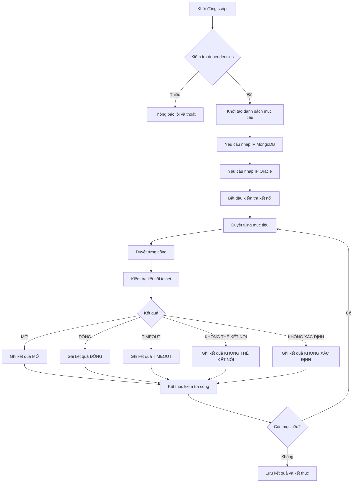

# Script kiểm tra kết nối mạng (Network Connectivity Checker)

## Mô tả (Description)
Script này được sử dụng để kiểm tra kết nối mạng đến các cổng của các dịch vụ quan trọng trong hệ thống như SIEM, Zabbix, KAS, NetBackup, MongoDB và Oracle DB.


## Cách sử dụng (Usage)
```bash
./check_connectivity.sh
```

## Giải thích từng phần code (Code Explanation)

### Khởi tạo và cấu hình (Initialization and Configuration)
- `#!/usr/bin/env bash`: Shebang để chạy script bằng bash
- `set -euo pipefail`: Thiết lập strict mode cho bash để phát hiện lỗi sớm
- `export LANG=en_US.UTF-8`: Đặt ngôn ngữ để đảm bảo định dạng đầu ra nhất quán
- `TIMEOUT_SEC="${TIMEOUT_SEC:-3}"`: Thiết lập timeout cho kết nối (mặc định 3 giây)
- `OUTFILE="portcheck_$(date +%Y%m%d_%H%M%S).csv"`: Tên file CSV để lưu kết quả với timestamp

### Hàm hỗ trợ (Support Functions)
- `need()`: Kiểm tra sự tồn tại của các lệnh cần thiết (telnet, timeout)
- `to_vi()`: Chuyển đổi trạng thái kết nối từ tiếng Anh sang tiếng Việt
- `telnet_check()`: Hàm chính để kiểm tra kết nối đến một host:port cụ thể
- `log_row()`: Ghi kết quả vào file CSV
- `print_hdr()` và `print_line()`: Định dạng và in kết quả ra console

### Danh sách mục tiêu (Target List)
- `TARGETS`: Mảng chứa danh sách các host:port cần kiểm tra với định dạng "host|protocol|ports|note"
- Các vòng lặp `for` để thêm các IP NetBackup theo dải

### Nhập thông tin từ người dùng (User Input)
- Yêu cầu người dùng nhập IP cho MongoDB và Oracle DB
- Xử lý chuỗi nhập để tạo danh sách host

### Thực thi kiểm tra (Execution)
- Duyệt qua từng mục tiêu và cổng để kiểm tra kết nối
- In kết quả ra console và lưu vào file CSV

## Sơ đồ luồng thực thi (Execution Flow Diagram)



## Bảng danh sách IP và cổng (IP and Port List Table)

| Dịch vụ | IP | Cổng | Mô tả |
|---------|----|------|-------|
| SIEM | 10.169.20.229 | 514, 8413 | Hệ thống quản lý thông tin bảo mật |
| SIEM | 10.169.20.230 | 514, 8413 | Hệ thống quản lý thông tin bảo mật |
| Zabbix | 10.159.25.10 | 10050, 10051 | Hệ thống giám sát |
| Zabbix | 10.159.136.10 | 10050, 10051 | Hệ thống giám sát |
| KAS | 10.169.20.226 | 13000, 14000 | Hệ thống kiểm soát truy cập |
| NetBackup | 10.165.73.21-25 | 111, 2049, 20048 | Hệ thống backup dữ liệu |
| NetBackup | 10.168.12.11-13 | 111, 2049, 20048 | Hệ thống backup dữ liệu |

---

## Bản hoàn chỉnh

```
#!/usr/bin/env bash
set -euo pipefail

export LANG=en_US.UTF-8
export LC_MESSAGES=C

TIMEOUT_SEC="${TIMEOUT_SEC:-3}"
OUTFILE="portcheck_$(date +%Y%m%d_%H%M%S).csv"

# --- Hàm hỗ trợ ---
need() { command -v "$1" >/dev/null 2>&1 || { echo "Lỗi: Thiếu lệnh '$1'. Cài đặt: sudo dnf install -y $2"; exit 1; }; }
need telnet telnet
need timeout coreutils

to_vi() {
  case "$1" in
    OPEN) echo "MỞ" ;;
    CLOSED) echo "ĐÓNG (Connection refused)" ;;
    "TIMEOUT/FILTERED") echo "TIMEOUT / BỊ LỌC" ;;
    UNREACHABLE) echo "KHÔNG THỂ KẾT NỐI (Lỗi DNS/mạng)" ;;
    *) echo "KHÔNG XÁC ĐỊNH" ;;
  esac
}

telnet_check() {
  local host="$1" port="$2" to="$3"
  local out rc
  set +e
  out=$( (sleep 0.2; echo quit) | timeout "${to}s" telnet "$host" "$port" 2>&1 )
  rc=$?
  set -e

  if [[ $rc -eq 124 ]]; then
    echo "TIMEOUT/FILTERED"
  elif grep -qiE "Connected to|Escape character" <<<"$out"; then
    echo "OPEN"
  elif grep -qi "Connection refused" <<<"$out"; then
    echo "CLOSED"
  elif grep -qiE "No route to host|Network is unreachable|Name or service not known|Unknown host|Temporary failure in name resolution|bad address|hostname nor servname provided" <<<"$out"; then
    echo "UNREACHABLE"
  else
    echo "UNKNOWN"
  fi
}

log_row()   { echo "\"$1\",\"$2\",\"$3\",\"$4\",\"$5\",\"$6\"" >> "$OUTFILE"; }
print_hdr() { printf "%-8s %-15s %-5s %-28s %s\n" "GIAO THỨC" "MÁY CHỦ ĐÍCH" "CỔNG" "TRẠNG THÁI" "GHI CHÚ"; printf "%0.s-" {1..80}; echo; }
print_line(){ printf "%-8s %-15s %-5s %-28s %s\n" "$1" "$2" "$3" "$4" "$5"; }

# --- Danh sách mục tiêu cố định ---
declare -a TARGETS=(
  "10.169.20.229|TCP|514,8413|SIEM"
  "10.169.20.230|TCP|514,8413|SIEM"
  "10.159.25.10|TCP|10050,10051|Zabbix"
  "10.159.136.10|TCP|10050,10051|Zabbix"
  "10.169.20.226|TCP|13000,14000|KAS"
)
for i in $(seq 21 25); do TARGETS+=("10.165.73.$i|TCP|111,2049,20048|NetBackup"); done
for i in $(seq 11 13); do TARGETS+=("10.168.12.$i|TCP|111,2049,20048|NetBackup"); done

# --- Yêu cầu người dùng nhập IP cho các dịch vụ cụ thể ---
echo "------------------------------------------------------------------"
echo "Vui lòng nhập danh sách IP/hostname cho các dịch vụ bên dưới."
echo "Các IP/hostname có thể ngăn cách bởi dấu phẩy (,) hoặc khoảng trắng."
echo "------------------------------------------------------------------"

# Nhập IP cho MongoDB
read -p "Nhập danh sách IP máy chủ MongoDB: " mongo_ips_input
if [[ -z "$mongo_ips_input" ]]; then
  echo "Lỗi: Bạn phải nhập ít nhất một IP cho MongoDB." >&2
  exit 1
fi
# Chuyển chuỗi thành mảng, loại bỏ dấu phẩy và khoảng trắng thừa
read -ra MONGO_HOSTS <<< "${mongo_ips_input//,/ }"
for host in "${MONGO_HOSTS[@]}"; do
  # Bỏ qua các phần tử rỗng nếu người dùng nhập ", ,"
  if [[ -n "$host" ]]; then
    TARGETS+=("$host|TCP|27010,27011,27012,27013|Mongo Sharded Cluster")
  fi
done

# Nhập IP cho Oracle DB
read -p "Nhập danh sách IP máy chủ Oracle DB: " oracle_ips_input
if [[ -z "$oracle_ips_input" ]]; then
  echo "Lỗi: Bạn phải nhập ít nhất một IP cho Oracle DB." >&2
  exit 1
fi
read -ra ORACLE_HOSTS <<< "${oracle_ips_input//,/ }"
for host in "${ORACLE_HOSTS[@]}"; do
  if [[ -n "$host" ]]; then
    TARGETS+=("$host|TCP|1521|Oracle DB")
  fi
done
echo "------------------------------------------------------------------"


# --- Thực thi kiểm tra ---
echo "Bắt đầu kiểm tra kết nối TCP..."
echo "Timestamp (CSV),Protocol,Host,Port,Status (English),Note" > "$OUTFILE"
print_hdr
for item in "${TARGETS[@]}"; do
  IFS="|" read -r HOST PROTO PORTS NOTE <<< "$item"
  IFS=',' read -ra PORT_ARR <<< "$PORTS"
  for PORT in "${PORT_ARR[@]}"; do
    TS="$(date +'%F %T')"
    STATUS_EN="$(telnet_check "$HOST" "$PORT" "$TIMEOUT_SEC")"
    STATUS_VI="$(to_vi "$STATUS_EN")"
    print_line "$PROTO" "$HOST" "$PORT" "$STATUS_VI" "$NOTE"
    log_row "$TS" "$PROTO" "$HOST" "$PORT" "$STATUS_EN" "$NOTE"
  done
done

echo
echo "Kiểm tra hoàn tất."
echo "Kết quả đã được lưu vào file: $OUTFILE"

```