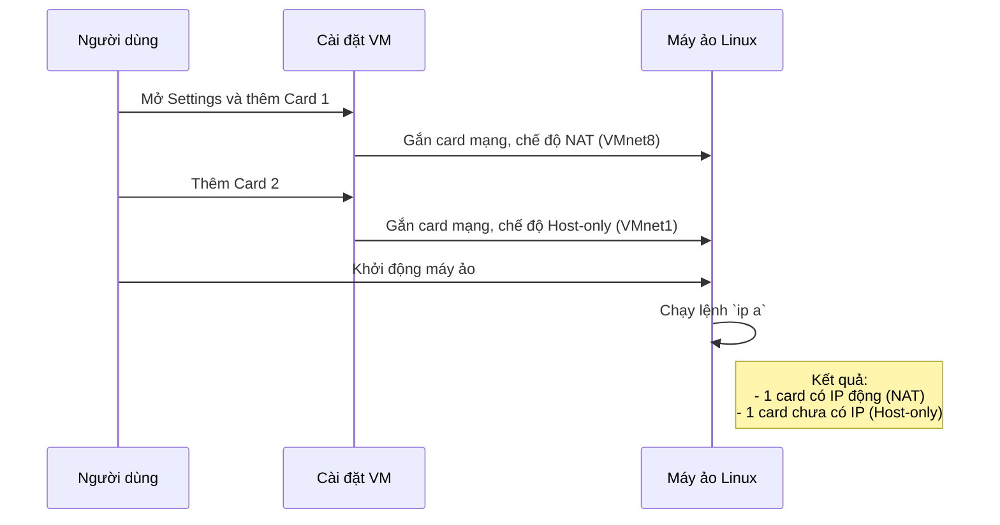
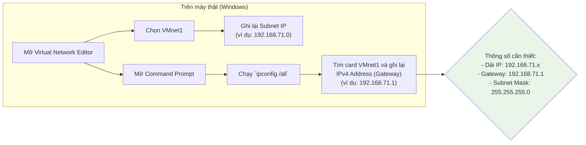
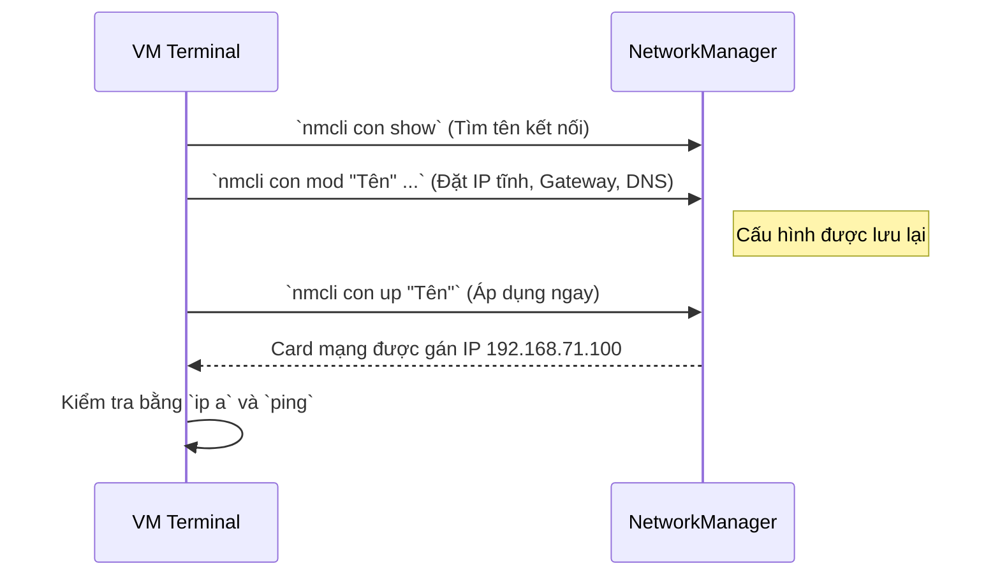

### **Mục tiêu: Xây dựng môi trường Lab hoàn hảo với VMware**

Hướng dẫn này sẽ giúp bạn tạo một máy ảo (VM) Linux trên VMware Workstation, được trang bị hai card mạng với chức năng rõ ràng, tạo ra một môi trường lab linh hoạt và an toàn.

```mermaid
graph TD
    subgraph Máy Thật (Host PC)
        A[VMware Workstation]
        F[Công cụ SSH <br/>(PuTTY, Terminal)]
    end

    subgraph Máy Ảo (Linux VM)
        B[Hệ điều hành Linux]
        subgraph "Card Mạng Ảo"
            C[Card 1: NAT]
            D[Card 2: Host-only]
        end
    end
    
    subgraph "Mạng Internet"
      E[Internet]
    end

    C -- "Truy cập Internet để cập nhật, tải gói" --> E
    D -- "Kết nối nội bộ, an toàn" --> F
    F -- "Gửi lệnh SSH tới IP tĩnh" --> D
    A -- "Chứa và quản lý" --> B

    style B fill:#e1f5fe
    style C fill:#f3e5f5,stroke:#9c27b0
    style D fill:#e8f5e8,stroke:#4caf50
```

**Kịch bản sử dụng:**

1.  **Card NAT (Network Address Translation):**
    *   **Chức năng:** Giống như bạn đang dùng chung Wi-Fi của máy thật. Máy ảo có thể truy cập Internet để tải phần mềm (`apt update`, `yum install`) hoặc duyệt web.
    *   **An ninh:** Máy ảo được "ẩn" sau địa chỉ IP của máy thật, không bị lộ trực tiếp ra mạng bên ngoài. Đây là lựa chọn mặc định an toàn để VM có kết nối ra ngoài.

    ```mermaid
    graph LR
        VM[Linux VM] -- "Yêu cầu Internet" --> Host[Máy Thật]
        Host -- "Gửi yêu cầu dưới tên của mình" --> Router[Router Mạng]
        Router -- "Kết nối" --> Internet
        style VM fill:#e1f5fe
    ```

2.  **Card Host-only:**
    *   **Chức năng:** Tạo ra một mạng riêng, hoàn toàn biệt lập, chỉ tồn tại giữa máy thật và các máy ảo của bạn.
    *   **An ninh:** Lý tưởng cho việc thực hành, thử nghiệm các dịch vụ (web server, database) hoặc quản trị từ xa qua SSH mà không lo bị tấn công từ mạng ngoài. Đây là "sân chơi" an toàn của bạn.

    ```mermaid
    graph LR
        VM[Linux VM] <--> Host[Máy Thật]
        subgraph Mạng Riêng Tư (VMnet1)
            VM
            Host
        end
        Internet -- "Bị chặn" --x Host
        style VM fill:#e1f5fe
    ```

**Lưu ý quan trọng trước khi bắt đầu:**
*   **Hệ điều hành:** Hướng dẫn dành cho máy chủ Windows; trên macOS/Linux, dùng lệnh `ifconfig` hoặc `ip a` thay vì `ipconfig` để kiểm tra thông tin mạng của máy thật.
*   **An toàn là trên hết:** Luôn **Tắt hẳn (Power Off)** máy ảo trước khi thay đổi cấu hình phần cứng như card mạng. Việc tạm dừng (Suspend) có thể không áp dụng thay đổi đúng cách. **Tạo Snapshot (bản sao lưu)** trước khi thực hiện các thay đổi lớn là một thói quen tốt để có thể quay lại nếu có lỗi.
*   **Vấn đề sau cập nhật:** Các phiên bản VMware mới (đặc biệt từ 17.x) đôi khi gây lỗi mạng. Cách khắc phục nhanh nhất là vào **Virtual Network Editor** và chọn **Restore Defaults**. Nếu VM chậm hoặc mất kết nối sau khi suspend/resume, hãy khởi động lại dịch vụ VMware NAT trên máy thật.
*   **Xung đột VPN:** Nếu bạn đang dùng VPN trên máy thật, hãy tạm thời tắt nó đi. VPN thay đổi bảng định tuyến (routing table) của máy thật và có thể chặn kết nối đến máy ảo.

Dưới đây là quy trình tổng quan, được sắp xếp theo thứ tự logic để bạn dễ dàng theo dõi và thực hiện.

```mermaid
flowchart TD
    A[Bắt đầu: Tắt hẳn máy ảo] --> B{Bước 1: Thiết lập phần cứng<br/>Thêm 2 card mạng (NAT & Host-only) vào VM}
    B --> C{Bước 2: Khảo sát mạng Host-only<br/>Tìm dải IP và Gateway trên máy thật}
    C --> D{Bước 3: Cấu hình phần mềm trong VM<br/>Đặt IP tĩnh cho card Host-only}
    D --> E{Bước 4: Kiểm tra và kết nối<br/>Dùng Ping và SSH để xác nhận}
    E --> F[Kết thúc: Môi trường lab sẵn sàng!]
    style A fill:#ffcdd2
    style F fill:#c8e6c9
```

---

### **Bước 1: Thêm và cấu hình hai card mạng trong VMware**

**Mục tiêu:** Trang bị cho máy ảo hai "cổng giao tiếp": một để nói chuyện với Internet, một để nói chuyện riêng với máy thật.

1.  **Tắt hoàn toàn máy ảo** (chọn Power Off, không Suspend). Nếu máy ảo bị treo, bạn có thể phải dùng Task Manager trên Windows để "End task" tiến trình của nó.
2.  Mở cửa sổ **Settings** của máy ảo (Chuột phải vào VM > Settings...).
3.  Trong tab **Hardware**, tìm mục **Network Adapter**.
    *   Nếu chưa có card nào, nhấn nút **Add...**, chọn **Network Adapter**, và lặp lại để có hai card.
    *   **Cấu hình Card 1 (NAT):**
        *   Chọn **NAT: Used to share the host's IP address**.
        *   Đảm bảo hai ô **Connected** và **Connect at power on** được tích. Đây sẽ là card mạng mặc định để VM truy cập Internet.
    *   **Cấu hình Card 2 (Host-only):**
        *   Chọn **Host-only: A private network shared with the host**.
        *   Tương tự, đảm bảo hai ô **Connected** và **Connect at power on** được tích. Đây là card mạng để bạn SSH vào.
4.  Lưu lại cấu hình và khởi động máy ảo.
5.  Mở Terminal trong máy ảo và gõ lệnh `ip a` (hoặc `ip address`). Bạn sẽ thấy hai giao diện mạng (ví dụ `ens160`, `ens224`). Một cái sẽ có địa chỉ IP được cấp tự động (của NAT), cái còn lại (Host-only) thường sẽ chưa có địa chỉ IPv4.

**Sơ đồ minh họa quy trình cấu hình:**



**Khắc phục sự cố phổ biến:**
*   **Không thấy card mạng trong VM:** Đảm bảo ảo hóa đã được bật trong BIOS/UEFI của máy thật (tìm các tùy chọn như **Intel VT-x** hoặc **AMD-V**).
*   **Mất kết nối sau khi cập nhật VMware:** Vào **services.msc** trên Windows, tìm và khởi động lại các dịch vụ: `VMware DHCP Service` và `VMware NAT Service`. Nếu không hiệu quả, hãy dùng tính năng **Restore Defaults** trong Virtual Network Editor.
*   **Để hiệu suất mạng tốt hơn:** Trong `Settings > Network Adapter > Advanced...`, nếu có tùy chọn, hãy chọn loại adapter là `vmxnet3` thay vì `e1000e`. `vmxnet3` là driver được tối ưu hóa cho môi trường ảo hóa của VMware.

---

### **Bước 2: Xác định thông số mạng Host-only trên máy thật**

**Mục tiêu:** Tìm hiểu "địa chỉ" của mạng riêng (Host-only) mà VMware đã tạo ra. Chúng ta cần biết dải IP và địa chỉ cổng (Gateway) để cấu hình cho máy ảo.

1.  Mở **Virtual Network Editor** từ menu của VMware Workstation (Edit > Virtual Network Editor...). **Lưu ý:** Bạn có thể cần nhấn nút "Change Settings" để có quyền quản trị.
2.  Chọn dòng có tên **VMnet1** (Type: Host-only).
3.  Nhìn xuống dưới và ghi lại các thông tin sau:
    *   **Subnet IP:** Ví dụ: `192.168.71.0`. Đây là tên của "khu phố" mạng riêng. Mọi thiết bị trong mạng này sẽ có IP bắt đầu bằng `192.168.71`.
    *   **Subnet Mask:** Thường là `255.255.255.0`.
4.  Bây giờ, chúng ta cần tìm địa chỉ Gateway. Gateway trong mạng Host-only chính là địa chỉ IP của card mạng ảo `VMnet1` trên máy thật.
    *   Mở **Command Prompt (cmd)** trên Windows với quyền quản trị.
    *   Gõ lệnh `ipconfig /all`.
    *   Tìm đến phần có tên là **VMware Virtual Ethernet Adapter VMnet1**.
    *   Ghi lại địa chỉ **IPv4 Address**. Ví dụ: `192.168.71.1`. Đây chính là Gateway của bạn.
5.  **Kiểm tra:** Trong cmd, gõ `ping 192.168.71.1`. Nếu nhận được phản hồi, nghĩa là máy thật đã sẵn sàng giao tiếp trên mạng này.

**Sơ đồ minh họa quy trình:**



**Khắc phục sự cố phổ biến:**
*   **Không thấy VMnet1 trong `ipconfig`:** Trong Virtual Network Editor, đảm bảo ô **Connect a host virtual adapter to this network** đã được tích cho VMnet1. Nếu vẫn không thấy, thử "Restore Defaults".
*   **Xung đột dải IP:** Nếu dải IP `192.168.71.0` trùng với mạng Wi-Fi hoặc mạng LAN của bạn, hãy đổi nó thành một dải khác trong Virtual Network Editor (ví dụ: `192.168.100.0`) để tránh xung đột.

---

### **Bước 3: Đặt IP tĩnh cho card Host-only trong máy ảo**

**Mục tiêu:** Gán cho máy ảo một địa chỉ IP cố định trên mạng riêng. Giống như đặt số nhà cho ngôi nhà của bạn, để máy thật luôn biết chính xác nơi để tìm máy ảo.

Tại sao phải dùng IP tĩnh? Card NAT có thể dùng IP động (DHCP) vì nó chỉ cần kết nối ra ngoài. Nhưng để SSH từ máy thật vào máy ảo, bạn cần một địa chỉ IP không bao giờ thay đổi.

1.  Trong Terminal của máy ảo, chạy `ip a` để tìm ra tên của card mạng Host-only (thường là card thứ hai, ví dụ `ens224`, và là card chưa có địa chỉ IP).
2.  **Phương pháp được khuyến nghị: Dùng `nmcli` (NetworkManager command-line)**. Đây là công cụ quản lý mạng hiện đại và mạnh mẽ trên hầu hết các bản phân phối Linux mới.
    *   Xem tên các kết nối hiện có: `nmcli con show`. Bạn sẽ thấy một danh sách, ví dụ "Wired connection 1", "Wired connection 2". Hãy xác định tên kết nối tương ứng với card Host-only của bạn.
    *   Cấu hình IP tĩnh (thay `"Wired connection 2"` bằng tên kết nối của bạn, và `ens224` bằng tên card mạng của bạn).
        *   Chọn một IP trong dải `192.168.71.x` (ví dụ: `192.168.71.100`). Tránh `.0`, `.1`, `.255`.
        ```bash
        # Tên kết nối, tên card mạng, và các giá trị IP chỉ là ví dụ
        CONN_NAME="Wired connection 2"
        IFACE_NAME="ens224"
        STATIC_IP="192.168.71.100/24" # /24 tương đương Subnet Mask 255.255.255.0
        GATEWAY_IP="192.168.71.1"
        DNS_IP="8.8.8.8" # Dùng DNS của Google để phân giải tên miền

        # Gán IP tĩnh và Gateway
        sudo nmcli con mod "$CONN_NAME" ifname "$IFACE_NAME" connection.autoconnect yes ipv4.method manual ipv4.addresses "$STATIC_IP" ipv4.gateway "$GATEWAY_IP"
        
        # Thêm DNS (quan trọng để card NAT vẫn vào được Internet)
        sudo nmcli con mod "$CONN_NAME" ipv4.dns "$DNS_IP"
        
        # Áp dụng cấu hình
        sudo nmcli con up "$CONN_NAME"
        ```    *   **Kiểm tra lại:**
        *   `ip a`: Xem card `ens224` đã nhận IP `192.168.71.100` chưa.
        *   `ping 8.8.8.8`: Kiểm tra xem máy ảo còn truy cập Internet qua card NAT không.
        *   `ping 192.168.71.1`: Kiểm tra xem máy ảo có thấy máy thật không.

**Sơ đồ minh họa quy trình dùng `nmcli`:**


---

### **Bước 4: Kiểm tra kết nối và khắc phục sự cố**

**Mục tiêu:** Đảm bảo máy thật và máy ảo có thể "nói chuyện" với nhau qua mạng riêng và bạn có thể đăng nhập vào máy ảo từ xa.

1.  **Kiểm tra Ping (Từ máy thật tới máy ảo):**
    *   Mở **cmd** trên Windows.
    *   Gõ lệnh: `ping 192.168.71.100` (thay bằng IP tĩnh bạn đã đặt cho VM).
    *   Nếu bạn nhận được phản hồi "Reply from...", kết nối mạng đã thành công! Chuyển sang bước 2.
    *   Nếu "Request timed out" hoặc "Destination host unreachable", xem phần khắc phục sự cố bên dưới.

2.  **Kiểm tra SSH (Đăng nhập từ xa):**
    *   Trong **cmd** hoặc **PowerShell** trên Windows, gõ: `ssh user@192.168.71.100` (thay `user` bằng tên người dùng trên máy ảo Linux của bạn).
    *   Nếu bạn dùng PuTTY, chỉ cần nhập IP `192.168.71.100` và nhấn Open.
    *   Lần đầu kết nối, bạn sẽ được hỏi để xác nhận fingerprint, gõ `yes`. Sau đó nhập mật khẩu.
    *   Nếu đăng nhập thành công, xin chúc mừng! Bạn đã hoàn tất.

**Sơ đồ quy trình kiểm tra và xử lý lỗi:**

```mermaid
flowchart TD
    A[Bắt đầu: Từ máy thật (cmd)] --> B{Ping tới IP máy ảo<br/>`ping 192.168.71.100`}
    B -- "Thành công" --> C{Thử SSH<br/>`ssh user@192.168.71.100`}
    B -- "Thất bại" --> D[Kiểm tra Firewall trên VM và Windows.<br/>Kiểm tra lại IP và Gateway.]
    C -- "Thành công" --> E[Hoàn tất!]
    C -- "Thất bại<br/>(Connection refused/timed out)" --> F{Kiểm tra dịch vụ SSH và Firewall trên VM}
    F --> G["1. SSH đã chạy chưa?<br/>`sudo systemctl status sshd`"]
    G -- "Chưa chạy" --> H["Chạy và bật tự khởi động:<br/>`sudo systemctl enable --now sshd`"]
    G -- "Đang chạy" --> I["2. Firewall có chặn port 22 không?"]
    I --> J["Mở port SSH:<br/>`sudo firewall-cmd --add-service=ssh --permanent`<br/>`sudo firewall-cmd --reload`"]
    J --> C
    H --> C
    style E fill:#c8e6c9```

**Khắc phục sự cố phổ biến:**
*   **Ping thất bại:**
    *   **Firewall trên Windows:** Tường lửa của Windows hoặc chương trình diệt virus có thể đang chặn gói tin Ping (ICMP). Thử tạm thời tắt tường lửa trên máy thật để kiểm tra.
    *   **Firewall trên Linux VM:** Các hệ điều hành như CentOS/RHEL mặc định bật `firewalld`. Chạy `sudo systemctl status firewalld` để kiểm tra. Thử tạm thời tắt nó: `sudo systemctl stop firewalld` rồi ping lại.
    *   **Sai cấu hình IP:** Kiểm tra lại các bước 2 và 3, đảm bảo IP tĩnh, Gateway và Subnet Mask không bị gõ nhầm.

*   **Ping thành công nhưng SSH thất bại:**
    *   **Dịch vụ SSH chưa được cài hoặc chưa chạy:**
        *   Trên Ubuntu/Debian: `sudo apt update && sudo apt install openssh-server`
        *   Trên CentOS/RHEL/Fedora: `sudo yum install openssh-server`
        *   Sau khi cài, hãy đảm bảo nó đang chạy: `sudo systemctl enable --now sshd`.
    *   **Firewall trên VM đang chặn cổng 22 (cổng mặc định của SSH):**
        *   Nếu dùng `firewalld` (CentOS/RHEL):
            ```bash
            sudo firewall-cmd --permanent --add-service=ssh
            sudo firewall-cmd --reload
            ```
        *   Nếu dùng `ufw` (Ubuntu):
            ```bash
            sudo ufw allow ssh
            sudo ufw enable
            ```

Chúc mừng bạn đã xây dựng thành công một môi trường lab mạnh mẽ và linh hoạt! Giờ đây bạn có thể thoải mái thực hành, phát triển và thử nghiệm một cách an toàn.