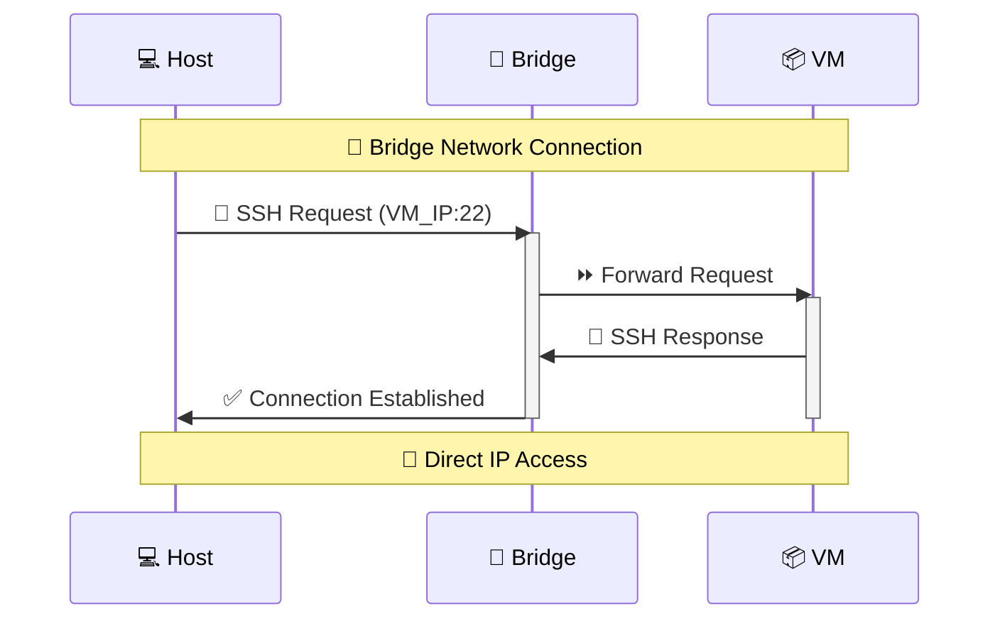
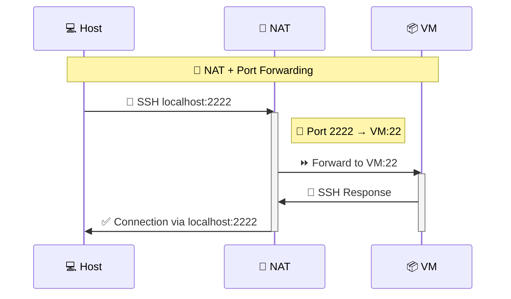
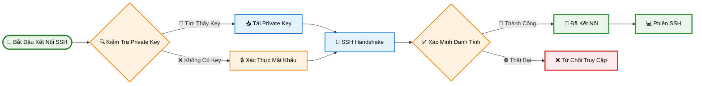
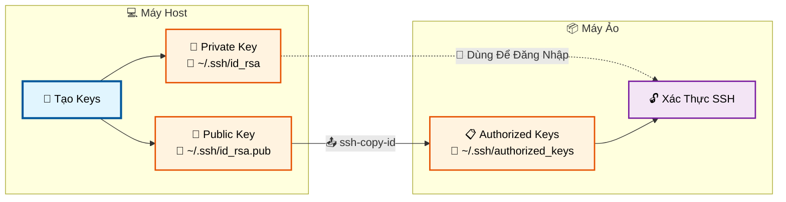
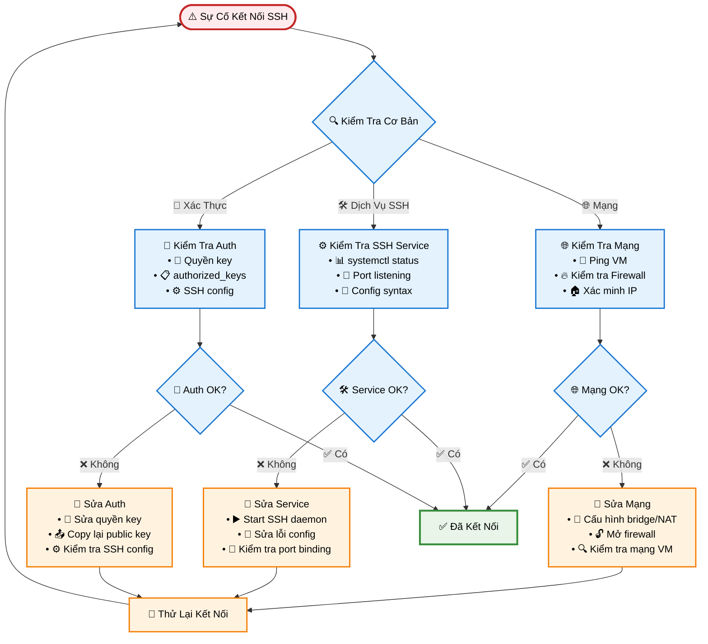
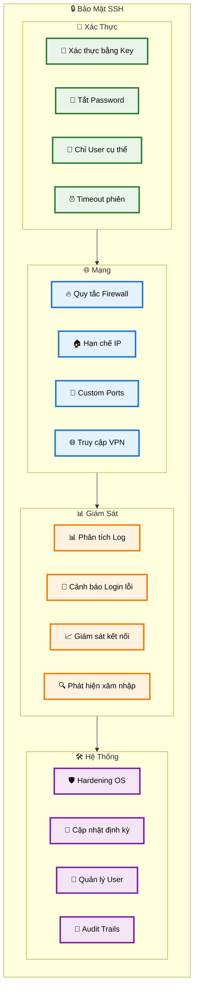

# 🔗 SSH từ Host đến Virtual Machine

## 📖 Tổng quan

Hướng dẫn cấu hình SSH để kết nối từ máy host đến các máy ảo (VM) một cách an toàn và hiệu quả.

## 🏗️ Kiến trúc kết nối

```mermaid
flowchart LR
    subgraph Host["💻 Máy Host"]
        SSH_Client["🔌 SSH Client"]
        Private_Key["🔑 Private Key"]
    end
    
    subgraph Network["🌐 Lớp Mạng"]
        Bridge["🌉 Bridge/NAT"]
        Firewall["🔥 Tường Lửa"]
    end
    
    subgraph VM["📦 Máy Ảo"]
        SSH_Server["🖥️ SSH Server"]
        Auth["🔐 Xác Thực"]
        Shell["💻 Truy Cập Shell"]
    end
    
    SSH_Client -->|"⚡ Port 22/Tùy Chỉnh"| Bridge
    Private_Key -.->|"🔒 Xác Thực"| SSH_Client
    Bridge --> Firewall
    Firewall --> SSH_Server
    SSH_Server --> Auth
    Auth -->|"✅ Thành Công"| Shell
    
    classDef hostStyle fill:#e1f5fe,stroke:#01579b,stroke-width:3px,color:#000
    classDef networkStyle fill:#f3e5f5,stroke:#4a148c,stroke-width:3px,color:#000
    classDef vmStyle fill:#e8f5e8,stroke:#1b5e20,stroke-width:3px,color:#000
    classDef keyStyle fill:#fff3e0,stroke:#e65100,stroke-width:2px,color:#000
    classDef securityStyle fill:#ffebee,stroke:#c62828,stroke-width:2px,color:#000
    
    class SSH_Client,Private_Key hostStyle
    class Bridge,Firewall networkStyle
    class SSH_Server,Auth,Shell vmStyle
    class Private_Key keyStyle
    class Auth,Firewall securityStyle
```



## 🔄 Các phương thức kết nối

### 1. 🌉 Bridge Network Mode



### 2. 🔄 NAT với Port Forwarding



## ⚙️ Cấu hình SSH Server trên VM

### 📥 Bước 1: Cài đặt SSH Server

```bash
# Ubuntu/Debian
sudo apt update
sudo apt install openssh-server

# CentOS/RHEL
sudo yum install openssh-server
# hoặc với dnf
sudo dnf install openssh-server
```

### ⚙️ Bước 2: Cấu hình SSH

```bash
# Chỉnh sửa file cấu hình
sudo nano /etc/ssh/sshd_config
```

**📋 Cấu hình khuyến nghị:**

```bash
# 🔄 Đổi port mặc định (tùy chọn)
Port 2222

# 🚫 Cho phép đăng nhập root (không khuyến nghị)
PermitRootLogin no

# 🔑 Sử dụng key authentication
PubkeyAuthentication yes
PasswordAuthentication no

# ⏰ Giới hạn thời gian kết nối
ClientAliveInterval 300
ClientAliveCountMax 2

# 👤 Chỉ cho phép các user cụ thể
AllowUsers your_username
```

### 🚀 Bước 3: Khởi động SSH Service

```bash
# 🚀 Khởi động và enable SSH
sudo systemctl start ssh
sudo systemctl enable ssh

# 📊 Kiểm tra trạng thái
sudo systemctl status ssh
```

## 🔐 Quá trình xác thực SSH



## 🔑 Tạo và cấu hình SSH Keys

### 🔧 Bước 1: Tạo SSH Key Pair trên Host

```bash
# 🔑 Tạo SSH key pair
ssh-keygen -t rsa -b 4096 -C "your_email@example.com"

# 🔐 Hoặc sử dụng ed25519 (khuyến nghị)
ssh-keygen -t ed25519 -C "your_email@example.com"
```

### 📤 Bước 2: Copy Public Key đến VM

```bash
# 📤 Sử dụng ssh-copy-id
ssh-copy-id username@vm_ip_address

# 📋 Hoặc copy thủ công
cat ~/.ssh/id_rsa.pub | ssh username@vm_ip "mkdir -p ~/.ssh && cat >> ~/.ssh/authorized_keys"
```

### 🔄 Quá trình quản lý keys



## 🌐 Cấu hình Network cho VM

### 🖥️ VMware Workstation

```bash
# 🌉 Bridge Mode - VM có IP riêng trong mạng
# VM Settings → Network Adapter → Bridge

# 🔄 NAT Mode với Port Forwarding
# Virtual Network Editor → NAT Settings → Port Forwarding
# Host Port: 2222 → VM IP: 22
```

### 📦 VirtualBox

```bash
# 🌉 Bridge Mode
# VM Settings → Network → Attached to: Bridged Adapter

# 🔄 NAT với Port Forwarding
# VM Settings → Network → Advanced → Port Forwarding
# Host Port: 2222 → Guest Port: 22
```

## 💻 Cấu hình SSH Client trên Host

### 📝 SSH Config File

```bash
# 📁 Tạo/chỉnh sửa ~/.ssh/config
mkdir -p ~/.ssh
nano ~/.ssh/config
```

**📄 Nội dung file config:**

```bash
# 🖥️ VM Development Server
Host vm-dev
    HostName 192.168.1.100
    User developer
    Port 22
    IdentityFile ~/.ssh/id_rsa
    ServerAliveInterval 60
    ServerAliveCountMax 3

# 🔄 VM with NAT Port Forwarding
Host vm-nat
    HostName localhost
    User developer
    Port 2222
    IdentityFile ~/.ssh/id_rsa

# 🏭 Production VM
Host vm-prod
    HostName 10.0.0.50
    User admin
    Port 2222
    IdentityFile ~/.ssh/id_ed25519
    StrictHostKeyChecking yes
```

## 🔧 Troubleshooting

### 🔍 Quy trình xử lý sự cố



### 🛠️ Lệnh kiểm tra thông dụng

```bash
# 🌐 Kiểm tra kết nối mạng
ping vm_ip_address
telnet vm_ip_address 22

# 🖥️ Kiểm tra SSH service trên VM
sudo systemctl status ssh
sudo netstat -tlnp | grep :22
sudo ss -tlnp | grep :22

# ⚙️ Kiểm tra SSH config
sudo sshd -t
sudo sshd -T

# 🔍 Debug SSH connection
ssh -v username@vm_ip
ssh -vv username@vm_ip  # More verbose
ssh -vvv username@vm_ip # Most verbose

# 🔑 Kiểm tra SSH keys
ls -la ~/.ssh/
chmod 600 ~/.ssh/id_rsa
chmod 644 ~/.ssh/id_rsa.pub
chmod 700 ~/.ssh/
```

## 🔒 Bảo mật SSH

### 🛡️ Các biện pháp bảo mật



### 🔥 Cấu hình Firewall

```bash
# 🔥 UFW (Ubuntu)
sudo ufw allow ssh
sudo ufw allow 2222/tcp  # Custom SSH port
sudo ufw enable

# 🛡️ iptables
sudo iptables -A INPUT -p tcp --dport 22 -j ACCEPT
sudo iptables -A INPUT -p tcp --dport 2222 -j ACCEPT

# 🔥 firewalld (CentOS/RHEL)
sudo firewall-cmd --permanent --add-service=ssh
sudo firewall-cmd --permanent --add-port=2222/tcp
sudo firewall-cmd --reload
```

## 🎯 Kết luận

Việc cấu hình SSH từ host đến VM đòi hỏi sự kết hợp của:

1. **🌐 Cấu hình mạng** phù hợp (Bridge/NAT)
2. **🖥️ SSH Server** được cấu hình đúng cách
3. **🔐 Authentication** an toàn với SSH keys
4. **🔥 Firewall** và các biện pháp bảo mật
5. **📊 Monitoring** và troubleshooting

Với hướng dẫn này, bạn có thể thiết lập kết nối SSH an toàn và hiệu quả giữa host và VM của mình. 🎉