- [**I. TỔNG QUAN VỀ LINUX**](#i-tổng-quan-về-linux)
  - [**1. Giới thiệu và Bắt đầu**](#1-giới-thiệu-và-bắt-đầu)
    - [**1.1. Giới thiệu và Bắt đầu**](#11-giới-thiệu-và-bắt-đầu)
    - [**1.2. Phân rã hệ điều hành Linux**](#12-phân-rã-hệ-điều-hành-linux)
  - [**2. Giao diện Dòng lệnh (CLI)**](#2-giao-diện-dòng-lệnh-cli)
  - [**3. Quản trị Hệ thống Cơ bản**](#3-quản-trị-hệ-thống-cơ-bản)
  - [**4. Mạng và các Công cụ Nâng cao**](#4-mạng-và-các-công-cụ-nâng-cao)
  - [**5. Hệ thống file**](#5-hệ-thống-file)
    - [**5.1. Khám phá Hệ thống File Linux**](#51-khám-phá-hệ-thống-file-linux)
    - [**5.2. Vòng đời File \& Thư mục**](#52-vòng-đời-file--thư-mục)
  - [**6. Người dùng và quyền hạn**](#6-người-dùng-và-quyền-hạn)
    - [**6.1. Mối quan hệ tổng quan**](#61-mối-quan-hệ-tổng-quan)
    - [**6.2. Quy trình kiểm tra quyền truy cập**](#62-quy-trình-kiểm-tra-quyền-truy-cập)
    - [**6.3. Quy trình thay đổi quyền**](#63-quy-trình-thay-đổi-quyền)
  - [**7. Quy trình làm việc với Trình quản lý gói**](#7-quy-trình-làm-việc-với-trình-quản-lý-gói)
  - [**8. Giám sát và Điều khiển Tiến trình**](#8-giám-sát-và-điều-khiển-tiến-trình)
  - [**9. Công cụ Mạng cơ bản**](#9-công-cụ-mạng-cơ-bản)
  - [**10. Shell Script**](#10-shell-script)
    - [**10.1. Vòng đời của một Shell Script**](#101-vòng-đời-của-một-shell-script)
    - [**10.2. Luồng dữ liệu trong Shell**](#102-luồng-dữ-liệu-trong-shell)
    - [**10.3. Tìm kiếm với find và grep**](#103-tìm-kiếm-với-find-và-grep)
    - [**10.4. Quản lý Dịch vụ hệ thống với systemd**](#104-quản-lý-dịch-vụ-hệ-thống-với-systemd)

# **I. TỔNG QUAN VỀ LINUX**

## **1. Giới thiệu và Bắt đầu**

### **1.1. Giới thiệu và Bắt đầu**
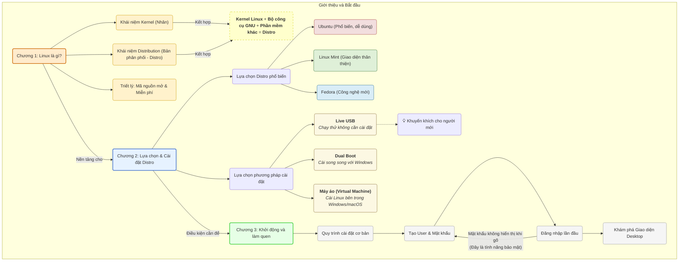

### **1.2. Phân rã hệ điều hành Linux**

```mermaid
graph TD
    subgraph "Phân rã hệ điều hành Linux"
        
        A["Người dùng"] -- "Tương tác qua" --> B{Shell / Giao diện Đồ họa}
        style A fill:#ffe6e6,stroke:#333,stroke-width:2px
        style B fill:#99ccff,stroke:#333,stroke-width:2px

        subgraph "Không gian Người dùng (User Space)"
            B -- "Gửi yêu cầu tới" --> C["Các công cụ và ứng dụng"]
            style C fill:#fff2b3,stroke:#333,stroke-width:2px

            C -- "Ví dụ" --> D["Trình duyệt Web, Trình gõ văn bản, Lệnh (ls, cp)..."]
            style D fill:#ffffcc,stroke:#333,stroke-width:1.5px

            D -- "Sử dụng các thư viện hệ thống (GNU Core Utilities)" --> E["System Libraries (glibc)"]
            style E fill:#ccffcc,stroke:#333,stroke-width:2px
        end

        E -- "Giao tiếp qua System Calls" --> F{Kernel Linux}

        subgraph "Không gian Nhân (Kernel Space) - TRÁI TIM HỆ THỐNG"
            F -- "Quản lý toàn bộ phần cứng" --> G["Phần cứng Máy tính"]
            style F fill:#ff99ff,stroke:#333,stroke-width:4px

            F -- "Chịu trách nhiệm" --> F1["Quản lý Tiến trình (CPU)"]
            F -- "Chịu trách nhiệm" --> F2["Quản lý Bộ nhớ (RAM)"]
            F -- "Chịu trách nhiệm" --> F3["Quản lý Hệ thống File (Ổ đĩa)"]
            F -- "Chịu trách nhiệm" --> F4["Quản lý Thiết bị (Chuột, Bàn phím...)"]

            style F1 fill:#ffcccc,stroke:#333
            style F2 fill:#ffcccc,stroke:#333
            style F3 fill:#ffcccc,stroke:#333
            style F4 fill:#ffcccc,stroke:#333
        end

        G --> H["CPU, RAM, Ổ cứng, Card mạng, ..."]
        style G fill:#d9d9d9,stroke:#333
        style H fill:#f2f2f2,stroke:#333

        %% Note
        Note1("<b>Tổng kết:</b><br/>Một <b>Bản phân phối (Distro)</b> như Ubuntu<br/>sẽ đóng gói tất cả các thành phần này<br/>(Kernel, Shell, Công cụ, Ứng dụng)<br/>thành một hệ điều hành hoàn chỉnh.")
        style Note1 fill:#ccf2ff,stroke:#333,stroke-width:1.5px
    end
``` 

---

## **2. Giao diện Dòng lệnh (CLI)**
- **Đây là phần quan trọng nhất, tập trung vào các lệnh cơ bản để tương tác với hệ thống.**
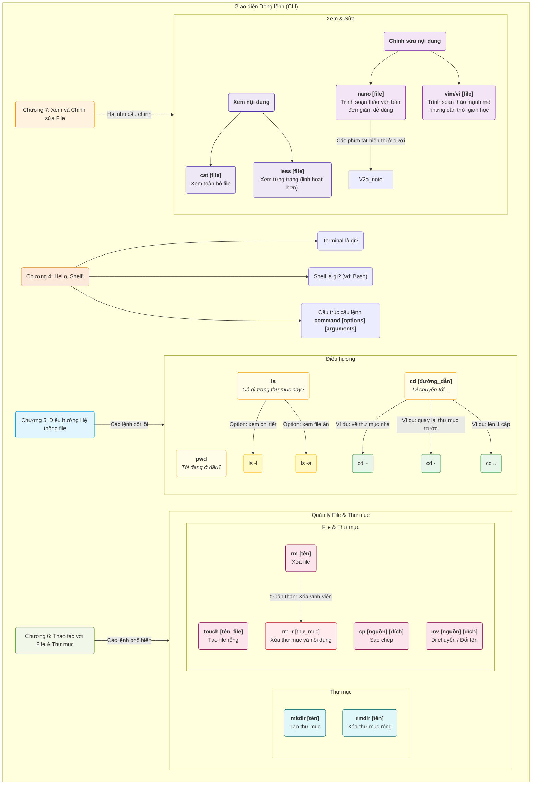
---

## **3. Quản trị Hệ thống Cơ bản**
- **Sơ đồ này mô tả các tác vụ quản trị thiết yếu như quản lý người dùng, phần mềm và tiến trình.**
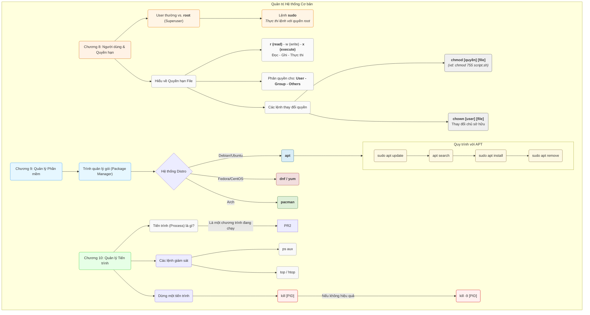
---
## **4. Mạng và các Công cụ Nâng cao** 
- **Giới thiệu về mạng, tự động hóa với script và giao diện đồ họa**
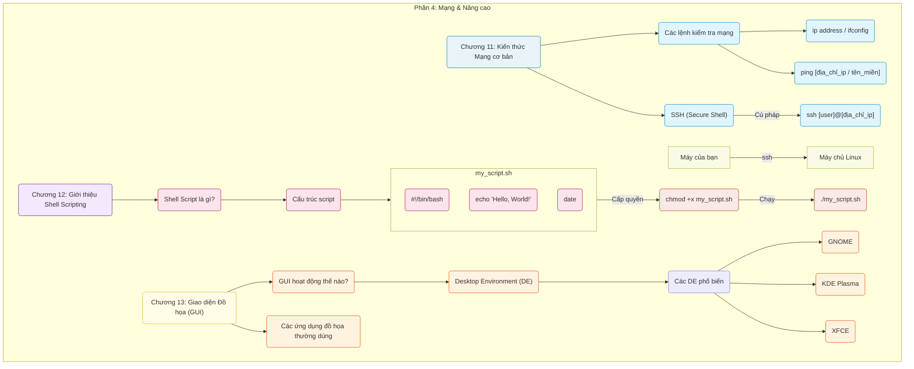

## **5. Hệ thống file**

### **5.1. Khám phá Hệ thống File Linux**

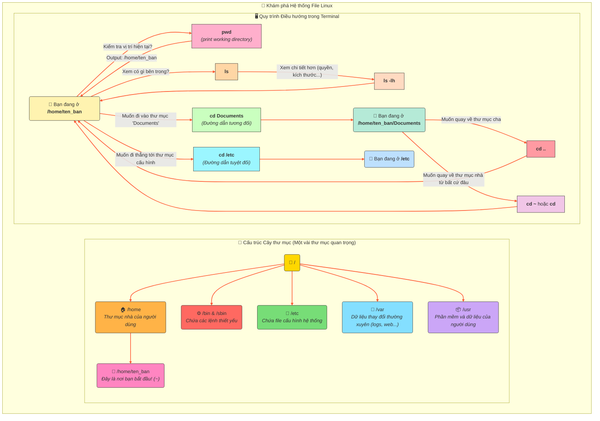

### **5.2. Vòng đời File & Thư mục**
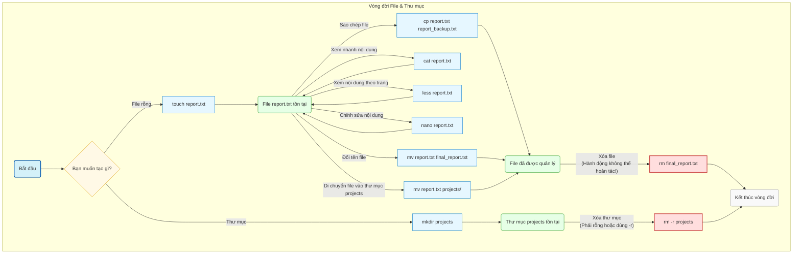

## **6. Người dùng và quyền hạn**

### **6.1. Mối quan hệ tổng quan**

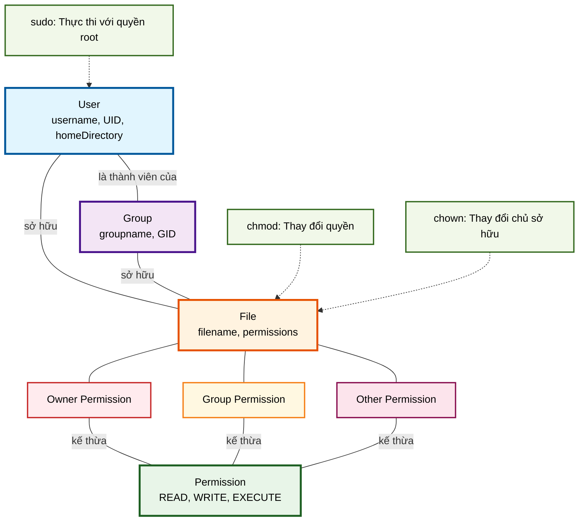

### **6.2. Quy trình kiểm tra quyền truy cập**

### **6.3. Quy trình thay đổi quyền**
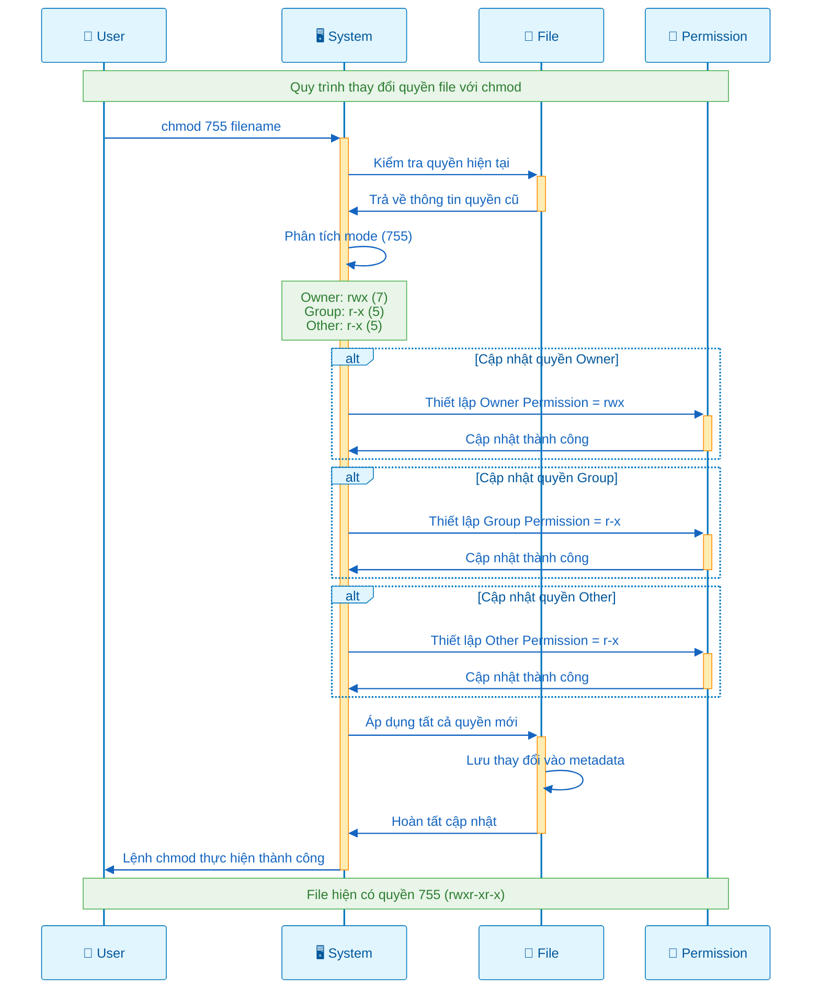

## **7. Quy trình làm việc với Trình quản lý gói**

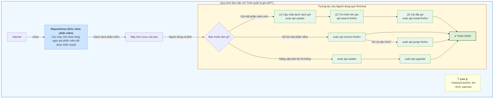

## **8. Giám sát và Điều khiển Tiến trình**

```mermaid
graph TD
    subgraph "Giám sát và Điều khiển Tiến trình"
        
        A["Hệ thống Linux đang chạy nhiều Tiến trình (Processes)"]
        
        A --> B{"Nhiệm vụ của bạn là gì?"}
        
        B -- "Giám sát hệ thống" --> C["Chọn công cụ giám sát"]
        C --> C1["<b>ps aux</b><br/><i>Xem 'ảnh chụp' tất cả tiến trình tại một thời điểm.</i>"]
        C --> C2["<b>top</b> hoặc <b>htop</b><br/><i>Xem các tiến trình và tài nguyên (CPU, RAM) theo thời gian thực.</i>"]
        
        C1 & C2 -- "Kết quả cho thấy" --> D["Danh sách các tiến trình, mỗi tiến trình có một <b>PID (Process ID)</b> duy nhất"]
        D -- "Ví dụ: Firefox (PID: 1234) đang bị treo" --> E{"Cần phải dừng tiến trình này"}

        B -- "Điều khiển tiến trình" --> E
        
        E --> F["Sử dụng lệnh <b>kill</b> với PID đã xác định"]
        
        F --> G{Chọn phương pháp dừng}
        G -- "Gửi yêu cầu dừng lịch sự (Mặc định)<br/><i>Cho phép tiến trình dọn dẹp trước khi thoát</i>" --> H1["kill 1234 (Gửi tín hiệu SIGTERM)"]
        G -- "❗️ Buộc dừng ngay lập tức<br/><i>Khi tiến trình không phản hồi yêu cầu dừng</i>" --> H2["kill -9 1234 (Gửi tín hiệu SIGKILL)"]
        
        H1 & H2 --> I["✅ Tiến trình đã được dừng"]
        
        %% Định nghĩa màu sắc
        classDef startNode fill:#e1f5fe,stroke:#0277bd,stroke-width:2px,color:#000
        classDef monitorNode fill:#f3e5f5,stroke:#7b1fa2,stroke-width:2px,color:#000
        classDef processNode fill:#e8f5e8,stroke:#388e3c,stroke-width:2px,color:#000
        classDef killNode fill:#fff3e0,stroke:#f57c00,stroke-width:2px,color:#000
        classDef danger fill:#ffdede,stroke:#c44,stroke-width:3px,color:#000
        classDef success fill:#e8f5e8,stroke:#4caf50,stroke-width:2px,color:#000
        classDef decision fill:#fff9c4,stroke:#f9a825,stroke-width:2px,color:#000
        
        %% Áp dụng màu sắc
        class A startNode
        class B,E,G decision
        class C,C1,C2 monitorNode
        class D,F processNode
        class H1 killNode
        class H2 danger
        class I success

    end

``` 

## **9. Công cụ Mạng cơ bản**
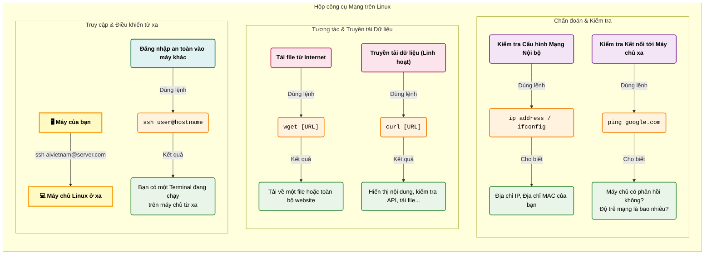

## **10. Shell Script**

### **10.1. Vòng đời của một Shell Script**

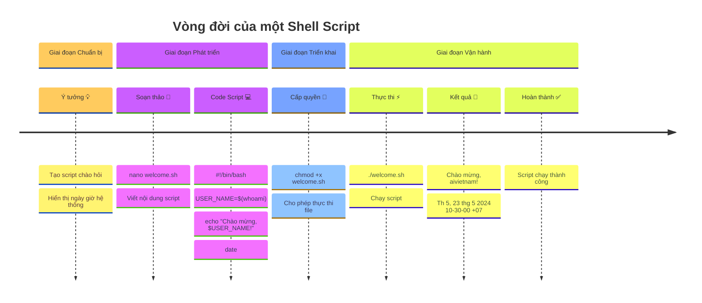

### **10.2. Luồng dữ liệu trong Shell**

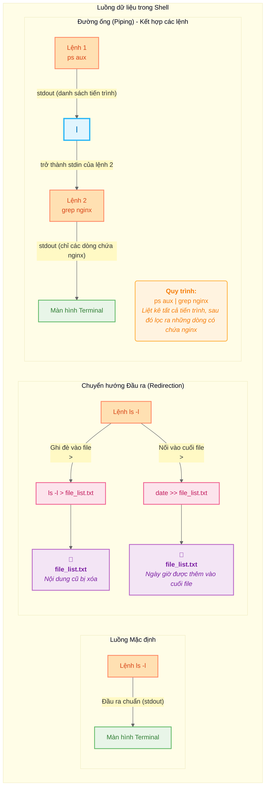
### **10.3. Tìm kiếm với find và grep**

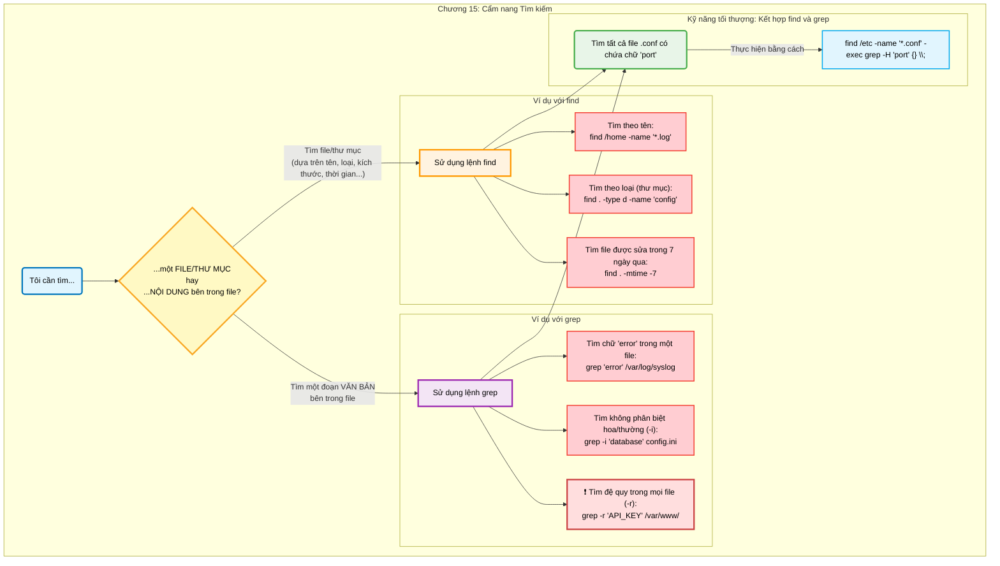

### **10.4. Quản lý Dịch vụ hệ thống với systemd**

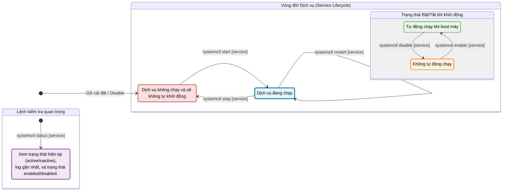