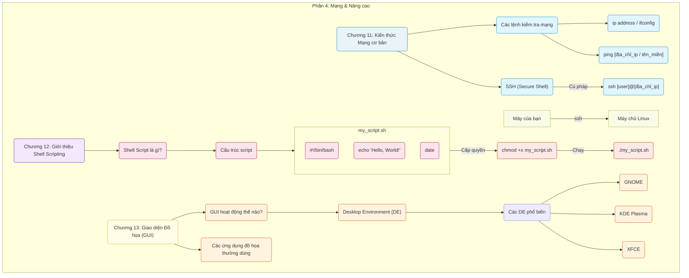

# **I. TỔNG QUAN VỀ LINUX**

## **1. Giới thiệu và Bắt đầu**

- Giải thích các khái niệm nền tảng và các bước đầu tiên để tiếp cận Linux

- Sơ đồ phân rã cấu trúc của một hệ điều hành Linux và mối quan hệ giữa các thành phần cốt lõi của nó.

```mermaid
graph TD
    subgraph "Chương 1 (Chi tiết): Phân rã một hệ điều hành Linux"
        
        A["Người dùng"] -- "Tương tác qua" --> B{Shell / Giao diện Đồ họa}
        style A fill:#ffe6e6,stroke:#333,stroke-width:2px
        style B fill:#99ccff,stroke:#333,stroke-width:2px

        subgraph "Không gian Người dùng (User Space)"
            B -- "Gửi yêu cầu tới" --> C["Các công cụ và ứng dụng"]
            style C fill:#fff2b3,stroke:#333,stroke-width:2px

            C -- "Ví dụ" --> D["Trình duyệt Web, Trình gõ văn bản, Lệnh (ls, cp)..."]
            style D fill:#ffffcc,stroke:#333,stroke-width:1.5px

            D -- "Sử dụng các thư viện hệ thống (GNU Core Utilities)" --> E["System Libraries (glibc)"]
            style E fill:#ccffcc,stroke:#333,stroke-width:2px
        end

        E -- "Giao tiếp qua System Calls" --> F{Kernel Linux}

        subgraph "Không gian Nhân (Kernel Space) - TRÁI TIM HỆ THỐNG"
            F -- "Quản lý toàn bộ phần cứng" --> G["Phần cứng Máy tính"]
            style F fill:#ff99ff,stroke:#333,stroke-width:4px

            F -- "Chịu trách nhiệm" --> F1["Quản lý Tiến trình (CPU)"]
            F -- "Chịu trách nhiệm" --> F2["Quản lý Bộ nhớ (RAM)"]
            F -- "Chịu trách nhiệm" --> F3["Quản lý Hệ thống File (Ổ đĩa)"]
            F -- "Chịu trách nhiệm" --> F4["Quản lý Thiết bị (Chuột, Bàn phím...)"]

            style F1 fill:#ffcccc,stroke:#333
            style F2 fill:#ffcccc,stroke:#333
            style F3 fill:#ffcccc,stroke:#333
            style F4 fill:#ffcccc,stroke:#333
        end

        G --> H["CPU, RAM, Ổ cứng, Card mạng, ..."]
        style G fill:#d9d9d9,stroke:#333
        style H fill:#f2f2f2,stroke:#333

        %% Note
        Note1("<b>Tổng kết:</b><br/>Một <b>Bản phân phối (Distro)</b> như Ubuntu<br/>sẽ đóng gói tất cả các thành phần này<br/>(Kernel, Shell, Công cụ, Ứng dụng)<br/>thành một hệ điều hành hoàn chỉnh.")
        style Note1 fill:#ccf2ff,stroke:#333,stroke-width:1.5px
    end
``` 

---

## **2. Giao diện Dòng lệnh (CLI)**
- Đây là phần quan trọng nhất, tập trung vào các lệnh cơ bản để tương tác với hệ thống.

---

## **3. Quản trị Hệ thống Cơ bản**
- Sơ đồ này mô tả các tác vụ quản trị thiết yếu như quản lý người dùng, phần mềm và tiến trình.

---
## **4. Mạng và các Công cụ Nâng cao** 
- Giới thiệu về mạng, tự động hóa với script và giao diện đồ họa

