- [**I. Lộ Trình Học Linux Cho Người Mới Bắt Đầu**](#i-lộ-trình-học-linux-cho-người-mới-bắt-đầu)
    - [**1. Giới Thiệu Và Nền Tảng Linux**](#1-giới-thiệu-và-nền-tảng-linux)
    - [**2. Cài Đặt Và Thiết Lập Môi Trường**](#2-cài-đặt-và-thiết-lập-môi-trường)
    - [**3. Làm Quen Với Terminal \& Lệnh Cơ Bản**](#3-làm-quen-với-terminal--lệnh-cơ-bản)
    - [**4. Quản Lý File Và Thư Mục**](#4-quản-lý-file-và-thư-mục)
    - [**5. Quyền Truy Cập Và Bảo Mật Cơ Bản**](#5-quyền-truy-cập-và-bảo-mật-cơ-bản)
    - [**6. Quản Lý Không Gian Đĩa Và File System**](#6-quản-lý-không-gian-đĩa-và-file-system)
    - [**7. Cài Đặt Phần Mềm**](#7-cài-đặt-phần-mềm)
    - [**8. Quản Lý Tiến Trình**](#8-quản-lý-tiến-trình)
    - [**9. Mạng Và Kết Nối**](#9-mạng-và-kết-nối)
    - [**10. Shell Scripting Cơ Bản**](#10-shell-scripting-cơ-bản)
    - [**11. Quản Lý Ổ Đĩa Với LVM (Logical Volume Manager)**](#11-quản-lý-ổ-đĩa-với-lvm-logical-volume-manager)
    - [**12. Troubleshooting Và Backup**](#12-troubleshooting-và-backup)
    - [**13. Tổng Kết Và Bước Tiếp Theo**](#13-tổng-kết-và-bước-tiếp-theo)
- [**II. GIỚI THIỆU VÀ LỊCH SỬ LINUX**](#ii-giới-thiệu-và-lịch-sử-linux)
    - [**1. Phân rã hệ điều hành Linux**](#1-phân-rã-hệ-điều-hành-linux)
- [**II. CÀI ĐẶT VÀ BẮT ĐẦU**](#ii-cài-đặt-và-bắt-đầu)
- [**III. GIAO DIỆN NGƯỜI DÙNG (GUI VÀ CLI)**](#iii-giao-diện-người-dùng-gui-và-cli)
- [**IV. HỆ THỐNG FILE VÀ ĐIỀU HƯỚNG**](#iv-hệ-thống-file-và-điều-hướng)
- [**V. THAO TÁC VỚI FILE \& THƯ MỤC**](#v-thao-tác-với-file--thư-mục)
- [**VI. NGƯỜI DÙNG VÀ QUYỀN HẠN**](#vi-người-dùng-và-quyền-hạn)
- [**VII. QUẢN LÝ PHẦN MỀM (PACKAGE MANAGER)**](#vii-quản-lý-phần-mềm-package-manager)
- [**VIII. GIÁM SÁT VÀ ĐIỀU KHIỂN TIẾN TRÌNH**](#viii-giám-sát-và-điều-khiển-tiến-trình)
- [**IX. CÔNG CỤ MẠNG CƠ BẢN**](#ix-công-cụ-mạng-cơ-bản)
- [**X. SHELL SCRIPTING VÀ TỰ ĐỘNG HÓA**](#x-shell-scripting-và-tự-động-hóa)
- [**XI. QUẢN LÝ DỊCH VỤ VÀ NÂNG CAO**](#xi-quản-lý-dịch-vụ-và-nâng-cao)
- [**XII. BẢO MẬT VÀ TROUBLESHOOTING CƠ BẢN**](#xii-bảo-mật-và-troubleshooting-cơ-bản)

# **I. Lộ Trình Học Linux Cho Người Mới Bắt Đầu**

### **1. Giới Thiệu Và Nền Tảng Linux**  
🎯 **Mục tiêu**: Hiểu Linux là gì, tại sao dùng. 

**Nội dung học**:  
1. 🐧 **Linux là gì?**  
   - Lịch sử ngắn gọn: từ Unix đến Linus Torvalds  
   - So sánh với Windows/macOS một cách đơn giản
2. 🔧 **Các thành phần cốt lõi**:  
   - Kernel (nhân) - não bộ của hệ thống
   - Distro (Ubuntu, Mint, Fedora...)
   - Shell - cách giao tiếp với máy tính

### **2. Cài Đặt Và Thiết Lập Môi Trường**   
🎯 **Mục tiêu**: Có môi trường Linux để thực hành, làm quen giao diện.  

**Nội dung học**:  
1. 📦 **Chọn Distro cho người mới**:  
   - **Khuyến nghị**: Ubuntu LTS (ổn định, nhiều tài liệu)
   - Tại sao tránh Arch, Gentoo lúc đầu
2. 💿 **Phương pháp cài đặt an toàn**:  
   - **Ưu tiên**: VirtualBox (không ảnh hưởng máy chính)
   - Live USB để thử nghiệm
   - Dual Boot (chỉ khi đã tự tin và **sao lưu dữ liệu**)
3. 🛠 **Hướng dẫn cài đặt từng bước**:  
   - Tải Ubuntu ISO từ trang chính thức
   - Cài VirtualBox, tạo máy ảo
   - Cài Ubuntu với cấu hình cơ bản
4. 🖥 **Làm quen giao diện**:  
   - Desktop Environment (GNOME)
   - Ứng dụng cơ bản: Files, Terminal, Firefox
   - Cài đặt hệ thống cơ bản
5. ⚙️ **Cấu hình cơ bản**:  
   - Thay đổi theme/font cho dễ nhìn
   - Thiết lập PATH cơ bản
   - Cài đặt extension GUI đơn giản 

📝 **Bài tập thực hành**:  
   - Cài Ubuntu trên VirtualBox
   - Mở Terminal và gõ `echo "Xin chào Linux"`
   - Cài đặt ngôn ngữ tiếng Việt và thay đổi theme
   - Tạo folder qua GUI và kiểm tra qua Terminal

📚 **Tài nguyên học tập**:  
   - Video: "How to install Ubuntu on VirtualBox"
   - Ubuntu Desktop Guide (tiếng Việt)

### **3. Làm Quen Với Terminal & Lệnh Cơ Bản**   

🎯 **Mục tiêu**: Thành thạo các lệnh thiết yếu.  

**Nội dung học**:  
1. 🖥 **Terminal là gì và tại sao quan trọng**:  
   - Giao diện dòng lệnh vs giao diện đồ họa
   - Tại sao admin Linux cần biết Terminal
2. 📝 **Cấu trúc lệnh**: `lệnh [tùy-chọn] [đối-số]`  
   - Ví dụ: `ls -l /home`
3. 🆘 **Công cụ trợ giúp**:  
   - `man tên-lệnh` - hướng dẫn chi tiết
   - `lệnh --help` - trợ giúp nhanh
   - Tab completion - tự động hoàn thành
   - Phím mũi tên ↑↓ - lịch sử lệnh
   - Ctrl+R - tìm kiếm lệnh đã dùng
4. 🔍 **Wildcards & pattern**:  
   - `*` (bất kỳ), `?` (1 ký tự), `[]` (phạm vi)
5. 🌎 **Biến môi trường**:  
   - `$PATH` (tìm lệnh), `$HOME` (thư mục nhà)
   - `echo $PATH` để kiểm tra
   - `export VAR=value` để thiết lập tạm thời
6. 💻 **Lệnh cơ bản đầu tiên**:  
   - `pwd` - xem thư mục hiện tại
   - `ls` - liệt kê file/thư mục
   - `cd` - di chuyển thư mục
   - `whoami` - xem tên người dùng
   - `date` - xem ngày giờ
   - `clear` - xóa màn hình

📝 **Bài tập thực hành**:  
   - Thực hành 20 lệnh cơ bản mỗi ngày
   - Tạo cheat sheet cá nhân với các lệnh hay dùng
   - Sử dụng `man` để tìm hiểu 5 lệnh
   - Tạo alias đơn giản: `alias ll='ls -la'`
   - Tìm hiểu và sửa lỗi "command not found" (kiểm tra PATH)

📚 **Tài nguyên học tập**:  
   - "Linux Command Line for Beginners" (free PDF)
   - Interactive terminal: linuxjourney.com

### **4. Quản Lý File Và Thư Mục**  
🎯 **Mục tiêu**: Thành thạo thao tác với file/thư mục - kỹ năng cốt lõi nhất.   

**Nội dung học**:  
1. 📂 **Hiểu cấu trúc thư mục Linux**:  
   - `/` - thư mục gốc
   - `/home` - thư mục người dùng  
   - `/etc` - cấu hình hệ thống
   - `/usr` - ứng dụng người dùng
   - `/var` - dữ liệu thay đổi
   - `/bin` - lệnh hệ thống cơ bản
2. 📋 **Lệnh điều hướng nâng cao**:  
   - `ls -la` - xem chi tiết + file ẩn
   - `cd ~` - về thư mục home
   - `cd ..` - lên thư mục cha
   - `cd -` - về thư mục trước
3. 📑 **Thao tác file/thư mục**:  
   - `touch file.txt` - tạo file trống
   - `mkdir thư-mục` - tạo thư mục
   - `cp file1 file2` - copy file
   - `mv file1 file2` - di chuyển/đổi tên
   - `rm file` - xóa file
   - `rm -r thư-mục` - xóa thư mục
4. 🔄 **Redirection & piping**:  
   - `>` (ghi đè), `>>` (thêm)
   - `|` (kết nối lệnh), `2>` (lỗi)
5. 📖 **Xem và chỉnh sửa file**:  
   - `cat file.txt` - xem nội dung file
   - `less file.txt` - xem file dài
   - `nano file.txt` - chỉnh sửa đơn giản
6. 🔎 **Tìm kiếm cơ bản**:  
   - `find /home -name "*.txt"` - tìm file theo tên
   - `locate "*.log"` - tìm nhanh hơn (cần cập nhật database)
   - `grep "từ-khóa" file.txt` - tìm text trong file
   - `grep -r "error" /var/log` - tìm recursive

📝 **Bài tập thực hành**:  
   - Tạo cấu trúc thư mục dự án cá nhân
   - Copy, move, rename file
   - Tạo và chỉnh sửa file text đơn giản
   - Tìm file theo tên và nội dung
   - Sử dụng redirection và piping để xử lý dữ liệu
   - Thực hành tìm và sửa lỗi "no such file" (kiểm tra pwd, dùng absolute path)

📚 **Tài nguyên học tập**:  
   - Interactive exercises trên cmdchallenge.com
   - "Linux File System" tutorial

### **5. Quyền Truy Cập Và Bảo Mật Cơ Bản**  
🎯 **Mục tiêu**: Hiểu và quản lý quyền file để tránh lỗi "permission denied".  

**Nội dung học**:  
1. 👥 **Khái niệm User và Group**:  
   - Owner (chủ sở hữu), Group (nhóm), Others (người khác)
   - Tại sao cần phân quyền
2. 🔒 **Hiểu quyền truy cập**:  
   - `r` (read) - đọc
   - `w` (write) - ghi
   - `x` (execute) - thực thi
   - Xem quyền với `ls -l`
3. 🛠 **Thay đổi quyền**:  
   - `chmod 755 file` - số học
   - `chmod u+x file` - ký hiệu
   - `chown user:group file` - đổi chủ sở hữu
4. 🧩 **Quyền nâng cao**:  
   - Sticky bit (chỉ chủ sở hữu xóa được)
   - SUID/SGID (ví dụ: lệnh passwd)
5. 👑 **Sudo - quyền quản trị**:  
   - Khi nào cần `sudo`
   - `sudo vs su` - khác biệt
   - Cách sử dụng an toàn
   - Cấu hình sudoers cơ bản
6. 🛡 **Bảo mật cơ bản**:  
   - Tạo mật khẩu mạnh
   - Cập nhật hệ thống thường xuyên
   - Tắt tài khoản root khi không cần
   - SSH hardening cơ bản (sử dụng key-based authentication)
   - Giới thiệu firewall cơ bản (ufw)

📝 **Bài tập thực hành**:  
   - Tạo file và thay đổi quyền truy cập
   - Thực hành lệnh sudo
   - Tạo user mới và phân quyền
   - Thiết lập rule ufw đơn giản (cho phép SSH)
   - Thử nghiệm SUID với lệnh passwd

📚 **Tài nguyên học tập**:  
   - "Linux Permissions Explained" video
   - Ubuntu Security Guide

### **6. Quản Lý Không Gian Đĩa Và File System**  
🎯 **Mục tiêu**: Hiểu cách Linux quản lý ổ đĩa, kiểm tra dung lượng, xử lý ổ đĩa đầy, và thao tác gắn kết ổ đĩa cơ bản.

**Nội dung học**:  
1. 💽 **Filesystem là gì**:  
   - Mount points - điểm gắn kết ổ đĩa  
   - Các loại phổ biến: **ext4** (Linux), **XFS** (Oracle Linux), **NTFS/FAT** (Windows)  
   - Filesystem vs Partition vs LVM  

2. 📊 **Kiểm tra dung lượng**:  
   - `df -h` - dung lượng đã dùng/tổng dung lượng *(human-readable)*  
   - `df -i` - kiểm tra inode *(khi hết inode dù dung lượng còn trống)*  
   - `lsblk` - xem cây thiết bị block  
   - `/proc/partitions` - xem partition từ kernel  

3. 🔍 **Tìm file chiếm dụng**:  
   - `du -sh /path` - tổng dung lượng thư mục  
   - `du -h --max-depth=1 /path` - xem theo cấp độ  
   - `ncdu` - công cụ GUI-like trong terminal *(cần cài)*  
   - `find / -size +100M` - tìm file >100MB  

4. 🧹 **Dọn dẹp không gian**:  
   - Xóa file log cũ: `/var/log/`  
   - Dọn cache package: `sudo apt clean`  
   - Xóa bản cập nhật cũ: `sudo apt autoremove --purge`  
   - Tìm và xóa file tạm: `/tmp/`, `~/.cache/`  

5. 🔌 **Gắn kết (mount) ổ đĩa cơ bản**:  
   - `mount /dev/sdb1 /mnt/data` - gắn phân vùng  
   - `umount /mnt/data` - ngắt gắn kết  
   - Tự động mount qua `/etc/fstab`  
   - Kiểm tra mounted FS với `findmnt` hoặc `mount -l`  
   - Xem thông tin USB/ổ cứng ngoài với `lsblk -f`  

6. ⚠️ **Xử lý tình huống đầy ổ**:  
   - **Triệu chứng**: không ghi được file, ứng dụng crash  
   - **Quy trình khắc phục**:  
     1. Kiểm tra `df -h` và `df -i`  
     2. Tìm thư mục lớn bằng `du`/`ncdu`  
     3. Xóa hoặc di chuyển file lớn  
     4. Mở rộng filesystem *(sẽ học trong LVM)*  

7. 🛡 **Best Practices**:  
   - Luôn để trống 10-20% dung lượng  
   - Tách /home, /var, /tmp ra phân vùng riêng  
   - Giám sát tự động *(sẽ học trong Shell Scripting)*  

📝 **Bài tập thực hành**:  
   - Tạo file 1GB: `dd if=/dev/zero of=testfile bs=1M count=1000`  
   - Theo dõi `df -h` trước/sau khi tạo file  
   - Dùng `ncdu` scan /var và tìm 3 file lớn nhất  
   - Thử nghiệm xóa file log và dọn cache package  
   - **Thực hành mount**:  
     - Tạo thư mục `/mnt/test`  
     - Tạo file hệ thống: `sudo mkfs.ext4 /dev/sdb1` (giả sử có phân vùng sẵn)  
     - Mount thủ công: `sudo mount /dev/sdb1 /mnt/test`  
     - Ghi file vào `/mnt/test` và kiểm tra  
     - Thêm dòng vào `/etc/fstab` để mount tự động  
   - Tạo kịch bản ổ đĩa đầy (>90%) và thực hành xử lý  

📚 **Tài nguyên học tập**:  
   - [Linux Disk Management Cheatsheet](https://linuxhandbook.com/disk-space-commands/)  
   - Video: [How to Clean Up Disk Space on Ubuntu](https://youtu.be/4K4sMvLy7d0)  
   - Guide: [Mounting Drives in Linux](https://linuxize.com/post/how-to-mount-and-unmount-file-systems-in-linux/)  

### **7. Cài Đặt Phần Mềm**  
🎯 **Mục tiêu**: Biết cách cài đặt và quản lý ứng dụng an toàn.  

**Nội dung học**:  
1. 📦 **Package Manager là gì**:  
   - Kho phần mềm tập trung
   - Tự động xử lý dependencies
2. 🔄 **Sử dụng APT (Ubuntu/Debian)**:  
   - `sudo apt update` - cập nhật danh sách
   - `sudo apt install tên-gói` - cài đặt
   - `sudo apt remove tên-gói` - gỡ bỏ
   - `sudo apt upgrade` - cập nhật hệ thống
3. 📋 **Quản lý phần mềm**:  
   - `apt list --installed` - xem đã cài
   - `apt search từ-khóa` - tìm kiếm
   - `sudo apt autoremove` - dọn dẹp
4. 🏪 **Ubuntu Software Center & Snap**:  
   - Cài đặt qua giao diện đồ họa
   - Ưu/nhược điểm của Snap packages
5. ⚙️ **Các package manager khác**:  
   - `dnf`/`yum` (Fedora)
   - `pacman` (Arch)
   - Compile từ source (make/install - khi cần thiết)

📝 **Bài tập thực hành**:  
   - Cài đặt: git, curl, htop, tree
   - Cập nhật toàn bộ hệ thống
   - Gỡ bỏ một ứng dụng không cần
   - Thử cài đặt qua Snap và so sánh với apt
   - Tìm hiểu và sửa lỗi repository (kiểm tra /etc/apt/sources.list)

📚 **Tài nguyên học tập**:  
   - Ubuntu Package Management Guide
   - APT cheat sheet

### **8. Quản Lý Tiến Trình**  
🎯 **Mục tiêu**: Giám sát và điều khiển các chương trình đang chạy.  

**Nội dung học**:  
1. ⚙️ **Process (tiến trình) là gì**:  
   - Mỗi chương trình chạy = 1 process
   - PID (Process ID) - số định danh
2. 👀 **Xem tiến trình**:  
   - `ps aux` - liệt kê tất cả process
   - `top` - xem real-time
   - `htop` - giao diện đẹp hơn (cần cài)
   - `pstree` - xem dạng cây
3. ❌ **Dừng tiến trình**:  
   - `kill PID` - dừng nhẹ nhàng
   - `kill -9 PID` - buộc dừng
   - `pkill tên-chương-trình` - kill theo tên
4. 🏁 **Chạy nền và foreground**:  
   - `lệnh &` - chạy nền
   - `Ctrl+Z` - tạm dừng
   - `jobs` - xem công việc nền
   - `fg` - đưa lên foreground
   - `bg` - tiếp tục chạy nền
   - `nohup` - chạy ngay cả khi logout
5. 🔧 **Systemd services cơ bản**:  
   - `sudo systemctl status tên-service`
   - `sudo systemctl start/stop/restart tên-service`
   - `sudo systemctl enable tên-service` - khởi động cùng hệ thống
   - Các loại unit: `.service`, `.timer`, `.target`
6. 📜 **Logs hệ thống**:  
   - `journalctl -u tên-service -f` - xem log real-time

📝 **Bài tập thực hành**:  
   - Sử dụng htop để giám sát hệ thống
   - Kill process tiêu tốn CPU cao
   - Chạy lệnh ở background và quản lý với jobs
   - Cài đặt và quản lý dịch vụ Apache (systemctl)
   - Xem log của một dịch vụ đang chạy

📚 **Tài nguyên học tập**:  
   - "Linux Process Management" tutorial
   - htop explained

### **9. Mạng Và Kết Nối**  
🎯 **Mục tiêu**: Kết nối Linux với internet và máy tính khác.  

**Nội dung học**:  
1. 🌐 **Kiểm tra kết nối mạng**:  
   - `ping google.com` - test internet
   - `ip addr`/`ifconfig` - xem IP address
   - `traceroute google.com` - theo dõi đường đi
   - `ss`/`netstat` - xem kết nối mạng
2. 🔑 **SSH - Kết nối từ xa**:  
   - Cài đặt SSH server
   - Kết nối: `ssh user@ip-address`
   - Copy file: `scp file user@ip:/path`
   - Tạo SSH key: `ssh-keygen`
   - Cấu hình SSH cơ bản
3. 🛡 **Firewall cơ bản**:  
   - `sudo ufw enable` - bật firewall
   - `sudo ufw allow ssh` - cho phép SSH
   - `sudo ufw status` - xem trạng thái
   - Hiểu cơ bản về iptables
4. 🌐 **Web tools**:  
   - `curl` - gọi API, tải file
   - `wget` - tải file từ web
   - Giới thiệu nmap (scan ports)

📝 **Bài tập thực hành**:  
   - Test kết nối internet
   - Cài đặt SSH và kết nối giữa 2 máy ảo
   - Tạo SSH key và sử dụng xác thực bằng key
   - Sử dụng curl để gọi API đơn giản
   - Thiết lập firewall cơ bản với ufw
   - Khắc phục lỗi kết nối bằng cách kiểm tra firewall

📚 **Tài nguyên học tập**:  
   - "SSH Essentials" guide
   - Basic networking for Linux

### **10. Shell Scripting Cơ Bản**  
🎯 **Mục tiêu**: Tự động hóa công việc lặp đi lặp lại.  

**Nội dung học**:  
1. 📝 **Script là gì và tại sao cần**:  
   - Tự động hóa task
   - Tránh lặp lại công việc
2. 🚀 **Tạo script đầu tiên**:  
   - Shebang: `#!/bin/bash`
   - Quyền thực thi: `chmod +x script.sh`
   - Chạy: `./script.sh`
3. 🔤 **Biến và input**:  
   - `name="John"` - gán biến
   - `echo $name` - sử dụng biến
   - `read -p "Nhập tên: " name` - input từ user
   - `echo "Arguments: $1, $2"` - tham số dòng lệnh
4. 🔄 **Điều kiện và vòng lặp đơn giản**:  
   - `if [ condition ]; then ... fi`
   - `for file in *.txt; do ... done`
   - `while [ condition ]; do ... done`
   - `case` statement
5. ⏰ **Cron - Lập lịch tự động**:  
   - `crontab -e` - chỉnh sửa lịch
   - `0 2 * * * /path/to/script.sh` - chạy 2h sáng mỗi ngày
6. 📄 **Xử lý văn bản cơ bản**:  
   - `sed` và `awk` cơ bản
   - Kết hợp với `grep` và `find`

📝 **Bài tập thực hành**:  
   - Viết script backup thư mục home
   - Script kiểm tra disk space
   - Đặt lịch chạy script tự động
   - Viết script xử lý file log đơn giản với grep/sed
   - Thử nghiệm error handling cơ bản

📚 **Tài nguyên học tập**:  
   - "Bash Scripting Tutorial for Beginners"
   - Cron job generator online

### **11. Quản Lý Ổ Đĩa Với LVM (Logical Volume Manager)**  
🎯 **Mục tiêu**: Hiểu và sử dụng LVM để quản lý không gian lưu trữ linh hoạt, đặc biệt là mở rộng dung lượng ổ cứng khi cần.  
**Nội dung học**:  
1. 💾 **Giới thiệu về LVM**:  
   - LVM là gì và tại sao cần sử dụng
   - So sánh với phân vùng truyền thống (partitioning)
   - Các thành phần chính: Physical Volumes (PV), Volume Groups (VG), Logical Volumes (LV)
   - Ưu điểm của LVM: linh hoạt, dễ mở rộng, snapshot

2. 🔧 **Cài đặt và cấu hình LVM cơ bản**:  
   - Kiểm tra LVM đã cài đặt chưa (`lvm2` package)
   - Tạo Physical Volume từ ổ đĩa mới: `pvcreate /dev/sdb`
   - Tạo Volume Group từ các Physical Volumes: `vgcreate vg_data /dev/sdb`
   - Tạo Logical Volume từ Volume Group: `lvcreate -L 10G -n lv_home vg_data`
   - Định dạng và mount Logical Volume: `mkfs.ext4 /dev/vg_data/lv_home`

3. 📏 **Mở rộng dung lượng ổ cứng bằng LVM**:  
   - **Cách 1: Thêm không gian từ Volume Group hiện có**
     - Kiểm tra không gian trống trong Volume Group: `vgs`
     - Mở rộng Logical Volume: `lvextend -L +5G /dev/vg_data/lv_home`
     - Thay đổi kích thước hệ thống tập tin: `resize2fs /dev/vg_data/lv_home` (cho ext4)
   - **Cách 2: Thêm Physical Volume mới vào Volume Group**
     - Thêm ổ cứng mới vào máy ảo/vật lý
     - Tạo Physical Volume: `pvcreate /dev/sdc`
     - Mở rộng Volume Group: `vgextend vg_data /dev/sdc`
     - Tiếp tục mở rộng Logical Volume như cách 1

4. 🔁 **Các thao tác LVM nâng cao**:  
   - Giảm kích thước Logical Volume (cần backup trước!)
   - Tạo snapshot để backup: `lvcreate -L 1G -s -n lv_home_snap /dev/vg_data/lv_home`
   - Di chuyển dữ liệu giữa các Physical Volumes: `pvmove /dev/sdb`
   - Tạo striped và mirrored volumes cho hiệu năng và redundancy

5. 📊 **Giám sát và quản lý LVM**:  
   - Các lệnh kiểm tra trạng thái chi tiết: `pvdisplay`, `vgdisplay`, `lvdisplay`
   - Sử dụng `lvs`, `vgs`, `pvs` cho thông tin ngắn gọn
   - Kiểm tra không gian trống với `df -h` và `vgs`
   - Xem thông tin hệ thống tập tin: `lsblk`, `blkid`

6. ⚠️ **Lưu ý và best practices khi sử dụng LVM**:  
   - Luôn backup trước khi thay đổi cấu hình
   - Hiểu rõ thứ tự các bước khi mở rộng/giảm kích thước
   - Tương thích với các hệ điều hành khác (nếu dùng dual-boot)
   - Khi nào nên và không nên sử dụng LVM
   - Tích hợp LVM với các công cụ giám sát hệ thống

📝 **Bài tập thực hành**:  
   - Tạo một hệ thống LVM đơn giản trên máy ảo
   - Mở rộng Logical Volume sau khi thêm ổ đĩa mới (cách 1 và cách 2)
   - Tạo snapshot và khôi phục từ snapshot
   - Thực hành giảm kích thước Logical Volume (sau khi backup đầy đủ)
   - Giám sát trạng thái LVM với các lệnh display
   - Tạo kịch bản tự động kiểm tra không gian LVM và cảnh báo
   - Thực hành khắc phục lỗi "out of space" bằng cách mở rộng LV

📚 **Tài nguyên học tập**:  
   - LVM HOWTO từ Linux Documentation Project
   - Video hướng dẫn thực hành LVM trên YouTube
   - "Mastering LVM" tutorial
   - LVM Cheat Sheet: Các lệnh thường dùng
   - Ubuntu LVM Guide (tài liệu chính thức)

### **12. Troubleshooting Và Backup**  
🎯 **Mục tiêu**: Xử lý sự cố và bảo vệ dữ liệu.  

**Nội dung học**:  
1. 📂 **Xem log hệ thống**:  
   - `/var/log/syslog` - log chung
   - `journalctl -f` - xem log real-time
   - `dmesg` - log kernel
2. 🔍 **Debug cơ bản**:  
   - Đọc error message
   - Google error + "ubuntu"
   - Kiểm tra disk space: `df -h`
   - Kiểm tra RAM: `free -h`
   - Sử dụng `strace` để trace system calls
   - Sử dụng `lsof` để xem file đang mở
3. 💾 **Backup dữ liệu**:  
   - `tar -czf backup.tar.gz /home/user` - nén backup
   - `rsync -av source/ destination/` - sync folder
   - Backup lên cloud (Google Drive, Dropbox)
4. 🚑 **Recovery cơ bản**:  
   - Boot từ Live USB
   - Chroot để sửa hệ thống
   - Single-user mode (sửa chữa qua GRUB)

📝 **Bài tập thực hành**:  
   - Tạo backup script tự động
   - Thực hành đọc log khi có lỗi
   - Recovery file đã xóa nhầm
   - Debug một script lỗi bằng strace
   - Thực hành sao lưu và khôi phục thư mục

📚 **Tài nguyên học tập**:  
   - "Linux Troubleshooting Guide"
   - Backup strategies for home users

### **13. Tổng Kết Và Bước Tiếp Theo**  
🎯 **Mục tiêu**: Củng cố kiến thức và định hướng phát triển.  
**Nội dung học**:  
1. 📖 **Review kiến thức đã học**:  
   - Checklist các kỹ năng cơ bản
   - Làm bài test tự đánh giá
   - Best practices: Tránh dùng root, cập nhật định kỳ, backup hàng tuần
2. 🚀 **Dự án thực tế**:  
   - Setup home server đơn giản
   - Tạo website tĩnh với Apache/Nginx
   - Automation script cho công việc hàng ngày
   - **Mới**: Cài đặt LAMP stack (Apache, MySQL, PHP)
3. 📚 **Tài nguyên tiếp tục học**:  
   - "The Linux Command Line" book
   - "UNIX and Linux System Administration Handbook"
   - Linux Academy, Cloud Guru courses
   - Hands-on labs: KodeKloud, A Cloud Guru
   - Free courses trên edX.org ("Introduction to Linux" bởi Linux Foundation)
 
📝 **Bài tập cuối khóa**:  
   - Xây dựng và present 1 dự án nhỏ (ví dụ: home server, script automation)
   - Viết blog chia sẻ journey học Linux
   - Thiết lập hệ thống backup tự động hàng tuần
   - Kiểm tra và khắc phục một lỗi giả định trên hệ thống

# **II. GIỚI THIỆU VÀ LỊCH SỬ LINUX**

Linux là hệ điều hành mã nguồn mở, miễn phí, ổn định và an toàn, được sử dụng rộng rãi từ server đến máy tính cá nhân. Khác với Windows (đóng nguồn, tập trung vào GUI thân thiện) hay macOS (dựa trên Unix, tích hợp tốt với phần cứng Apple), Linux linh hoạt, tùy chỉnh cao, nhưng đòi hỏi học lệnh dòng (CLI) nhiều hơn.

- **Lịch sử ngắn gọn**: Linux được Linus Torvalds tạo ra năm 1991 dựa trên Unix. Kernel (nhân) Linux kết hợp với công cụ GNU (từ Richard Stallman) tạo thành hệ điều hành hoàn chỉnh. Các distro phổ biến: Ubuntu (dễ dùng), Fedora (công nghệ mới), Debian (ổn định).

- **Ưu điểm cho người mới**: Miễn phí, cộng đồng lớn (hỏi đáp trên Stack Overflow, Reddit), ít virus hơn Windows. Nhược điểm: Cài driver phần cứng đôi khi phức tạp.

### **1. Phân rã hệ điều hành Linux**

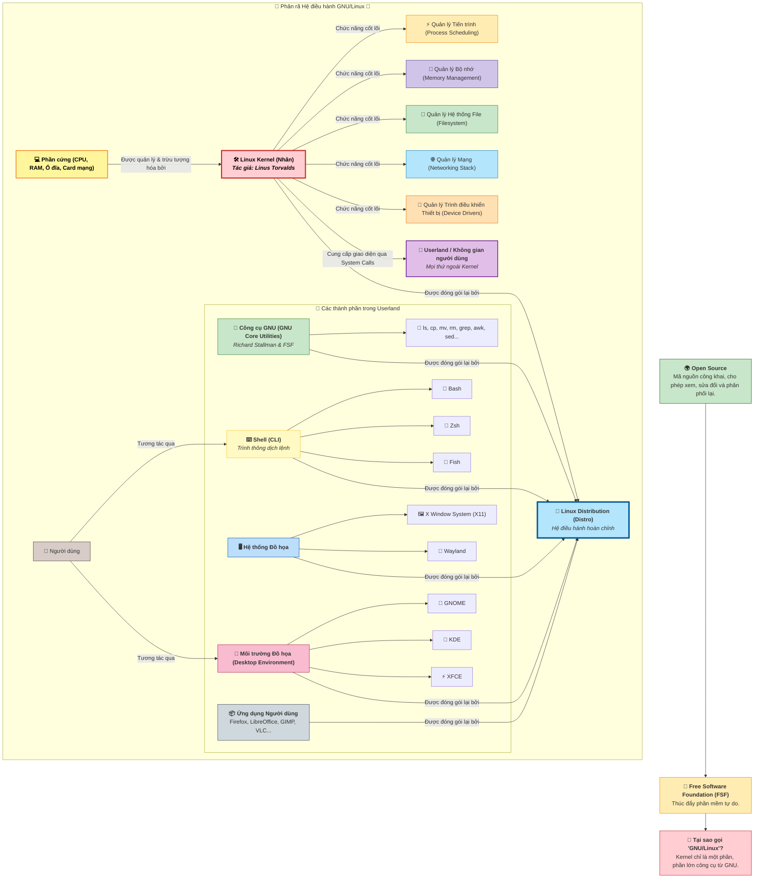

---

# **II. CÀI ĐẶT VÀ BẮT ĐẦU**

Chọn distro dễ dùng như Ubuntu hoặc Linux Mint. Tải ISO từ trang chính thức, kiểm tra checksum để tránh file hỏng.

- **Phương pháp cài đặt**: 
  - Live USB: Chạy thử mà không ảnh hưởng ổ cứng (dùng Rufus để tạo USB bootable).
  - Dual Boot: Cài song song Windows (sao lưu dữ liệu trước, phân vùng ổ cứng).
  - Máy ảo: Sử dụng VirtualBox/VMware để chạy Linux trong Windows.

- **Quy trình cài đặt cơ bản**: Chọn ngôn ngữ, phân vùng ổ, tạo user/password. Sau cài, cập nhật hệ thống: `sudo apt update && sudo apt upgrade` (cho Ubuntu).

- **Làm quen**: Đăng nhập, khám phá desktop (GNOME cho Ubuntu). Mật khẩu không hiển thị khi gõ là tính năng bảo mật.

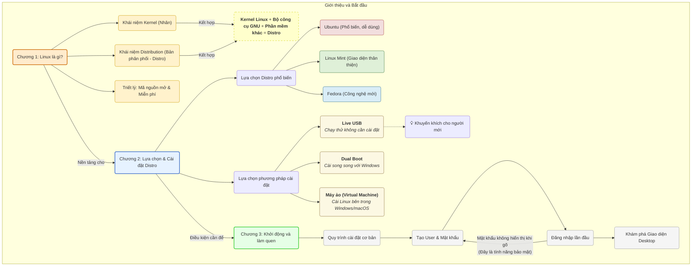

---

# **III. GIAO DIỆN NGƯỜI DÙNG (GUI VÀ CLI)**

- **GUI (Graphical User Interface)**: Giao diện đồ họa như Windows. Các DE phổ biến: GNOME (Ubuntu), KDE (Plasma), XFCE (nhẹ). Sử dụng chuột để mở file, cài app từ store.

- **CLI (Command Line Interface)**: Terminal là "siêu năng lực" của Linux. Shell (như Bash) xử lý lệnh. Cấu trúc lệnh: `command [options] [arguments]` (ví dụ: `ls -la /home`).

- **Mở terminal**: Ctrl+Alt+T trên Ubuntu. Lệnh cơ bản: `man command` để xem hướng dẫn, `command --help` để hỗ trợ nhanh.

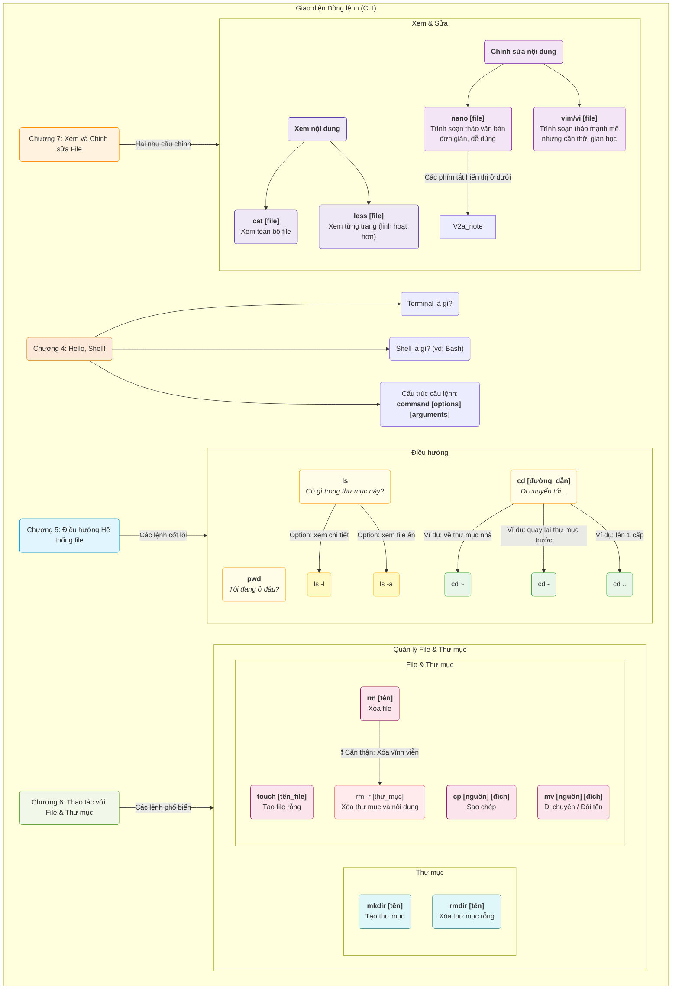

- **Mẹo cho người mới**: Thực hành lệnh trong thư mục test để tránh xóa nhầm. Sử dụng Tab để tự hoàn thành lệnh.

---

# **IV. HỆ THỐNG FILE VÀ ĐIỀU HƯỚNG**

Hệ thống file Linux là cây thư mục bắt đầu từ / (root). Không có ổ C:/ như Windows, mọi thứ là file (kể cả thiết bị).

- **Đường dẫn**: Tuyệt đối (/home/user) hoặc tương đối (Documents từ thư mục hiện tại).

- **Thư mục quan trọng**: /home (dữ liệu user), /etc (cấu hình), /var/log (logs), /usr (phần mềm).

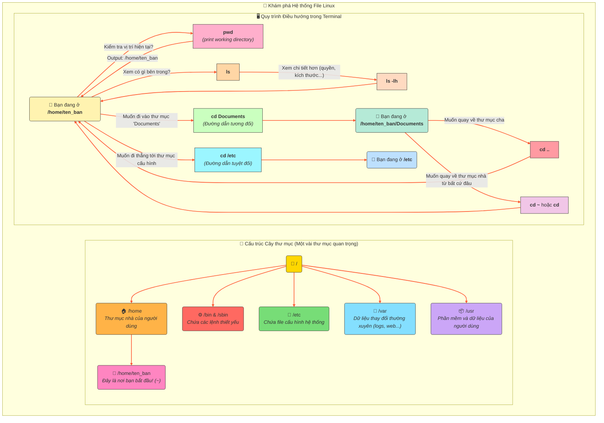

---

# **V. THAO TÁC VỚI FILE & THƯ MỤC**

Vòng đời: Tạo → Xem/Sửa → Sao chép/Di chuyển → Xóa. Cẩn thận với rm (không có thùng rác như Windows).

- **Ví dụ thực hành**: Tạo file: `touch test.txt`, sửa: `echo "Hello" > test.txt`, xem: `cat test.txt`.

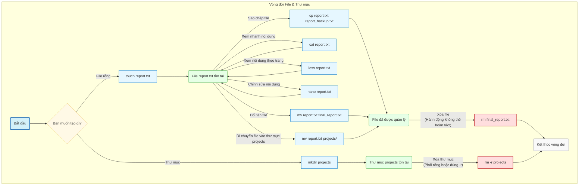

---

# **VI. NGƯỜI DÙNG VÀ QUYỀN HẠN**

Mọi thứ thuộc về user/group. Root (superuser) có quyền tối cao, dùng `sudo` để chạy lệnh với quyền root (cần password).

- **Kiểm tra quyền**: `ls -l` hiển thị rwx (read/write/execute) cho owner/group/others.

- **Thay đổi**: `chmod 755 file` (owner rwx, group/others rx). `chown user file` thay chủ sở hữu.

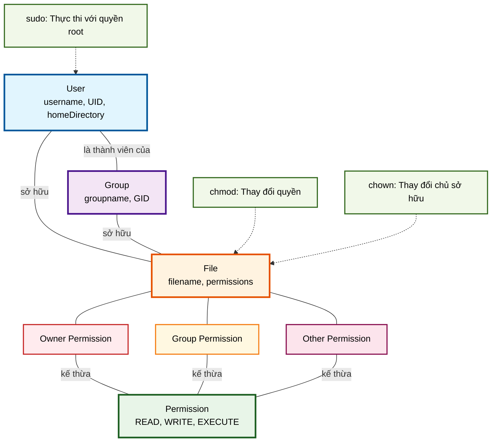

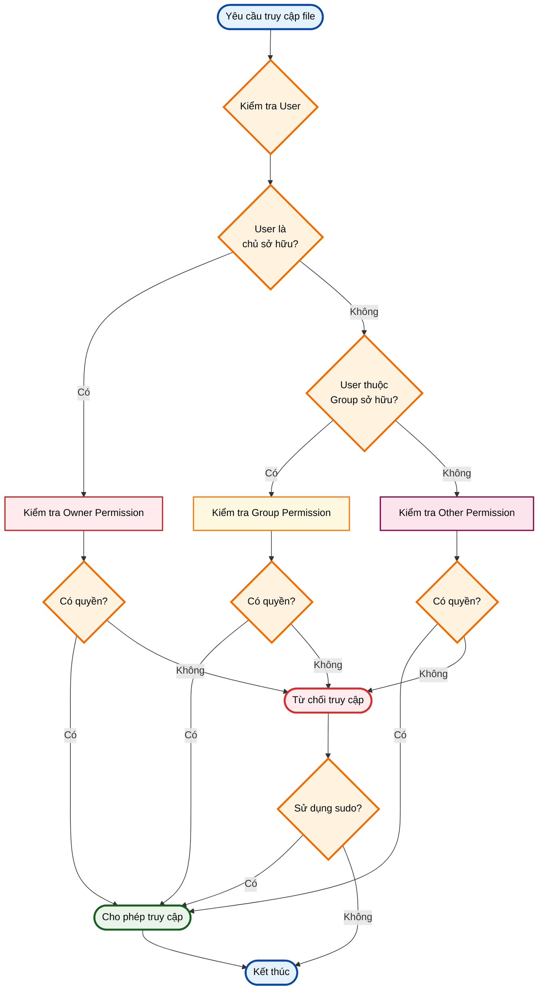

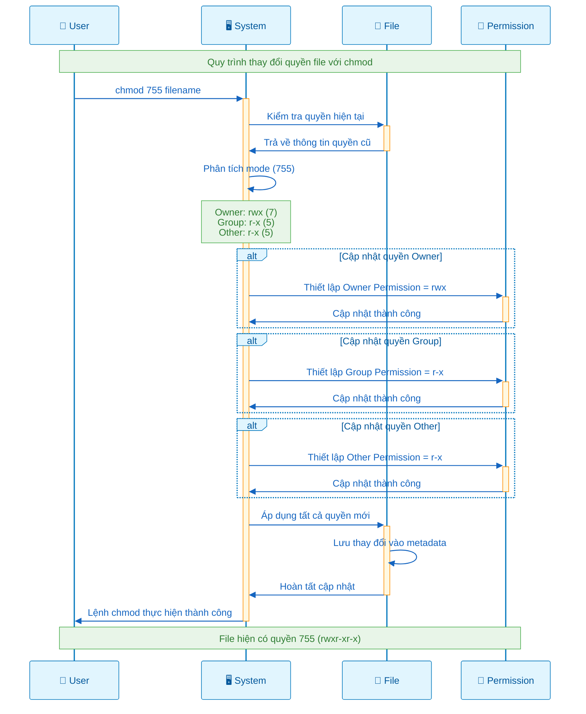

- **Tạo user mới**: `sudo adduser newuser`, thêm vào group: `sudo usermod -aG sudo newuser`.

---

# **VII. QUẢN LÝ PHẦN MỀM (PACKAGE MANAGER)**

Package manager giúp cài/gỡ phần mềm an toàn. Ubuntu dùng APT, Fedora dùng DNF.

- **Quy trình APT**: Update danh sách → Search → Install → Remove.

- **Ví dụ**: Cài Firefox: `sudo apt install firefox`.

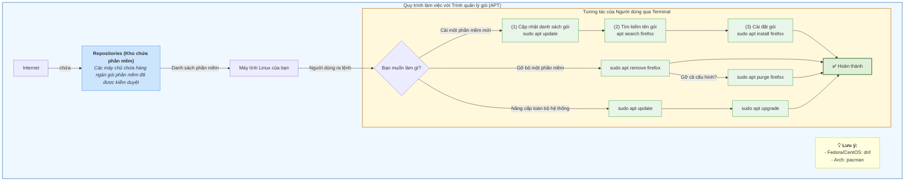

- **Thêm repo**: Chỉnh /etc/apt/sources.list, rồi update.

---

# **VIII. GIÁM SÁT VÀ ĐIỀU KHIỂN TIẾN TRÌNH**

Tiến trình là chương trình đang chạy. PID là ID duy nhất.

- **Giám sát**: `ps aux` (danh sách), `top/htop` (thời gian thực, cài htop nếu cần).

- **Dừng**: `kill PID` (lịch sự), `kill -9 PID` (buộc).

```mermaid
graph TD
    subgraph "Giám sát và Điều khiển Tiến trình"
        
        A["Hệ thống Linux đang chạy nhiều Tiến trình (Processes)"]
        
        A --> B{"Nhiệm vụ của bạn là gì?"}
        
        B -- "Giám sát hệ thống" --> C["Chọn công cụ giám sát"]
        C --> C1["<b>ps aux</b><br/><i>Xem 'ảnh chụp' tất cả tiến trình tại một thời điểm.</i>"]
        C --> C2["<b>top</b> hoặc <b>htop</b><br/><i>Xem các tiến trình và tài nguyên (CPU, RAM) theo thời gian thực.</i>"]
        
        C1 & C2 -- "Kết quả cho thấy" --> D["Danh sách các tiến trình, mỗi tiến trình có một <b>PID (Process ID)</b> duy nhất"]
        D -- "Kết quả cho thấy" --> D["Danh sách các tiến trình, mỗi tiến trình có một <b>PID (Process ID)</b> duy nhất"]
        D -- "Ví dụ: Firefox (PID: 1234) đang bị treo" --> E{"Cần phải dừng tiến trình này"}

        B -- "Điều khiển tiến trình" --> E
        
        E --> F["Sử dụng lệnh <b>kill</b> với PID đã xác định"]
        
        F --> G{Chọn phương pháp dừng}
        G -- "Gửi yêu cầu dừng lịch sự (Mặc định)<br/><i>Cho phép tiến trình dọn dẹp trước khi thoát</i>" --> H1["kill 1234 (Gửi tín hiệu SIGTERM)"]
        G -- "❗️ Buộc dừng ngay lập tức<br/><i>Khi tiến trình không phản hồi yêu cầu dừng</i>" --> H2["kill -9 1234 (Gửi tín hiệu SIGKILL)"]
        
        H1 & H2 --> I["✅ Tiến trình đã được dừng"]
        
        %% Định nghĩa màu sắc
        classDef startNode fill:#e1f5fe,stroke:#0277bd,stroke-width:2px,color:#000
        classDef monitorNode fill:#f3e5f5,stroke:#7b1fa2,stroke-width:2px,color:#000
        classDef processNode fill:#e8f5e8,stroke:#388e3c,stroke-width:2px,color:#000
        classDef killNode fill:#fff3e0,stroke:#f57c00,stroke-width:2px,color:#000
        classDef danger fill:#ffdede,stroke:#c44,stroke-width:3px,color:#000
        classDef success fill:#e8f5e8,stroke:#4caf50,stroke-width:2px,color:#000
        classDef decision fill:#fff9c4,stroke:#f9a825,stroke-width:2px,color:#000
        
        %% Áp dụng màu sắc
        class A startNode
        class B,E,G decision
        class C,C1,C2 monitorNode
        class D,F processNode
        class H1 killNode
        class H2 danger
        class I success

    end
```

- **Chạy nền**: Thêm & ở cuối lệnh, hoặc dùng `nohup`.

---

# **IX. CÔNG CỤ MẠNG CƠ BẢN**

Kiểm tra kết nối, tải file, truy cập từ xa.

- **Lệnh cơ bản**: `ip addr` (xem IP), `ping google.com` (kiểm tra kết nối), `wget url` (tải file), `curl url` (gửi request), `ssh user@ip` (đăng nhập xa).

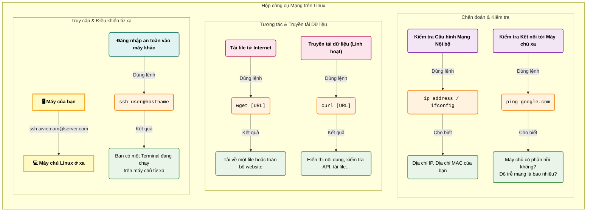

- **Cấu hình mạng**: Chỉnh /etc/network/interfaces hoặc dùng nmcli.

---

# **X. SHELL SCRIPTING VÀ TỰ ĐỘNG HÓA**

Shell script là file lệnh để tự động hóa. Bắt đầu bằng #!/bin/bash.

- **Vòng đời**: Ý tưởng → Viết → Cấp quyền (chmod +x) → Chạy.

- **Luồng dữ liệu**: > (redirect), | (pipe), grep/find để tìm kiếm.

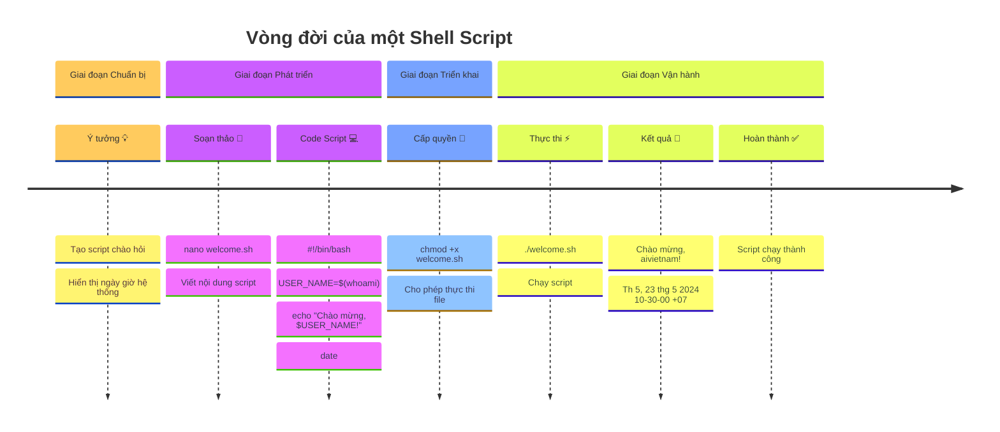

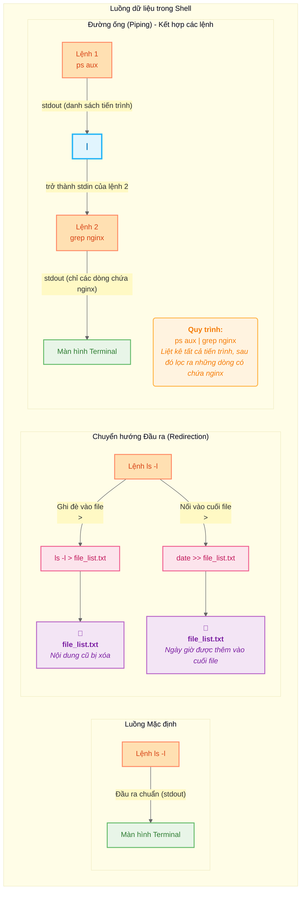

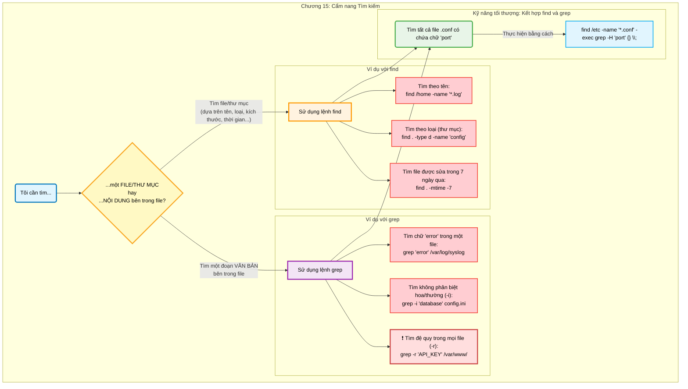

- **Ví dụ script đơn giản**: Tạo file backup.sh để sao chép file hàng ngày.

---

# **XI. QUẢN LÝ DỊCH VỤ VÀ NÂNG CAO**

Systemd quản lý dịch vụ (như web server).

- **Lệnh**: `systemctl status service`, start/stop/enable/disable.

- **Nén file**: tar cho lưu trữ, gzip/bzip2 cho nén.

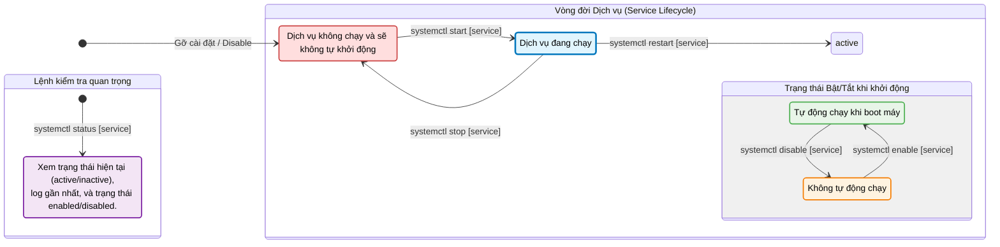

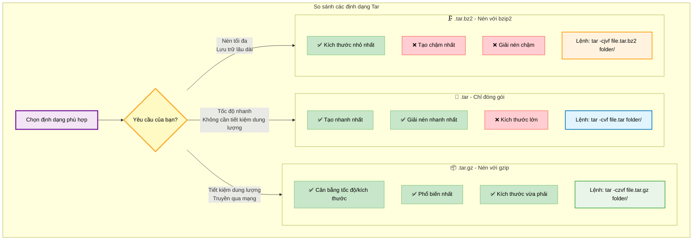

- **Giải nén**: `tar -xvf file.tar`.

---

# **XII. BẢO MẬT VÀ TROUBLESHOOTING CƠ BẢN**

- **Bảo mật**: Cập nhật thường xuyên, dùng firewall (ufw: `sudo ufw enable`), thay password mạnh, tránh chạy root thường xuyên.

- **Troubleshooting**: Xem log: `journalctl` hoặc /var/log. Lỗi phổ biến: "Permission denied" → dùng sudo. "Command not found" → cài package hoặc kiểm tra PATH.

- **Mẹo**: Sử dụng `df -h` xem dung lượng ổ, `free -h` xem RAM. Nếu hệ thống chậm, kiểm tra tiến trình bằng top.
