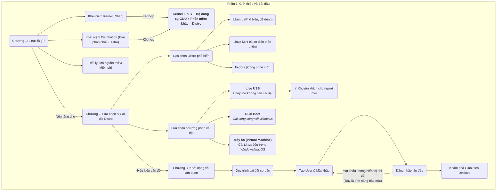
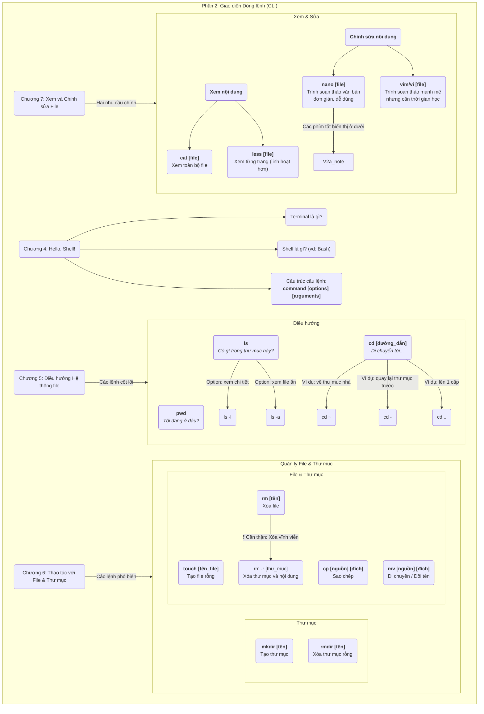
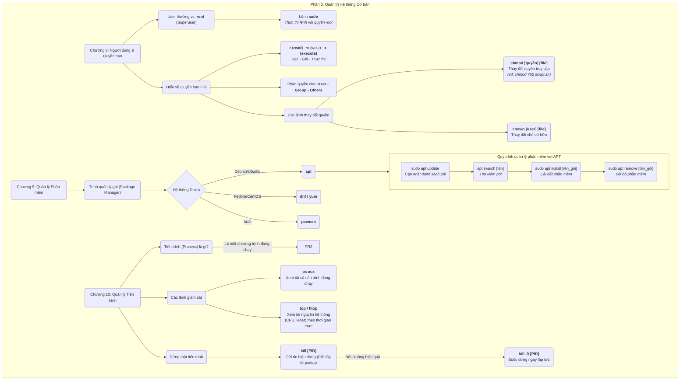
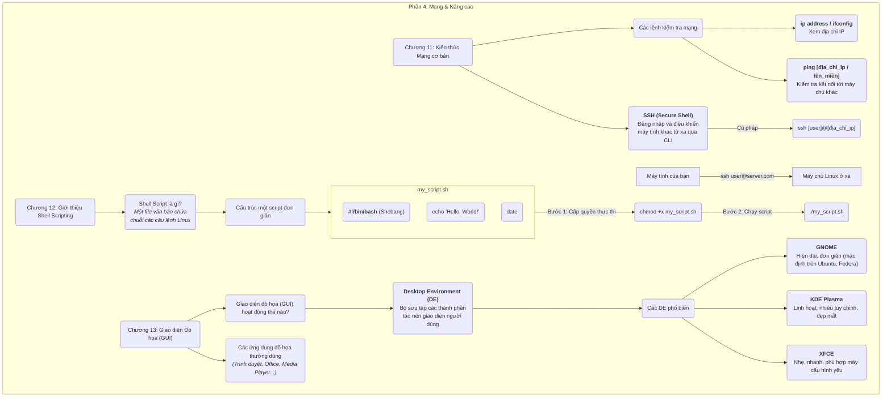

# Phần 1: Giới thiệu và Bắt đầu
**Giải thích các khái niệm nền tảng và các bước đầu tiên để tiếp cận Linux**

---

# Phần 2: Giao diện Dòng lệnh (CLI)
**Đây là phần quan trọng nhất, tập trung vào các lệnh cơ bản để tương tác với hệ thống.** 

---

# Phần 3: Quản trị Hệ thống Cơ bản
**Sơ đồ này mô tả các tác vụ quản trị thiết yếu như quản lý người dùng, phần mềm và tiến trình.** 

---
# Phần 4: Mạng và các Công cụ Nâng cao
**Giới thiệu về mạng, tự động hóa với script và giao diện đồ họa.** 
