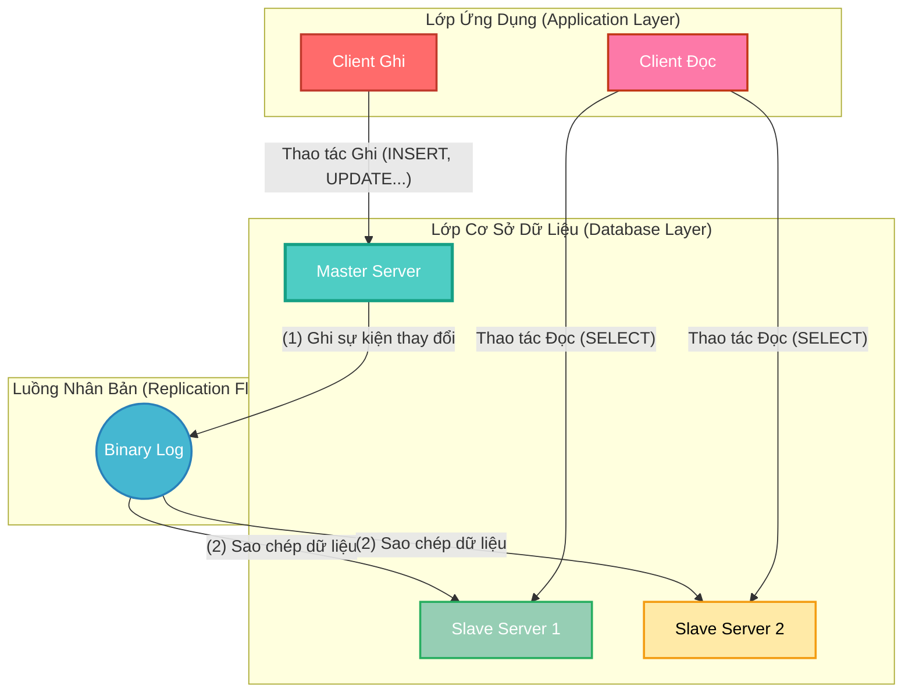
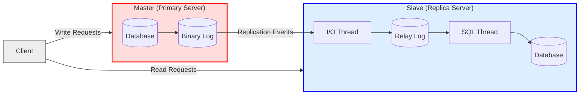
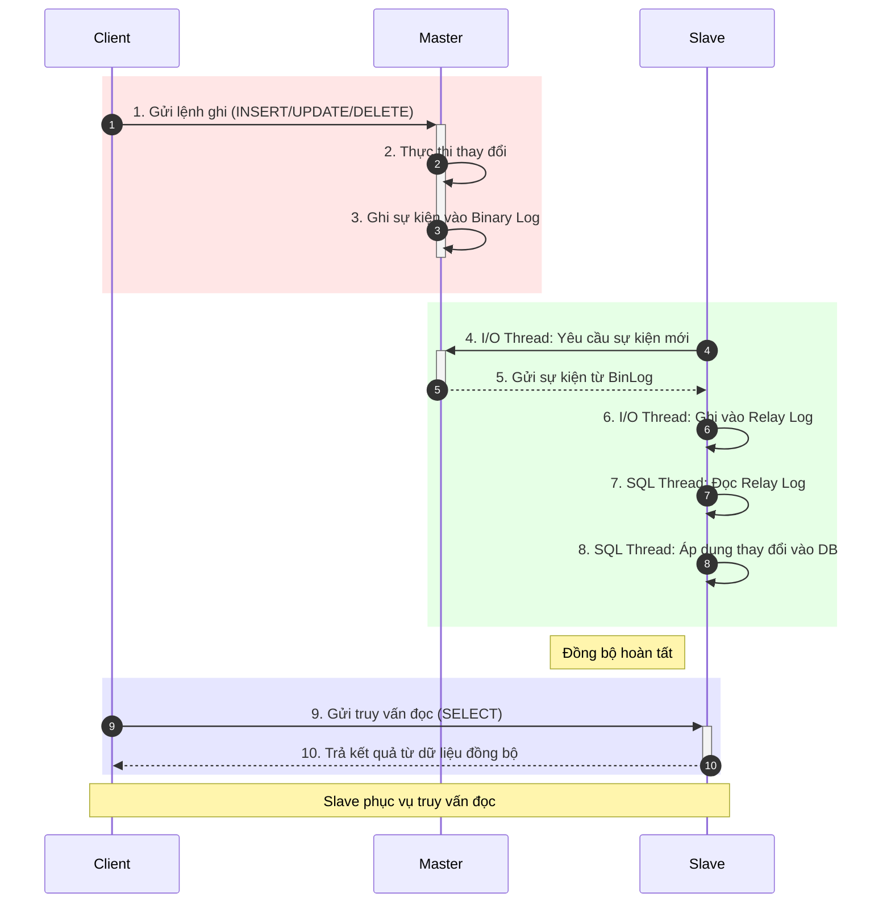
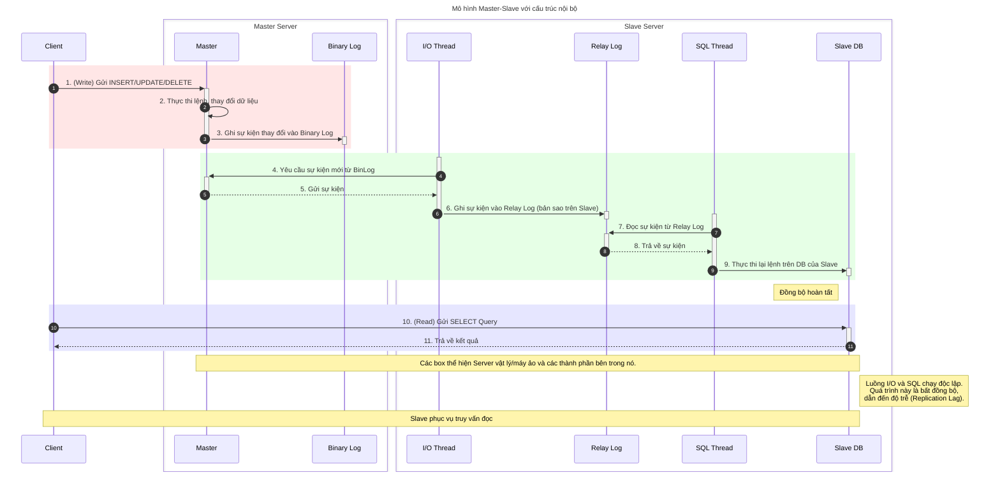
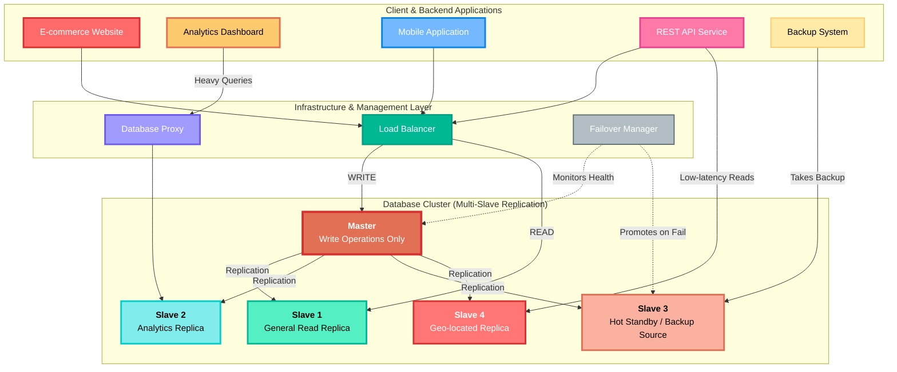
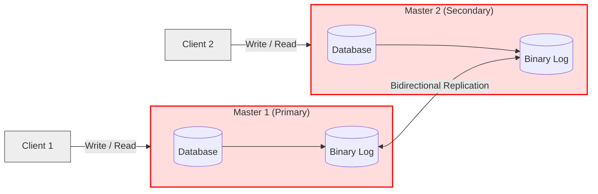
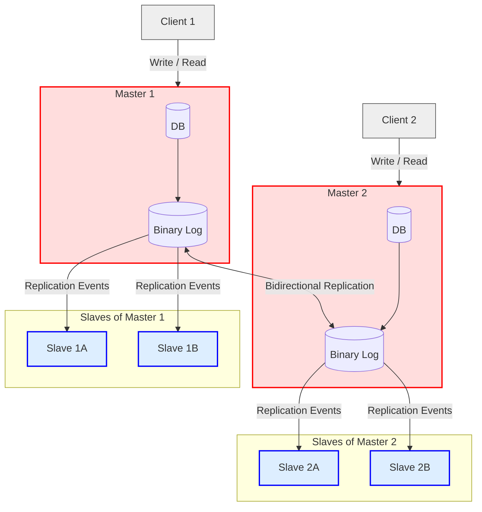

- [**I. Mô Hình Master-Slave**](#i-mô-hình-master-slave)
  - [**1. Khái Niệm Cơ Bản**](#1-khái-niệm-cơ-bản)
    - [**Sơ đồ kiến trúc tổng quan**](#sơ-đồ-kiến-trúc-tổng-quan)
  - [**2. Hiểu Sâu Cơ Chế Hoạt Động**](#2-hiểu-sâu-cơ-chế-hoạt-động)
    - [**1. Sơ đồ phân rã mức 1 - Góc nhìn Hành Vi**](#1-sơ-đồ-phân-rã-mức-1---góc-nhìn-hành-vi)
    - [**2. Sơ đồ phân rã mức 2 - Góc nhìn Cấu trúc**](#2-sơ-đồ-phân-rã-mức-2---góc-nhìn-cấu-trúc)
  - [**3. Ứng Dụng Thực Tế Và Triển Khai**](#3-ứng-dụng-thực-tế-và-triển-khai)
    - [**1. Các trường hợp sử dụng điển hình**](#1-các-trường-hợp-sử-dụng-điển-hình)
    - [**2. Sơ đồ kiến trúc triển khai thực tế**](#2-sơ-đồ-kiến-trúc-triển-khai-thực-tế)
    - [**3. Mô Tả Chi Tiết Sơ Đồ Kiến Trúc Cơ Sở Dữ Liệu Hoàn Chỉnh**](#3-mô-tả-chi-tiết-sơ-đồ-kiến-trúc-cơ-sở-dữ-liệu-hoàn-chỉnh)
  - [**4. So sánh với các mô hình khác**](#4-so-sánh-với-các-mô-hình-khác)
    - [**1. Mô hình `Master-Master`**](#1-mô-hình-master-master)
    - [**2. Mô hình `Multi-Master + Slaves`**](#2-mô-hình-multi-master--slaves)
    - [**3. Bảng so sánh các mô hình**](#3-bảng-so-sánh-các-mô-hình)

# **I. Mô Hình Master-Slave** 

Mô hình Master-Slave là một trong những **kiến trúc nhân bản (replication)** dữ liệu nền tảng và phổ biến nhất, đặc biệt trong các hệ quản trị cơ sở dữ liệu như MySQL và PostgreSQL

## **1. Khái Niệm Cơ Bản**

> **Định nghĩa:** Mô hình **Master-Slave** là một kiến trúc phân cấp, trong đó một máy chủ chính (**Master**) xử lý tất cả các hoạt động ghi dữ liệu (như `INSERT`, `UPDATE`, `DELETE`), trong khi một hoặc nhiều máy chủ phụ (**Slave**) sao chép dữ liệu từ Master và chỉ phục vụ các hoạt động đọc (`SELECT`).

Kiến trúc này được thiết kế để giải quyết hai bài toán lớn: **phân tải (load balancing)** và **tăng khả năng mở rộng (scalability)** cho các hệ thống có lượng truy vấn đọc lớn.

*   **Master (Máy chủ chính):** Là **nguồn dữ liệu gốc**. Nó chịu trách nhiệm ghi lại mọi thay đổi vào một nhật ký đặc biệt gọi là **Binary Log** và đảm bảo tính toàn vẹn dữ liệu (ACID).
*   **Slave (Máy chủ phụ):** Kết nối đến Master, sao chép các thay đổi từ Binary Log và áp dụng vào cơ sở dữ liệu của mình. Vai trò chính là phục vụ các truy vấn đọc, giúp giảm tải cho Master.

Cơ chế nhân bản mặc định là **bất đồng bộ (asynchronous replication)**, nghĩa là có một độ trễ nhỏ (replication lag) giữa thời điểm dữ liệu được ghi trên Master và thời điểm nó xuất hiện trên Slave.   

### **Sơ đồ kiến trúc tổng quan**

Để hình dung rõ hơn, sơ đồ dưới đây mô tả luồng dữ liệu một chiều trong mô hình Master-Slave, phân tách rõ các lớp ứng dụng và cơ sở dữ liệu.

**Mô tả sơ đồ:**
*   **Luồng Ghi:** Một `Client Ghi` gửi yêu cầu thay đổi dữ liệu đến `Master Server`. Master thực thi và ghi lại sự kiện này vào `Binary Log` (Bước 1).
*   **Luồng Nhân Bản:** `Binary Log` hoạt động như một dòng chảy sự kiện, được các `Slave Server` lắng nghe và sao chép về (Bước 2).
*   **Luồng Đọc:** Các `Client Đọc` gửi yêu cầu truy vấn đến các `Slave Server`, giúp giảm tải trực tiếp cho Master.

---

## **2. Hiểu Sâu Cơ Chế Hoạt Động**

Cơ chế hoạt động của Master-Slave replication dựa trên ba tiến trình chính, phối hợp nhịp nhàng với nhau:

1.  **Trên Master:** Khi có một thay đổi dữ liệu (ví dụ, một câu lệnh `UPDATE`), Master sẽ thực thi và ghi lại sự kiện thay đổi đó vào **Binary Log**.
2.  **Trên Slave (I/O Thread):** Một luồng đặc biệt tên là **I/O Thread** trên mỗi Slave sẽ kết nối tới Master, yêu cầu các sự kiện từ Binary Log mà nó chưa có, và ghi chúng vào một file nhật ký cục bộ gọi là **Relay Log**.
3.  **Trên Slave (SQL Thread):** Một luồng khác là **SQL Thread** sẽ đọc các sự kiện từ Relay Log và thực thi chúng tuần tự trên cơ sở dữ liệu của Slave, hoàn tất quá trình đồng bộ.

Dữ liệu chỉ chảy một chiều từ Master sang Slave. Việc đồng bộ được quản lý thông qua **vị trí log (log position)** hoặc **GTID (Global Transaction ID)** để Slave biết chính xác cần bắt đầu sao chép từ đâu, ngay cả khi mất kết nối.

* **Master:**

  * DB xử lý ghi → ghi vào Binary Log
* **Slave:**

  * I/O Thread đọc Binary Log từ Master → Relay Log
  * SQL Thread đọc Relay Log → cập nhật Database Slave
* **Client:**

  * Ghi đi Master, đọc đi Slave

| Thành phần          | Master (Máy chủ chính)                             | Slave (Máy chủ phụ)                                       |
| ------------------- | -------------------------------------------------- | --------------------------------------------------------- |
| **Chức năng chính** | Xử lý **ghi dữ liệu** (INSERT/UPDATE/DELETE)       | Xử lý **đọc dữ liệu** (SELECT), đồng bộ dữ liệu từ Master |
| **Ghi Binary Log**  | Có – ghi mọi thay đổi vào Binary Log               | Không ghi Binary Log từ Master                            |
| **Threads sử dụng** | Không cần (xử lý trực tiếp)                        | I/O Thread (nhận sự kiện) + SQL Thread (áp dụng dữ liệu)  |
| **Relay Log**       | Không dùng                                         | Có – lưu tạm sự kiện từ Master                            |
| **Mục tiêu**        | Là nguồn dữ liệu gốc, đảm bảo tính toàn vẹn (ACID) | Giảm tải đọc cho Master, hỗ trợ đọc/backup/reporting      |
| **Đồng bộ**         | Gửi sự kiện qua Binary Log                         | Nhận sự kiện và tái thực thi trên DB   

### **1. Sơ đồ phân rã mức 1 - Góc nhìn Hành Vi**

**Mô tả sơ đồ:**
> Sơ đồ này mô tả luồng hoạt động tổng thể của mô hình Master-Slave, tập trung vào **thứ tự tương tác** giữa các máy chủ mà không đi sâu vào chi tiết kỹ thuật bên trong.

*   **Luồng Ghi Dữ liệu (Bước 1-3):**
    *   `Client` gửi một lệnh ghi (INSERT/UPDATE/DELETE) tới `Master`.
    *   `Master` thực thi lệnh và ghi lại nhật ký về sự thay đổi này vào Binary Log.

*   **Luồng Đồng bộ hóa (Bước 4-8):**
    *   `Slave` chủ động kết nối đến `Master` để yêu cầu và nhận các bản ghi thay đổi mới (Bước 4-5).
    *   Sau khi nhận về, `Slave` thực hiện quy trình xử lý nội bộ (được chú thích là các luồng I/O và SQL) để ghi vào bộ đệm trung gian (Relay Log) và cuối cùng là áp dụng các thay đổi vào cơ sở dữ liệu của mình (Bước 6-8).

*   **Luồng Đọc Dữ liệu (Bước 9-10):**
    *   `Client` gửi các truy vấn đọc (SELECT) đến `Slave`.
    *   `Slave` trả về kết quả, giúp giảm tải cho `Master`.

### **2. Sơ đồ phân rã mức 2 - Góc nhìn Cấu trúc**

**Mô tả sơ đồ:**
> Sơ đồ này phân rã chi tiết kiến trúc bên trong của hai máy chủ, làm rõ **vai trò của từng thành phần cụ thể** (`I/O Thread`, `Relay Log`, `SQL Thread`) và cách chúng phối hợp với nhau.

*   **Giai đoạn 1: Ghi dữ liệu trên Master Server (Bước 1-3)**
    *   **Bước 1-2:** `Client` gửi lệnh ghi đến `Master`. `Master` thực thi lệnh trên cơ sở dữ liệu của nó.
    *   **Bước 3:** Sau khi thực thi thành công, `Master` ghi một bản ghi về sự kiện này vào thành phần `Binary Log`.

*   **Giai đoạn 2 & 3: Sao chép và Áp dụng trên Slave Server (Bước 4-9)**
    *   **Bước 4-5:** Luồng `I/O Thread` của Slave kết nối đến `Master` và yêu cầu các sự kiện mới từ `Binary Log`.
    *   **Bước 6:** `I/O Thread` nhận các sự kiện và ghi chúng vào một file nhật ký trung gian trên Slave gọi là `Relay Log`. Nhiệm vụ của I/O Thread cho sự kiện này kết thúc.
    *   **Bước 7-9:** Luồng `SQL Thread` (chạy độc lập với I/O Thread) đọc các sự kiện từ `Relay Log` và thực thi lại các lệnh này trên `Slave DB`, hoàn tất quá trình cập nhật dữ liệu.

*   **Giai đoạn 4: Phục vụ truy vấn đọc (Bước 10-11)**
    *   `Client` gửi các truy vấn đọc trực tiếp đến `Slave DB`.
    *   `Slave DB` xử lý và trả về kết quả.

---

## **3. Ứng Dụng Thực Tế Và Triển Khai**

### **1. Các trường hợp sử dụng điển hình**

*   **Hệ thống E-commerce:** Lượng người dùng xem sản phẩm (đọc) luôn lớn hơn rất nhiều so với việc đặt hàng (ghi).
*   **Hệ thống báo cáo (Analytics/Reporting):** Các truy vấn phân tích phức tạp, tốn nhiều tài nguyên có thể được chạy trên Slave để không ảnh hưởng đến hoạt động chính trên Master.
*   **Cụm sao lưu (Backup Cluster):** Sử dụng Slave làm bản sao dữ liệu tại một trung tâm dữ liệu khác (geo-replication) để phòng chống thảm họa.

### **2. Sơ đồ kiến trúc triển khai thực tế**

Sơ đồ này mô tả một kiến trúc sản xuất hoàn chỉnh, từ lớp ứng dụng, bộ cân bằng tải cho đến lớp cơ sở dữ liệu với các Slave phục vụ cho những mục đích khác nhau.

### **3. Mô Tả Chi Tiết Sơ Đồ Kiến Trúc Cơ Sở Dữ Liệu Hoàn Chỉnh**

Sơ đồ này mô tả một kiến trúc cơ sở dữ liệu phân tán, có tính sẵn sàng cao và được tối ưu hóa cho nhiều loại tác vụ khác nhau, dựa trên mô hình Master-Slave với nhiều bản sao (Multi-Slave Replication).

**1. Luồng Truy Cập Chính**

*   Các ứng dụng phục vụ người dùng cuối như **`E-commerce Website`**, **`Mobile Application`**, và **`REST API Service`** sẽ gửi yêu cầu đến **`Load Balancer`**.
*   **`Load Balancer`** đóng vai trò là "cảnh sát giao thông", thực hiện phân tách yêu cầu đọc/ghi (Read/Write Splitting):
    *   Tất cả các yêu cầu **ghi (WRITE)** dữ liệu được định tuyến đến duy nhất **`Master`**. Đây là nguồn dữ liệu chính và duy nhất (Single Source of Truth).
    *   Các yêu cầu **đọc (READ)** thông thường được phân phối đến **`Slave 1`**, giúp giảm tải cho Master và tăng tốc độ phản hồi cho người dùng.

**2. Các Luồng Truy Cập Chuyên Dụng**

*   **Phân tích Dữ liệu (`Analytics`):**
    *   **`Analytics Dashboard`** gửi các truy vấn phức tạp, tiêu tốn nhiều tài nguyên qua một **`Database Proxy`**.
    *   Proxy này sẽ quản lý và định tuyến các truy vấn nặng đó đến **`Slave 2`**. Mục đích là để **phân tách workload (workload isolation)**, đảm bảo các báo cáo phức tạp không làm ảnh hưởng đến hiệu năng của hệ thống chính.

*   **Tối ưu theo Vị trí Địa lý (`Geo-location`):**
    *   **`Slave 4`** là một bản sao được đặt ở một trung tâm dữ liệu khác, gần với người dùng ở một khu vực địa lý cụ thể.
    *   **`API Service`** có thể định tuyến các yêu cầu đọc từ khu vực đó đến `Slave 4` để cung cấp **phản hồi với độ trễ thấp (low-latency reads)**.

**3. Cơ Chế Đảm Bảo Hoạt Động Liên Tục**

*   **Tự động Chuyển đổi Dự phòng (`Failover`):**
    *   **`Failover Manager`** là một thành phần giám sát, liên tục kiểm tra "sức khỏe" của `Master`.
    *   Nếu `Master` gặp sự cố, `Failover Manager` sẽ tự động kích hoạt quy trình "đôn" **`Slave 3`** lên làm `Master` mới, giúp giảm thiểu thời gian chết của hệ thống.

*   **Sao lưu (`Backup`):**
    *   **`Slave 3`** đồng thời đóng vai trò là một **máy chủ dự phòng nóng (Hot Standby)** và là nguồn để sao lưu.
    *   **`Backup System`** sẽ thực hiện các tác vụ sao lưu dữ liệu định kỳ trên `Slave 3` mà không làm ảnh hưởng đến hiệu suất của các máy chủ khác trong cụm.

**4. Luồng Dữ Liệu Nền Tảng**

*   Toàn bộ kiến trúc này hoạt động được là nhờ vào cơ chế sao chép (Replication). **`Master`** liên tục ghi lại mọi thay đổi vào Binary Log và đẩy luồng dữ liệu này (Replication Stream) đến **tất cả các Slave** (`Slave 1, 2, 3, 4`) để đảm bảo chúng luôn được cập nhật gần nhất với dữ liệu gốc.

---
## **4. So sánh với các mô hình khác**

### **1. Mô hình `Master-Master`**

**Mô tả:**

> * **Cấu hình:** Hai Master đều đóng vai trò **ghi và đọc** dữ liệu.
> * **Replication:** Cả hai Master đồng bộ dữ liệu cho nhau **2 chiều** qua Binary Log.
> * **Client:** Có thể ghi vào bất kỳ Master nào.

**Ưu điểm:**

> * Cho phép ghi dữ liệu phân tán (multi-write).
> * Tăng khả năng chịu lỗi: nếu 1 Master chết, Master còn lại vẫn ghi/đọc bình thường.

**Nhược điểm:**

> * Nguy cơ **conflict dữ liệu** khi cả 2 Master ghi cùng lúc vào cùng 1 bản ghi.
> * Cấu hình phức tạp hơn nhiều so với Master-Slave.

### **2. Mô hình `Multi-Master + Slaves`**

**Mô tả**

> * **Master-Master:** Hai Master đồng bộ dữ liệu 2 chiều → cho phép ghi ở cả hai node.
> * **Slave:** Mỗi Master có nhiều Slave riêng để scale đọc và backup.
> * **Client:**
>     * Client 1 ghi/đọc từ Master 1 hoặc Slave 1A/B.
>     * Client 2 ghi/đọc từ Master 2 hoặc Slave 2A/B.

* **Replication:**

>   * Giữa 2 Master: replication 2 chiều.
>   * Giữa mỗi Master và Slave: replication 1 chiều.

**Ưu điểm:**

> * Chịu lỗi cao (HA), ghi được ở nhiều vùng (multi-region).
> * Scale đọc cực lớn nhờ nhiều Slave.
> * Nếu 1 Master chết, hệ thống vẫn chạy bình thường.

**Nhược điểm:**

> * Khó quản lý conflict khi ghi đồng thời trên 2 Master.
> * Độ trễ đồng bộ giữa 2 Master có thể ảnh hưởng dữ liệu.

### **3. Bảng so sánh các mô hình**

| Tiêu chí | **Master - Slave** | **Master-Master** | **Multi-Master + Slaves** |
| :--- | :--- | :--- | :--- |
| **Số Master** | 1 | 2 (hoặc nhiều hơn, gọi là Multi-Master) | **M** (với M ≥ 2) |
| **Số Slave** | **N** (với N ≥ 1) | 0 (Trong mô hình thuần túy) | **M x N** (Mỗi Master có N Slaves) |
| **Khả năng ghi** | **Chỉ ghi tại 1 Master duy nhất** | **Ghi được ở tất cả các Master** | **Ghi được ở tất cả các Master** |
| **Khả năng đọc** | Đọc từ N Slaves | Đọc từ tất cả các Master | Đọc từ tất cả Slave và cả Master |
| **Khả năng chịu tải đọc** | **Cao** (Có thể thêm Slave để scale) | **Trung bình** (Bị giới hạn bởi số Master) | **Rất cao / Cực cao** (Scale gần như vô hạn) |
| **Khả năng chịu lỗi** | **Thấp đến Trung bình** (Master chết → dừng ghi, cần Failover) | **Cao** (1 Master chết, Master còn lại nhận toàn bộ traffic) | **Rất cao** (Vừa HA ở lớp Master, vừa dự phòng ở lớp Slave) |
| **Độ phức tạp** | Thấp đến Trung bình | Cao | **Cực kỳ cao** |
| **Đồng bộ dữ liệu** | **1 chiều** (Master → Slaves) | **2 chiều** (Master A ↔ Master B) | **2 chiều** (giữa các Master) và **1 chiều** (từ Master xuống Slave) |
| **Rủi ro xung đột dữ liệu**| **Hầu như không có** | **CAO** (Cần giải quyết xung đột khi ghi trùng lặp) | **CAO** (Vấn đề tương tự Master-Master) |
| **Use case phổ biến** | Ứng dụng đọc nhiều (báo chí, e-commerce), hệ thống cần backup/phân tích trên bản sao. | Hệ thống yêu cầu High Availability (HA) cho cả ghi và đọc, phân tải ở 2 trung tâm dữ liệu (Active-Active). | Hệ thống quy mô toàn cầu (global scale), đa khu vực, yêu cầu HA tuyệt đối và khả năng scale đọc/ghi cực lớn. |

**Đánh giá**

1.  **Sự Đánh Đổi Cốt Lõi:** Khi tăng **khả năng ghi** (từ 1 Master lên nhiều Master) và **khả năng chịu lỗi**, thì **độ phức tạp** và **rủi ro xung đột dữ liệu** cũng tăng vọt.
2.  **Lựa chọn theo nhu cầu:**
    *   Nếu ưu tiên là **mở rộng khả năng đọc** và giữ cho hệ thống đơn giản, **Multi-Slave** là lựa chọn số một.
    *   Nếu ưu tiên là **hệ thống không bao giờ được phép dừng ghi** (High Availability for Writes) thì phải chấp nhận độ phức tạp và rủi ro của **Master-Master**.
    *   Chỉ khi một hệ thống cực lớn với yêu cầu về cả hai mặt (HA cho ghi và scale đọc khổng lồ) thì mới nên cân nhắc kiến trúc **Multi-Master + Slaves** và chuẩn bị một đội ngũ kỹ sư vận hành đủ mạnh để quản lý nó.