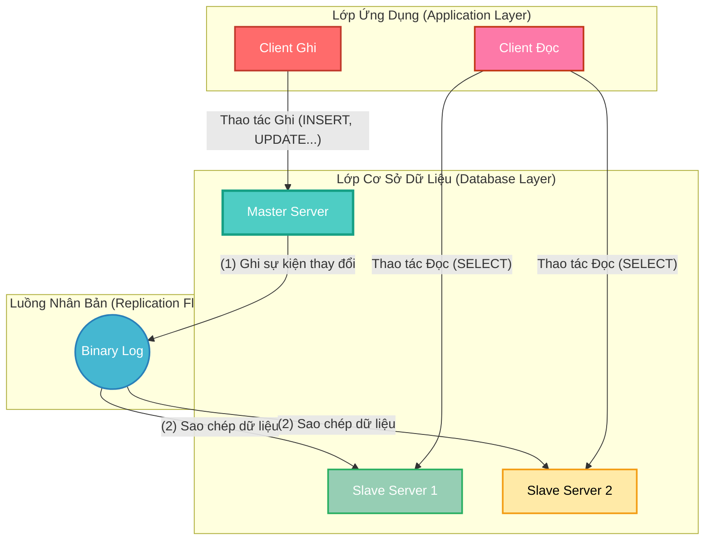
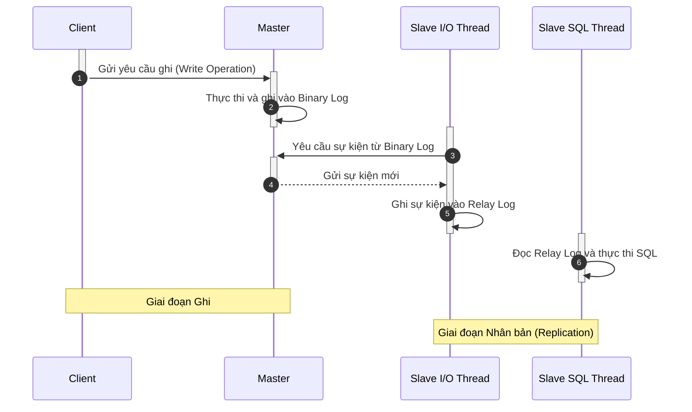
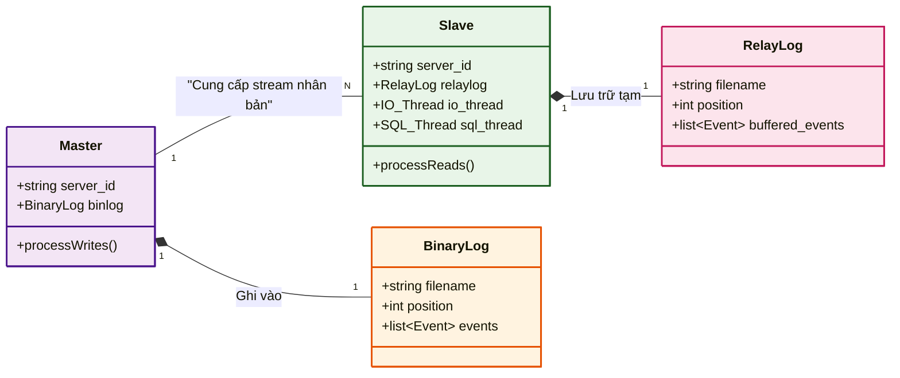
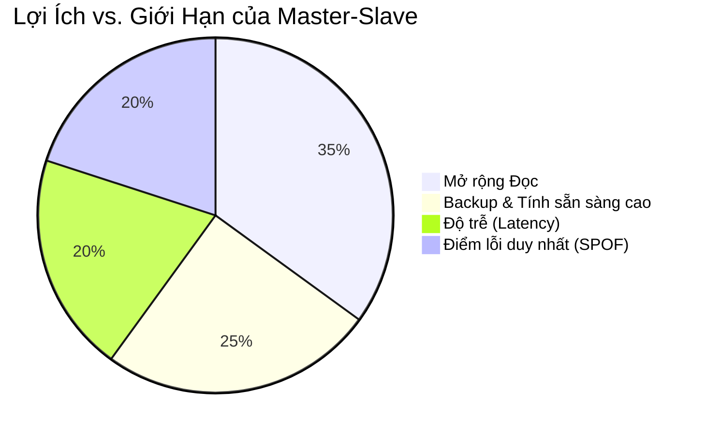
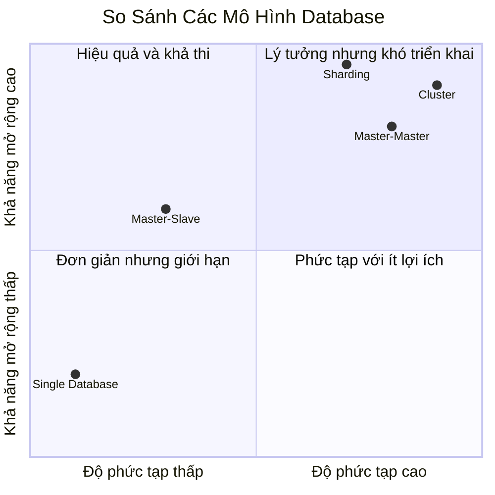
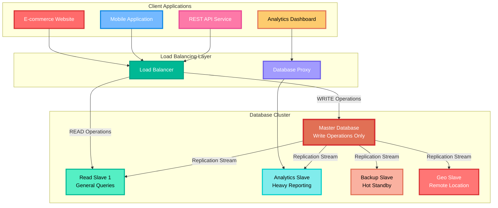
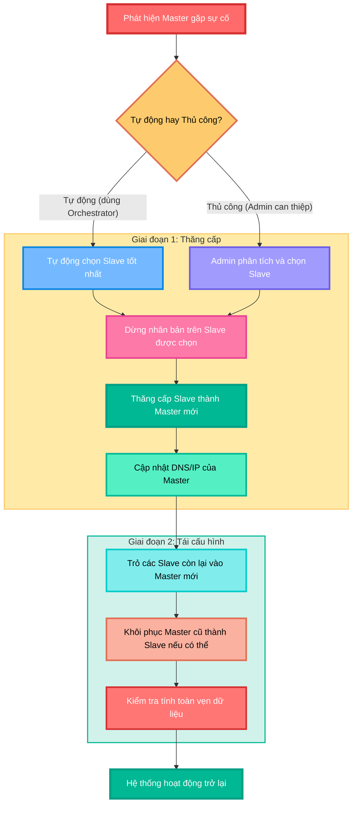

- [**Mô Hình Master-Slave Trong Cơ Sở Dữ Liệu**](#mô-hình-master-slave-trong-cơ-sở-dữ-liệu)
  - [**1. Khái Niệm Cơ Bản**](#1-khái-niệm-cơ-bản)
    - [**Sơ đồ kiến trúc tổng quan**](#sơ-đồ-kiến-trúc-tổng-quan)
  - [**2. Hiểu Sâu Cơ Chế Hoạt Động**](#2-hiểu-sâu-cơ-chế-hoạt-động)
    - [**Sơ đồ tuần tự các bước Replication**](#sơ-đồ-tuần-tự-các-bước-replication)
    - [**Sơ đồ chu trình trạng thái của dữ liệu**](#sơ-đồ-chu-trình-trạng-thái-của-dữ-liệu)
  - [**3. Phân Tích Các Thành Phần Cốt Lõi**](#3-phân-tích-các-thành-phần-cốt-lõi)
    - [**Sơ đồ quan hệ giữa các thành phần**](#sơ-đồ-quan-hệ-giữa-các-thành-phần)
  - [**4. Đánh Giá Lợi Ích Và Giới Hạn**](#4-đánh-giá-lợi-ích-và-giới-hạn)
    - [**Ưu điểm**](#ưu-điểm)
    - [**Nhược điểm**](#nhược-điểm)
    - [**Biểu đồ so sánh**](#biểu-đồ-so-sánh)
  - [**5. Ứng Dụng Thực Tế Và Triển Khai**](#5-ứng-dụng-thực-tế-và-triển-khai)
    - [**Các trường hợp sử dụng điển hình**](#các-trường-hợp-sử-dụng-điển-hình)
    - [**Sơ đồ kiến trúc triển khai thực tế**](#sơ-đồ-kiến-trúc-triển-khai-thực-tế)
    - [**Quy trình xử lý sự cố (Failover)**](#quy-trình-xử-lý-sự-cố-failover)
  - [**Kết Luận**](#kết-luận)

# **Mô Hình Master-Slave Trong Cơ Sở Dữ Liệu**

Mô hình Master-Slave là một trong những kiến trúc nhân bản (replication) dữ liệu nền tảng và phổ biến nhất, đặc biệt trong các hệ quản trị cơ sở dữ liệu như MySQL và PostgreSQL

## **1. Khái Niệm Cơ Bản**

> **Định nghĩa:** Mô hình **Master-Slave** là một kiến trúc phân cấp, trong đó một máy chủ chính (**Master**) xử lý tất cả các hoạt động ghi dữ liệu (như `INSERT`, `UPDATE`, `DELETE`), trong khi một hoặc nhiều máy chủ phụ (**Slave**) sao chép dữ liệu từ Master và chỉ phục vụ các hoạt động đọc (`SELECT`).

Kiến trúc này được thiết kế để giải quyết hai bài toán lớn: **phân tải (load balancing)** và **tăng khả năng mở rộng (scalability)** cho các hệ thống có lượng truy vấn đọc lớn.

*   **Master (Máy chủ chính):** Là nguồn chân lý duy nhất (single source of truth). Nó chịu trách nhiệm ghi lại mọi thay đổi vào một nhật ký đặc biệt gọi là **Binary Log** và đảm bảo tính toàn vẹn dữ liệu (ACID).
*   **Slave (Máy chủ phụ):** Kết nối đến Master, sao chép các thay đổi từ Binary Log và áp dụng vào cơ sở dữ liệu của mình. Vai trò chính là phục vụ các truy vấn đọc, giúp giảm tải cho Master.

Cơ chế nhân bản mặc định là **bất đồng bộ (asynchronous replication)**, nghĩa là có một độ trễ nhỏ (replication lag) giữa thời điểm dữ liệu được ghi trên Master và thời điểm nó xuất hiện trên Slave.

### **Sơ đồ kiến trúc tổng quan**

Để hình dung rõ hơn, sơ đồ dưới đây mô tả luồng dữ liệu một chiều trong mô hình Master-Slave, phân tách rõ các lớp ứng dụng và cơ sở dữ liệu.

**Mô tả sơ đồ:**
*   **Luồng Ghi:** Một `Client Ghi` gửi yêu cầu thay đổi dữ liệu đến `Master Server`. Master thực thi và ghi lại sự kiện này vào `Binary Log` (Bước 1).
*   **Luồng Nhân Bản:** `Binary Log` hoạt động như một dòng chảy sự kiện, được các `Slave Server` lắng nghe và sao chép về (Bước 2).
*   **Luồng Đọc:** Các `Client Đọc` gửi yêu cầu truy vấn đến các `Slave Server`, giúp giảm tải trực tiếp cho Master.

## **2. Hiểu Sâu Cơ Chế Hoạt Động**

Cơ chế hoạt động của Master-Slave replication dựa trên ba tiến trình chính, phối hợp nhịp nhàng với nhau:

1.  **Trên Master:** Khi có một thay đổi dữ liệu (ví dụ, một câu lệnh `UPDATE`), Master sẽ thực thi và ghi lại sự kiện thay đổi đó vào **Binary Log**.
2.  **Trên Slave (I/O Thread):** Một luồng đặc biệt tên là **I/O Thread** trên mỗi Slave sẽ kết nối tới Master, yêu cầu các sự kiện từ Binary Log mà nó chưa có, và ghi chúng vào một file nhật ký cục bộ gọi là **Relay Log**.
3.  **Trên Slave (SQL Thread):** Một luồng khác là **SQL Thread** sẽ đọc các sự kiện từ Relay Log và thực thi chúng tuần tự trên cơ sở dữ liệu của Slave, hoàn tất quá trình đồng bộ.

Dữ liệu chỉ chảy một chiều từ Master sang Slave. Việc đồng bộ được quản lý thông qua **vị trí log (log position)** hoặc **GTID (Global Transaction ID)** để Slave biết chính xác cần bắt đầu sao chép từ đâu, ngay cả khi mất kết nối.

### **Sơ đồ tuần tự các bước Replication**

Sơ đồ `sequenceDiagram` dưới đây phân tích chi tiết trình tự tương tác giữa các thành phần khi một thao tác ghi xảy ra.

**Mô tả sơ đồ:**
*   **Bước 1-2:** `Client` gửi yêu cầu ghi đến `Master`. `Master` xử lý yêu cầu và ghi lại sự kiện vào `Binary Log` của nó.
*   **Bước 3-4:** `Slave I/O Thread` trên máy chủ Slave kết nối và yêu cầu các sự kiện mới từ `Binary Log` của Master. `Master` trả về các sự kiện này.
*   **Bước 5:** `Slave I/O Thread` nhận sự kiện và ghi chúng vào một file đệm cục bộ là `Relay Log`.
*   **Bước 6:** `Slave SQL Thread` đọc các sự kiện từ `Relay Log` và thực thi chúng trên cơ sở dữ liệu của Slave, hoàn tất quá trình đồng bộ.

### **Sơ đồ chu trình trạng thái của dữ liệu**

Sơ đồ `stateDiagram` mô tả vòng đời của một thay đổi dữ liệu, từ lúc được yêu cầu cho đến khi sẵn sàng để đọc trên Slave, đi qua ba giai đoạn chính.

```mermaid
stateDiagram-v2
    direction LR
    
    [*] --> Write_Request: Client gửi yêu cầu ghi
    Write_Request --> Master_Processing: Master xử lý
    Master_Processing --> Logged_in_Master: Ghi vào Binary Log
    Logged_in_Master --> Copied_to_Slave: Slave I/O Thread sao chép
    Copied_to_Slave --> Applied_on_Slave: Slave SQL Thread áp dụng
    Applied_on_Slave --> Ready_for_Read: Sẵn sàng cho Client đọc
    Ready_for_Read --> [*]

    state "Giai đoạn 1: Ghi và Ghi Log" as P1 {
        Write_Request
        Master_Processing
        Logged_in_Master
    }
    
    state "Giai đoạn 2: Nhân bản" as P2 {
        Copied_to_Slave
        Applied_on_Slave
    }

    state "Giai đoạn 3: Sẵn sàng Đọc" as P3 {
        Ready_for_Read
    }

    %% Styling với nhiều màu sắc
    classDef writePhase fill:#ff6b6b,stroke:#d63031,stroke-width:3px,color:white
    classDef processPhase fill:#74b9ff,stroke:#0984e3,stroke-width:3px,color:white
    classDef logPhase fill:#fd79a8,stroke:#e84393,stroke-width:3px,color:white
    classDef copyPhase fill:#fdcb6e,stroke:#e17055,stroke-width:3px,color:black
    classDef applyPhase fill:#00b894,stroke:#00a085,stroke-width:3px,color:white
    classDef readPhase fill:#a29bfe,stroke:#6c5ce7,stroke-width:3px,color:white
    
    class Write_Request writePhase
    class Master_Processing processPhase
    class Logged_in_Master logPhase
    class Copied_to_Slave copyPhase
    class Applied_on_Slave applyPhase
    class Ready_for_Read readPhase
```

**Mô tả sơ đồ:**
*   **Giai đoạn 1:** Bắt đầu với `Write_Request`, dữ liệu đi qua trạng thái `Master_Processing` và kết thúc khi được ghi vào nhật ký (`Logged_in_Master`).
*   **Giai đoạn 2:** Dữ liệu được nhân bản, chuyển từ trạng thái `Copied_to_Slave` (đã nằm trong Relay Log) sang `Applied_on_Slave` (đã được thực thi trên DB của Slave).
*   **Giai đoạn 3:** Dữ liệu ở trạng thái `Ready_for_Read`, sẵn sàng phục vụ các truy vấn đọc từ client, hoàn thành vòng đời.

## **3. Phân Tích Các Thành Phần Cốt Lõi**

*   **Binary Log (trên Master):** Nhật ký nhị phân lưu trữ tất cả các sự kiện làm thay đổi cấu trúc hoặc dữ liệu của database. Đây là "trái tim" của quá trình replication.
*   **I/O Thread (trên Slave):** Chịu trách nhiệm kết nối đến Master, đọc Binary Log và sao chép vào Relay Log.
*   **Relay Log (trên Slave):** File đệm chứa bản sao của các sự kiện từ Binary Log. Việc sử dụng Relay Log giúp Slave có thể tiếp tục quá trình áp dụng thay đổi ngay cả khi kết nối đến Master bị gián đoạn.
*   **SQL Thread (trên Slave):** Đọc các sự kiện từ Relay Log và thực thi chúng để cập nhật dữ liệu trên Slave.

### **Sơ đồ quan hệ giữa các thành phần**

Sơ đồ `classDiagram` dưới đây thể hiện mối quan hệ tĩnh và các thuộc tính chính của từng thành phần, cho thấy cách chúng liên kết với nhau.

**Mô tả sơ đồ:**
*   Đối tượng `Master` sở hữu một đối tượng `BinaryLog`. Mối quan hệ là "một-một" và Master chịu trách nhiệm "Ghi vào" nó.
*   Đối tượng `Slave` sở hữu các thành phần `RelayLog`, `IO_Thread`, và `SQL_Thread`.
*   Quan hệ quan trọng nhất là một `Master` có thể cung cấp stream nhân bản cho nhiều (`N`) `Slave`.

## **4. Đánh Giá Lợi Ích Và Giới Hạn**

### **Ưu điểm**

*   **Khả năng mở rộng cho việc đọc (Read Scalability):** Dễ dàng thêm các Slave mới để phục vụ lượng truy vấn đọc ngày càng tăng. Cực kỳ lý tưởng cho các ứng dụng có tỷ lệ đọc/ghi cao.
*   **Sao lưu và Phục hồi (Backup & Recovery):** Slave có thể được dùng để thực hiện sao lưu nóng (hot backup) mà không làm ảnh hưởng đến hiệu năng của Master.
*   **Tính sẵn sàng cao (High Availability):** Hỗ trợ cơ chế chuyển đổi dự phòng (failover). Nếu Master gặp sự cố, một Slave có thể được "thăng cấp" thành Master mới, giảm thiểu thời gian chết.

### **Nhược điểm**

*   **Độ trễ nhân bản (Replication Latency):** Do tính chất bất đồng bộ, dữ liệu trên Slave có thể bị "lag" so với Master. Điều này có thể dẫn đến việc đọc phải dữ liệu cũ (stale data).
*   **Điểm lỗi duy nhất (Single Point of Failure):** Master là điểm yếu chí mạng. Nếu Master hỏng, mọi hoạt động ghi sẽ bị dừng lại cho đến khi quá trình failover hoàn tất.

### **Biểu đồ so sánh**

* Biểu đồ `pie` dưới đây tóm tắt tỷ trọng giữa các lợi ích và hạn chế chính, cho thấy sự cân bằng giữa chúng.

**Mô tả sơ đồ:** Biểu đồ cho thấy lợi ích lớn nhất (`Mở rộng Đọc` và `Backup & HA`) chiếm hơn nửa vòng tròn, trong khi các hạn chế (`Độ trễ` và `Điểm lỗi duy nhất`) là những yếu tố quan trọng cần được xem xét.

* Biểu đồ `quadrantChart` so sánh trực quan mô hình Master-Slave với Master-Master về độ phức tạp và khả năng mở rộng.

**Mô tả sơ đồ:**
*   `Master-Slave` nằm ở góc phần tư "Hiệu quả cao" (Độ phức tạp thấp, Khả năng mở rộng tương đối cao), cho thấy đây là giải pháp tối ưu về chi phí/hiệu quả cho nhiều hệ thống.
*   `Master-Master` nằm ở góc phần tư "Lý tưởng nhưng khó" (Độ phức tạp cao, Khả năng mở rộng cao), mang lại sức mạnh lớn hơn nhưng đòi hỏi kỹ thuật vận hành cao hơn.

## **5. Ứng Dụng Thực Tế Và Triển Khai**

### **Các trường hợp sử dụng điển hình**

*   **Hệ thống E-commerce:** Lượng người dùng xem sản phẩm (đọc) luôn lớn hơn rất nhiều so với việc đặt hàng (ghi).
*   **Hệ thống báo cáo (Analytics/Reporting):** Các truy vấn phân tích phức tạp, tốn nhiều tài nguyên có thể được chạy trên Slave để không ảnh hưởng đến hoạt động chính trên Master.
*   **Cụm sao lưu (Backup Cluster):** Sử dụng Slave làm bản sao dữ liệu tại một trung tâm dữ liệu khác (geo-replication) để phòng chống thảm họa.

### **Sơ đồ kiến trúc triển khai thực tế**

Sơ đồ này mô tả một kiến trúc sản xuất hoàn chỉnh, từ lớp ứng dụng, bộ cân bằng tải cho đến lớp cơ sở dữ liệu với các Slave phục vụ cho những mục đích khác nhau.

**Mô tả sơ đồ:**
*   Luồng truy cập từ `E-commerce App` đi qua `Load Balancer`. Bộ cân bằng tải này đủ thông minh để định tuyến:
    *   Các yêu cầu **ghi** đến duy nhất `Master DB`.
    *   Các yêu cầu **đọc** được phân phối đến `Slave 1`.
*   `Analytics Dashboard` thực hiện các truy vấn nặng trực tiếp trên `Slave 2` để không làm chậm hệ thống chính.
*   `Slave 3` luôn ở chế độ chờ, sẵn sàng cho việc sao lưu hoặc chuyển đổi dự phòng.

### **Quy trình xử lý sự cố (Failover)**

Khi Master gặp sự cố, quy trình failover là rất quan trọng để khôi phục hoạt động. Dưới đây là các bước tiêu chuẩn.

**Mô tả sơ đồ:**
*   **Phát hiện và Quyết định:** Quá trình bắt đầu khi sự cố được `phát hiện`. Một quyết định được đưa ra về việc failover `tự động` hay `thủ công`.
*   **Giai đoạn Thăng cấp:**
    1.  Slave được chọn sẽ `dừng nhân bản` để đảm bảo dữ liệu nhất quán.
    2.  Nó được `thăng cấp` lên vai trò Master mới.
    3.  Hệ thống định tuyến (`DNS/IP`) được `cập nhật` để trỏ đến Master mới này.
*   **Giai đoạn Tái cấu hình:** Các Slave còn lại được `trỏ` vào Master mới. Master cũ sau khi được sửa chữa có thể được cấu hình lại thành một Slave.
*   Cuối cùng, hệ thống `hoạt động trở lại` với cấu hình mới.

## **Kết Luận**

Mô hình **Master-Slave** là một giải pháp mạnh mẽ, đơn giản và hiệu quả để mở rộng khả năng đọc và tăng cường tính sẵn sàng cho hệ thống cơ sở dữ liệu. Mặc dù có những hạn chế như độ trễ và điểm lỗi duy nhất, nó vẫn là lựa chọn hàng đầu cho các ứng dụng có lưu lượng đọc cao. Hiểu rõ cơ chế hoạt động, các thành phần và quy trình vận hành sẽ giúp các kỹ sư hệ thống xây dựng được những kiến trúc bền vững và hiệu quả.