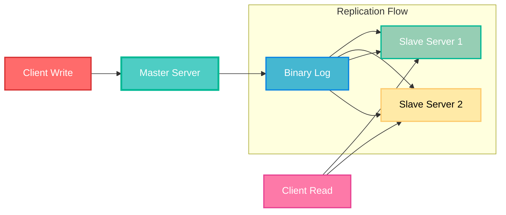
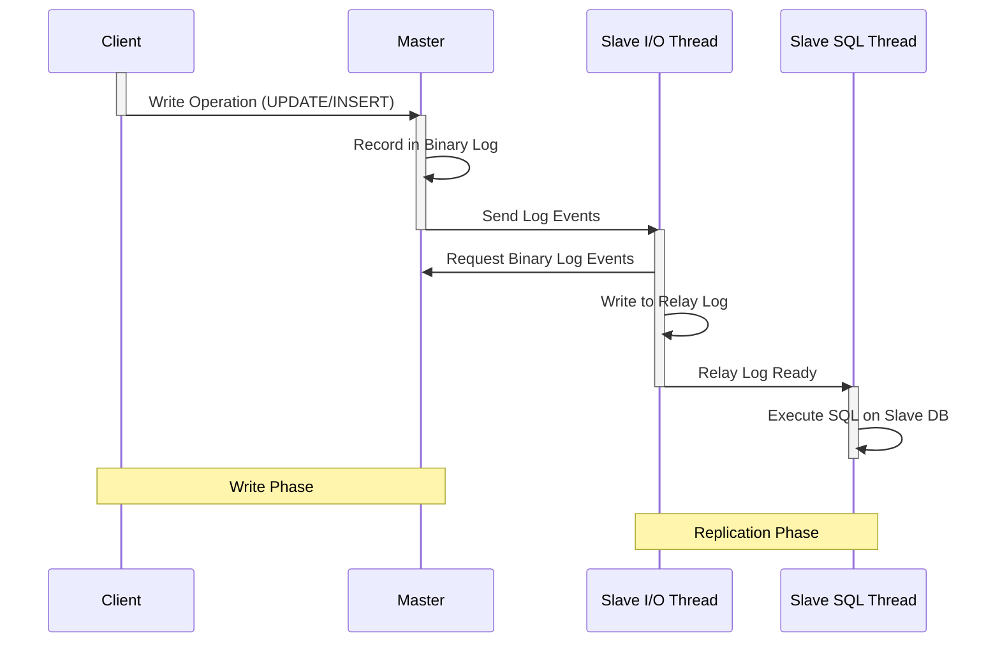
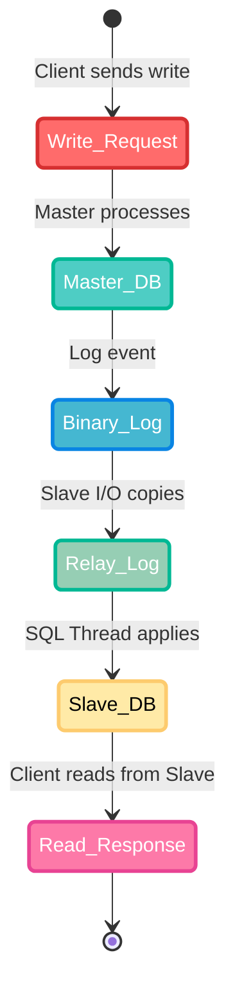
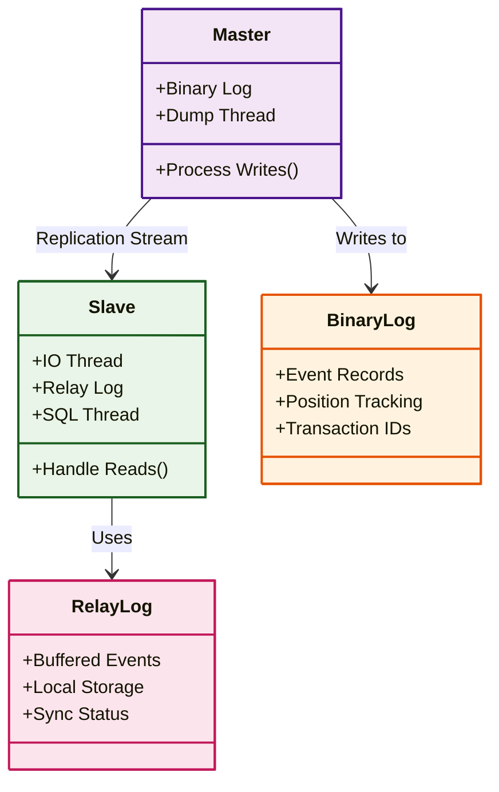
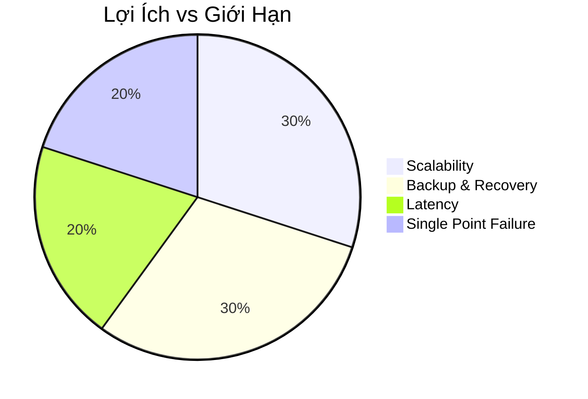
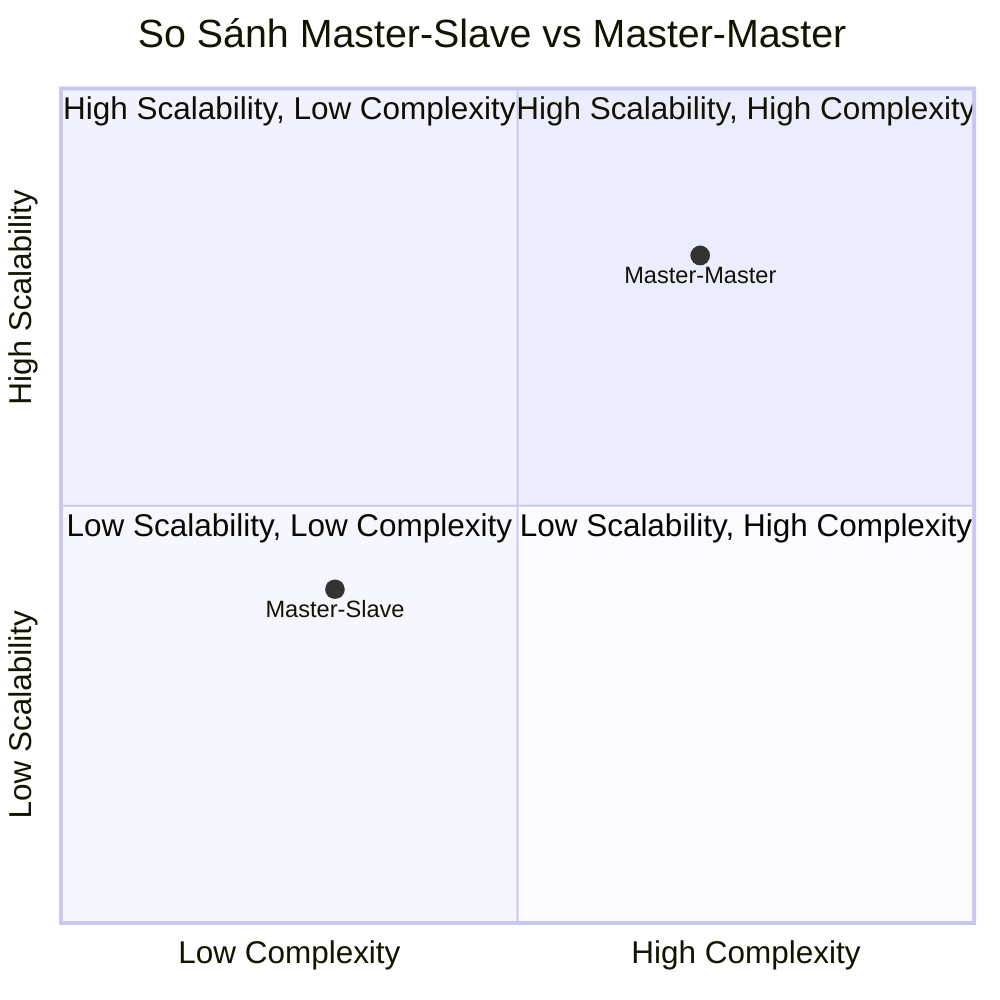
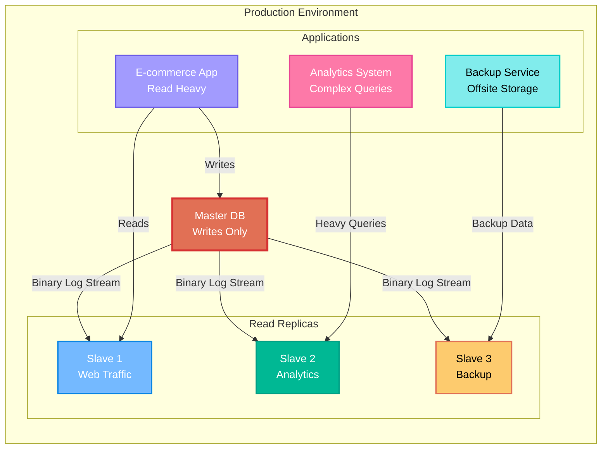
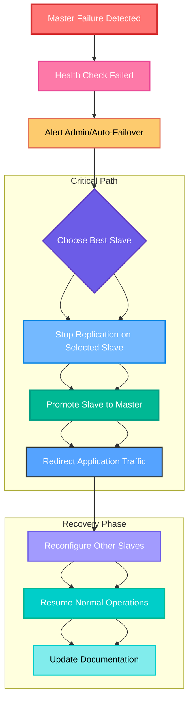
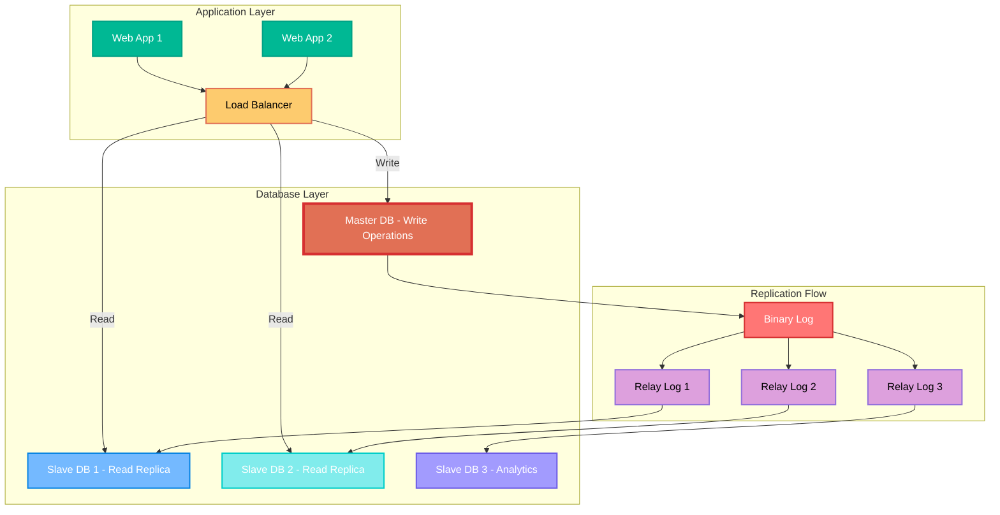

- [Mô Hình Master-Slave Trong Cơ Sở Dữ Liệu](#mô-hình-master-slave-trong-cơ-sở-dữ-liệu)
  - [**Giai Đoạn 1 – Khởi Động: Nắm Khái Niệm Cơ Bản**](#giai-đoạn-1--khởi-động-nắm-khái-niệm-cơ-bản)
  - [**Giai Đoạn 2 – Hiểu Sâu Cơ Chế Hoạt Động**](#giai-đoạn-2--hiểu-sâu-cơ-chế-hoạt-động)
  - [**Giai Đoạn 3 – Phân Tích Thành Phần Cốt Lõi**](#giai-đoạn-3--phân-tích-thành-phần-cốt-lõi)
  - [**Giai Đoạn 4 – Đánh Giá Lợi Ích Và Giới Hạn**](#giai-đoạn-4--đánh-giá-lợi-ích-và-giới-hạn)
  - [**Giai Đoạn 5 – Ứng Dụng Thực Tế Và Triển Khai**](#giai-đoạn-5--ứng-dụng-thực-tế-và-triển-khai)

### Mô Hình Master-Slave Trong Cơ Sở Dữ Liệu

#### **Giai Đoạn 1 – Khởi Động: Nắm Khái Niệm Cơ Bản**

**Nội dung phân tích:**  
Mô hình Master-Slave là một kiến trúc replication dữ liệu phổ biến trong cơ sở dữ liệu, nơi một server chính (Master) chịu trách nhiệm xử lý tất cả các hoạt động ghi (write operations như INSERT, UPDATE, DELETE), trong khi các server phụ (Slave) chỉ đọc (read operations như SELECT) và sao chép dữ liệu từ Master để đảm bảo tính nhất quán.  

- **Định nghĩa:** Master-Slave là mô hình phân cấp, nơi Master là "chủ" kiểm soát dữ liệu chính, và Slave là "nô lệ" replicate dữ liệu một chiều từ Master. Điều này giúp phân tải (load balancing) bằng cách đẩy các truy vấn đọc sang Slave, giảm tải cho Master.  
- **Kiến trúc và vai trò:** Master ghi dữ liệu vào binary log (nhật ký thay đổi), Slave kết nối để sao chép và áp dụng thay đổi. Vai trò: Master đảm bảo tính toàn vẹn dữ liệu (ACID), Slave hỗ trợ scalability ngang (horizontal scaling) cho đọc. Đây là mô hình asynchronous replication mặc định, nghĩa là Slave có thể lag một chút so với Master.

**Mermaid sơ đồ:**  
Sử dụng **flowchart** để minh họa quan hệ Master → Slave (hướng một chiều).

---

#### **Giai Đoạn 2 – Hiểu Sâu Cơ Chế Hoạt Động**

**Nội dung phân tích:**  
Cơ chế hoạt động dựa trên replication asynchronous (hoặc semi-synchronous tùy cấu hình). Quy trình chính là: Master ghi thay đổi vào binary log, Slave sử dụng I/O Thread để sao chép log vào relay log cục bộ, rồi SQL Thread áp dụng thay đổi vào database của Slave.  

- **Quy trình replication:**  
  1. Master ghi thay đổi (ví dụ: UPDATE) vào binary log dưới dạng sự kiện (events).  
  2. Slave kết nối Master qua I/O Thread, sao chép binary log vào relay log.  
  3. SQL Thread trên Slave đọc relay log và thực thi SQL để đồng bộ dữ liệu.  
- **Truyền dữ liệu một chiều và cơ chế đồng bộ:** Dữ liệu chỉ chảy từ Master sang Slave (không ngược lại), đảm bảo Master là nguồn chân lý duy nhất. Đồng bộ dựa trên vị trí log (log position), Slave theo dõi để tránh duplicate hoặc miss data. Nếu Slave disconnect, nó sẽ resume từ vị trí cuối cùng.

**Mermaid sơ đồ:**  
- **sequenceDiagram** mô tả tiến trình replication từng bước.

- **stateDiagram-v2** mô tả trạng thái dữ liệu (viết → log → đọc).

---

#### **Giai Đoạn 3 – Phân Tích Thành Phần Cốt Lõi**

**Nội dung phân tích:**  
Các thành phần chính trong replication Master-Slave bao gồm:  
- **Binary Log:** Nhật ký nhị phân trên Master, lưu trữ tất cả thay đổi dữ liệu dưới dạng events (không phải SQL raw để tránh vấn đề tương thích).  
- **I/O Thread:** Trên Slave, chịu trách nhiệm kết nối Master, đọc binary log và ghi vào relay log.  
- **Relay Log:** File tạm trên Slave, lưu trữ bản sao của binary log trước khi áp dụng.  
- **SQL Thread:** Trên Slave, đọc relay log và thực thi SQL để cập nhật database.  

Cách phối hợp: Binary Log là nguồn, I/O Thread đảm bảo truyền dữ liệu, Relay Log làm buffer để tránh mất mát, SQL Thread đảm bảo áp dụng nhất quán. Để giữ dữ liệu nhất quán, sử dụng GTID (Global Transaction ID) hoặc log position; nếu có xung đột, cần can thiệp thủ công.

**Mermaid sơ đồ:**  
- **block diagram** (sử dụng classDiagram để mô tả cấu trúc và kết nối, vì Mermaid không có block chính thức nhưng classDiagram phù hợp cho components).

---

#### **Giai Đoạn 4 – Đánh Giá Lợi Ích Và Giới Hạn**

**Nội dung phân tích:**  
- **Ưu điểm:**  
  - Scalability: Dễ mở rộng đọc bằng cách thêm Slave, lý tưởng cho workload read-heavy (ví dụ: 80% read, 20% write).  
  - Backup: Slave có thể dùng làm backup nóng (hot backup) mà không ảnh hưởng Master.  
  - Disaster Recovery: Hỗ trợ failover (thăng cấp Slave thành Master nếu Master fail), giảm downtime.  
- **Nhược điểm:**  
  - Latency: Slave có thể lag (replication delay), dẫn đến dữ liệu không nhất quán tạm thời.  
  - Chỉ chống lỗi cho workload đọc: Không hỗ trợ write scalability; Master là single point of failure. Không phù hợp cho write-heavy hoặc cần high availability write.  

So sánh với Master-Master (multi-master): Master-Slave đơn giản hơn nhưng kém linh hoạt (không hỗ trợ write hai chiều).

**Mermaid sơ đồ:**  
- **pie chart** trực quan lợi ích vs giới hạn (giả sử tỷ lệ dựa trên phân tích chung: 60% lợi ích, 40% giới hạn).

- **quadrantChart** so sánh với Master-Master.

---

#### **Giai Đoạn 5 – Ứng Dụng Thực Tế Và Triển Khai**

**Nội dung phân tích:**  
- **Trường hợp sử dụng thực tế:**  
  - Web app: Như e-commerce (Amazon-style), nơi read (xem sản phẩm) nhiều hơn write (mua hàng).  
  - Hệ thống đọc lớn: Analytics, reporting từ Slave để tránh tải Master.  
  - Backup cluster: Sử dụng Slave cho offsite backup hoặc geo-replication.  
- **Cách triển khai trong MySQL / PostgreSQL:**  
  - **MySQL:** Bật binary log trên Master (`log_bin=ON`), tạo user replication, trên Slave dùng `CHANGE MASTER TO MASTER_HOST='master_ip', MASTER_USER='repl', MASTER_PASSWORD='pass'; START SLAVE;`. Giám sát bằng `SHOW SLAVE STATUS;`.  
  - **PostgreSQL:** Sử dụng streaming replication: Cấu hình `wal_level = replica` trên Master, tạo replication slot, trên Slave dùng `pg_basebackup` rồi chỉnh `primary_conninfo` trong `postgresql.conf` và restart.  

Failover: Nếu Master fail, thăng cấp Slave (dùng `STOP SLAVE; RESET MASTER;`) và redirect traffic.

**Mermaid sơ đồ:**  
- **Flowchart** mô tả triển khai thực tế với các use case:

- **Flowchart** cho kịch bản failover:

- **Flowchart** Kiến trúc triển khai thực tế:

