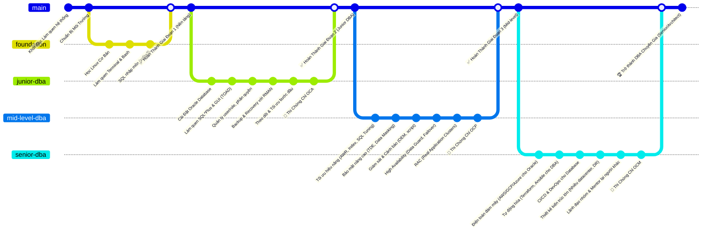
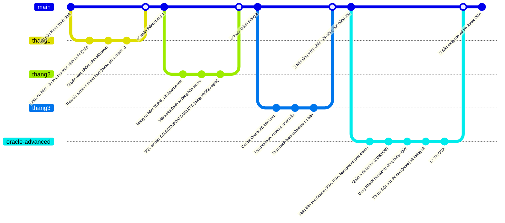
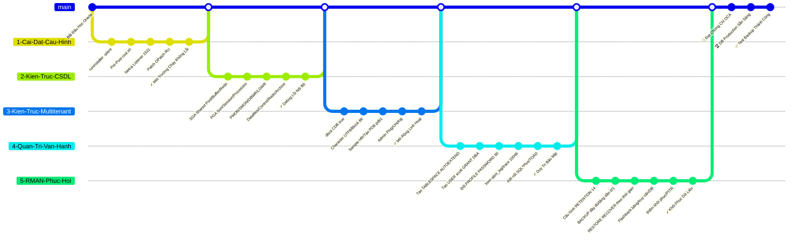
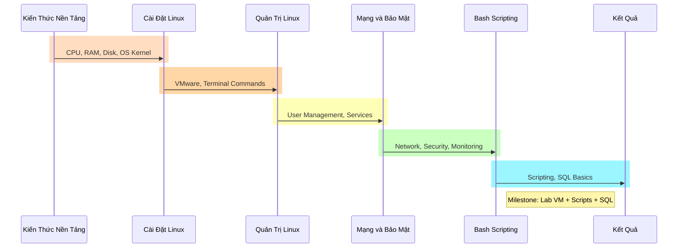

- [**I. Lộ trình tổng quan**](#i-lộ-trình-tổng-quan)
  - [**1. Foundation (3 tháng)**](#1-foundation-3-tháng)
  - [**2. Junior DBA – Setup \& Vận Hành Oracle (6 tháng)**](#2-junior-dba--setup--vận-hành-oracle-6-tháng)
  - [**3. Mid-Level DBA – Tối Ưu \& Bảo Vệ (9 tháng)**](#3-mid-level-dba--tối-ưu--bảo-vệ-9-tháng)
  - [**4. Senior DBA – Cloud \& Tự Động Hóa (Liên tục)**](#4-senior-dba--cloud--tự-động-hóa-liên-tục)
- [**II. Giai Đoạn 1: FOUNDATION**](#ii-giai-đoạn-1-foundation)

---

# **I. Lộ trình tổng quan**

**Giải thích các giai đoạn:**

* **Giai đoạn 1 – Nền tảng (khoảng 3-6 tháng):** Mục tiêu xây nền kiến thức IT vững chắc trước khi vào Oracle. Bao gồm:

* Kiến thức cơ bản về hệ thống: hiểu nguyên lý OS (CPU, RAM, Disk, Process…).

* Học **Linux cơ bản**: cài đặt Linux (dùng máy ảo VirtualBox để tránh rủi ro), các lệnh terminal, quản lý thư mục, tệp, quyền (chmod/chown)…

* Học **SQL căn bản** với SQLite hoặc MySQL đơn giản để nắm các lệnh SELECT, JOIN, v.v.

* Hiểu về mạng và giao thức cơ bản (TCP/IP, port), vì DBA cần cấu hình kết nối mạng DB.

* Học viết **bash shell script** đơn giản để sau này tự động hóa tác vụ (monitoring, backup script).

* *Kết quả:* Bạn có thể cài một server Linux, thao tác hệ thống trơn tru, viết script cơ bản và sử dụng thành thạo các lệnh SQL đơn giản. Đây là “móng” vững để bước tiếp.

* **Giai đoạn 2 – Junior DBA (6-12 tháng):** Bắt đầu đi sâu vào Oracle:

* Cài đặt Oracle Database (bản Express hoặc Standard) để hiểu quá trình cài DB.

* Hiểu kiến trúc Oracle: khái niệm CDB (Container Database) và PDB (Pluggable Database) nếu dùng Oracle 12c+, hoặc ít nhất là các thành phần của instance (SGA, PGA, background processes như PMON, SMON, DBWR, LGWR; các file controlfile, datafile, redo log, archive log…).

* Học cách tạo **tablespace**, người dùng (USER), phân quyền (ROLE, PRIVILEGE).

* Làm quen công cụ **SQL*Plus** (giao diện dòng lệnh) và một công cụ GUI (ví dụ Oracle SQL Developer hoặc TOAD) để thao tác DB.

* Học **backup/restore với RMAN**: cách backup full, incremental, restore database khi sự cố, dùng flashback để phục hồi dữ liệu lỡ xóa…

* Thực hành theo dõi **alert log**, các file log của Oracle để biết xử lý lỗi cơ bản.

* Sau giai đoạn này, nên thi chứng chỉ Oracle OCA (Oracle Certified Associate) để kiểm tra kiến thức căn bản về SQL và quản trị Oracle.

* *Kết quả:* Bạn có thể vận hành một Oracle DB đơn giản: cài đặt, tạo user/schema, backup và phục hồi khi cần. Đủ kiến thức để làm một DBA level Junior.

* **Giai đoạn 3 – Mid-Level DBA (9-12 tháng):** Nâng cao và mở rộng:

* **Tuning (Tối ưu hiệu năng):** Học cách đọc báo cáo AWR (Automatic Workload Repository), sử dụng công cụ **EXPLAIN PLAN**, tạo các **Index** phù hợp, tối ưu câu SQL, partition table để tăng tốc, sử dụng các thống kê (histogram) để Oracle tối ưu plan tốt hơn. Mục tiêu giảm thời gian chạy query, xử lý được các trường hợp chậm.

* **Security (Bảo mật nâng cao):** Triển khai **TDE (Transparent Data Encryption)** để mã hóa dữ liệu nhạy cảm, dùng **Data Redaction, Virtual Private Database (VPD)** để ẩn dữ liệu tùy người dùng. Cấu hình audit (theo dõi ai làm gì trong DB). Hiểu và sử dụng **Oracle Vault** nếu có.

* **Monitoring (Giám sát):** Dùng **Oracle Enterprise Manager (OEM)** hoặc viết script tự giám sát sức khỏe DB (đen tiến trình, dung lượng, hiệu năng). Thiết lập cảnh báo qua email khi có sự cố (đầy không gian, long running query…).

* **High Availability (Khả dụng cao):** Học về **Oracle Data Guard** (dựng một standby database, cấu hình đồng bộ log để sẵn sàng failover nếu DB chính gặp sự cố). Thực hành switchover, failover giữa primary và standby.

* **RAC (Real Application Clusters):** Nếu có điều kiện, tìm hiểu Oracle RAC – chạy DB trên nhiều node để đảm bảo cân bằng tải và dự phòng. Học cách cài RAC (khá phức tạp) hoặc ít nhất hiểu khái niệm về **Cluster, Oracle Grid Infrastructure, ASM (Automatic Storage Management)**…

* Song song, có thể học thêm các công cụ ETL và Data Warehouse tuning nếu công việc hướng về phân tích dữ liệu (ví dụ: tối ưu *dữ liệu hàng tỷ bản ghi*).

* Cuối giai đoạn này, thi chứng chỉ Oracle OCP (Professional) để chứng minh kiến thức nâng cao.

* *Kết quả:* Bạn có thể quản trị các hệ thống Oracle lớn: đảm bảo hiệu năng (tuning SQL, memory, kết nối), bảo mật dữ liệu ở mức cao, có phương án dự phòng khi hệ thống lỗi. Bạn trở thành một DBA có kinh nghiệm, sẵn sàng xử lý các tình huống phức tạp.

* **Giai đoạn 4 – Senior DBA / DBA Architect (liên tục, 1-2 năm+):** Trình độ chuyên gia:

* **Kiến trúc tổng thể & thiết kế giải pháp:** Tham gia thiết kế hệ thống CSDL lớn cho doanh nghiệp: nhiều data center, cluster, phương án backup nhiều tầng, giải pháp scaling (sharding, phân vùng dữ liệu theo địa lý…).

* **Cloud & Automation:** Học và triển khai Oracle trên cloud (AWS RDS Oracle, Oracle Cloud – OCI, Azure Database). Biết so sánh ưu nhược điểm chạy on-prem vs cloud. Làm các dự án **migration** đưa dữ liệu từ data center lên cloud.

* Sử dụng **Terraform/Ansible** để tự động hóa việc tạo và cấu hình database, thiết lập backup, user… (IaC – Infrastructure as Code cho mảng database).

* Tích hợp với quy trình **CI/CD**: sử dụng các công cụ như Liquibase hoặc Flyway để quản lý version schema DB, phối hợp với đội developer trong quy trình phát triển phần mềm nhanh.

* **Soft skills:** Học cách **leader một nhóm DBA**, chuẩn hóa quy trình vận hành, đào tạo junior, cũng như kỹ năng tư vấn cho kiến trúc sư hệ thống, quản lý cấp cao về giải pháp CSDL.

* Chứng chỉ OCM (Oracle Certified Master) có thể là mục tiêu cao nhất về chuyên môn.

* *Kết quả:* Bạn không chỉ vận hành mà còn có thể **thiết kế hệ thống CSDL toàn diện**, đảm bảo tính sẵn sàng, bảo mật, hiệu năng cho những ứng dụng quan trọng. Bạn cũng có thể hướng tới vai trò kiến trúc sư dữ liệu hoặc quản lý nhóm DBA.

## **1. Foundation (3 tháng)**

**Tháng 1 - Hệ thống & Linux cơ bản:**
- **Hệ thống cơ bản**: Giám sát CPU/RAM/Disk thay vì chỉ cấu trúc thư mục [1]
- **Cài & dùng Linux**: Sử dụng VirtualBox để thực hành thay vì chỉ lệnh terminal [2]  
- **Quản trị user/service**: Tập trung vào systemctl và useradd thay vì chmod/chown [1]

**Tháng 2 - Mạng & Scripting:**
- **Mạng cơ bản**: Thêm port scan với nmap thay vì chỉ TCP/IP và Apache [3]
- **Bash script**: Giữ nguyên nhưng tập trung tự động hóa
- **SQL cơ bản**: Chuyển từ MySQL sang sqlite3 như yêu cầu [4]

**Tháng 3 - Thực chiến:**
- **Cài máy chủ**: Tập trung vào production-ready setup
- **Script giám sát**: Thay vì Oracle XE, tạo script giám sát hệ thống
- **Query optimization**: Thay vì backup/restore, tập trung vào tối ưu query

> **✅ Kết quả:** Cài máy chủ, script giám sát, query được, sẵn sàng học Oracle

## **2. Junior DBA – Setup & Vận Hành Oracle (6 tháng)**

- Cài Oracle, hiểu kiến trúc CDB/PDB
- Tạo user, trace log, role
- Backup/restore bằng RMAN
    
> **✅ Kết quả:** DB ổn định, phục hồi ok, đạt OCA

## **3. Mid-Level DBA – Tối Ưu & Bảo Vệ (9 tháng)**

- SQL/Instance tuning (AWR/ASH)
- Security nâng cao (TDE/VPD)
- Giám sát alert, OEM
- HA với Data Guard/RAC
- ETL & warehouse tuning
    
> **✅ Kết quả:** Giảm 70% time, HA ổn, đạt OCP, báo cáo tuning

```mermaid
gitGraph
  commit id: "Bắt Đầu Oracle Nâng Cao"
  
  branch "1-SQL-Tuning"
  checkout "1-SQL-Tuning"
  commit id: "EXPLAIN PLAN/DBMS_XPLAN"
  commit id: "Tạo Index B-tree/Bitmap"
  commit id: "Histogram DBMS_STATS"
  commit id: "Partition Range/List/Hash"
  commit id: "Materialized Views Refresh"
  commit id: "Statspack spreport"
  commit id: "✓ Giảm Thời Gian Query"
  
  checkout main
  merge "1-SQL-Tuning"
  
  branch "2-Instance-Tuning"
  checkout "2-Instance-Tuning"
  commit id: "Điều chỉnh db_cache_size"
  commit id: "Xem v$system_event Waits"
  commit id: "Latch v$latch phân tích"
  commit id: "AWR awrrpt báo cáo"
  commit id: "ADDM dba_advisor"
  commit id: "ASH v$active_session_history"
  commit id: "✓ Tối Ưu Memory Bottleneck"
  
  checkout main
  merge "2-Instance-Tuning"
  
  branch "3-Security-Nang-Cao"
  checkout "3-Security-Nang-Cao"
  commit id: "TLS sqlnet.ora Wallet"
  commit id: "ACL DBMS_NETWORK_ACL_ADMIN"
  commit id: "Audit SELECT/Password Policy"
  commit id: "TDE AES256 mã hóa"
  commit id: "VPD DBMS_RLS/FGA DBMS_FGA"
  commit id: "Database Vault/Unified Auditing"
  commit id: "✓ Chống Leak Tuân Thủ"
  
  checkout main
  merge "3-Security-Nang-Cao"
  
  branch "4-Giam-Sat"
  checkout "4-Giam-Sat"
  commit id: "Alert ADRCI purge"
  commit id: "OEM emctl oms"
  commit id: "Custom v$sysmetric"
  commit id: "Log lsnrctl kiểm tra"
  commit id: "Audit Purge dọn dẹp"
  commit id: "✓ Cảnh Báo Sớm Vấn Đề"
  
  checkout main
  merge "4-Giam-Sat"
  
  branch "5-Data-Guard-HA"
  checkout "5-Data-Guard-HA"
  commit id: "Primary FORCE LOGGING"
  commit id: "Standby DUPLICATE"
  commit id: "DGMGRL đồng bộ"
  commit id: "Validate Switchover"
  commit id: "Test Failover"
  commit id: "Far Sync Active"
  commit id: "✓ Recovery Zero Loss"
  
  checkout main
  merge "5-Data-Guard-HA"
  
  branch "6-RAC-HA"
  checkout "6-RAC-HA"
  commit id: "Grid crsctl quản lý"
  commit id: "ASM mkdg tạo diskgroup"
  commit id: "srvctl add service"
  commit id: "Cache Fusion GCS"
  commit id: "Interconnect cấu hình"
  commit id: "✓ Scale Horizontal Load"
  
  checkout main
  merge "6-RAC-HA"
  
  branch "7-Data-Warehousing"
  checkout "7-Data-Warehousing"
  commit id: "Partition Bitmap Index"
  commit id: "ETL Load Test"
  commit id: "Query tối ưu lớn"
  commit id: "✓ Xử Lý Dữ Liệu Lớn"
  
  checkout main
  merge "7-Data-Warehousing"
  
  commit id: "🎯 Đạt Chứng Chỉ OCP"
  commit id: "🏆 Hệ Thống Tối Ưu HA"
  commit id: "⚡ Tune Giảm 70% Thời Gian"
  commit id: "🔄 Failover Test Thành Công"
  commit id: "📊 Warehouse Query Hoàn Hảo"
  commit id: "🎤 Trình Bày Tuning Report"
``` 

## **4. Senior DBA – Cloud & Tự Động Hóa (Liên tục)**

- Thiết kế HA (RAC/Data Guard)
- Terraform/Ansible tự động hoá
- CI/CD với Liquibase/Flyway
- Cloud OCI/AWS, migration
    
> **✅ Kết quả:** Tư vấn giải pháp, đạt OCM

```mermaid
gitGraph
  commit id: "Bắt Đầu Oracle Chuyên Gia"
  
  branch "1-Tinh-San-Sang-Cao-HA"
  checkout "1-Tinh-San-Sang-Cao-HA"
  commit id: "Data Guard Far Sync Active"
  commit id: "Broker FSFO tự động"
  commit id: "RAC Grid ASM Flex"
  commit id: "GCS Interconnect"
  commit id: "Long Distance Test"
  commit id: "Observer Tune"
  commit id: "✓ Zero Downtime Scale"
  
  checkout main
  merge "1-Tinh-San-Sang-Cao-HA"
  
  branch "2-Bao-Mat-Chuyen-Sau"
  checkout "2-Bao-Mat-Chuyen-Sau"
  commit id: "VPD DBMS_RLS nâng cao"
  commit id: "FGA DBMS_FGA theo dõi"
  commit id: "Database Vault Realms"
  commit id: "Unified Auditing enabled"
  commit id: "Policy Sensitive Block"
  commit id: "Handler Custom"
  commit id: "✓ Fine Control Tuân Thủ"
  
  checkout main
  merge "2-Bao-Mat-Chuyen-Sau"
  
  branch "3-Hoach-Dinh-Nang-Luc"
  checkout "3-Hoach-Dinh-Nang-Luc"
  commit id: "AWR Trend phân tích tăng"
  commit id: "Khuyến nghị Hardware"
  commit id: "Storage/Cloud Migration"
  commit id: "Cost OCI/AWS Reserved"
  commit id: "Analyze Growth dự báo"
  commit id: "ROI Calc tư vấn"
  commit id: "✓ Dự Báo Tiết Kiệm"
  
  checkout main
  merge "3-Hoach-Dinh-Nang-Luc"
  
  branch "4-Tu-Dong-Hoa-IaC"
  checkout "4-Tu-Dong-Hoa-IaC"
  commit id: "Playbook ansible-galaxy"
  commit id: "Role-oracle tasks yum"
  commit id: "User install Data Guard"
  commit id: "Terraform resource oci_database"
  commit id: "Shape VM.Standard2.1"
  commit id: "Galaxy Custom Role"
  commit id: "✓ IaC Đa Server"
  
  checkout main
  merge "4-Tu-Dong-Hoa-IaC"
  
  branch "5-Tich-Hop-CI-CD-DevOps"
  checkout "5-Tich-Hop-CI-CD-DevOps"
  commit id: "Liquibase Changeset XML"
  commit id: "Contexts Rollback"
  commit id: "Flyway Migrations SQL"
  commit id: "Callbacks pipeline"
  commit id: "GitHub Actions sh update"
  commit id: "Scans trivy bảo mật"
  commit id: "✓ Schema Team Workflow"
  
  checkout main
  merge "5-Tich-Hop-CI-CD-DevOps"
  
  branch "6-Quan-Tri-Cloud"
  checkout "6-Quan-Tri-Cloud"
  commit id: "AWS RDS Multi-AZ"
  commit id: "Azure SQL quản lý"
  commit id: "OCI Autonomous Scaling"
  commit id: "Patching tự động"
  commit id: "Migration Lift-Shift"
  commit id: "Replatform Strategy"
  commit id: "✓ Hybrid Modern"
  
  checkout main
  merge "6-Quan-Tri-Cloud"
  
  commit id: "🎯 Đạt Chứng Chỉ OCM"
  commit id: "🏗️ Thiết Kế Hệ Thống Lớn"
  commit id: "🤖 Tự Động Hóa Hoàn Toàn"
  commit id: "👥 Lead Team Chuyên Nghiệp"
  commit id: "☁️ Deploy Cloud RAC CI/CD"
  commit id: "🔒 Trivy Security Scan"
  commit id: "💼 Tư Vấn Migration"
  commit id: "🎤 Solution Presentation"
``` 

# **II. Giai Đoạn 1: FOUNDATION**

- Sơ đồ này trình bày thứ tự liên kết các phần nội dung học với công cụ mở rộng như nmap/sqlite3. Mục tiêu học là thành thạo terminal và scripting cơ bản với port scan. Sau khi học xong, người học đạt kỹ năng debug hệ thống độc lập, sẵn sàng cho Oracle với lab test nmap/query

