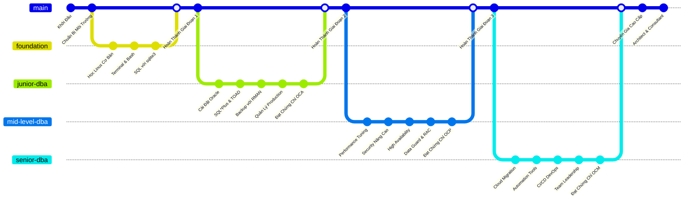
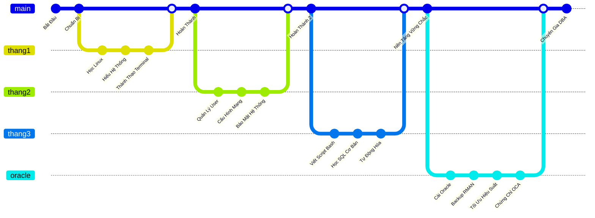
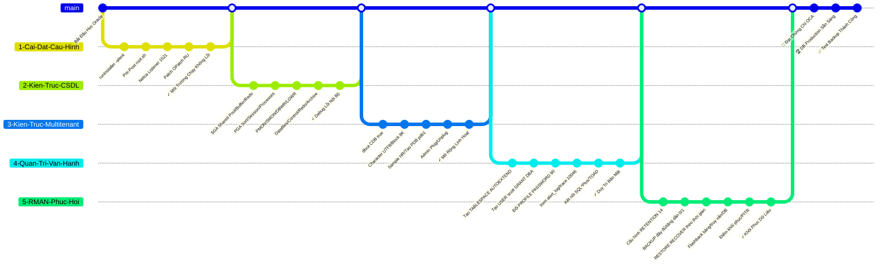
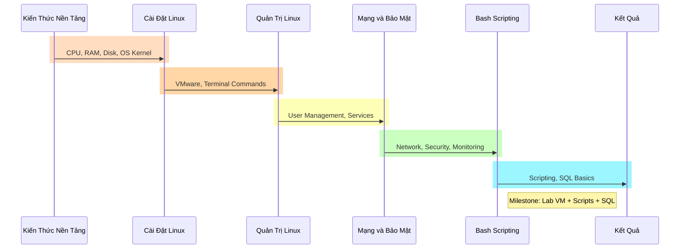

# **I. Lộ trình tổng quan**

## **1. Foundation (3 tháng)**

- Hệ thống cơ bản (CPU/RAM/Disk)
- Cài & dùng Linux (VirtualBox)
- Quản trị user/service
- Mạng cơ bản, port scan (nmap)
- Bash script, SQL cơ bản (sqlite3)

> **✅ Kết quả:** Cài máy chủ, script giám sát, query được, sẵn sàng học Oracle

## **2. Junior DBA – Setup & Vận Hành Oracle (6 tháng)**

- Cài Oracle, hiểu kiến trúc CDB/PDB
- Tạo user, trace log, role
- Backup/restore bằng RMAN
    
> **✅ Kết quả:** DB ổn định, phục hồi ok, đạt OCA

## **3. Mid-Level DBA – Tối Ưu & Bảo Vệ (9 tháng)**

- SQL/Instance tuning (AWR/ASH)
- Security nâng cao (TDE/VPD)
- Giám sát alert, OEM
- HA với Data Guard/RAC
- ETL & warehouse tuning
    
> **✅ Kết quả:** Giảm 70% time, HA ổn, đạt OCP, báo cáo tuning

```mermaid
gitGraph
  commit id: "Bắt Đầu Oracle Nâng Cao"
  
  branch "1-SQL-Tuning"
  checkout "1-SQL-Tuning"
  commit id: "EXPLAIN PLAN/DBMS_XPLAN"
  commit id: "Tạo Index B-tree/Bitmap"
  commit id: "Histogram DBMS_STATS"
  commit id: "Partition Range/List/Hash"
  commit id: "Materialized Views Refresh"
  commit id: "Statspack spreport"
  commit id: "✓ Giảm Thời Gian Query"
  
  checkout main
  merge "1-SQL-Tuning"
  
  branch "2-Instance-Tuning"
  checkout "2-Instance-Tuning"
  commit id: "Điều chỉnh db_cache_size"
  commit id: "Xem v$system_event Waits"
  commit id: "Latch v$latch phân tích"
  commit id: "AWR awrrpt báo cáo"
  commit id: "ADDM dba_advisor"
  commit id: "ASH v$active_session_history"
  commit id: "✓ Tối Ưu Memory Bottleneck"
  
  checkout main
  merge "2-Instance-Tuning"
  
  branch "3-Security-Nang-Cao"
  checkout "3-Security-Nang-Cao"
  commit id: "TLS sqlnet.ora Wallet"
  commit id: "ACL DBMS_NETWORK_ACL_ADMIN"
  commit id: "Audit SELECT/Password Policy"
  commit id: "TDE AES256 mã hóa"
  commit id: "VPD DBMS_RLS/FGA DBMS_FGA"
  commit id: "Database Vault/Unified Auditing"
  commit id: "✓ Chống Leak Tuân Thủ"
  
  checkout main
  merge "3-Security-Nang-Cao"
  
  branch "4-Giam-Sat"
  checkout "4-Giam-Sat"
  commit id: "Alert ADRCI purge"
  commit id: "OEM emctl oms"
  commit id: "Custom v$sysmetric"
  commit id: "Log lsnrctl kiểm tra"
  commit id: "Audit Purge dọn dẹp"
  commit id: "✓ Cảnh Báo Sớm Vấn Đề"
  
  checkout main
  merge "4-Giam-Sat"
  
  branch "5-Data-Guard-HA"
  checkout "5-Data-Guard-HA"
  commit id: "Primary FORCE LOGGING"
  commit id: "Standby DUPLICATE"
  commit id: "DGMGRL đồng bộ"
  commit id: "Validate Switchover"
  commit id: "Test Failover"
  commit id: "Far Sync Active"
  commit id: "✓ Recovery Zero Loss"
  
  checkout main
  merge "5-Data-Guard-HA"
  
  branch "6-RAC-HA"
  checkout "6-RAC-HA"
  commit id: "Grid crsctl quản lý"
  commit id: "ASM mkdg tạo diskgroup"
  commit id: "srvctl add service"
  commit id: "Cache Fusion GCS"
  commit id: "Interconnect cấu hình"
  commit id: "✓ Scale Horizontal Load"
  
  checkout main
  merge "6-RAC-HA"
  
  branch "7-Data-Warehousing"
  checkout "7-Data-Warehousing"
  commit id: "Partition Bitmap Index"
  commit id: "ETL Load Test"
  commit id: "Query tối ưu lớn"
  commit id: "✓ Xử Lý Dữ Liệu Lớn"
  
  checkout main
  merge "7-Data-Warehousing"
  
  commit id: "🎯 Đạt Chứng Chỉ OCP"
  commit id: "🏆 Hệ Thống Tối Ưu HA"
  commit id: "⚡ Tune Giảm 70% Thời Gian"
  commit id: "🔄 Failover Test Thành Công"
  commit id: "📊 Warehouse Query Hoàn Hảo"
  commit id: "🎤 Trình Bày Tuning Report"
``` 

## **4. Senior DBA – Cloud & Tự Động Hóa (Liên tục)**

- Thiết kế HA (RAC/Data Guard)
- Terraform/Ansible tự động hoá
- CI/CD với Liquibase/Flyway
- Cloud OCI/AWS, migration
    
> **✅ Kết quả:** Tư vấn giải pháp, đạt OCM

```mermaid
gitGraph
  commit id: "Bắt Đầu Oracle Chuyên Gia"
  
  branch "1-Tinh-San-Sang-Cao-HA"
  checkout "1-Tinh-San-Sang-Cao-HA"
  commit id: "Data Guard Far Sync Active"
  commit id: "Broker FSFO tự động"
  commit id: "RAC Grid ASM Flex"
  commit id: "GCS Interconnect"
  commit id: "Long Distance Test"
  commit id: "Observer Tune"
  commit id: "✓ Zero Downtime Scale"
  
  checkout main
  merge "1-Tinh-San-Sang-Cao-HA"
  
  branch "2-Bao-Mat-Chuyen-Sau"
  checkout "2-Bao-Mat-Chuyen-Sau"
  commit id: "VPD DBMS_RLS nâng cao"
  commit id: "FGA DBMS_FGA theo dõi"
  commit id: "Database Vault Realms"
  commit id: "Unified Auditing enabled"
  commit id: "Policy Sensitive Block"
  commit id: "Handler Custom"
  commit id: "✓ Fine Control Tuân Thủ"
  
  checkout main
  merge "2-Bao-Mat-Chuyen-Sau"
  
  branch "3-Hoach-Dinh-Nang-Luc"
  checkout "3-Hoach-Dinh-Nang-Luc"
  commit id: "AWR Trend phân tích tăng"
  commit id: "Khuyến nghị Hardware"
  commit id: "Storage/Cloud Migration"
  commit id: "Cost OCI/AWS Reserved"
  commit id: "Analyze Growth dự báo"
  commit id: "ROI Calc tư vấn"
  commit id: "✓ Dự Báo Tiết Kiệm"
  
  checkout main
  merge "3-Hoach-Dinh-Nang-Luc"
  
  branch "4-Tu-Dong-Hoa-IaC"
  checkout "4-Tu-Dong-Hoa-IaC"
  commit id: "Playbook ansible-galaxy"
  commit id: "Role-oracle tasks yum"
  commit id: "User install Data Guard"
  commit id: "Terraform resource oci_database"
  commit id: "Shape VM.Standard2.1"
  commit id: "Galaxy Custom Role"
  commit id: "✓ IaC Đa Server"
  
  checkout main
  merge "4-Tu-Dong-Hoa-IaC"
  
  branch "5-Tich-Hop-CI-CD-DevOps"
  checkout "5-Tich-Hop-CI-CD-DevOps"
  commit id: "Liquibase Changeset XML"
  commit id: "Contexts Rollback"
  commit id: "Flyway Migrations SQL"
  commit id: "Callbacks pipeline"
  commit id: "GitHub Actions sh update"
  commit id: "Scans trivy bảo mật"
  commit id: "✓ Schema Team Workflow"
  
  checkout main
  merge "5-Tich-Hop-CI-CD-DevOps"
  
  branch "6-Quan-Tri-Cloud"
  checkout "6-Quan-Tri-Cloud"
  commit id: "AWS RDS Multi-AZ"
  commit id: "Azure SQL quản lý"
  commit id: "OCI Autonomous Scaling"
  commit id: "Patching tự động"
  commit id: "Migration Lift-Shift"
  commit id: "Replatform Strategy"
  commit id: "✓ Hybrid Modern"
  
  checkout main
  merge "6-Quan-Tri-Cloud"
  
  commit id: "🎯 Đạt Chứng Chỉ OCM"
  commit id: "🏗️ Thiết Kế Hệ Thống Lớn"
  commit id: "🤖 Tự Động Hóa Hoàn Toàn"
  commit id: "👥 Lead Team Chuyên Nghiệp"
  commit id: "☁️ Deploy Cloud RAC CI/CD"
  commit id: "🔒 Trivy Security Scan"
  commit id: "💼 Tư Vấn Migration"
  commit id: "🎤 Solution Presentation"
``` 

# **Giai Đoạn 1: FOUNDATION**

- Sơ đồ này trình bày thứ tự liên kết các phần nội dung học với công cụ mở rộng như nmap/sqlite3. Mục tiêu học là thành thạo terminal và scripting cơ bản với port scan. Sau khi học xong, người học đạt kỹ năng debug hệ thống độc lập, sẵn sàng cho Oracle với lab test nmap/query

